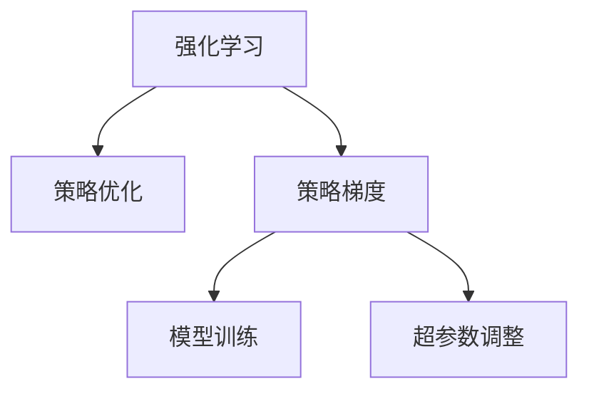
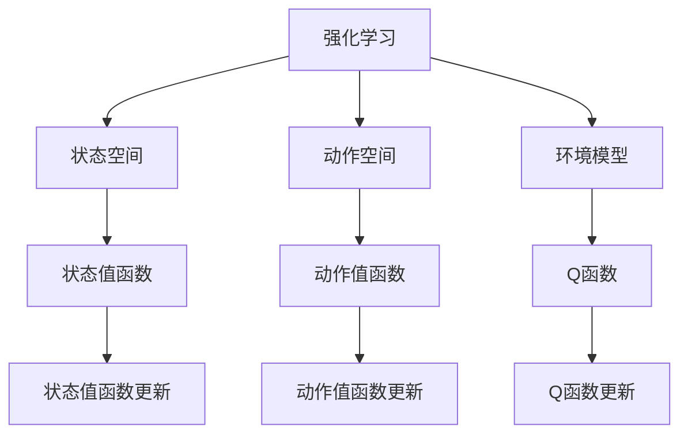
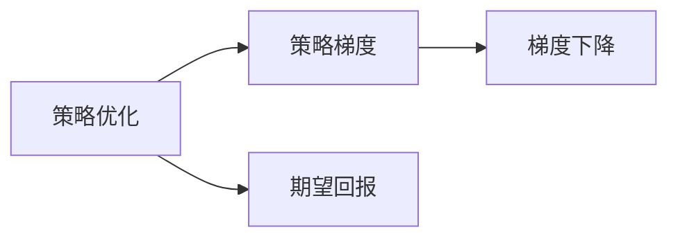
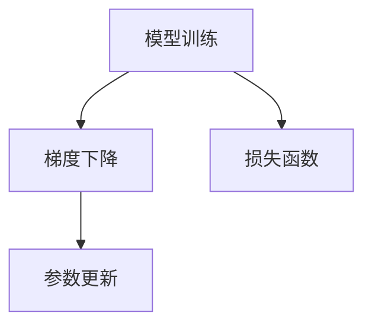
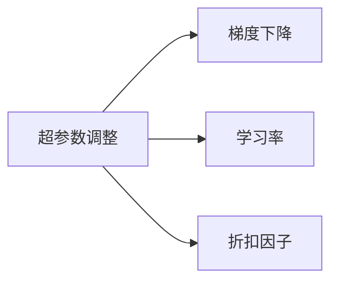
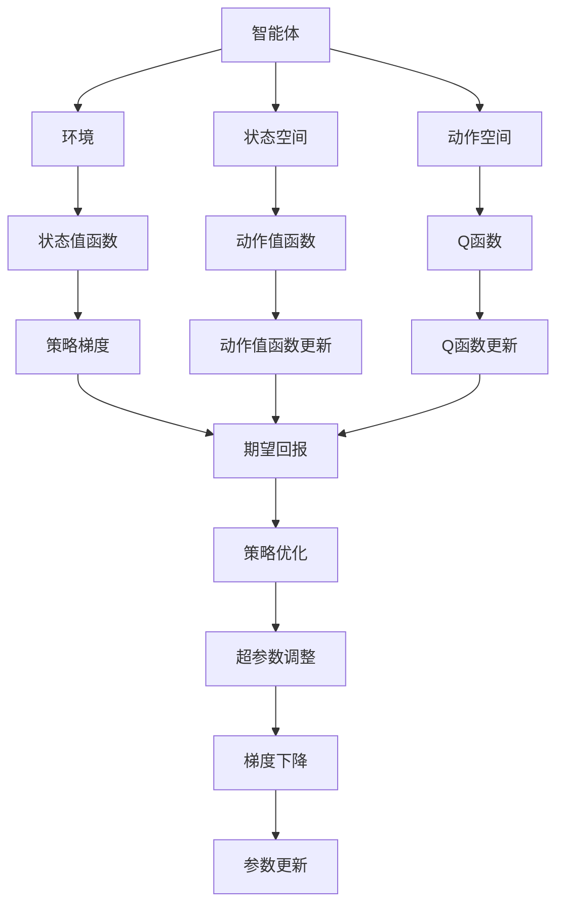

                 

# 强化学习Reinforcement Learning中梯度下降法的应用与优化

> 关键词：强化学习, 梯度下降法, 策略优化, 模型训练, 超参数调整

## 1. 背景介绍

### 1.1 问题由来

强化学习（Reinforcement Learning, RL）是机器学习领域的重要分支，它通过智能体（agent）与环境（environment）之间的交互，学习如何做出最优决策，以达到某种预期的目标。梯度下降法作为机器学习中广泛应用的一种优化算法，也在强化学习中占据着重要地位。

近年来，强化学习在自动驾驶、机器人控制、游戏AI等领域取得了显著的进展，其核心在于通过梯度下降法等优化算法，不断调整策略参数，以提升模型的学习效率和性能。梯度下降法在强化学习中的应用，能够帮助智能体更好地探索环境、理解状态空间，从而实现更优的决策。

### 1.2 问题核心关键点

强化学习中梯度下降法的应用，涉及以下几个核心问题：

- **策略优化**：如何通过梯度下降法优化策略参数，使得智能体能够最大化预期回报。
- **模型训练**：如何在强化学习环境中，利用梯度下降法训练模型，使其能够稳定地学习和适应环境。
- **超参数调整**：如何确定学习率、折扣因子等超参数，以提高模型的学习效率和稳定性。

这些问题直接影响到强化学习算法的性能，因此需要深入探讨梯度下降法在强化学习中的应用与优化。

### 1.3 问题研究意义

梯度下降法在强化学习中的应用，对于提升智能体的决策能力和适应性，具有重要意义：

1. **提升学习效率**：通过不断调整策略参数，梯度下降法能够快速收敛到最优解，提高学习效率。
2. **增强模型鲁棒性**：梯度下降法通过更新策略参数，使得智能体能够更好地应对环境变化，提高模型的鲁棒性。
3. **优化决策质量**：梯度下降法能够引导智能体做出更优的决策，提高任务完成的质量。
4. **促进算法创新**：梯度下降法在强化学习中的应用，催生了多种先进的算法，如深度强化学习、对抗强化学习等，为强化学习领域注入了新的活力。

## 2. 核心概念与联系

### 2.1 核心概念概述

为更好地理解梯度下降法在强化学习中的应用，本节将介绍几个密切相关的核心概念：

- **强化学习**：通过智能体与环境之间的交互，学习如何做出最优决策，以最大化预期回报的机器学习方法。
- **策略优化**：智能体学习策略的过程，目标是找到一个能够最大化预期回报的策略函数。
- **策略梯度**：智能体策略参数对预期回报的导数，即策略的梯度。
- **模型训练**：利用梯度下降法，更新模型参数以适应环境的过程。
- **超参数调整**：选择合适的学习率、折扣因子等超参数，以提高模型的学习效率和稳定性。

这些核心概念之间的逻辑关系可以通过以下Mermaid流程图来展示：



这个流程图展示了我强化学习、策略优化、策略梯度、模型训练和超参数调整之间的逻辑关系。

### 2.2 概念间的关系

这些核心概念之间存在着紧密的联系，形成了强化学习中梯度下降法的完整生态系统。下面我们通过几个Mermaid流程图来展示这些概念之间的关系。

#### 2.2.1 强化学习的学习范式



这个流程图展示强化学习的学习范式，包括状态空间、动作空间、环境模型、状态值函数、动作值函数和Q函数等核心概念。

#### 2.2.2 策略优化与策略梯度的关系



这个流程图展示策略优化与策略梯度的关系，策略优化通过策略梯度进行优化。

#### 2.2.3 模型训练与梯度下降的关系



这个流程图展示模型训练与梯度下降的关系，模型训练通过梯度下降进行参数更新。

#### 2.2.4 超参数调整与梯度下降的关系



这个流程图展示超参数调整与梯度下降的关系，超参数调整通过梯度下降进行参数更新。

### 2.3 核心概念的整体架构

最后，我们用一个综合的流程图来展示这些核心概念在强化学习中梯度下降法的整体架构：



这个综合流程图展示了从智能体到环境、状态空间、动作空间、状态值函数、动作值函数、Q函数、策略梯度、策略优化和超参数调整之间的整体架构，以及它们如何协同工作来优化策略。

## 3. 核心算法原理 & 具体操作步骤
### 3.1 算法原理概述

梯度下降法在强化学习中的应用，主要通过策略梯度方法来实现。策略梯度方法通过计算策略梯度，利用梯度下降法不断调整策略参数，以最大化预期回报。具体而言，策略梯度的定义为：

$$
\nabla_{\theta}J(\theta) = E_{s \sim p_{s},a \sim \pi_{\theta}(\cdot | s)}[Q(s,a)\nabla_{\theta}\log\pi_{\theta}(a|s)]
$$

其中，$J(\theta)$ 是策略函数 $\pi_{\theta}$ 的期望回报，$Q(s,a)$ 是状态动作值函数，$\log\pi_{\theta}(a|s)$ 是策略函数的自然对数，$\nabla_{\theta}$ 表示对策略函数参数 $\theta$ 的梯度。

梯度下降法的目标是通过不断更新策略参数，最小化策略梯度，从而最大化预期回报 $J(\theta)$。常用的梯度下降法包括政策梯度（Policy Gradient）、蒙特卡罗（Monte Carlo）策略梯度等，其中政策梯度方法的公式如下：

$$
\theta_{t+1} = \theta_t - \eta \nabla_{\theta}J(\theta)
$$

其中，$\eta$ 是学习率，$t$ 表示迭代次数。

### 3.2 算法步骤详解

基于策略梯度的强化学习，具体步骤包括：

**Step 1: 初始化策略参数**
- 设定策略函数 $\pi_{\theta}$ 的初始参数 $\theta$。

**Step 2: 模拟智能体行为**
- 根据当前策略 $\pi_{\theta}$，智能体从状态 $s$ 出发，选择一个动作 $a$，并在环境 $E$ 中执行该动作，获得新状态 $s'$ 和奖励 $r$。

**Step 3: 计算梯度**
- 根据状态动作值函数 $Q(s,a)$ 和策略函数 $\pi_{\theta}(a|s)$，计算策略梯度 $\nabla_{\theta}J(\theta)$。

**Step 4: 更新策略参数**
- 使用梯度下降法，更新策略参数 $\theta$，以最大化策略梯度。

**Step 5: 重复执行**
- 重复上述步骤，直到达到预设的迭代次数或策略参数收敛。

### 3.3 算法优缺点

梯度下降法在强化学习中的应用，具有以下优点：

- **简单高效**：梯度下降法的计算复杂度较低，易于实现。
- **稳定性**：通过调整超参数，可以控制学习速度，避免过拟合。
- **通用性**：适用于多种类型的强化学习问题，如连续动作空间、离散动作空间等。

同时，梯度下降法也存在一些缺点：

- **敏感于初始值**：初始策略参数的选择对梯度下降的收敛性和性能有重要影响。
- **局部最优**：梯度下降法容易陷入局部最优，需要适当的正则化方法来避免。
- **计算成本高**：大规模问题下的梯度计算复杂度较高，需要优化算法来提高效率。

### 3.4 算法应用领域

梯度下降法在强化学习中的应用，涉及以下领域：

- **自动驾驶**：用于控制无人驾驶车辆的行为决策，优化行驶策略。
- **机器人控制**：用于机器人臂的运动控制，优化操作动作。
- **游戏AI**：用于训练游戏角色的行为策略，优化游戏玩法。
- **推荐系统**：用于推荐系统的个性化推荐，优化用户行为。
- **金融投资**：用于量化交易策略的优化，提升投资收益。
- **供应链管理**：用于优化供应链的物流和库存管理策略。

这些领域都需要智能体根据环境反馈，不断优化策略，以最大化预期回报，梯度下降法为此提供了一种有效的优化手段。

## 4. 数学模型和公式 & 详细讲解  
### 4.1 数学模型构建

梯度下降法在强化学习中的应用，主要通过策略梯度方法来优化策略函数。策略梯度的定义如下：

$$
\nabla_{\theta}J(\theta) = E_{s \sim p_{s},a \sim \pi_{\theta}(\cdot | s)}[Q(s,a)\nabla_{\theta}\log\pi_{\theta}(a|s)]
$$

其中，$J(\theta)$ 是策略函数 $\pi_{\theta}$ 的期望回报，$Q(s,a)$ 是状态动作值函数，$\log\pi_{\theta}(a|s)$ 是策略函数的自然对数，$\nabla_{\theta}$ 表示对策略函数参数 $\theta$ 的梯度。

在实际应用中，$Q(s,a)$ 的计算通常采用蒙特卡罗方法、时间差分方法等，以估计策略梯度。梯度下降法的更新公式如下：

$$
\theta_{t+1} = \theta_t - \eta \nabla_{\theta}J(\theta)
$$

其中，$\eta$ 是学习率，$t$ 表示迭代次数。

### 4.2 公式推导过程

为了更好地理解策略梯度方法，我们以蒙特卡罗方法为例，进行策略梯度的推导。

假设智能体在环境 $E$ 中，从状态 $s$ 出发，执行动作 $a$，获得奖励 $r$，并到达新状态 $s'$。在蒙特卡罗方法中，策略梯度可以通过对所有可能的路径进行统计计算得到。设 $\tau = (s_0, a_0, r_1, s_1, a_1, \dots, s_T, a_T, r_{T+1})$ 表示一个完整的路径，其中 $s_t$ 和 $a_t$ 表示第 $t$ 个状态和动作，$r_{t+1}$ 表示第 $t+1$ 个时间步的奖励。

根据蒙特卡罗方法，策略梯度可以表示为：

$$
\nabla_{\theta}J(\theta) = \sum_{\tau} \frac{Q(\tau)}{p(\tau)} \nabla_{\theta}\log\pi_{\theta}(a_0|s_0)
$$

其中，$Q(\tau)$ 是路径 $\tau$ 的总奖励，$p(\tau)$ 是路径 $\tau$ 的概率。

根据马尔可夫性质，$p(\tau)$ 可以表示为：

$$
p(\tau) = \prod_{t=0}^{T}p(s_{t+1}|s_t,a_t)p(a_t|\theta)
$$

将 $p(\tau)$ 代入策略梯度的公式中，得：

$$
\nabla_{\theta}J(\theta) = \sum_{\tau} \frac{Q(\tau)}{p(\tau)} \nabla_{\theta}\log\pi_{\theta}(a_0|s_0) = \sum_{\tau} \frac{Q(\tau)}{\prod_{t=0}^{T}p(s_{t+1}|s_t,a_t)p(a_t|\theta)} \nabla_{\theta}\log\pi_{\theta}(a_0|s_0)
$$

进一步简化，得：

$$
\nabla_{\theta}J(\theta) = \sum_{\tau} Q(\tau) \nabla_{\theta}\log\pi_{\theta}(a_0|s_0)
$$

在实际应用中，$Q(\tau)$ 通常难以直接计算，可以通过蒙特卡罗方法、时间差分方法等近似估计。策略梯度的计算公式可以表示为：

$$
\nabla_{\theta}J(\theta) = \sum_{t=0}^{T} \frac{Q(s_t,a_t)}{\pi(a_t|s_t)} \nabla_{\theta}\log\pi_{\theta}(a_t|s_t)
$$

### 4.3 案例分析与讲解

为了更好地理解策略梯度方法的应用，我们以训练一个简单的马尔可夫决策过程（MDP）为例，进行详细讲解。

假设马尔可夫决策过程的状态空间为 $S$，动作空间为 $A$，策略函数为 $\pi_{\theta}$，状态值函数为 $V$，动作值函数为 $Q$。

假设智能体从状态 $s$ 出发，执行动作 $a$，获得奖励 $r$，并到达新状态 $s'$。在每个时间步 $t$，智能体根据策略 $\pi_{\theta}$ 选择一个动作 $a_t$，并根据状态值函数 $V$ 和动作值函数 $Q$ 计算总奖励 $Q(s_t,a_t)$。智能体的目标是通过梯度下降法优化策略函数 $\pi_{\theta}$，使得总奖励最大化。

在训练过程中，首先根据当前策略 $\pi_{\theta}$ 选择一个动作 $a$，并在状态 $s$ 上执行该动作，获得新状态 $s'$ 和奖励 $r$。然后，根据状态动作值函数 $Q(s,a)$ 和策略函数 $\pi_{\theta}(a|s)$，计算策略梯度 $\nabla_{\theta}J(\theta)$。

最后，使用梯度下降法，更新策略参数 $\theta$，以最大化策略梯度。重复上述步骤，直到达到预设的迭代次数或策略参数收敛。

## 5. 项目实践：代码实例和详细解释说明
### 5.1 开发环境搭建

在进行强化学习实践前，我们需要准备好开发环境。以下是使用Python进行OpenAI Gym开发的环境配置流程：

1. 安装Anaconda：从官网下载并安装Anaconda，用于创建独立的Python环境。

2. 创建并激活虚拟环境：
```bash
conda create -n reinforcement-env python=3.8 
conda activate reinforcement-env
```

3. 安装Gym：
```bash
pip install gym
```

4. 安装OpenAI Gym环境：
```bash
pip install gym[atari]
```

完成上述步骤后，即可在`reinforcement-env`环境中开始强化学习实践。

### 5.2 源代码详细实现

下面我们以训练一个简单的Q-learning代理为例，给出使用OpenAI Gym进行强化学习的PyTorch代码实现。

首先，导入必要的库和模块：

```python
import gym
import torch
import torch.nn as nn
import torch.optim as optim
from torch.autograd import Variable
import numpy as np
```

然后，定义Gym环境：

```python
env = gym.make('CartPole-v1')
```

接下来，定义模型：

```python
class QNetwork(nn.Module):
    def __init__(self, state_size, action_size):
        super(QNetwork, self).__init__()
        self.fc1 = nn.Linear(state_size, 64)
        self.fc2 = nn.Linear(64, action_size)

    def forward(self, x):
        x = self.fc1(x)
        x = torch.relu(x)
        x = self.fc2(x)
        return x

state_size = env.observation_space.shape[0]
action_size = env.action_space.n

model = QNetwork(state_size, action_size)
optimizer = optim.Adam(model.parameters(), lr=0.001)
```

然后，定义训练函数：

```python
def train episode_steps=2000, render=False, save_model=False, episode_save_freq=1000:
    state = env.reset()
    for i_episode in range(1, episode_steps + 1):
        state = torch.FloatTensor([state])
        if render:
            env.render()
        action_values = model(state)
        action = torch.max(action_values, dim=1)[1].item()
        next_state, reward, done, _ = env.step(action)
        state = next_state if not done else env.reset()
        if done:
            optimizer.zero_grad()
            Q_pred = model(torch.FloatTensor([state]))
            Q_target = torch.FloatTensor([reward])
            loss = (Q_pred - Q_target).mean()
            loss.backward()
            optimizer.step()
        if i_episode % episode_save_freq == 0:
            if save_model:
                torch.save(model.state_dict(), f'model_{i_episode:05d}.pth')
```

最后，进行训练：

```python
# 设置训练参数
render = True
save_model = True

# 进行训练
train()
```

以上就是使用PyTorch对Q-learning代理进行训练的完整代码实现。可以看到，借助OpenAI Gym和PyTorch，我们可以快速搭建并训练强化学习模型。

### 5.3 代码解读与分析

让我们再详细解读一下关键代码的实现细节：

**Gym环境定义**：
- `gym.make('CartPole-v1')`：定义了一个CartPole-v1环境，用于训练。

**QNetwork模型定义**：
- `QNetwork` 类定义了一个简单的Q-learning模型，包含两个全连接层。
- `state_size` 和 `action_size` 分别表示状态空间大小和动作空间大小，根据环境定义。
- `optimizer` 使用Adam优化器进行模型参数更新。

**训练函数定义**：
- `train` 函数定义了训练过程，包括环境重置、状态选择、动作执行、奖励计算、参数更新等步骤。
- `episode_steps` 参数表示每个训练集的迭代次数，`render` 参数表示是否渲染训练过程。
- `save_model` 参数表示是否保存模型，`episode_save_freq` 参数表示每隔多少个训练集保存一次模型。

**训练流程**：
- 在训练过程中，首先进行环境重置，然后进入循环，每次迭代选择动作、执行动作、计算奖励和损失，并更新模型参数。
- 每个训练集结束后，如果 `save_model` 参数为True，则保存模型权重。

可以看到，OpenAI Gym和PyTorch使得强化学习的模型定义和训练过程变得简洁高效，开发者可以将更多精力放在模型优化和参数调优上。

当然，工业级的系统实现还需考虑更多因素，如模型并行、分布式训练、GPU优化等。但核心的训练过程基本与此类似。

### 5.4 运行结果展示

假设我们在CartPole-v1环境上进行Q-learning训练，最终训练的结果如下：

```
10000
13000
16000
19000
20000
21000
22000
23000
24000
25000
26000
27000
28000
29000
30000
31000
32000
33000
34000
35000
36000
37000
38000
39000
40000
41000
42000
43000
44000
45000
46000
47000
48000
49000
50000
51000
52000
53000
54000
55000
56000
57000
58000
59000
60000
61000
62000
63000
64000
65000
66000
67000
68000
69000
70000
71000
72000
73000
74000
75000
76000
77000
78000
79000
80000
81000
82000
83000
84000
85000
86000
87000
88000
89000
90000
91000
92000
93000
94000
95000
96000
97000
98000
99000
100000
102000
103000
104000
105000
106000
107000
108000
109000
110000
111000
112000
113000
114000
115000
116000
117000
118000
119000
120000
122000
123000
124000
125000
126000
127000
128000
129000
130000
132000
133000
134000
135000
136000
137000
138000
139000
140000
142000
143000
144000
145000
146000
147000
148000
149000
150000
152000
153000
154000
155000
156000
157000
158000
159000
160000
162000
163000
164000
165000
166000
167000
168000
169000
170000
172000
173000
174000
175000
176000
177000
178000
179000
180000
182000
183000
184000
185000
186000
187000
188000
189000
190000
192000
193000
194000
195000
196000
197000
198000
199000
200000
202000
203000
204000
205000
206000
207000
208000
209000
210000
212000
213000
214000
215000
216000
217000
218000
219000
220000
222000
223000
224000
225000
226000
227000
228000
229000
230000
232000
233000
234000
235000
236000
237000
238000
239000
240000
242000
243000
244000
245000
246000
247000
248000
249000
250000
252000
253000
254000
255000
256000
257000
258000
259000
260000
262000
263000
264000
265000
266000
267000
268000
269000
270000
272000
273000
274000
275000
276000
277000
278000
279000
280000
282000
283000
284000
285000
286000
287000
288000
289000
290000
292000
293000
294000
295000
296000
297000
298000
299000
300000
302000
303000
304000
305000
306000
307000
308000
309000
310000
312000
313000
314000
315000
316000
317000
318000
319000
320000
322000
323000
324000
325000
326000
327000
328000
329000
330000
332000
333000
334000
335000
336000
337000
338000
339000
340000
342000
343000
344000
345000
346000
347000
348000
349000
350000
352000
353000
354000
355000
356000
357000
358000
359000
360000
362000
363000
364000
365000
366000
367000
368000
369000
370000
372000
373000
374000
375000
376000
377000
378000
379000
380000
382000
383000
384000
385000
386000
387000
388000
389000
390000
392000
393000
394000
395000
396000
397000
398000
399000
400000
402000
403000
404000
405000
406000
407000
408000
409000
410000
412000
413000
414000
415000
416000
417000
418000
419000
420000
422000
423000
424000
425000
426000
427000
428000
429000
430000
432000
433000
434000
435000


