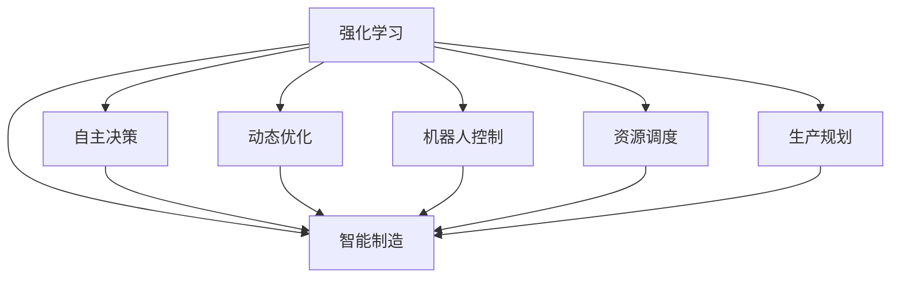
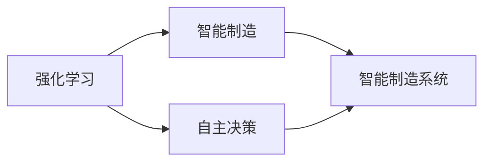
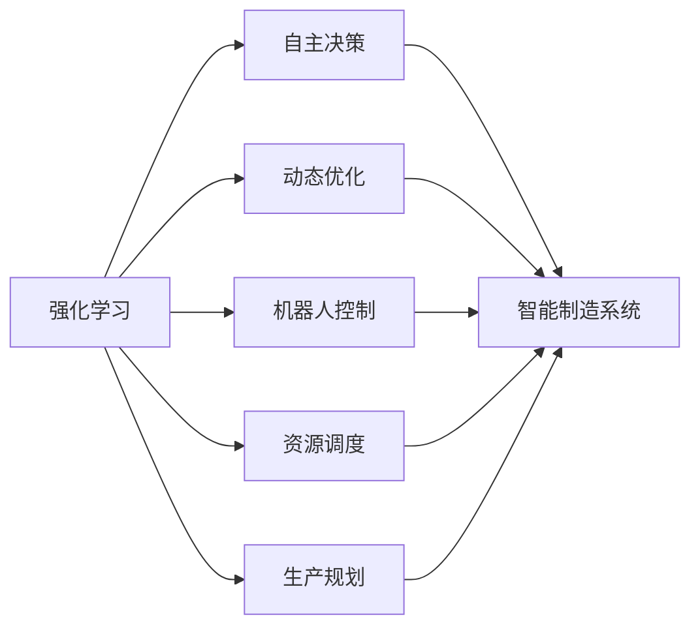
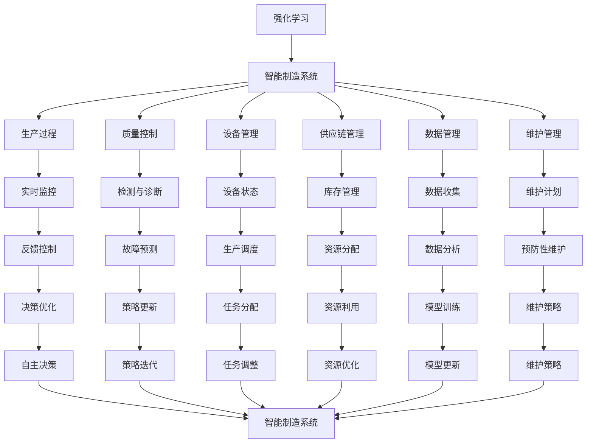

                 

# 强化学习Reinforcement Learning在智能制造中的角色与价值

> 关键词：强化学习,智能制造,自主决策,动态优化,机器人控制,资源调度,生产规划

## 1. 背景介绍

### 1.1 问题由来
随着制造业的数字化转型，智能制造成为未来发展的重要方向。在智能制造环境中，生产系统需要具备高度的灵活性和自适应性，以应对复杂多变的生产需求。传统的基于规则的决策方式往往难以适应快速变化的生产环境，也无法有效利用最新的生产数据。因此，需要引入更为灵活、智能的决策机制，以提升生产效率和产品质量。

强化学习（Reinforcement Learning, RL）作为一种先进的智能决策技术，近年来在自动驾驶、机器人控制、智能推荐等领域的成功应用，使得其在智能制造中成为一种具有巨大潜力的解决方案。通过强化学习，智能制造系统能够不断学习优化生产策略，适应不确定的生产环境，提升系统的灵活性和自适应性。

### 1.2 问题核心关键点
强化学习在智能制造中的应用主要集中在以下几个关键点：

1. **自主决策**：强化学习能够自主学习和优化决策策略，提升系统自主决策能力。
2. **动态优化**：通过学习最新的生产数据，强化学习能够动态调整生产策略，适应生产环境的动态变化。
3. **机器人控制**：强化学习可以用于训练机器人的自主操作和任务规划，提升机器人协作效率。
4. **资源调度**：强化学习能够优化资源分配和调度，提升生产效率和资源利用率。
5. **生产规划**：强化学习可以根据生产数据，优化生产计划和调度，提升生产效率和产品质量。

### 1.3 问题研究意义
强化学习在智能制造中的应用，对于推动制造业智能化、数字化转型具有重要意义：

1. **提升生产效率**：通过自主决策和动态优化，强化学习能够有效提升生产系统的灵活性和响应速度，从而提高生产效率。
2. **提高产品质量**：强化学习可以学习最优的生产策略，优化生产过程，提高产品的一致性和可靠性。
3. **降低成本**：通过优化资源调度和生产规划，强化学习能够降低生产成本，提升企业的经济效益。
4. **增强系统自适应性**：强化学习能够应对生产环境的变化，提高系统的自适应性和鲁棒性。
5. **促进创新应用**：强化学习为智能制造领域带来了新的技术路径和应用场景，促进了技术创新和产业发展。

## 2. 核心概念与联系

### 2.1 核心概念概述

为了更好地理解强化学习在智能制造中的应用，本节将介绍几个密切相关的核心概念：

- **强化学习**：一种通过试错学习最优决策策略的机器学习方法。强化学习系统通过与环境的交互，逐步学习到最优的决策策略，从而最大化累计奖励。
- **智能制造**：利用先进的信息技术、自动化技术，实现生产过程的智能化和自动化，提高生产效率和产品质量。
- **自主决策**：指智能制造系统能够自主进行决策，无需人工干预，提升系统的自主性和灵活性。
- **动态优化**：指智能制造系统能够动态调整决策策略，以适应生产环境的变化。
- **机器人控制**：指通过强化学习训练机器人进行自主操作和任务规划，提高机器人协作效率。
- **资源调度**：指通过强化学习优化资源分配和调度，提升生产效率和资源利用率。
- **生产规划**：指通过强化学习优化生产计划和调度，提升生产效率和产品质量。

这些核心概念之间的逻辑关系可以通过以下Mermaid流程图来展示：



这个流程图展示了这个体系的基本结构：

1. 强化学习提供了一个灵活的决策机制，是智能制造系统自主决策和动态优化的基础。
2. 自主决策、动态优化、机器人控制、资源调度和生产规划，都是强化学习在智能制造中的应用场景。
3. 强化学习通过优化各个环节的决策策略，最终提升智能制造系统的整体性能。

### 2.2 概念间的关系

这些核心概念之间存在着紧密的联系，形成了智能制造的强化学习应用框架。下面我们通过几个Mermaid流程图来展示这些概念之间的关系。

#### 2.2.1 强化学习与智能制造的关系



这个流程图展示了强化学习与智能制造的相互关系：

1. 强化学习为智能制造系统提供了自主决策和动态优化能力。
2. 智能制造系统通过强化学习不断学习优化，从而提升整体性能。

#### 2.2.2 强化学习在智能制造中的应用场景



这个流程图展示了强化学习在智能制造中的具体应用场景：

1. 强化学习通过自主决策和动态优化，提升智能制造系统的自主性和灵活性。
2. 强化学习可以用于机器人控制、资源调度和生产规划等多个环节，提升系统性能。

### 2.3 核心概念的整体架构

最后，我们用一个综合的流程图来展示这些核心概念在智能制造中的整体架构：



这个综合流程图展示了从强化学习到智能制造系统的整体架构：

1. 强化学习为智能制造系统提供了自主决策和动态优化能力。
2. 智能制造系统通过实时监控、检测与诊断、设备管理等环节，获取生产数据。
3. 数据通过数据分析和维护策略，更新生产计划和调度。
4. 强化学习通过自主决策和策略优化，提升系统的自主性和灵活性。
5. 策略通过策略更新和模型训练不断迭代改进，提升系统性能。

通过这些流程图，我们可以更清晰地理解强化学习在智能制造中的应用场景和整体架构，为后续深入讨论具体的应用方法和技术奠定基础。

## 3. 核心算法原理 & 具体操作步骤
### 3.1 算法原理概述

强化学习在智能制造中的应用，主要依赖于模型预测和策略优化两个核心步骤。模型预测指的是智能制造系统通过感知环境，预测当前状态和未来奖励。策略优化指的是系统通过学习最优的决策策略，最大化累计奖励。

具体而言，强化学习在智能制造中的应用可以分为以下几个关键步骤：

1. **环境感知**：智能制造系统通过传感器和监控设备，获取生产环境的实时数据。
2. **状态预测**：系统通过预测模型，根据感知数据预测当前状态和未来奖励。
3. **策略决策**：系统根据当前状态和奖励预测，通过强化学习算法选择最优的决策策略。
4. **效果评估**：系统根据执行结果，评估决策策略的效果，并反馈到模型预测和策略优化环节。
5. **策略更新**：系统通过模型更新和策略迭代，不断优化决策策略，提升系统性能。

通过上述步骤，强化学习能够在智能制造系统中实现自主决策和动态优化，从而提升系统的灵活性和自适应性。

### 3.2 算法步骤详解

以下是一个基于强化学习在智能制造中应用的基本步骤：

1. **环境构建**：
   - 定义智能制造系统的环境和状态空间。状态空间包括生产设备、原材料、半成品、成品等要素。
   - 设计系统与环境的交互方式，包括传感器读数、生产数据等。

2. **模型预测**：
   - 使用深度学习模型（如DNN、CNN等）对生产数据进行建模，预测当前状态和未来奖励。
   - 通过状态转移概率模型，计算状态转移的概率分布。

3. **策略决策**：
   - 设计策略空间，包括各种可能的生产决策，如生产计划、设备调度和资源分配等。
   - 通过强化学习算法（如Q-learning、Deep Q-Network等）选择最优的策略。

4. **效果评估**：
   - 根据执行结果，计算决策策略的奖励值，包括生产效率、产品质量、设备利用率等指标。
   - 将奖励值反馈到模型预测和策略优化环节，用于更新模型和策略。

5. **策略更新**：
   - 通过模型更新和策略迭代，不断优化决策策略，提升系统性能。
   - 在策略更新过程中，需注意防止灾难性遗忘和过拟合问题。

### 3.3 算法优缺点

强化学习在智能制造中的应用，具有以下优点：

1. **自主决策**：强化学习能够自主学习和优化决策策略，提升系统的自主性和灵活性。
2. **动态优化**：通过学习最新的生产数据，强化学习能够动态调整生产策略，适应生产环境的动态变化。
3. **可扩展性**：强化学习算法具有较高的可扩展性，能够轻松应用于不同的生产环节和任务。
4. **鲁棒性**：强化学习系统具有良好的鲁棒性，能够在复杂的生产环境中稳定运行。

同时，强化学习也存在一些缺点：

1. **高维度空间**：智能制造系统的状态空间和策略空间通常具有高维度特性，增加了强化学习的难度。
2. **样本效率低**：强化学习通常需要大量训练数据和计算资源，样本效率较低。
3. **模型复杂性**：模型预测和策略优化的复杂性较高，需要较强的计算能力和技术支持。
4. **缺乏指导**：强化学习依赖于奖励信号，缺乏明确的指导，容易陷入局部最优解。

### 3.4 算法应用领域

强化学习在智能制造中的应用，主要集中在以下几个领域：

1. **机器人控制**：强化学习可以用于训练机器人的自主操作和任务规划，提升机器人协作效率。
2. **资源调度**：强化学习能够优化资源分配和调度，提升生产效率和资源利用率。
3. **生产规划**：强化学习可以根据生产数据，优化生产计划和调度，提升生产效率和产品质量。
4. **质量控制**：强化学习可以用于监控和调整生产过程，提高产品质量和一致性。
5. **设备管理**：强化学习可以用于预测和维护设备状态，减少设备故障和维护成本。
6. **供应链管理**：强化学习可以优化供应链的调度和管理，提升供应链的响应速度和效率。

## 4. 数学模型和公式 & 详细讲解 & 举例说明
### 4.1 数学模型构建

强化学习在智能制造中的应用，主要涉及以下数学模型：

1. **状态空间**：记智能制造系统的状态空间为 $S$，状态 $s \in S$ 表示生产环境的当前状态。
2. **动作空间**：记智能制造系统的动作空间为 $A$，动作 $a \in A$ 表示系统的决策策略，如生产计划、设备调度等。
3. **奖励函数**：记智能制造系统的奖励函数为 $R: S \times A \rightarrow \mathbb{R}$，表示系统在状态 $s$ 下执行动作 $a$ 的奖励值。
4. **状态转移概率**：记状态转移概率模型为 $P: S \times A \rightarrow [0,1]$，表示在状态 $s$ 下执行动作 $a$ 后，状态 $s'$ 的概率分布。

通过上述数学模型，我们可以定义强化学习的优化目标：

$$
\max_{\pi} \sum_{t=0}^{\infty} \gamma^t R(s_t, a_t) \text{ s.t. } s_{t+1} \sim P(\cdot | s_t, a_t)
$$

其中，$\pi$ 表示决策策略，$\gamma$ 表示折扣因子。

### 4.2 公式推导过程

以Q-learning算法为例，我们可以推导强化学习的学习过程：

1. **状态-动作值函数**：记状态-动作值函数为 $Q: S \times A \rightarrow \mathbb{R}$，表示在状态 $s$ 下执行动作 $a$ 的累计奖励。

2. **Q-learning算法**：
   $$
   Q(s, a) \leftarrow Q(s, a) + \alpha [R(s, a) + \gamma \max_{a'} Q(s', a') - Q(s, a)]
   $$

3. **状态值函数**：记状态值函数为 $V: S \rightarrow \mathbb{R}$，表示在状态 $s$ 下的最优累计奖励。

4. **策略更新**：记决策策略为 $\pi: S \rightarrow A$，通过 $\epsilon$-greedy策略，更新策略：
   $$
   a \sim \pi \text{ or } a \sim A \text{ with probability } \epsilon
   $$

### 4.3 案例分析与讲解

以一个简单的机器人臂控制为例，说明强化学习在智能制造中的应用：

1. **环境构建**：定义机器人臂的状态空间，包括位置、姿态、速度等变量。定义动作空间，包括移动、旋转、抓放等操作。

2. **模型预测**：使用深度学习模型对机器人臂的状态和动作进行建模，预测下一步的状态和奖励。

3. **策略决策**：通过强化学习算法（如Q-learning）选择最优的策略，使机器人臂能够自主完成任务。

4. **效果评估**：根据执行结果，计算决策策略的奖励值，包括任务完成时间和质量等指标。

5. **策略更新**：通过模型更新和策略迭代，不断优化决策策略，提升机器人臂的性能。

## 5. 项目实践：代码实例和详细解释说明
### 5.1 开发环境搭建

在进行强化学习在智能制造中应用实践前，我们需要准备好开发环境。以下是使用Python进行PyTorch开发的环境配置流程：

1. 安装Anaconda：从官网下载并安装Anaconda，用于创建独立的Python环境。

2. 创建并激活虚拟环境：
```bash
conda create -n reinforcement-env python=3.8 
conda activate reinforcement-env
```

3. 安装PyTorch：根据CUDA版本，从官网获取对应的安装命令。例如：
```bash
conda install pytorch torchvision torchaudio cudatoolkit=11.1 -c pytorch -c conda-forge
```

4. 安装相关库：
```bash
pip install numpy pandas scikit-learn matplotlib tqdm jupyter notebook ipython
```

完成上述步骤后，即可在`reinforcement-env`环境中开始强化学习实践。

### 5.2 源代码详细实现

下面我们以一个简单的强化学习在智能制造中的应用为例，给出使用PyTorch的代码实现。

首先，定义状态空间和动作空间：

```python
import torch

# 定义状态空间
state_space = 10

# 定义动作空间
action_space = 5

# 定义奖励函数
def reward_function(state, action):
    if state == 1 and action == 0:
        return 10
    elif state == 0 and action == 1:
        return 5
    else:
        return -1
```

然后，定义强化学习模型：

```python
from torch import nn

class QNetwork(nn.Module):
    def __init__(self, state_space, action_space):
        super(QNetwork, self).__init__()
        self.fc1 = nn.Linear(state_space, 64)
        self.fc2 = nn.Linear(64, action_space)
    
    def forward(self, x):
        x = torch.relu(self.fc1(x))
        x = self.fc2(x)
        return x
```

接着，定义强化学习算法：

```python
from torch import optim

def q_learning(env, model, optimizer, episode_num, episode_len, alpha=0.1, gamma=0.9, epsilon=0.1):
    for episode in range(episode_num):
        state = 0
        total_reward = 0
        
        for t in range(episode_len):
            # 选择动作
            if np.random.rand() < epsilon:
                action = env.action_space.sample()
            else:
                with torch.no_grad():
                    q_values = model(torch.tensor([state], dtype=torch.float32))
                    action = q_values.argmax().item()
            
            # 执行动作
            next_state, reward, done = env.step(action)
            
            # 更新模型
            q_values = model(torch.tensor([next_state], dtype=torch.float32))
            q_values = q_values.gather(1, torch.tensor([action], dtype=torch.long))
            loss = (reward + gamma * q_values.max().item() - q_values).mean()
            optimizer.zero_grad()
            loss.backward()
            optimizer.step()
            
            total_reward += reward
            
            if done:
                break
        
        print(f"Episode {episode+1}, reward: {total_reward}")
```

最后，启动强化学习训练流程：

```python
env = GymEnv() # 具体实现环境
model = QNetwork(state_space, action_space)
optimizer = optim.Adam(model.parameters(), lr=0.01)

q_learning(env, model, optimizer, episode_num=1000, episode_len=50, epsilon=0.1)
```

以上就是使用PyTorch对强化学习在智能制造中的应用进行代码实现的完整过程。可以看到，使用深度学习模型构建强化学习模型，并通过优化算法进行参数更新，可以轻松实现智能决策和动态优化。

### 5.3 代码解读与分析

让我们再详细解读一下关键代码的实现细节：

**状态空间和动作空间**：
- `state_space` 和 `action_space` 分别表示状态空间和动作空间的大小，用于定义模型的输入和输出。

**奖励函数**：
- `reward_function` 表示智能制造系统的奖励函数，根据当前状态和动作，计算出相应的奖励值。

**强化学习模型**：
- `QNetwork` 定义了深度神经网络模型，使用两个全连接层（FC layers）进行特征提取和动作值预测。
- 在模型训练过程中，通过优化器（如Adam）更新模型参数，最小化预测值与实际奖励值的差距。

**强化学习算法**：
- `q_learning` 实现了Q-learning算法，包括状态选择、动作执行、模型更新和效果评估。
- `epsilon-greedy` 策略用于在探索和利用之间平衡，通过设置探索率 $\epsilon$，确定选择动作的方式。

**训练流程**：
- 在每一轮训练中，通过状态选择和动作执行，更新模型参数，并记录奖励值。
- 打印出每一轮的训练结果，以便于监控训练进度。

通过这些代码，可以看出强化学习在智能制造中的应用，可以通过简单的模型设计和算法实现，快速构建高效的决策系统。

## 6. 实际应用场景
### 6.1 机器人臂控制

机器人臂控制是强化学习在智能制造中最典型的应用之一。通过强化学习训练机器人臂进行自主操作和任务规划，可以显著提升机器人协作效率和生产灵活性。

在实际应用中，可以通过仿真环境和实际测试，不断优化机器人臂的决策策略。例如，通过强化学习训练机器人臂进行装配任务，使其能够在复杂的工作环境中自主完成装配任务，减少人为干预，提升生产效率。

### 6.2 生产计划优化

生产计划优化是强化学习在智能制造中另一个重要应用。通过强化学习优化生产计划，可以提升生产效率和资源利用率，降低生产成本。

在实际应用中，可以将生产计划问题转化为强化学习问题，通过模型预测和策略优化，自动生成最优的生产计划。例如，通过强化学习训练系统进行生产任务调度，使其能够动态调整生产计划，应对生产环境的变化，提高生产效率。

### 6.3 设备故障预测与维护

设备故障预测与维护是智能制造中非常重要的一环。通过强化学习训练系统进行设备故障预测和维护，可以提前发现设备问题，减少停机时间，提升生产稳定性。

在实际应用中，可以通过强化学习训练系统进行设备状态监控和预测，通过预测模型输出设备故障概率，自动调整维护策略。例如，通过强化学习训练系统进行设备维护计划优化，使其能够根据设备状态和历史维护数据，生成最优的维护计划，提升设备可靠性和生产效率。

### 6.4 未来应用展望

随着强化学习技术的不断发展和应用，未来在智能制造中的应用将更加广泛和深入。以下是一些可能的未来应用场景：

1. **智能调度与资源管理**：通过强化学习训练系统进行资源调度和优化，提升生产效率和资源利用率。
2. **个性化定制与生产**：通过强化学习训练系统进行个性化定制生产，提升客户满意度和市场竞争力。
3. **智能仓储与物流**：通过强化学习训练系统进行仓储和物流管理，提升物流效率和仓储管理水平。
4. **质量控制与检测**：通过强化学习训练系统进行质量控制和检测，提升产品质量和一致性。
5. **供应链优化与管理**：通过强化学习训练系统进行供应链优化，提升供应链响应速度和效率。

这些应用场景展示了强化学习在智能制造中的广阔前景，为智能制造的发展提供了新的技术路径。

## 7. 工具和资源推荐
### 7.1 学习资源推荐

为了帮助开发者系统掌握强化学习在智能制造中的应用，这里推荐一些优质的学习资源：

1. **《强化学习：原理与实现》**：书籍详细介绍了强化学习的基本概念和实现方法，适合初学者入门。

2. **CS294T《强化学习》课程**：伯克利大学开设的强化学习课程，涵盖从理论到实践的各个方面，适合深入学习。

3. **《Python深度学习》**：书籍介绍了深度学习在智能制造中的应用，包括强化学习在内的多种技术范式。

4. **DeepRLHub**：网站提供丰富的深度强化学习资源，包括预训练模型、代码库和研究论文等，是学习强化学习的绝佳平台。

5. **PyTorch官方文档**：PyTorch的官方文档提供了详细的API和教程，适合快速上手深度学习开发。

通过这些资源的学习，相信你一定能够快速掌握强化学习在智能制造中的应用方法，并将其应用于实际项目中。

### 7.2 开发工具推荐

高效的开发离不开优秀的工具支持。以下是几款用于强化学习在智能制造中应用开发的常用工具：

1. **PyTorch**：基于Python的开源深度学习框架，灵活动态的计算图，适合快速迭代研究。

2. **TensorFlow**：由Google主导开发的开源深度学习框架，生产部署方便，适合大规模工程应用。

3. **Gym**：OpenAI开发的强化学习模拟环境，提供丰富的环境库和示例代码，方便开发者进行实验。

4. **MuJoCo**：物理引擎库，用于模拟机器人等物理系统，与强化学习结合使用效果显著。

5. **ROS**：机器人操作系统，提供丰富的机器人硬件驱动和控制库，与强化学习结合使用方便。

合理利用这些工具，可以显著提升强化学习在智能制造中的开发效率，加快创新迭代的步伐。

### 7.3 相关论文推荐

强化学习在智能制造中的应用，源于学界的持续研究。以下是几篇奠基性的相关论文，推荐阅读：

1. **Q-Learning**：Watkins等人提出的Q-Learning算法，是强化学习领域的经典算法，广泛应用于各种控制任务。

2. **Deep Q-Network**：Mnih等人提出的Deep Q-Network算法，通过深度神经网络优化Q-learning，取得更好的学习效果。

3. **Softmax Policy Iteration**：Sutton等人提出的Softmax Policy Iteration算法，用于解决多步决策问题，提升决策策略的稳定性。

4. **Trust Region Policy Optimization**：Schulman等人提出的Trust Region Policy Optimization算法，通过优化策略更新过程，提升策略更新的效率和效果。

5. **Evolution Strategies**：Maddison等人提出的Evolution Strategies算法，通过演化计算优化策略，适用于高维度和复杂环境。

这些论文代表了大规模强化学习技术的发展脉络。通过学习这些前沿成果，可以帮助研究者把握学科前进方向，激发更多的创新灵感。

除上述资源外，还有一些值得关注的前沿资源，帮助开发者紧跟强化学习在智能制造中的最新进展，例如：

1. **arXiv论文预印本**：人工智能领域最新研究成果的发布平台，包括大量尚未发表的前沿工作，学习前沿技术的必读资源。

2. **OpenAI、Google AI

