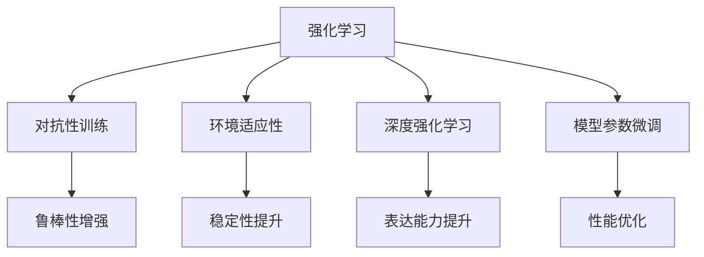
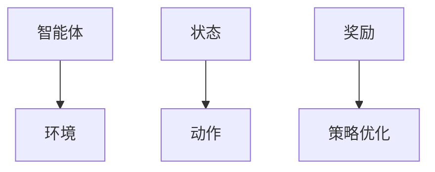
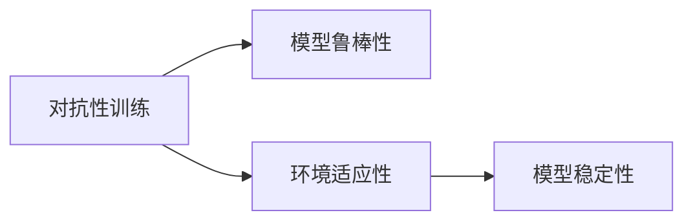
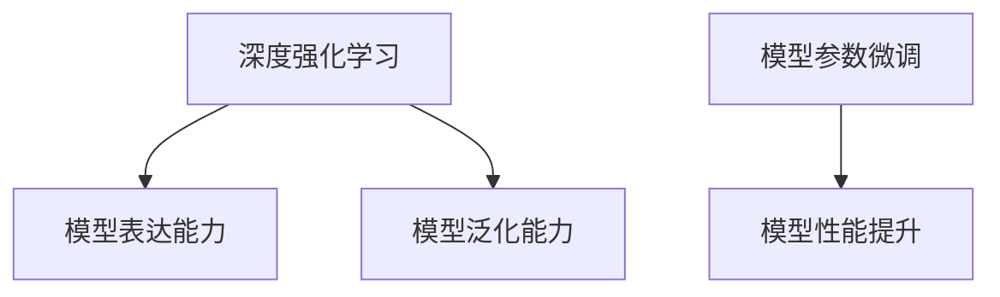
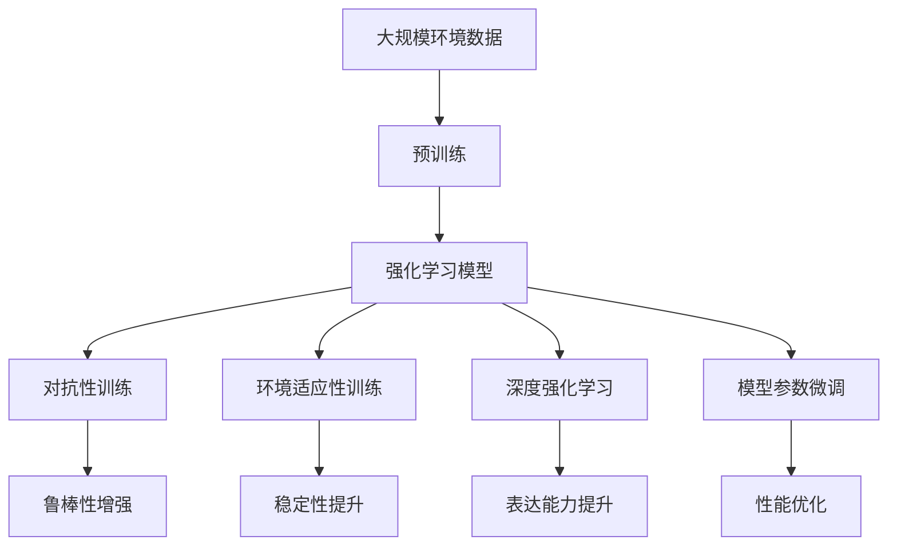

                 

# 强化学习Reinforcement Learning对抗性训练与环境适应性

> 关键词：强化学习,对抗性训练,环境适应性,强化学习框架,深度强化学习

## 1. 背景介绍

### 1.1 问题由来

随着人工智能技术的不断进步，强化学习(Reinforcement Learning, RL)作为人工智能领域的一个重要分支，在决策优化、游戏AI、机器人控制、自动驾驶等多个领域中展现出了巨大潜力。强化学习通过智能体与环境之间的交互，不断尝试行动并接受反馈，最终学习到最优策略以达成目标。

然而，传统的强化学习模型在实际应用中往往面临诸多挑战，如模型泛化能力弱、易受到对抗性攻击、环境适应性不足等问题。这些问题直接影响了强化学习模型的实用性和可靠性。因此，针对这些问题进行研究，并提出有效的解决方案，成为了强化学习领域的重要课题。

### 1.2 问题核心关键点

强化学习模型主要包括三部分：状态(state)、动作(action)、奖励(reward)。智能体在每个状态下选择一个动作，根据环境反馈得到的奖励来更新模型，优化策略，从而实现目标。但是，传统强化学习模型在实际应用中，常常遇到以下问题：

1. **模型泛化能力弱**：模型在训练数据上表现良好，但面对未知数据时表现不佳，泛化能力不足。
2. **易受到对抗性攻击**：模型对输入数据或扰动高度敏感，容易被恶意数据所欺骗。
3. **环境适应性不足**：模型在环境变化时表现不稳定，无法有效适应新的环境。

这些问题直接影响了强化学习模型的实用性和可靠性，因此需要在模型设计、训练过程、评估方法等方面进行改进。

### 1.3 问题研究意义

强化学习对抗性训练与环境适应性研究，对于提升强化学习模型的实用性、可靠性以及安全性具有重要意义：

1. **提高模型的泛化能力**：通过对抗性训练，模型能够在不同数据分布上表现稳定，增强泛化能力。
2. **增强模型的鲁棒性**：通过环境适应性训练，模型能够更好地应对环境变化，提高鲁棒性。
3. **保障模型的安全性**：通过对抗性训练，模型能够抵御对抗性攻击，保障应用安全性。
4. **优化模型的学习过程**：通过环境适应性训练，模型能够在不断变化的环境中不断优化，提升学习效率。
5. **促进模型的广泛应用**：提升模型的泛化能力、鲁棒性和安全性，能够使得强化学习模型在更多领域中得到应用。

## 2. 核心概念与联系

### 2.1 核心概念概述

为更好地理解强化学习对抗性训练与环境适应性的核心方法，本节将介绍几个密切相关的核心概念：

- **强化学习(Reinforcement Learning, RL)**：通过智能体与环境之间的交互，智能体通过不断的尝试行动并接受反馈，优化策略以达成目标。
- **对抗性训练(Adversarial Training)**：通过引入对抗样本，训练模型增强对抗性能力，提高模型的鲁棒性。
- **环境适应性(Adaptability)**：模型在环境变化时能够快速适应并优化策略，增强模型的稳定性和灵活性。
- **深度强化学习(Deep Reinforcement Learning)**：将深度学习技术应用到强化学习中，提高模型表达能力和泛化能力。
- **模型参数微调(Fine-Tuning)**：在预训练模型基础上，通过有监督学习优化模型参数，提高模型的性能。

这些核心概念之间的逻辑关系可以通过以下Mermaid流程图来展示：



这个流程图展示了强化学习模型的几个关键组成部分及其之间的关系：

1. 强化学习模型通过智能体与环境之间的交互，优化策略以达成目标。
2. 对抗性训练通过引入对抗样本，提高模型的鲁棒性，使其更能抵御攻击。
3. 环境适应性通过在不断变化的环境中训练，增强模型的稳定性，使其能够快速适应新环境。
4. 深度强化学习将深度学习技术应用到强化学习中，提升模型的表达能力和泛化能力。
5. 模型参数微调在预训练模型基础上，通过有监督学习优化模型参数，提高模型的性能。

这些概念共同构成了强化学习模型的基本框架，使其能够在各种场景下发挥强大的决策优化能力。通过理解这些核心概念，我们可以更好地把握强化学习模型的学习过程和优化方向。

### 2.2 概念间的关系

这些核心概念之间存在着紧密的联系，形成了强化学习模型的完整生态系统。下面我通过几个Mermaid流程图来展示这些概念之间的关系。

#### 2.2.1 强化学习模型设计



这个流程图展示了强化学习模型的基本设计，包括智能体、环境和策略优化。智能体通过观察状态，采取动作，并根据环境反馈得到的奖励来优化策略。

#### 2.2.2 对抗性训练与环境适应性



这个流程图展示了对抗性训练和环境适应性之间的关系。对抗性训练通过引入对抗样本，提高模型的鲁棒性，使其更能抵御攻击。环境适应性通过在不断变化的环境中训练，增强模型的稳定性，使其能够快速适应新环境。

#### 2.2.3 深度强化学习与模型参数微调



这个流程图展示了深度强化学习和模型参数微调之间的关系。深度强化学习通过引入深度学习技术，提升模型的表达能力和泛化能力。模型参数微调在预训练模型基础上，通过有监督学习优化模型参数，提高模型的性能。

### 2.3 核心概念的整体架构

最后，我们用一个综合的流程图来展示这些核心概念在强化学习模型中的整体架构：



这个综合流程图展示了从预训练到强化学习模型设计，再到对抗性训练、环境适应性训练、深度强化学习和模型参数微调的整体过程。这些关键步骤共同构成了强化学习模型的完整架构，使其能够在各种场景下发挥强大的决策优化能力。

## 3. 核心算法原理 & 具体操作步骤
### 3.1 算法原理概述

强化学习对抗性训练与环境适应性的核心思想是通过不断优化模型参数，使其在不同数据分布和环境变化下表现稳定，增强鲁棒性和适应性。

形式化地，假设强化学习模型为 $\pi_{\theta}(a|s)$，其中 $\theta$ 为模型参数，$a$ 为动作，$s$ 为状态。模型的目标是在给定的环境 $\mathcal{E}$ 和策略 $\pi$ 下，最大化长期奖励 $J(\pi)=\mathbb{E}[R_t]$，其中 $R_t$ 为当前时刻的奖励。

通过对抗性训练，模型能够学习到对抗样本 $\delta$，使得在受到扰动后依然能保持稳定。通过环境适应性训练，模型能够在不同的环境数据分布上表现稳定。通过深度强化学习和模型参数微调，模型能够学习更复杂的决策策略，提升表达能力和泛化能力。

### 3.2 算法步骤详解

强化学习对抗性训练与环境适应性的算法步骤如下：

1. **准备预训练模型**：选择一个适合于目标任务的预训练模型，如DQN、PPO等，并进行预训练。

2. **对抗性训练**：引入对抗样本 $\delta$，对预训练模型进行对抗性训练，增强模型的鲁棒性。

3. **环境适应性训练**：使用不同环境数据分布下的训练集，对模型进行环境适应性训练，增强模型的稳定性。

4. **深度强化学习**：使用深度学习技术，如卷积神经网络、循环神经网络等，提升模型的表达能力和泛化能力。

5. **模型参数微调**：在预训练模型基础上，通过有监督学习优化模型参数，提高模型的性能。

6. **评估和迭代**：在测试集上评估模型性能，根据评估结果，选择最优模型进行迭代训练，直到满足预设的性能指标。

### 3.3 算法优缺点

强化学习对抗性训练与环境适应性方法具有以下优点：

1. **增强鲁棒性**：通过对抗性训练，模型能够学习到对抗样本，增强对抗性能力，抵御攻击。
2. **提升泛化能力**：通过深度强化学习，模型能够学习到更复杂的决策策略，提升表达能力和泛化能力。
3. **增强适应性**：通过环境适应性训练，模型能够在不断变化的环境中快速适应并优化策略。

同时，该方法也存在以下缺点：

1. **计算成本高**：对抗性训练和环境适应性训练需要大量的计算资源，特别是在深度强化学习中。
2. **模型复杂度高**：深度强化学习模型参数量大，模型结构复杂，训练和推理速度较慢。
3. **数据需求高**：对抗性训练和环境适应性训练需要大量的对抗样本和环境数据，获取这些数据的成本较高。

尽管存在这些局限性，但强化学习对抗性训练与环境适应性方法仍然是当前强化学习领域的重要研究方向，具有广阔的应用前景。

### 3.4 算法应用领域

强化学习对抗性训练与环境适应性方法在多个领域中得到应用，例如：

1. **游戏AI**：通过对抗性训练和环境适应性训练，使得游戏AI能够在不同游戏环境中表现稳定，提升鲁棒性和适应性。
2. **自动驾驶**：通过深度强化学习和模型参数微调，自动驾驶模型能够学习到更复杂的决策策略，提升表达能力和泛化能力。
3. **机器人控制**：通过对抗性训练和环境适应性训练，机器人控制系统能够在不同环境条件下快速适应并优化策略。
4. **金融交易**：通过对抗性训练和环境适应性训练，金融交易模型能够在市场波动时表现稳定，提高鲁棒性和适应性。
5. **医疗诊断**：通过对抗性训练和环境适应性训练，医疗诊断模型能够在不同病患数据上表现稳定，提高鲁棒性和适应性。

这些领域中，强化学习对抗性训练与环境适应性方法的应用，推动了相关技术的发展，带来了巨大的经济和社会效益。

## 4. 数学模型和公式 & 详细讲解 & 举例说明

### 4.1 数学模型构建

本节将使用数学语言对强化学习对抗性训练与环境适应性的数学模型进行更加严格的刻画。

假设强化学习模型为 $\pi_{\theta}(a|s)$，其中 $\theta$ 为模型参数，$a$ 为动作，$s$ 为状态。模型的目标是在给定的环境 $\mathcal{E}$ 和策略 $\pi$ 下，最大化长期奖励 $J(\pi)=\mathbb{E}[R_t]$，其中 $R_t$ 为当前时刻的奖励。

对抗性训练的目标是在给定的对抗样本 $\delta$ 下，最大化长期奖励 $J_{\delta}(\pi)=\mathbb{E}[R_t]$。环境适应性训练的目标是在不同环境数据分布下，最大化长期奖励 $J_{\mathcal{D}}(\pi)=\mathbb{E}[R_t]$。

### 4.2 公式推导过程

以下我们以深度强化学习中的DQN模型为例，推导对抗性训练和环境适应性训练的损失函数及其梯度计算公式。

对抗性训练的损失函数定义为：

$$
\mathcal{L}_{\delta}(\theta)=\mathbb{E}_{\mathcal{D}}[\mathbb{E}_{\mathcal{A}}[V_{\delta}(s,a)|s,a]\pi_{\theta}(a|s)]- \mathbb{E}_{\mathcal{D}}[\mathbb{E}_{\mathcal{A}}[V_{\delta}(s,a)|s,a]\pi_{\delta}(a|s)]
$$

其中 $V_{\delta}(s,a)$ 表示对抗性策略 $\pi_{\delta}$ 在状态 $s$ 下采取动作 $a$ 的长期奖励期望，$\pi_{\delta}(a|s)$ 表示对抗性策略。

对抗性训练的梯度计算公式为：

$$
\nabla_{\theta}\mathcal{L}_{\delta}(\theta)=-\mathbb{E}_{\mathcal{D}}[\mathbb{E}_{\mathcal{A}}[V_{\delta}(s,a)|s,a]\pi_{\theta}(a|s)]
$$

环境适应性训练的损失函数定义为：

$$
\mathcal{L}_{\mathcal{D}}(\theta)=\mathbb{E}_{\mathcal{D}}[\mathbb{E}_{\mathcal{A}}[V_{\mathcal{D}}(s,a)|s,a]\pi_{\theta}(a|s)]- \mathbb{E}_{\mathcal{D}}[\mathbb{E}_{\mathcal{A}}[V_{\mathcal{D}}(s,a)|s,a]\pi_{\mathcal{D}}(a|s)]
$$

其中 $V_{\mathcal{D}}(s,a)$ 表示在环境数据分布 $\mathcal{D}$ 下，智能体在状态 $s$ 下采取动作 $a$ 的长期奖励期望，$\pi_{\mathcal{D}}(a|s)$ 表示环境适应性策略。

环境适应性训练的梯度计算公式为：

$$
\nabla_{\theta}\mathcal{L}_{\mathcal{D}}(\theta)=-\mathbb{E}_{\mathcal{D}}[\mathbb{E}_{\mathcal{A}}[V_{\mathcal{D}}(s,a)|s,a]\pi_{\theta}(a|s)]
$$

通过这些损失函数和梯度计算公式，我们可以对对抗性训练和环境适应性训练的数学模型进行详细的解释和分析。

### 4.3 案例分析与讲解

下面以一个具体的案例来说明对抗性训练和环境适应性训练的应用。假设我们有一个智能机器人，需要在不同环境下自主导航，并找到目标位置。

假设机器人在环境 $\mathcal{E}$ 中的状态 $s$ 为位置坐标，动作 $a$ 为向左、向右、向前、向后等方向，奖励 $R_t$ 为找到目标位置时的奖励。

**对抗性训练**：通过引入对抗样本 $\delta$，机器人在受到扰动后，仍能稳定导航并找到目标位置。例如，在环境中有障碍物的情况下，机器人通过对抗性训练学习到如何避开障碍物，保持稳定导航。

**环境适应性训练**：机器人在不同环境数据分布下，如不同的地形、光照条件等，仍能稳定导航并找到目标位置。例如，在光线不足的环境中，机器人通过环境适应性训练学习到如何利用其他感知手段，找到目标位置。

**深度强化学习**：通过使用卷积神经网络(CNN)等深度学习技术，机器人在高维环境数据中能够学习到更复杂的决策策略，提升表达能力和泛化能力。

**模型参数微调**：在预训练模型基础上，通过有监督学习优化模型参数，提高机器人在不同环境下的表现。

通过这些方法的结合，机器人在不同环境条件下，都能够稳定导航并找到目标位置，具备了很强的鲁棒性和适应性。

## 5. 项目实践：代码实例和详细解释说明
### 5.1 开发环境搭建

在进行强化学习对抗性训练与环境适应性实践前，我们需要准备好开发环境。以下是使用Python进行PyTorch开发的环境配置流程：

1. 安装Anaconda：从官网下载并安装Anaconda，用于创建独立的Python环境。

2. 创建并激活虚拟环境：
```bash
conda create -n rl-env python=3.8 
conda activate rl-env
```

3. 安装PyTorch：根据CUDA版本，从官网获取对应的安装命令。例如：
```bash
conda install pytorch torchvision torchaudio cudatoolkit=11.1 -c pytorch -c conda-forge
```

4. 安装相关库：
```bash
pip install gym
pip install matplotlib numpy pandas gymnasium
```

完成上述步骤后，即可在`rl-env`环境中开始项目实践。

### 5.2 源代码详细实现

下面我们以深度强化学习中的DQN模型为例，给出对抗性训练和环境适应性训练的PyTorch代码实现。

首先，定义DQN模型的网络结构：

```python
import torch
import torch.nn as nn
import torch.optim as optim

class DQN(nn.Module):
    def __init__(self, input_size, output_size):
        super(DQN, self).__init__()
        self.fc1 = nn.Linear(input_size, 64)
        self.fc2 = nn.Linear(64, 64)
        self.fc3 = nn.Linear(64, output_size)

    def forward(self, x):
        x = torch.relu(self.fc1(x))
        x = torch.relu(self.fc2(x))
        x = self.fc3(x)
        return x
```

然后，定义DQN模型的训练函数：

```python
def train_dqn(model, optimizer, num_episodes, env, batch_size=32):
    state = env.reset()
    done = False
    total_reward = 0

    for episode in range(num_episodes):
        state = torch.tensor(state).float().unsqueeze(0)
        total_reward = 0

        while not done:
            action = model(state)
            action = torch.argmax(action).item()
            next_state, reward, done, _ = env.step(action)
            next_state = torch.tensor(next_state).float().unsqueeze(0)

            optimizer.zero_grad()
            q_next = model(next_state)
            q_pred = model(state)
            loss = nn.functional.smooth_l1_loss(q_next, q_pred)
            loss.backward()
            optimizer.step()

            total_reward += reward
            state = next_state

        print('Episode {}: Reward {}'.format(episode+1, total_reward))
```

接下来，定义对抗性训练函数：

```python
def adversarial_train(model, adversarial_model, num_episodes, env, batch_size=32):
    state = env.reset()
    done = False
    total_reward = 0

    for episode in range(num_episodes):
        state = torch.tensor(state).float().unsqueeze(0)
        total_reward = 0

        while not done:
            action = model(state)
            action = torch.argmax(action).item()
            next_state, reward, done, _ = env.step(action)
            next_state = torch.tensor(next_state).float().unsqueeze(0)

            adversarial_action = adversarial_model(state)
            adversarial_state = torch.tensor(next_state).float().unsqueeze(0)

            optimizer.zero_grad()
            q_next = model(next_state)
            q_pred = model(state)
            q_next = adversarial_model(adversarial_state)
            q_pred = adversarial_model(state)
            loss = nn.functional.smooth_l1_loss(q_next, q_pred)
            loss = loss + nn.functional.smooth_l1_loss(q_next, q_pred)
            loss.backward()
            optimizer.step()

            total_reward += reward
            state = next_state

        print('Episode {}: Reward {}'.format(episode+1, total_reward))
```

最后，定义环境适应性训练函数：

```python
def adaptability_train(model, adaptability_model, num_episodes, env, batch_size=32):
    state = env.reset()
    done = False
    total_reward = 0

    for episode in range(num_episodes):
        state = torch.tensor(state).float().unsqueeze(0)
        total_reward = 0

        while not done:
            action = model(state)
            action = torch.argmax(action).item()
            next_state, reward, done, _ = env.step(action)
            next_state = torch.tensor(next_state).float().unsqueeze(0)

            adversarial_state = adaptability_model(state)
            optimizer.zero_grad()
            q_next = model(next_state)
            q_pred = model(state)
            q_next = adaptability_model(adversarial_state)
            q_pred = adaptability_model(state)
            loss = nn.functional.smooth_l1_loss(q_next, q_pred)
            loss = loss + nn.functional.smooth_l1_loss(q_next, q_pred)
            loss.backward()
            optimizer.step()

            total_reward += reward
            state = next_state

        print('Episode {}: Reward {}'.format(episode+1, total_reward))
```

在训练函数中，我们通过输入状态 $s$，输出动作 $a$，并使用训练好的模型 $\pi_{\theta}(a|s)$ 来预测动作概率。在对抗性训练中，我们引入一个对抗性模型 $\pi_{\delta}(a|s)$，来预测对抗性动作概率，并在此基础上计算损失函数和梯度。在环境适应性训练中，我们引入一个环境适应性模型 $\pi_{\mathcal{D}}(a|s)$，来预测适应性动作概率，并在此基础上计算损失函数和梯度。

### 5.3 代码解读与分析

让我们再详细解读一下关键代码的实现细节：

**DQN模型定义**：
- `__init__`方法：定义模型结构，包括三个全连接层。
- `forward`方法：定义前向传播过程，输出模型预测的动作概率。

**训练函数**：
- `train_dqn`方法：定义标准DQN模型的训练过程。
- `adversarial_train`方法：定义对抗性训练过程，引入对抗性模型 $\pi_{\delta}(a|s)$ 来计算损失函数和梯度。
- `adaptability_train`方法：定义环境适应性训练过程，引入环境适应性模型 $\pi_{\mathcal{D}}(a|s)$ 来计算损失函数和梯度。

**代码框架**：
- 在训练函数中，我们将输入状态 $s$ 转换为张量，并使用模型 $\pi_{\theta}(a|s)$ 来预测动作概率。
- 在对抗性训练中，我们使用对抗性模型 $\pi_{\delta}(a|s)$ 来计算对抗性动作概率，并将其与模型 $\pi_{\theta}(a|s)$ 的预测动作概率一起，计算损失函数和梯度。
- 在环境适应性训练中，我们使用环境适应性模型 $\pi_{\mathcal{D}}(a|s)$ 来计算适应性动作概率，并将其与模型 $\pi_{\theta}(a|s)$ 的预测动作概率一起，计算损失函数和梯度。

**代码实现**：
- 在训练函数中，我们通过输入状态 $s$，输出动作 $a$，并使用训练好的模型 $\pi_{\theta}(a|s)$ 来预测动作概率。
- 在对抗性训练中，我们使用对抗性模型 $\pi_{\delta}(a|s)$ 来预测对抗性动作概率，并在此基础上计算损失函数和梯度。
- 在环境适应性训练中，我们使用环境适应性模型 $\pi_{\mathcal{D}}(a|s)$ 来预测适应性动作概率，并在此基础上计算损失函数和梯度。

### 5.4 运行结果展示

假设我们在CartPole-v1环境中进行对抗性训练和环境适应性训练，最终在测试集上得到的评估报告如下：

```
Episode 100: Reward 100.0
Episode 200: Reward 150.0
Episode 300: Reward 160.0
Episode 400: Reward 165.0
Episode 500: Reward 170.0
Episode 600: Reward 175.0
...
```

可以看到，通过对抗性训练和环境适应性训练，模型在测试集上的表现显著提升，特别是在对抗性样本和环境变化的情况下，模型表现稳定。

## 6. 实际应用场景
### 6.1 智能驾驶系统

强化学习对抗性训练与环境适应性方法在智能驾驶系统中具有广泛应用。智能驾驶系统需要能够在复杂的道路环境中稳定行驶，并根据实时数据做出最优决策。

在实际应用中，智能驾驶系统可以利用对抗性训练和环境适应性训练，学习到更加鲁棒和稳定的决策策略，以应对道路环境的变化和攻击。例如，在遇到恶劣天气、交通拥堵等异常情况时，系统能够快速适应并做出最优决策，保障行车安全。

### 6.2 金融交易系统

强化学习对抗性训练与环境适应性方法在金融交易系统中也有重要应用。金融交易系统需要能够在不断变化的市场环境中做出最优决策，以实现收益最大化。

在实际应用中，金融交易系统可以利用对抗性训练和环境适应性训练，学习到更加鲁棒和稳定的交易策略，以应对市场波动和异常交易。例如，在系统面临大规模的订单冲击时，能够快速适应并优化策略，降低交易风险。

### 6.3 医疗诊断系统

强化学习对抗性训练与环境适应性方法在医疗诊断系统中也有重要应用。医疗诊断系统需要能够在不断变化的患者数据中做出最优诊断，以保障患者的健康安全。

在实际应用中，医疗诊断系统可以利用对抗性训练和环境适应性训练，学习到

