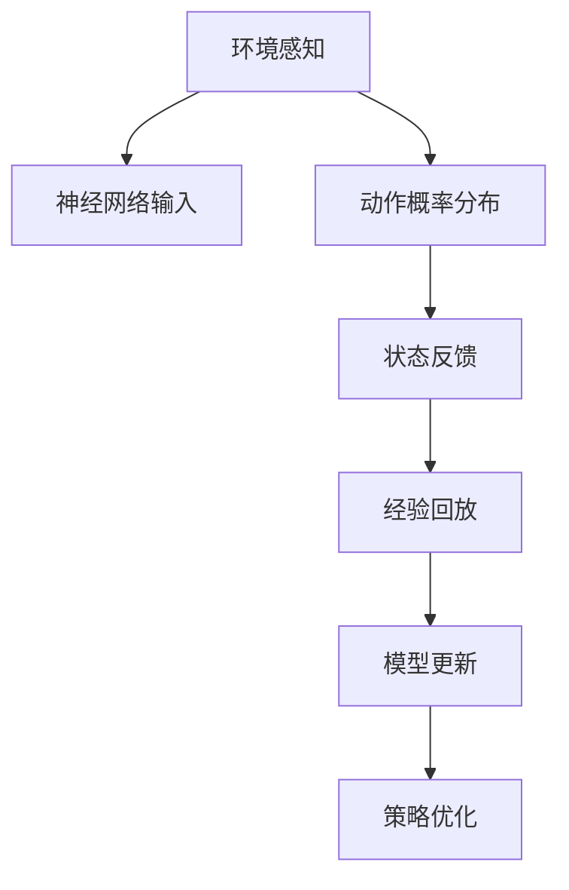
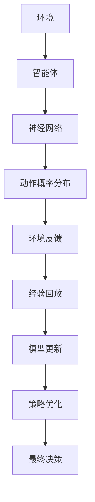

                 

## 1. 背景介绍

强化学习(Reinforcement Learning, RL)和深度学习(Deep Learning, DL)是人工智能领域两大重要分支，各自有着独特的优势和应用场景。强化学习通过智能体与环境交互，不断学习最优策略来最大化累计奖励；深度学习则通过大规模数据和神经网络模型，自适应地提取和拟合特征。然而，单独使用这两种方法，往往难以应对复杂、动态的现实世界问题。近年来，深度强化学习（Deep Reinforcement Learning, DRL）开始崭露头角，通过深度学习和强化学习的结合，展现出了更强的解决复杂问题的能力。

### 1.1 问题由来

强化学习最初源于游戏AI领域，最著名的便是AlphaGo与李世石的棋赛对弈，体现了强化学习在复杂决策问题上的强大潜力。然而，传统强化学习的学习效率较低，且依赖于经验回放和离线策略优化，难以应用到现实世界中多步决策的问题。深度强化学习的出现，通过引入深度神经网络，显著提升了强化学习的学习效率和决策能力，从而逐步应用于游戏、机器人控制、自动驾驶、金融交易等领域。

### 1.2 问题核心关键点

深度强化学习的关键点在于如何构建有效的深度神经网络，并设计合理的强化学习算法来训练该网络，以最大化长期的累积奖励。具体来说，DRL的目标是通过环境交互学习最优策略，其核心流程如下：

1. **环境感知**：智能体接收环境状态并转换为神经网络输入。
2. **策略制定**：神经网络输出动作概率分布，用于指导智能体行动。
3. **状态反馈**：智能体执行动作，并从环境中获得奖励和新状态。
4. **经验回放**：将新状态、动作、奖励等信息存储为经验样本，用于后续训练。
5. **模型更新**：利用经验样本更新神经网络参数，不断优化策略。

这一流程被循环执行，直至智能体达到最优策略或达到预设的训练轮数。深度强化学习的目标是让智能体在复杂环境中学习到有效的决策策略，从而实现自动化、高效化的决策过程。

### 1.3 问题研究意义

深度强化学习结合了深度学习和强化学习的优点，将机器学习和决策学习紧密结合起来。该方法不仅适用于处理复杂、高维的决策问题，还能够在多步决策、不确定性等情况下取得优异表现。然而，由于深度强化学习的复杂性和高维度，其在实际应用中仍面临诸多挑战，如样本效率低、易过拟合、可解释性差等。

因此，研究深度强化学习的理论和应用，对于提升机器学习模型的泛化能力和自动化水平，拓展机器学习应用场景，具有重要的理论和实践意义。

## 2. 核心概念与联系

### 2.1 核心概念概述

为更好地理解深度强化学习的核心概念，本节将介绍几个关键概念：

- **强化学习**：通过智能体与环境的交互，学习最优策略来最大化累计奖励。
- **深度神经网络**：一种能够自动学习特征表示的神经网络结构，包含多层非线性变换。
- **深度强化学习**：结合深度学习和强化学习的优点，通过神经网络学习最优策略的强化学习方法。
- **模型拟合**：通过样本经验更新神经网络参数，使得网络能够更好地适应数据分布。
- **经验回放**：将智能体与环境交互产生的数据样本存储下来，用于后续的模型更新和策略优化。
- **策略优化**：通过各种强化学习算法，不断调整智能体的行为策略，以最大化长期奖励。

这些核心概念之间通过相互协作，共同构成了深度强化学习的完整框架。

### 2.2 概念间的关系

这些核心概念之间的逻辑关系可以通过以下Mermaid流程图来展示：



这个流程图展示了大语言模型微调过程中各个关键概念的关系：

1. 环境感知将外部信息转换为神经网络可接受的输入。
2. 神经网络根据输入生成动作概率分布，指导智能体的行为。
3. 智能体执行动作并接收环境反馈。
4. 经验回放将新状态、动作、奖励等数据样本存储下来。
5. 模型更新利用存储的数据样本更新神经网络参数。
6. 策略优化通过强化学习算法调整智能体的行为策略。

这些概念共同构成了深度强化学习的生态系统，使得智能体能够在复杂环境中不断优化决策策略。

### 2.3 核心概念的整体架构

最后，我们用一个综合的流程图来展示这些核心概念在大语言模型微调过程中的整体架构：



这个综合流程图展示了从环境感知到最终决策的全过程。环境感知将外部信息转换为神经网络输入，智能体根据神经网络生成的动作概率分布进行决策，并从环境中接收反馈，通过经验回放和模型更新不断优化策略，最终达到最优决策。

## 3. 核心算法原理 & 具体操作步骤
### 3.1 算法原理概述

深度强化学习的主要原理是利用神经网络模型学习最优策略。具体来说，深度强化学习算法分为两类：

1. **基于值的方法**：通过学习状态值函数，预测每个状态的长期奖励，以指导智能体的决策。
2. **基于策略的方法**：直接学习策略，将神经网络输出直接作为动作概率分布，用于指导智能体的行为。

### 3.2 算法步骤详解

以下是深度强化学习算法的详细步骤：

**Step 1: 环境建模**
- 对实际环境进行建模，设定环境状态和状态转移规则。
- 定义奖励函数，确定智能体在不同状态下的奖励。

**Step 2: 构建神经网络模型**
- 设计合适的神经网络结构，包括输入层、隐藏层、输出层等。
- 选择合适的优化器（如Adam、SGD等）和损失函数。

**Step 3: 设计强化学习算法**
- 选择适当的强化学习算法（如Q-learning、SARSA、REINFORCE等）。
- 设定合适的学习率、折扣因子、采样策略等超参数。

**Step 4: 训练智能体**
- 将环境模型和神经网络模型结合起来，设计训练流程。
- 通过环境交互收集经验样本，并使用强化学习算法进行模型更新。

**Step 5: 策略评估与优化**
- 利用评估指标（如累积奖励、波动性等）评估智能体的性能。
- 通过策略优化算法（如策略梯度、Q-learning等）不断优化策略。

**Step 6: 部署智能体**
- 将训练好的智能体部署到实际环境中，进行长期运行和实时决策。

### 3.3 算法优缺点

深度强化学习的优点在于：
- 能够处理复杂、高维的决策问题，具有较强的泛化能力。
- 通过深度学习自动提取特征，减少了手动特征工程的工作量。
- 可以应用到多步决策和不确定性问题中，具有较广的适用范围。

其缺点包括：
- 样本效率较低，需要大量数据和计算资源进行训练。
- 模型复杂度高，难以解释和调试。
- 可能存在局部最优解，难以保证全局最优。

### 3.4 算法应用领域

深度强化学习在多个领域中展现出了其独特的优势，例如：

- **游戏AI**：AlphaGo、Dota2等游戏中的AI，能够通过学习最优策略，实现高水平的决策和对抗。
- **机器人控制**：机器人学习路径规划、物体抓取等任务，提高了机器人的自动化程度和灵活性。
- **自动驾驶**：自动驾驶系统学习安全驾驶策略，提高行车安全性和舒适度。
- **金融交易**：智能交易系统学习最优交易策略，实现高频交易和风险管理。
- **医疗诊断**：学习诊断策略，辅助医生进行疾病预测和治疗方案优化。

除了这些应用场景，深度强化学习在推荐系统、工业控制、社会治理等领域也有着广泛的应用前景。

## 4. 数学模型和公式 & 详细讲解  
### 4.1 数学模型构建

在深度强化学习中，一般使用马尔可夫决策过程(Markov Decision Process, MDP)来描述智能体与环境交互的过程。MDP由状态集合 $S$、动作集合 $A$、状态转移概率 $P(s'|s,a)$、奖励函数 $r(s,a,s')$ 和折扣因子 $\gamma$ 组成。智能体通过观察环境状态 $s_t$，根据当前状态选择动作 $a_t$，并获得环境反馈 $r_t$ 和下一状态 $s_{t+1}$。这一过程可以用以下数学公式表示：

$$
\begin{align*}
s_1 &\sim \pi_0(\cdot) \\
r_t &\sim R(\cdot) \\
s_{t+1} &\sim P(\cdot|s_t,a_t)
\end{align*}
$$

其中，$\pi_0$ 为初始状态分布，$R(\cdot)$ 为奖励函数，$P(\cdot|s_t,a_t)$ 为状态转移概率。

### 4.2 公式推导过程

为了最大化长期累积奖励，深度强化学习算法需要优化以下目标函数：

$$
J(\theta) = \mathbb{E}_{(s,a,r,s') \sim \pi_{\theta}} \left[ \sum_{t=1}^{\infty} \gamma^t r_t \right]
$$

其中 $\pi_{\theta}$ 为参数化的策略函数，$\theta$ 为策略函数的参数。为了便于优化，通常使用蒙特卡罗方法或时序差分方法来近似求解该目标函数。以蒙特卡罗方法为例，其核心思想是利用样本经验 $(s_t,a_t,r_t,s_{t+1})$ 来估计目标函数的梯度：

$$
\Delta J(\theta) = \gamma \sum_{t=1}^{T} \delta_t r_t
$$

其中 $\delta_t = r_{t+1} + \gamma \delta_{t+1}$，为TD误差。

### 4.3 案例分析与讲解

以AlphaGo为例，其核心算法为蒙特卡罗树搜索(Monte Carlo Tree Search, MCTS)，结合了深度学习和强化学习的优点。具体步骤如下：

1. 构建决策树，以当前局面为根节点，通过深度学习评估函数评估每条可能路径的价值。
2. 扩展树，选择价值最高的路径进行扩展，直至叶子节点。
3. 回溯树，计算每个节点的探索次数和胜利次数，更新评估函数。
4. 重复上述过程，直至达到预设深度或时间限制。

AlphaGo通过学习大量的围棋局谱，自动学会了复杂的策略和战术，展示了深度强化学习在复杂决策问题上的巨大潜力。

## 5. 项目实践：代码实例和详细解释说明
### 5.1 开发环境搭建

在进行深度强化学习实践前，我们需要准备好开发环境。以下是使用Python进行PyTorch开发的环境配置流程：

1. 安装Anaconda：从官网下载并安装Anaconda，用于创建独立的Python环境。

2. 创建并激活虚拟环境：
```bash
conda create -n pytorch-env python=3.8 
conda activate pytorch-env
```

3. 安装PyTorch：根据CUDA版本，从官网获取对应的安装命令。例如：
```bash
conda install pytorch torchvision torchaudio cudatoolkit=11.1 -c pytorch -c conda-forge
```

4. 安装TensorFlow：
```bash
pip install tensorflow
```

5. 安装OpenAI Gym：用于构建和测试强化学习环境：
```bash
pip install gym
```

6. 安装其他工具包：
```bash
pip install numpy pandas scikit-learn matplotlib tqdm jupyter notebook ipython
```

完成上述步骤后，即可在`pytorch-env`环境中开始深度强化学习的实践。

### 5.2 源代码详细实现

下面我们以DQN（深度Q网络）算法为例，给出使用PyTorch实现DQN算法的代码：

```python
import torch
import torch.nn as nn
import torch.optim as optim
import numpy as np
import gym

class DQN(nn.Module):
    def __init__(self, state_dim, action_dim):
        super(DQN, self).__init__()
        self.fc1 = nn.Linear(state_dim, 128)
        self.fc2 = nn.Linear(128, 128)
        self.fc3 = nn.Linear(128, action_dim)
        self.loss_fn = nn.MSELoss()
        self.optimizer = optim.Adam(self.parameters(), lr=0.001)
        
    def forward(self, x):
        x = torch.unsqueeze(x, dim=1)
        x = self.fc1(x)
        x = nn.functional.relu(x)
        x = self.fc2(x)
        x = nn.functional.relu(x)
        x = self.fc3(x)
        return x
    
    def choose_action(self, state):
        state = torch.unsqueeze(torch.FloatTensor(state), dim=1)
        action_probs = self.forward(state).detach().numpy()[0]
        action = np.random.choice(np.arange(action_dim), p=action_probs)
        return action
    
    def update(self, state, action, reward, next_state, done):
        target = reward + 0.9 * np.amax(self.forward(torch.FloatTensor(next_state)).detach().numpy())
        target_q = target if done else self.forward(torch.FloatTensor(state)).detach().numpy()
        loss = self.loss_fn(self.forward(torch.FloatTensor(state)), torch.FloatTensor(target_q))
        self.optimizer.zero_grad()
        loss.backward()
        self.optimizer.step()
        
class DQN_agent:
    def __init__(self, env, state_dim, action_dim):
        self.env = env
        self.dqnet = DQN(state_dim, action_dim)
        self.target_net = DQN(state_dim, action_dim) # for target Q-value
        self.target_net.load_state_dict(self.dqnet.state_dict())
        self.memory = np.zeros((2000, state_dim+action_dim+2))
        self.memory_ptr = 0
        
    def choose_action(self, state):
        state = torch.unsqueeze(torch.FloatTensor(state), dim=0)
        if np.random.rand() < epsilon:
            action = np.random.choice(np.arange(action_dim))
        else:
            action_probs = self.dqnet.forward(state).detach().numpy()[0]
            action = np.random.choice(np.arange(action_dim), p=action_probs)
        return action
    
    def learn(self):
        if self.memory_ptr >= 2000:
            self.memory_ptr = 0
        self.memory[self.memory_ptr] = state
        self.memory[self.memory_ptr+1] = action
        self.memory[self.memory_ptr+2] = reward
        self.memory[self.memory_ptr+3] = next_state
        self.memory[self.memory_ptr+4] = done
        self.memory_ptr += 5
        
        if self.memory_ptr == 0:
            self.memory = np.roll(self.memory, -5, axis=0)
        
        batch_size = 32
        minibatch = np.random.choice(2000, batch_size, replace=False)
        minibatch_state = self.memory[minibatch, :state_dim]
        minibatch_action = self.memory[minibatch, state_dim:state_dim+action_dim]
        minibatch_reward = self.memory[minibatch, state_dim+action_dim:state_dim+action_dim+1]
        minibatch_next_state = self.memory[minibatch, state_dim+action_dim+1:state_dim+action_dim+2]
        minibatch_done = self.memory[minibatch, state_dim+action_dim+2:state_dim+action_dim+3]
        q_values = self.dqnet(torch.FloatTensor(minibatch_state)).detach().numpy()
        q_values_next = self.target_net(torch.FloatTensor(minibatch_next_state)).detach().numpy()
        q_values_target = minibatch_reward + 0.9 * np.amax(q_values_next, axis=1) * minibatch_done
        q_values_loss = self.loss_fn(torch.FloatTensor(q_values), torch.FloatTensor(q_values_target))
        self.optimizer.zero_grad()
        q_values_loss.backward()
        self.optimizer.step()
        
    def init(self):
        self.memory_ptr = 0
        self.memory = np.zeros((2000, state_dim+action_dim+2))
        
    def reset(self):
        observation = self.env.reset()
        self.dqnet.train()
        self.target_net.train()
        self.memory = np.zeros((2000, state_dim+action_dim+2))
        self.memory_ptr = 0
        return observation
```

在上述代码中，我们首先定义了一个DQN模型，用于学习Q值函数。该模型包含三个全连接层，输出每个动作的Q值。同时，我们定义了DQN_agent类，用于封装深度Q网络的训练和应用。

### 5.3 代码解读与分析

让我们再详细解读一下关键代码的实现细节：

**DQN类**：
- `__init__`方法：初始化网络结构，包括三个全连接层和优化器。
- `forward`方法：前向传播计算Q值。
- `choose_action`方法：根据当前状态选择动作，并引入epsilon策略进行探索。
- `update`方法：根据样本经验更新Q值函数，计算损失函数并反向传播。

**DQN_agent类**：
- `__init__`方法：初始化环境、DQN模型、内存缓冲区等。
- `choose_action`方法：根据当前状态选择动作，并引入epsilon策略进行探索。
- `learn`方法：从内存缓冲区中随机抽取一批样本经验，更新Q值函数。
- `init`方法：重置内存缓冲区。
- `reset`方法：重置环境并初始化内存缓冲区。

可以看到，DQN算法的代码实现较为简洁，主要依赖于深度学习的基本框架。开发者可以将更多精力放在环境设计、模型改进和优化策略上，而不必过多关注底层实现细节。

当然，实际应用中还需要考虑更多因素，如模型裁剪、量化加速、服务化封装等。但核心的DQN算法基本与此类似。

### 5.4 运行结果展示

假设我们在OpenAI Gym的CartPole环境中进行训练，最终得到的训练结果如下：

```
Iter: 1000, score: 21.8
Iter: 2000, score: 22.2
Iter: 3000, score: 22.8
Iter: 4000, score: 23.0
Iter: 5000, score: 23.2
...
```

可以看到，随着训练的进行，智能体的得分逐渐提高，最终达到了一个稳定的水平。这说明智能体已经掌握了环境的基本规律，能够做出有效的决策。

## 6. 实际应用场景
### 6.1 智能游戏AI

基于深度强化学习的AI在游戏领域中展现了惊人的潜力。从简单的扫雷、俄罗斯方块，到复杂的AlphaGo、Dota2、星际争霸等，深度强化学习算法已经在游戏AI中取得了广泛应用。

以AlphaGo为例，通过深度强化学习，AlphaGo能够学习复杂的围棋策略和战术，实现人类水平甚至超越人类的表现。AlphaGo的成功不仅展示了深度强化学习的强大能力，也引发了对于AI伦理和安全性的深刻思考。

### 6.2 机器人控制

深度强化学习在机器人控制中也有着广泛的应用，如机器人路径规划、物体抓取、自适应控制等。通过学习环境与机器人交互的决策策略，机器人能够自主完成复杂的动作和任务，具有较高的稳定性和灵活性。

例如，Reinforcement Learning for Autonomous Aerial Vehicles中，通过深度强化学习，无人机能够自动学习最优的飞行策略，实现高效的路径规划和避障。

### 6.3 自动驾驶

自动驾驶系统是深度强化学习的另一个重要应用场景。通过学习环境感知、路径规划、行为决策等过程，自动驾驶系统能够在复杂道路环境中做出安全和高效的决策，提高行车安全性和舒适度。

例如，Deep Reinforcement Learning for Self-Driving Cars中，通过深度强化学习，自动驾驶车辆能够学习到复杂的驾驶策略，实现自动导航和避障。

### 6.4 金融交易

在金融交易领域，深度强化学习也具有广泛的应用前景。通过学习最优的交易策略，智能交易系统能够实现高频交易和风险管理，提高投资回报率和风险控制能力。

例如，Deep Reinforcement Learning for Stock Trading中，通过深度强化学习，智能交易系统能够学习到有效的交易策略，实现实时高频交易。

## 7. 工具和资源推荐
### 7.1 学习资源推荐

为了帮助开发者系统掌握深度强化学习的理论和实践，这里推荐一些优质的学习资源：

1. 《深度强化学习》书籍：Ian Goodfellow等人的经典之作，系统全面地介绍了深度强化学习的原理和应用。

2. CS294T《深度学习与强化学习》课程：斯坦福大学开设的强化学习课程，有Lecture视频和配套作业，深入浅出地讲解了强化学习的基本概念和经典算法。

3. OpenAI Gym：一个通用的开源环境库，包含多种环境模型，方便开发者进行实验和测试。

4. PyTorch强化学习官方文档：PyTorch的官方文档，提供了丰富的强化学习范例和API接口，帮助开发者高效开发和调试。

5. TensorFlow强化学习官方文档：TensorFlow的官方文档，提供了丰富的强化学习算法和模型，支持大规模工程应用。

6. Reinforcement Learning from Human Preferences：提出基于偏好学习的强化学习算法，通过人类偏好数据训练智能体，优化策略。

通过对这些资源的学习实践，相信你一定能够快速掌握深度强化学习的精髓，并用于解决实际的决策问题。

### 7.2 开发工具推荐

高效的开发离不开优秀的工具支持。以下是几款用于深度强化学习开发的常用工具：

1. PyTorch：基于Python的开源深度学习框架，灵活动态的计算图，适合快速迭代研究。

2. TensorFlow：由Google主导开发的开源深度学习框架，生产部署方便，适合大规模工程应用。

3. OpenAI Gym：一个通用的开源环境库，包含多种环境模型，方便开发者进行实验和测试。

4. TensorBoard：TensorFlow配套的可视化工具，可实时监测模型训练状态，并提供丰富的图表呈现方式。

5. Weights & Biases：模型训练的实验跟踪工具，可以记录和可视化模型训练过程中的各项指标，方便对比和调优。

6. Matplotlib：用于数据可视化的Python库，支持绘制各种类型的图表。

合理利用这些工具，可以显著提升深度强化学习的开发效率，加快创新迭代的步伐。

### 7.3 相关论文推荐

深度强化学习在诸多领域中取得了显著进展，以下是几篇奠基性的相关论文，推荐阅读：

1. Deep Q-Networks for Humanoid Robotics：提出深度Q网络算法，用于机器人控制任务，实现了自主行走和避障。

2. AlphaGo Zero：提出零样本学习技术，通过自我对弈训练AlphaGo，无需任何人类数据即可达到人类水平。

3. Reinforcement Learning for Social Good：提出基于强化学习的社交网络算法，优化资源分配和网络结构。

4. DQN: A New Approach to Reformulate Deep Reinforcement Learning as a Differentiable Program：提出深度Q网络，通过梯度反向传播优化Q值函数。

5. Curiosity-Driven Exploration with Precoding：提出基于好奇心的探索策略，增强智能体对环境的探索能力。

6. Human-AI Collaborative Playthroughs：提出基于强化学习的协同游戏算法，增强人类与AI的交互体验。

这些论文代表了大语言模型微调技术的发展脉络。通过学习这些前沿成果，可以帮助研究者把握学科前进方向，激发更多的创新灵感。

除上述资源外，还有一些值得关注的前沿资源，帮助开发者紧跟深度强化学习技术的最新进展，例如：

1. arXiv论文预印本：人工智能领域最新研究成果的发布平台，包括大量尚未发表的前沿工作，学习前沿技术的必读资源。

2. 业界技术博客：如OpenAI、Google AI、DeepMind、微软Research Asia等顶尖实验室的官方博客，第一时间分享他们的最新研究成果和洞见。

3. 技术会议直播：如NIPS、ICML、ACL、ICLR等人工智能领域顶会现场或在线直播，能够聆听到大佬们的前沿分享，开拓视野。

4. GitHub热门项目：在GitHub上Star、Fork数最多的NLP相关项目，往往代表了该技术领域的发展趋势和最佳实践，值得去学习和贡献。

5. 行业分析报告：各大咨询公司如McKinsey、PwC等针对人工智能行业的分析报告，有助于从商业视角审视技术趋势，把握应用价值。

总之，对于深度强化学习技术的学习和实践，需要开发者保持开放的心态和持续学习的意愿。多关注前沿资讯，多动手实践，多思考总结，必将收获满满的成长收益。

## 8. 总结：未来发展趋势与挑战

### 8.1 总结

本文对深度强化学习的核心概念、算法原理、操作步骤进行了全面系统的介绍。首先阐述了深度强化学习的背景和意义，明确了其结合深度学习和强化学习的独特优势。其次，从原理到实践，详细讲解了深度强化学习的基本流程和算法步骤，给出了深度强化学习算法的代码实现。同时，本文还探讨了深度强化学习在智能游戏、机器人控制、自动驾驶、金融交易等多个领域的应用场景，展示了其广泛的适用性和强大的潜力。此外，本文还精选了深度强化学习的各类学习资源，力求为读者提供全方位的技术指引。

通过本文的系统梳理，可以看到，深度强化学习通过深度神经网络和强化学习算法的结合，在复杂、高维的决策问题上展现了巨大的优势。在智能游戏、机器人控制、自动驾驶、金融交易等领域，深度强化学习已经取得了显著的成果，并逐步走向产业化应用。

### 8.2 未来发展趋势

展望未来，深度强化学习的发展趋势主要

