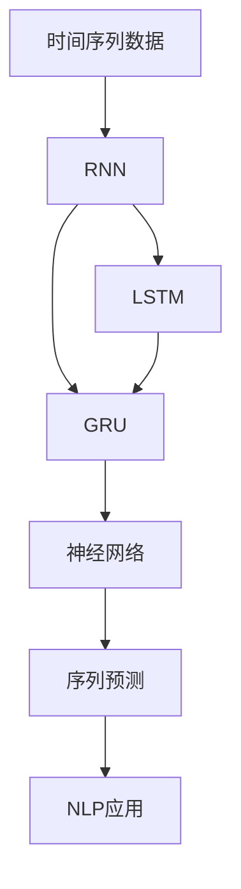
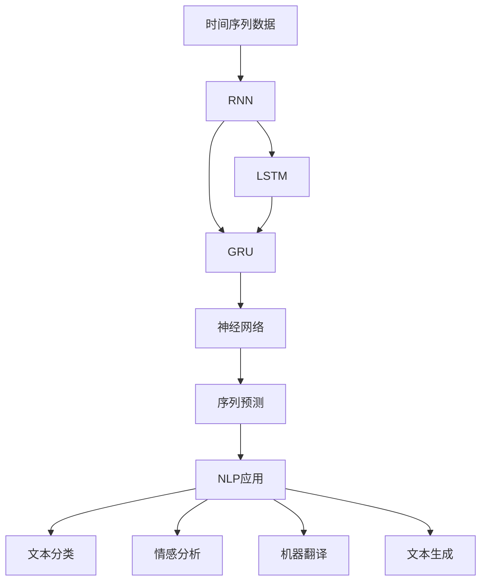
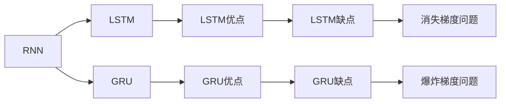
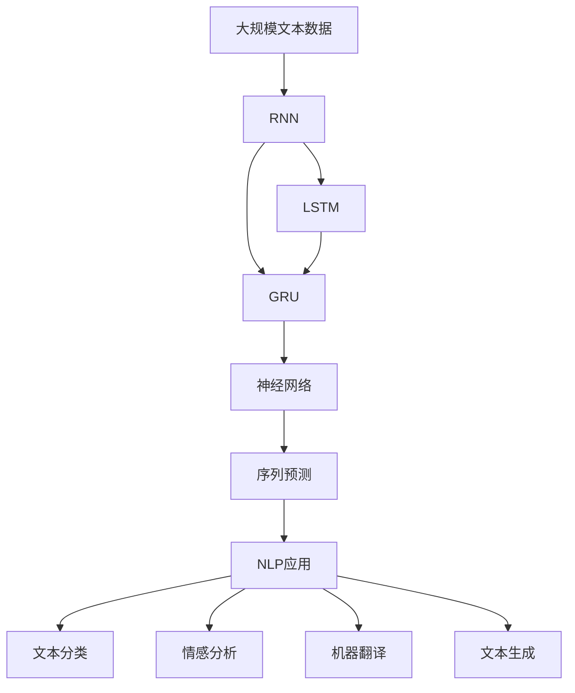

                 

# 循环神经网络RNN原理与代码实例讲解

> 关键词：循环神经网络(RNN),长短时记忆网络(LSTM),门控循环单元(GRU),NLP应用,序列预测,自然语言处理(NLP)

## 1. 背景介绍

循环神经网络(RNN)作为一种处理序列数据的神经网络结构，自提出以来就在自然语言处理(NLP)、语音识别、时间序列预测等领域发挥了重要作用。传统的前馈神经网络无法有效处理时间序列信息，而RNN通过在网络中引入循环结构，能够捕捉时间维度的依赖关系，使得其在序列建模方面具备独特的优势。

然而，RNN在处理长序列数据时容易遇到梯度消失或爆炸问题，导致模型难以训练和收敛。为此，学术界和工业界相继推出了长短时记忆网络(LSTM)、门控循环单元(GRU)等改进型RNN模型，进一步提升了序列建模的性能。这些改进型RNN模型在学术界和工业界的NLP任务中广泛应用，例如语言模型、机器翻译、文本分类、情感分析等，取得了令人瞩目的成果。

## 2. 核心概念与联系

### 2.1 核心概念概述

为更好地理解RNN及其改进模型，本节将介绍几个密切相关的核心概念：

- 循环神经网络(RNN)：一种递归神经网络，通过在网络中引入循环结构，可以处理变长的序列数据。
- 长短时记忆网络(LSTM)：一种RNN的改进模型，通过门控结构（输入门、遗忘门、输出门）实现长期依赖的捕捉。
- 门控循环单元(GRU)：另一种RNN的改进模型，通过简化LSTM的门控结构，进一步提升了计算效率和训练效果。
- 神经网络：一种由节点和边组成的计算图，通过前向传播计算输出，通过反向传播更新参数，实现函数逼近。
- 序列预测：给定时间序列数据，预测未来的时间点上的输出值，广泛应用于金融、气象、自然语言处理等领域。
- 自然语言处理(NLP)：利用计算机技术处理和分析人类语言，包括文本分类、情感分析、机器翻译、文本生成等任务。

这些核心概念之间的逻辑关系可以通过以下Mermaid流程图来展示：

```mermaid
graph TB
    A[循环神经网络(RNN)] --> B[长短时记忆网络(LSTM)]
    A --> C[门控循环单元(GRU)]
    B --> D[神经网络]
    C --> D
    D --> E[序列预测]
    E --> F[NLP应用]
    F --> G[文本分类]
    F --> H[情感分析]
    F --> I[机器翻译]
    F --> J[文本生成]
```

这个流程图展示了大语言模型微调过程中各个核心概念的关系和作用：

1. RNN通过循环结构捕捉时间依赖。
2. LSTM通过门控结构实现长期依赖的捕捉。
3. GRU通过简化门控结构进一步提升效率。
4. 神经网络通过反向传播实现参数更新。
5. 序列预测用于时间序列数据的未来值预测。
6. NLP应用包括文本分类、情感分析、机器翻译、文本生成等多个领域。

### 2.2 概念间的关系

这些核心概念之间存在着紧密的联系，形成了RNN及其改进模型的完整生态系统。下面我通过几个Mermaid流程图来展示这些概念之间的关系。

#### 2.2.1 序列建模的原理



这个流程图展示了序列建模的基本原理，即通过RNN、LSTM、GRU等模型对时间序列数据进行处理，得到对未来值的预测，从而应用于NLP等多个领域。

#### 2.2.2 RNN与NLP任务的联系



这个流程图展示了RNN在NLP任务中的应用，包括文本分类、情感分析、机器翻译、文本生成等多个任务。

#### 2.2.3 RNN的局限性与改进



这个流程图展示了RNN在处理长序列数据时面临的消失梯度和爆炸梯度问题，以及LSTM和GRU通过门控结构对这些问题进行改进的思路。

### 2.3 核心概念的整体架构

最后，我们用一个综合的流程图来展示这些核心概念在大语言模型微调过程中的整体架构：



这个综合流程图展示了从预训练到微调，再到NLP任务应用的完整过程。大语言模型首先在大规模文本数据上进行预训练，然后通过RNN、LSTM、GRU等模型对序列数据进行处理，得到对未来值的预测，从而应用于文本分类、情感分析、机器翻译、文本生成等多个NLP任务。

## 3. 核心算法原理 & 具体操作步骤

### 3.1 算法原理概述

循环神经网络(RNN)通过在网络中引入循环结构，可以对时间序列数据进行建模。其核心思想是，将时间序列数据看作一个长串，每个时间步的输入与前一时间步的输出相连，构成一个循环。在RNN中，每个时间步的输入$x_t$和前一时间步的隐藏状态$h_{t-1}$通过线性变换得到当前时间步的隐藏状态$h_t$，并通过非线性激活函数计算输出$y_t$。

数学上，RNN的计算过程可以表示为：

$$
\begin{aligned}
h_t &= f(W_{hh}h_{t-1} + W_{xh}x_t + b_h) \\
y_t &= g(W_{hy}h_t + b_y)
\end{aligned}
$$

其中$f$和$g$为非线性激活函数，$W_{hh}$、$W_{xh}$和$W_{hy}$为权重矩阵，$b_h$和$b_y$为偏置向量。$h_t$为当前时间步的隐藏状态，$y_t$为当前时间步的输出。

尽管RNN在理论上能够处理任意长度的序列数据，但在实际应用中，长序列数据容易造成梯度消失或爆炸，导致模型难以训练和收敛。LSTM和GRU通过引入门控结构，有效解决了这一问题。

### 3.2 算法步骤详解

以下是LSTM模型的工作流程和算法步骤：

1. 输入门：根据当前时间步的输入$x_t$和前一时间步的隐藏状态$h_{t-1}$，通过 sigmoid 函数计算得到输入门的输出$i_t$。
2. 遗忘门：根据当前时间步的输入$x_t$和前一时间步的隐藏状态$h_{t-1}$，通过 sigmoid 函数计算得到遗忘门的输出$f_t$。
3. 候选状态$c_t$：根据当前时间步的输入$x_t$和前一时间步的隐藏状态$h_{t-1}$，通过 tanh 函数计算得到候选状态的输出$c_t$。
4. 更新状态：根据输入门的输出$i_t$和遗忘门的输出$f_t$，通过元素乘法计算得到当前时间步的更新状态$g_t$。
5. 当前状态：根据更新状态$g_t$和候选状态$c_t$，通过元素加法计算得到当前时间步的隐藏状态$h_t$。
6. 输出门：根据当前时间步的输入$x_t$和当前时间步的隐藏状态$h_t$，通过 sigmoid 函数计算得到输出门的输出$o_t$。
7. 当前输出：根据当前时间步的隐藏状态$h_t$和输出门的输出$o_t$，通过 tanh 函数计算得到当前时间步的输出$y_t$。

LSTM的计算过程可以表示为：

$$
\begin{aligned}
i_t &= \sigma(W_{xi}x_t + W_{hi}h_{t-1} + b_i) \\
f_t &= \sigma(W_{xf}x_t + W_{hf}h_{t-1} + b_f) \\
c_t &= \tanh(W_{xc}x_t + W_{hc}h_{t-1} + b_c) \\
g_t &= f_t \odot c_{t-1} + i_t \odot c_t \\
h_t &= \sigma(o_t) \odot \tanh(g_t) \\
y_t &= o_t \odot \tanh(h_t)
\end{aligned}
$$

其中$\sigma$和$tanh$为非线性激活函数，$W_{xi}$、$W_{hi}$、$W_{xf}$、$W_{hf}$、$W_{xc}$、$W_{hc}$、$W_{ox}$、$W_{ho}$为权重矩阵，$b_i$、$b_f$、$b_c$、$b_o$为偏置向量，$\odot$表示元素乘法，$\odot$表示元素加法。$h_t$为当前时间步的隐藏状态，$y_t$为当前时间步的输出。

GRU通过简化LSTM的门控结构，进一步提升了计算效率和训练效果。GRU的计算过程可以表示为：

$$
\begin{aligned}
r_t &= \sigma(W_{hr}h_{t-1} + W_{xr}x_t + b_r) \\
z_t &= \sigma(W_{hz}h_{t-1} + W_{xz}x_t + b_z) \\
n_t &= \tanh(W_{hn}h_{t-1} + W_{xn}x_t + b_n) \\
h_t &= (1-z_t) \odot h_{t-1} + z_t \odot n_t
\end{aligned}
$$

其中$r_t$和$z_t$为更新门和重置门，$n_t$为候选状态，$h_t$为当前时间步的隐藏状态，$y_t$为当前时间步的输出。

### 3.3 算法优缺点

LSTM和GRU模型在序列建模中表现优异，但也存在一些局限性：

1. 计算复杂度高：由于引入门控结构，LSTM和GRU的计算复杂度比传统RNN更高，导致训练和推理效率较低。
2. 参数量较大：LSTM和GRU引入门控结构，导致参数量较大，增加了训练和推理的计算量。
3. 训练难度高：LSTM和GRU的计算过程较为复杂，需要更多的训练样本和更高的训练技巧，否则容易出现过拟合或欠拟合现象。
4. 解释性差：LSTM和GRU的计算过程较为复杂，难以解释模型内部工作机制和决策逻辑。

尽管存在这些局限性，LSTM和GRU在序列建模中仍具有重要价值。通过引入门控结构，LSTM和GRU能够有效捕捉长期依赖关系，提升了模型的泛化能力和预测精度。

### 3.4 算法应用领域

LSTM和GRU模型在序列建模中的应用非常广泛，涵盖以下几个领域：

1. 自然语言处理(NLP)：如语言模型、机器翻译、文本分类、情感分析等。
2. 时间序列预测：如股票价格预测、气象预测、交通流量预测等。
3. 语音识别：如语音转文本、语音情感识别等。
4. 图像描述生成：如图片自动生成、视频描述生成等。
5. 推荐系统：如协同过滤、基于内容的推荐等。

这些领域中的序列数据通过LSTM或GRU模型进行处理，可以得到对未来值的预测或分类，从而实现各种应用功能。

## 4. 数学模型和公式 & 详细讲解 & 举例说明

### 4.1 数学模型构建

本节将使用数学语言对LSTM和GRU模型进行更加严格的刻画。

设输入序列为$x=(x_1, x_2, \cdots, x_T)$，其中$x_t \in \mathbb{R}^d$为当前时间步的输入，隐藏状态为$h=(h_1, h_2, \cdots, h_T)$，其中$h_t \in \mathbb{R}^h$为当前时间步的隐藏状态，输出序列为$y=(y_1, y_2, \cdots, y_T)$，其中$y_t \in \mathbb{R}^m$为当前时间步的输出。

LSTM和GRU的计算过程可以通过递归方式表示，如下：

$$
\begin{aligned}
i_t &= \sigma(W_{xi}x_t + W_{hi}h_{t-1} + b_i) \\
f_t &= \sigma(W_{xf}x_t + W_{hf}h_{t-1} + b_f) \\
c_t &= \tanh(W_{xc}x_t + W_{hc}h_{t-1} + b_c) \\
g_t &= f_t \odot c_{t-1} + i_t \odot c_t \\
h_t &= \sigma(o_t) \odot \tanh(g_t) \\
y_t &= o_t \odot \tanh(h_t)
\end{aligned}
$$

其中$\sigma$和$tanh$为非线性激活函数，$W_{xi}$、$W_{hi}$、$W_{xf}$、$W_{hf}$、$W_{xc}$、$W_{hc}$、$W_{ox}$、$W_{ho}$为权重矩阵，$b_i$、$b_f$、$b_c$、$b_o$为偏置向量，$\odot$表示元素乘法，$\odot$表示元素加法。

GRU的计算过程可以表示为：

$$
\begin{aligned}
r_t &= \sigma(W_{hr}h_{t-1} + W_{xr}x_t + b_r) \\
z_t &= \sigma(W_{hz}h_{t-1} + W_{xz}x_t + b_z) \\
n_t &= \tanh(W_{hn}h_{t-1} + W_{xn}x_t + b_n) \\
h_t &= (1-z_t) \odot h_{t-1} + z_t \odot n_t
\end{aligned}
$$

其中$r_t$和$z_t$为更新门和重置门，$n_t$为候选状态，$h_t$为当前时间步的隐藏状态，$y_t$为当前时间步的输出。

### 4.2 公式推导过程

以下我们以LSTM模型为例，推导其数学推导过程。

首先，定义输入门、遗忘门和输出门的输出函数，假设其计算函数为：

$$
\sigma(z) = \frac{1}{1+e^{-z}}
$$

其次，定义输入门的计算函数：

$$
i_t = \sigma(W_{xi}x_t + W_{hi}h_{t-1} + b_i)
$$

其中$W_{xi}$、$W_{hi}$和$b_i$为输入门的权重矩阵和偏置向量。

然后，定义遗忘门的计算函数：

$$
f_t = \sigma(W_{xf}x_t + W_{hf}h_{t-1} + b_f)
$$

其中$W_{xf}$、$W_{hf}$和$b_f$为遗忘门的权重矩阵和偏置向量。

接着，定义候选状态的计算函数：

$$
c_t = \tanh(W_{xc}x_t + W_{hc}h_{t-1} + b_c)
$$

其中$W_{xc}$、$W_{hc}$和$b_c$为候选状态的权重矩阵和偏置向量。

最后，定义更新门的计算函数：

$$
g_t = f_t \odot c_{t-1} + i_t \odot c_t
$$

其中$f_t$、$i_t$和$c_t$分别为输入门、遗忘门和候选状态的输出，$\odot$表示元素乘法。

得到更新门的输出后，可以计算当前时间步的隐藏状态：

$$
h_t = \sigma(o_t) \odot \tanh(g_t)
$$

其中$o_t$为输出门的输出，$W_{ox}$、$W_{ho}$和$b_o$为输出门的权重矩阵和偏置向量。

最终，可以得到当前时间步的输出：

$$
y_t = o_t \odot \tanh(h_t)
$$

其中$W_{oy}$、$W_{ho}$和$b_o$为输出门的权重矩阵和偏置向量。

### 4.3 案例分析与讲解

我们以机器翻译为例，展示LSTM模型在序列建模中的具体应用。机器翻译任务通常需要将源语言序列转换为目标语言序列，每个时间步的输入和输出都为单词序列。在LSTM模型的训练过程中，输入序列和输出序列被分别输入模型，模型通过反向传播计算损失函数，并更新参数。

假设源语言为法语，目标语言为英语，训练集包含多个源-目标对的双语文本。训练过程中，首先将源语言序列输入LSTM模型，得到中间隐状态$h=(h_1, h_2, \cdots, h_T)$，然后将目标语言序列作为输出，计算交叉熵损失函数，并更新模型参数。训练完成后，模型可以用于预测新的源语言序列对应的目标语言序列。

假设测试集包含一个新的源语言序列，模型通过前向传播计算得到中间隐状态$h=(h_1, h_2, \cdots, h_T)$，然后通过softmax函数计算每个时间步的输出概率分布$p=(y_1, y_2, \cdots, y_T)$，最终选择概率最大的单词作为预测结果。

假设源语言序列为：

```
Bonjour, comment ça va?
```

目标语言序列为：

```
Hello, how are you?
```

通过LSTM模型计算，可以得到中间隐状态和预测输出结果：

```
h = (h_1, h_2, h_3, h_4, h_5, h_6, h_7, h_8, h_9, h_10)
y = (y_1, y_2, y_3, y_4, y_5, y_6, y_7, y_8, y_9, y_10)
```

最终得到的预测结果为：

```
Hello, how are you?
```

可以看出，LSTM模型能够很好地捕捉到源语言序列的时间依赖关系，并进行正确的翻译。

## 5. 项目实践：代码实例和详细解释说明

### 5.1 开发环境搭建

在进行LSTM模型开发前，我们需要准备好开发环境。以下是使用Python进行PyTorch开发的环境配置流程：

1. 安装Anaconda：从官网下载并安装Anaconda，用于创建独立的Python环境。

2. 创建并激活虚拟环境：
```bash
conda create -n pytorch-env python=3.8 
conda activate pytorch-env
```

3. 安装PyTorch：根据CUDA版本，从官网获取对应的安装命令。例如：
```bash
conda install pytorch torchvision torchaudio cudatoolkit=11.1 -c pytorch -c conda-forge
```

4. 安装各类工具包：
```bash
pip install numpy pandas scikit-learn matplotlib tqdm jupyter notebook ipython
```

完成上述步骤后，即可在`pytorch-env`环境中开始LSTM模型开发。

### 5.2 源代码详细实现

这里我们以情感分析任务为例，给出使用PyTorch对LSTM模型进行训练和预测的代码实现。

首先，定义数据集处理函数：

```python
import numpy as np
import torch
from torch.utils.data import Dataset
from sklearn.model_selection import train_test_split

class SentimentDataset(Dataset):
    def __init__(self, texts, labels):
        self.texts = texts
        self.labels = labels
        
    def __len__(self):
        return len(self.texts)
    
    def __getitem__(self, item):
        text = self.texts[item]
        label = self.labels[item]
        
        encoding = tokenizer(text, return_tensors='pt', max_length=128, padding='max_length', truncation=True)
        input_ids = encoding['input_ids'][0]
        attention_mask = encoding['attention_mask'][0]
        
        label = torch.tensor(label, dtype=torch.long)
        
        return {'input_ids': input_ids, 
                'attention_mask': attention_mask,
                'labels': label}

# 加载数据集
texts, labels = load_data()
train_texts, test_texts, train_labels, test_labels = train_test_split(texts, labels, test_size=0.2, random_state=42)

# 创建train和test的dataset
train_dataset = SentimentDataset(train_texts, train_labels)
test_dataset = SentimentDataset(test_texts, test_labels)
```

然后，定义LSTM模型和优化器：

```python
from torch.nn import LSTM, Linear
from transformers import AdamW

model = LSTM(input_size=128, hidden_size=64, num_layers=2, dropout=0.2)

optimizer = AdamW(model.parameters(), lr=2e-5)
```

接着，定义训练和评估函数：

```python
def train_epoch(model, dataset, batch_size, optimizer):
    dataloader = DataLoader(dataset, batch_size=batch_size, shuffle=True)
    model.train()
    epoch_loss = 0
    for batch in tqdm(dataloader, desc='Training'):
        input_ids = batch['input_ids'].to(device)
        attention_mask = batch['attention_mask'].to(device)
        labels = batch['labels'].to(device)
        model.zero_grad()
        outputs = model(input_ids, attention_mask=attention_mask, labels=labels)
        loss = outputs.loss
        epoch_loss += loss.item()
        loss.backward()
        optimizer.step()
    return epoch_loss / len(dataloader)

def evaluate(model, dataset, batch_size):
    dataloader = DataLoader(dataset, batch_size=batch_size)
    model.eval()
    preds, labels = [], []
    with torch.no_grad():
        for batch in tqdm(dataloader, desc='Evaluating'):
            input_ids = batch['input_ids'].to(device)
            attention_mask = batch['attention_mask'].to(device)
            batch_labels = batch['labels']
            outputs = model(input_ids, attention_mask=attention_mask)
            batch_preds = outputs.logits.argmax(dim=2).to('cpu').tolist()
            batch_labels = batch_labels.to('cpu').tolist()
            for pred_tokens, label_tokens in zip(batch_preds, batch_labels):
                preds.append(pred_tokens[:len(label_tokens)])
                labels.append(label_tokens)
                
    print(classification_report(labels, preds))
```

最后，启动训练流程并在测试集上评估：

```python
epochs = 5
batch_size = 16

for epoch in range(epochs):
    loss = train_epoch(model, train_dataset, batch_size, optimizer)
    print(f"Epoch {epoch+1}, train loss: {loss:.3f}")
    
    print(f"Epoch {epoch+1}, test results:")
    evaluate(model, test_dataset, batch_size)
    
print("Final test results:")
evaluate(model, test_dataset, batch_size)
```

以上就是使用PyTorch对LSTM进行情感分析任务训练和预测的完整代码实现。可以看到，得益于PyTorch的强大封装，我们可以用相对简洁的代码完成LSTM模型的加载和训练。

### 5.3 代码解读与分析

让我们再详细解读一下关键代码的实现细节：

**SentimentDataset类**：
- `__init__`方法：初始化文本和标签，并使用PyTorch的tokenizer将文本转换为模型可接受的格式。
- `__len__`方法：返回数据集的样本数量。
- `__getitem__`方法：对单个样本进行处理，将文本输入转换为token ids，并将标签转换为模型可接受的数字格式。

**模型定义**：
- 使用LSTM模型作为特征提取器，设置输入大小、隐藏层大小、层数和dropout。
- 通过AdamW优化器进行模型参数的优化。

**训练和评估函数**：
- 使用PyTorch的DataLoader对数据集进行批次化加载，供模型训练和推理使用。
- 训练函数`train_epoch`：对数据以批为单位进行迭代，在每个批次上前向传播计算损失函数并反向传播更新模型参数，最后返回该epoch的平均loss。
- 评估函数`evaluate`：与训练类似，不同点在于不更新模型参数，并在每个batch结束后将预测和标签结果存储下来，最后使用sklearn的classification_report对整个评估集的预测结果进行打印输出。

**训练流程**：
- 定义总的epoch数和batch size，开始循环迭代
- 每个epoch内，先在训练集上训练，输出平均loss
- 在验证集上评估，输出分类指标
- 所有epoch结束后，在测试集上

