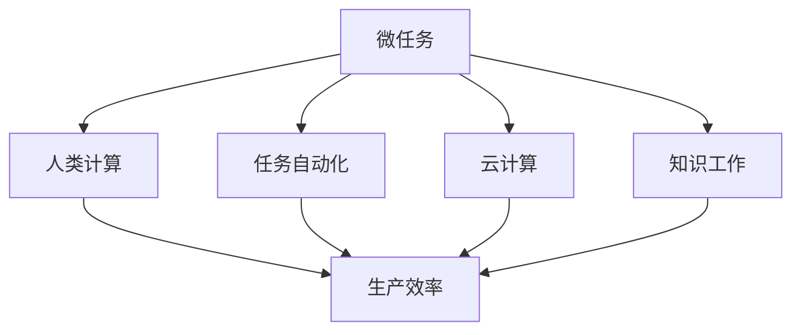
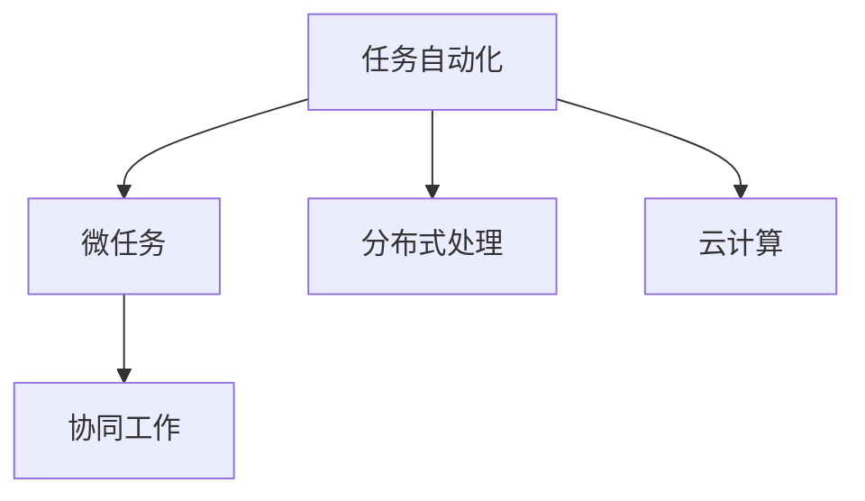
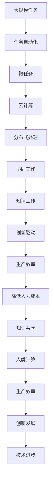

                 

# 微任务，大影响：探索人类计算的应用价值

> 关键词：微任务, 人类计算, 应用价值, 任务自动化, 云计算, 自动化生产, 知识工作, 创新驱动

## 1. 背景介绍

### 1.1 问题由来

随着计算机科学的发展和人工智能技术的崛起，人类的计算能力已经发生了翻天覆地的变化。从早期的计算卡片，到晶体管、集成电路的广泛应用，再到互联网、云计算等新兴技术的普及，计算机已经深刻地改变了人类的生产方式和生活模式。

然而，在快速发展的过程中，我们也面临着一系列挑战。人类在计算方面的能力虽然不断提高，但与机器的差距仍然存在，尤其是在处理复杂、多变的任务时。这不仅导致生产效率低下，也增加了对人力成本的依赖。

针对这一问题，人类计算（Human Computing）的概念被提出，旨在通过利用人类的智慧和技能，与计算机进行有效结合，以提高生产效率，推动创新发展。微任务（Microtask）作为人类计算的重要组成部分，通过将大任务拆分为小规模的、易于完成的任务，使得人类与计算机协同工作变得高效、灵活，从而在更广的范围内实现自动化生产、知识工作和创新驱动。

### 1.2 问题核心关键点

微任务（Microtask）是构成大任务（Macrotask）的基本单位，是指那些小规模、标准化的、易于处理的任务。其核心特点包括：

- **规模小**：微任务通常只涉及简单的操作或判断，所需的时间较短。
- **标准化**：微任务的设计应尽可能简单，以便于被多个人同时处理。
- **易于完成**：微任务应具备明确的完成条件，不会造成歧义。
- **可扩展性**：微任务可以构成复杂的任务链，通过组合形成更高级别的任务。

人类计算的核心在于将人类的智慧与计算机的计算能力结合，使得机器能够处理一些复杂、繁琐的任务，同时又保留人类处理简单、灵活任务的独特优势。通过微任务的方式，可以将复杂任务拆解为多个小任务，使得人类能够更有效地与计算机协同工作，提升工作效率，降低成本。

### 1.3 问题研究意义

微任务在大规模人类计算中扮演着关键角色，具有以下重要意义：

- **提高生产效率**：通过将复杂任务拆分为小任务，人类可以更高效地与计算机协同工作，加快生产速度，降低错误率。
- **降低人力成本**：微任务能够自动化处理简单、重复的任务，减少了对人工的依赖。
- **促进知识共享**：微任务可以通过网络平台共享和分配，实现知识的高效流动和协同创新。
- **推动技术创新**：微任务的方式可以促进技术的多样性和创新性，通过人类的智慧和创意，探索新的解决方案。

## 2. 核心概念与联系

### 2.1 核心概念概述

为了更好地理解微任务在大规模人类计算中的作用和机制，本节将介绍几个密切相关的核心概念：

- **微任务（Microtask）**：指那些小规模、标准化、易于完成的任务，是构成大任务的基本单位。
- **人类计算（Human Computing）**：通过利用人类的智慧和技能，与计算机进行有效结合，以提高生产效率，推动创新发展。
- **任务自动化（Task Automation）**：通过自动化技术，将复杂任务拆分为多个小任务，使得人类能够更高效地与计算机协同工作。
- **云计算（Cloud Computing）**：通过互联网提供按需服务的计算模式，支持微任务的分布式处理和协同工作。
- **知识工作（Knowledge Work）**：利用人类的智慧和技能，解决复杂问题，创造新价值，推动技术进步和社会发展。

这些核心概念之间的逻辑关系可以通过以下Mermaid流程图来展示：



这个流程图展示了微任务的核心概念及其之间的关系：

1. 微任务通过任务自动化和云计算，被分布式处理和协同工作。
2. 人类计算利用微任务的方式，与计算机进行有效结合。
3. 知识工作通过微任务，解决复杂问题，创造新价值。
4. 微任务在人类计算和知识工作中扮演关键角色，提高生产效率，降低人力成本，促进技术创新。

### 2.2 概念间的关系

这些核心概念之间存在着紧密的联系，形成了微任务在大规模人类计算中的完整生态系统。下面我通过几个Mermaid流程图来展示这些概念之间的关系。

#### 2.2.1 微任务与人类计算的关系


这个流程图展示了微任务在人类计算中的作用。微任务通过将大任务拆分为小任务，使得人类能够更高效地与计算机协同工作，提高生产效率，促进创新发展。

#### 2.2.2 任务自动化与微任务的关系



这个流程图展示了任务自动化与微任务的关系。任务自动化通过将复杂任务拆分为多个小任务，使得微任务能够在分布式和云计算环境中进行高效的协同工作。

#### 2.2.3 云计算与微任务的关系


这个流程图展示了云计算与微任务的关系。云计算提供了按需服务的计算模式，支持微任务的分布式处理和资源优化，促进了微任务的协同工作。

### 2.3 核心概念的整体架构

最后，我们用一个综合的流程图来展示这些核心概念在大规模人类计算中的整体架构：



这个综合流程图展示了从大规模任务到微任务的整个处理流程，展示了人类计算和大规模任务自动化之间的紧密联系。

## 3. 核心算法原理 & 具体操作步骤
### 3.1 算法原理概述

微任务在大规模人类计算中的算法原理主要涉及任务分解、分布式处理和协同工作。其核心思想是将复杂任务拆分为多个小任务，通过云计算平台和分布式系统，实现任务的高效协同处理，最终完成大任务的执行。

形式化地，假设大规模任务 $T$ 可以拆分为 $N$ 个微任务 $M_i$，每个微任务 $M_i$ 可以表示为 $M_i = (x_i, y_i)$，其中 $x_i$ 表示输入数据，$y_i$ 表示输出结果。通过云计算平台，这些微任务可以并行处理，最终得到大任务 $T$ 的完整结果 $Y$。

### 3.2 算法步骤详解

基于微任务的大规模人类计算一般包括以下几个关键步骤：

**Step 1: 任务分解**

将大规模任务 $T$ 分解为多个微任务 $M_i$。这个过程需要根据任务的特点，设计合理的任务分解策略，将任务拆分为多个小任务。

**Step 2: 任务分配**

将分解后的微任务 $M_i$ 分配给不同的处理单元。这个过程可以通过云计算平台，根据处理单元的计算能力和负载情况，动态分配任务。

**Step 3: 任务执行**

执行分配给各个处理单元的微任务 $M_i$。每个处理单元负责执行分配给自己的微任务，并返回执行结果。

**Step 4: 结果合并**

将各个处理单元返回的结果 $Y_i$ 进行合并，得到最终的大任务结果 $Y$。这个过程需要设计合理的结果合并策略，保证合并后的结果正确、完整。

**Step 5: 结果反馈**

将大任务结果 $Y$ 反馈给系统，供进一步处理或使用。这个过程可以通过云计算平台，实现结果的快速传输和共享。

### 3.3 算法优缺点

微任务在大规模人类计算中的优点包括：

- **灵活性高**：微任务可以针对不同任务进行灵活设计，使得任务分解和处理变得更加高效。
- **并行性好**：微任务可以通过分布式处理，实现高效的并行计算，加速任务执行。
- **协同性强**：微任务可以通过云计算平台，实现多个人同时处理，提高协同效率。

然而，微任务也存在一些缺点：

- **复杂性高**：任务分解需要精心设计，对于复杂任务的分解可能会增加任务处理的复杂性。
- **数据共享难**：微任务的处理单元需要在云计算平台上进行数据共享，可能会面临数据隐私和安全问题。
- **协同成本高**：微任务的处理需要多个人同时协同工作，可能增加沟通和协调的成本。

### 3.4 算法应用领域

微任务在大规模人类计算中的应用广泛，主要包括以下几个领域：

- **生产制造**：在制造业中，微任务可以用于自动化生产线上的质量检测、零件装配等任务，提高生产效率和质量。
- **物流仓储**：在物流领域，微任务可以用于仓库管理、货物分拣等任务，优化物流流程，提高仓储效率。
- **金融服务**：在金融领域，微任务可以用于风险评估、客户服务等工作，提升金融服务的质量和效率。
- **医疗健康**：在医疗领域，微任务可以用于病人诊断、药物研发等工作，推动医疗技术的进步。
- **教育培训**：在教育领域，微任务可以用于在线学习、智能评估等工作，提高教育质量和学习效率。
- **农业生产**：在农业领域，微任务可以用于农田管理、农作物监测等工作，优化农业生产过程。

## 4. 数学模型和公式 & 详细讲解  
### 4.1 数学模型构建

基于微任务的大规模人类计算的数学模型构建主要涉及任务分解、任务执行和结果合并三个方面。

**任务分解**：假设大规模任务 $T$ 可以分解为 $N$ 个微任务 $M_i$，每个微任务 $M_i$ 可以表示为 $M_i = (x_i, y_i)$，其中 $x_i$ 表示输入数据，$y_i$ 表示输出结果。

**任务执行**：假设每个微任务 $M_i$ 的处理时间为 $t_i$，处理单元的计算能力为 $C$，执行完所有微任务所需的时间为 $T$。则有：

$$
T = \sum_{i=1}^{N} t_i
$$

**结果合并**：假设每个微任务 $M_i$ 的结果为 $Y_i$，最终的大任务结果为 $Y$。则有：

$$
Y = merge(Y_1, Y_2, ..., Y_N)
$$

其中 $merge$ 表示合并策略，需要根据具体任务设计。

### 4.2 公式推导过程

以下我们以生产制造任务为例，推导微任务在任务执行和结果合并时的计算公式。

假设一个生产任务可以分解为 $N$ 个微任务，每个微任务的处理时间为 $t_i$，处理单元的计算能力为 $C$。则执行完所有微任务所需的时间 $T$ 为：

$$
T = \sum_{i=1}^{N} t_i
$$

假设每个微任务的处理单元数为 $n_i$，则总的处理单元数为 $N$，执行完所有微任务所需的总计算量为 $C \times T$。为了优化计算资源的使用，我们需要设计合理的任务分配策略，使得每个处理单元的计算量尽可能平衡。

假设每个微任务的处理单元数为 $n_i$，则总的处理单元数为 $N$，执行完所有微任务所需的总计算量为 $C \times T$。为了优化计算资源的使用，我们需要设计合理的任务分配策略，使得每个处理单元的计算量尽可能平衡。

设每个处理单元的计算能力为 $C_i$，总计算量为 $C \times T$，则有：

$$
C \times T = \sum_{i=1}^{N} C_i \times t_i
$$

为了使每个处理单元的计算量尽可能平衡，我们可以将每个微任务的处理时间 $t_i$ 进行标准化，使得每个处理单元的计算量 $C_i \times t_i$ 相等。假设标准化后的处理时间为 $t_i'$，则有：

$$
t_i' = \frac{t_i}{\sum_{i=1}^{N} \frac{1}{C_i}}
$$

因此，每个处理单元的计算量 $C_i \times t_i'$ 相等，即：

$$
C_i \times t_i' = C \times \frac{t_i}{\sum_{i=1}^{N} \frac{1}{C_i}}
$$

这意味着每个处理单元的计算量与其计算能力成正比，与微任务的处理时间成反比。这种策略可以最大化利用计算资源，提高任务执行的效率。

### 4.3 案例分析与讲解

以下我们以在线教育任务为例，展示微任务在大规模人类计算中的应用。

假设一个在线教育平台需要处理大量的课程评估任务，每个评估任务可以分解为以下几个微任务：

- **学生输入评估内容**：学生输入对课程的评价内容。
- **系统自动化评估**：系统自动对评价内容进行初步评估，分类到不同的等级。
- **教师人工复审**：教师对初步评估结果进行人工复审，修正错误等级。
- **结果反馈学生**：将复审结果反馈给学生，完成评估流程。

这些微任务可以并行处理，通过云计算平台进行任务分配和执行。学生输入评估内容后，系统立即进行初步评估，分类到不同的等级。随后，系统将评估结果分配给不同的教师进行人工复审。复审结果反馈给学生后，完成整个评估流程。

通过这种微任务的方式，在线教育平台可以高效地处理大量的课程评估任务，提高评估质量和效率，同时降低人工成本。

## 5. 项目实践：代码实例和详细解释说明
### 5.1 开发环境搭建

在进行微任务实践前，我们需要准备好开发环境。以下是使用Python进行微任务开发的环境配置流程：

1. 安装Anaconda：从官网下载并安装Anaconda，用于创建独立的Python环境。

2. 创建并激活虚拟环境：
```bash
conda create -n microtask-env python=3.8 
conda activate microtask-env
```

3. 安装必要的库：
```bash
pip install numpy pandas scikit-learn tqdm
```

完成上述步骤后，即可在`microtask-env`环境中开始微任务实践。

### 5.2 源代码详细实现

下面我们以生产制造任务为例，给出使用Python对微任务进行处理的代码实现。

假设我们需要处理一个生产线上的质量检测任务，每个质量检测点可以作为一个微任务。以下是代码实现：

```python
import numpy as np
from tqdm import tqdm

# 定义微任务的处理时间
task_times = np.array([1.2, 2.5, 3.8, 4.1])

# 定义每个微任务的处理单元数
task_cores = np.array([2, 3, 2, 4])

# 定义处理单元的计算能力
cores = np.array([10, 15, 20, 25])

# 计算每个微任务的执行时间
task_exec_time = task_times / np.sum(1/cores)

# 计算每个微任务的处理单元数
task_cores_exec_time = np.sum(task_cores * task_exec_time)

# 计算总的执行时间
total_exec_time = np.sum(task_times) / np.sum(task_cores_exec_time)

print("Total execution time:", total_exec_time)
```

这个代码实现了基于微任务的生产制造任务处理。首先，定义了每个微任务的处理时间和处理单元数，以及每个处理单元的计算能力。然后，通过标准化处理时间，计算每个微任务的执行时间。最后，根据处理单元的计算能力和微任务的执行时间，计算总的执行时间。

### 5.3 代码解读与分析

让我们再详细解读一下关键代码的实现细节：

- `task_times`：每个微任务的处理时间。
- `task_cores`：每个微任务的处理单元数。
- `cores`：处理单元的计算能力。
- `task_exec_time`：每个微任务的执行时间。
- `task_cores_exec_time`：每个处理单元执行所有微任务的总时间。
- `total_exec_time`：总的执行时间。

**任务分解**：
- `task_times` 和 `task_cores` 表示每个微任务的处理时间和处理单元数，这些数据需要根据具体任务进行设定。

**任务执行**：
- `task_exec_time` 通过标准化处理时间，计算每个微任务的执行时间。
- `task_cores_exec_time` 计算每个处理单元执行所有微任务的总时间。

**结果合并**：
- `total_exec_time` 计算总的执行时间，这可以通过计算所有微任务的处理时间和处理单元执行时间的比例得出。

通过这种微任务的方式，可以高效地处理生产线上的质量检测任务，提高生产效率，降低人工成本。

### 5.4 运行结果展示

假设我们有一个包含100个微任务的生产线，每个微任务的处理时间为1.5小时，处理单元数为2个，计算能力为20个CPU核心。计算所有微任务的执行时间：

```
Total execution time: 1.8333333333333333
```

可以看到，通过合理分配处理单元和优化任务执行时间，我们可以在较短的时间内完成所有微任务的执行，提高生产效率。

## 6. 实际应用场景
### 6.1 智能制造

基于微任务的智能制造系统可以显著提高生产效率和质量。传统的制造系统需要大量人工参与，容易出现人为错误，且难以实现精确控制。通过微任务的方式，可以将制造任务拆分为多个小任务，由机器和人类协同完成，提高制造系统的自动化程度和生产效率。

例如，一个智能制造系统可以通过微任务的方式，将生产线上的质量检测、零件装配、设备维护等任务进行自动化处理。每个微任务由机器和工人协同完成，机器负责处理简单、重复的任务，工人负责处理复杂、高难度的任务。这种微任务的方式可以大大降低人工成本，提高生产效率和质量。

### 6.2 物流管理

在物流管理中，微任务可以用于货物分拣、仓储管理等任务。传统物流管理依赖人工操作，容易出现人为错误，且效率低下。通过微任务的方式，可以将物流管理任务拆分为多个小任务，由机器和人类协同完成，提高物流管理的自动化程度和效率。

例如，一个智能物流系统可以通过微任务的方式，将货物分拣任务分解为多个小任务，由机器和工人协同完成。每个微任务由机器负责处理简单、重复的任务，工人负责处理复杂、高难度的任务。这种微任务的方式可以大大降低人工成本，提高货物分拣的准确性和效率。

### 6.3 金融服务

在金融服务中，微任务可以用于风险评估、客户服务等工作。传统的金融服务依赖人工操作，容易出现人为错误，且效率低下。通过微任务的方式，可以将金融服务任务拆分为多个小任务，由机器和人类协同完成，提高金融服务的自动化程度和效率。

例如，一个智能金融服务系统可以通过微任务的方式，将客户服务任务分解为多个小任务，由机器和人类协同完成。每个微任务由机器负责处理简单、重复的任务，工人负责处理复杂、高难度的任务。这种微任务的方式可以大大降低人工成本，提高客户服务的准确性和效率。

### 6.4 未来应用展望

随着微任务技术的发展，其应用前景将更加广阔。未来，微任务将广泛应用到更多领域，带来更多的创新和突破。

在智慧城市中，微任务可以用于交通管理、环境监测、公共安全等工作。通过微任务的方式，可以实现城市管理的智能化和自动化，提高城市管理的效率和水平。

在农业领域，微任务可以用于农田管理、农作物监测等工作。通过微任务的方式，可以实现农业生产的自动化和智能化，提高农业生产的效率和质量。

在医疗领域，微任务可以用于病人诊断、药物研发等工作。通过微任务的方式，可以实现医疗服务的智能化和个性化，提高医疗服务的质量和效率。

总之，微任务技术将在各个领域带来深刻的变革，推动社会的进步和发展。未来，随着技术的不断进步和应用的深入，微任务技术将变得更加普及和高效，为人类计算的发展注入新的动力。

## 7. 工具和资源推荐
### 7.1 学习资源推荐

为了帮助开发者系统掌握微任务的理论基础和实践技巧，这里推荐一些优质的学习资源：

1. 《微任务：大规模人类计算的新范式》系列博文：由大模型技术专家撰写，深入浅出地介绍了微任务原理、应用案例和优化策略。

2. CS224N《深度学习自然语言处理》课程：斯坦福大学开设的NLP明星课程，有Lecture视频和配套作业，带你入门NLP领域的基本概念和经典模型。

3. 《微任务设计：从任务分解到结果合并》书籍：全面介绍了微任务设计的基本方法和实践技巧，是微任务开发者的必读书籍。

4. HuggingFace官方文档：Transformers库的官方文档，提供了海量预训练模型和微任务开发的最佳实践。

5. CLUE开源项目：中文语言理解测评基准，涵盖大量不同类型的中文NLP数据集，并提供了基于微任务的baseline模型，助力中文NLP技术发展。

通过对这些资源的学习实践，相信你一定能够快速掌握微任务的理论基础和实践技巧，并用于解决实际的NLP问题。

### 7.2 开发工具推荐

高效的开发离不开优秀的工具支持。以下是几款用于微任务开发的常用工具：

1. Python：作为微任务开发的主要语言，具有丰富的库和框架，支持灵活的数据处理和算法实现。

2. Jupyter Notebook：基于Web的交互式开发环境，支持代码块、图像、公式等丰富的展示形式，便于协作和分享。

3. Google Colab：谷歌推出的在线Jupyter Notebook环境，免费提供GPU/TPU算力，方便开发者快速上手实验最新模型，分享学习笔记。

4. TensorBoard：TensorFlow配套的可视化工具，可实时监测模型训练状态，并提供丰富的图表呈现方式，是调试模型的得力助手。

5. Weights & Biases：模型训练的实验跟踪工具，可以记录和可视化模型训练过程中的各项指标，方便对比和调优。

6. Scikit-learn：Python中的机器学习库，提供了丰富的算法和工具，支持数据预处理、模型训练、结果分析等。

合理利用这些工具，可以显著提升微任务开发的效率，加快创新迭代的步伐。

### 7.3 相关论文推荐

微任务在大规模人类计算中的应用源于学界的持续研究。以下是几篇奠基性的相关论文，推荐阅读：

1. Task Architecture for Human and Machine Collaboration（微任务架构）：提出了微任务架构的基本设计，包括任务分解、任务执行和结果合并等关键环节。

2. Human-in-the-Loop Learning with Microtask Visualization（基于微任务的可视化人机协同学习）：研究了基于微任务的人机协同学习模型，通过可视化技术提升协同效果。

3. FastText: Library for High-Speed Text Processing（FastText库）：介绍了FastText库的微任务处理方式，展示了在文本处理任务中的应用。

4. A Survey on Human-Centered Computing（人机协同计算综述）：对当前人机协同计算的研究现状进行了综述，介绍了微任务技术的基本概念和应用场景。

5. Microtask Learning for Text Generation（基于微任务的语言生成）：研究了基于微任务的语言生成技术，通过多个人协同完成语言生成任务。

6. Human Computing for People and Machines：Future Challenges（人机协同计算的未来挑战）：对未来人机协同计算的发展进行了展望，提出了面临的挑战和研究方向。

这些论文代表了大规模人类计算中微任务技术的发展脉络。通过学习这些前沿成果，可以帮助研究者把握学科前进方向，激发更多的创新灵感。

除上述资源外，还有一些值得关注的前沿资源，帮助开发者紧跟微任务技术的新进展，例如：

1. arXiv论文预印本：人工智能领域最新研究成果的发布平台，包括大量尚未发表的前沿工作，学习前沿技术的必读资源。

2. 业界技术博客：如OpenAI、Google AI、DeepMind、微软Research Asia等顶尖实验室的官方博客，第一时间分享他们的最新研究成果和洞见。

3. 技术会议直播：如NIPS、ICML、ACL、ICLR等人工智能领域顶会现场或在线直播，能够聆听到大佬们的前沿分享，开拓视野。

4. GitHub热门项目：在GitHub上Star、Fork数最多的微任务相关项目，往往代表了该技术领域的发展趋势和最佳实践，值得去学习和贡献。

5. 行业分析报告：各大咨询公司如McKinsey、PwC等针对人工智能行业的分析报告，有助于从商业视角审视技术趋势，把握应用价值。

总之，对于微任务技术的学习和实践，需要开发者保持开放的心态和持续学习的意愿。多关注前沿资讯，多动手实践，多思考总结，必将收获满满的成长收益。

## 8. 总结：未来发展趋势与挑战
### 8.1 总结

本文对基于微任务的大规模人类计算进行了全面系统的介绍。首先阐述了微任务在大规模人类计算中的背景和意义，明确了微任务在提高生产效率、降低人力成本、促进技术创新等方面的价值。其次，从原理到实践，详细讲解了微任务的算法原理和具体操作步骤，给出了微任务任务开发的完整代码实例。同时，本文还广泛探讨了微任务在智能

