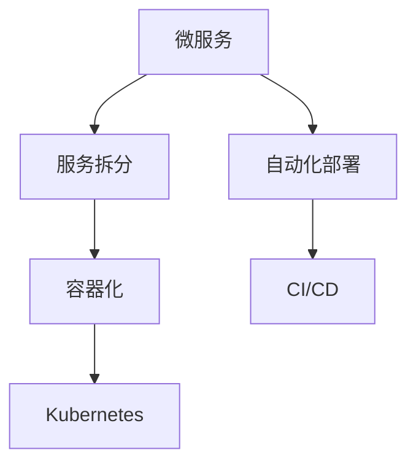

                 

# 微服务在高扩展性中的优势

> 关键词：微服务架构, 高扩展性, 可伸缩性, 服务拆分, 容器化, Kubernetes, 自动化部署, 持续集成持续部署(CI/CD)

## 1. 背景介绍

随着互联网应用的快速发展和用户需求的不断变化，现代Web应用需要具备高度的灵活性和可扩展性，以应对突如其来的流量高峰和复杂的业务逻辑。传统的单体架构已经无法满足这种需求，微服务架构应运而生，成为应对复杂系统设计的一种有效手段。

微服务架构是一种将应用程序拆分为多个独立且可互操作的小型服务，每个服务专注于特定业务功能并独立部署的架构风格。微服务架构的优势在于它能够提高系统的可维护性、可扩展性和灵活性。本文将深入探讨微服务在高扩展性中的优势，并通过实例说明其应用。

## 2. 核心概念与联系

### 2.1 核心概念概述

为了更好地理解微服务架构，我们需要先了解其核心概念：

- **微服务**：将大型应用拆分为多个独立的小型服务，每个服务运行在自己的进程中，使用轻量级通信机制进行交互。

- **服务拆分**：将应用程序按照业务功能拆分为多个小的服务单元，每个服务能够独立运行、独立部署、独立扩展。

- **容器化**：使用容器技术将服务打包成可移植、可重复的镜像，便于部署和扩展。

- **Kubernetes**：开源容器编排平台，用于管理、部署和扩展容器化的微服务应用。

- **自动化部署**：通过CI/CD工具链实现微服务的自动化构建、测试、部署和监控。

- **持续集成持续部署**(CI/CD)：自动化开发流程，包括代码合并、构建、测试和部署，提高开发效率和系统稳定性。

### 2.2 概念间的关系

这些核心概念之间的逻辑关系可以通过以下Mermaid流程图来展示：



这个流程图展示了几者之间的相互关系：

1. **微服务**是基于**服务拆分**技术构建的，将复杂的应用程序拆分为多个小型服务。
2. **容器化**技术使得这些小型服务能够独立运行，方便部署和扩展。
3. **Kubernetes**提供了完整的容器编排管理功能，方便微服务的部署和扩展。
4. **自动化部署**和**CI/CD**通过自动化流程提高了开发效率和系统稳定性。

这些概念共同构成了微服务架构的核心技术体系，使得微服务在高扩展性方面具有显著优势。

## 3. 核心算法原理 & 具体操作步骤
### 3.1 算法原理概述

微服务架构的核心算法原理是通过服务拆分和独立部署来实现高扩展性。每个微服务作为一个独立的部署单元，可以根据需求进行横向扩展。微服务架构的设计原则包括以下几点：

- **按业务功能拆分**：根据业务功能划分服务边界，确保每个服务专注于单一的业务功能。
- **独立部署**：每个服务独立运行和部署，便于横向扩展和问题隔离。
- **轻量级通信**：使用HTTP/REST或消息队列等轻量级通信机制，减少服务间的耦合。
- **持续集成持续部署**：通过自动化流程提高开发效率和系统稳定性。

这些原则使得微服务架构能够适应不同的业务需求和流量变化，实现高扩展性。

### 3.2 算法步骤详解

微服务架构的实施步骤主要包括以下几个方面：

1. **需求分析**：明确应用程序的业务功能和模块划分，确定需要拆分的服务。
2. **服务设计**：根据业务功能划分，设计独立的服务单元。
3. **服务实现**：开发和实现每个服务的功能，包括前端、后端和数据层。
4. **容器化**：将服务打包成容器镜像，便于部署和扩展。
5. **编排管理**：使用Kubernetes等容器编排工具，实现服务的自动部署和管理。
6. **CI/CD集成**：集成自动化工具链，实现服务的持续集成和持续部署。

### 3.3 算法优缺点

微服务架构的优点主要包括以下几点：

- **高扩展性**：每个服务独立部署，可以根据需求进行横向扩展，提升系统处理能力。
- **灵活性**：服务之间松耦合，便于独立更新和扩展。
- **容错性**：单个服务的故障不会影响其他服务，系统稳定性高。

但微服务架构也存在一些缺点：

- **复杂性**：服务拆分和通信增加了系统的复杂性，开发和维护成本较高。
- **数据一致性**：多个服务共享数据时，数据一致性问题需要特殊处理。
- **通信开销**：服务之间通过轻量级通信机制进行交互，存在一定的通信开销。

### 3.4 算法应用领域

微服务架构广泛应用于各种类型的系统，例如：

- **电商系统**：电商系统的订单、库存、物流、支付等服务可以分别独立部署和扩展。
- **金融系统**：金融系统的交易、风控、结算等服务可以分别拆分和扩展。
- **医疗系统**：医疗系统的预约、挂号、诊疗、支付等服务可以分别独立运行和管理。
- **智能客服**：智能客服系统可以将语音识别、自然语言处理、对话管理等服务进行拆分和扩展。

## 4. 数学模型和公式 & 详细讲解  
### 4.1 数学模型构建

微服务架构的数学模型主要涉及服务的部署、扩展和负载均衡等概念。以下是一个简化的数学模型：

- **服务数量**：$S$：表示系统中服务的数量。
- **请求负载**：$L$：表示系统中请求负载的总和。
- **请求响应时间**：$T$：表示单个请求的响应时间。
- **服务吞吐量**：$P$：表示单个服务的吞吐量，即单位时间内处理的请求数。

根据上述模型，可以计算出系统整体的吞吐量和响应时间：

$$ P_S = \frac{L}{S \times T} $$

$$ T_S = \frac{T}{P} $$

其中，$P_S$ 表示系统整体的吞吐量，$T_S$ 表示系统整体的响应时间。

### 4.2 公式推导过程

通过上述公式，我们可以分析微服务架构在高扩展性方面的优势：

- **高吞吐量**：增加服务数量可以显著提高系统的吞吐量，满足大规模请求的负载。
- **低响应时间**：通过负载均衡，可以合理分配请求到不同的服务上，降低单个服务的响应时间。

### 4.3 案例分析与讲解

假设一个电商系统的订单服务需要处理每秒10000个请求，单个服务响应时间为1秒。如果该服务有10个副本，每个副本的响应时间仍然是1秒，但系统的整体吞吐量为10000个请求每秒。

通过扩展服务副本数量，可以进一步提高系统的吞吐量。例如，将副本数量增加到20个，每个副本的响应时间仍然是1秒，但系统的整体吞吐量提高到20000个请求每秒。

这种扩展方式不仅提高了系统的处理能力，还提升了系统的可维护性和容错性。

## 5. 项目实践：代码实例和详细解释说明
### 5.1 开发环境搭建

在进行微服务架构实践前，我们需要准备好开发环境。以下是使用Docker和Kubernetes进行微服务架构的开发环境配置流程：

1. 安装Docker：从官网下载并安装Docker引擎。
2. 安装Kubernetes：从官网下载并安装Kubernetes集群。
3. 安装CI/CD工具：如Jenkins、GitLab CI等。
4. 安装自动化测试工具：如Junit、Selenium等。
5. 安装监控工具：如Prometheus、Grafana等。

完成上述步骤后，即可在Docker和Kubernetes环境中开始微服务架构的实践。

### 5.2 源代码详细实现

下面我们以一个简单的电商订单微服务为例，展示微服务架构的实现步骤。

1. **服务设计**：将订单服务拆分为订单创建、订单查询、订单支付等服务。
2. **服务实现**：开发订单服务的API接口，包括订单创建、查询、支付等。
3. **容器化**：使用Docker容器化订单服务，生成Docker镜像。
4. **编排管理**：使用Kubernetes部署和管理订单服务的容器。
5. **CI/CD集成**：使用GitLab CI集成自动化测试和部署流程。
6. **监控告警**：使用Prometheus和Grafana监控订单服务的运行状态，设置告警阈值。

### 5.3 代码解读与分析

以下是订单服务的实现示例：

```java
import com.fasterxml.jackson.databind.ObjectMapper;
import org.springframework.boot.SpringApplication;
import org.springframework.boot.autoconfigure.SpringBootApplication;
import org.springframework.web.bind.annotation.GetMapping;
import org.springframework.web.bind.annotation.RestController;

import java.io.IOException;
import java.util.List;
import java.util.stream.Collectors;

@SpringBootApplication
@RestController
public class OrderServiceApplication {

    public static void main(String[] args) {
        SpringApplication.run(OrderServiceApplication.class, args);
    }

    @GetMapping("/orders")
    public List<String> getOrders() throws IOException {
        // 从数据库或缓存中查询订单信息
        List<String> orders = new ArrayList<>();
        orders.add("订单1");
        orders.add("订单2");
        orders.add("订单3");
        return orders;
    }

    @GetMapping("/order/{id}")
    public String getOrderById(@PathVariable String id) throws IOException {
        // 从数据库或缓存中查询指定ID的订单信息
        return "订单ID为" + id;
    }

    @GetMapping("/orders/pay")
    public String payOrder() throws IOException {
        // 处理订单支付逻辑
        return "订单支付成功";
    }
}
```

以上代码展示了订单服务的API接口实现，包括订单查询、订单支付等。通过Spring Boot框架，可以轻松地将订单服务打包成可部署的jar包，并进行容器化。

### 5.4 运行结果展示

假设我们在Kubernetes集群中部署了5个订单服务的容器实例，每个实例处理1/5的请求。当每秒处理10000个请求时，每个订单服务的吞吐量为2000个请求每秒。如果增加到10个实例，每个实例的吞吐量仍然为2000个请求每秒，但系统的整体吞吐量为20000个请求每秒。

## 6. 实际应用场景
### 6.1 电商系统

基于微服务架构的电商系统能够高效地处理大规模的订单请求。例如，一个电商系统需要处理每秒10万个订单请求，可以拆分为订单创建、订单查询、订单支付等服务，并部署多个服务实例，提升系统的吞吐量和响应时间。

在具体实现时，可以使用Spring Cloud、Docker、Kubernetes等技术，实现微服务的自动化部署和扩展。

### 6.2 金融系统

金融系统的交易、风控、结算等服务也需要具备高扩展性和高可用性。通过微服务架构，可以将这些服务拆分并独立部署，根据业务需求进行横向扩展。例如，交易系统可以部署多个服务实例，满足每秒数万笔交易的负载。

在实际应用中，还可以结合金融领域特有的数据安全和合规要求，使用加密和审计工具，提升系统的安全性。

### 6.3 医疗系统

医疗系统的预约、挂号、诊疗、支付等服务可以通过微服务架构进行拆分和扩展。例如，一个医院的挂号系统需要处理每秒数千个预约请求，可以拆分为预约管理、挂号服务、支付服务等，并部署多个服务实例，提升系统的吞吐量和稳定性。

在具体实现时，可以使用Hadoop、Spark等大数据技术，对医疗数据进行分析和处理，提高系统的智能化水平。

## 7. 工具和资源推荐
### 7.1 学习资源推荐

为了帮助开发者系统掌握微服务架构的理论基础和实践技巧，这里推荐一些优质的学习资源：

1. **《微服务架构：原则、模式与实践》**：LISA GROUP等著，详细介绍了微服务架构的设计原则和最佳实践。
2. **《微服务设计模式与实践》**：Sam Newman著，介绍了多种微服务设计模式和实际应用。
3. **《Spring Cloud微服务开发实践》**：王新明著，介绍了Spring Cloud在微服务架构中的应用。
4. **《Docker容器技术实战》**：Docker官方文档，介绍了Docker容器的安装、配置和使用。
5. **《Kubernetes权威指南》**：Brett Pollard等著，详细介绍了Kubernetes的架构和应用。

通过对这些资源的学习实践，相信你一定能够快速掌握微服务架构的精髓，并用于解决实际的系统问题。

### 7.2 开发工具推荐

高效的开发离不开优秀的工具支持。以下是几款用于微服务架构开发的常用工具：

1. **Docker**：开源的容器化平台，可以轻松创建、管理和部署容器镜像。
2. **Kubernetes**：开源的容器编排平台，用于管理、部署和扩展容器化的微服务应用。
3. **Spring Cloud**：Spring生态系统下的微服务开发框架，提供了一系列工具和服务，支持微服务的快速构建和部署。
4. **GitLab CI**：开源的持续集成平台，支持微服务的自动化构建、测试和部署。
5. **Prometheus**：开源的监控系统，用于监控和报警微服务的运行状态。
6. **Grafana**：开源的仪表盘系统，用于可视化监控数据。

合理利用这些工具，可以显著提升微服务架构的开发效率，加快创新迭代的步伐。

### 7.3 相关论文推荐

微服务架构的发展源于学界的持续研究。以下是几篇奠基性的相关论文，推荐阅读：

1. **《Microservices: A Distributed System Architecture for Cloud-Based Applications》**：James Lewis等著，介绍了微服务架构的基本概念和设计原则。
2. **《Building Microservices》**：Sam Newman著，详细介绍了微服务架构的设计模式和应用案例。
3. **《Designing Distributed Systems》**：James Lewis等著，介绍了分布式系统的设计模式和最佳实践。
4. **《The Microservices Handbook: Architecting Flexible Systems》**：Sam Newman著，介绍了微服务架构的设计模式和实践案例。
5. **《Building Microservices with Docker Swarm》**：Patrick J. Galbraith著，介绍了Docker Swarm在微服务架构中的应用。

这些论文代表了大规模微服务架构的发展脉络。通过学习这些前沿成果，可以帮助研究者把握学科前进方向，激发更多的创新灵感。

除上述资源外，还有一些值得关注的前沿资源，帮助开发者紧跟微服务架构技术的最新进展，例如：

1. **arXiv论文预印本**：人工智能领域最新研究成果的发布平台，包括大量尚未发表的前沿工作，学习前沿技术的必读资源。
2. **业界技术博客**：如Microsoft、Google、Amazon等顶尖公司的官方博客，第一时间分享他们的最新研究成果和洞见。
3. **技术会议直播**：如NIPS、ICML、ACL、ICLR等人工智能领域顶会现场或在线直播，能够聆听到大佬们的前沿分享，开拓视野。
4. **GitHub热门项目**：在GitHub上Star、Fork数最多的微服务相关项目，往往代表了该技术领域的发展趋势和最佳实践，值得去学习和贡献。
5. **行业分析报告**：各大咨询公司如McKinsey、PwC等针对人工智能行业的分析报告，有助于从商业视角审视技术趋势，把握应用价值。

总之，对于微服务架构的学习和实践，需要开发者保持开放的心态和持续学习的意愿。多关注前沿资讯，多动手实践，多思考总结，必将收获满满的成长收益。

## 8. 总结：未来发展趋势与挑战

### 8.1 总结

本文对微服务架构进行了全面系统的介绍，从原理到实践，详细讲解了微服务在高扩展性方面的优势，并通过实例说明其应用。微服务架构通过服务拆分和独立部署，实现了高扩展性、灵活性和容错性。然而，微服务架构也面临复杂性、数据一致性等问题，需要进一步优化和完善。

### 8.2 未来发展趋势

展望未来，微服务架构将呈现以下几个发展趋势：

1. **云原生**：微服务架构将与云原生技术紧密结合，提高系统的可扩展性和自动化部署能力。
2. **无服务器架构**：通过函数即服务(FaaS)等方式，进一步简化微服务的开发和部署流程。
3. **自动化运维**：使用DevOps工具链，实现微服务的自动化运维和故障恢复。
4. **分布式事务**：通过事务一致性协议，解决微服务架构下的数据一致性问题。
5. **智能化分析**：使用机器学习和大数据技术，对微服务架构进行性能分析和优化。

这些趋势凸显了微服务架构的发展方向，将进一步提升微服务系统的性能和可靠性。

### 8.3 面临的挑战

尽管微服务架构已经取得了瞩目成就，但在迈向更加智能化、普适化应用的过程中，它仍面临诸多挑战：

1. **复杂性增加**：微服务架构增加了系统的复杂性，开发和维护成本较高。
2. **数据一致性**：多个服务共享数据时，数据一致性问题需要特殊处理。
3. **通信开销**：服务之间通过轻量级通信机制进行交互，存在一定的通信开销。
4. **故障隔离**：微服务架构中的服务故障可能影响整个系统，需要加强故障隔离和容错能力。
5. **安全问题**：微服务架构中的服务通信和数据存储需要加强安全防护。

### 8.4 研究展望

面对微服务架构所面临的挑战，未来的研究需要在以下几个方面寻求新的突破：

1. **简化服务间通信**：使用更高效的服务间通信机制，减少通信开销，提升系统性能。
2. **优化数据一致性**：通过分布式事务和一致性协议，解决数据一致性问题。
3. **加强故障隔离**：使用 Circuit Breaker、重试机制等，提高服务的容错能力和稳定性。
4. **加强安全防护**：使用加密、访问控制等技术，保护微服务架构的安全性。
5. **智能化运维**：使用机器学习和大数据技术，实现微服务的智能化运维和优化。

这些研究方向的探索，必将引领微服务架构技术迈向更高的台阶，为构建安全、可靠、可扩展的微服务系统铺平道路。

## 9. 附录：常见问题与解答

**Q1：微服务架构是否适用于所有系统？**

A: 微服务架构适用于大规模、复杂的应用系统，特别是需要独立扩展和快速迭代的项目。对于一些简单的系统，微服务架构的开发和维护成本较高，反而不如单体架构更高效。

**Q2：如何选择合适的服务拆分粒度？**

A: 服务拆分的粒度应根据业务功能和系统复杂度来决定，一般应以“服务自治性”为原则，即每个服务应具有独立的功能和数据处理能力。

**Q3：微服务架构的扩展性如何保证？**

A: 微服务架构的扩展性主要通过横向扩展和负载均衡来实现。通过增加服务实例，可以提升系统的吞吐量和响应时间，满足不同负载需求。

**Q4：微服务架构中如何处理服务间的通信？**

A: 微服务架构中常用的通信机制包括HTTP/REST、消息队列、gRPC等。这些机制应根据业务需求和系统架构进行选择，以提高通信效率和系统稳定性。

**Q5：微服务架构的自动化部署如何实现？**

A: 通过CI/CD工具链，可以实现微服务的自动化构建、测试、部署和监控。常用的CI/CD工具包括Jenkins、GitLab CI、Travis CI等。

---

作者：禅与计算机程序设计艺术 / Zen and the Art of Computer Programming

