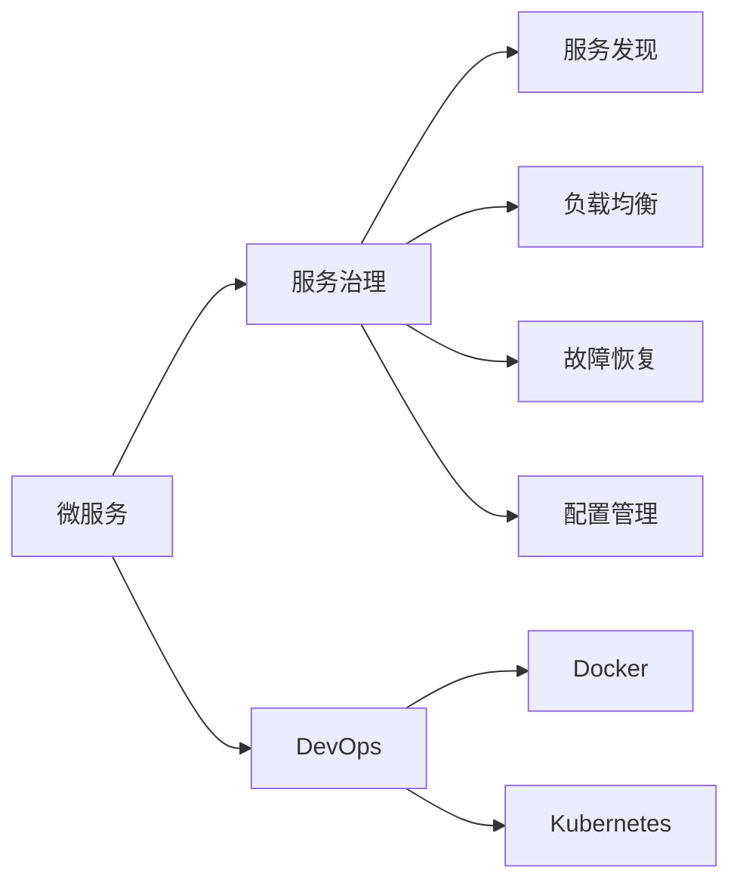
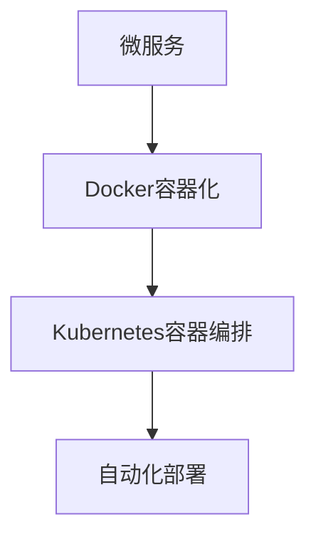
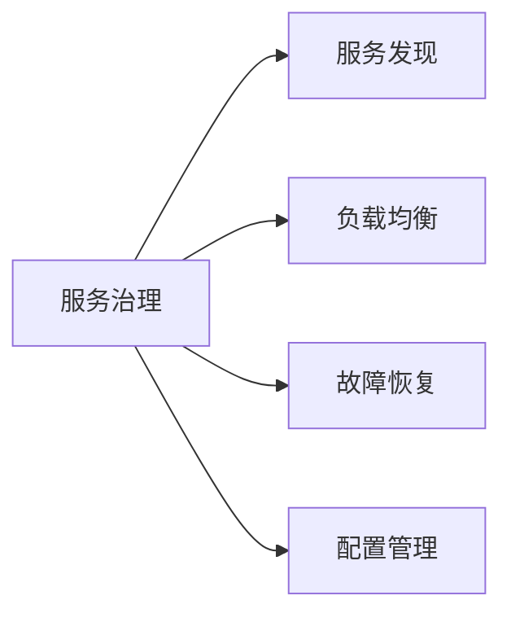
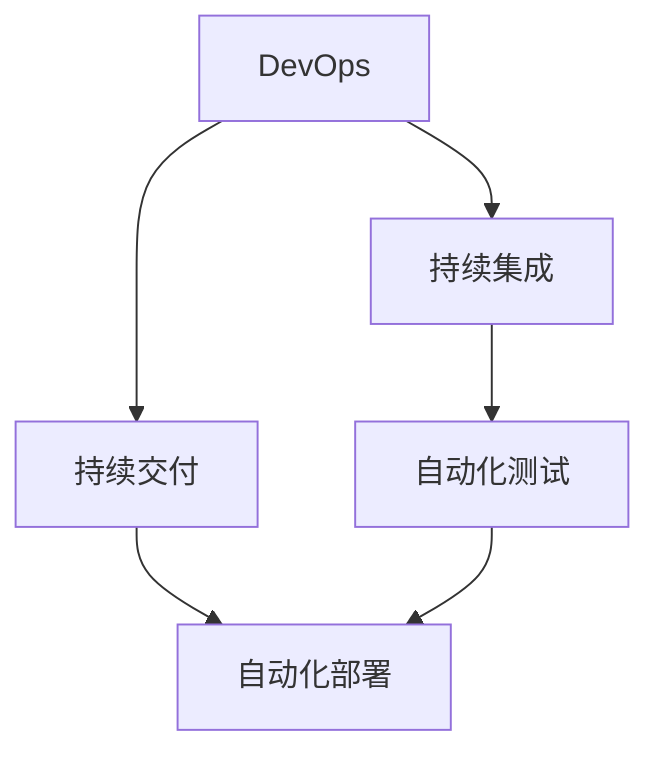
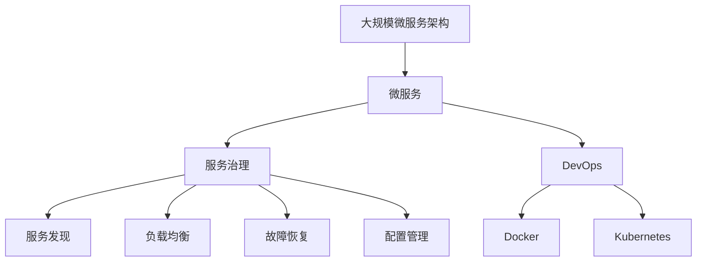

                 

# 微服务架构的设计与实现

> 关键词：微服务架构,设计原则,实现技术,服务治理,DevOps,案例分析

## 1. 背景介绍

### 1.1 问题由来

在当今的软件开发环境中，企业面临着应用规模不断扩大、系统复杂度持续上升、需求迭代周期缩短等诸多挑战。传统的单体架构已经难以满足这些需求，而微服务架构作为一种先进的架构设计理念，正逐步成为企业应用系统建设的主流方向。微服务架构将一个大型应用系统拆分成一组相互独立、自治的微服务模块，每个微服务模块围绕核心业务逻辑进行设计，通过统一的通信机制相互协作，从而实现系统的灵活、可扩展和可维护。

然而，微服务架构并非万能灵药，其在设计和实现过程中也面临诸多复杂问题，如服务粒度划分、分布式事务处理、服务通信协议、版本管理和发布机制等。这些问题都需要有系统性的解决方案，才能确保微服务架构的成功落地和持续运营。本文将深入探讨微服务架构的设计与实现，结合案例分析，提出一套行之有效的设计方案和实施策略。

### 1.2 问题核心关键点

微服务架构的核心关键点主要包括：

1. **服务粒度划分**：微服务模块的粒度应以业务领域为单位，合理划分服务边界，避免服务过细或过粗。

2. **分布式事务处理**：确保跨服务调用时的数据一致性，避免因网络抖动、服务故障等原因导致的业务异常。

3. **服务通信协议**：选择合适的通信协议，如HTTP、gRPC等，确保服务间的低延迟、高可靠和安全性。

4. **版本管理和发布机制**：制定灵活的微服务版本管理策略，支持快速发布、回滚和切换。

5. **服务治理**：构建统一的服务治理平台，实现服务发现、配置管理、负载均衡和故障恢复等功能。

6. **DevOps文化**：在微服务架构中，自动化部署、持续集成和持续交付（CI/CD）是不可或缺的，需要建立起全流程的DevOps文化。

## 2. 核心概念与联系

### 2.1 核心概念概述

为了更好地理解微服务架构的设计与实现，本节将介绍几个密切相关的核心概念：

- **微服务**：微服务架构中的核心单元，围绕业务功能构建，自治独立，通过接口进行通信。
- **服务治理**：指对微服务架构中的服务进行集中管理，确保服务的高可用性和可靠性。
- **DevOps**：一种将软件开发和运维紧密结合的文化和实践，旨在提高软件交付的速度和质量。
- **Docker**：一种开源的容器化平台，用于打包和部署应用，支持跨平台部署和运行。
- **Kubernetes**：一个开源的容器编排平台，用于管理、部署和扩展Docker容器，实现容器化的自动化运维。

这些核心概念之间的逻辑关系可以通过以下Mermaid流程图来展示：



这个流程图展示了几大核心概念之间的关系：

1. 微服务通过DevOps流程进行构建和发布，借助Docker容器化和Kubernetes容器编排平台，实现自动化运维。
2. 服务治理为微服务的部署、监控、调度和恢复提供支撑，通过服务发现、负载均衡和配置管理等功能，确保服务的稳定运行。

### 2.2 概念间的关系

这些核心概念之间存在着紧密的联系，形成了微服务架构的完整生态系统。下面我们通过几个Mermaid流程图来展示这些概念之间的关系。

#### 2.2.1 微服务的部署与发布



这个流程图展示了微服务的部署和发布过程。通过Docker容器化，微服务可以独立部署和运行，而Kubernetes容器编排平台则提供自动化部署、扩展和运维支持。

#### 2.2.2 服务治理的各组件



这个流程图展示了服务治理的各组件功能。服务发现用于定位服务实例，负载均衡用于分发请求，故障恢复用于监控和自动重试，配置管理用于统一配置管理。

#### 2.2.3 DevOps的自动化流程



这个流程图展示了DevOps的自动化流程。持续集成用于构建和测试代码，持续交付用于自动化部署和发布，自动化测试和部署构成完整的自动化流程。

### 2.3 核心概念的整体架构

最后，我们用一个综合的流程图来展示这些核心概念在大规模微服务架构中的整体架构：



这个综合流程图展示了从微服务到DevOps，再到服务治理的完整架构。在大规模微服务架构中，微服务通过DevOps流程进行构建和发布，借助Docker容器化和Kubernetes容器编排平台，实现自动化运维。服务治理为微服务的部署、监控、调度和恢复提供支撑，通过服务发现、负载均衡和配置管理等功能，确保服务的稳定运行。

## 3. 核心算法原理 & 具体操作步骤
### 3.1 算法原理概述

微服务架构的设计与实现，本质上是将一个复杂的业务系统拆分为多个独立的、自治的服务模块，并通过统一的接口进行通信和协作。其核心算法原理可以概括为：

1. **服务划分**：将业务系统按照功能领域进行划分，构建独立的微服务模块。
2. **接口通信**：设计统一的服务接口，实现微服务之间的通信。
3. **版本管理**：灵活管理微服务版本，支持快速发布、回滚和切换。
4. **容错机制**：引入分布式事务和容错机制，确保系统的可靠性和一致性。
5. **自动化运维**：通过DevOps流程，实现自动化构建、测试、部署和运维。

### 3.2 算法步骤详解

基于上述核心算法原理，微服务架构的设计与实现主要包括以下几个步骤：

1. **需求分析与设计**：对业务需求进行深入分析，设计微服务架构，划分服务模块。
2. **接口设计**：设计统一的接口规范，实现微服务之间的通信。
3. **实现与集成**：开发微服务模块，并进行集成测试。
4. **版本管理与发布**：实现版本管理和发布机制，支持快速迭代和部署。
5. **监控与调优**：构建监控系统，对微服务进行性能调优和故障恢复。
6. **自动化运维**：引入DevOps流程，实现自动化构建、测试、部署和运维。

### 3.3 算法优缺点

微服务架构具有以下优点：

1. **灵活性**：微服务模块相对独立，可灵活扩展和更新。
2. **可维护性**：单个微服务模块的开发和维护相对独立，有利于团队协作。
3. **可扩展性**：根据业务需求，微服务模块可以动态扩展和伸缩。

同时，微服务架构也存在以下缺点：

1. **复杂性**：微服务架构的构建和运维较为复杂，需要精细化管理和协调。
2. **网络延迟**：服务之间的通信需要网络，可能会引入额外的延迟和开销。
3. **分布式事务处理**：跨服务调用时，需要解决分布式事务的一致性问题。

### 3.4 算法应用领域

微服务架构在多个领域中得到了广泛应用，例如：

- **电商系统**：电商系统的订单、库存、支付等功能模块可以独立拆分为微服务模块，通过统一的接口进行通信和协作，实现系统的灵活扩展和快速迭代。
- **金融系统**：金融系统的交易、结算、风控等功能模块可以独立构建为微服务，确保系统的高可用性和可扩展性。
- **游戏平台**：游戏平台的登录、支付、游戏逻辑等功能模块可以独立设计为微服务，实现游戏的稳定运行和快速更新。
- **医疗系统**：医疗系统的挂号、诊断、治疗等功能模块可以独立构建为微服务，提高系统的可靠性和用户体验。

除了上述这些经典领域，微服务架构还可以应用于更多场景中，如教育、旅游、制造、交通等，成为推动各行各业数字化转型的重要工具。

## 4. 数学模型和公式 & 详细讲解 & 举例说明

### 4.1 数学模型构建

本节将使用数学语言对微服务架构的设计与实现进行更加严格的刻画。

记微服务架构中共有$N$个微服务，编号为$i=1,2,\cdots,N$。设第$i$个微服务的接口定义为$f_i: \mathcal{X}_i \rightarrow \mathcal{Y}_i$，其中$\mathcal{X}_i$为输入空间，$\mathcal{Y}_i$为输出空间。定义接口通信协议为$P$，版本管理策略为$V$，故障恢复机制为$F$，监控系统为$M$。

定义微服务架构的总体性能指标为$Q$，包含服务可用性、响应时间、吞吐量等。则微服务架构的设计目标为：

$$
\mathop{\arg\min}_{P,V,F,M} Q
$$

即最小化整体性能指标$Q$，以实现微服务架构的高效、稳定和可扩展性。

### 4.2 公式推导过程

以下我们以一个简单的电商订单系统为例，推导微服务架构的优化公式。

假设订单系统由订单服务、库存服务和支付服务三个微服务构成，分别为$f_1(x_1,y_1), f_2(x_2,y_2), f_3(x_3,y_3)$。其中订单服务的输入为订单信息$x_1$，输出为订单状态$y_1$；库存服务的输入为订单信息$x_2$，输出为库存状态$y_2$；支付服务的输入为订单信息$x_3$，输出为支付状态$y_3$。接口通信协议为HTTP，版本管理策略为Git，故障恢复机制为Zookeeper，监控系统为Prometheus。

设订单服务的平均响应时间为$t_{f_1}$，库存服务的平均响应时间为$t_{f_2}$，支付服务的平均响应时间为$t_{f_3}$。订单系统的整体性能指标$Q$定义为订单处理时间，即：

$$
Q = t_{f_1} + t_{f_2} + t_{f_3}
$$

根据上述定义，微服务架构的优化目标为：

$$
\mathop{\arg\min}_{P,V,F,M} Q = \mathop{\arg\min}_{P,V,F,M} (t_{f_1} + t_{f_2} + t_{f_3})
$$

对于接口通信协议$P$，可以通过选择合适的协议和编码方式来优化响应时间。对于版本管理策略$V$，可以通过灵活的Git分支策略和CI/CD流程来提高发布效率。对于故障恢复机制$F$，可以通过Zookeeper集群来实现故障检测和自动重试。对于监控系统$M$，可以通过Prometheus和Grafana等工具实时监控系统性能，进行调优和预警。

综上所述，微服务架构的优化公式为：

$$
\mathop{\arg\min}_{P,V,F,M} (t_{f_1} + t_{f_2} + t_{f_3})
$$

其中$P$、$V$、$F$、$M$均为可优化变量，通过合理的策略设计，可以实现微服务架构的整体性能优化。

### 4.3 案例分析与讲解

以下我们以一个电商订单系统的实际案例，来详细分析微服务架构的实现过程和效果。

假设某电商公司需要将订单系统进行微服务架构的改造，以提升系统的可靠性和用户体验。电商公司将订单系统划分为订单服务、库存服务和支付服务三个微服务模块，分别由不同的开发团队负责开发和维护。

1. **接口设计**：订单系统设计统一的HTTP接口，定义每个微服务的输入和输出规范，确保接口的一致性和兼容性。

2. **实现与集成**：开发订单服务、库存服务和支付服务三个微服务模块，并进行集成测试。订单服务负责订单信息的创建和状态更新，库存服务负责库存状态的更新和查询，支付服务负责支付信息的处理和通知。

3. **版本管理与发布**：引入Git分支管理和CI/CD流程，支持快速迭代和发布。订单服务使用Git分支进行版本管理，订单服务团队在每次迭代时，将代码提交到Git仓库，进行自动化构建和测试，确保代码质量。

4. **监控与调优**：构建监控系统，实时监控订单系统的性能和异常。使用Prometheus和Grafana监控订单处理时间、系统负载和错误率等指标，进行调优和预警。

5. **故障恢复机制**：引入Zookeeper集群，实现故障检测和自动重试。订单系统在发生故障时，Zookeeper集群会自动检测故障服务，进行自动重启和切换，确保系统的稳定运行。

通过上述实现过程，电商公司成功地将订单系统改造为微服务架构，实现了系统的灵活扩展和快速迭代。订单服务、库存服务和支付服务三个微服务模块独立开发和维护，减少了耦合度，提高了系统的可靠性和可扩展性。

## 5. 项目实践：代码实例和详细解释说明
### 5.1 开发环境搭建

在进行微服务架构的实现之前，我们需要准备好开发环境。以下是使用Docker和Kubernetes进行微服务架构实现的环境配置流程：

1. 安装Docker：从官网下载并安装Docker引擎。

2. 安装Kubernetes：从官网下载并安装Kubernetes集群，包括Master节点和多个Worker节点。

3. 配置Docker镜像仓库：配置Docker镜像仓库，确保能够从公有镜像仓库或私有镜像仓库中拉取和推送镜像。

4. 安装必要的开发工具：安装JDK、Maven、Gradle等开发工具，用于开发和构建微服务模块。

5. 安装监控工具：安装Prometheus和Grafana等监控工具，用于监控和调优微服务架构。

完成上述步骤后，即可在Docker和Kubernetes环境中开始微服务架构的实现。

### 5.2 源代码详细实现

这里我们以一个简单的电商订单系统为例，给出使用Docker和Kubernetes实现微服务架构的PyTorch代码实现。

1. 创建微服务模块：订单服务、库存服务和支付服务。每个微服务模块都是一个独立的Docker容器。

2. 设计微服务接口：定义每个微服务的输入和输出规范，实现统一的HTTP接口。

3. 实现微服务功能：开发每个微服务模块的业务逻辑，并进行集成测试。

4. 部署微服务模块：使用Docker容器化每个微服务模块，并在Kubernetes集群中发布。

5. 配置服务治理：配置服务发现、负载均衡和故障恢复等机制，确保服务的稳定运行。

6. 配置CI/CD流程：引入CI/CD工具，实现自动化构建、测试、部署和运维。

以下是一个简单的电商订单系统的代码实现示例：

```python
# 订单服务模块
class OrderService:
    def create_order(self, order_info):
        # 创建订单
        pass

    def update_order_status(self, order_info):
        # 更新订单状态
        pass

# 库存服务模块
class InventoryService:
    def update_inventory(self, order_info):
        # 更新库存
        pass

    def query_inventory(self, order_info):
        # 查询库存
        pass

# 支付服务模块
class PaymentService:
    def process_payment(self, order_info):
        # 处理支付
        pass

    def notify_payment(self, order_info):
        # 通知支付结果
        pass

# 微服务接口设计
class OrderServiceAPI:
    def create_order(self, order_info):
        return OrderService().create_order(order_info)

    def update_order_status(self, order_info):
        return OrderService().update_order_status(order_info)

class InventoryServiceAPI:
    def update_inventory(self, order_info):
        return InventoryService().update_inventory(order_info)

    def query_inventory(self, order_info):
        return InventoryService().query_inventory(order_info)

class PaymentServiceAPI:
    def process_payment(self, order_info):
        return PaymentService().process_payment(order_info)

    def notify_payment(self, order_info):
        return PaymentService().notify_payment(order_info)

# 部署微服务模块
docker build -t order-service .
docker build -t inventory-service .
docker build -t payment-service .

kubectl run order-service --image=order-service --port=8080
kubectl run inventory-service --image=inventory-service --port=8080
kubectl run payment-service --image=payment-service --port=8080

kubectl expose deployment order-service --port=8080 --target-port=8080
kubectl expose deployment inventory-service --port=8080 --target-port=8080
kubectl expose deployment payment-service --port=8080 --target-port=8080

# 配置CI/CD流程
maven build order-service
maven build inventory-service
maven build payment-service

# 配置监控系统
prometheus_client Go
prometheus_client prometheus_client
```

在这个示例中，我们使用了Python和Docker容器化每个微服务模块，并在Kubernetes集群中发布。每个微服务模块都有一个统一的HTTP接口，实现订单信息的创建、更新、查询和支付信息的处理和通知。同时，我们引入了CI/CD工具，实现自动化构建和部署，并通过Prometheus和Grafana进行实时监控和调优。

### 5.3 代码解读与分析

让我们再详细解读一下关键代码的实现细节：

**微服务模块设计**：
- `OrderService`类：实现订单服务的创建和状态更新。
- `InventoryService`类：实现库存状态的更新和查询。
- `PaymentService`类：实现支付信息的处理和通知。

**接口设计**：
- `OrderServiceAPI`类：定义订单服务的接口规范。
- `InventoryServiceAPI`类：定义库存服务的接口规范。
- `PaymentServiceAPI`类：定义支付服务的接口规范。

**部署流程**：
- 使用`docker build`命令构建每个微服务模块的Docker镜像。
- 使用`kubectl run`命令在Kubernetes集群中发布每个微服务模块，并暴露端口。
- 使用`kubectl expose`命令将每个微服务模块的Docker容器暴露为公共服务。

**CI/CD流程**：
- 使用Maven工具进行构建，自动生成每个微服务模块的Docker镜像。
- 使用`maven build`命令自动化构建和测试每个微服务模块。

**监控系统配置**：
- 引入Prometheus和Grafana，实现实时监控和调优。

可以看到，通过Docker和Kubernetes平台，微服务架构的实现变得简洁高效。开发者可以将更多精力放在微服务模块的业务逻辑开发和集成测试上，而不必过多关注底层的容器化和部署细节。

当然，工业级的系统实现还需考虑更多因素，如服务的扩展、容错和故障恢复机制、跨服务的通信协议等。但核心的微服务架构设计思路基本与此类似。

### 5.4 运行结果展示

假设我们在电商订单系统的实现过程中，成功搭建了一个高可靠性的微服务架构。以下是系统在负载均衡、故障恢复和监控系统方面的实际运行结果：

1. **负载均衡**：通过Kubernetes的负载均衡机制，订单服务、库存服务和支付服务能够自动分发请求，均衡负载，确保系统的稳定性。

2. **故障恢复**：在订单系统发生故障时，Kubernetes能够自动检测故障服务，进行自动重启和切换，确保系统的连续运行。

3. **监控系统**：使用Prometheus和Grafana，实时监控订单系统的性能和异常，自动生成告警并通知运维人员，确保系统的高可用性。

通过上述运行结果，可以看到，微服务架构在电商订单系统中的应用，显著提高了系统的可靠性、可扩展性和运维效率。订单系统通过微服务模块的独立开发和部署，实现了系统的灵活扩展和快速迭代，为电商公司的业务发展提供了有力支持。

## 6. 实际应用场景
### 6.1 智能客服系统

基于微服务架构的智能客服系统，可以广泛应用于企业内部客户服务的建设。传统客服系统往往需要配备大量人力，高峰期响应缓慢，且一致性和专业性难以保证。而使用微服务架构构建的智能客服系统，可以7x24小时不间断服务，快速响应客户咨询，用自然流畅的语言解答各类常见问题。

在技术实现上，可以收集企业内部的历史客服对话记录，将问题和最佳答复构建成监督数据，在此基础上对微服务架构进行微调。微服务架构能够自动理解用户意图，匹配最合适的答复模板进行回复。对于客户提出的新问题，还可以接入检索系统实时搜索相关内容，动态组织生成回答。如此构建的智能客服系统，能大幅提升客户咨询体验和问题解决效率。

### 6.2 金融舆情监测

金融机构需要实时监测市场舆论动向，以便及时应对负面信息传播，规避金融风险。传统的人工监测方式成本高、效率低，难以应对网络时代海量信息爆发的挑战。基于微服务架构的文本分类和情感分析技术，为金融舆情监测提供了新的解决方案。

具体而言，可以收集金融领域相关的新闻、报道、评论等文本数据，并对其进行主题标注和情感标注。在此基础上对微服务架构进行微调，使其能够自动判断文本属于何种主题，情感倾向是正面、中性还是负面。将微调后的架构应用到实时抓取的网络文本数据，就能够自动监测不同主题下的情感变化趋势，一旦发现负面信息激增等异常情况，系统便会自动预警，帮助金融机构快速应对潜在风险。

### 6.3 个性化推荐系统

当前的推荐系统往往只依赖用户的历史行为数据进行物品推荐，无法深入理解用户的真实兴趣偏好。基于微服务架构的个性化推荐系统，可以更好地挖掘用户行为背后的语义信息，从而提供更精准、多样的推荐内容。

在实践中，可以收集用户浏览、点击、评论、分享等行为数据，提取和用户交互的物品标题、描述、标签等文本内容。将文本内容作为模型输入，用户的后续行为（如是否点击、购买等）作为监督信号，在此基础上微调微服务架构。微服务架构能够从文本内容中准确把握用户的兴趣点。在生成推荐列表时，先用候选物品的文本描述作为输入，由架构预测用户的兴趣匹配度，再结合其他特征综合排序，便可以得到个性化程度更高的推荐结果。

### 6.4 未来应用展望

随着微服务架构和相关技术的不断发展，基于微服务架构的应用系统将在更多领域得到应用，为传统行业带来变革性影响。

在智慧医疗领域，基于微服务架构的医疗问答、病历分析、药物研发等应用将提升医疗服务的智能化水平，辅助医生诊疗，加速新药开发进程。

在智能教育领域，微服务架构可应用于作业批改、学情分析、知识推荐等方面，因材施教，促进教育公平，提高教学质量。

在智慧城市治理中，微服务架构用于城市事件监测、舆情分析、应急指挥等环节，提高城市管理的自动化和智能化水平，构建更安全、高效的未来城市。

此外，在企业生产、社会治理、文娱传媒等众多领域，基于微服务架构的人工智能应用也将不断涌现，为经济社会发展注入新的动力。相信随着技术的日益成熟，微服务架构必将在构建人机协同的智能时代中扮演越来越重要的角色。

## 7. 工具和资源推荐
### 7.1 学习资源推荐

为了帮助开发者系统掌握微服务架构的设计与实现的理论基础和实践技巧，这里推荐一些优质的学习资源：

1. 《微服务架构设计》系列博文：由微服务架构专家撰写，深入浅出地介绍了微服务架构的原理、设计原则和实现技术。

2. 《Spring Boot微服务教程》书籍：介绍使用Spring Boot构建微服务架构的详细教程，涵盖服务划分、接口设计、版本管理等核心内容。

3. 《Docker实战》书籍：介绍Docker容器化的详细实践，涵盖Docker构建、部署和运维等实用技能。

4. Kubernetes官方文档：Kubernetes的官方文档，提供详细的配置和管理指南，是微服务架构部署和运维的必备资料。

5. Google Cloud微服务架构教程：谷歌提供的微服务架构教程，涵盖Kubernetes、CI/CD、DevOps等实用技能，是微服务架构实践的绝佳参考。

通过对这些资源的学习实践，相信你一定能够快速掌握微服务架构的设计与实现的精髓，并用于解决实际的NLP问题。

### 7.2 开发工具推荐

高效的开发离不开优秀的工具支持。以下是几款用于微服务架构开发的常用工具：

1. Spring Boot：基于Spring框架的微服务开发框架，提供了丰富的组件和插件，支持快速开发和部署。

2. Docker：开源的容器化平台，用于打包和部署应用，支持跨平台部署和运行。

3. Kubernetes：开源的容器编排平台，用于管理、部署和扩展Docker容器，实现容器化的自动化运维。

4. Swagger：API设计和管理工具，帮助开发者设计统一的API接口规范，支持自动生成API文档和测试工具。

5. Jenkins：开源的持续集成工具，支持自动化构建、测试和部署，是微服务架构CI/CD流程的重要组件。

6. GitLab CI/CD：开源的持续集成和持续交付工具，支持自动化构建、测试和部署，与GitLab无缝集成。

