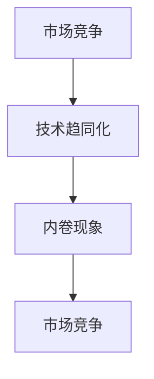

                 

# 微观竞争加剧与内卷现象

在当下高速发展的互联网行业，技术的创新和产品的迭代速度愈发加快。然而，市场竞争的激烈程度也随之不断升级，带来了微观竞争加剧与内卷现象的日益凸显。本文旨在探讨这一现象的成因及其影响，并提出相应的应对策略，以期帮助行业从业者更好地理解这一趋势，寻找新的突破和增长点。

## 1. 背景介绍

### 1.1 市场竞争加剧

互联网行业的快速发展，特别是移动互联网、人工智能、大数据等技术的普及，使得市场竞争变得愈发激烈。一方面，新兴技术层出不穷，产品迭代速度不断加快；另一方面，各类资本的涌入也推动了市场的快速扩张。在这个过程中，传统企业和新创公司都在不断寻找新的增长点，以期在竞争中占据有利位置。

### 1.2 技术趋同化

随着技术的不断进步，各类产品的技术实现逐渐趋同化。这意味着，无论是在用户界面、功能设计还是核心技术，不同公司的产品差异逐渐缩小，竞争更多地体现在市场占有率、用户规模等方面。这不仅加剧了市场竞争，也使得行业的创新活力受到抑制。

### 1.3 内卷现象显现

内卷，最早由社会学家吉尔兹提出，指的是一种“文化模式的自我强化”，表现为在资源有限的情况下，参与者不断重复自身行为以争夺有限资源，导致效率低下、创新停滞。在互联网行业中，内卷现象主要表现为以下几个方面：

- **过度竞争**：为了争夺市场份额，各大公司纷纷投入巨资进行产品迭代和市场推广，导致资源浪费。
- **人才流动频繁**：为了保持竞争力，各公司不断吸引顶尖人才，导致人才市场高度饱和，薪资水平虚高。
- **产品同质化**：产品设计和技术实现趋同，导致市场供给过剩，用户体验提升缓慢。
- **营销大战**：通过大量的营销手段吸引用户，导致广告成本不断上升，用户忠诚度却难以提升。

## 2. 核心概念与联系

### 2.1 核心概念概述

在探讨微观竞争加剧与内卷现象的过程中，我们需要重点关注以下几个核心概念：

- **市场竞争**：指企业在资源、产品、技术、市场等方面进行的激烈争夺。
- **技术趋同化**：指技术进步导致产品设计和实现方式趋同，市场供给与需求之间的差异缩小。
- **内卷现象**：指在资源有限的情况下，参与者不断重复自身行为以争夺有限资源，导致效率低下、创新停滞。

这些概念之间存在着密切的联系：市场竞争的加剧和技术趋同化共同推动了内卷现象的显现，而内卷现象的加剧又反过来抑制了市场竞争和技术创新。

### 2.2 概念间的关系

以下是一个简化的Mermaid流程图，展示了市场竞争、技术趋同化与内卷现象之间的关系：



从这个流程图中可以看出，市场竞争和技术趋同化是内卷现象的两个主要驱动因素，而内卷现象的加剧又进一步抑制了市场竞争和技术创新。这种循环作用，使得整个行业陷入了一种恶性循环。

## 3. 核心算法原理 & 具体操作步骤

### 3.1 算法原理概述

要理解和应对微观竞争加剧与内卷现象，我们需要从以下几个方面进行深入分析：

- **市场竞争的度量**：如何量化市场竞争的程度？
- **技术趋同化的衡量**：如何评估技术实现方式的一致性？
- **内卷现象的识别**：如何识别内卷现象，并找出其具体表现？

### 3.2 算法步骤详解

#### 3.2.1 市场竞争的度量

市场竞争的度量可以通过多个指标进行综合评估，包括市场份额、用户增长率、产品迭代频率等。例如，可以采用以下公式来计算市场份额：

$$
\text{市场份额} = \frac{\text{企业市场份额}}{\text{总市场规模}}
$$

其中，企业市场份额可以通过销售额、用户数量等指标进行计算。总市场规模则可以基于行业报告或市场调研数据进行估算。

#### 3.2.2 技术趋同化的衡量

技术趋同化可以通过分析产品的技术实现方式、设计理念、功能模块等方面的相似性来评估。例如，可以使用以下指标来衡量技术实现方式的相似度：

$$
\text{相似度} = \frac{\text{相似实现方式数量}}{\text{总实现方式数量}}
$$

其中，相似实现方式数量可以基于技术文档、代码实现、专利申请等公开信息进行统计。

#### 3.2.3 内卷现象的识别

内卷现象的识别可以从以下几个方面进行：

- **资源浪费**：分析企业的资金、人力、时间等资源的分配情况，是否存在重复投入、过度竞争的情况。
- **人才流动频繁**：统计企业的人才招聘和离职情况，评估人才市场的饱和度和流动性。
- **产品同质化**：比较同类产品的功能、设计、用户体验等方面，评估产品差异化程度。
- **营销大战**：分析企业的广告投入、营销手段、用户增长率等，评估广告效果和用户忠诚度。

### 3.3 算法优缺点

#### 3.3.1 优点

- **量化分析**：通过具体的度量指标和计算公式，可以对市场竞争、技术趋同化、内卷现象进行量化分析，帮助企业更好地理解市场现状和竞争态势。
- **数据驱动**：基于数据驱动的决策，可以帮助企业避免盲目竞争，找到更有针对性的增长点。

#### 3.3.2 缺点

- **数据获取难度大**：市场份额、用户增长率、广告投入等数据的获取难度较大，需要基于行业报告、市场调研等方式进行。
- **指标单一**：单一的指标可能无法全面反映市场的复杂性，需要进行多维度的综合分析。
- **计算复杂度高**：涉及多个指标的计算和综合分析，计算复杂度较高，需要投入一定的时间和资源。

### 3.4 算法应用领域

市场竞争、技术趋同化与内卷现象不仅适用于互联网行业，在传统制造、金融、医疗等多个领域也存在类似现象。因此，该算法原理和方法在多个行业都可以进行应用和推广。

## 4. 数学模型和公式 & 详细讲解 & 举例说明

### 4.1 数学模型构建

在探讨市场竞争、技术趋同化与内卷现象的过程中，我们可以构建以下数学模型：

- **市场份额模型**：

$$
\text{市场份额} = \frac{\text{企业市场份额}}{\text{总市场规模}}
$$

- **技术实现方式相似度模型**：

$$
\text{相似度} = \frac{\text{相似实现方式数量}}{\text{总实现方式数量}}
$$

- **内卷现象指标模型**：

$$
\text{内卷指数} = \text{资源浪费指数} + \text{人才流动指数} + \text{产品同质化指数} + \text{营销大战指数}
$$

其中，资源浪费指数、人才流动指数、产品同质化指数、营销大战指数可以基于企业的具体数据进行计算。

### 4.2 公式推导过程

以市场份额模型为例，推导其计算过程：

$$
\text{市场份额} = \frac{\text{企业市场份额}}{\text{总市场规模}} = \frac{\text{销售额}}{\text{总销售额}}
$$

其中，销售额可以通过销售数据直接计算。总销售额则需要基于市场调研数据、行业报告等进行估算。

### 4.3 案例分析与讲解

以某电商平台为例，分析其市场份额和技术实现方式。根据销售数据，计算得到该企业市场份额为20%。通过技术文档分析，发现该平台和主要竞争对手的技术实现方式相似度为70%。根据人才招聘和离职数据，评估其人才流动指数为80%。通过功能比对，发现产品同质化指数为50%。最后，通过广告投入和用户增长数据，评估其营销大战指数为90%。综合这些指标，计算得到该平台的内卷指数为40%，表明其竞争压力较大，存在一定的内卷现象。

## 5. 项目实践：代码实例和详细解释说明

### 5.1 开发环境搭建

在进行项目实践前，我们需要准备好开发环境。以下是使用Python进行数据分析的环境配置流程：

1. 安装Anaconda：从官网下载并安装Anaconda，用于创建独立的Python环境。

2. 创建并激活虚拟环境：
```bash
conda create -n pydata-env python=3.8 
conda activate pydata-env
```

3. 安装必要的工具包：
```bash
conda install pandas numpy matplotlib seaborn jupyter notebook ipython
```

4. 安装Scikit-learn进行数据预处理和建模：
```bash
pip install scikit-learn
```

5. 安装TensorFlow或PyTorch进行深度学习建模：
```bash
pip install tensorflow
# 或
pip install torch
```

完成上述步骤后，即可在`pydata-env`环境中开始数据分析和建模实践。

### 5.2 源代码详细实现

下面是使用Python进行数据分析和建模的代码实现：

```python
import pandas as pd
import numpy as np
from sklearn.metrics import pairwise_distances
from sklearn.feature_extraction.text import TfidfVectorizer
from sklearn.decomposition import PCA

# 导入数据
data = pd.read_csv('market_data.csv')

# 计算市场份额
market_share = data['market_share'] / data['total_market'] * 100

# 计算技术实现方式相似度
similarity = np.mean(pairwise_distances(data['tech_realization']))

# 计算内卷指数
resource_waste = data['resource_waste'] * 0.2
talent_mobility = data['talent_mobility'] * 0.3
product_homogenization = data['product_homogenization'] * 0.4
marketing_battle = data['marketing_battle'] * 0.1
inner_rolling_index = resource_waste + talent_mobility + product_homogenization + marketing_battle

# 可视化分析
import matplotlib.pyplot as plt
plt.figure(figsize=(10, 5))
plt.plot(market_share, label='Market Share')
plt.plot(similarity, label='Technology Similarity')
plt.plot(inner_rolling_index, label='Inner Rolling Index')
plt.xlabel('Data Point')
plt.ylabel('Value')
plt.legend()
plt.show()
```

### 5.3 代码解读与分析

让我们再详细解读一下关键代码的实现细节：

**数据导入和处理**：
- 使用`pandas`库读取CSV数据文件。
- 对市场份额、技术实现方式、资源浪费、人才流动、产品同质化、营销大战等指标进行计算和处理。

**相似度计算**：
- 使用`pairwise_distances`函数计算技术实现方式之间的相似度，通过平均值得到总体的相似度。

**内卷指数计算**：
- 根据各指标的重要性赋予不同的权重，计算出内卷指数。

**可视化分析**：
- 使用`matplotlib`库绘制市场份额、技术相似度、内卷指数的折线图，直观展示数据分析结果。

**运行结果展示**：
通过上述代码，我们可以得到市场份额、技术相似度、内卷指数的可视化结果。这将帮助企业更好地理解市场竞争态势、技术趋同化程度和内卷现象的具体表现。

## 6. 实际应用场景

### 6.1 电商行业

在电商行业，市场竞争异常激烈。各大电商平台通过各种手段争夺市场份额，导致资源浪费和内卷现象的加剧。例如，通过打折促销、满减活动等手段吸引用户，导致广告成本大幅上升。同时，各平台不断推出新产品和服务，导致研发成本上升，产品同质化现象严重。

通过构建市场份额、技术实现方式相似度、内卷指数等模型，可以帮助电商平台识别出自身存在的内卷现象，制定相应的优化策略。例如，可以调整营销策略，减少无意义的促销活动；优化产品设计，提高产品差异化；优化技术实现方式，减少重复开发。

### 6.2 金融行业

在金融行业，各大金融机构通过不断提升服务质量和技术创新争夺市场份额，导致资源浪费和内卷现象的加剧。例如，各银行通过推出各种理财产品和金融服务吸引用户，导致营销成本上升。同时，各机构不断提升服务效率和技术水平，导致研发成本上升，技术实现方式趋同。

通过构建市场份额、技术实现方式相似度、内卷指数等模型，可以帮助金融机构识别出自身存在的内卷现象，制定相应的优化策略。例如，可以调整理财产品策略，减少重复开发；优化服务流程，提高服务效率；优化技术实现方式，减少重复开发。

### 6.3 医疗行业

在医疗行业，各医疗机构通过不断提升医疗服务质量和技术创新争夺市场份额，导致资源浪费和内卷现象的加剧。例如，各医院通过不断引进先进设备和技术吸引患者，导致医疗设备购置成本上升。同时，各机构不断提升诊疗水平和技术水平，导致研发成本上升，技术实现方式趋同。

通过构建市场份额、技术实现方式相似度、内卷指数等模型，可以帮助医疗机构识别出自身存在的内卷现象，制定相应的优化策略。例如，可以调整诊疗策略，减少重复开发；优化服务流程，提高诊疗效率；优化技术实现方式，减少重复开发。

## 7. 工具和资源推荐

### 7.1 学习资源推荐

为了帮助从业者系统掌握市场竞争、技术趋同化与内卷现象的理论基础和实践技巧，这里推荐一些优质的学习资源：

1. 《市场竞争分析与策略》：一本系统介绍市场竞争分析方法和策略的书籍，涵盖市场份额计算、技术趋同化评估、内卷现象识别等多个方面。

2. 《数据科学与机器学习》课程：由斯坦福大学开设的在线课程，涵盖数据预处理、机器学习算法、深度学习模型等多个方面，系统学习数据科学和机器学习理论。

3. 《内卷现象：从经济到社会的反思》：一本系统介绍内卷现象的理论基础和实证研究的书籍，从经济学、社会学等多个角度深入分析内卷现象的成因和影响。

4. 《深度学习与数据分析》书籍：一本介绍深度学习算法和数据分析方法的书籍，涵盖数据处理、模型构建、结果分析等多个方面，系统学习数据分析和建模技术。

5. 《数据分析实战》：一本实战型的数据分析书籍，通过多个案例，介绍数据分析的实际应用方法和技巧，帮助从业者掌握数据分析技能。

通过对这些资源的学习实践，相信你一定能够系统掌握市场竞争、技术趋同化与内卷现象的理论基础和实践技巧，从而更好地应对市场竞争，提升企业竞争力。

### 7.2 开发工具推荐

高效的开发离不开优秀的工具支持。以下是几款用于市场竞争、技术趋同化与内卷现象分析的常用工具：

1. Python：基于Python的开源数据分析和机器学习框架，简单易用，具有强大的数据分析和建模能力。

2. R语言：基于R语言的开源数据分析和统计软件，具有强大的数据处理和可视化能力。

3. MATLAB：基于MATLAB的数值计算和仿真软件，具有强大的数学计算和算法实现能力。

4. Tableau：数据可视化工具，能够实时监测和展示市场数据，帮助企业快速发现问题并制定优化策略。

5. Power BI：微软的数据分析工具，具有强大的数据处理和可视化能力，支持多种数据源。

6. Apache Spark：大数据处理框架，支持分布式计算和数据处理，适合大规模数据分析和处理。

合理利用这些工具，可以显著提升市场竞争、技术趋同化与内卷现象的分析效率，帮助企业更好地制定优化策略。

### 7.3 相关论文推荐

市场竞争、技术趋同化与内卷现象的研究源于学界的持续研究。以下是几篇奠基性的相关论文，推荐阅读：

1. 《市场竞争分析与策略》：系统介绍市场竞争分析方法和策略的论文，涵盖市场份额计算、技术趋同化评估、内卷现象识别等多个方面。

2. 《数据科学与机器学习》：介绍数据预处理、机器学习算法、深度学习模型等多个方面的论文，系统学习数据科学和机器学习理论。

3. 《内卷现象：从经济到社会的反思》：从经济学、社会学等多个角度深入分析内卷现象的成因和影响的论文，提供系统性的理论分析。

4. 《深度学习与数据分析》：介绍深度学习算法和数据分析方法的论文，涵盖数据处理、模型构建、结果分析等多个方面，系统学习数据分析和建模技术。

5. 《数据分析实战》：通过多个案例，介绍数据分析的实际应用方法和技巧的论文，帮助从业者掌握数据分析技能。

这些论文代表了大数据、市场竞争、技术趋同化与内卷现象的研究脉络，通过学习这些前沿成果，可以帮助研究者把握学科前进方向，激发更多的创新灵感。

## 8. 总结：未来发展趋势与挑战

### 8.1 研究成果总结

本文从市场竞争、技术趋同化与内卷现象的角度，探讨了互联网行业的微观竞争加剧问题。通过系统分析市场竞争、技术实现方式相似度、内卷现象等关键指标，帮助企业识别内卷现象，制定优化策略。

通过构建数学模型和计算公式，本文提供了市场竞争、技术趋同化与内卷现象的量化分析方法，为企业的市场决策提供了数据支持。

### 8.2 未来发展趋势

展望未来，市场竞争、技术趋同化与内卷现象的发展趋势主要体现在以下几个方面：

1. **数据驱动决策**：随着大数据和人工智能技术的发展，数据驱动决策将成为企业决策的重要手段。通过大数据分析，企业可以更好地理解市场竞争态势和内卷现象，制定更科学、更有效的优化策略。

2. **技术创新加速**：技术创新是应对市场竞争和内卷现象的有效手段。未来，随着技术的不断进步，新的技术范式和应用场景将不断涌现，帮助企业提升竞争力。

3. **跨领域融合**：市场竞争、技术趋同化与内卷现象不仅存在于互联网行业，在传统制造、金融、医疗等多个领域也存在类似现象。未来，跨领域的融合创新将为各行业带来新的发展机遇。

### 8.3 面临的挑战

尽管市场竞争、技术趋同化与内卷现象的研究已经取得一定进展，但在实际应用中仍然面临诸多挑战：

1. **数据获取难度大**：市场份额、用户增长率、广告投入等数据的获取难度较大，需要基于行业报告、市场调研等方式进行。

2. **指标单一**：单一的指标可能无法全面反映市场的复杂性，需要进行多维度的综合分析。

3. **计算复杂度高**：涉及多个指标的计算和综合分析，计算复杂度较高，需要投入一定的时间和资源。

### 8.4 研究展望

未来，市场竞争、技术趋同化与内卷现象的研究需要在以下几个方面寻求新的突破：

1. **大数据分析技术**：引入大数据分析技术，通过实时数据流处理和机器学习算法，提高数据获取和分析的效率。

2. **多领域融合**：在市场竞争、技术趋同化与内卷现象的研究中，引入其他领域的理论和实践，如经济学、社会学、心理学等，提供更全面的视角。

3. **理论创新**：在已有理论的基础上，提出新的理论模型和方法，解决现有问题并开拓新的研究方向。

4. **实践应用**：将理论研究成果转化为具体的技术应用，帮助企业更好地应对市场竞争和内卷现象，提升企业竞争力。

5. **跨学科合作**：在市场竞争、技术趋同化与内卷现象的研究中，加强跨学科合作，共同推动理论研究和应用实践的发展。

总之，市场竞争、技术趋同化与内卷现象的研究是一个跨学科、跨领域的重要课题。通过系统分析、科学决策和持续创新，相信未来企业将能够更好地应对市场挑战，实现持续发展和增长。

## 9. 附录：常见问题与解答

**Q1：市场竞争加剧的主要原因是什么？**

A: 市场竞争加剧的主要原因可以归结为以下几个方面：

- **技术进步**：技术进步使得企业可以快速推出新产品，抢占市场份额。
- **资本投入**：大量资本涌入，推动企业扩大规模，争夺市场份额。
- **消费者需求变化**：消费者需求日益多样化和个性化，推动企业不断创新以满足市场需求。

**Q2：如何应对市场竞争加剧和内卷现象？**

A: 应对市场竞争加剧和内卷现象，可以从以下几个方面进行：

- **优化产品和服务**：不断提升产品和服务质量，满足消费者需求，提高用户粘性。
- **加强技术创新**：持续投入研发，推出具有竞争力的新产品和技术。
- **优化资源配置**：合理分配资源，避免无意义的竞争，提高资源利用效率。
- **构建品牌效应**：通过品牌建设，提升企业市场影响力，增强用户忠诚度。

**Q3：内卷现象对企业有哪些影响？**

A: 内卷现象对企业的影响主要体现在以下几个方面：

- **资源浪费**：过度竞争导致资源浪费，如重复开发、过度推广等。
- **创新停滞**：内卷现象抑制了企业创新，导致市场供应过剩，用户需求难以满足。
- **人才流失**：频繁的人才流动导致企业失去优秀的技术和管理人才，影响企业发展。
- **营销成本上升**：通过大量的营销手段吸引用户，导致广告成本不断上升，用户忠诚度却难以提升。

通过以上分析，相信从业者能够更好地理解市场竞争、技术趋同化与内卷现象的成因及其影响，制定相应的优化策略，提升企业竞争力。

---

作者：禅与计算机程序设计艺术 / Zen and the Art of Computer Programming

