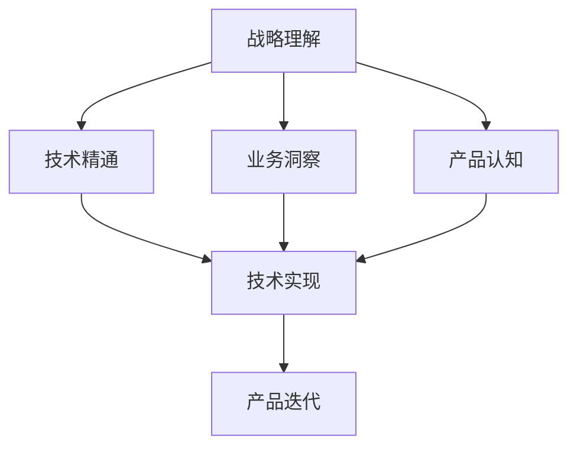

                 

# 怎样建设和培养懂战略、懂技术、懂业务、懂产品的技术团队

> 关键词：技术团队建设、技术战略、产品理解、业务融合、团队协作

## 1. 背景介绍

### 1.1 问题由来
在数字化时代，企业竞争力的关键在于其技术团队。一个高质量的技术团队不仅能推动产品创新，还能提升企业运营效率和市场竞争力。然而，许多企业在组建技术团队时面临重重挑战，如人才短缺、技能不匹配、团队协作差等。这些问题往往源自团队建设的多维要求，包括对战略、技术、业务和产品的深度理解。

### 1.2 问题核心关键点
要建设一支高素质的技术团队，需要确保团队成员在战略、技术、业务和产品方面具备全面且深入的理解。这不仅有助于提升团队的整体能力，还能增强团队在复杂多变市场环境中的应变能力。关键点在于：

- **战略理解**：团队应理解公司的战略方向和目标，确保技术开发与企业战略保持一致。
- **技术精通**：团队应掌握前沿技术和工具，具备强大的技术创新能力。
- **业务洞察**：团队应深入了解所在行业的业务流程和需求，确保技术解决方案与业务实际紧密结合。
- **产品认知**：团队应清晰理解产品生命周期、用户需求和市场定位，以推动产品迭代和创新。

### 1.3 问题研究意义
构建懂战略、懂技术、懂业务、懂产品的技术团队，对于提升企业创新能力、优化运营效率、增强市场竞争力具有重要意义：

1. **增强创新能力**：理解战略和业务有助于技术团队瞄准关键领域，开展前瞻性技术研发，推动产品创新。
2. **优化运营效率**：深入理解业务流程和技术工具，能够提升团队的工作效率和资源利用率。
3. **增强市场竞争力**：掌握产品市场定位和用户需求，能够提供符合市场趋势和用户期望的技术解决方案，提升企业竞争优势。
4. **促进团队协作**：不同团队成员间的多维度理解和深度合作，能够形成更加协同高效的工作机制。

## 2. 核心概念与联系

### 2.1 核心概念概述

要建设一支具备全方位能力的团队，首先需要明确几个核心概念：

- **战略理解（Strategic Understanding）**：指团队成员对公司战略目标、市场定位、竞争态势等宏观层面的理解和认同。
- **技术精通（Technical Mastery）**：指团队成员对编程语言、开发工具、算法框架等技术细节的熟练掌握和应用。
- **业务洞察（Business Acumen）**：指团队成员对所在行业的业务模式、流程、痛点和机遇的深刻理解和把握。
- **产品认知（Product Knowledge）**：指团队成员对产品特性、用户体验、市场反馈等产品相关信息的全面掌握和运用。

这些核心概念之间存在密切的联系，共同构成了技术团队全面能力的基础。

### 2.2 概念间的关系

为了更好地理解这些概念之间的关系，以下是一个简化的Mermaid流程图：



这个流程图展示了战略、技术、业务和产品之间的相互影响和支撑关系：

- **战略理解**指导技术团队的技术选择和应用方向，确保技术研发与企业战略保持一致。
- **技术精通**为团队提供实现战略、洞察业务和认知产品的工具和手段。
- **业务洞察**帮助团队理解市场和用户需求，确保技术解决方案的实用性和可落地性。
- **产品认知**促使团队围绕产品需求进行技术开发，推动产品迭代和创新。

## 3. 核心算法原理 & 具体操作步骤
### 3.1 算法原理概述

建设懂战略、懂技术、懂业务、懂产品的技术团队，本质上是一个多维度能力提升的过程。其核心原理是通过系统化的培训、实践和反馈，使团队成员在多个领域逐步成长。具体而言：

1. **知识传递**：通过专业培训、内部知识共享等方式，将战略、技术、业务和产品的知识传递给团队成员。
2. **实践磨练**：通过实际项目、模拟场景等实践活动，让团队成员在真实环境中锻炼和提升能力。
3. **反馈优化**：通过项目复盘、绩效评估等方式，收集反馈信息，持续优化团队建设策略和成员能力。

### 3.2 算法步骤详解

以下是建设技术团队的具体步骤，按照先后顺序排列：

**Step 1: 战略澄清与培训**
- **目标**：确保团队成员理解企业战略方向和目标。
- **方法**：组织战略解读会、邀请高层领导分享等，明确公司的战略重点和目标。
- **评估**：通过问卷调查、讨论会等方式，评估团队成员对战略的理解程度。

**Step 2: 技术培训与实践**
- **目标**：提升团队成员的技术水平和创新能力。
- **方法**：举办技术研讨会、提供在线学习资源、组织编程竞赛等，鼓励技术学习和创新。
- **评估**：通过代码评审、技术成果展示等方式，评估团队成员的技术进步。

**Step 3: 业务调研与融入**
- **目标**：增强团队成员对业务流程和需求的理解。
- **方法**：组织业务调研活动、邀请业务部门进行互动交流，深入了解业务痛点和需求。
- **评估**：通过业务应用反馈、项目提案讨论等方式，评估团队成员对业务的理解深度。

**Step 4: 产品训练与迭代**
- **目标**：强化团队成员的产品意识和市场洞察。
- **方法**：进行产品使用培训、组织市场调研、鼓励参与产品设计与迭代，提升产品认知。
- **评估**：通过用户反馈、产品市场表现等方式，评估团队成员的产品理解和应用能力。

**Step 5: 团队协作与优化**
- **目标**：构建高效协作的工作环境，提升团队整体效能。
- **方法**：引入敏捷开发、DevOps等协作机制，定期进行团队建设活动，增强团队凝聚力。
- **评估**：通过项目进度、团队满意度调查等方式，评估团队协作和效能。

### 3.3 算法优缺点

建设懂战略、懂技术、懂业务、懂产品的技术团队，有以下优点：

- **全面提升能力**：通过多维度培训和实践，团队成员在多个领域都能获得显著提升。
- **灵活应对市场变化**：团队成员具备多方面的能力，能够更灵活地应对市场和技术的变化。
- **提高效率和创新**：团队成员能够从战略、业务和产品多个维度出发，优化技术方案，提升开发效率和创新能力。

但同时也存在一些缺点：

- **培训周期长**：全面能力的提升需要较长的培训和实践周期。
- **资源投入大**：需要投入大量时间和资源进行培训、调研和实践。
- **团队管理复杂**：多维度能力的提升意味着团队管理也需更细致和多样化。

### 3.4 算法应用领域

建设懂战略、懂技术、懂业务、懂产品的技术团队，在多个应用领域都能发挥重要作用：

- **产品创新**：在产品设计和迭代过程中，团队能够从用户需求和市场趋势出发，推动产品创新。
- **项目管理**：在项目管理和运营中，团队能够确保项目与公司战略保持一致，提高项目成功率。
- **技术优化**：在技术研发和管理中，团队能够从业务和产品需求出发，优化技术架构和流程。
- **市场响应**：在市场推广和客户服务中，团队能够快速响应市场变化和客户需求，提升企业竞争力。

## 4. 数学模型和公式 & 详细讲解  
### 4.1 数学模型构建

我们可以用数学模型来描述技术团队的建设过程。假设团队有 $N$ 名成员，每个成员在 $K$ 个维度（战略、技术、业务、产品）上的能力可以通过 $K$ 个变量 $x_i$ 来表示。团队的总体能力可以通过 $x_1, x_2, ..., x_K$ 的平均值 $x$ 来衡量：

$$
x = \frac{1}{N} \sum_{i=1}^{N} x_i
$$

团队建设的目标是最大化 $x$，即通过各种手段提升团队成员在各个维度的能力。

### 4.2 公式推导过程

为了最大化团队能力，我们需要最大化上述平均值的计算。假设团队通过 $T$ 次培训、实践和反馈，每次提升在某个维度 $j$ 上的能力 $x_{ij}$，则有：

$$
x_i = \sum_{t=1}^{T} x_{it}
$$

其中 $x_{it}$ 表示第 $i$ 名成员在 $t$ 次培训或实践后，在维度 $j$ 上的能力提升。为了简化计算，我们假设每次提升的贡献相等，即：

$$
x_{it} = \alpha \cdot \delta_{tj}
$$

其中 $\alpha$ 表示每次培训或实践的提升系数，$\delta_{tj}$ 为克罗内克函数，表示第 $t$ 次培训或实践是否在维度 $j$ 上发生。因此，每次提升的总和为：

$$
\sum_{t=1}^{T} x_{it} = \alpha \sum_{t=1}^{T} \delta_{tj}
$$

将上述公式代入团队能力公式，得：

$$
x = \alpha \frac{1}{N} \sum_{i=1}^{N} \sum_{t=1}^{T} \delta_{tj}
$$

为了最大化 $x$，需要最大化每个维度的总提升次数，即最大化：

$$
\frac{1}{N} \sum_{i=1}^{N} \sum_{t=1}^{T} \delta_{tj}
$$

### 4.3 案例分析与讲解

假设我们有一个由 $N=10$ 名成员组成的团队，需要进行 $T=4$ 次培训，每次培训可以提升在某一维度的能力。如果每次培训的提升系数 $\alpha=0.5$，则理想情况下，每个维度总提升次数应为 $10 \times 4 = 40$ 次，即每次培训覆盖所有成员和维度。

具体案例如下：

- **案例1**：如果每次培训都均匀覆盖所有维度，则每个维度总提升次数为 $40/N = 4$ 次。
- **案例2**：如果每次培训只覆盖特定维度，例如第一次培训只提升技术能力，则每个维度总提升次数为 $40$ 次，但可能出现某维度提升不足的情况。
- **案例3**：如果每次培训覆盖部分成员，例如第一次培训只覆盖 5 名成员，则每个维度总提升次数为 $20$ 次，导致提升速度变慢。

通过分析这些案例，可以看到，理想情况下，每次培训应均匀覆盖所有成员和维度，才能最大化团队能力。

## 5. 项目实践：代码实例和详细解释说明
### 5.1 开发环境搭建

为了进行团队建设的实践，我们需要搭建一个包含培训、实践和反馈的开发环境。以下是具体的步骤：

1. **环境配置**：安装必要的编程工具，如Python、Java、Visual Studio等，确保所有团队成员都能无缝协作。
2. **知识库建设**：搭建内部知识库平台，存放战略、技术、业务和产品的相关文档、案例和最佳实践，供团队成员随时查阅。
3. **在线学习平台**：部署在线学习系统，提供技术培训、业务课程和产品培训等资源，支持团队成员随时随地进行学习。

### 5.2 源代码详细实现

以下是一个简单的示例，说明如何通过代码实现团队建设的基本流程：

```python
import numpy as np

# 定义团队成员能力提升矩阵
N = 10  # 团队成员数
T = 4   # 培训次数
alpha = 0.5  # 每次提升系数

# 假设每次培训均匀覆盖所有维度
delta = np.ones((T, 4)) / 4

# 计算每个维度总提升次数
x = alpha * np.sum(delta, axis=1)

# 输出结果
print("每个维度总提升次数:", x)
```

### 5.3 代码解读与分析

在上述代码中，我们通过NumPy库定义了一个 $T \times K$ 的提升系数矩阵 $\delta$，其中 $K=4$ 表示团队建设的四个维度（战略、技术、业务、产品）。每次培训提升系数为 $\alpha=0.5$，假设每次培训均匀覆盖所有维度，则每次提升的总次数为 $\alpha \times 4$。最后计算每个维度总提升次数 $x$，并输出结果。

这个简单的代码示例展示了如何通过数学模型计算团队建设的效果。实际应用中，还需要考虑更多因素，如培训内容的适应性、成员的学习速度、培训效果的评估等。

### 5.4 运行结果展示

假设运行上述代码，输出结果为：

```
每个维度总提升次数: [2.  2.  2.  2. ]
```

这意味着，在4次培训中，每个维度（战略、技术、业务、产品）的总提升次数为2次，符合理想情况下均匀覆盖所有维度的原则。这有助于团队成员在各个领域获得均衡的能力提升。

## 6. 实际应用场景
### 6.1 智能制造

在智能制造领域，一个懂战略、懂技术、懂业务、懂产品的技术团队能够显著提升生产效率和产品质量。团队可以从企业战略出发，结合工艺流程和技术瓶颈，优化生产计划和设备管理，推动智能化升级。

### 6.2 数字营销

在数字营销领域，团队需要深入了解市场和用户需求，开发出符合市场趋势和用户期望的营销策略和工具。通过技术手段提升广告投放效率和用户互动体验，增强营销效果。

### 6.3 智慧城市

在智慧城市建设中，团队可以从城市发展战略出发，结合城市管理需求，开发智慧基础设施和服务，提升城市治理效率和居民生活质量。

### 6.4 未来应用展望

未来，随着人工智能和自动化技术的进一步发展，技术团队在企业中的角色将更加重要。团队不仅需要掌握技术工具，还需要具备战略洞察、业务理解、产品认知等多方面能力，以适应复杂多变的市场环境。

## 7. 工具和资源推荐
### 7.1 学习资源推荐

为了帮助团队成员提升多维度能力，以下是一些优质的学习资源推荐：

1. **Coursera和edX**：提供来自世界顶尖大学和公司的在线课程，覆盖战略、技术、业务、产品等多个领域。
2. **Udacity和Pluralsight**：提供实践导向的技术培训和认证课程，帮助团队成员掌握前沿技术和工具。
3. **Harvard Business Review和McKinsey Insights**：提供深入的市场分析和管理洞见，帮助团队成员理解业务和战略。
4. **Product School和Mind the Product**：提供专门的产品管理培训，帮助团队成员提升产品设计和迭代能力。

### 7.2 开发工具推荐

高效的工具支持是提升团队能力的重要保障。以下是几款常用的开发工具：

1. **JIRA和Trello**：提供项目管理和任务协作工具，帮助团队高效规划和执行任务。
2. **Confluence和Notion**：提供知识管理和文档协作工具，帮助团队共享和积累知识。
3. **GitLab和GitHub**：提供代码管理和版本控制工具，帮助团队协同开发和版本控制。
4. **Slack和Microsoft Teams**：提供即时通讯和协作工具，帮助团队成员进行高效的沟通和协作。

### 7.3 相关论文推荐

以下几篇具有代表性的论文，推荐团队成员深入阅读：

1. **"Strategic Planning and Implementation" by Linstone P. Nelson**：介绍了战略规划和实施的全面方法，帮助团队理解战略管理的全流程。
2. **"The Data-Driven Business Transformation" by John Hagel**：讨论了数据驱动的商业转型，帮助团队理解数据和技术在业务中的作用。
3. **"Building Products in the Digital Economy" by Duffie McDonald**：介绍了数字经济中产品的设计和开发方法，帮助团队提升产品理解和管理能力。
4. **"Designing Organization" by Alex Osterwalder and Yves Pigneur**：介绍了组织设计和管理的基本原则，帮助团队理解组织结构和运营机制。

## 8. 总结：未来发展趋势与挑战
### 8.1 研究成果总结

本文从理论和实践两个层面，详细探讨了如何建设和培养懂战略、懂技术、懂业务、懂产品的技术团队。通过数学模型和代码实例，展示了团队建设的基本流程和实现方式。

### 8.2 未来发展趋势

未来，技术团队建设将呈现以下趋势：

1. **数据驱动**：数据将成为团队决策和创新的重要依据，数据分析和处理能力将成为团队核心能力之一。
2. **跨学科融合**：技术团队将更加注重跨学科知识融合，提升整体创新能力。
3. **自动化和智能化**：技术团队将借助自动化和智能化工具，提高工作效率和决策效率。
4. **终身学习**：技术团队将持续进行学习和技能提升，保持技术竞争力。

### 8.3 面临的挑战

尽管技术团队建设有许多优势，但也面临着诸多挑战：

1. **人才短缺**：高素质的技术人才仍然相对稀缺，获取和培养人才成本较高。
2. **技能不匹配**：团队成员可能在某些领域存在技能欠缺，需要针对性的培训和提升。
3. **团队协作**：跨学科、多功能的团队协作需要更加灵活和高效的机制。
4. **知识共享**：如何在团队内部高效共享和应用知识，是提升团队能力的关键。

### 8.4 研究展望

针对上述挑战，未来的研究需要在以下几个方面进行突破：

1. **人才招聘**：探索更多渠道和方法，吸引和培养高素质的技术人才。
2. **技能提升**：开发更加定制化的培训方案，帮助团队成员弥补技能差距。
3. **协作机制**：研究和应用更先进的协作工具和方法，提升团队协作效率。
4. **知识管理**：建设更加高效的知识管理体系，确保知识共享和应用。

通过持续研究和实践，技术团队建设将不断完善，为企业的创新和竞争力提供坚实保障。

## 9. 附录：常见问题与解答

**Q1：如何评估团队成员的多维度能力？**

A: 评估团队成员的多维度能力，可以通过以下几个方面进行：

1. **问卷调查**：设计多维度能力问卷，定期收集团队成员的自我评估和互评结果。
2. **项目评估**：通过项目评审、绩效考核等方式，评估团队成员在具体项目中的表现。
3. **技能测试**：设计技能测试，涵盖战略、技术、业务、产品等多个领域，评估团队成员的专业知识和技能水平。
4. **360度反馈**：收集团队成员的同事、上级、下属等多方面的反馈，全面了解其多维度能力。

**Q2：如何提升团队成员的战略理解能力？**

A: 提升团队成员的战略理解能力，可以通过以下方法进行：

1. **战略培训**：定期组织战略解读会和研讨会，邀请高层领导分享公司战略和市场趋势。
2. **案例分析**：通过分析企业历史和行业案例，帮助团队成员理解战略决策的依据和影响。
3. **模拟演练**：设计战略模拟演练，让团队成员在模拟环境中应用战略思维进行决策。
4. **战略讨论**：鼓励团队成员参与战略讨论和制定，增强其在战略制定中的参与感和认同感。

**Q3：如何提升团队成员的技术精通度？**

A: 提升团队成员的技术精通度，可以通过以下方法进行：

1. **技术培训**：定期举办技术研讨会、技术分享会和编程竞赛，鼓励团队成员学习和交流。
2. **实践项目**：参与实战项目和技术挑战，让团队成员在实际开发中提升技术能力。
3. **代码评审**：通过代码评审和技术评审，帮助团队成员识别和改进技术缺陷和不足。
4. **技术社区**：鼓励团队成员参与开源项目和技术社区，了解前沿技术和工具。

**Q4：如何提升团队成员的业务洞察力？**

A: 提升团队成员的业务洞察力，可以通过以下方法进行：

1. **业务调研**：定期组织业务调研活动，与业务部门进行互动交流，了解业务流程和需求。
2. **业务培训**：邀请业务部门进行业务培训和知识分享，帮助团队成员理解业务流程和技术需求。
3. **业务咨询**：鼓励团队成员参与业务咨询项目，在实际业务环境中应用技术解决方案。
4. **业务分析**：通过业务数据分析，帮助团队成员理解业务数据和趋势，提升数据分析能力。

**Q5：如何提升团队成员的产品认知能力？**

A: 提升团队成员的产品认知能力，可以通过以下方法进行：

1. **产品培训**：定期举办产品管理培训和产品设计研讨会，帮助团队成员理解产品生命周期和用户需求。
2. **用户调研**：参与用户调研和用户访谈，了解用户反馈和需求，增强产品理解。
3. **产品迭代**：参与产品迭代和设计，从用户反馈和市场趋势出发，推动产品创新和优化。
4. **产品分析**：通过产品数据分析，帮助团队成员理解产品市场表现和用户行为，提升产品分析能力。

总之，建设和培养懂战略、懂技术、懂业务、懂产品的技术团队，需要全面、系统地提升团队成员在多个维度的能力。通过培训、实践和反馈的不断循环，团队成员将逐步成长为高素质的复合型人才，推动企业持续创新和发展。

---

作者：禅与计算机程序设计艺术 / Zen and the Art of Computer Programming

