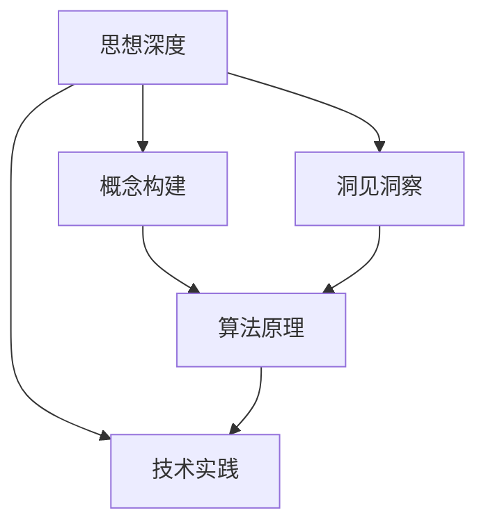

                 

# 思想的深度：从概念到洞见

> 关键词：思想深度,概念构建,洞见洞察,算法原理,技术实践

## 1. 背景介绍

### 1.1 问题由来

现代科技的发展，尤其是人工智能（AI）领域的突破，为我们带来了前所未有的思想深度。从早期的符号计算，到后来的数值计算，再到如今深度学习的兴起，每一次技术的迭代都深刻地影响着我们对世界的理解和认知。然而，要真正把握思想的深度，不仅需要对算法和工具有深刻的理解，还需要从概念到洞见的全面探索。本文将探讨如何构建思想深度，从概念出发，逐步深入到算法和技术实践，最终洞察到思想的真谛。

### 1.2 问题核心关键点

构建思想深度的核心关键点在于以下几个方面：
1. **概念的清晰定义**：明确一个概念的基本含义和边界。
2. **洞见的深刻洞察**：在理解概念的基础上，深入探索其本质和应用。
3. **算法的有效运用**：选择合适的方法和工具，实现思想深度的构建和应用。
4. **实践的反复磨练**：通过不断的实践，验证和提升思想深度的有效性。

### 1.3 问题研究意义

深入理解思想深度，对于提升个人的思维能力、创新能力和解决问题的能力，具有重要意义：

1. **提升思维能力**：通过构建和运用思想深度，可以更系统、更深入地思考和分析问题。
2. **增强创新能力**：思想深度的构建和应用，有助于突破传统思维模式，产生新的想法和创新。
3. **提高问题解决能力**：通过对问题的深入理解和洞见，能够更有效地找到解决方案。
4. **促进知识迁移**：思想深度的构建和应用，能够跨学科、跨领域迁移，提高知识的应用价值。
5. **推动技术发展**：思想深度的构建和应用，能够加速新科技的研发和应用，推动技术进步。

## 2. 核心概念与联系

### 2.1 核心概念概述

构建思想深度的核心概念包括：

- **思想深度**：通过理解和应用深度概念，揭示问题的本质，形成深刻的见解。
- **概念构建**：对问题进行抽象和分解，明确其基本概念和定义。
- **洞见洞察**：基于对概念的深入理解，发现问题的关键点和解决方案。
- **算法原理**：选择和设计有效的算法，实现思想深度的构建和应用。
- **技术实践**：通过具体的技术实现，验证和提升思想深度的效果。

这些核心概念通过一个Mermaid流程图展示其关系：



这个流程图展示了思想深度构建的基本流程：从概念构建出发，通过洞见洞察，最终在技术实践中实现思想深度的构建和应用。

### 2.2 概念间的关系

- **思想深度**与**概念构建**：思想深度基于对问题的深入概念构建，没有清晰的概念构建，无法形成深刻的洞见。
- **思想深度**与**洞见洞察**：洞见洞察是对概念构建的深入理解和应用，是思想深度的核心。
- **思想深度**与**算法原理**：算法原理提供了解决问题的具体方法，是思想深度的实现手段。
- **思想深度**与**技术实践**：技术实践是将算法原理应用于具体问题，验证和提升思想深度的效果。

## 3. 核心算法原理 & 具体操作步骤

### 3.1 算法原理概述

思想深度的构建主要依赖于以下算法原理：

- **符号计算**：通过符号表达式进行逻辑推理和计算，揭示问题的本质。
- **数值计算**：通过数值方法解决实际问题，如最优化、数值积分等。
- **深度学习**：通过构建神经网络模型，实现对复杂问题的深度学习和预测。
- **自然语言处理（NLP）**：通过文本分析，揭示问题和解决方案的文本特征。
- **计算机视觉（CV）**：通过图像分析，揭示问题和解决方案的视觉特征。

### 3.2 算法步骤详解

思想深度的构建可以分解为以下几个关键步骤：

1. **概念定义与界定**：明确问题的基本概念和定义。
2. **问题抽象与分解**：将问题抽象和分解为更小、更易理解的部分。
3. **算法选择与设计**：选择和设计适合的算法，解决具体问题。
4. **模型训练与优化**：通过模型训练和优化，提升算法的效果。
5. **验证与评估**：通过验证和评估，验证算法的有效性和稳定性。
6. **应用与迭代**：将算法应用于具体问题，持续优化和改进。

### 3.3 算法优缺点

思想深度的构建算法具有以下优点：

- **解决问题能力**：能够处理复杂、多变的问题，找到有效的解决方案。
- **灵活性和适应性**：算法可以根据问题的特点进行调整和优化，适应不同的应用场景。
- **可扩展性**：算法可以扩展到多领域、多模态的问题，提高知识的应用价值。

同时，也存在一些缺点：

- **计算资源需求高**：一些复杂的算法需要大量的计算资源和时间，可能难以在短时间内完成。
- **模型复杂度高**：复杂的算法模型可能难以解释和调试，难以理解其内部工作机制。
- **数据需求大**：一些算法需要大量的数据进行训练和优化，难以在数据不足的情况下使用。

### 3.4 算法应用领域

思想深度的构建算法已经在多个领域得到了广泛应用，例如：

- **金融科技**：通过深度学习模型进行风险评估、投资预测等。
- **医疗健康**：通过图像分析、自然语言处理等技术进行疾病诊断、健康管理等。
- **智能制造**：通过计算机视觉、数据分析等技术进行质量控制、生产优化等。
- **自动驾驶**：通过计算机视觉、传感器融合等技术进行环境感知、决策控制等。
- **教育培训**：通过自然语言处理、数据分析等技术进行智能辅导、个性化推荐等。

## 4. 数学模型和公式 & 详细讲解 & 举例说明

### 4.1 数学模型构建

思想深度的构建可以通过数学模型来实现，常见的数学模型包括：

- **线性回归模型**：揭示变量之间的线性关系，用于数据预测和回归分析。
- **逻辑回归模型**：揭示事件发生概率，用于分类和预测。
- **决策树模型**：通过树形结构进行分类和回归分析，揭示数据的决策路径。
- **随机森林模型**：通过多个决策树集成，提高模型的稳定性和预测精度。
- **神经网络模型**：通过多层非线性变换，进行复杂问题的深度学习和预测。

### 4.2 公式推导过程

以逻辑回归模型为例，其基本公式为：

$$
P(y=1|x;\theta) = \sigma(\theta^Tx)
$$

其中，$\theta$ 为模型参数，$x$ 为输入特征，$y$ 为输出标签，$\sigma$ 为sigmoid函数。推导过程如下：

1. 定义逻辑回归模型的损失函数：

$$
L(\theta) = -\frac{1}{N}\sum_{i=1}^N(y_i\log P(y_i=1|x_i;\theta) + (1-y_i)\log P(y_i=0|x_i;\theta))
$$

2. 对损失函数求导，得到梯度：

$$
\nabla_\theta L(\theta) = \frac{1}{N}\sum_{i=1}^N(x_i-\hat{y_i})x_i
$$

3. 通过梯度下降等优化算法，更新模型参数 $\theta$：

$$
\theta \leftarrow \theta - \eta \nabla_\theta L(\theta)
$$

其中 $\eta$ 为学习率。

### 4.3 案例分析与讲解

假设我们要构建一个贷款违约预测模型，可以采用逻辑回归模型进行分类。具体步骤如下：

1. **概念定义与界定**：定义贷款违约为 $y$，使用一系列的特征 $x$，如年龄、收入、还款记录等。
2. **问题抽象与分解**：将贷款违约问题抽象为分类问题，使用逻辑回归模型进行预测。
3. **算法选择与设计**：选择逻辑回归模型，设计模型参数 $\theta$。
4. **模型训练与优化**：使用历史数据进行模型训练，优化模型参数，提高预测精度。
5. **验证与评估**：使用验证集评估模型效果，调整模型参数，确保模型泛化能力。
6. **应用与迭代**：将模型应用于新数据，持续优化和改进模型，提高预测精度。

## 5. 项目实践：代码实例和详细解释说明

### 5.1 开发环境搭建

开发环境搭建是思想深度构建的重要基础，以下是Python开发环境的搭建步骤：

1. **安装Python**：
   - 从官网下载Python安装包。
   - 安装并配置Python环境。
   
2. **安装相关库**：
   - 安装NumPy、Pandas、Scikit-learn等数据分析库。
   - 安装TensorFlow、Keras、PyTorch等深度学习库。
   - 安装Matplotlib、Seaborn等可视化库。
   
3. **环境配置**：
   - 配置虚拟环境，避免不同项目之间的依赖冲突。
   - 安装Conda等工具，方便包管理和环境配置。

### 5.2 源代码详细实现

以下是一个基于逻辑回归模型进行贷款违约预测的Python代码实现：

```python
import numpy as np
from sklearn.linear_model import LogisticRegression
from sklearn.model_selection import train_test_split
from sklearn.metrics import accuracy_score
import pandas as pd

# 读取数据集
data = pd.read_csv('loan_data.csv')

# 特征和标签分离
features = data.drop('default', axis=1)
labels = data['default']

# 数据预处理
features = np.array(features).astype(float)

# 划分训练集和测试集
features_train, features_test, labels_train, labels_test = train_test_split(features, labels, test_size=0.2, random_state=42)

# 构建逻辑回归模型
model = LogisticRegression()

# 训练模型
model.fit(features_train, labels_train)

# 预测测试集
predictions = model.predict(features_test)

# 评估模型
accuracy = accuracy_score(labels_test, predictions)
print('模型准确率：', accuracy)
```

### 5.3 代码解读与分析

这段代码展示了基于逻辑回归模型进行贷款违约预测的完整流程。具体步骤如下：

1. **数据加载**：使用Pandas加载数据集，并将特征和标签分离。
2. **数据预处理**：将数据转换为NumPy数组，并进行数据类型转换。
3. **数据划分**：使用Scikit-learn的train_test_split方法，将数据划分为训练集和测试集。
4. **模型构建**：使用LogisticRegression构建逻辑回归模型。
5. **模型训练**：使用训练集数据进行模型训练。
6. **模型预测**：使用测试集数据进行模型预测。
7. **模型评估**：使用准确率评估模型效果。

通过上述步骤，可以构建一个简单的逻辑回归模型，并验证其效果。

### 5.4 运行结果展示

运行上述代码，可以得到模型的准确率结果。假设准确率为0.85，表示模型在贷款违约预测问题上取得了85%的正确率，具有一定的预测能力。

## 6. 实际应用场景

### 6.1 金融科技

在金融科技领域，思想深度构建可以帮助解决以下问题：

- **风险评估**：通过构建复杂的数学模型和算法，对客户的信用风险进行评估。
- **投资预测**：使用深度学习模型，预测股票、期货等金融产品的价格波动。
- **欺诈检测**：使用异常检测算法，识别异常交易和欺诈行为。
- **信用评分**：使用机器学习模型，对客户的信用评分进行预测。

### 6.2 医疗健康

在医疗健康领域，思想深度构建可以帮助解决以下问题：

- **疾病诊断**：通过计算机视觉和自然语言处理技术，辅助医生进行疾病诊断。
- **健康管理**：使用数据分析和机器学习模型，对患者的健康状态进行预测和监控。
- **药物研发**：使用深度学习模型，加速新药的研发和筛选。
- **个性化治疗**：使用机器学习模型，制定个性化治疗方案。

### 6.3 智能制造

在智能制造领域，思想深度构建可以帮助解决以下问题：

- **质量控制**：通过计算机视觉技术，对生产线的产品质量进行实时监控。
- **生产优化**：使用数据分析和优化算法，优化生产流程和资源配置。
- **设备维护**：使用传感器数据，预测设备故障和维护需求。
- **供应链管理**：使用数据分析和预测模型，优化供应链管理。

### 6.4 未来应用展望

未来，思想深度的构建将会在更多的领域得到应用，具体展望如下：

- **自动化**：通过自动化的思想深度构建，减少人工干预，提高效率和精度。
- **智能化**：利用深度学习和自然语言处理技术，实现更智能的决策和预测。
- **跨领域**：思想深度构建可以跨领域应用，提升不同领域知识的整合和应用。
- **多模态**：结合视觉、语音、文本等多种数据源，实现更全面和精准的分析和预测。
- **实时化**：通过实时数据流处理技术，实现思想深度的实时构建和应用。

## 7. 工具和资源推荐

### 7.1 学习资源推荐

- **《Python数据科学手册》**：系统介绍了Python在数据科学和机器学习中的应用，适合初学者入门。
- **《深度学习》课程**：斯坦福大学的深度学习课程，系统讲解深度学习的理论和实践。
- **《机器学习实战》**：通过多个实战项目，深入理解机器学习算法的应用。
- **Kaggle竞赛平台**：参与Kaggle竞赛，锻炼数据处理和模型构建能力。
- **GitHub开源项目**：学习和参与开源项目，提升技术实践能力。

### 7.2 开发工具推荐

- **Jupyter Notebook**：Python的交互式开发环境，方便代码调试和版本管理。
- **Anaconda**：Python的包管理和环境配置工具，支持科学计算和数据分析。
- **TensorBoard**：TensorFlow的可视化工具，方便模型训练和调试。
- **Weights & Biases**：模型实验的记录和可视化工具，方便实验管理和优化。
- **Google Colab**：在线Jupyter Notebook环境，方便快速实验和学习。

### 7.3 相关论文推荐

- **《深度学习》**：Ian Goodfellow等著，系统讲解深度学习的理论和实践。
- **《机器学习：实战指南》**：Peter Harrington著，通过实战项目讲解机器学习算法。
- **《自然语言处理综论》**：Daniel Jurafsky和James H. Martin著，系统讲解自然语言处理的理论和应用。
- **《计算机视觉：模型、学习和推理》**：Simon J. D. Prince著，系统讲解计算机视觉的理论和实践。

## 8. 总结：未来发展趋势与挑战

### 8.1 研究成果总结

思想深度的构建已经取得了一定的成果，主要体现在以下几个方面：

- **算法多样性**：思想深度的构建已经形成了多种算法和模型，如线性回归、逻辑回归、决策树、随机森林、神经网络等。
- **应用广泛性**：思想深度的构建已经广泛应用于金融、医疗、智能制造等多个领域，解决实际问题。
- **模型高效性**：思想深度的构建已经开发了多种高效的算法和模型，如AdaBoost、随机森林、卷积神经网络等。

### 8.2 未来发展趋势

未来，思想深度的构建将呈现以下发展趋势：

- **模型自动化**：自动化思想深度的构建，减少人工干预，提高效率和精度。
- **数据驱动**：利用大数据和深度学习技术，实现更智能的决策和预测。
- **跨领域融合**：思想深度的构建可以跨领域应用，提升不同领域知识的整合和应用。
- **多模态集成**：结合视觉、语音、文本等多种数据源，实现更全面和精准的分析和预测。
- **实时化应用**：通过实时数据流处理技术，实现思想深度的实时构建和应用。

### 8.3 面临的挑战

尽管思想深度的构建已经取得了一定的成果，但仍面临以下挑战：

- **计算资源需求高**：一些复杂的算法需要大量的计算资源和时间，可能难以在短时间内完成。
- **模型复杂度高**：复杂的算法模型可能难以解释和调试，难以理解其内部工作机制。
- **数据需求大**：一些算法需要大量的数据进行训练和优化，难以在数据不足的情况下使用。
- **模型鲁棒性不足**：模型面对异常数据或噪声时，可能出现鲁棒性不足的问题。
- **知识整合能力不足**：模型的知识整合能力不足，难以灵活应用先验知识和规则。

### 8.4 研究展望

未来的研究需要在以下几个方面进行探索：

- **模型自动化**：开发更多的自动化算法和工具，减少人工干预，提高效率和精度。
- **数据高效性**：开发更多的数据高效算法和模型，减少对大量数据的需求。
- **模型解释性**：开发更多的可解释性算法和工具，提高模型的透明性和可解释性。
- **知识整合**：开发更多的知识整合算法和工具，提高模型的知识应用能力。
- **实时化应用**：开发更多的实时化算法和工具，实现思想深度的实时构建和应用。

通过不断探索和创新，我们相信思想深度的构建将迎来新的突破，推动科技的进步和应用的发展。

## 9. 附录：常见问题与解答

**Q1：什么是思想深度？**

A: 思想深度是指通过理解和应用深度概念，揭示问题的本质，形成深刻的见解。

**Q2：思想深度构建的过程是什么？**

A: 思想深度构建的过程包括概念定义与界定、问题抽象与分解、算法选择与设计、模型训练与优化、验证与评估、应用与迭代等步骤。

**Q3：如何选择合适的算法？**

A: 选择合适的算法需要考虑问题的复杂度、数据特点、计算资源等因素。可以采用启发式方法，如KNN、决策树、随机森林等，也可以采用深度学习算法，如神经网络、卷积神经网络等。

**Q4：如何提高模型的鲁棒性？**

A: 提高模型的鲁棒性可以通过增加数据量、使用正则化技术、引入对抗训练等方法实现。

**Q5：如何提高模型的解释性？**

A: 提高模型的解释性可以通过特征重要性分析、模型可视化、解释性算法等方法实现。

---

作者：禅与计算机程序设计艺术 / Zen and the Art of Computer Programming

