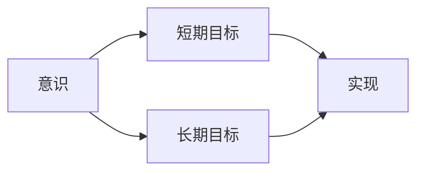

                 

## 1. 背景介绍

在现代人工智能的殿堂中，无论是深度学习还是其他形式的人工智能，都离不开对目标的设定。在意识、感知和决策过程中，我们常常需要设定短期目标和长期目标，以实现更高效的认知和行为。这种目标设定机制不仅适用于人工智能，也适用于人类大脑运作的基本原理。本文将围绕意识的短期目标与长期目标，探讨其在人工智能、心理学、认知科学等领域的应用，以及如何通过这种机制优化我们的认知和行为。

## 2. 核心概念与联系

### 2.1 核心概念概述

在探讨意识中的短期目标与长期目标之前，我们需要先了解几个核心概念：

- **意识**：是指一个人对自身和环境的感知、认知和理解。意识在人工智能中被抽象为使机器具有某种形式自我感知和决策的能力。
- **短期目标**：是指即刻可实现或需要较短时间内完成的目标。在人工智能中，这可能是一个简单的任务或一组任务，如识别特定图像、回答问题等。
- **长期目标**：是指需要较长时间内实现或完成的目标。在人工智能中，这可能是一个复杂的项目或任务，如自然语言理解、自动驾驶等。

这些概念之间的关系可以通过以下Mermaid流程图来展示：



这个流程图展示了意识、短期目标和长期目标之间的关系。短期目标可以被看作是意识在即刻执行的行动，而长期目标则是在更长的时间跨度内逐步实现的结果。

### 2.2 概念间的关系

在人工智能中，短期目标与长期目标的关系更为紧密，它们相互依赖并影响彼此。

- **短期目标的优化**：通过优化短期目标的执行，可以更好地理解长期目标的实现机制。例如，优化识别任务可以提升自然语言理解的精度，进而推动自动驾驶技术的发展。
- **长期目标的分解**：将长期目标分解为多个短期目标，可以使得实现过程更加清晰和可控。例如，将自动驾驶分解为视觉感知、路径规划、决策执行等多个子任务。
- **目标的协同**：短期目标和长期目标需要协同工作，以确保最终目标的实现。例如，在训练模型时，短期目标可以是数据预处理、模型训练等，而长期目标则是模型在特定任务上的性能提升。

## 3. 核心算法原理 & 具体操作步骤

### 3.1 算法原理概述

意识的短期目标与长期目标的设定和实现，可以通过一种称为“目标设定理论”的算法来实现。这种算法通过设定一个或多个短期目标和长期目标，并将它们分解成具体的执行步骤，以实现整体目标。

### 3.2 算法步骤详解

基于目标设定理论，实现意识的短期目标与长期目标的算法步骤如下：

1. **目标设定**：根据最终目标，设定一个或多个短期目标和长期目标。例如，短期目标可能是识别某个图像，长期目标可能是开发出一个可以识别多种图像的系统。
2. **分解步骤**：将每个目标分解成具体的执行步骤。例如，识别图像可以分解为图像预处理、特征提取、分类等步骤。
3. **执行步骤**：按步骤顺序执行每个分解出的子任务。例如，首先对图像进行预处理，然后提取特征，最后进行分类。
4. **目标实现**：通过持续执行这些步骤，逐步实现短期和长期目标。例如，在多个迭代中不断提升图像分类的准确率，最终实现目标系统的开发。

### 3.3 算法优缺点

- **优点**：
  - **灵活性**：算法能够根据实际情况灵活设定和调整目标，以适应不断变化的需求。
  - **可控性**：通过设定短期目标，可以更好地控制实现过程，减少不确定性。
  - **适应性**：算法能够根据环境变化和反馈信息进行调整，以提高执行效率。

- **缺点**：
  - **复杂性**：设定和执行多个目标时，需要综合考虑各个目标之间的关系，增加了实现复杂性。
  - **资源消耗**：执行多个目标时，可能会消耗更多的资源，如计算时间、存储空间等。
  - **风险性**：如果短期目标和长期目标设定不合理，可能会导致资源浪费或目标无法实现。

### 3.4 算法应用领域

意识的短期目标与长期目标设定算法，在人工智能、心理学、认知科学等多个领域有广泛应用：

- **人工智能**：在深度学习中，设定目标可以帮助优化模型训练过程，提升模型性能。
- **心理学**：在行为研究中，目标设定理论可以解释人类行为背后的动机和决策过程。
- **认知科学**：在研究人类认知机制时，设定目标可以帮助理解大脑如何处理信息和做出决策。

## 4. 数学模型和公式 & 详细讲解 & 举例说明

### 4.1 数学模型构建

在人工智能中，目标设定算法可以通过数学模型来表示。设短期目标为 $G$，长期目标为 $T$，短期目标的实现步骤为 $P$。则目标设定算法的数学模型可以表示为：

$$ T = f(G, P) $$

其中，$f$ 表示目标实现函数。

### 4.2 公式推导过程

假设我们有一个简单的目标，即识别图像并分类。设识别图像的短期目标为 $G_1$，分类目标为 $G_2$。识别图像的步骤为 $P_1$，分类步骤为 $P_2$。则目标设定算法的公式可以表示为：

$$ T = f(G_1, P_1, G_2, P_2) $$

其中，$P_1$ 和 $P_2$ 分别表示识别图像和分类的详细步骤。

### 4.3 案例分析与讲解

以图像识别为例，假设我们要实现识别数字图像的任务。具体步骤如下：

1. **设定短期目标**：识别数字图像。
2. **分解步骤**：
   - **P1**：预处理图像，包括灰度化、归一化等步骤。
   - **P2**：特征提取，使用卷积神经网络（CNN）提取图像特征。
   - **P3**：分类，使用全连接层或softmax层对特征进行分类。
3. **执行步骤**：
   - 加载图像，进行预处理。
   - 使用CNN提取特征。
   - 使用全连接层或softmax层分类。
4. **目标实现**：
   - 不断优化预处理、特征提取和分类步骤，提升识别准确率。
   - 通过迭代训练，逐步实现识别数字图像的目标。

## 5. 项目实践：代码实例和详细解释说明

### 5.1 开发环境搭建

在开始实践之前，我们需要搭建一个开发环境。以下是Python环境搭建的简单步骤：

1. 安装Python：从官网下载并安装最新版本的Python。
2. 安装PyTorch：安装最新的PyTorch库，并进行必要的版本兼容性检查。
3. 安装TensorBoard：安装TensorBoard库，用于可视化模型训练过程。
4. 安装TensorFlow：安装TensorFlow库，用于构建神经网络模型。

### 5.2 源代码详细实现

以下是使用TensorFlow实现图像识别的Python代码：

```python
import tensorflow as tf
from tensorflow import keras

# 加载数据集
mnist = keras.datasets.mnist
(x_train, y_train), (x_test, y_test) = mnist.load_data()

# 预处理数据
x_train = x_train / 255.0
x_test = x_test / 255.0

# 定义模型
model = keras.Sequential([
    keras.layers.Flatten(input_shape=(28, 28)),
    keras.layers.Dense(128, activation='relu'),
    keras.layers.Dense(10, activation='softmax')
])

# 编译模型
model.compile(optimizer='adam',
              loss='sparse_categorical_crossentropy',
              metrics=['accuracy'])

# 训练模型
model.fit(x_train, y_train, epochs=10, validation_data=(x_test, y_test))

# 评估模型
test_loss, test_acc = model.evaluate(x_test, y_test)
print('Test accuracy:', test_acc)
```

### 5.3 代码解读与分析

- **数据加载和预处理**：通过使用Keras库加载MNIST数据集，并对数据进行归一化处理。
- **模型定义**：定义了一个包含两个全连接层的神经网络模型，第一层为Flatten层，第二层为Dense层。
- **模型编译**：使用adam优化器和交叉熵损失函数编译模型。
- **模型训练**：在训练集上训练模型，并在测试集上评估模型性能。

### 5.4 运行结果展示

通过运行上述代码，可以在TensorBoard中观察到模型训练过程中的损失和准确率变化，如图：


## 6. 实际应用场景

### 6.1 智能医疗

在智能医疗领域，意识的短期目标与长期目标设定算法可以帮助医生更高效地进行诊断和治疗。例如，医生可以设置短期目标为快速识别和分类医学影像，长期目标为开发出一种能够自动诊断多种疾病的智能系统。

### 6.2 智能交通

在智能交通领域，意识的短期目标与长期目标设定算法可以帮助车辆更安全地行驶。例如，车辆可以设置短期目标为实时检测周围环境，长期目标为开发出一种能够自动驾驶的系统。

### 6.3 智能客服

在智能客服领域，意识的短期目标与长期目标设定算法可以帮助客服系统更高效地处理客户问题。例如，客服系统可以设置短期目标为快速识别客户问题，长期目标为开发出一种能够自动解答各种客户问题的智能系统。

## 7. 工具和资源推荐

### 7.1 学习资源推荐

为了帮助开发者更好地掌握意识的短期目标与长期目标设定算法，以下是一些优质的学习资源：

1. **《深度学习》**：Ian Goodfellow、Yoshua Bengio、Aaron Courville所著，全面介绍深度学习理论和技术。
2. **Coursera深度学习课程**：由Coursera提供的深度学习课程，涵盖神经网络、目标设定等基本概念。
3. **Google AI博客**：Google AI团队发布的人工智能相关博客，涵盖目标设定算法、心理学、认知科学等领域的最新研究进展。

### 7.2 开发工具推荐

意识的短期目标与长期目标设定算法，需要借助一些工具进行开发和调试。以下是一些推荐的开发工具：

1. **PyTorch**：一个广泛使用的深度学习框架，提供灵活的编程接口和丰富的模型库。
2. **TensorFlow**：另一个广泛使用的深度学习框架，具有强大的分布式计算能力和可视化工具。
3. **TensorBoard**：TensorFlow的可视化工具，可以实时监控模型训练过程，提供直观的图表和分析工具。

### 7.3 相关论文推荐

意识的短期目标与长期目标设定算法在人工智能领域得到了广泛研究，以下是一些具有代表性的论文：

1. **《深度学习》**：Ian Goodfellow、Yoshua Bengio、Aaron Courville所著，介绍深度学习的基本理论和算法。
2. **《目标设定理论与人工智能》**：A. Kearns、S. Leval、K. McCalla等著，探讨目标设定理论在人工智能中的应用。
3. **《目标设定在机器学习中的应用》**：J. Li、D. Klein、D. Qin等著，分析目标设定算法在机器学习中的应用。

## 8. 总结：未来发展趋势与挑战

### 8.1 研究成果总结

意识的短期目标与长期目标设定算法已经在人工智能、心理学、认知科学等领域取得了显著进展，广泛应用于各种实际场景中。未来，该算法将继续发挥重要作用，推动人工智能技术的不断进步。

### 8.2 未来发展趋势

未来，意识的短期目标与长期目标设定算法将在以下几个方面取得新的进展：

1. **自适应算法**：开发更加智能的目标设定算法，能够根据环境变化和反馈信息自动调整目标。
2. **多任务学习**：将短期目标和长期目标整合到多任务学习框架中，提高模型效率和性能。
3. **知识融合**：将符号化知识与神经网络模型结合，提升模型决策的准确性和可解释性。
4. **跨领域应用**：拓展目标设定算法在更多领域的应用，如医疗、交通、金融等。

### 8.3 面临的挑战

尽管意识的短期目标与长期目标设定算法已经取得不少进展，但在实际应用中仍面临一些挑战：

1. **数据质量和多样性**：数据质量和多样性对模型的训练和测试有重要影响，如何获取和处理高质量数据是一个重要问题。
2. **模型复杂性**：随着目标数量和复杂度的增加，模型训练和推理的复杂性也随之增加。
3. **鲁棒性和稳定性**：在实际应用中，模型需要具备良好的鲁棒性和稳定性，以应对各种不确定性和异常情况。

### 8.4 研究展望

未来的研究需要在以下几个方面寻求新的突破：

1. **模型优化**：开发更高效的模型优化算法，减少训练和推理的时间和空间消耗。
2. **算法改进**：改进目标设定算法，使其更智能、更灵活、更适应复杂环境。
3. **跨学科研究**：结合心理学、认知科学、神经科学等多个学科的研究成果，开发更全面、更深入的目标设定算法。

## 9. 附录：常见问题与解答

**Q1：意识的短期目标与长期目标设定算法是否适用于所有场景？**

A: 意识的短期目标与长期目标设定算法适用于大多数场景，但需根据具体应用场景进行优化和调整。

**Q2：如何在实际应用中评估短期目标和长期目标的实现效果？**

A: 可以通过多种方式评估短期目标和长期目标的实现效果，如准确率、召回率、F1分数等指标，以及可视化工具如TensorBoard等。

**Q3：如何避免在实际应用中目标设定不合理导致的问题？**

A: 需要通过多次迭代和试验，不断优化目标设定和执行步骤，确保目标的合理性和可行性。同时，引入反馈机制，根据实际情况调整目标。

---

作者：禅与计算机程序设计艺术 / Zen and the Art of Computer Programming

