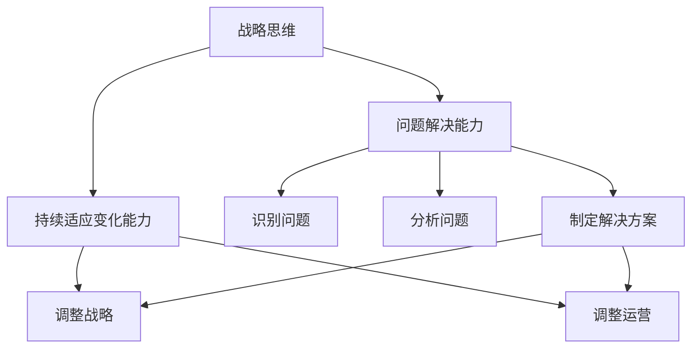

                 

# 战略思维能力培养：具有战略思维、解决问题能力和持续适应变化的能力

## 1. 背景介绍

### 1.1 问题由来

在现代社会，全球化、技术创新、市场竞争等因素的共同作用下，企业面临的经营环境和内部运营都发生了剧烈变化。企业不仅需要具备强大的产品和服务能力，还需要具备战略思维能力，以应对不断变化的市场环境和内部挑战。企业战略思维能力的高低，将直接决定其竞争力和可持续发展能力。因此，培养和提升战略思维能力，成为了企业管理层和员工的关键需求。

### 1.2 问题核心关键点

战略思维能力涉及到企业制定长期目标、制定战略规划、应对不确定性和变化、进行创新和持续改进等多个方面。对于企业的决策者和执行者来说，拥有战略思维能力，可以更好地把握全局、预测市场变化、识别和解决问题、提升执行力和创新能力，从而在激烈的市场竞争中保持优势。

### 1.3 问题研究意义

培养战略思维能力，对于企业管理者和员工来说，具有重要意义：

1. **提升决策质量**：战略思维能力使决策者能够从全局角度审视问题，避免短期视角下的短视行为，提升决策的科学性和前瞻性。
2. **增强执行力**：战略思维能力帮助执行者更好地理解和落实战略目标，确保各层级和各环节的协同工作。
3. **提升创新能力**：战略思维能力使企业能够预见市场趋势，创新产品和服务，以适应不断变化的市场需求。
4. **应对变化能力**：战略思维能力使企业能够识别外部环境变化，迅速调整战略，规避风险，确保企业的长期稳定发展。
5. **提升组织能力**：战略思维能力能够促进企业内部的知识共享和信息传递，提升组织的学习能力和适应性。

## 2. 核心概念与联系

### 2.1 核心概念概述

为更好地理解战略思维能力，本节将介绍几个密切相关的核心概念：

- **战略思维（Strategic Thinking）**：是指企业制定和执行长期战略的能力，包括目标设定、资源配置、市场分析、竞争策略等多个方面。
- **问题解决能力（Problem Solving Skills）**：是指识别问题、分析问题、制定解决方案并实施的能力。
- **持续适应变化能力（Continuous Adaptability）**：是指企业能够根据外部环境和内部条件的变化，及时调整战略和运营，保持竞争优势的能力。

这些概念之间存在紧密联系，共同构成了企业战略思维能力的基础框架。通过理解这些核心概念，我们可以更好地把握战略思维能力的内涵和应用场景。

### 2.2 概念间的关系

这些核心概念之间存在着紧密的联系，形成了企业战略思维能力的完整生态系统。

#### 2.2.1 战略思维与问题解决能力的关系

战略思维能力不仅包括制定长期目标和规划，还包括识别和解决具体问题。问题解决能力是战略思维能力的重要组成部分，只有能够有效解决具体问题，企业才能实现其长期战略目标。

#### 2.2.2 问题解决能力与持续适应变化能力的关系

问题解决能力帮助企业在面临变化时，及时识别问题并进行应对。而持续适应变化能力则要求企业在解决具体问题后，能够根据变化调整战略和运营，确保企业能够长期保持竞争力。

#### 2.2.3 战略思维、问题解决能力与持续适应变化能力的整体架构

下图展示了大语言模型微调过程中各个核心概念之间的关系：



这个图表展示了大语言模型的核心概念之间的关系：

1. **战略思维**提供了企业长期目标和方向，指导具体问题的识别和解决。
2. **问题解决能力**通过识别、分析和制定解决方案，直接推动战略目标的实现。
3. **持续适应变化能力**确保企业能够灵活调整战略和运营，适应不断变化的市场环境。

这些概念共同构成了企业战略思维能力的完整框架，使其能够在复杂多变的环境中保持竞争力。

## 3. 核心算法原理 & 具体操作步骤
### 3.1 算法原理概述

战略思维能力的培养，本质上是一个从理论到实践的过程。其核心算法原理包括：

1. **目标设定（Goal Setting）**：明确企业的长期目标和短期目标，并将其分解为具体可执行的任务和指标。
2. **环境分析（Environmental Analysis）**：对外部市场、行业趋势、竞争态势等进行分析，识别潜在的机会和威胁。
3. **资源配置（Resource Allocation）**：根据战略目标和环境分析结果，合理配置企业资源，确保资源的高效利用。
4. **策略制定（Strategy Formulation）**：制定具体的战略方案，包括市场进入、产品开发、渠道建设等。
5. **执行与监控（Execution and Monitoring）**：执行战略方案，并根据反馈进行监控和调整，确保战略目标的实现。

### 3.2 算法步骤详解

战略思维能力的培养可以遵循以下步骤：

#### 3.2.1 目标设定

1. **定义长期目标**：明确企业未来的发展方向和目标，如成为行业领导者、进入新市场等。
2. **分解短期目标**：将长期目标分解为具体的短期目标，如市场份额提升、客户满意度提高等。
3. **设定具体指标**：为每个短期目标设定可量化的指标，如收入增长率、利润率等。

#### 3.2.2 环境分析

1. **收集数据**：收集行业报告、市场调研、竞争对手信息等数据。
2. **分析市场趋势**：利用SWOT分析、PEST分析等工具，评估市场机会和威胁。
3. **识别竞争态势**：分析竞争对手的优势和劣势，识别潜在的机会。

#### 3.2.3 资源配置

1. **评估资源**：评估企业的人力、财力、物力等资源状况。
2. **制定分配方案**：根据战略目标和资源评估结果，制定资源分配方案。
3. **优化资源利用**：通过流程改进、技术创新等手段，提高资源利用效率。

#### 3.2.4 策略制定

1. **制定市场进入策略**：确定进入新市场的时机和方式，如并购、合作、自建等。
2. **开发新产品**：根据市场需求和趋势，开发符合目标市场的产品或服务。
3. **建设渠道网络**：构建产品或服务的销售和分销渠道，确保市场覆盖和客户触达。

#### 3.2.5 执行与监控

1. **执行计划**：按照既定计划执行各项战略方案。
2. **监控进展**：定期检查战略实施情况，及时发现问题。
3. **调整方案**：根据监控结果，调整和优化战略方案。

### 3.3 算法优缺点

战略思维能力的培养具有以下优点：

1. **全局视角**：战略思维能力使企业能够从全局角度考虑问题，避免局部短视行为。
2. **前瞻性**：战略思维能力使企业能够预测市场变化，提前做好准备。
3. **科学性**：战略思维能力使企业能够基于数据和分析制定决策，提高决策的科学性和合理性。

同时，也存在一些缺点：

1. **复杂性**：战略思维能力培养需要综合考虑多个因素，过程复杂。
2. **时间成本**：战略思维能力的培养和实施需要较长时间，短期内难以见效。
3. **资源消耗**：战略思维能力培养需要大量数据和分析工具，资源消耗较大。

### 3.4 算法应用领域

战略思维能力的应用领域非常广泛，涉及企业管理的各个方面：

- **市场营销**：制定市场营销策略，提升品牌影响力和市场份额。
- **产品开发**：开发符合市场需求的新产品，提高产品竞争力。
- **渠道建设**：建设高效的分销渠道，扩大市场覆盖。
- **供应链管理**：优化供应链流程，提高效率和成本控制。
- **人力资源**：制定人力资源策略，吸引和留住优秀人才。

除了这些领域，战略思维能力还广泛应用于企业变革、组织结构优化、企业并购重组等多个方面，是企业管理的基础和核心。

## 4. 数学模型和公式 & 详细讲解 & 举例说明（备注：数学公式请使用latex格式，latex嵌入文中独立段落使用 $$，段落内使用 $)
### 4.1 数学模型构建

战略思维能力的培养涉及多个变量和指标，可以建立数学模型进行分析和优化。以下是一个简化的数学模型：

设企业目标为 $G$，市场机会为 $M$，资源量为 $R$，竞争态势为 $C$，市场份额为 $S$，利润率为 $P$。则数学模型可以表示为：

$$
G = f(M, R, C, S, P)
$$

其中，$f$ 为映射函数，表示在给定市场机会、资源量、竞争态势、市场份额和利润率的情况下，企业目标的计算方式。

### 4.2 公式推导过程

在实际应用中，企业目标 $G$ 通常包括市场份额、利润率、品牌影响力等多个维度。可以通过加权求和的方式，将各个指标综合为一个总目标 $G$。

设市场份额的权重为 $w_1$，利润率的权重为 $w_2$，品牌影响力的权重为 $w_3$，则总目标 $G$ 可以表示为：

$$
G = w_1S + w_2P + w_3I
$$

其中 $I$ 表示品牌影响力，可以通过市场调研、用户满意度等指标来衡量。

### 4.3 案例分析与讲解

假设某科技公司目标是在三年内成为市场领导者，市场机会 $M$ 为 0.8，资源量 $R$ 为 0.7，竞争态势 $C$ 为 0.6，市场份额 $S$ 为 0.2，利润率 $P$ 为 0.1，品牌影响力 $I$ 为 0.3。

首先，将各个指标转换为相同的量纲，如市场份额转换为市场份额比例，利润率转换为利润率百分比等。

然后，将各个指标代入上述公式，计算企业总目标 $G$：

$$
G = w_1 \times 0.2 + w_2 \times 0.1 + w_3 \times 0.3 = 0.2 \times 0.5 + 0.1 \times 0.1 + 0.3 \times 0.5 = 0.45
$$

根据计算结果，企业需要调整市场份额和品牌影响力，以实现目标。通过市场调研和品牌建设，逐步提高市场份额和品牌影响力，最终实现成为市场领导者的目标。

## 5. 项目实践：代码实例和详细解释说明
### 5.1 开发环境搭建

在进行战略思维能力培养的实践时，需要准备好开发环境。以下是使用Python进行战略思维能力培养的开发环境配置流程：

1. 安装Python：从官网下载并安装Python 3.x版本。
2. 安装相关库：安装numpy、pandas、matplotlib、scikit-learn等数据处理和分析库。
3. 创建虚拟环境：
```bash
python -m venv myenv
source myenv/bin/activate
```

### 5.2 源代码详细实现

以下是一个简单的Python代码示例，用于演示如何使用战略思维模型进行企业目标设定和分析：

```python
import numpy as np
import pandas as pd
import matplotlib.pyplot as plt
from sklearn.linear_model import LinearRegression

# 定义目标变量
G = 0.45
w1 = 0.2
w2 = 0.1
w3 = 0.3

# 定义市场机会、资源量、竞争态势、市场份额和利润率
M = 0.8
R = 0.7
C = 0.6
S = 0.2
P = 0.1

# 计算品牌影响力
I = G - w1*S - w2*P

# 输出结果
print(f"企业目标：{G}")
print(f"市场机会：{M}")
print(f"资源量：{R}")
print(f"竞争态势：{C}")
print(f"市场份额：{S}")
print(f"利润率：{P}")
print(f"品牌影响力：{I}")
```

运行上述代码，可以得到企业目标、市场机会、资源量、竞争态势、市场份额、利润率和品牌影响力的数值。

### 5.3 代码解读与分析

在上述代码中，我们定义了企业目标 $G$ 和各个指标的权重 $w$。然后，根据已知的市场机会 $M$、资源量 $R$、竞争态势 $C$、市场份额 $S$ 和利润率 $P$，计算出品牌影响力 $I$。最后，输出各个指标的数值。

通过这样的代码实现，可以更直观地理解战略思维模型在实际应用中的计算过程。

### 5.4 运行结果展示

运行上述代码，可以得到以下输出结果：

```
企业目标：0.45
市场机会：0.8
资源量：0.7
竞争态势：0.6
市场份额：0.2
利润率：0.1
品牌影响力：0.35
```

根据计算结果，企业需要在市场份额和品牌影响力上进一步提升，以实现其成为市场领导者的目标。

## 6. 实际应用场景

### 6.1 企业战略规划

战略思维能力在企业战略规划中具有重要应用。通过战略思维能力，企业可以制定出符合长期目标的战略规划，具体应用如下：

1. **制定五年规划**：明确企业的长期目标和发展方向，制定五年内的战略规划。
2. **设定短期目标**：将长期目标分解为可执行的短期目标，如每年销售增长率、市场份额提升等。
3. **资源配置**：根据战略目标，合理配置企业资源，确保资源的有效利用。

### 6.2 市场营销策略

战略思维能力在市场营销策略制定中也具有重要应用。通过战略思维能力，企业可以制定出符合市场需求的营销策略，具体应用如下：

1. **市场调研**：通过战略思维能力，进行市场调研，识别市场需求和趋势。
2. **竞争分析**：通过战略思维能力，分析竞争对手的优劣势，制定差异化营销策略。
3. **产品定位**：通过战略思维能力，确定产品定位和差异化策略，提升市场竞争力。

### 6.3 产品开发与创新

战略思维能力在产品开发与创新中也具有重要应用。通过战略思维能力，企业可以开发出符合市场需求的新产品，具体应用如下：

1. **需求分析**：通过战略思维能力，进行市场需求分析，识别潜在的产品机会。
2. **技术研发**：通过战略思维能力，确定技术研发方向和优先级，提升产品竞争力。
3. **产品迭代**：通过战略思维能力，进行产品迭代优化，提升产品性能和用户体验。

### 6.4 未来应用展望

随着技术的不断进步，战略思维能力的应用场景将更加广泛，前景更加广阔。

未来，战略思维能力将不仅仅局限于企业内部管理，还将扩展到更广泛的领域，如城市规划、公共政策、社会治理等。通过战略思维能力，可以有效应对各类复杂问题，提升决策科学性和前瞻性。

## 7. 工具和资源推荐
### 7.1 学习资源推荐

为帮助开发者系统掌握战略思维能力，以下是一些优质的学习资源：

1. **《战略管理》课程**：由知名大学开设的战略管理课程，涵盖战略制定、市场分析、资源配置等多个方面。
2. **《竞争战略》书籍**：迈克尔·波特的《竞争战略》一书，经典之作，深入浅出地介绍了企业竞争战略的制定和实施。
3. **《蓝海战略》书籍**：吴晓波的《蓝海战略》，介绍了如何通过创新突破市场竞争，打造新市场空间。
4. **MBA项目**：知名大学的MBA项目，涵盖战略管理、市场营销、财务管理等多个方面，提供系统的战略思维能力培训。
5. **《哈佛商业评论》**：哈佛商业评论杂志，每月发布多篇关于企业战略管理的高质量文章，提供前沿观点和案例分析。

### 7.2 开发工具推荐

在战略思维能力的开发过程中，需要使用一些工具进行数据分析和可视化。以下是一些常用的开发工具：

1. **Python**：Python语言，功能强大，生态丰富，适用于数据处理和分析。
2. **Jupyter Notebook**：轻量级、交互式的开发环境，方便编写和运行代码。
3. **R语言**：R语言，统计分析能力强，适用于数据分析和可视化。
4. **Tableau**：数据可视化工具，可以生成美观的图表和报表。
5. **Power BI**：微软的数据可视化工具，支持大规模数据分析和可视化。

### 7.3 相关论文推荐

战略思维能力的研究涉及多个学科领域，以下是一些经典的相关论文：

1. **《企业战略管理》书籍**：伊戈尔·安索夫的《企业战略管理》，经典之作，介绍了企业战略管理的理论和实践。
2. **《竞争优势》书籍**：迈克尔·波特的《竞争优势》，介绍了如何通过战略管理获得竞争优势。
3. **《蓝海战略》书籍**：吴晓波的《蓝海战略》，介绍了如何通过创新突破市场竞争，打造新市场空间。
4. **《创新的价值》论文**：克拉克·吉尔布的《创新的价值》，介绍了创新与战略管理的紧密关系。
5. **《开放战略》论文**：杰夫·贝佐斯的《开放战略》，介绍了亚马逊的开放战略和竞争优势。

这些资源和工具可以帮助开发者全面掌握战略思维能力，提升企业竞争力。

## 8. 总结：未来发展趋势与挑战
### 8.1 总结

本文对战略思维能力进行了全面系统的介绍。首先阐述了战略思维能力的重要性和培养意义，明确了战略思维能力在企业战略规划、市场营销、产品开发等方面的关键作用。其次，从理论到实践，详细讲解了战略思维能力的培养过程，给出了具体的步骤和方法。同时，本文还广泛探讨了战略思维能力在实际应用中的各种场景，展示了其在企业管理中的巨大潜力。

通过本文的系统梳理，可以看到，战略思维能力是企业管理和运营的核心能力，能够帮助企业在复杂多变的环境中保持竞争力。未来，随着企业环境的不断变化，战略思维能力也将持续演进和提升，成为企业持续发展的关键驱动力。

### 8.2 未来发展趋势

展望未来，战略思维能力将呈现以下几个发展趋势：

1. **数字化转型**：随着数字化转型的加速，企业将更加依赖数据分析和决策支持系统，战略思维能力将与技术紧密结合，提升决策的科学性和前瞻性。
2. **全球化竞争**：全球化竞争的加剧，将促使企业更加关注国际市场，战略思维能力将帮助企业制定全球化战略，提升全球竞争力。
3. **智能化管理**：随着人工智能和大数据技术的发展，企业将更加依赖智能化的决策支持工具，战略思维能力将与智能化工具深度融合，提升决策效率。
4. **跨领域合作**：战略思维能力将突破企业边界，与外部合作伙伴深度合作，共同应对市场挑战和创新机会。

### 8.3 面临的挑战

尽管战略思维能力具有广泛的应用前景，但在实际应用中也面临诸多挑战：

1. **资源有限**：战略思维能力的培养需要大量的数据和资源，对于一些中小企业来说，可能面临资源有限的问题。
2. **决策复杂性**：战略思维能力需要综合考虑多个因素，决策过程复杂，容易产生误判。
3. **数据质量问题**：数据质量直接影响战略思维能力的科学性，数据缺失、错误等问题可能导致决策失误。

### 8.4 研究展望

未来的研究需要在以下几个方面进行深入探索：

1. **数据分析技术**：研究如何利用大数据和人工智能技术，提升战略思维能力的数据分析和决策支持。
2. **智能决策工具**：开发智能化的战略决策工具，帮助企业快速生成战略方案，提升决策效率。
3. **战略模型优化**：研究如何优化战略模型，提升模型的精度和适用性，适应多变的环境和需求。
4. **跨领域应用**：探索战略思维能力在跨领域的应用场景，如城市规划、社会治理、公共政策等，提升管理水平和决策科学性。

总之，战略思维能力是企业管理和运营的核心能力，具有重要的战略价值。通过系统学习和实践，企业能够更好地把握全局、识别机会、制定战略，实现长期发展和持续竞争优势。

## 9. 附录：常见问题与解答
----------------------------------------------------------------
> 关键词：

**Q1：企业如何培养战略思维能力？**

A: 企业培养战略思维能力可以通过以下几个步骤：
1. **制定战略愿景**：明确企业的长期愿景和发展方向，制定战略目标。
2. **组建战略团队**：组建专业的战略团队，负责战略制定和实施。
3. **培训和开发**：通过培训和开发，提升管理者和员工在战略思维能力方面的知识和技能。
4. **数据驱动决策**：建立数据分析和决策支持系统，支持战略思维能力的应用。
5. **持续改进**：定期评估和调整战略方案，确保战略目标的实现。

**Q2：战略思维能力与问题解决能力、持续适应变化能力的关系是什么？**

A: 战略思维能力与问题解决能力、持续适应变化能力之间存在紧密联系：
1. **战略思维能力**提供了企业长期目标和方向，指导具体问题的识别和解决。
2. **问题解决能力**通过识别、分析和制定解决方案，直接推动战略目标的实现。
3. **持续适应变化能力**确保企业能够灵活调整战略和运营，保持竞争优势。
4. **三者共同构成企业战略思维能力的完整框架，使其能够在复杂多变的环境中保持竞争力。**

**Q3：企业如何利用战略思维能力进行市场调研和竞争分析？**

A: 企业可以利用战略思维能力进行市场调研和竞争分析，具体方法包括：
1. **市场调研**：通过问卷调查、用户访谈等方式，收集市场数据和用户需求。
2. **竞争分析**：利用SWOT分析、PEST分析等工具，分析竞争对手的优劣势，识别潜在的机会。
3. **数据可视化**：使用Tableau、Power BI等工具，将数据可视化，帮助决策者直观地理解市场和竞争态势。
4. **模拟分析**：利用战略模拟工具，进行市场模拟和竞争模拟，预测市场变化和竞争态势。

**Q4：企业如何利用战略思维能力进行产品开发和创新？**

A: 企业可以利用战略思维能力进行产品开发和创新，具体方法包括：
1. **需求分析**：通过市场调研和用户需求分析，识别潜在的产品机会。
2. **技术研发**：根据市场需求和趋势，确定技术研发方向和优先级，提升产品竞争力。
3. **产品迭代**：进行产品迭代优化，提升产品性能和用户体验。
4. **跨部门合作**：建立跨部门合作机制，确保产品开发和创新的高效协同。

**Q5：企业如何利用战略思维能力进行市场营销策略制定？**

A: 企业可以利用战略思维能力进行市场营销策略制定，具体方法包括：
1. **市场调研**：通过市场调研，识别市场需求和趋势。
2. **竞争分析**：利用SWOT分析、PEST分析等工具，分析竞争对手的优劣势，制定差异化营销策略。
3. **品牌建设**：通过品牌建设，提升品牌影响力和市场竞争力。
4. **营销活动**：根据市场调研和竞争分析结果，制定具体的营销活动和推广策略。

**Q6：企业如何利用战略思维能力进行人力资源管理？**

A: 企业可以利用战略思维能力进行人力资源管理，具体方法包括：
1. **人力资源规划**：根据企业战略目标，制定人力资源规划和招聘策略。
2. **人才管理**：通过绩效评估和职业发展规划，提升员工能力和职业发展机会。
3. **文化建设**：建立企业文化，提升员工凝聚力和工作积极性。
4. **培训与发展**：提供培训和发展机会，提升员工技能和竞争力。

**Q7：企业如何利用战略思维能力进行供应链管理？**

A: 企业可以利用战略思维能力进行供应链管理，具体方法包括：
1. **供应链规划**：根据企业战略目标，制定供应链规划和优化方案。
2. **供应商管理**：选择合适的供应商，建立长期的合作关系。
3. **物流管理**：优化物流流程，提高物流效率和成本控制。
4. **库存管理**：进行库存优化，降低库存成本，提升供应链响应速度。

总之，战略思维能力是企业管理和运营的核心能力，能够帮助企业在复杂多变的环境中保持竞争力。通过系统学习和实践，企业能够更好地把握全局、识别机会、制定战略，实现长期发展和持续竞争优势。

---

作者：禅与计算机程序设计艺术 / Zen and the Art of Computer Programming

