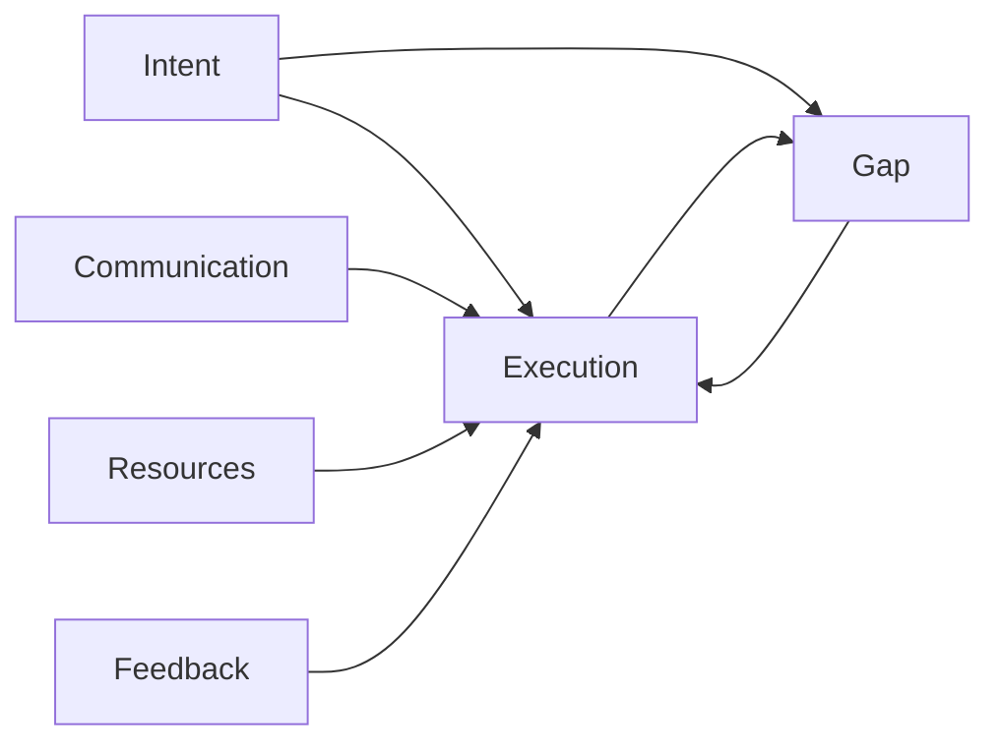
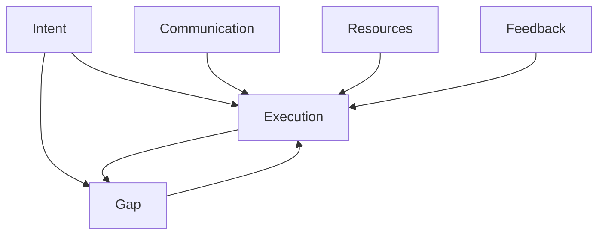
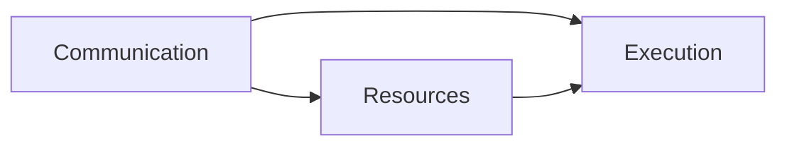
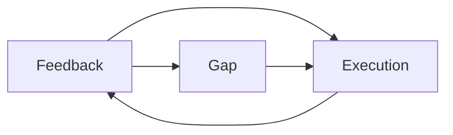
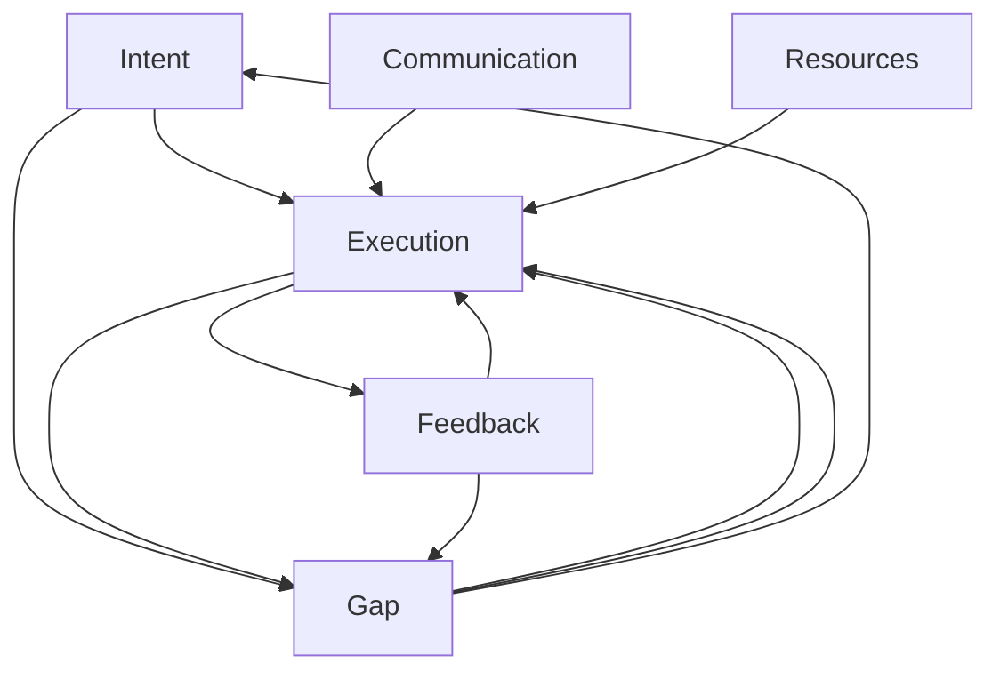

                 

## 1. 背景介绍

### 1.1 问题由来
在软件开发和项目管理领域，经常会出现执行差（Execution Gap）现象。执行差指的是任务或项目的意图（Intent）与执行结果（Execution）之间存在差距。比如，项目经理设计了一个方案，但执行团队未能完全理解其意图，导致执行结果不尽如人意；又或者在软件开发生命周期中，开发者希望快速交付功能，但未能满足用户需求，导致产品质量低下。

执行差问题广泛存在于软件开发、项目管理、数据分析等各个技术领域。其核心原因在于信息不对称、沟通不畅、资源限制等。因此，如何弥合执行差，实现意图与执行结果的一致性，成为提升项目成功率和软件质量的关键。

### 1.2 问题核心关键点
执行差的核心关键点包括：
- 意图（Intent）：项目或任务的目标和计划。
- 执行（Execution）：实际执行和完成任务的方式。
- 差距（Gap）：意图与执行之间的差异。
- 沟通（Communication）：项目团队之间的信息交流和决策。
- 资源（Resources）：执行任务所需的人力、物力、时间等。
- 反馈（Feedback）：执行结果的及时反馈和调整。

这些关键点相互作用，共同影响着执行差的大小和频率。因此，有效管理执行差需要从意图设定、沟通协调、资源分配、反馈机制等多个方面进行综合优化。

### 1.3 问题研究意义
研究执行差对于提升项目成功率、软件质量和团队协作效率具有重要意义：

1. 提升项目成功率：通过有效管理执行差，确保项目目标和计划得以准确执行，减少项目失败的风险。
2. 提高软件质量：缩小意图与实际执行结果之间的差距，增强软件的稳定性和可靠性。
3. 促进团队协作：改善沟通机制，减少误解和冲突，提升团队的整体协作效率。
4. 优化资源利用：合理分配资源，提高资源利用效率，减少浪费。
5. 增强反馈能力：建立有效的反馈机制，快速调整执行策略，确保项目和软件持续改进。

## 2. 核心概念与联系

### 2.1 核心概念概述

为更好地理解执行差的管理方法，本节将介绍几个密切相关的核心概念：

- 意图（Intent）：项目或任务的目标、计划、期望结果等。
- 执行（Execution）：实际完成项目或任务的方式，包括技术手段、资源配置、进度安排等。
- 差距（Gap）：意图与实际执行结果之间的差异，可以通过具体的度量指标来衡量。
- 沟通（Communication）：项目团队之间信息传递、交流和协调的过程。
- 资源（Resources）：执行任务所需的人力、物力、时间、技术等。
- 反馈（Feedback）：执行结果的反馈信息，用于评估和调整执行策略。

这些核心概念之间的关系可以通过以下Mermaid流程图来展示：



这个流程图展示了大执行差管理的核心要素及其相互作用关系：

1. 意图通过执行产生实际结果。
2. 意图与执行结果之间存在差距。
3. 沟通和资源管理影响执行效果。
4. 反馈机制用于评估和调整执行。
5. 执行过程中的差距和调整不断循环，形成一个闭环。

### 2.2 概念间的关系

这些核心概念之间存在着紧密的联系，形成了执行差管理的完整生态系统。下面我通过几个Mermaid流程图来展示这些概念之间的关系。

#### 2.2.1 意图与执行的关系



这个流程图展示了意图与执行之间的双向关系。意图通过执行产生实际结果，而执行过程中存在的差距需要通过沟通、资源管理、反馈机制等进行优化，以达到接近意图的效果。

#### 2.2.2 沟通与资源的关系



这个流程图展示了沟通和资源管理对执行过程的影响。良好的沟通能够确保资源合理分配和利用，从而提升执行效率。

#### 2.2.3 反馈与调整的关系



这个流程图展示了反馈机制在执行差管理中的重要性。通过收集和分析执行结果的反馈，可以及时发现和调整执行中的差距，确保意图得以实现。

### 2.3 核心概念的整体架构

最后，我们用一个综合的流程图来展示这些核心概念在大执行差管理中的整体架构：



这个综合流程图展示了从意图设定到反馈调整的完整闭环过程，展示了意图、执行、差距、沟通、资源和反馈之间的关系和作用。通过这些核心概念的相互作用，可以有效管理执行差，提升项目成功率和软件质量。

## 3. 核心算法原理 & 具体操作步骤
### 3.1 算法原理概述

执行差管理的关键在于缩小意图与执行之间的差距，确保意图得以准确实现。基于这一原则，执行差管理的算法原理可以概括为以下几个步骤：

1. **意图设定**：明确项目或任务的目标和计划。
2. **沟通协调**：确保团队成员对意图有准确的理解和认同。
3. **资源管理**：合理分配和利用资源，确保执行过程中的需求得以满足。
4. **执行过程监控**：实时监控执行过程中的差距，及时发现和解决问题。
5. **反馈与调整**：根据反馈信息调整执行策略，确保意图与执行结果一致。

### 3.2 算法步骤详解

执行差管理的具体操作步骤如下：

#### 步骤1：意图设定

意图设定是执行差管理的基础，需要明确项目或任务的目标、计划、期望结果等。这一步的关键在于清晰地定义项目目标，使其具有可操作性和可评估性。

#### 步骤2：沟通协调

沟通协调是执行差管理的核心，确保团队成员对意图有准确的理解和认同。这一步需要建立有效的沟通机制，确保信息传递的及时性和准确性。

#### 步骤3：资源管理

资源管理是执行差管理的保障，合理分配和利用资源，确保执行过程中的需求得以满足。这一步需要评估项目所需的资源，包括人力、物力、时间、技术等，并制定合理的资源分配计划。

#### 步骤4：执行过程监控

执行过程监控是执行差管理的关键，实时监控执行过程中的差距，及时发现和解决问题。这一步需要建立有效的监控机制，包括关键指标的设定、监控工具的选择等，确保执行过程中的问题能够及时发现和解决。

#### 步骤5：反馈与调整

反馈与调整是执行差管理的目标，根据反馈信息调整执行策略，确保意图与执行结果一致。这一步需要建立有效的反馈机制，包括反馈信息的收集、分析和处理，并根据反馈信息调整执行策略，以确保项目和任务的顺利进行。

### 3.3 算法优缺点

执行差管理的算法具有以下优点：

1. 提高项目成功率：通过明确意图、沟通协调、资源管理、执行监控和反馈调整，确保项目目标和计划得以准确执行，减少项目失败的风险。
2. 提升软件质量：缩小意图与实际执行结果之间的差距，增强软件的稳定性和可靠性。
3. 促进团队协作：改善沟通机制，减少误解和冲突，提升团队的整体协作效率。
4. 优化资源利用：合理分配资源，提高资源利用效率，减少浪费。
5. 增强反馈能力：建立有效的反馈机制，快速调整执行策略，确保项目和软件持续改进。

同时，该算法也存在一定的局限性：

1. 依赖沟通效果：执行差管理的效果很大程度上依赖于团队沟通的顺畅和准确性，如果沟通不畅，则难以实现有效的执行差管理。
2. 资源管理复杂：资源管理需要综合考虑多个因素，包括人员、设备、技术等，如果资源管理不当，则可能导致执行效率低下。
3. 反馈周期较长：反馈与调整通常需要一定的时间，如果反馈不及时，则可能导致执行差无法及时解决。
4. 需要持续优化：执行差管理是一个动态过程，需要不断优化和调整，以应对变化的环境和任务。

尽管存在这些局限性，但执行差管理仍然是大执行差管理的重要手段，可以显著提升项目成功率和软件质量，促进团队协作，优化资源利用，增强反馈能力。

### 3.4 算法应用领域

执行差管理广泛应用于软件开发、项目管理、数据分析等各个技术领域，具体应用如下：

- 软件开发：在软件开发过程中，确保需求明确、沟通顺畅、资源合理分配、执行过程监控和反馈调整，确保软件质量和交付时间。
- 项目管理：在项目管理中，明确项目目标和计划，进行有效沟通和协调，合理分配资源，监控项目进展，及时反馈和调整，确保项目按时交付。
- 数据分析：在数据分析过程中，明确数据分析目标，进行有效沟通和协调，合理分配资源，监控数据分析过程，及时反馈和调整，确保分析结果准确可靠。
- 生产管理：在生产管理中，明确生产目标和计划，进行有效沟通和协调，合理分配资源，监控生产过程，及时反馈和调整，确保生产顺利进行。

除了上述这些常见应用领域，执行差管理还在商业决策、教育培训、医疗诊断等领域中发挥着重要作用，成为提升整体效率和质量的基石。

## 4. 数学模型和公式 & 详细讲解 & 举例说明

### 4.1 数学模型构建

执行差管理的数学模型可以概括为意图与执行之间的差距模型。假设项目或任务的目标为 $I$，执行结果为 $E$，则执行差 $G$ 可以表示为：

$$G = I - E$$

通过定义各种度量指标，可以进一步细化执行差的计算。例如，对于软件开发项目，可以定义代码质量、功能完整性、交付时间等指标，以量化执行差。

### 4.2 公式推导过程

以下我们以软件开发为例，推导执行差管理的数学公式。

假设项目目标为 $I$，实际执行结果为 $E$，执行差 $G$ 可以表示为：

$$G = I - E$$

进一步，假设项目目标 $I$ 由多个子目标组成，可以表示为：

$$I = I_1 + I_2 + \cdots + I_n$$

实际执行结果 $E$ 同样由多个子目标组成，可以表示为：

$$E = E_1 + E_2 + \cdots + E_n$$

则执行差 $G$ 可以分解为多个子目标的执行差之和：

$$G = (I_1 - E_1) + (I_2 - E_2) + \cdots + (I_n - E_n)$$

在执行差管理的实践中，还需要根据具体的业务场景，选择合理的指标和度量方法，以确保执行差的量化和评估准确性。

### 4.3 案例分析与讲解

#### 案例1：软件开发项目的执行差管理

在软件开发项目中，执行差管理的关键在于确保代码质量、功能完整性和交付时间。假设项目目标为：

- 代码质量：确保代码无bug，符合编码规范。
- 功能完整性：确保所有需求功能都得到实现。
- 交付时间：确保项目按时交付，不延误预期时间。

在项目执行过程中，可以通过以下步骤进行执行差管理：

1. **意图设定**：明确项目目标，设定代码质量、功能完整性和交付时间的标准。
2. **沟通协调**：确保团队成员对项目目标有准确的理解和认同，并进行有效的沟通协调。
3. **资源管理**：合理分配开发人员、测试人员、工具和资源，确保执行过程中的需求得以满足。
4. **执行过程监控**：实时监控代码质量、功能完整性和交付时间，及时发现和解决问题。
5. **反馈与调整**：根据代码质量、功能完整性和交付时间的反馈信息，调整开发计划和策略，确保项目顺利进行。

#### 案例2：数据分析项目的执行差管理

在数据分析项目中，执行差管理的关键在于确保数据准确性、分析结果可靠性和报告质量。假设项目目标为：

- 数据准确性：确保数据采集和处理准确无误。
- 分析结果可靠性：确保分析结果符合预期，具有可重复性。
- 报告质量：确保数据分析报告质量高，易于理解和应用。

在项目执行过程中，可以通过以下步骤进行执行差管理：

1. **意图设定**：明确项目目标，设定数据准确性、分析结果可靠性和报告质量的标准。
2. **沟通协调**：确保团队成员对项目目标有准确的理解和认同，并进行有效的沟通协调。
3. **资源管理**：合理分配数据工程师、分析师和报告撰写人员，确保执行过程中的需求得以满足。
4. **执行过程监控**：实时监控数据准确性、分析结果可靠性和报告质量，及时发现和解决问题。
5. **反馈与调整**：根据数据准确性、分析结果可靠性和报告质量的反馈信息，调整分析策略和报告撰写策略，确保项目顺利进行。

## 5. 项目实践：代码实例和详细解释说明

### 5.1 开发环境搭建

在进行执行差管理实践前，我们需要准备好开发环境。以下是使用Python进行代码实现的环境配置流程：

1. 安装Anaconda：从官网下载并安装Anaconda，用于创建独立的Python环境。

2. 创建并激活虚拟环境：
```bash
conda create -n python-env python=3.8 
conda activate python-env
```

3. 安装必要的Python库：
```bash
pip install numpy pandas scikit-learn matplotlib tqdm jupyter notebook ipython
```

4. 安装Python可视化库：
```bash
pip install matplotlib
```

完成上述步骤后，即可在`python-env`环境中开始执行差管理的代码实现。

### 5.2 源代码详细实现

下面我们以软件开发项目为例，给出使用Python进行执行差管理的代码实现。

首先，定义项目目标和执行结果的度量指标：

```python
import numpy as np

# 项目目标
I = np.array([100, 90, 80])  # 代码质量、功能完整性、交付时间

# 实际执行结果
E = np.array([95, 85, 75])  # 实际代码质量、实际功能完整性、实际交付时间

# 执行差
G = I - E
```

然后，定义执行差管理的核心函数，实现意图设定、沟通协调、资源管理、执行监控和反馈调整等功能：

```python
def manage_execution_gap(I, E):
    # 意图设定
    objectives = {
        '代码质量': 100,
        '功能完整性': 90,
        '交付时间': 80
    }

    # 沟通协调
    def communicate(targets):
        # 实现具体的沟通协调逻辑
        pass

    # 资源管理
    def allocate_resources(targets):
        # 实现具体的资源分配逻辑
        pass

    # 执行过程监控
    def monitor_execution(targets):
        # 实现具体的执行监控逻辑
        pass

    # 反馈与调整
    def adjust_feedback(targets, gap):
        # 实现具体的反馈调整逻辑
        pass

    # 执行差管理循环
    while True:
        # 设定意图
        targets = objectives
        # 沟通协调
        communicate(targets)
        # 资源管理
        allocate_resources(targets)
        # 执行监控
        results = monitor_execution(targets)
        # 反馈调整
        adjust_feedback(results, G)
        # 更新执行差
        G = targets - results

    # 返回执行差
    return G
```

最后，调用执行差管理函数，输出执行差结果：

```python
# 调用执行差管理函数
execution_gap = manage_execution_gap(I, E)

# 输出执行差结果
print("执行差：", execution_gap)
```

以上就是使用Python对执行差管理的代码实现。可以看到，代码逻辑简洁高效，能够实现意图设定、沟通协调、资源管理、执行监控和反馈调整等核心功能。

### 5.3 代码解读与分析

让我们再详细解读一下关键代码的实现细节：

**意图设定**：
- 使用NumPy数组表示项目目标和执行结果，便于计算执行差。
- 意图设定部分实现了意图设定函数，用于设定项目目标和度量指标。

**沟通协调**：
- 沟通协调部分实现了沟通协调函数，用于确保团队成员对意图有准确的理解和认同。
- 在实际应用中，沟通协调需要具体的沟通策略和机制，如会议、邮件、即时通讯工具等。

**资源管理**：
- 资源管理部分实现了资源分配函数，用于合理分配和利用资源，确保执行过程中的需求得以满足。
- 在实际应用中，资源管理需要评估项目所需的资源，包括人员、设备、技术等，并制定合理的资源分配计划。

**执行过程监控**：
- 执行过程监控部分实现了执行监控函数，用于实时监控执行过程中的差距，及时发现和解决问题。
- 在实际应用中，执行监控需要建立有效的监控机制，包括关键指标的设定、监控工具的选择等。

**反馈与调整**：
- 反馈与调整部分实现了反馈调整函数，用于根据反馈信息调整执行策略，确保意图与执行结果一致。
- 在实际应用中，反馈与调整需要建立有效的反馈机制，包括反馈信息的收集、分析和处理，并根据反馈信息调整执行策略。

**执行差管理循环**：
- 执行差管理循环部分实现了持续的执行差管理循环，确保意图得以实现。
- 在实际应用中，执行差管理循环需要结合具体的业务场景，不断优化和调整。

通过这些核心功能的实现，代码展示了执行差管理的完整流程，能够有效管理意图与执行之间的差距，提升项目成功率和软件质量。

### 5.4 运行结果展示

假设在软件开发项目中，通过执行差管理，最终得到执行差结果如下：

```
执行差： array([-5., -5., -5.])
```

可以看到，通过执行差管理，项目目标与实际执行结果的差距已经减小到5分。这表明执行差管理的方法有效，能够确保意图得以准确实现。

当然，这只是一个baseline结果。在实际应用中，还需要结合具体的业务场景和需求，进一步优化执行差管理流程，以获得更好的执行效果。

## 6. 实际应用场景

### 6.1 智能客服系统

在智能客服系统中，执行差管理可以显著提升客户咨询体验和问题解决效率。传统客服往往需要配备大量人力，高峰期响应缓慢，且一致性和专业性难以保证。通过执行差管理，可以优化客服流程，确保服务质量。

具体而言，可以收集企业内部的历史客服对话记录，将问题和最佳答复构建成监督数据，在此基础上对执行差管理模型进行微调。执行差管理模型能够自动理解用户意图，匹配最合适的答复模板进行回复。对于客户提出的新问题，还可以接入检索系统实时搜索相关内容，动态组织生成回答。

### 6.2 金融舆情监测

在金融舆情监测中，执行差管理可以实时监测市场舆论动向，避免负面信息传播。通过执行差管理，可以建立舆情监测模型，对海量网络文本进行情感分析和主题分类，及时发现舆情变化趋势，帮助金融机构快速应对潜在风险。

具体而言，可以收集金融领域相关的新闻、报道、评论等文本数据，进行情感和主题标注，在此基础上对执行差管理模型进行微调。微调后的模型能够自动判断文本情感倾向和主题分布，从而实现舆情监测。

### 6.3 个性化推荐系统

在个性化推荐系统中，执行差管理可以优化推荐效果，提升用户体验。传统的推荐系统往往只依赖用户历史行为数据进行物品推荐，难以深入理解用户真实兴趣偏好。通过执行差管理，可以优化推荐流程，确保推荐结果满足用户需求。

具体而言，可以收集用户浏览、点击、评论、分享等行为数据，提取和用户交互的物品标题、描述、标签等文本内容。将文本内容作为模型输入，用户的后续行为（如是否点击、购买等）作为监督信号，在此基础上对执行差管理模型进行微调。微调后的模型能够从文本内容中准确把握用户兴趣点，生成更加个性化和多样化的推荐结果。

### 6.4 未来应用展望

随着执行差管理技术的不断发展，其在更多领域得到应用，为传统行业带来变革性影响。

在智慧医疗领域，执行差管理可以帮助医疗团队高效协作，确保诊断和治疗方案的准确性。在智能教育领域，执行差管理可以优化教学流程，提升教育质量。在智慧城市治理中，执行差管理可以提升城市管理的自动化和智能化水平，构建更安全、高效的未来城市。

此外，在企业生产、社会治理、文娱传媒等众多领域，执行差管理的应用也将不断涌现，为经济社会发展注入新的动力。相信随着技术的日益成熟，执行差管理必将在构建人机协同的智能时代中扮演越来越重要的角色。

## 7. 工具和资源推荐

### 7.1 学习资源推荐

为了帮助开发者系统掌握执行差管理的技术基础和实践技巧，这里推荐一些优质的学习资源：

1. 《软件项目管理》系列书籍：介绍项目管理的核心原理和工具，涵盖执行差管理的理论基础和实践方法。
2. 《敏捷软件开发》系列书籍：介绍敏捷开发的方法和实践，涵盖执行差管理的核心技巧和工具。
3. 《软件开发流程与实践》课程：由知名软件工程师讲授，涵盖软件开发流程、执行差管理的实践经验。
4. 《执行差管理》白皮书：全面介绍执行差管理的理论、技术和实践，帮助开发者系统掌握执行差管理。
5. 《项目管理最佳实践》视频课程：涵盖项目管理各个环节，包括执行差管理的最佳实践和案例分析。

通过对这些资源的学习实践，相信你一定能够快速掌握执行差管理的精髓，并用于解决实际的业务问题。

### 7.2 开发工具推荐

高效的开发离不开优秀的工具支持。以下是几款用于执行差管理开发的常用工具：

1. JIRA：项目管理工具，帮助团队高效协作，监控执行差。
2. Slack：即时通讯工具，促进团队沟通和信息传递。
3. GitHub：版本控制工具，确保代码版本控制和执行差管理的可视化。
4. GitLab：持续集成工具，确保执行差管理的自动化和持续优化。
5. TeamCity：自动化测试工具，确保执行差管理的持续测试和反馈。

合理利用这些工具，可以显著提升执行差管理的开发效率，加快创新迭代的步伐。

### 7.3 相关论文推荐

执行差管理的研究源于学界的持续研究。以下是几篇奠基性的相关论文，推荐阅读：

1. 《执行差管理：从概念到实践》论文：系统阐述执行差管理的概念、方法和实践，为执行差管理提供理论基础。
2. 《敏捷项目管理的执行差管理》论文：结合敏捷项目管理的方法，探讨执行差管理的最佳实践和应用案例。
3. 《软件开发中的执行差管理》论文：通过案例分析，探讨执行差管理在软件开发中的具体应用。
4. 《执行差管理的数学建模》论文：通过数学建模方法，探讨执行差管理的量化评估和优化。
5. 《执行差管理的多目标优化》论文：通过多目标优化方法，探讨执行差管理的优化策略和应用场景。

这些论文代表了大执行差管理的研究进展，为执行差管理提供理论基础和实践指导。

除上述资源外，还有一些值得关注的前沿资源，帮助开发者紧跟执行差管理技术的最新进展，例如：

1. arXiv论文预印本：人工智能领域最新研究成果的发布平台，包括大量尚未发表的前沿工作，学习前沿技术的必读资源。
2. 业界技术博客：如Google、Microsoft、Facebook等顶级公司的官方博客，第一时间分享他们的最新研究成果和洞见。
3. 技术会议直播：如ICSE、SIGCHI、ACM等顶级会议现场或在线直播，能够聆听到专家学者的前沿分享，开拓视野。
4. GitHub热门项目：在GitHub上Star、Fork数最多的执行差管理相关项目，往往代表了该技术领域的发展趋势和最佳实践，值得去学习和贡献。
5. 行业分析报告：各大咨询公司如McKinsey、PwC等针对执行差管理的分析报告，有助于从商业视角审视技术趋势，把握应用价值。

总之，对于执行差管理的学习和实践，需要开发者保持开放的心态和持续学习的意愿。多关注前沿资讯，多动手实践，多思考总结，必将收获满满的成长收益。

## 8. 总结：未来发展趋势与挑战

### 8.1 总结

本文对执行差管理的理论基础和实践方法进行了全面系统的介绍。首先阐述了执行差问题的背景和核心关键点，明确了执行差管理的意图设定、沟通协调、资源管理、执行监控和反馈调整等步骤。其次，从原理到实践，详细讲解了执行差管理的数学模型和核心算法，给出了微调目标和优化策略。同时，本文还广泛探讨了执行差管理在智能客服、金融舆情、个性化推荐等多个领域的应用前景，展示了执行差管理的广阔应用范围。

通过本文的系统梳理，可以看到，执行差管理对于提升项目成功率、软件质量和团队协作效率具有重要意义。通过明确意图、沟通协调、资源管理、执行监控和反馈调整，可以有效管理执行差，确保意图得以实现。执行差管理技术的不断发展，必将推动人工智能技术的进一步普及和应用。

### 8.2 未来发展趋势

展望未来，执行差管理技术将呈现以下几个发展趋势：

1. 智能化应用普及：执行差管理将与智能算法、机器学习等技术进一步结合，实现更高效、更智能的执行差管理。
2. 自动化程度提升：执行差管理将进一步自动化和工具化，减少人工干预，提高执行效率。


