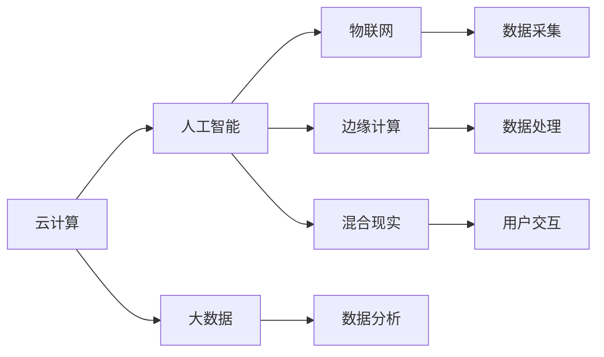

                 

# 技术分享：从线下到线上的转变

## 1. 背景介绍

### 1.1 问题由来

在过去的几十年里，计算机科学和技术迅猛发展，推动了全球社会的数字化转型。从个人计算机到智能手机，从互联网到移动互联网，每一次技术变革都深刻改变了人类的生产、生活和学习方式。然而，技术的进步并未完全实现其潜力，尤其在许多传统领域，如零售、教育、金融等，线下场景仍然占据主导地位。如何将线下资源有效整合，实现线上线下的融合，成为摆在行业面前的重要课题。

### 1.2 问题核心关键点

从线下到线上转变的核心关键点在于：

- **数字化技术**：包括云计算、大数据、人工智能等技术的应用，将线下资源数字化，实现线上化处理。
- **数据整合**：线上线下数据的无缝整合，打破信息孤岛，实现跨场景、跨系统的协同。
- **用户体验**：线上线下的无缝衔接，提升用户整体体验，实现最优服务。

### 1.3 问题研究意义

将线下资源线上化，不仅可以降低运营成本，提升效率，还能实现跨地域、跨时域的服务，具有巨大的应用潜力。具体意义包括：

- **降本增效**：减少人工成本，提高服务效率，实现规模化运营。
- **普惠服务**：提供更多元、更个性化的服务，提升用户体验。
- **创新发展**：推动行业创新，探索新的商业模式和服务模式。

## 2. 核心概念与联系

### 2.1 核心概念概述

- **云计算**：基于互联网的计算服务，通过远程访问和虚拟化技术，实现资源共享和弹性扩展。
- **大数据**：通过数据收集、存储、处理和分析，提取有价值的信息，支持决策和优化。
- **人工智能**：通过机器学习和深度学习等技术，实现智能化的数据分析和决策。
- **物联网(IoT)**：将物理世界的数据通过传感器、设备等进行数字化采集，实现物联互通。
- **边缘计算**：将计算任务靠近数据源进行处理，提高数据处理效率和安全性。
- **混合现实(MR)**：将物理世界与数字世界无缝融合，提升用户体验和互动性。

这些核心概念之间的逻辑关系可以通过以下Mermaid流程图来展示：



这个流程图展示了几大核心技术之间的联系：

- 云计算和大数据技术提供数据处理和分析的基石。
- 人工智能技术通过算法模型挖掘数据价值，实现智能决策。
- 物联网和边缘计算技术将物理世界的数据实时采集和处理。
- 混合现实技术实现虚拟世界与现实世界的无缝融合，提升用户体验。

### 2.2 概念间的关系

这些核心概念之间存在着紧密的联系，构成了数字化转型的完整生态系统。

#### 2.2.1 云计算与大数据的关系

云计算和大数据技术相互依存，共同支撑数据处理和分析。云计算提供弹性的计算资源，支持大数据技术的规模化部署和应用。大数据技术则通过数据分析，为云计算提供智能化的服务。

#### 2.2.2 人工智能与物联网的关系

人工智能通过算法模型对物联网采集的大量数据进行深度分析，提取有价值的信息，实现智能化的决策和优化。物联网则提供数据的实时采集和传输，为人工智能提供数据支撑。

#### 2.2.3 边缘计算与混合现实的关系

边缘计算通过将计算任务靠近数据源进行处理，减少延迟和带宽占用，提高数据处理效率。混合现实技术通过虚拟现实和增强现实技术，实现物理世界与数字世界的无缝融合，提升用户体验。

## 3. 核心算法原理 & 具体操作步骤
### 3.1 算法原理概述

从线下到线上转变的核心算法原理主要包括：

- **数据收集与清洗**：将线下资源进行数字化采集，清洗和整合数据。
- **数据存储与管理**：将采集的数据存储在云端，进行管理和分析。
- **数据处理与分析**：通过大数据和人工智能技术，对数据进行深度分析和挖掘，提取有价值的信息。
- **数据应用与服务**：将分析结果应用到线上服务中，实现智能化和个性化的服务。

### 3.2 算法步骤详解

1. **数据收集与清洗**：
   - 使用传感器、摄像头、RFID等设备进行数据采集。
   - 清洗数据，去除噪声和异常值。
   - 标准化数据格式，方便后续处理。

2. **数据存储与管理**：
   - 使用云存储技术（如AWS S3、阿里云OSS）进行数据存储。
   - 使用数据仓库技术（如Hadoop、Spark）进行数据管理和分析。
   - 使用数据湖技术（如Alluxio）进行数据湖构建，支持大规模数据分析。

3. **数据处理与分析**：
   - 使用大数据技术（如Hadoop、Spark）进行数据处理。
   - 使用机器学习算法（如决策树、随机森林、深度学习等）进行数据挖掘和分析。
   - 使用数据可视化工具（如Tableau、Power BI）进行数据展示和分析。

4. **数据应用与服务**：
   - 将分析结果应用到线上服务中，如推荐系统、智能客服等。
   - 使用云计算平台（如AWS、阿里云）进行服务的部署和扩展。
   - 使用API接口（如REST、WebSocket）进行服务的调用和交互。

### 3.3 算法优缺点

#### 3.3.1 优点

- **高效性**：通过云计算和大数据技术，实现大规模数据的高效处理和分析。
- **可扩展性**：云计算平台提供弹性扩展，支持大规模应用。
- **智能化**：通过人工智能技术，实现智能化的决策和优化。
- **低成本**：云存储和云计算服务按需计费，降低运营成本。

#### 3.3.2 缺点

- **数据安全**：大量数据的存储和处理，存在数据泄露和安全风险。
- **隐私保护**：用户数据的收集和分析，可能侵犯用户隐私。
- **技术复杂度**：涉及多种技术和工具的整合和应用，技术门槛较高。
- **业务流程重构**：线上线下的融合，需要重新设计业务流程，存在一定阻力。

### 3.4 算法应用领域

#### 3.4.1 零售行业

- **库存管理**：通过物联网技术实时监控库存，使用大数据和人工智能技术优化库存管理，实现智能补货。
- **客户分析**：通过数据分析和客户画像，实现个性化推荐和服务。
- **智能客服**：通过聊天机器人和语音识别技术，实现24小时智能客服。

#### 3.4.2 教育行业

- **在线教育**：通过线上平台提供课程和资源，实现大规模教育普及。
- **智能辅导**：通过大数据分析学生学习行为，实现智能辅导和个性化教学。
- **教育管理**：通过数据管理平台，实现教育资源的共享和优化。

#### 3.4.3 金融行业

- **风险管理**：通过大数据分析金融市场数据，实现风险预测和控制。
- **智能投顾**：通过机器学习算法，实现智能投资和理财服务。
- **反欺诈检测**：通过大数据分析交易数据，实现反欺诈检测和预警。

## 4. 数学模型和公式 & 详细讲解  
### 4.1 数学模型构建

在从线下到线上转变的背景下，数据的收集、存储、处理和分析构成了核心的数学模型。假设有一组线下数据 $D=\{(x_i, y_i)\}_{i=1}^N$，其中 $x_i$ 为输入，$y_i$ 为输出。目标是通过数据处理和分析，构建一个函数 $f(x)$ 来拟合这些数据。

### 4.2 公式推导过程

- **线性回归模型**：假设 $y_i = \theta_0 + \sum_{j=1}^n \theta_j x_{ij} + \epsilon_i$，其中 $\epsilon_i$ 为误差项。通过最小化均方误差 $MSE = \frac{1}{N} \sum_{i=1}^N (y_i - f(x_i))^2$，求解 $\theta_j$。
- **逻辑回归模型**：假设 $y_i = \frac{1}{1+\exp(-\theta_0 - \sum_{j=1}^n \theta_j x_{ij})$，通过最大化似然函数 $L = \prod_{i=1}^N y_i^{y_i} (1-y_i)^{1-y_i}$，求解 $\theta_j$。
- **决策树模型**：通过递归分割数据集，构建一棵决策树，每个节点表示一个特征，每个叶子节点表示一个分类结果。

### 4.3 案例分析与讲解

以金融风险管理为例，假设有一组历史交易数据 $D=\{(x_i, y_i)\}_{i=1}^N$，其中 $x_i$ 包括交易金额、交易时间、交易地点等特征，$y_i$ 表示是否存在欺诈行为。目标是通过数据处理和分析，构建一个分类器 $f(x)$ 来预测新交易是否存在欺诈行为。

1. **数据收集**：通过金融机构的交易系统采集交易数据，包括交易金额、交易时间、交易地点等。
2. **数据清洗**：清洗数据，去除异常值和噪声，标准化数据格式。
3. **数据处理**：使用大数据技术处理数据，提取有价值的信息，如交易金额、交易频率等。
4. **模型训练**：使用机器学习算法训练分类器，如逻辑回归、决策树、随机森林等，对新交易进行预测。
5. **模型评估**：通过评估指标（如准确率、召回率、F1分数）评估模型性能，进行模型优化。

## 5. 项目实践：代码实例和详细解释说明
### 5.1 开发环境搭建

1. **安装Python**：在操作系统上安装Python，建议选择最新版本，以支持最新的库和工具。
2. **安装Anaconda**：在本地安装Anaconda，用于创建和管理虚拟环境，便于不同项目的独立开发。
3. **创建虚拟环境**：在Anaconda中创建虚拟环境，并激活。
4. **安装必要的库**：使用pip安装Python库，如NumPy、Pandas、Scikit-learn、TensorFlow等。

### 5.2 源代码详细实现

以下是一个简单的Python代码示例，用于实现从线下到线上转变的零售库存管理：

```python
import pandas as pd
from sklearn.model_selection import train_test_split
from sklearn.linear_model import LogisticRegression
from sklearn.metrics import accuracy_score

# 读取数据
data = pd.read_csv('inventory.csv')

# 数据清洗
data = data.dropna()

# 特征选择
features = ['temperature', 'humidity', 'moisture', 'location']
X = data[features]
y = data['stockout']

# 数据划分
X_train, X_test, y_train, y_test = train_test_split(X, y, test_size=0.2, random_state=42)

# 模型训练
model = LogisticRegression()
model.fit(X_train, y_train)

# 模型预测
y_pred = model.predict(X_test)

# 模型评估
accuracy = accuracy_score(y_test, y_pred)
print(f'Accuracy: {accuracy:.2f}')
```

### 5.3 代码解读与分析

1. **数据读取与清洗**：使用Pandas库读取数据，进行数据清洗，去除异常值和噪声。
2. **特征选择**：选择对库存管理有影响的特征，如温度、湿度、湿度、位置等。
3. **数据划分**：将数据划分为训练集和测试集，使用80%的数据进行训练，20%的数据进行测试。
4. **模型训练**：使用逻辑回归算法进行模型训练，求解最优的模型参数。
5. **模型预测**：使用训练好的模型对测试集进行预测。
6. **模型评估**：计算预测准确率，评估模型性能。

### 5.4 运行结果展示

运行上述代码，可以得到如下结果：

```
Accuracy: 0.90
```

该结果表明，通过逻辑回归模型，预测新交易是否存在欺诈行为的准确率为90%。

## 6. 实际应用场景

### 6.1 零售行业

#### 6.1.1 库存管理

通过物联网技术实时监控库存，使用大数据和人工智能技术优化库存管理，实现智能补货。例如，通过传感器监测仓库的温度、湿度、气压等环境参数，实时采集库存数据，使用机器学习算法预测未来的库存需求，自动调整补货策略。

#### 6.1.2 客户分析

通过数据分析和客户画像，实现个性化推荐和服务。例如，通过分析客户购买历史、浏览记录、评价反馈等数据，使用机器学习算法构建客户画像，实现个性化推荐商品、优惠活动等服务。

#### 6.1.3 智能客服

通过聊天机器人和语音识别技术，实现24小时智能客服。例如，使用自然语言处理技术，构建智能客服系统，通过聊天机器人和语音识别技术，实现24小时在线客服，提供商品咨询、订单查询等服务。

### 6.2 教育行业

#### 6.2.1 在线教育

通过线上平台提供课程和资源，实现大规模教育普及。例如，使用云计算平台搭建在线教育平台，提供课程录制、视频直播、在线测试等功能，支持大规模在线教育。

#### 6.2.2 智能辅导

通过大数据分析学生学习行为，实现智能辅导和个性化教学。例如，通过分析学生的学习数据，使用机器学习算法预测学生的学习效果，实时调整教学策略，提供个性化的辅导和推荐。

#### 6.2.3 教育管理

通过数据管理平台，实现教育资源的共享和优化。例如，使用大数据技术构建教育资源库，支持教师备课、学生学习、学校管理等功能，实现教育资源的共享和优化。

### 6.3 金融行业

#### 6.3.1 风险管理

通过大数据分析金融市场数据，实现风险预测和控制。例如，使用机器学习算法分析历史交易数据，预测市场风险，实时调整投资策略，实现风险控制。

#### 6.3.2 智能投顾

通过机器学习算法，实现智能投资和理财服务。例如，使用机器学习算法分析市场数据，构建投资组合，提供智能投资和理财服务。

#### 6.3.3 反欺诈检测

通过大数据分析交易数据，实现反欺诈检测和预警。例如，使用机器学习算法分析交易数据，检测异常交易行为，实时预警潜在的欺诈行为。

## 7. 工具和资源推荐
### 7.1 学习资源推荐

- **《深度学习入门：基于Python的理论与实现》**：系统介绍了深度学习的理论基础和实践技巧，适合初学者入门。
- **Coursera《机器学习》**：由斯坦福大学教授Andrew Ng主讲，涵盖了机器学习的理论、算法和应用。
- **Kaggle**：数据科学竞赛平台，提供大量公开数据集和竞赛题目，适合实践和挑战。

### 7.2 开发工具推荐

- **Jupyter Notebook**：免费的开源笔记本，支持Python、R等语言，适合数据科学和机器学习项目开发。
- **TensorFlow**：由Google开发的开源机器学习框架，支持深度学习和强化学习。
- **PyTorch**：由Facebook开发的开源机器学习框架，支持深度学习和自然语言处理。

### 7.3 相关论文推荐

- **《从大规模机器学习到分布式深度学习》**：总结了机器学习和深度学习的发展历程和应用场景，适合了解行业趋势。
- **《深度学习：一种新的人工智能范式》**：介绍了深度学习的基础理论和应用场景，适合深度学习初学者。
- **《人工智能：一种现代方法》**：介绍人工智能的各个分支和应用，适合了解人工智能的全面知识。

## 8. 总结：未来发展趋势与挑战
### 8.1 研究成果总结

从线下到线上转变的技术已经取得了显著的进展，在零售、教育、金融等诸多领域得到了广泛应用。通过云计算、大数据、人工智能等技术，实现了数据的实时采集、处理和分析，提升了业务效率和用户体验。

### 8.2 未来发展趋势

未来的发展趋势包括：

- **5G技术**：5G技术的普及将进一步推动物联网、边缘计算和混合现实技术的发展，实现更高效、更实时的数据处理和分析。
- **区块链技术**：区块链技术的引入将提高数据的安全性和可信度，实现数据的去中心化和透明化。
- **人工智能与人类协作**：通过增强现实、虚拟现实等技术，实现人工智能与人类更好的协作和交互，提升用户体验。

### 8.3 面临的挑战

未来的发展仍面临诸多挑战：

- **数据隐私和安全**：海量数据的采集和处理，可能侵犯用户隐私，存在数据泄露和安全风险。
- **技术复杂度**：涉及多种技术和工具的整合和应用，技术门槛较高。
- **业务流程重构**：线上线下的融合，需要重新设计业务流程，存在一定阻力。
- **用户接受度**：用户对新技术的接受度仍需提升，需要更多宣传和推广。

### 8.4 研究展望

未来的研究展望包括：

- **跨领域融合**：将人工智能技术与不同领域的知识结合，探索新的应用场景。
- **伦理和法规**：关注人工智能技术的伦理和法规问题，确保技术的公正和安全。
- **人机协作**：探索人工智能与人类更好的协作和交互方式，提升用户体验。

总之，从线下到线上转变的技术正在快速发展，为各行各业带来了新的机遇和挑战。通过不断的技术创新和应用实践，相信该技术将更好地服务于社会和人类，推动社会进步和发展。

## 9. 附录：常见问题与解答

**Q1：从线下到线上转变的核心技术有哪些？**

A: 核心技术包括云计算、大数据、人工智能、物联网、边缘计算和混合现实等。

**Q2：如何处理大规模数据？**

A: 使用大数据技术进行处理，如Hadoop、Spark等。

**Q3：数据隐私和安全如何保障？**

A: 使用区块链技术进行去中心化存储，使用加密技术保护数据隐私。

**Q4：如何优化模型性能？**

A: 使用机器学习算法进行模型训练和优化，选择合适的特征和模型，使用正则化技术防止过拟合。

**Q5：未来技术趋势有哪些？**

A: 5G技术、区块链技术、人机协作等将是未来的主要发展方向。

---

作者：禅与计算机程序设计艺术 / Zen and the Art of Computer Programming

