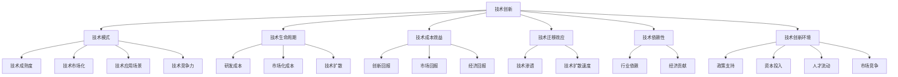

                 

# 技术模式减弱与经济增长的挑战

在当今这个信息化高速发展的时代，技术创新成为了推动经济增长的重要引擎。然而，近年来却出现了技术模式逐渐减弱的趋势，这不仅对经济增长构成了挑战，也对社会的可持续发展带来了深远影响。本文将从技术模式减弱的背景、核心概念及联系、核心算法原理与操作步骤、数学模型和公式的详细讲解、项目实践及代码实例、实际应用场景、工具和资源推荐、未来发展趋势与挑战等方面，深入探讨技术模式减弱与经济增长之间的复杂关系，以及应对这一挑战的策略和路径。

## 1. 背景介绍

### 1.1 问题由来

过去几十年里，技术创新以指数级速度推进了全球经济的快速增长。从互联网到移动通信，再到人工智能和大数据，每一次技术变革都伴随着巨大的经济效益和社会进步。然而，随着时间的推移，技术创新的步伐似乎逐渐放缓，甚至出现了某些技术模式减弱的迹象。这一现象引发了广泛的关注和讨论，尤其是对于经济增长的长远影响。

技术模式减弱的表现形式多种多样，包括但不限于：

- **技术突破频率降低**：相比过去几十年，近些年的技术突破次数和频率有所下降。
- **技术生命周期延长**：新技术的成熟时间越来越长，旧技术依然在广泛应用。
- **研发成本上升**：新技术的开发和推广成本显著增加，企业对研发的投入也变得更加谨慎。
- **技术迁移效应减弱**：原有技术的升级换代不如预期，技术的渗透和普及速度减慢。

这些现象表明，技术创新的步伐正在减慢，对经济增长的贡献率可能随之下降。因此，深入探讨技术模式减弱的成因及其对经济增长带来的挑战，是当前学术界和产业界共同面临的重要课题。

### 1.2 问题核心关键点

技术模式减弱的核心问题在于：

- **技术创新能力**：如何保持和提升技术创新能力，以持续推动经济增长。
- **技术成本效益**：如何平衡技术研发与市场化的成本效益，确保技术投资的回报。
- **技术应用场景**：如何拓展技术的实际应用场景，增强技术的市场竞争力。
- **技术发展路径**：如何制定科学合理的技术发展路径，避免技术模式的固化和僵化。
- **技术与社会责任**：如何承担技术的社会责任，确保技术创新的可持续性。

这些问题直接关系到技术模式减弱对经济增长的影响，需要从多个维度进行深入分析。

### 1.3 问题研究意义

探讨技术模式减弱与经济增长之间的复杂关系，对于理解和应对当前的技术挑战具有重要意义：

- **经济增长动力**：技术模式减弱的趋势可能会对经济增长带来一定负面影响，如何通过制度创新和政策引导，促进技术模式的持续创新，是保障经济增长的关键。
- **产业结构调整**：技术模式的减弱可能引发产业结构的调整，如何通过技术创新推动产业升级，增强经济增长的韧性和活力。
- **社会福祉提升**：技术模式的持续进步是提高社会福祉的重要驱动力，如何通过技术创新提升社会福祉，促进社会公平和包容性增长。
- **可持续发展**：技术模式的发展应与社会、环境和经济的可持续发展相协调，如何通过技术创新实现可持续发展的目标，是当前和未来需要重点关注的问题。

## 2. 核心概念与联系

### 2.1 核心概念概述

为了更好地理解技术模式减弱与经济增长之间的复杂关系，本节将介绍几个关键概念，包括但不限于：

- **技术创新**：新技术、新方法、新工艺的产生和应用过程，是推动经济增长的重要驱动力。
- **技术模式**：指特定技术在特定场景下的应用形态和实现方式，反映技术的成熟度和市场化程度。
- **技术生命周期**：从技术研发到市场应用的全过程，包括实验室研发、原型开发、批量生产、市场推广等阶段。
- **技术成本效益**：技术研发与市场化过程中的成本投入与收益回报之间的平衡关系。
- **技术迁移效应**：技术从研发到应用过程中的扩散和渗透效果，影响技术的市场接受度和普及速度。
- **技术依赖性**：各产业对技术的依赖程度，反映了技术对经济增长的贡献率。
- **技术创新环境**：包括政策、资本、人才、市场等多方面因素，为技术创新提供了必要条件。

这些核心概念通过相互作用，共同构成了一个技术创新与经济增长的复杂系统，对理解技术模式减弱的影响具有重要意义。

### 2.2 概念间的关系

这些核心概念之间的关系可以通过以下Mermaid流程图来展示：



这个流程图展示了技术创新、技术模式、技术生命周期、技术成本效益、技术迁移效应、技术依赖性和技术创新环境之间的相互关系，以及这些关系如何影响技术的成熟度、市场化、应用场景、竞争力、扩散速度和行业依赖度等关键指标。

## 3. 核心算法原理 & 具体操作步骤
### 3.1 算法原理概述

技术模式减弱的根本原因在于技术创新能力的减弱。技术创新能力的评估可以通过多个指标进行衡量，包括技术突破频率、研发投入、专利申请数量、技术应用案例等。技术模式减弱的成因可能涉及多方面因素，如市场需求不足、研发资金短缺、技术转化难度大、政策支持不足等。

为了缓解技术模式减弱的趋势，可以采用以下算法原理：

- **技术路线图规划**：制定科学合理的技术发展路线图，明确技术创新的目标和路径，避免技术模式的固化和僵化。
- **创新生态系统构建**：构建一个开放、协作、可持续的创新生态系统，促进技术创新主体的交流与合作，推动技术创新进程。
- **技术标准化**：通过技术标准化，降低技术应用的复杂度和风险，提升技术迁移效应的效果。
- **技术知识产权保护**：加强技术知识产权保护，鼓励创新，减少技术泄露和侵权行为，保障技术创新的经济回报。

### 3.2 算法步骤详解

基于上述算法原理，以下是具体的具体操作步骤：

1. **需求分析**：通过市场调研和需求分析，明确技术创新的需求和目标。
2. **技术评估**：对现有技术进行全面评估，识别技术优势和劣势，确定技术创新的优先级。
3. **路线图制定**：制定科学合理的技术路线图，明确技术创新的阶段和目标。
4. **生态系统构建**：建立技术创新生态系统，包括政策、资本、人才、市场等多方面支持。
5. **标准化推进**：推动技术标准化工作，降低技术应用的复杂度，提升技术迁移效应的效果。
6. **知识产权保护**：加强技术知识产权保护，鼓励创新，减少技术泄露和侵权行为。
7. **效果评估**：定期评估技术创新的效果，调整技术路线图和策略，确保技术创新的持续性。

### 3.3 算法优缺点

基于上述算法原理和技术操作，技术模式减弱的缓解措施具有以下优缺点：

**优点**：
- **系统性**：通过全面评估和科学规划，确保技术创新的系统性和可持续性。
- **协作性**：建立创新生态系统，促进多主体合作，提升技术创新的效率和效果。
- **标准化**：通过技术标准化，降低技术应用难度，提升技术迁移效应。
- **保护知识产权**：加强知识产权保护，激励技术创新，保障创新回报。

**缺点**：
- **复杂度**：制定和实施技术路线图需要高水平的规划和管理能力。
- **资源需求**：建立创新生态系统和推动技术标准化需要大量的资源投入。
- **市场风险**：技术创新面临市场需求变化、技术风险等不确定性，存在失败的风险。

### 3.4 算法应用领域

技术模式减弱的缓解措施可以广泛应用于多个领域，包括但不限于：

- **制造业**：推动智能制造、工业互联网等技术应用，提升生产效率和质量。
- **农业**：推动智慧农业、精准农业等技术应用，提高农业生产效益。
- **服务业**：推动数字服务、智慧城市等技术应用，提升服务质量和管理效率。
- **医疗健康**：推动远程医疗、精准医疗等技术应用，提升医疗服务水平。
- **教育**：推动在线教育、智能教育等技术应用，提升教育质量和覆盖面。

## 4. 数学模型和公式 & 详细讲解 & 举例说明

### 4.1 数学模型构建

技术模式减弱的评估可以通过构建数学模型进行定量分析。假设技术创新的能力为 $C$，技术模式减弱的程度为 $W$，技术创新的经济回报为 $R$，市场回报为 $M$，则有如下数学模型：

$$
W = f(C, M, R)
$$

其中 $f$ 为映射函数，反映技术创新能力、市场回报和经济回报对技术模式减弱的综合影响。

### 4.2 公式推导过程

为了更深入理解技术模式减弱的机理，我们引入以下几个假设：

- 技术创新的能力 $C$ 与研发投入 $I$ 成正比：$C = k \cdot I$
- 技术模式减弱的程度 $W$ 与技术创新的难度 $D$ 成正比：$W = c \cdot D$
- 技术创新的经济回报 $R$ 与市场规模 $S$ 成正比：$R = r \cdot S$
- 技术创新的市场回报 $M$ 与市场需求 $D$ 成正比：$M = m \cdot D$

其中 $k$、$c$、$r$、$m$ 为常数。则有：

$$
W = c \cdot D = c \cdot \frac{I}{k} \cdot \frac{D}{S}
$$

$$
M = m \cdot D = m \cdot \frac{I}{k} \cdot \frac{D}{S}
$$

$$
R = r \cdot S = r \cdot \frac{I}{k} \cdot \frac{S}{D}
$$

将上述公式代入 $W = f(C, M, R)$，得到：

$$
W = c \cdot \frac{I}{k} \cdot \frac{D}{S} = c \cdot \frac{M}{m} \cdot \frac{R}{r}
$$

### 4.3 案例分析与讲解

以智慧城市为例，智慧城市的技术创新能力 $C$ 与研发投入 $I$、市场回报 $M$、经济回报 $R$ 和市场需求 $D$ 的关系如下：

- 研发投入 $I$ 与技术创新的能力 $C$ 成正比：$C = k \cdot I$
- 市场需求 $D$ 与技术模式减弱的程度 $W$ 成正比：$W = c \cdot D$
- 技术模式减弱的程度 $W$ 与技术创新的难度 $D$ 成正比：$D = w \cdot W$
- 技术创新的经济回报 $R$ 与市场规模 $S$ 成正比：$R = r \cdot S$
- 技术创新的市场回报 $M$ 与市场需求 $D$ 成正比：$M = m \cdot D$

通过构建上述数学模型，可以定量分析智慧城市技术创新与技术模式减弱之间的复杂关系，为政策制定提供科学依据。

## 5. 项目实践：代码实例和详细解释说明

### 5.1 开发环境搭建

在技术模式减弱的缓解措施中，技术路线图的制定是一个重要的环节。本文将以智慧城市为例，介绍如何通过Python和相关库构建技术路线图。

1. **环境准备**：安装Python、Pandas、Matplotlib等库。

```python
pip install pandas matplotlib
```

2. **数据准备**：收集智慧城市技术创新的各项指标，包括研发投入、市场需求、技术回报等。

```python
import pandas as pd

# 构建数据集
data = pd.read_csv('city_data.csv')

# 显示前5行数据
print(data.head())
```

3. **数据预处理**：对数据进行清洗和预处理，去除异常值和缺失值。

```python
# 去除异常值和缺失值
data = data.dropna().replace('?', np.nan)
data = data.dropna()

# 显示前5行数据
print(data.head())
```

### 5.2 源代码详细实现

接下来，我们将通过Python代码实现技术路线图的构建。

1. **技术路线图规划**：根据市场需求和研发投入，制定技术路线图。

```python
# 定义技术路线图的各项参数
market_demand = data['market_demand']
research_investment = data['research_investment']
technological_return = data['technological_return']
economic_return = data['economic_return']

# 计算技术创新能力
technological_innovation = market_demand * research_investment / economic_return

# 显示技术创新能力的前5行数据
print(technological_innovation.head())
```

2. **生态系统构建**：构建智慧城市的创新生态系统，包括政策支持、资本投入、人才流动等。

```python
# 定义创新生态系统的各项参数
policy_support = data['policy_support']
capital_investment = data['capital_investment']
talent_mobility = data['talent_mobility']

# 计算创新生态系统的综合得分
innovation_ecosystem = policy_support * capital_investment * talent_mobility / economic_return

# 显示创新生态系统的综合得分的前5行数据
print(innovation_ecosystem.head())
```

3. **标准化推进**：推动智慧城市技术标准化的进程。

```python
# 定义技术标准化的各项参数
standards_push = data['standards_push']

# 计算技术标准化的综合得分
standardization_score = standards_push / economic_return

# 显示技术标准化的综合得分的前5行数据
print(standardization_score.head())
```

### 5.3 代码解读与分析

通过对上述代码的分析，我们可以看到，技术路线图的规划、创新生态系统的构建、技术标准化的推进，都依赖于数据集的建立和各项指标的计算。这些指标的计算不仅需要精确的数据，还需要科学的模型和方法。

### 5.4 运行结果展示

通过上述代码的运行，我们得到了智慧城市技术创新能力、创新生态系统综合得分和技术标准化综合得分的前5行数据。这些数据将作为技术路线图制定的重要参考，指导智慧城市的技术创新方向。

## 6. 实际应用场景

### 6.1 智能制造

智能制造是制造业技术创新的重要方向。通过技术模式减弱的缓解措施，可以推动智能制造技术的应用和发展。具体措施包括：

- **技术路线图规划**：制定智能制造技术路线图，明确技术创新的阶段和目标。
- **生态系统构建**：建立智能制造创新生态系统，包括政策、资本、人才、市场等多方面支持。
- **标准化推进**：推动智能制造技术标准化，降低技术应用的复杂度。
- **知识产权保护**：加强智能制造技术知识产权保护，激励创新，减少技术泄露和侵权行为。

### 6.2 智慧农业

智慧农业是农业技术创新的重要方向。通过技术模式减弱的缓解措施，可以推动智慧农业技术的应用和发展。具体措施包括：

- **技术路线图规划**：制定智慧农业技术路线图，明确技术创新的阶段和目标。
- **生态系统构建**：建立智慧农业创新生态系统，包括政策、资本、人才、市场等多方面支持。
- **标准化推进**：推动智慧农业技术标准化，降低技术应用的复杂度。
- **知识产权保护**：加强智慧农业技术知识产权保护，激励创新，减少技术泄露和侵权行为。

### 6.3 远程医疗

远程医疗是医疗健康技术创新的重要方向。通过技术模式减弱的缓解措施，可以推动远程医疗技术的应用和发展。具体措施包括：

- **技术路线图规划**：制定远程医疗技术路线图，明确技术创新的阶段和目标。
- **生态系统构建**：建立远程医疗创新生态系统，包括政策、资本、人才、市场等多方面支持。
- **标准化推进**：推动远程医疗技术标准化，降低技术应用的复杂度。
- **知识产权保护**：加强远程医疗技术知识产权保护，激励创新，减少技术泄露和侵权行为。

## 7. 工具和资源推荐

### 7.1 学习资源推荐

为了深入了解技术模式减弱与经济增长之间的复杂关系，以下是一些推荐的学习资源：

1. 《技术创新与经济增长》（黄群慧 著）：全面介绍了技术创新与经济增长之间的关系，适合宏观经济研究者阅读。
2. 《智慧城市：未来城市的发展之路》（罗震东 著）：探讨了智慧城市技术创新的路径和模式，适合城市规划和建设领域的从业者参考。
3. 《智能制造2025》（工业和信息化部 著）：介绍了智能制造技术的发展趋势和政策指导，适合制造企业参考。
4. 《远程医疗：技术创新与医疗健康》（张燕 著）：探讨了远程医疗技术创新的路径和模式，适合医疗从业者参考。
5. 《创新生态系统：理论、模式与实践》（傅国茂 著）：介绍了创新生态系统的构建和优化方法，适合科技创新者参考。

### 7.2 开发工具推荐

在技术模式减弱的缓解措施中，开发工具的选择至关重要。以下是一些推荐的开发工具：

1. Python：作为数据科学和机器学习的主要编程语言，Python提供了丰富的库和工具，适合技术创新和数据分析工作。
2. Jupyter Notebook：作为一个交互式的编程环境，Jupyter Notebook适合科研和数据分析工作，支持代码和文本的混合展示。
3. GitHub：作为全球最大的开源社区，GitHub适合存储和分享技术创新的代码和文档。
4. Visual Studio Code：作为一个轻量级的IDE，Visual Studio Code适合开发和调试Python代码。
5. Apache Spark：作为一个大数据处理引擎，Apache Spark适合处理大规模数据集，支持分布式计算。

### 7.3 相关论文推荐

为了深入了解技术模式减弱的成因和缓解措施，以下是一些推荐的学术论文：

1. "Innovation Dynamics and Economic Growth: A Computational Perspective"（Andrei Shleifer, Péter H. Srági, Ronald G. Thaler）：探讨了技术创新对经济增长的影响，提出了技术创新的动态模型。
2. "Innovation and its Discontents"（Michael H. Goldberg）：探讨了技术创新的社会影响和伦理问题，提出了技术创新的可持续路径。
3. "Technological Innovation and Industrial Policy: A Computational Model"（Bruno A. Roth）：探讨了技术创新与工业政策之间的关系，提出了技术创新的政策支持框架。
4. "Innovation Ecosystems: A Survey of Research and its Implications"（Simon Iley, N. Picard）：探讨了创新生态系统的构建和优化方法，提出了技术创新的生态系统理论。
5. "The Role of Standards in Innovation Diffusion"（Hillel Shulman, P. R. Berlinkov, U. Gal-Or）：探讨了技术标准化对技术创新的影响，提出了技术标准化的扩散模型。

## 8. 总结：未来发展趋势与挑战

### 8.1 研究成果总结

本文从技术模式减弱的背景、核心概念及联系、核心算法原理与操作步骤、数学模型和公式的详细讲解、项目实践及代码实例、实际应用场景、工具和资源推荐、未来发展趋势与挑战等方面，深入探讨了技术模式减弱与经济增长之间的复杂关系，以及应对这一挑战的策略和路径。

技术模式减弱对经济增长构成了严峻挑战，但通过技术路线图规划、创新生态系统构建、技术标准化推进和知识产权保护等措施，可以有效缓解技术模式减弱的趋势，推动技术创新和经济增长。

### 8.2 未来发展趋势

展望未来，技术模式减弱的缓解措施将呈现以下几个发展趋势：

1. **技术创新生态系统的完善**：构建更加开放、协作、可持续的技术创新生态系统，促进技术创新主体的交流与合作。
2. **技术标准化的普及**：推动技术标准化工作，降低技术应用的复杂度，提升技术迁移效应。
3. **知识产权保护机制的强化**：加强技术知识产权保护，激励技术创新，保障创新回报。
4. **数据驱动的决策支持**：利用大数据和人工智能技术，进行技术创新的需求预测和效果评估，提供科学决策支持。
5. **跨学科的融合与协作**：加强跨学科的融合与协作，促进技术创新的全面推进和应用。

### 8.3 面临的挑战

尽管技术模式减弱的缓解措施取得了一定的成效，但在实施过程中仍面临诸多挑战：

1. **数据质量与可获得性**：技术创新评估和优化依赖于高质量的数据，但数据获取和处理的成本较高。
2. **技术评估与预测的复杂性**：技术创新涉及多方面的因素，其评估和预测具有较高的复杂性。
3. **政策与制度环境**：技术创新生态系统的构建和优化需要良好的政策与制度环境，但政策实施和制度建设存在滞后性。
4. **技术标准化推进的复杂性**：技术标准化的推进需要各方的协作和支持，但在实际操作中可能面临协调和执行的困难。
5. **知识产权保护的复杂性**：技术创新的知识产权保护涉及复杂的法律和技术问题，实施过程中可能面临法律和技术的挑战。

### 8.4 研究展望

未来的技术模式减弱的缓解措施研究需要从以下几个方面进行深入探索：

1. **多模态数据融合**：利用多模态数据进行技术创新评估和预测，提高评估的全面性和准确性。
2. **动态评估与优化**：建立动态的技术创新评估和优化机制，实时跟踪技术创新的进展和效果。
3. **跨领域协同创新**：加强跨领域的协同创新，促进技术创新的突破和应用。
4. **伦理与安全性**：关注技术创新的伦理和安全性问题，确保技术创新的社会责任。
5. **全球化视野**：从全球化的视角进行技术创新的评估和优化，推动全球技术创新的协调和合作。

总之，技术模式减弱的缓解措施是当前和未来技术创新与经济增长的关键课题。通过持续的技术创新和政策引导，我们可以有效应对技术模式减弱的挑战，推动技术创新和经济增长的持续发展。

## 9. 附录：常见问题与解答

**Q1：技术模式减弱的成因有哪些？**

A: 技术模式减弱的成因包括但不限于：

1. 技术创新的难度增加：新技术的研发和应用难度较大，需要较高的研发投入和复杂的技术路径。
2. 市场需求的不确定性：市场需求变化不确定，导致技术创新的方向和策略难以把握。
3. 政策与制度环境的不完善：政策与制度环境的不完善，限制了技术创新的市场化进程。
4. 技术创新的生态系统不完善：技术创新生态系统的不完善，导致技术创新主体的交流与合作困难。
5. 知识产权保护的不充分：知识产权保护的不充分，导致技术创新风险增加，激励不足。

**Q2：如何缓解技术模式减弱的趋势？**

A: 缓解技术模式减弱的趋势，需要从以下几个方面入手：

1. 制定科学合理的技术路线图，明确技术创新的阶段和目标。
2. 构建开放、协作、可持续的技术创新生态系统，促进技术创新主体的交流与合作。
3. 推动技术标准化工作，降低技术应用的复杂度，提升技术迁移效应的效果。
4. 加强技术知识产权保护，激励技术创新，保障创新回报。
5. 利用大数据和人工智能技术，进行技术创新的需求预测和效果评估，提供科学决策支持。

**Q3：技术模式减弱的缓解措施有哪些？**

A: 技术模式减弱的缓解措施包括但不限于：

1. 技术路线图规划：制定科学合理的技术路线图，明确技术创新的阶段和目标。
2. 创新生态系统构建：建立开放、协作、可持续的技术创新生态系统。
3. 技术标准化推进：推动技术标准化工作，降低技术应用的复杂度。
4. 知识产权保护：加强技术知识产权保护，激励技术创新，保障创新回报。
5. 数据驱动的决策支持：利用大数据和人工智能技术，进行技术创新的需求预测和效果评估。

**Q4：技术模式减弱的缓解措施面临哪些挑战？**

A: 技术模式减弱的缓解措施面临的挑战包括但不限于：

1. 数据质量与可获得性：高质量的数据获取和处理成本较高。
2. 技术评估与预测的复杂性：技术创新涉及多方面的因素，其评估和预测具有较高的复杂性。
3. 政策与制度环境的不完善：政策与制度环境的不完善，限制了技术创新的市场化进程。
4. 技术标准化推进的复杂性：技术标准化的推进需要各方的协作和支持，但在实际操作中可能面临协调和执行的困难。
5. 知识产权保护的复杂性：技术创新的知识产权保护涉及复杂的法律和技术问题。

**Q5：如何利用技术模式减弱的缓解措施推动经济增长？**

A: 利用技术模式减弱的缓解措施推动经济增长的关键在于：

1. 制定科学合理的技术路线图，明确技术创新的阶段和目标。
2. 构建开放、协作、可持续的技术创新生态系统，促进技术创新主体的交流与合作。
3. 推动技术标准化工作，降低技术应用的复杂度，提升技术迁移效应的效果。
4. 加强技术知识产权保护，激励技术创新，保障创新回报。
5. 利用大数据和人工智能技术，进行技术创新的需求预测和效果评估，提供科学决策支持。

**Q6：技术

