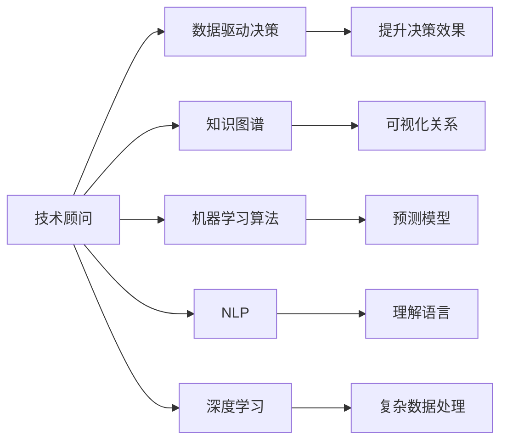

                 

# 技术顾问：打造每小时四位数的咨询费

## 1. 背景介绍

### 1.1 问题由来
近年来，随着人工智能(AI)和数据分析技术的快速发展，各行各业对于技术顾问的需求急剧增长。然而，高水平的技术顾问资源稀缺，供不应求，导致咨询费用居高不下。如何在激烈的市场竞争中脱颖而出，成为高价顾问，成为许多从业者的困惑。

### 1.2 问题核心关键点
本文聚焦于打造每小时四位数的技术顾问，探讨从理论到实践的全方位方法。我们通过深入分析技术顾问的核心技能，明确提升个人品牌价值的关键因素，并给出具体的实战策略和工具推荐，帮助读者实现顾问费用的飞跃。

### 1.3 问题研究意义
提升技术顾问的收入水平，不仅可以提升个人经济状况，还能增强行业的影响力。作为技术顾问，拥有高收入，才能更有动力持续学习和提升，从而提升整体行业的专业水平和创新能力。这对于推动AI技术落地应用，加速各行各业的数字化转型具有重要意义。

## 2. 核心概念与联系

### 2.1 核心概念概述

要成为每小时四位数的技术顾问，首先需要掌握一些关键概念：

- **技术顾问**：提供专业咨询、技术支持、解决方案的专家，通常具有丰富的行业经验和深度技术能力。

- **数据驱动决策**：通过数据分析来支持决策，提升方案的可行性和效果。

- **知识图谱**：由节点和边组成的图形结构，用于表示实体和它们之间的关系。

- **机器学习算法**：包括监督学习、无监督学习、强化学习等，用于从数据中提取模式和规律。

- **自然语言处理(NLP)**：使机器能够理解、解释和生成人类语言的技术。

- **深度学习**：基于神经网络的机器学习方法，擅长处理复杂的数据结构和大规模数据集。

这些核心概念之间存在紧密联系，共同构成了技术顾问的核心技能和工具。

### 2.2 概念间的关系

通过以下Mermaid流程图，我们可以更加清晰地理解这些核心概念之间的联系：



这个流程图展示了技术顾问需要掌握的核心技能和工具，以及它们如何相互作用来提升咨询价值。

## 3. 核心算法原理 & 具体操作步骤
### 3.1 算法原理概述

作为技术顾问，需要掌握多种算法和技术，以应对不同行业和场景的需求。这些算法包括但不限于：

- 监督学习：通过有标签数据训练模型，预测未来数据。
- 无监督学习：从无标签数据中发现模式和结构。
- 强化学习：通过交互式反馈优化决策。
- 自然语言处理：使机器理解人类语言。
- 深度学习：处理复杂数据，提取高层次特征。

### 3.2 算法步骤详解

以下是成为每小时四位数的技术顾问需要掌握的关键步骤：

**Step 1: 了解行业需求**

- 深入了解客户行业的基本知识，包括技术趋势、关键问题、最佳实践等。
- 参加行业会议、交流活动，了解最新的技术动态和应用案例。
- 阅读行业报告和研究论文，掌握最新的技术发展。

**Step 2: 数据收集与分析**

- 收集行业内的关键数据，包括用户反馈、业务指标、市场分析等。
- 使用数据可视化工具（如Tableau、Power BI）展示数据，直观分析问题。
- 应用机器学习算法（如回归分析、聚类分析），从数据中提取关键洞察。

**Step 3: 建立知识图谱**

- 收集行业内的关键实体和关系，建立知识图谱。
- 使用知识图谱工具（如Gephi、Neo4j）可视化实体之间的关系，展示复杂网络。
- 定期更新和维护知识图谱，确保其最新和准确。

**Step 4: 设计解决方案**

- 根据客户需求和数据分析结果，设计解决方案。
- 选择合适的技术架构和工具，例如使用Kubernetes进行容器化部署，使用AWS进行云服务管理。
- 详细规划实施步骤和时间表，确保解决方案的可行性和可操作性。

**Step 5: 实施和监控**

- 实施解决方案，监控关键指标和性能。
- 使用监控工具（如Prometheus、Grafana）实时监控系统状态，及时发现和解决问题。
- 定期评估解决方案效果，根据反馈进行调整和优化。

### 3.3 算法优缺点

技术顾问需要灵活使用各种算法，根据具体情况选择合适的技术和工具。以下是一些关键算法的优缺点：

- **监督学习**：优点是精度高，可以处理复杂的数据结构；缺点是需要大量有标签数据，难以处理冷启动问题。
- **无监督学习**：优点是可以发现数据中的隐藏模式和结构；缺点是结果解释性差，需要领域知识辅助。
- **强化学习**：优点是能够优化决策过程，适应动态环境；缺点是训练时间长，需要大量计算资源。
- **NLP**：优点是可以处理大量文本数据，发现文本中的关键信息；缺点是模型复杂，训练难度大。
- **深度学习**：优点是能够处理复杂数据，提取高层次特征；缺点是模型大，计算资源需求高。

### 3.4 算法应用领域

技术顾问的技能和工具广泛应用于多个领域，包括但不限于：

- **金融科技**：分析市场数据，提供投资策略和风险管理方案。
- **医疗健康**：通过数据分析，优化诊疗流程和医疗资源配置。
- **智能制造**：分析生产数据，提升生产效率和质量。
- **智能客服**：通过NLP技术，提升客户服务体验和满意度。
- **电子商务**：通过数据分析和推荐系统，提升用户转化率和销售额。

## 4. 数学模型和公式 & 详细讲解  
### 4.1 数学模型构建

在技术顾问的实际工作中，数学模型和算法是非常重要的工具。以下是一些常用的数学模型和公式：

**回归分析**：

$$
y = \beta_0 + \beta_1 x_1 + \beta_2 x_2 + \cdots + \beta_n x_n + \epsilon
$$

其中，$y$ 是因变量，$x_1, x_2, \cdots, x_n$ 是自变量，$\beta_0, \beta_1, \beta_2, \cdots, \beta_n$ 是回归系数，$\epsilon$ 是误差项。

**聚类分析**：

$$
K-means\: Clustering\: Algorithm
$$

其中，$K$ 是聚类数目，$x$ 是样本点，$\mu_k$ 是聚类中心。

**NLP中的BERT模型**：

$$
BERT(x) = [CLS] + [SEP] + \cdots + [SEP]
$$

其中，$x$ 是输入的文本序列，$[CLS]$ 是分类标记，$[SEP]$ 是分割标记。

**深度学习中的卷积神经网络**：

$$
f(x) = \sum_i w_i f_\theta(x_i) + b
$$

其中，$f(x)$ 是输出，$w_i$ 是权重，$f_\theta(x_i)$ 是神经元激活函数，$b$ 是偏置。

### 4.2 公式推导过程

以回归分析为例，我们通过实际案例进行详细讲解。

假设我们收集了多个用户的历史购买记录和年龄数据，想要预测用户的未来购买意愿。根据回归分析公式，我们可以建立一个线性回归模型：

$$
y_i = \beta_0 + \beta_1 x_{i1} + \beta_2 x_{i2} + \epsilon_i
$$

其中，$y_i$ 是用户$i$的购买意愿，$x_{i1}$ 是用户年龄，$x_{i2}$ 是历史购买记录，$\beta_0$ 是截距，$\beta_1$ 和$\beta_2$ 是回归系数，$\epsilon_i$ 是误差项。

通过最小二乘法求解$\beta_0$、$\beta_1$和$\beta_2$，我们可以得到预测模型：

$$
\hat{y_i} = \beta_0 + \beta_1 x_{i1} + \beta_2 x_{i2}
$$

### 4.3 案例分析与讲解

通过实际案例，我们可以更好地理解数学模型和算法的应用。以下是一个NLP中的BERT模型应用案例：

假设我们要进行文本分类任务，如判断一封邮件是否为垃圾邮件。我们可以使用预训练的BERT模型，对邮件文本进行编码，得到嵌入向量，然后将其输入到全连接层进行分类。具体步骤如下：

1. 使用BERT模型对邮件文本进行编码，得到嵌入向量。
2. 将嵌入向量输入到全连接层，输出分类概率。
3. 根据分类概率，判断邮件是否为垃圾邮件。

## 5. 项目实践：代码实例和详细解释说明
### 5.1 开发环境搭建

为了进行技术顾问的工作，我们需要搭建一个高效的开发环境。以下是一些推荐的工具和环境：

- **Python**：作为数据科学和机器学习的主流语言，Python生态系统非常丰富，可以方便地进行数据分析和模型训练。
- **Jupyter Notebook**：提供交互式的编程环境，适合进行数据探索和模型调试。
- **R**：作为统计分析的强大工具，R可以方便地进行数据处理和可视化。
- **Tableau**：用于数据可视化和商业智能，可以快速生成直观的图表和报告。
- **Power BI**：Microsoft开发的商业智能工具，可以与SQL Server、Azure等平台无缝集成。

### 5.2 源代码详细实现

以下是一个使用Python和TensorFlow进行机器学习的示例代码：

```python
import tensorflow as tf
from tensorflow.keras import layers

# 定义模型
model = tf.keras.Sequential([
    layers.Dense(64, activation='relu'),
    layers.Dense(10, activation='softmax')
])

# 编译模型
model.compile(optimizer='adam',
              loss='categorical_crossentropy',
              metrics=['accuracy'])

# 训练模型
model.fit(x_train, y_train, epochs=10, validation_data=(x_val, y_val))
```

### 5.3 代码解读与分析

在上述代码中，我们使用了TensorFlow库来定义和训练一个简单的机器学习模型。首先，我们定义了一个包含两个全连接层的神经网络，其中第一层有64个神经元，使用ReLU激活函数，第二层有10个神经元，使用Softmax激活函数。然后，我们编译模型，使用Adam优化器和交叉熵损失函数。最后，我们使用训练数据和验证数据对模型进行训练，共迭代10次。

### 5.4 运行结果展示

通过上述代码，我们可以得到一个精度较高的机器学习模型，用于预测邮件是否为垃圾邮件。模型训练完成后，我们可以使用测试数据进行评估：

```python
model.evaluate(x_test, y_test)
```

## 6. 实际应用场景
### 6.4 未来应用展望

技术顾问的未来应用前景非常广阔，以下是最具潜力的几个领域：

- **智慧城市**：通过数据分析和机器学习，优化城市管理，提升公共服务质量。
- **智能医疗**：通过NLP和知识图谱，辅助医生诊断和治疗，提高医疗服务水平。
- **金融科技**：通过数据分析和机器学习，优化金融策略，降低风险，提升收益。
- **智能制造**：通过数据分析和机器学习，优化生产流程，提高生产效率和质量。
- **智能客服**：通过NLP和机器学习，提升客户服务体验和满意度。
- **智能营销**：通过数据分析和推荐系统，提升客户转化率和销售额。

## 7. 工具和资源推荐
### 7.1 学习资源推荐

以下是一些值得推荐的学习资源，可以帮助你成为每小时四位数的技术顾问：

- **Coursera**：提供多种数据科学和机器学习课程，适合初学者和中级学习者。
- **edX**：提供由顶尖大学和机构提供的免费和付费课程，涵盖数据分析和机器学习等领域。
- **Kaggle**：提供大量数据集和机器学习竞赛，适合进行实际练习和项目实践。
- **GitHub**：提供开源项目和代码库，可以学习他人的代码和项目，提升编程能力。
- **Stack Overflow**：提供编程问题和解决方案，可以快速解决编程中的问题。

### 7.2 开发工具推荐

以下是一些常用的开发工具，可以帮助你更高效地进行技术顾问的工作：

- **Jupyter Notebook**：提供交互式的编程环境，适合进行数据探索和模型调试。
- **Tableau**：用于数据可视化和商业智能，可以快速生成直观的图表和报告。
- **Power BI**：Microsoft开发的商业智能工具，可以与SQL Server、Azure等平台无缝集成。
- **Python**：作为数据科学和机器学习的主流语言，Python生态系统非常丰富，可以方便地进行数据分析和模型训练。
- **R**：作为统计分析的强大工具，R可以方便地进行数据处理和可视化。

### 7.3 相关论文推荐

以下是一些重要的论文，可以帮助你深入理解技术顾问的核心技能和工具：

- **A Survey on Deep Learning Techniques for Natural Language Processing**：详细介绍了深度学习在NLP中的应用，包括BERT、LSTM等模型。
- **Machine Learning for Data Mining: Algorithms, Techniques and Their Applications**：介绍了多种机器学习算法和应用场景，包括回归分析、聚类分析、决策树等。
- **Graph Mining in Big Data**：介绍了知识图谱在数据分析中的应用，包括Gephi、Neo4j等工具。

## 8. 总结：未来发展趋势与挑战
### 8.1 研究成果总结

本文从理论到实践，详细讲解了技术顾问的核心技能和工具，包括数据驱动决策、知识图谱、机器学习算法和NLP。通过深入分析这些核心概念和算法的原理和应用，帮助读者全面提升技术顾问的咨询能力和收入水平。

### 8.2 未来发展趋势

技术顾问的未来发展趋势主要包括以下几个方面：

- **多模态数据融合**：将文本、图像、语音等多种数据进行融合，提升数据分析和处理能力。
- **深度学习模型的提升**：通过优化神经网络结构和训练算法，提升模型的精度和性能。
- **自动化技术的应用**：通过自动化工具和平台，提升工作效率和项目交付速度。
- **知识图谱的扩展**：通过扩展知识图谱，提升数据理解和推理能力。

### 8.3 面临的挑战

技术顾问在成为每小时四位数的道路上，仍面临以下挑战：

- **数据获取难度**：获取高质量的行业数据可能比较困难，需要耗费大量时间和精力。
- **模型训练复杂**：训练深度学习模型需要大量计算资源，容易出现过拟合等问题。
- **技术更新速度快**：AI技术和工具日新月异，需要持续学习和适应。
- **项目管理难度**：复杂项目需要良好的项目管理和沟通能力，容易出错。

### 8.4 研究展望

未来，技术顾问需要持续关注最新的技术趋势，不断提升自身技能，才能在激烈的市场竞争中脱颖而出。以下是一些研究方向和方向：

- **自动化技术**：开发自动化工具和平台，提升工作效率和项目交付速度。
- **多模态数据融合**：提升数据分析和处理能力，拓展数据应用场景。
- **深度学习模型优化**：优化神经网络结构和训练算法，提升模型精度和性能。
- **知识图谱扩展**：通过扩展知识图谱，提升数据理解和推理能力。

## 9. 附录：常见问题与解答

**Q1: 如何选择合适的机器学习算法？**

A: 选择合适的机器学习算法需要考虑数据类型、任务类型和数据量。对于分类问题，可以选择逻辑回归、决策树、SVM等算法；对于回归问题，可以选择线性回归、岭回归、随机森林等算法。对于异常检测问题，可以选择基于聚类或基于密度的算法。

**Q2: 如何处理数据不平衡问题？**

A: 数据不平衡问题可以通过重采样、过采样、欠采样等方法解决。重采样包括随机重采样和SMOTE算法；过采样包括SMOTE算法和ADASYN算法；欠采样包括随机欠采样和近邻欠采样。

**Q3: 如何处理过拟合问题？**

A: 过拟合问题可以通过增加数据量、使用正则化方法、提前停止训练等方法解决。增加数据量可以通过数据增强技术，如旋转、平移、缩放等；使用正则化方法，如L1、L2正则化、Dropout等；提前停止训练可以通过监控验证集误差，当误差不再下降时停止训练。

**Q4: 如何处理欠拟合问题？**

A: 欠拟合问题可以通过增加模型复杂度、增加特征维度、增加训练时间等方法解决。增加模型复杂度可以通过增加层数、节点数等；增加特征维度可以通过增加特征工程，如主成分分析、因子分析等；增加训练时间可以通过增加迭代次数、增加训练数据等。

**Q5: 如何提高模型的泛化能力？**

A: 提高模型的泛化能力可以通过数据增强、模型集成、迁移学习等方法解决。数据增强可以通过旋转、平移、缩放等方法；模型集成可以通过投票、平均、加权平均等方法；迁移学习可以通过使用预训练模型，减少训练时间和计算资源。

**Q6: 如何提升模型的解释性？**

A: 提升模型的解释性可以通过使用可解释性强的算法、增加特征工程、可视化结果等方法解决。使用可解释性强的算法，如决策树、线性回归、LIME等；增加特征工程，如特征选择、特征降维等；可视化结果，如图表、热图等。

**Q7: 如何评估模型的性能？**

A: 评估模型的性能可以通过多种指标，如准确率、召回率、F1分数、AUC等。准确率衡量模型的分类正确率；召回率衡量模型对正样本的覆盖率；F1分数衡量模型的分类效果；AUC衡量模型的分类能力。

通过上述文章，希望能帮助读者全面提升技术顾问的咨询能力和收入水平，成为每小时四位数的技术顾问，在人工智能领域中发挥更大的作用。

