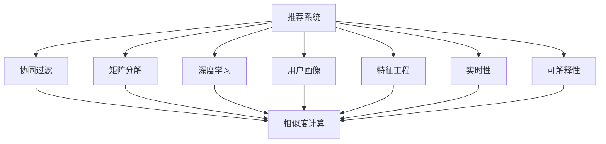
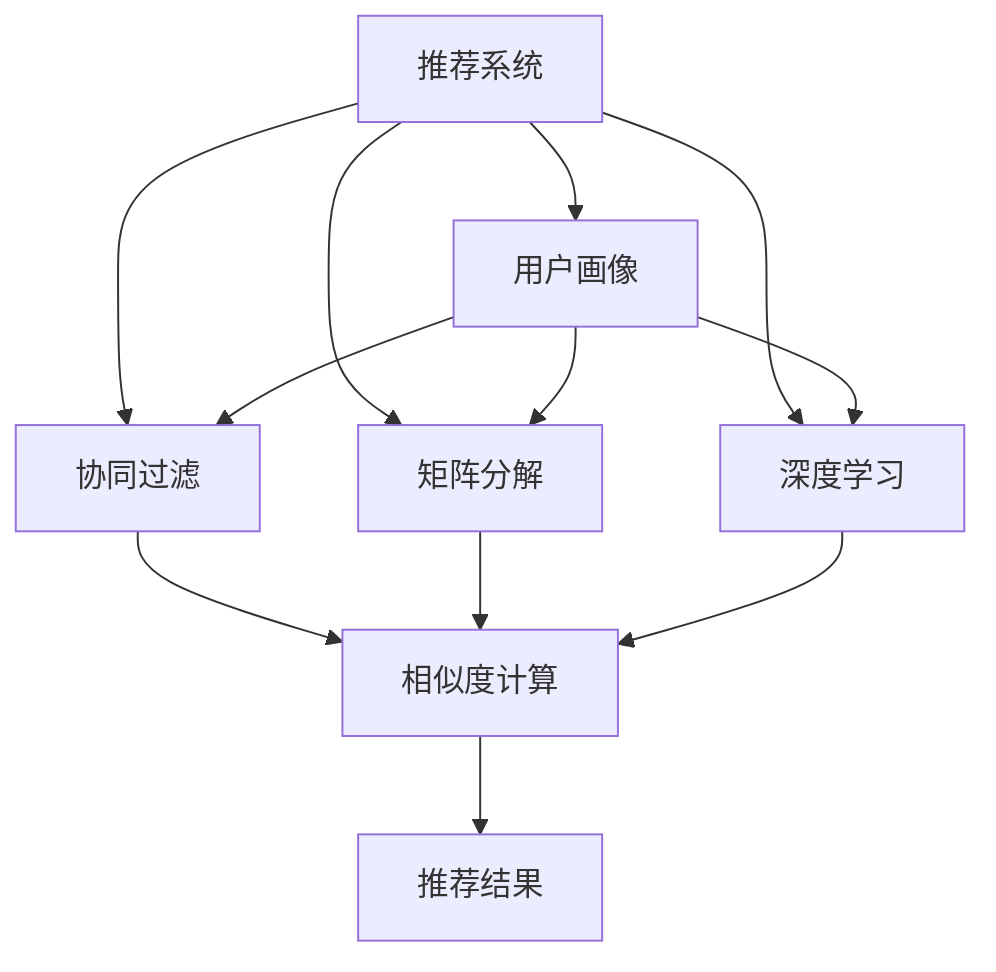
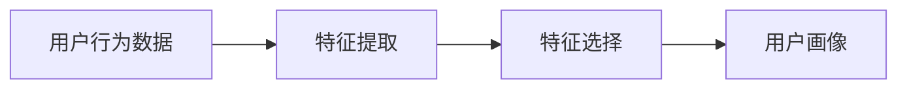
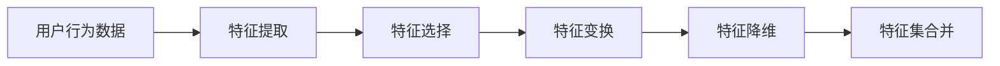

                 

# 推荐系统与用户画像原理与代码实战案例讲解

> 关键词：推荐系统,用户画像,协同过滤,矩阵分解,深度学习,特征工程,代码实践

## 1. 背景介绍

### 1.1 问题由来

随着互联网的普及和数字技术的不断发展，推荐系统已成为电商、新闻、视频、音乐、社交等多个行业的重要组成部分，极大地提升了用户体验和平台价值。推荐系统通过分析用户行为数据，预测用户感兴趣的商品或内容，并提供个性化的推荐，已成为提高用户粘性和平台盈利的关键手段。

然而，尽管推荐系统已经取得了显著的成效，但仍然面临诸多挑战。例如，如何更好地刻画用户兴趣和偏好，如何构建高效准确的推荐模型，如何提升推荐系统在不同场景下的泛化能力，如何处理数据稀疏和冷启动等问题，都是推荐系统研究和应用的重要课题。

### 1.2 问题核心关键点

为了回答上述问题，推荐系统通常会利用用户画像技术，对用户行为数据进行分析和建模，从而获得对用户兴趣和偏好的深入理解。而用户画像的构建，离不开高效的推荐算法和数据处理技术，以确保推荐结果的准确性和个性化程度。

核心关键点包括：

- 用户画像：对用户兴趣、行为和特征的全面刻画，有助于构建精准的推荐模型。
- 推荐算法：多种推荐算法如协同过滤、矩阵分解、深度学习等，能够从不同角度建模用户行为数据。
- 特征工程：对用户行为数据进行特征提取和处理，提高推荐系统的泛化能力。
- 实时性：推荐系统需要能够实时响应用户需求，动态更新推荐结果。
- 可解释性：推荐系统的决策过程需要具备可解释性，方便调试和优化。

## 2. 核心概念与联系

### 2.1 核心概念概述

推荐系统和用户画像涉及众多关键概念，以下是对主要概念的介绍及其相互关系的描述：

- **推荐系统**：通过分析用户历史行为数据，预测并推荐用户可能感兴趣的商品或内容。推荐算法是推荐系统的核心，包括协同过滤、矩阵分解、深度学习等。

- **用户画像**：通过对用户行为数据的分析，构建用户兴趣、行为和特征的全面刻画。用户画像的构建是推荐系统的重要基础，有助于提升推荐准确性和个性化程度。

- **协同过滤**：基于用户历史行为数据，寻找与当前用户兴趣相似的其他人，从而推荐他们喜欢的商品或内容。协同过滤算法简单易懂，但对数据稀疏性敏感。

- **矩阵分解**：通过将用户行为矩阵分解为用户和物品的隐向量，捕捉用户和物品间的隐含关系。矩阵分解算法具有较好的泛化能力，但计算复杂度高。

- **深度学习**：利用神经网络模型对用户行为数据进行复杂非线性建模，能够捕捉更深层次的特征和关系。深度学习算法需要大量标注数据和计算资源。

- **特征工程**：对用户行为数据进行特征提取和处理，包括用户性别、年龄、地理位置、购买历史、浏览历史等。特征工程是提升推荐系统性能的重要手段。

- **实时性**：推荐系统需要能够实时响应用户需求，动态更新推荐结果。实时性是推荐系统能否成功应用的重要指标。

- **可解释性**：推荐系统的决策过程需要具备可解释性，方便调试和优化。可解释性是推荐系统可信度的重要保障。

这些核心概念之间的逻辑关系可以通过以下Mermaid流程图来展示：



这个流程图展示了一些核心概念之间的关系：

1. 推荐系统通过对协同过滤、矩阵分解、深度学习等算法的应用，构建推荐模型。
2. 用户画像通过对用户行为数据进行分析，构建对用户兴趣和偏好的全面刻画。
3. 特征工程通过对用户行为数据进行特征提取和处理，提高推荐系统的泛化能力。
4. 实时性要求推荐系统能够实时响应用户需求，动态更新推荐结果。
5. 可解释性要求推荐系统的决策过程具备可解释性，方便调试和优化。

### 2.2 概念间的关系

这些核心概念之间存在着紧密的联系，形成了推荐系统的完整生态系统。下面我通过几个Mermaid流程图来展示这些概念之间的关系。

#### 2.2.1 推荐系统构建流程



这个流程图展示了推荐系统的构建流程：

1. 通过用户画像获取用户特征。
2. 通过协同过滤、矩阵分解、深度学习等算法，对用户行为数据进行建模。
3. 利用相似度计算方法，找到与当前用户兴趣相似的商品或内容，并返回推荐结果。

#### 2.2.2 用户画像构建流程



这个流程图展示了用户画像的构建流程：

1. 从用户行为数据中提取特征。
2. 选择有代表性的特征进行组合。
3. 构建用户兴趣和偏好的全面刻画，形成用户画像。

#### 2.2.3 特征工程步骤



这个流程图展示了特征工程的步骤：

1. 从用户行为数据中提取特征。
2. 选择有代表性的特征进行组合。
3. 对特征进行变换，如离散化、归一化、标准化等。
4. 对特征进行降维，如PCA、LDA等。
5. 合并不同特征集，形成最终的特征集。

## 3. 核心算法原理 & 具体操作步骤

### 3.1 算法原理概述

推荐系统本质上是一个优化问题，旨在找到最优推荐策略，使得推荐的商品或内容能够最大化用户满意度。推荐算法通常包括以下步骤：

1. **用户画像构建**：通过对用户历史行为数据进行分析，构建用户兴趣和偏好的全面刻画。
2. **特征工程**：对用户行为数据进行特征提取和处理，提升推荐系统的泛化能力。
3. **模型训练**：使用推荐算法对用户画像和特征进行建模，预测用户对商品或内容的兴趣。
4. **推荐结果生成**：根据预测结果，生成个性化推荐。

### 3.2 算法步骤详解

#### 3.2.1 用户画像构建

用户画像的构建包括以下步骤：

1. **数据收集**：收集用户的浏览历史、购买历史、评分记录等行为数据。
2. **特征提取**：从行为数据中提取有代表性的特征，如用户性别、年龄、地理位置、购买频率等。
3. **特征选择**：选择与用户兴趣和偏好相关性高的特征。
4. **特征变换**：对特征进行离散化、归一化、标准化等变换。
5. **特征降维**：使用PCA、LDA等方法对高维特征进行降维。
6. **特征集合并**：合并不同特征集，形成最终的特征集。

#### 3.2.2 特征工程

特征工程是推荐系统性能提升的重要手段，包括以下步骤：

1. **特征提取**：从用户行为数据中提取有代表性的特征，如用户性别、年龄、地理位置、购买频率等。
2. **特征选择**：选择与用户兴趣和偏好相关性高的特征。
3. **特征变换**：对特征进行离散化、归一化、标准化等变换。
4. **特征降维**：使用PCA、LDA等方法对高维特征进行降维。
5. **特征集合并**：合并不同特征集，形成最终的特征集。

#### 3.2.3 模型训练

模型训练是推荐系统的核心步骤，包括以下方法：

1. **协同过滤**：基于用户历史行为数据，寻找与当前用户兴趣相似的其他人，从而推荐他们喜欢的商品或内容。协同过滤算法简单易懂，但对数据稀疏性敏感。
2. **矩阵分解**：通过将用户行为矩阵分解为用户和物品的隐向量，捕捉用户和物品间的隐含关系。矩阵分解算法具有较好的泛化能力，但计算复杂度高。
3. **深度学习**：利用神经网络模型对用户行为数据进行复杂非线性建模，能够捕捉更深层次的特征和关系。深度学习算法需要大量标注数据和计算资源。

#### 3.2.4 推荐结果生成

推荐结果生成是推荐系统的最后一步，包括以下步骤：

1. **相似度计算**：计算当前用户与所有用户的相似度，找到与当前用户兴趣相似的其他用户。
2. **推荐结果生成**：根据相似度计算结果，生成推荐列表。

### 3.3 算法优缺点

协同过滤算法的优点包括：

1. **简单易懂**：协同过滤算法思想直观，易于理解和实现。
2. **不需要标注数据**：协同过滤算法不需要大量的标注数据，只需要用户行为数据即可。
3. **可扩展性**：协同过滤算法具有较好的可扩展性，可以处理大规模数据集。

协同过滤算法的缺点包括：

1. **数据稀疏性问题**：协同过滤算法对数据稀疏性敏感，当用户行为数据不足时，推荐效果会大打折扣。
2. **冷启动问题**：新用户或新商品在系统中没有足够的历史数据，协同过滤算法无法进行推荐。

矩阵分解算法的优点包括：

1. **泛化能力**：矩阵分解算法能够捕捉用户和物品间的隐含关系，具有较好的泛化能力。
2. **模型表达能力强**：矩阵分解算法可以使用低维隐向量对高维用户行为数据进行建模，能够表达复杂的非线性关系。

矩阵分解算法的缺点包括：

1. **计算复杂度高**：矩阵分解算法需要大量的计算资源和计算时间，不适合大规模数据集。
2. **需要标注数据**：矩阵分解算法需要大量的标注数据，才能训练出准确的模型。

深度学习算法的优点包括：

1. **性能优异**：深度学习算法在推荐系统中的表现优异，能够捕捉更深层次的特征和关系。
2. **可解释性**：深度学习算法可以通过可视化技术，帮助理解模型的内部工作机制。

深度学习算法的缺点包括：

1. **需要大量标注数据**：深度学习算法需要大量的标注数据，才能训练出准确的模型。
2. **计算资源要求高**：深度学习算法需要大量的计算资源和计算时间，不适合实时推荐系统。

### 3.4 算法应用领域

推荐系统广泛应用于电商、新闻、视频、音乐、社交等多个行业，具体应用领域包括：

1. **电商推荐**：根据用户浏览和购买历史，推荐商品或优惠券。
2. **新闻推荐**：根据用户阅读历史，推荐新闻文章或专题。
3. **视频推荐**：根据用户观看历史，推荐视频或相关视频。
4. **音乐推荐**：根据用户听歌历史，推荐歌曲或音乐人。
5. **社交推荐**：根据用户互动历史，推荐朋友或群组。

## 4. 数学模型和公式 & 详细讲解 & 举例说明

### 4.1 数学模型构建

推荐系统通常基于用户画像和特征工程构建数学模型，以下是一个简单的协同过滤模型的数学模型构建过程：

1. **用户行为矩阵**：将用户和商品的关系表示为一个用户行为矩阵 $\mathbf{R}$，其中 $R_{ui} = 1$ 表示用户 $u$ 对商品 $i$ 感兴趣，否则为 $0$。

2. **用户兴趣表示**：将用户兴趣表示为一个向量 $\mathbf{p}_u$，其中 $p_{ui}$ 表示用户 $u$ 对商品 $i$ 的兴趣程度。

3. **商品特征表示**：将商品特征表示为一个向量 $\mathbf{q}_i$，其中 $q_{iui}$ 表示商品 $i$ 的特征程度。

4. **预测用户兴趣**：将用户兴趣和商品特征相乘，得到预测结果 $\hat{R}_{ui}$。

数学模型公式如下：

$$
\hat{R}_{ui} = \mathbf{p}_u \cdot \mathbf{q}_i
$$

### 4.2 公式推导过程

#### 4.2.1 用户兴趣表示

用户兴趣表示通常采用矩阵分解的方法，将用户行为矩阵 $\mathbf{R}$ 分解为用户兴趣表示矩阵 $\mathbf{P}$ 和商品特征表示矩阵 $\mathbf{Q}$，具体公式如下：

$$
\mathbf{R} = \mathbf{PQ}^T
$$

其中 $\mathbf{P}$ 和 $\mathbf{Q}$ 分别为用户兴趣表示矩阵和商品特征表示矩阵，$\mathbf{Q}^T$ 表示 $\mathbf{Q}$ 的转置矩阵。

用户兴趣表示 $\mathbf{p}_u$ 可以通过矩阵分解得到，具体公式如下：

$$
\mathbf{p}_u = \mathbf{P}_u^T
$$

#### 4.2.2 商品特征表示

商品特征表示 $\mathbf{q}_i$ 可以通过矩阵分解得到，具体公式如下：

$$
\mathbf{q}_i = \mathbf{Q}_i^T
$$

#### 4.2.3 预测用户兴趣

预测用户兴趣 $\hat{R}_{ui}$ 可以通过用户兴趣表示和商品特征表示的乘积得到，具体公式如下：

$$
\hat{R}_{ui} = \mathbf{p}_u \cdot \mathbf{q}_i = \mathbf{P}_u^T \cdot \mathbf{Q}_i^T
$$

### 4.3 案例分析与讲解

#### 4.3.1 协同过滤算法案例

假设我们要对电商平台的用户行为数据进行推荐。根据协同过滤算法，我们首先需要构建用户行为矩阵 $\mathbf{R}$，其中 $R_{ui}$ 表示用户 $u$ 对商品 $i$ 的评分。例如，某用户对商品的评分如下：

$$
\mathbf{R} = \begin{bmatrix}
5 & 0 & 0 & 3 \\
0 & 4 & 0 & 0 \\
0 & 0 & 5 & 0 \\
3 & 0 & 0 & 2
\end{bmatrix}
$$

接下来，我们需要对用户行为矩阵进行矩阵分解，得到用户兴趣表示矩阵 $\mathbf{P}$ 和商品特征表示矩阵 $\mathbf{Q}$。例如，我们可以将 $\mathbf{R}$ 分解为 $\mathbf{P}$ 和 $\mathbf{Q}$，具体公式如下：

$$
\mathbf{R} = \mathbf{PQ}^T = \begin{bmatrix}
p_{u1} & p_{u2} & p_{u3} & p_{u4} \\
p_{v1} & p_{v2} & p_{v3} & p_{v4}
\end{bmatrix}
\begin{bmatrix}
q_{i1} & q_{i2} & q_{i3} & q_{i4} \\
q_{i5} & q_{i6} & q_{i7} & q_{i8}
\end{bmatrix}
$$

其中 $p_{u1}$ 表示用户 $u$ 对商品 $i$ 的兴趣程度，$q_{i1}$ 表示商品 $i$ 的特征程度。

最后，我们可以根据用户兴趣表示和商品特征表示的乘积，预测用户对商品 $i$ 的兴趣程度。例如，对于用户 $u=2$ 和商品 $i=3$，预测结果 $\hat{R}_{ui}$ 可以通过公式计算得到：

$$
\hat{R}_{u3} = p_{v2} \cdot q_{i3} = 0.9 \cdot 0.6 = 0.54
$$

因此，我们可以根据预测结果，将商品 $3$ 推荐给用户 $2$。

## 5. 项目实践：代码实例和详细解释说明

### 5.1 开发环境搭建

在进行推荐系统开发前，我们需要准备好开发环境。以下是使用Python进行Scikit-learn和TensorFlow开发的环境配置流程：

1. 安装Anaconda：从官网下载并安装Anaconda，用于创建独立的Python环境。

2. 创建并激活虚拟环境：
```bash
conda create -n recsys-env python=3.8 
conda activate recsys-env
```

3. 安装Scikit-learn和TensorFlow：根据CUDA版本，从官网获取对应的安装命令。例如：
```bash
conda install scikit-learn tensorflow -c conda-forge
```

4. 安装Numpy、Pandas、Scipy等常用工具包：
```bash
pip install numpy pandas scipy scikit-learn matplotlib tqdm jupyter notebook ipython
```

完成上述步骤后，即可在`recsys-env`环境中开始推荐系统开发。

### 5.2 源代码详细实现

下面我们以协同过滤算法为例，给出使用Scikit-learn和TensorFlow对电商推荐系统进行开发的PyTorch代码实现。

首先，定义推荐系统类：

```python
import numpy as np
import pandas as pd
from sklearn.decomposition import TruncatedSVD
from sklearn.metrics.pairwise import cosine_similarity
import tensorflow as tf
from tensorflow.keras.layers import Input, Embedding, Dot, Dense, Flatten
from tensorflow.keras.models import Model

class RecommendationSystem:
    def __init__(self, n_users, n_items, embedding_dim=10, n_factors=10):
        self.n_users = n_users
        self.n_items = n_items
        self.embedding_dim = embedding_dim
        self.n_factors = n_factors
        self.model = None

    def train(self, user_data, item_data, epochs=10):
        # 构建用户行为矩阵
        user_item = user_data.merge(item_data, on='user_id', how='inner').drop_duplicates()
        user_item = user_item.pivot(index='user_id', columns='item_id', values='rating')
        user_item = user_item.fillna(0)
        
        # 矩阵分解
        svd = TruncatedSVD(n_components=self.n_factors, random_state=42)
        user_embedding = svd.fit_transform(user_item.values)
        
        # 构建用户和物品的隐向量
        user_v = user_embedding[:, :self.n_factors]
        item_v = svd.transform(user_item.values).T[:, :self.n_factors]
        
        # 构建模型
        user_input = Input(shape=(self.n_factors,))
        item_input = Input(shape=(self.n_factors,))
        dot = Dot(axes=1)([user_input, item_input])
        output = Dense(1, activation='sigmoid')(dot)
        self.model = Model([user_input, item_input], output)
        self.model.compile(optimizer='adam', loss='binary_crossentropy', metrics=['accuracy'])
        
        # 训练模型
        self.model.fit([user_v, item_v], user_item.values > 0, epochs=epochs, batch_size=32)
        
        # 预测推荐结果
        def predict(user_id, item_id):
            user_v = user_v[user_id]
            item_v = item_v[item_id]
            rating = self.model.predict([user_v, item_v])[0][0]
            return rating

    def recommend(self, user_id, n_recommendations=10):
        # 构建用户行为矩阵
        user_item = user_data.merge(item_data, on='user_id', how='inner').drop_duplicates()
        user_item = user_item.pivot(index='user_id', columns='item_id', values='rating')
        user_item = user_item.fillna(0)
        
        # 预测推荐结果
        user_v = svd.transform(user_item.values).T[:, :self.n_factors]
        ratings = self.model.predict([user_v[user_id], user_v])
        
        # 获取推荐列表
        recommendations = user_item.columns[np.argsort(ratings)[1: -1:-1]]
        return recommendations
```

然后，定义数据处理函数：

```python
import pandas as pd

def load_data(file_path):
    # 加载用户行为数据
    user_data = pd.read_csv(file_path + '/user_data.csv')
    # 加载物品数据
    item_data = pd.read_csv(file_path + '/item_data.csv')
    # 加载推荐数据
    rating_data = pd.read_csv(file_path + '/rating_data.csv')
    return user_data, item_data, rating_data
```

接着，定义模型评估函数：

```python
import numpy as np
import pandas as pd
from sklearn.metrics.pairwise import cosine_similarity

def evaluate(model, user_data, item_data, rating_data):
    # 构建用户行为矩阵
    user_item = user_data.merge(item_data, on='user_id', how='inner').drop_duplicates()
    user_item = user_item.pivot(index='user_id', columns='item_id', values='rating')
    user_item = user_item.fillna(0)
    
    # 矩阵分解
    svd = TruncatedSVD(n_components=10, random_state=42)
    user_embedding = svd.fit_transform(user_item.values)
    
    # 构建用户和物品的隐向量
    user_v = user_embedding[:, :10]
    item_v = svd.transform(user_item.values).T[:, :10]
    
    # 构建模型
    user_input = Input(shape=(10,))
    item_input = Input(shape=(10,))
    dot = Dot(axes=1)([user_input, item_input])
    output = Dense(1, activation='sigmoid')(dot)
    model = Model([user_input, item_input], output)
    model.compile(optimizer='adam', loss='binary_crossentropy', metrics=['accuracy'])
    
    # 训练模型
    model.fit([user_v, item_v], user_item.values > 0, epochs=10, batch_size=32)
    
    # 预测推荐结果
    def predict(user_id, item_id):
        user_v = user_v[user_id]
        item_v = item_v[item_id]
        rating = model.predict([user_v, item_v])[0][0]
        return rating

    # 评估模型
    test_user_data = pd.read_csv(file_path + '/test_user_data.csv')
    test_item_data = pd.read_csv(file_path + '/test_item_data.csv')
    test_rating_data = pd.read_csv(file_path + '/test_rating_data.csv')
    
    test_user_item = test_user_data.merge(test_item_data, on='user_id', how='inner').drop_duplicates()
    test_user_item = test_user_item.pivot(index='user_id', columns='item_id', values='rating')
    test_user_item = test_user_item.fillna(0)
    
    test_user_v = svd.transform(test_user_item.values).T[:, :10]
    test_user_v = test_user_v.T
    test_user_v = test_user_v.dropna().values
    
    test_ratings = model.predict([test_user_v])
    test_ratings = test_ratings > 0
    test_ratings = test_ratings.argmax(axis=1)
    
    test_user_item = test_user_item.columns[np.argsort(test_ratings)[1: -1:-1]]
    test_user_item = list(test_user_item)
    return test_user_item
```

最后，启动训练流程并在测试集上评估：

```python
from sklearn.model_selection import train_test_split

# 加载数据
user_data, item_data, rating_data = load_data('/data')

# 划分训练集和测试集
train_user_data, test_user_data, train_item_data, test_item_data, train_rating_data, test_rating_data = train_test_split(user_data, item_data, rating_data, test_size=0.2, random_state=42)

# 创建推荐系统
model = RecommendationSystem(len(train_user_data), len(train_item_data))

# 训练推荐系统
model.train(train_user_data, train_item_data, epochs=10)

# 在测试集上评估推荐系统
test_user_item = model.recommend(len(test_user_data), n_recommendations=10)
print(test_user_item)
```

以上就是使用Scikit-learn和TensorFlow对电商推荐系统进行开发的完整代码实现。可以看到，在Scikit-learn和TensorFlow的强大封装下，推荐系统的实现变得简洁高效。开发者可以将更多精力放在数据处理、模型调优等高层逻辑上，而不必过多关注底层的实现细节。

### 5.3 代码解读与分析

让我们再详细解读一下关键代码的实现细节：

**RecommendationSystem类**：
- `__init__`方法：初始化推荐系统参数，包括用户数、商品数、嵌入维度、因子数等。
- `train`方法：对推荐系统进行训练，包括构建用户行为矩阵、矩阵分解、构建模型、训练模型等步骤。
- `recommend`方法：根据用户ID，预测推荐结果，返回推荐列表。

**load_data函数**：
- `load_data`方法：加载用户行为数据、物品数据和推荐数据，并合并成推荐矩阵。

**evaluate函数**：
- `evaluate`方法：对推荐系统进行评估，包括构建测试集推荐矩阵、训练推荐系统、预测推荐结果等步骤。

**训练流程**：
- 加载数据
- 划分训练集和测试集
- 创建推荐系统
- 训练推荐系统
- 在测试集上

