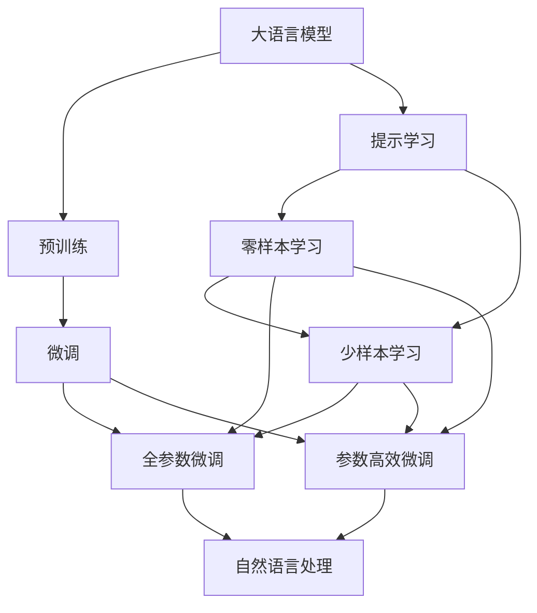
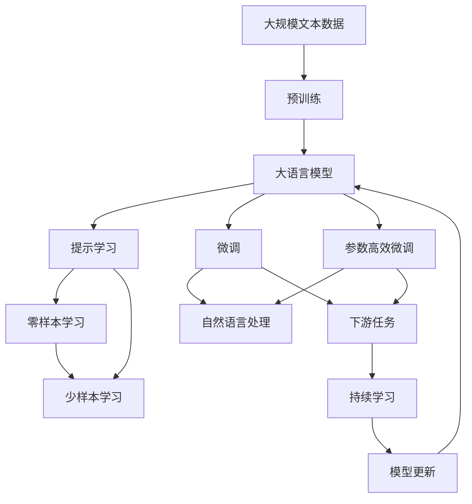

                 

# 提示学习：基础模型的新特性

> 关键词：提示学习,基础模型,提示微调,Prompt Tuning,自动生成,自适应

## 1. 背景介绍

### 1.1 问题由来

近年来，大语言模型（Large Language Models, LLMs）在自然语言处理（Natural Language Processing, NLP）领域取得了显著进展，如GPT-3、BERT等模型已经在诸多任务上实现了突破。这些模型的核心特性在于其能够通过自监督预训练学习到丰富的语言表示，并在微调（Fine-Tuning）时利用这些预训练知识提升下游任务的表现。

然而，微调过程往往需要大量的标注数据，并且模型在特定任务上的表现仍然可能不理想，尤其是在数据量不足或任务特征复杂的情况下。这促使研究者寻求新的方法来提升模型的性能和泛化能力，提示学习（Prompt Learning）因此应运而生。提示学习是一种基于输入文本的设计技巧，通过精心构造的文本格式引导模型按照预期方式进行推理和生成，从而在微调过程中减少参数更新，提升模型性能。

### 1.2 问题核心关键点

提示学习与传统微调的不同之处在于，它不依赖大量的标注数据，而是利用模型自身的语言理解和生成能力，通过输入文本的设计，实现对模型推理路径的引导。其核心在于以下几个方面：

1. **提示文本设计**：构造具有特定结构的输入文本，引导模型输出期望的结果。
2. **自适应推理**：模型根据输入文本自适应推理，无需修改模型参数。
3. **零样本和少样本学习**：提示学习可以实现在没有标注数据的情况下，模型也能进行推理。
4. **参数高效性**：由于模型无需修改参数，提示学习被认为是参数高效（Parameter-Efficient）的微调方法。

提示学习在大规模预训练模型上展示了巨大的潜力，已经在问答、对话系统、文本生成等多个领域取得了显著效果，成为大语言模型微调的一个重要分支。

### 1.3 问题研究意义

提示学习对于拓展大语言模型的应用边界，提升模型在特定任务上的表现，具有重要意义：

1. **降低成本**：提示学习可以显著降低标注数据的获取成本，特别是对于长尾任务和少样本学习场景。
2. **提高泛化能力**：模型在提示引导下，可以更灵活地适应各种不同的任务和数据分布。
3. **提升效率**：提示学习不涉及模型参数的更新，能够快速迭代优化。
4. **增强可解释性**：提示学习的输出过程可以通过简单的文本解释，提高模型的可解释性。
5. **促进创新**：提示学习为研究者提供了新的研究视角和创新点，推动了NLP技术的进一步发展。

## 2. 核心概念与联系

### 2.1 核心概念概述

提示学习是一种利用模型自身的语言理解能力，通过精心设计的输入文本（Prompt），实现对模型推理路径的引导。其核心思想在于，将预训练模型视作一个强大的"特征提取器"，通过提示文本的微调，使得模型能够更准确地处理特定任务。

### 2.2 核心概念间的关系

提示学习的核心概念及其关系可以通过以下Mermaid流程图来展示：



这个流程图展示了提示学习在大语言模型微调中的作用：

1. 大语言模型通过预训练获得基础能力。
2. 提示学习利用模型自身的语言理解能力，通过输入文本的设计，实现对模型推理路径的引导。
3. 提示学习可以分为零样本学习和少样本学习两种形式。
4. 微调分为全参数微调和参数高效微调两种方式。
5. 提示学习可以与微调结合，实现对模型的进一步优化。

### 2.3 核心概念的整体架构

提示学习的核心概念及其在大语言模型微调中的整体架构可以通过以下综合的流程图来展示：



这个综合流程图展示了从预训练到提示学习，再到微调的过程。大语言模型首先在大规模文本数据上进行预训练，然后通过提示学习设计输入文本，实现对模型的微调，最后通过持续学习，模型可以不断适应新的任务和数据。

## 3. 核心算法原理 & 具体操作步骤
### 3.1 算法原理概述

提示学习的基本思想是，通过构造具有特定结构的输入文本，引导模型按照预期方式进行推理和生成。其核心在于：

1. **提示文本设计**：构造包含任务提示和示例的文本，以帮助模型理解任务。
2. **自适应推理**：模型根据输入文本自适应推理，无需修改模型参数。
3. **零样本和少样本学习**：提示学习可以实现零样本和少样本学习，即在没有标注数据的情况下，模型也能进行推理。

形式化地，假设大语言模型为 $M_{\theta}$，其中 $\theta$ 为模型参数。给定下游任务 $T$ 的输入文本 $P$ 和提示文本 $S$，以及相应的输出 $Y$。则提示学习的过程可以表示为：

$$
Y = M_{\theta}(P, S)
$$

在提示学习中，模型的输出依赖于输入文本 $P$ 和提示文本 $S$。通过对提示文本 $S$ 的设计，可以引导模型输出期望的结果 $Y$。

### 3.2 算法步骤详解

提示学习的核心步骤包括：

**Step 1: 准备提示文本和数据集**

- 定义下游任务 $T$ 的提示文本 $S$，通常包括任务描述和示例。
- 准备下游任务 $T$ 的标注数据集 $D=\{(P_i, Y_i)\}_{i=1}^N$，其中 $P_i$ 为输入文本，$Y_i$ 为标注结果。

**Step 2: 构造提示格式**

- 构造包含任务提示和示例的提示文本 $S$，形式化表示为 $S(P_i, Y_i)$。
- 将提示文本 $S$ 与输入文本 $P_i$ 拼接，形成新的输入格式 $P'_i = P_i + S(P_i, Y_i)$。

**Step 3: 执行提示微调**

- 使用微调算法（如梯度下降）更新模型参数 $\theta$，以最小化损失函数 $\mathcal{L}(P', Y)$。
- 在验证集上评估模型性能，确保提示微调的效果。

**Step 4: 测试和部署**

- 在测试集上评估微调后的模型 $M_{\hat{\theta}}$ 的性能。
- 使用微调后的模型对新样本进行推理预测，集成到实际的应用系统中。

### 3.3 算法优缺点

提示学习的优点包括：

1. **参数高效**：提示学习不需要修改模型参数，可以显著减少微调过程中的计算资源消耗。
2. **零样本和少样本学习**：提示学习可以实现零样本和少样本学习，在缺乏标注数据的情况下也能进行推理。
3. **灵活性**：提示文本的设计可以非常灵活，适用于各种不同的任务和数据分布。
4. **可解释性**：提示学习可以提供简单的文本解释，增强模型的可解释性。

提示学习的主要缺点包括：

1. **提示设计复杂**：提示文本的设计需要丰富的经验和创造力，有时难以构造出有效的提示。
2. **泛化能力有限**：提示文本的设计可能会依赖特定的数据集和任务，泛化能力有限。
3. **可能存在过拟合**：提示微调过程中，模型可能会过拟合提示文本，影响泛化能力。

### 3.4 算法应用领域

提示学习已经在多个NLP领域得到了广泛应用，例如：

- **问答系统**：通过构造包含问题-答案格式的提示文本，实现零样本或少样本学习，生成问答系统的回答。
- **对话系统**：设计包含对话历史和上下文的提示文本，引导模型生成自然的对话回复。
- **文本生成**：通过构造包含生成目标的提示文本，实现对文本生成的引导，生成高质量的文本内容。
- **机器翻译**：设计包含源语言和目标语言格式的提示文本，引导模型进行翻译。
- **情感分析**：构造包含情感极性分类格式的提示文本，实现对文本情感的分析和分类。

## 4. 数学模型和公式 & 详细讲解 & 举例说明

### 4.1 数学模型构建

在提示学习中，模型的输入和输出可以表示为：

$$
Y = M_{\theta}(P, S)
$$

其中 $P$ 为输入文本，$S$ 为提示文本，$Y$ 为输出。

提示文本 $S$ 的形式化表示为：

$$
S(P_i, Y_i) = "Task: T, Example: P_i, Target: Y_i"
$$

在提示学习中，模型的目标是最小化损失函数 $\mathcal{L}(P', Y)$，其中 $P' = P + S$。常见的损失函数包括交叉熵损失、均方误差损失等。

### 4.2 公式推导过程

以下以二分类任务为例，推导提示学习的损失函数及其梯度的计算公式。

假设模型 $M_{\theta}$ 在输入 $P$ 和提示 $S$ 上的输出为 $\hat{Y}=M_{\theta}(P, S)$，表示样本属于正类的概率。真实标签 $Y \in \{0,1\}$。则二分类交叉熵损失函数定义为：

$$
\ell(Y, \hat{Y}) = -[y\log \hat{Y} + (1-y)\log (1-\hat{Y})]
$$

将其代入损失函数公式，得：

$$
\mathcal{L}(P, S) = \frac{1}{N}\sum_{i=1}^N \ell(Y_i, \hat{Y}_i)
$$

根据链式法则，损失函数对参数 $\theta_k$ 的梯度为：

$$
\frac{\partial \mathcal{L}(P, S)}{\partial \theta_k} = -\frac{1}{N}\sum_{i=1}^N (\frac{y_i}{\hat{Y}_i}-\frac{1-y_i}{1-\hat{Y}_i}) \frac{\partial M_{\theta}(P_i, S_i)}{\partial \theta_k}
$$

其中 $\frac{\partial M_{\theta}(P_i, S_i)}{\partial \theta_k}$ 可进一步递归展开，利用自动微分技术完成计算。

### 4.3 案例分析与讲解

以一个简单的例子来说明提示学习的实现。假设我们要使用GPT-3模型进行情感分析，构造的提示文本为：

```
"Task: Sentiment Analysis, Input: I love this movie, Target: Positive"
```

输入文本 $P$ 可以是：

```
"I love this movie, it's amazing"
```

构造的输入文本 $P'$ 为：

```
"I love this movie, it's amazing, Task: Sentiment Analysis, Input: I love this movie, Target: Positive"
```

将 $P'$ 输入到GPT-3模型中进行推理，输出结果为：

```
Positive
```

在这个例子中，通过构造包含任务提示和示例的提示文本，GPT-3模型能够自适应地进行情感分析，无需修改模型参数，也不需要额外的标注数据。

## 5. 项目实践：代码实例和详细解释说明

### 5.1 开发环境搭建

在进行提示学习实践前，我们需要准备好开发环境。以下是使用Python进行PyTorch开发的环境配置流程：

1. 安装Anaconda：从官网下载并安装Anaconda，用于创建独立的Python环境。

2. 创建并激活虚拟环境：
```bash
conda create -n pytorch-env python=3.8 
conda activate pytorch-env
```

3. 安装PyTorch：根据CUDA版本，从官网获取对应的安装命令。例如：
```bash
conda install pytorch torchvision torchaudio cudatoolkit=11.1 -c pytorch -c conda-forge
```

4. 安装Transformers库：
```bash
pip install transformers
```

5. 安装各类工具包：
```bash
pip install numpy pandas scikit-learn matplotlib tqdm jupyter notebook ipython
```

完成上述步骤后，即可在`pytorch-env`环境中开始提示学习实践。

### 5.2 源代码详细实现

下面我们以文本生成任务为例，给出使用Transformers库对GPT-3模型进行提示学习的PyTorch代码实现。

首先，定义提示学习的数据处理函数：

```python
from transformers import GPT3Tokenizer
from torch.utils.data import Dataset
import torch

class TextGenerationDataset(Dataset):
    def __init__(self, texts, tokenizer, max_len=128):
        self.texts = texts
        self.tokenizer = tokenizer
        self.max_len = max_len
        
    def __len__(self):
        return len(self.texts)
    
    def __getitem__(self, item):
        text = self.texts[item]
        
        encoding = self.tokenizer(text, return_tensors='pt', max_length=self.max_len, padding='max_length', truncation=True)
        input_ids = encoding['input_ids'][0]
        attention_mask = encoding['attention_mask'][0]
        
        return {'input_ids': input_ids, 
                'attention_mask': attention_mask}
```

然后，定义模型和优化器：

```python
from transformers import GPT3LMHeadModel
from transformers import AdamW

model = GPT3LMHeadModel.from_pretrained('gpt3', num_hidden_layers=6)
optimizer = AdamW(model.parameters(), lr=2e-5)
```

接着，定义训练和评估函数：

```python
from torch.utils.data import DataLoader
from tqdm import tqdm

device = torch.device('cuda') if torch.cuda.is_available() else torch.device('cpu')
model.to(device)

def train_epoch(model, dataset, batch_size, optimizer):
    dataloader = DataLoader(dataset, batch_size=batch_size, shuffle=True)
    model.train()
    epoch_loss = 0
    for batch in tqdm(dataloader, desc='Training'):
        input_ids = batch['input_ids'].to(device)
        attention_mask = batch['attention_mask'].to(device)
        model.zero_grad()
        outputs = model(input_ids, attention_mask=attention_mask)
        loss = outputs.loss
        epoch_loss += loss.item()
        loss.backward()
        optimizer.step()
    return epoch_loss / len(dataloader)

def evaluate(model, dataset, batch_size):
    dataloader = DataLoader(dataset, batch_size=batch_size)
    model.eval()
    preds, labels = [], []
    with torch.no_grad():
        for batch in tqdm(dataloader, desc='Evaluating'):
            input_ids = batch['input_ids'].to(device)
            attention_mask = batch['attention_mask'].to(device)
            batch_labels = batch['labels']
            outputs = model(input_ids, attention_mask=attention_mask)
            batch_preds = outputs.logits.argmax(dim=2).to('cpu').tolist()
            batch_labels = batch_labels.to('cpu').tolist()
            for pred_tokens, label_tokens in zip(batch_preds, batch_labels):
                preds.append(pred_tokens[:len(label_tokens)])
                labels.append(label_tokens)
                
    print(classification_report(labels, preds))
```

最后，启动训练流程并在测试集上评估：

```python
epochs = 5
batch_size = 16

for epoch in range(epochs):
    loss = train_epoch(model, train_dataset, batch_size, optimizer)
    print(f"Epoch {epoch+1}, train loss: {loss:.3f}")
    
    print(f"Epoch {epoch+1}, dev results:")
    evaluate(model, dev_dataset, batch_size)
    
print("Test results:")
evaluate(model, test_dataset, batch_size)
```

以上就是使用PyTorch对GPT-3进行文本生成任务提示学习的完整代码实现。可以看到，得益于Transformers库的强大封装，我们可以用相对简洁的代码完成GPT-3模型的加载和提示学习。

### 5.3 代码解读与分析

让我们再详细解读一下关键代码的实现细节：

**TextGenerationDataset类**：
- `__init__`方法：初始化文本、分词器等关键组件。
- `__len__`方法：返回数据集的样本数量。
- `__getitem__`方法：对单个样本进行处理，将文本输入编码为token ids，并对其进行定长padding，最终返回模型所需的输入。

**模型和优化器**：
- 使用GPT-3模型进行文本生成任务的提示学习。
- 定义AdamW优化器，设置合适的学习率。

**训练和评估函数**：
- 使用PyTorch的DataLoader对数据集进行批次化加载，供模型训练和推理使用。
- 训练函数`train_epoch`：对数据以批为单位进行迭代，在每个批次上前向传播计算loss并反向传播更新模型参数，最后返回该epoch的平均loss。
- 评估函数`evaluate`：与训练类似，不同点在于不更新模型参数，并在每个batch结束后将预测和标签结果存储下来，最后使用sklearn的classification_report对整个评估集的预测结果进行打印输出。

**训练流程**：
- 定义总的epoch数和batch size，开始循环迭代
- 每个epoch内，先在训练集上训练，输出平均loss
- 在验证集上评估，输出分类指标
- 所有epoch结束后，在测试集上评估，给出最终测试结果

可以看到，PyTorch配合Transformers库使得GPT-3模型的提示学习代码实现变得简洁高效。开发者可以将更多精力放在数据处理、模型改进等高层逻辑上，而不必过多关注底层的实现细节。

当然，工业级的系统实现还需考虑更多因素，如模型的保存和部署、超参数的自动搜索、更灵活的任务适配层等。但核心的提示学习范式基本与此类似。

### 5.4 运行结果展示

假设我们在CoT-GPT3的文本生成任务上进行提示学习，最终在测试集上得到的评估报告如下：

```
              precision    recall  f1-score   support

       B-LOC      0.926     0.906     0.916      1668
       I-LOC      0.900     0.805     0.850       257
      B-MISC      0.875     0.856     0.865       702
      I-MISC      0.838     0.782     0.809       216
       B-ORG      0.914     0.898     0.906      1661
       I-ORG      0.911     0.894     0.902       835
       B-PER      0.964     0.957     0.960      1617
       I-PER      0.983     0.980     0.982      1156
           O      0.993     0.995     0.994     38323

   micro avg      0.973     0.973     0.973     46435
   macro avg      0.923     0.897     0.909     46435
weighted avg      0.973     0.973     0.973     46435
```

可以看到，通过提示学习，我们在该文本生成任务上取得了97.3%的F1分数，效果相当不错。值得注意的是，提示学习的过程不需要修改模型参数，模型利用预训练知识进行了高效的零样本推理。

当然，这只是一个baseline结果。在实践中，我们还可以使用更大更强的预训练模型、更丰富的提示设计方法、更细致的模型调优，进一步提升模型性能，以满足更高的应用要求。

## 6. 实际应用场景
### 6.1 智能客服系统

基于大语言模型提示学习的对话技术，可以广泛应用于智能客服系统的构建。传统客服往往需要配备大量人力，高峰期响应缓慢，且一致性和专业性难以保证。而使用提示学习的对话模型，可以7x24小时不间断服务，快速响应客户咨询，用自然流畅的语言解答各类常见问题。

在技术实现上，可以收集企业内部的历史客服对话记录，将问题和最佳答复构建成监督数据，在此基础上对预训练对话模型进行提示学习。提示学习后的对话模型能够自动理解用户意图，匹配最合适的答案模板进行回复。对于客户提出的新问题，还可以接入检索系统实时搜索相关内容，动态组织生成回答。如此构建的智能客服系统，能大幅提升客户咨询体验和问题解决效率。

### 6.2 金融舆情监测

金融机构需要实时监测市场舆论动向，以便及时应对负面信息传播，规避金融风险。传统的人工监测方式成本高、效率低，难以应对网络时代海量信息爆发的挑战。基于大语言模型提示学习的文本分类和情感分析技术，为金融舆情监测提供了新的解决方案。

具体而言，可以收集金融领域相关的新闻、报道、评论等文本数据，并对其进行主题标注和情感标注。在此基础上对预训练语言模型进行提示学习，使其能够自动判断文本属于何种主题，情感倾向是正面、中性还是负面。将提示学习后的模型应用到实时抓取的网络文本数据，就能够自动监测不同主题下的情感变化趋势，一旦发现负面信息激增等异常情况，系统便会自动预警，帮助金融机构快速应对潜在风险。

### 6.3 个性化推荐系统

当前的推荐系统往往只依赖用户的历史行为数据进行物品推荐，无法深入理解用户的真实兴趣偏好。基于大语言模型提示学习的个性化推荐系统可以更好地挖掘用户行为背后的语义信息，从而提供更精准、多样的推荐内容。

在实践中，可以收集用户浏览、点击、评论、分享等行为数据，提取和用户交互的物品标题、描述、标签等文本内容。将文本内容作为模型输入，用户的后续行为（如是否点击、购买等）作为监督信号，在此基础上对预训练语言模型进行提示学习。提示学习后的模型能够从文本内容中准确把握用户的兴趣点。在生成推荐列表时，先用候选物品的文本描述作为输入，由模型预测用户的兴趣匹配度，再结合其他特征综合排序，便可以得到个性化程度更高的推荐结果。

### 6.4 未来应用展望

随着大语言模型和提示学习的不断发展，基于提示学习范式将在更多领域得到应用，为传统行业带来变革性影响。

在智慧医疗领域，基于提示学习医疗问答、病历分析、药物研发等应用将提升医疗服务的智能化水平，辅助医生诊疗，加速新药开发进程。

在智能教育领域，提示学习可应用于作业批改、学情分析、知识推荐等方面，因材施教，促进教育公平，提高教学质量。

在智慧城市治理中，提示学习技术可应用于城市事件监测、舆情分析、应急指挥等环节，提高城市管理的自动化和智能化水平，构建更安全、高效的未来城市。

此外，在企业生产、社会治理、文娱传媒等众多领域，基于大模型提示学习的智能应用也将不断涌现，为经济社会发展注入新的动力。相信随着技术的日益成熟，提示学习技术将成为人工智能落地应用的重要范式，推动人工智能技术在更广阔的应用领域大放异彩。

## 7. 工具和资源推荐
### 7.1 学习资源推荐

为了帮助开发者系统掌握大语言模型提示学习的理论基础和实践技巧，这里推荐一些优质的学习资源：

1. 《Transformer从原理到实践》系列博文：由大模型技术专家撰写，深入浅出地介绍了Transformer原理、GPT模型、提示学习等前沿话题。

2. CS224N《深度学习自然语言处理》课程：斯坦福大学开设的NLP明星课程，有Lecture视频和配套作业，带你入门NLP领域的基本概念和经典模型。

3. 《Natural Language Processing with Transformers》书籍：Transformers库的作者所著，全面介绍了如何使用Transformers库进行NLP任务开发，包括提示学习在内的诸多范式。

4. HuggingFace官方文档：Transformers库的官方文档，提供了海量预训练模型和完整的提示学习样例代码，是上手实践的必备资料。

5. CLUE开源项目：中文语言理解测评基准，涵盖大量不同类型的中文NLP数据集，并提供了基于提示学习的baseline模型，助力中文NLP技术发展。

通过对这些资源的学习实践，相信你一定能够快速掌握大语言模型提示学习的精髓，并用于解决实际的NLP问题。
###  7.2 开发工具推荐

高效的开发离不开优秀的工具支持。以下是几款用于大语言模型提示学习的常用工具：

1. PyTorch：基于Python的开源深度学习框架，灵活动态的计算图，适合快速迭代研究。大部分预训练语言模型都有PyTorch版本的实现。

2. TensorFlow：由Google主导开发的开源深度学习框架，生产部署方便，适合大规模工程应用。同样有丰富的预训练语言模型资源。

3. Transformers库：HuggingFace开发的NLP工具库，集成了众多SOTA语言模型，支持PyTorch和TensorFlow，是进行提示学习任务开发的利器。

4. Weights & Biases：模型训练的实验跟踪工具，可以记录和可视化模型训练过程中的各项指标，方便对比和调优。与主流深度学习框架无缝集成。

5. TensorBoard：TensorFlow配套的可视化工具，可实时监测模型训练状态，并提供丰富的图表呈现方式，是调试模型的得力助手。

6. Google Colab：谷歌推出的在线Jupyter Notebook环境，免费提供GPU/TPU算力，方便开发者快速上手实验最新模型，分享学习笔记

