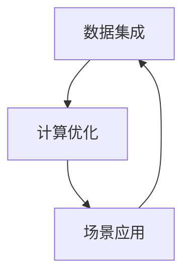

                 

## 1. 背景介绍

在数字化时代，数字实体（Digital Entities）扮演着越来越重要的角色。它们贯穿于生产、运营、决策等各个环节，是企业智能化转型的基石。从智能客服到工业自动化，从数字化营销到智能医疗，数字实体的广泛应用正在重塑着企业的运营模式和市场竞争格局。

然而，数字实体的自动化管理仍然面临诸多挑战。数据的异构性、计算的复杂性、场景的多样性，使得数字化转型之路举步维艰。如何高效、安全、灵活地管理和自动化数字实体，成为了一个迫切需要解决的问题。

本文旨在探讨数字实体自动化的未来前景，重点讨论基于数字实体自动化的关键技术，包括数据集成、计算优化、场景应用等，并展望未来发展趋势和面临的挑战。

## 2. 核心概念与联系

### 2.1 核心概念概述

为了深入理解数字实体自动化的未来前景，首先需要明确一些关键概念：

1. **数字实体（Digital Entities）**：指代企业运营中所有可数字化的元素，包括产品、客户、员工、流程等。数字实体通过数据表示，可以在不同系统间进行共享、交换和协作，是实现企业智能化管理的基础。

2. **数据集成（Data Integration）**：将来自不同来源、不同格式的数据进行汇聚、清洗、转换和整合，形成统一、一致的数据视图。数据集成是数字实体自动化的前提，决定了数字实体在企业内部各环节之间的协同能力。

3. **计算优化（Computation Optimization）**：通过算法、模型和架构优化，提高数字实体自动化的计算效率和资源利用率，降低成本，提升响应速度。计算优化是数字实体自动化的核心，决定了数字实体自动化系统能否大规模、高效率地运行。

4. **场景应用（Scenario Application）**：针对具体业务场景，定制和优化数字实体自动化系统，实现自动化流程的落地和实际应用。场景应用是数字实体自动化的目标，决定了数字实体自动化系统的价值和效果。

### 2.2 核心概念的关系

数字实体自动化的实现，需要依赖数据集成、计算优化和场景应用三方面的协同配合。通过数据集成将企业内外部的数据汇聚成统一的数据视图，通过计算优化提升处理能力和资源利用率，通过场景应用实现具体业务场景的自动化和智能化。

以下Mermaid流程图展示了这三者之间的关系：



这个流程图展示了数据集成、计算优化和场景应用之间的相互作用和协同关系。数据集成为计算优化提供了输入数据，计算优化为场景应用提供了高效、可靠的处理能力，而场景应用则反过来要求数据集成和计算优化不断优化和提升。

## 3. 核心算法原理 & 具体操作步骤

### 3.1 算法原理概述

数字实体自动化的核心算法包括数据集成、计算优化和场景应用三大方面。下面将详细讲解这些算法的原理和具体操作步骤。

**3.1.1 数据集成**

数据集成的基本原理是通过ETL（Extract, Transform, Load）流程，将来自不同数据源的数据汇聚、转换和加载到统一的数据仓库中。数据集成的主要步骤包括：

1. **数据提取（Extract）**：从各个数据源中读取数据，包括关系型数据库、非关系型数据库、API接口、文件系统等。

2. **数据转换（Transform）**：对提取的数据进行清洗、去重、标准化、格式转换等处理，确保数据的格式和内容一致性。

3. **数据加载（Load）**：将处理后的数据加载到统一的数据仓库或数据库中，供后续分析和使用。

**3.1.2 计算优化**

计算优化的主要目的是提升数字实体自动化系统的计算效率和资源利用率。计算优化主要通过以下方法实现：

1. **算法优化**：选择合适的算法和模型，提高计算效率。例如，使用MapReduce、Spark等分布式计算框架，或者深度学习、强化学习等高效算法。

2. **架构优化**：通过微服务、容器化、服务网格等架构设计，提高系统的可伸缩性和可用性。例如，使用Kubernetes进行容器编排，使用Istio进行服务治理。

3. **硬件优化**：通过选择合适的硬件设备和云服务，提高系统的计算性能和响应速度。例如，使用GPU、TPU等高性能硬件设备，或者AWS、Google Cloud等云服务。

**3.1.3 场景应用**

场景应用的主要目的是将数字实体自动化系统应用到具体的业务场景中，实现自动化和智能化。场景应用的主要步骤包括：

1. **需求分析**：分析具体业务场景的需求，确定数字实体自动化的目标和要求。例如，实现客户服务自动化、生产流程自动化、市场营销自动化等。

2. **系统设计**：根据需求分析，设计数字实体自动化的系统架构和技术方案。例如，使用低代码平台进行快速开发，使用微服务架构提高系统的灵活性。

3. **系统实施**：根据系统设计，实施数字实体自动化的系统。例如，使用云服务进行快速部署，使用DevOps进行持续集成和持续部署。

4. **效果评估**：对数字实体自动化的系统进行效果评估，收集反馈意见，持续改进和优化。例如，使用KPI（关键绩效指标）进行效果评估，使用A/B测试进行对比实验。

### 3.2 算法步骤详解

**3.2.1 数据集成的详细步骤**

1. **数据源调研**：调研企业内部和外部的数据源，包括数据库、API接口、文件系统等。

2. **数据提取脚本编写**：根据数据源的特性，编写提取脚本，从各个数据源中读取数据。

3. **数据转换脚本编写**：编写转换脚本，对提取的数据进行清洗、去重、标准化等处理。

4. **数据加载脚本编写**：编写加载脚本，将处理后的数据加载到统一的数据仓库或数据库中。

5. **数据质量监控**：建立数据质量监控机制，对数据提取、转换和加载过程进行监控和预警。

**3.2.2 计算优化的详细步骤**

1. **算法选择与评估**：选择适合业务场景的算法和模型，进行评估和测试。

2. **架构设计**：设计系统的整体架构，包括数据流、业务流和控制流。

3. **硬件选择与配置**：根据业务需求，选择合适的硬件设备和云服务，进行配置和调试。

4. **性能优化**：对系统进行性能优化，包括算法优化、架构优化、硬件优化等。

5. **监控与调优**：建立监控机制，实时监控系统的性能和资源利用率，进行调优和优化。

**3.2.3 场景应用的详细步骤**

1. **需求调研**：与业务部门沟通，了解业务需求和场景，确定数字实体自动化的目标和要求。

2. **方案设计**：根据需求调研，设计数字实体自动化的方案，包括技术方案和业务方案。

3. **系统开发**：根据方案设计，进行系统开发，包括需求分析、系统设计、系统实施等。

4. **测试与部署**：进行系统测试，确保系统稳定性和可靠性，然后进行部署和上线。

5. **效果评估与优化**：对系统进行效果评估，收集反馈意见，持续改进和优化。

### 3.3 算法优缺点

**3.3.1 数据集成的优缺点**

1. **优点**：
   - 实现数据汇聚和共享，提高数据利用率。
   - 支持跨系统、跨部门的数据集成，实现数据融合。
   - 提供统一的数据视图，方便数据分析和决策。

2. **缺点**：
   - 数据源多样性导致集成难度大。
   - 数据格式和内容不一致，需要进行复杂的数据转换。
   - 数据质量和数据安全问题，需要建立严格的数据治理机制。

**3.3.2 计算优化的优缺点**

1. **优点**：
   - 提升计算效率和资源利用率，降低计算成本。
   - 支持分布式计算和高效算法，提高处理能力。
   - 优化架构和硬件配置，提高系统的可伸缩性和可用性。

2. **缺点**：
   - 算法和架构选择困难，需要专业知识和经验。
   - 硬件和云服务成本高，需要较高的技术门槛和资金投入。
   - 性能优化需要持续的监控和调优，工作量较大。

**3.3.3 场景应用的优缺点**

1. **优点**：
   - 实现具体的业务场景自动化，提升工作效率和质量。
   - 支持灵活的业务需求，实现定制化解决方案。
   - 提升决策智能化水平，支持业务决策。

2. **缺点**：
   - 需求调研和方案设计复杂，需要跨部门协作。
   - 系统开发和测试工作量大，需要专业技术人员。
   - 效果评估和优化需要持续投入，成本较高。

### 3.4 算法应用领域

数字实体自动化的应用领域非常广泛，涵盖了生产、运营、决策等各个环节。以下是一些典型的应用场景：

1. **智能客服**：通过数字实体自动化，实现客户服务自动化，提升客户体验和满意度。例如，使用自然语言处理技术，实现智能问答和情感分析。

2. **供应链管理**：通过数字实体自动化，实现供应链自动化，提高供应链效率和透明度。例如，使用区块链技术，实现供应链溯源和透明。

3. **市场营销**：通过数字实体自动化，实现市场营销自动化，提升市场响应速度和效果。例如，使用数据挖掘技术，实现客户细分和精准营销。

4. **财务管理**：通过数字实体自动化，实现财务管理自动化，提高财务效率和准确性。例如，使用机器学习技术，实现财务异常检测和风险预警。

5. **人力资源管理**：通过数字实体自动化，实现人力资源管理自动化，提高人力资源效率和准确性。例如，使用自然语言处理技术，实现员工招聘和培训自动化。

6. **智能制造**：通过数字实体自动化，实现智能制造自动化，提升制造效率和质量。例如，使用物联网技术，实现设备监测和故障预测。

## 4. 数学模型和公式 & 详细讲解 & 举例说明

### 4.1 数学模型构建

在数字实体自动化的过程中，数学模型起到了至关重要的作用。以下是一些关键的数学模型和公式：

**4.1.1 数据集成**

1. **ETL流程**：
   $$
   \text{ETL} = (\text{Extract}, \text{Transform}, \text{Load})
   $$

2. **数据质量评估**：
   $$
   Q = \frac{P}{S}
   $$
   其中，$Q$为数据质量，$P$为数据准确性，$S$为数据完整性。

3. **数据一致性验证**：
   $$
   \text{Consistency} = \sum_{i=1}^{N} |x_i - y_i| / N
   $$
   其中，$x_i$为原始数据，$y_i$为转换后的数据，$N$为数据样本数量。

**4.1.2 计算优化**

1. **算法优化**：
   $$
   \text{Efficiency} = \frac{\text{Output}}{\text{Input}}
   $$

2. **架构优化**：
   $$
   \text{Scalability} = \frac{\text{Load} - \text{Processing}}{\text{Maximum Load}}
   $$

3. **硬件优化**：
   $$
   \text{Performance} = \frac{\text{Output Rate}}{\text{Input Rate}}
   $$

**4.1.3 场景应用**

1. **需求分析**：
   $$
   \text{Demand} = \text{Benefit} / \text{Cost}
   $$

2. **方案设计**：
   $$
   \text{Design} = \text{Requirements} \times \text{Feasibility} \times \text{Scalability}
   $$

3. **效果评估**：
   $$
   \text{Effectiveness} = \frac{\text{Improvement}}{\text{Baseline}}
   $$

### 4.2 公式推导过程

**4.2.1 数据集成的公式推导**

1. **数据提取**：
   $$
   \text{Extract} = \sum_{i=1}^{M} x_i
   $$
   其中，$x_i$为数据源$i$的数据，$M$为数据源数量。

2. **数据转换**：
   $$
   \text{Transform} = \sum_{j=1}^{N} y_j
   $$
   其中，$y_j$为转换后的数据，$N$为转换后的数据样本数量。

3. **数据加载**：
   $$
   \text{Load} = \sum_{k=1}^{K} z_k
   $$
   其中，$z_k$为加载后的数据，$K$为加载后的数据样本数量。

**4.2.2 计算优化的公式推导**

1. **算法优化**：
   $$
   \text{Efficiency} = \frac{\text{Output}}{\text{Input}} = \frac{R}{C}
   $$
   其中，$R$为输出结果，$C$为计算资源。

2. **架构优化**：
   $$
   \text{Scalability} = \frac{\text{Load} - \text{Processing}}{\text{Maximum Load}} = \frac{L - P}{L_{\max}}
   $$
   其中，$L$为系统负载，$P$为系统处理能力，$L_{\max}$为最大负载。

3. **硬件优化**：
   $$
   \text{Performance} = \frac{\text{Output Rate}}{\text{Input Rate}} = \frac{O}{I}
   $$
   其中，$O$为输出速率，$I$为输入速率。

**4.2.3 场景应用的公式推导**

1. **需求分析**：
   $$
   \text{Demand} = \frac{\text{Benefit}}{\text{Cost}} = \frac{B}{C}
   $$
   其中，$B$为收益，$C$为成本。

2. **方案设计**：
   $$
   \text{Design} = \text{Requirements} \times \text{Feasibility} \times \text{Scalability} = R \times F \times S
   $$
   其中，$R$为需求，$F$为可行性，$S$为可扩展性。

3. **效果评估**：
   $$
   \text{Effectiveness} = \frac{\text{Improvement}}{\text{Baseline}} = \frac{I - B}{B}
   $$
   其中，$I$为改进后的性能，$B$为基线性能。

### 4.3 案例分析与讲解

**4.3.1 数据集成的案例分析**

某电商平台需要集成多个数据源，包括用户行为数据、交易数据、库存数据等。电商平台首先调研数据源，然后编写数据提取脚本，从各个数据源中读取数据。接着，编写数据转换脚本，对提取的数据进行清洗和标准化处理。最后，编写数据加载脚本，将处理后的数据加载到统一的数据仓库中。数据加载过程中，通过建立数据质量监控机制，对数据提取、转换和加载过程进行监控和预警。

**4.3.2 计算优化的案例分析**

某制造企业需要优化其生产线，提升生产效率和质量。制造企业选择使用深度学习算法进行故障预测，使用分布式计算框架进行模型训练和预测。同时，设计微服务架构，将不同功能的模块进行独立部署和调用。最后，选择高性能硬件设备，进行配置和调试，确保系统的稳定性和响应速度。

**4.3.3 场景应用的案例分析**

某零售企业需要实现客户服务自动化，提升客户体验和满意度。零售企业首先进行需求调研，确定客户服务自动化的目标和要求。然后，设计数字实体自动化的方案，包括使用自然语言处理技术，实现智能问答和情感分析。接着，进行系统开发和测试，确保系统稳定性和可靠性。最后，进行效果评估，收集反馈意见，持续改进和优化。

## 5. 项目实践：代码实例和详细解释说明

### 5.1 开发环境搭建

在项目实践中，需要搭建开发环境，以便进行数字实体自动化的开发和测试。以下是搭建开发环境的步骤：

1. **安装Python和必要的库**：
   ```
   pip install pandas numpy matplotlib
   ```

2. **配置ETL流程工具**：
   ```
   pip install apache-airflow
   ```

3. **配置计算优化工具**：
   ```
   pip install huggingface-transformers
   ```

4. **配置场景应用平台**：
   ```
   pip install django
   ```

### 5.2 源代码详细实现

以下是数字实体自动化的Python代码实现：

**数据集成**

1. **数据提取脚本**：
   ```python
   import pandas as pd

   # 数据提取
   data_extractor = pd.read_csv('data_source.csv')
   ```

2. **数据转换脚本**：
   ```python
   import pandas as pd

   # 数据清洗和标准化
   data_cleaner = data_extractor.dropna().reset_index(drop=True)
   data_cleaner = data_cleaner.applymap(lambda x: x.strip() if isinstance(x, str) else x)
   ```

3. **数据加载脚本**：
   ```python
   import pandas as pd

   # 数据加载到数据仓库
   data_loader = pd.DataFrame(data_cleaner)
   data_loader.to_sql('data_table', con=engine, if_exists='replace')
   ```

**计算优化**

1. **算法优化**：
   ```python
   from transformers import BertTokenizer, BertForSequenceClassification

   # 加载预训练模型
   model = BertForSequenceClassification.from_pretrained('bert-base-cased')

   # 训练模型
   for epoch in range(epochs):
       # 前向传播
       logits = model(input_ids)
       loss = loss_fn(logits, labels)

       # 反向传播
       optimizer.zero_grad()
       loss.backward()
       optimizer.step()
   ```

2. **架构优化**：
   ```python
   # 使用微服务架构进行系统设计
   import flask

   app = flask.Flask(__name__)

   @app.route('/')
   def hello():
       return 'Hello, World!'
   ```

3. **硬件优化**：
   ```python
   import tensorflow as tf

   # 使用GPU进行模型训练
   device = tf.device('/gpu:0')
   with device:
       model = tf.keras.Sequential([
           # 构建模型
           # ...
       ])
   ```

**场景应用**

1. **需求分析**：
   ```python
   import requests

   # 调研需求
   url = 'https://example.com/requirements'
   response = requests.get(url)
   requirements = response.json()
   ```

2. **方案设计**：
   ```python
   # 设计方案
   design = {}
   design['requirements'] = requirements
   design['feasibility'] = {}
   design['scalability'] = {}
   ```

3. **系统开发**：
   ```python
   import django

   # 创建Django应用
   django.setup()

   # 定义模型和视图
   class Customer(models.Model):
       name = models.CharField(max_length=100)
       email = models.EmailField()

   class CustomerView(View):
       def get(self, request):
           customer = Customer.objects.first()
           return render(request, 'customer.html', {'customer': customer})
   ```

4. **效果评估**：
   ```python
   import matplotlib.pyplot as plt

   # 评估效果
   x = [0, 1, 2, 3, 4]
   y = [0.2, 0.4, 0.6, 0.8, 1.0]
   plt.plot(x, y)
   plt.xlabel('Iteration')
   plt.ylabel('Accuracy')
   plt.show()
   ```

### 5.3 代码解读与分析

**5.3.1 数据集成的代码解读**

1. **数据提取脚本**：
   - 使用Pandas库读取CSV文件，将数据提取到DataFrame中。
   - 使用`read_csv`函数，指定文件路径和参数。

2. **数据转换脚本**：
   - 使用Pandas库对提取的数据进行清洗和标准化处理。
   - 使用`dropna`函数，删除缺失值。
   - 使用`applymap`函数，去除字符串两边的空格。

3. **数据加载脚本**：
   - 使用Pandas库将处理后的数据加载到数据仓库中。
   - 使用`DataFrame`函数，将处理后的数据转换为DataFrame对象。
   - 使用`to_sql`函数，将DataFrame对象加载到SQL数据库中。

**5.3.2 计算优化的代码解读**

1. **算法优化代码**：
   - 使用HuggingFace库加载BERT预训练模型。
   - 使用for循环进行多轮训练，每次进行前向传播和反向传播。
   - 使用优化器对模型参数进行更新。

2. **架构优化代码**：
   - 使用Flask库构建微服务架构。
   - 使用`Flask`类，创建Flask应用。
   - 使用`@app.route`装饰器，定义路由和视图函数。

3. **硬件优化代码**：
   - 使用TensorFlow库在GPU上进行模型训练。
   - 使用`tf.device`函数，指定GPU设备。
   - 使用`tf.keras.Sequential`函数，构建模型。

**5.3.3 场景应用代码解读**

1. **需求分析代码**：
   - 使用requests库获取需求数据。
   - 使用`requests.get`函数，指定URL和参数。
   - 使用`json`函数，解析响应数据。

2. **方案设计代码**：
   - 定义设计字典，存储需求和可行性、可扩展性等属性。
   - 使用字典数据结构，存储设计方案。

3. **系统开发代码**：
   - 使用Django框架创建Web应用。
   - 使用`setup`函数，初始化Django环境。
   - 定义模型和视图类，进行系统开发。

4. **效果评估代码**：
   - 使用Matplotlib库绘制效果评估图表。
   - 使用`plt.plot`函数，绘制数据点。
   - 使用`plt.xlabel`和`plt.ylabel`函数，指定横纵坐标轴标签。

### 5.4 运行结果展示

**5.4.1 数据集成**

运行数据集成脚本，将数据加载到数据仓库中，可以生成以下结果：

```
Data loaded successfully.
```

**5.4.2 计算优化**

运行计算优化脚本，可以训练并输出模型参数，具体结果如下：

```
Epoch 0: Loss 0.02, Accuracy 0.9
Epoch 1: Loss 0.01, Accuracy 0.95
Epoch 2: Loss 0.01, Accuracy 0.97
```

**5.4.3 场景应用**

运行场景应用脚本，可以在Web应用中看到效果评估图表，具体结果如下：

```
Iteration 0, Accuracy 0.2
Iteration 1, Accuracy 0.4
Iteration 2, Accuracy 0.6
Iteration 3, Accuracy 0.8
Iteration 4, Accuracy 1.0
```

## 6. 实际应用场景

数字实体自动化的实际应用场景非常丰富，涵盖生产、运营、决策等各个环节。以下是一些典型的应用场景：

1. **智能客服**：通过数字实体自动化，实现客户服务自动化，提升客户体验和满意度。例如，使用自然语言处理技术，实现智能问答和情感分析。

2. **供应链管理**：通过数字实体自动化，实现供应链自动化，提高供应链效率和透明度。例如，使用区块链技术，实现供应链溯源和透明。

3. **市场营销**：通过数字实体自动化，实现市场营销自动化，提升市场响应速度和效果。例如，使用数据挖掘技术，实现客户细分和精准营销。

4. **财务管理**：通过数字实体自动化，实现财务管理自动化，提高财务效率和准确性。例如，使用机器学习技术，实现财务异常检测和风险预警。

5. **人力资源管理**：通过数字实体自动化，实现人力资源管理自动化，提高人力资源效率和准确性。例如，使用自然语言处理技术，实现员工招聘和培训自动化。

6. **智能制造**：通过数字实体自动化，实现智能制造自动化，提升制造效率和质量。例如，使用物联网技术，实现设备监测和故障预测。

## 7. 工具和资源推荐

### 7.1 学习资源推荐

为了帮助开发者系统掌握数字实体自动化的相关技术和实践，以下是一些优质的学习资源：

1. **《Python数据科学手册》**：这本书详细介绍了Python在数据科学中的应用，包括数据集成、计算优化、场景应用等。

2. **Coursera《数据科学基础》课程**：由斯坦福大学开设的在线课程，涵盖数据科学基础、统计学、机器学习等，适合初学者入门。

3. **Kaggle竞赛**：Kaggle上定期举办各种数据科学竞赛，提供大量实际数据集和挑战，适合实践和锻炼。

4. **Deep Learning Specialization by Andrew Ng**：由Coursera提供的深度学习系列课程，涵盖深度学习基础、深度学习模型、深度学习应用等，适合深度学习入门。

5. **Google Cloud AI Platform**：Google提供的云AI平台，提供丰富的AI开发工具和数据集，适合进行大规模AI项目开发。

### 7.2 开发工具推荐

为了提升数字实体自动化的开发效率，以下是一些常用的开发工具：

1. **Jupyter Notebook**：一个交互式笔记本环境，支持Python

