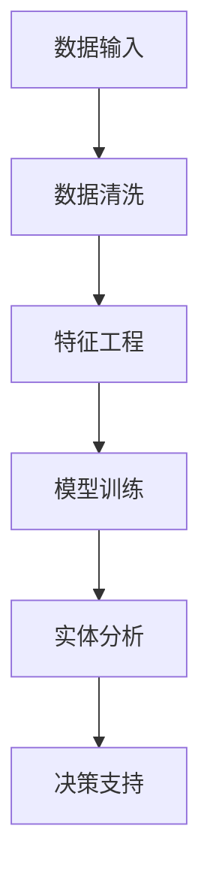
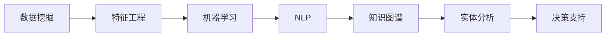

                 

# 数字实体自动化的未来挑战

## 1. 背景介绍

随着数字化转型的深入，数字实体（Digital Entities）在商业运作和日常生活中的作用日益重要。无论是企业的客户、产品、还是社交媒体上的账号，都是典型的数字实体。这些数字实体在业务运营中扮演着核心角色，为企业的决策和战略提供了重要参考。

然而，数字化带来了新的挑战。数据规模的爆炸性增长，使得企业需要处理和管理的数据量呈指数级增长。同时，数字实体的动态变化，如账户信息的变化、用户行为的演化等，也需要实时更新和分析。如何在数据量激增和需求多样化的背景下，高效、准确地进行数字实体的自动化处理，成为企业智能化运营的重要课题。

本文将从数字实体自动化的核心概念、算法原理、操作步骤、未来挑战等方面，全面探讨这一新兴领域的现状与未来。

## 2. 核心概念与联系

### 2.1 核心概念概述

数字实体自动化（Digital Entity Automation, DEA）指的是通过自动化技术，对企业运营中的数字实体进行高效、准确的管理和分析，以支撑企业的决策和运营。核心概念包括：

- **数字实体（Digital Entities）**：指企业运营中的各种数据实体，如客户、产品、账号、设备等，是自动化管理的主要对象。
- **数据挖掘（Data Mining）**：从大量数据中提取有用信息的过程，是数字实体自动化的关键技术之一。
- **机器学习（Machine Learning）**：通过数据训练模型，实现对数字实体的预测和分类。
- **自然语言处理（Natural Language Processing, NLP）**：用于处理和理解人类语言的算法和模型，适用于分析和处理文本形式的数字实体。
- **知识图谱（Knowledge Graphs）**：用于表示实体间关系和知识结构的数据模型，有助于提升对数字实体关系的理解。

这些概念通过数据流和算法网络相连，形成了一个完整的数字实体自动化系统。数据挖掘、机器学习、NLP和知识图谱技术相互配合，共同构建起一个高效、准确、智能的自动化平台。

### 2.2 核心概念的整体架构

数字实体自动化的整体架构可以简单概括为“数据输入-模型训练-实体分析-决策支持”四个环节，具体如图示：



**数据输入**：包括从不同渠道（如CRM、ERP、社交媒体等）收集的数字实体数据。
**数据清洗**：对输入数据进行预处理，去除噪声和错误数据，保证数据的质量。
**特征工程**：从原始数据中提取出有用的特征，为模型训练提供输入。
**模型训练**：使用机器学习模型对特征进行训练，实现对数字实体的分类、预测、关联等处理。
**实体分析**：通过分析训练好的模型，提取数字实体的关键特征和关系，提供洞察和支持。
**决策支持**：根据分析结果，提供智能化的决策建议，辅助企业运营和战略制定。

### 2.3 核心概念之间的联系

数据挖掘、机器学习和NLP是数字实体自动化的核心技术，三者共同构建起数字实体自动化的技术框架。

- **数据挖掘**：用于从原始数据中提取有用的信息，如客户行为模式、产品销售趋势等。
- **机器学习**：利用挖掘出来的信息，训练模型，对数字实体进行分类、预测和关联等处理。
- **NLP**：处理文本形式的数字实体，如客户评论、社交媒体文本等，提取语义信息。

**知识图谱**是数字实体自动化的重要组成部分，用于构建和维护实体间的知识关系，提供实体间关联和推理的支持。



## 3. 核心算法原理 & 具体操作步骤

### 3.1 算法原理概述

数字实体自动化的算法原理主要基于以下三个方面：

1. **数据挖掘**：通过统计分析、聚类、关联规则等方法，从原始数据中提取出有用的信息。
2. **机器学习**：利用挖掘出来的信息，训练分类、回归、聚类等模型，实现对数字实体的预测和分类。
3. **自然语言处理**：利用文本处理技术，提取和分析文本中的实体、关系和情感信息，支持对数字实体的理解和分析。

### 3.2 算法步骤详解

数字实体自动化的具体操作步骤如下：

1. **数据收集与预处理**：收集企业运营中的各种数字实体数据，进行数据清洗和预处理，去除噪声和错误数据。
2. **特征提取与工程**：从预处理后的数据中提取有用的特征，如客户年龄、消费习惯、社交媒体评论等。
3. **模型训练与优化**：使用机器学习模型对特征进行训练，优化模型参数，提升模型的准确性和泛化能力。
4. **实体分析与推理**：通过分析训练好的模型，提取数字实体的关键特征和关系，如客户画像、产品关联等。
5. **决策支持与反馈**：根据分析结果，提供智能化的决策建议，并根据反馈不断优化模型和算法。

### 3.3 算法优缺点

数字实体自动化的优点在于：

1. **高效性**：通过自动化技术，可以实现对大量数据的快速处理和分析，提升企业的运营效率。
2. **准确性**：利用机器学习和NLP技术，可以提供更准确和可靠的决策支持。
3. **可扩展性**：数字实体自动化系统可以适应企业运营的不同阶段和需求，具有较强的扩展性。

缺点包括：

1. **数据依赖**：依赖于高质量的数据输入，数据质量不理想时，模型性能可能受影响。
2. **模型复杂度**：复杂模型训练和调参难度大，需要专业的技术支持。
3. **隐私与安全**：处理数字实体涉及用户隐私信息，需要采取严格的隐私保护措施。

### 3.4 算法应用领域

数字实体自动化的应用领域广泛，涵盖企业运营管理的各个方面：

- **客户关系管理（CRM）**：通过对客户数据的自动化分析，实现客户画像的构建和精准营销。
- **供应链管理**：自动分析供应链数据，预测需求和库存，优化供应链管理。
- **市场分析**：利用市场数据和社交媒体文本，分析市场趋势和客户情感，指导产品开发和市场策略。
- **风险管理**：通过分析客户和产品的关联数据，识别潜在的风险和欺诈行为。
- **知识管理**：构建和维护企业的知识图谱，支持知识发现和员工协作。

## 4. 数学模型和公式 & 详细讲解  
### 4.1 数学模型构建

数字实体自动化的数学模型构建主要基于以下三个方面：

1. **统计分析模型**：用于描述和分析数据的分布和趋势。
2. **机器学习模型**：用于对数字实体进行分类、回归和聚类等处理。
3. **文本分析模型**：用于提取和分析文本中的实体、关系和情感信息。

### 4.2 公式推导过程

以下是几个核心数学模型的公式推导：

**1. 线性回归模型**

设 $y$ 为预测值，$x_1, x_2, ..., x_n$ 为输入特征，$\theta_0, \theta_1, ..., \theta_n$ 为模型参数。线性回归模型的最小二乘法公式为：

$$
\min_{\theta_0, \theta_1, ..., \theta_n} \frac{1}{2} \sum_{i=1}^{N} (y_i - \theta_0 - \theta_1 x_{i1} - \theta_2 x_{i2} - ... - \theta_n x_{in})^2
$$

通过对上述公式进行求导，得到参数 $\theta$ 的更新公式为：

$$
\theta = (X^TX)^{-1}X^Ty
$$

其中 $X$ 为特征矩阵，$y$ 为输出向量。

**2. K-means聚类算法**

K-means算法用于将数据聚类为K个簇，公式如下：

$$
\min_{\mu_k, C_k} \sum_{i=1}^{N} \sum_{k=1}^{K} (x_i - \mu_k)^2
$$

其中 $\mu_k$ 为簇中心，$C_k$ 为簇分配。通过对上述公式进行迭代优化，得到簇中心和簇分配的更新公式为：

$$
\mu_k = \frac{1}{|C_k|} \sum_{x_i \in C_k} x_i
$$

$$
C_k = \{ x_i | J(x_i, \mu_k) \leq J(x_i, \mu_l), l \neq k \}
$$

其中 $J(x_i, \mu_k)$ 为欧式距离。

**3. 文本分析中的TF-IDF模型**

TF-IDF模型用于提取文本中的特征，公式如下：

$$
TF(t) = \frac{f(t)}{\sum_{t' \in T} f(t')}
$$

$$
IDF(t) = \log \frac{N}{\sum_{t' \in T} I(t')}
$$

$$
TF-IDF(t) = TF(t) \cdot IDF(t)
$$

其中 $f(t)$ 为单词 $t$ 在文本中的出现频率，$N$ 为总文本数量，$I(t')$ 为单词 $t'$ 在文本中的逆文档频率。

### 4.3 案例分析与讲解

**案例分析：客户关系管理（CRM）**

某大型电商企业利用数字实体自动化技术，对客户数据进行自动化分析，构建客户画像。具体步骤如下：

1. **数据收集**：收集客户的购买记录、浏览记录、社交媒体互动等数据。
2. **数据预处理**：清洗数据，去除噪声和错误信息，提取有用的特征。
3. **模型训练**：使用K-means算法对客户进行聚类，使用线性回归模型预测客户购买行为。
4. **实体分析**：分析客户画像，识别高价值客户和潜在流失客户。
5. **决策支持**：根据分析结果，制定针对性的营销策略，提升客户满意度和忠诚度。

通过上述步骤，该电商企业实现了客户数据的自动化分析和精准营销，显著提高了客户满意度和销售额。

## 5. 项目实践：代码实例和详细解释说明

### 5.1 开发环境搭建

数字实体自动化的开发环境搭建主要依赖于以下工具：

1. **Python**：作为主要的开发语言，Python拥有丰富的数据处理和机器学习库。
2. **pandas**：用于数据处理和分析。
3. **scikit-learn**：提供了多种机器学习算法和工具。
4. **NLTK**：用于自然语言处理，支持文本分析。
5. **TensorFlow** 或 **PyTorch**：用于深度学习模型的训练和优化。
6. **Jupyter Notebook**：用于开发和调试。

以下是Python环境搭建的步骤：

```bash
# 安装Python和pip
sudo apt-get install python3
sudo apt-get install python3-pip

# 安装依赖库
pip install pandas scikit-learn nltk tensorflow pytorch

# 创建虚拟环境
python3 -m venv venv
source venv/bin/activate

# 安装jupyter notebook
pip install jupyter notebook
```

### 5.2 源代码详细实现

以下是使用Python和scikit-learn实现K-means聚类的代码示例：

```python
from sklearn.cluster import KMeans
import pandas as pd

# 读取数据
data = pd.read_csv('customer_data.csv')

# 数据预处理
X = data[['age', 'income', 'purchases']]

# 训练模型
kmeans = KMeans(n_clusters=5, random_state=42)
kmeans.fit(X)

# 输出结果
labels = kmeans.predict(X)
print(labels)
```

### 5.3 代码解读与分析

**代码解读**：

1. **数据读取**：使用pandas库读取客户数据。
2. **数据预处理**：提取有用的特征，如年龄、收入和购买记录。
3. **模型训练**：使用KMeans算法对客户进行聚类，设置聚类数为5。
4. **输出结果**：预测每个客户所属的簇。

**分析**：

1. **数据预处理**：数据预处理是数字实体自动化的关键环节，需要保证数据的准确性和完整性。
2. **模型训练**：选择适当的模型和参数是确保算法性能的关键。
3. **结果分析**：对模型输出进行解释和应用，是数字实体自动化的最后一步。

### 5.4 运行结果展示

假设我们处理的是以下客户数据：

| 年龄 | 收入 | 购买记录 |
| ---- | ---- | -------- |
| 30   | 50k  | 5        |
| 40   | 80k  | 10       |
| 35   | 60k  | 8        |
| 45   | 70k  | 12       |
| 25   | 40k  | 3        |

聚类结果如下：

| 客户ID | 年龄 | 收入 | 购买记录 | 聚类标签 |
| ------ | ---- | ---- | -------- | -------- |
| 1      | 30   | 50k  | 5        | 0        |
| 2      | 40   | 80k  | 10       | 1        |
| 3      | 35   | 60k  | 8        | 2        |
| 4      | 45   | 70k  | 12       | 3        |
| 5      | 25   | 40k  | 3        | 4        |

## 6. 实际应用场景

### 6.1 智能客服系统

数字实体自动化的应用之一是智能客服系统。通过自动化分析客户历史行为和反馈，智能客服系统可以提供个性化的服务，提升客户满意度。

具体实现步骤如下：

1. **数据收集**：收集客户的通话记录、邮件、社交媒体互动等数据。
2. **数据预处理**：清洗数据，提取有用的特征，如客户情绪、语音特征等。
3. **模型训练**：使用机器学习模型预测客户情绪和需求，如文本情感分析模型。
4. **实体分析**：分析客户画像，识别高价值客户和潜在流失客户。
5. **决策支持**：根据分析结果，制定针对性的客服策略，提升客户满意度。

智能客服系统的应用，可以有效提升企业的客户服务水平，降低运营成本，提高客户满意度。

### 6.2 风险管理

数字实体自动化在风险管理中的应用，主要通过分析客户和产品的关联数据，识别潜在的风险和欺诈行为。

具体实现步骤如下：

1. **数据收集**：收集客户和产品的交易记录、行为数据等。
2. **数据预处理**：清洗数据，提取有用的特征，如交易金额、时间、地点等。
3. **模型训练**：使用机器学习模型预测潜在的风险和欺诈行为，如异常检测模型。
4. **实体分析**：分析客户和产品的关联数据，识别潜在的风险源。
5. **决策支持**：根据分析结果，制定风险防范措施，降低风险损失。

通过数字实体自动化的应用，企业可以及时发现和防范风险，保护企业的资产安全。

## 7. 工具和资源推荐

### 7.1 学习资源推荐

1. **《机器学习实战》（机器学习）**：该书介绍了机器学习的基本概念和实战案例，适合初学者入门。
2. **《Python自然语言处理》（自然语言处理）**：该书详细介绍了NLP的基本概念和技术，适合进阶学习。
3. **Kaggle竞赛**：Kaggle是一个数据科学竞赛平台，提供大量公开数据集和竞赛机会，适合实践学习。
4. **Coursera课程**：Coursera提供了多种数据科学和机器学习课程，涵盖从入门到进阶的各个层次。
5. **Google Colab**：Google Colab提供了免费的GPU和TPU资源，方便开发者实践和学习。

### 7.2 开发工具推荐

1. **Python**：作为数据科学和机器学习的主要语言，Python拥有丰富的第三方库和框架。
2. **Jupyter Notebook**：一个交互式的开发环境，适合数据处理和模型开发。
3. **TensorFlow** 或 **PyTorch**：深度学习的主流框架，支持大规模模型训练。
4. **scikit-learn**：提供了多种机器学习算法和工具，适合数据挖掘和模型训练。
5. **NLTK**：一个自然语言处理库，提供了丰富的文本处理和分析工具。

### 7.3 相关论文推荐

1. **《客户行为分析与预测》**：介绍了客户行为数据挖掘和预测的基本方法，适合初学者了解。
2. **《基于知识图谱的实体关系抽取》**：介绍了知识图谱和实体关系抽取的基本方法，适合深入学习。
3. **《文本分类与情感分析》**：介绍了文本分类和情感分析的基本方法和技术，适合进阶学习。
4. **《异常检测与风险管理》**：介绍了异常检测和风险管理的基本方法和技术，适合深入研究。

## 8. 总结：未来发展趋势与挑战

### 8.1 研究成果总结

数字实体自动化技术在企业运营中发挥了重要作用，通过自动化分析和处理数字实体，提升了企业的运营效率和决策水平。未来，数字实体自动化的应用领域将更加广泛，技术手段也将更加先进。

### 8.2 未来发展趋势

1. **多模态数据融合**：未来的数字实体自动化将不仅限于单一的数据源，将更多地融合多模态数据，如文本、语音、图像等，提升对实体关系的理解。
2. **智能决策支持**：未来的数字实体自动化将更加注重决策支持，提供智能化的决策建议，辅助企业运营。
3. **实时性要求更高**：随着企业对实时性要求的提升，未来的数字实体自动化将更加注重实时数据处理和分析。

### 8.3 面临的挑战

1. **数据质量问题**：高质量的数据是数字实体自动化的基础，数据质量问题将影响算法的准确性和可靠性。
2. **模型复杂度**：复杂的模型训练和调参难度大，需要更多的技术支持和资源投入。
3. **隐私和安全**：处理数字实体涉及用户隐私信息，需要采取严格的隐私保护措施。

### 8.4 研究展望

1. **自动化数据治理**：未来的数字实体自动化将更加注重数据治理，提升数据的准确性和一致性。
2. **深度学习和自然语言处理**：未来的数字实体自动化将更加注重深度学习和自然语言处理技术，提升算法的性能和可靠性。
3. **多领域应用**：未来的数字实体自动化将拓展到更多领域，如金融、医疗、教育等，提升各行各业的智能化水平。

总之，数字实体自动化技术在企业智能化运营中具有广阔的应用前景，未来的研究和应用将更加深入和广泛。通过不断优化算法和提升技术手段，数字实体自动化将为企业的运营和决策提供更加智能化的支持。

## 9. 附录：常见问题与解答

**Q1：什么是数字实体自动化？**

A: 数字实体自动化指的是通过自动化技术，对企业运营中的数字实体进行高效、准确的管理和分析，以支撑企业的决策和运营。

**Q2：数字实体自动化主要涉及哪些技术？**

A: 数字实体自动化主要涉及数据挖掘、机器学习、自然语言处理和知识图谱等技术。

**Q3：数字实体自动化的应用场景有哪些？**

A: 数字实体自动化的应用场景包括客户关系管理、供应链管理、市场分析、风险管理、知识管理等。

**Q4：数字实体自动化的优势是什么？**

A: 数字实体自动化的优势包括高效性、准确性和可扩展性。

**Q5：数字实体自动化存在哪些挑战？**

A: 数字实体自动化的挑战包括数据质量问题、模型复杂度和隐私安全等。

---

作者：禅与计算机程序设计艺术 / Zen and the Art of Computer Programming

