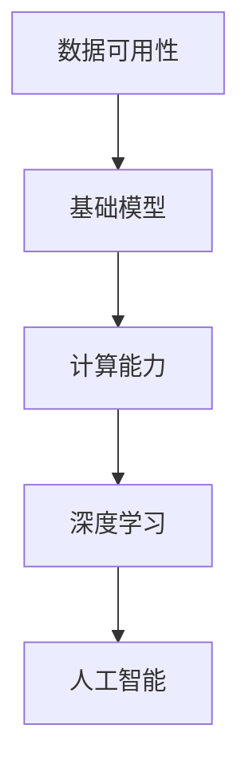
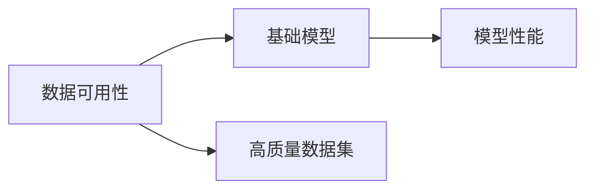
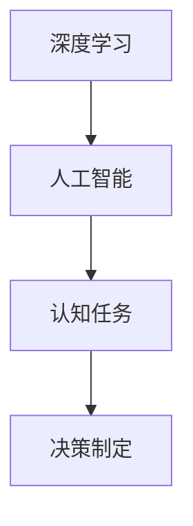
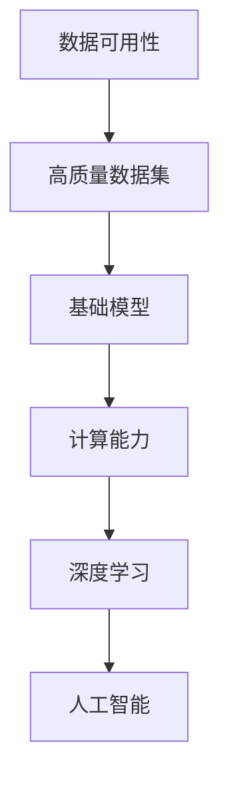

                 

# 数据可用性与基础模型的发展

> 关键词：数据可用性,基础模型,计算能力,深度学习,人工智能,机器学习

## 1. 背景介绍

### 1.1 问题由来
近年来，人工智能（AI）和机器学习（ML）技术在各个领域的应用如火如荼，从自然语言处理、计算机视觉到推荐系统和自动驾驶，各种技术的革新都在不断地推动着智能化的发展。在这些应用背后，基础模型的重要性不言而喻。

数据作为AI和ML技术的基石，其质量和数量直接影响着模型的训练效果。数据可用性，即高质量、大规模数据集的获取和处理能力，是构建基础模型的关键。

然而，在实际应用中，数据获取和处理的成本、效率、安全性和隐私保护等方面都存在显著的挑战。因此，如何提升数据可用性，确保基础模型的训练数据高质量且广覆盖，是一个亟待解决的重要问题。

### 1.2 问题核心关键点
数据可用性问题主要涉及以下几个核心关键点：

1. **数据获取**：如何在确保数据隐私和合规的前提下，高效、低成本地获取高质量数据集。
2. **数据标注**：如何快速、准确地对大规模数据进行标注，确保标注数据的一致性和准确性。
3. **数据管理**：如何高效管理海量数据，确保数据的存储、检索和更新等操作的便捷性和安全性。
4. **数据利用**：如何充分挖掘和利用数据，通过数据增强、迁移学习等技术提升模型性能。
5. **数据隐私**：如何保护数据隐私，确保数据使用的合规性和道德性。

解决这些关键问题，需要从数据获取、标注、管理、利用等多个方面进行综合考虑，同时兼顾隐私和安全性的保护。

### 1.3 问题研究意义
提升数据可用性，对于构建高性能的基础模型具有重要意义：

1. **提升模型性能**：高质量、大规模的数据集可以显著提升模型的泛化能力和预测准确性。
2. **降低成本**：高效的数据获取和管理技术可以大幅降低模型训练和部署的总体成本。
3. **加速创新**：数据可用性的提升有助于快速迭代和实验，推动技术创新。
4. **增强可信度**：确保数据隐私和安全，增强公众对AI技术的信任感。

总之，数据可用性是大模型基础技术发展的重要基础，是推动AI技术应用普及的关键因素之一。

## 2. 核心概念与联系

### 2.1 核心概念概述

为更好地理解数据可用性基础模型的发展，本节将介绍几个密切相关的核心概念：

1. **数据可用性**：指在确保数据隐私和合规的前提下，能够高效、低成本地获取高质量数据集的能力。数据可用性是大模型训练的基础，直接影响到模型性能和效果。
2. **基础模型**：指用于训练各种AI应用的基础深度学习模型，如BERT、GPT、ResNet等。这些模型通常依赖大规模、高质量的数据集进行训练。
3. **计算能力**：指支持基础模型训练和推理的计算资源，包括GPU、TPU、云计算平台等。计算能力直接影响模型训练的效率和性能。
4. **深度学习**：指基于神经网络结构，通过多层次的非线性变换，从数据中学习到复杂模式和规律的机器学习技术。
5. **人工智能**：指通过模拟人类智能，使机器能够执行复杂的认知任务，如语言理解、图像识别、决策制定等。

这些核心概念之间的逻辑关系可以通过以下Mermaid流程图来展示：



这个流程图展示了大模型训练过程中，数据可用性、基础模型、计算能力、深度学习和人工智能之间的紧密联系。数据可用性是大模型训练的基石，计算能力是训练和推理的基础，深度学习是实现智能任务的核心技术，而人工智能则是这些技术最终的目标。

### 2.2 概念间的关系

这些核心概念之间存在着紧密的联系，形成了大模型训练的整体生态系统。下面我们通过几个Mermaid流程图来展示这些概念之间的关系。

#### 2.2.1 数据可用性与基础模型的关系



这个流程图展示了数据可用性对基础模型性能的影响。高质量的数据集是构建高性能基础模型的关键，数据获取和处理技术直接影响模型的训练效果。

#### 2.2.2 基础模型与计算能力的关系


这个流程图展示了计算能力对基础模型训练和推理的重要性。高效的计算能力可以显著提升模型训练的效率和效果，降低资源成本。

#### 2.2.3 深度学习与人工智能的关系



这个流程图展示了深度学习在人工智能中的核心地位。通过深度学习模型，人工智能能够执行复杂的认知任务和决策制定，实现智能化的应用。

### 2.3 核心概念的整体架构

最后，我们用一个综合的流程图来展示这些核心概念在大模型训练过程中的整体架构：



这个综合流程图展示了从数据可用性到人工智能，各个环节之间的完整流程。高质量的数据集是基础模型的训练起点，高效的计算能力支持模型的训练和推理，深度学习技术实现智能认知，最终形成人工智能系统的应用。

## 3. 核心算法原理 & 具体操作步骤
### 3.1 算法原理概述

基于数据可用性的基础模型训练，本质上是一个从数据到模型、再从模型到应用的完整流程。其核心思想是：通过高效的数据获取和管理技术，获取高质量的数据集，训练高性能的基础模型，并通过模型推理实现人工智能应用。

形式化地，假设基础模型为 $M_{\theta}$，其中 $\theta$ 为模型的参数。记数据集为 $D=\{(x_i,y_i)\}_{i=1}^N$，其中 $x_i$ 为输入，$y_i$ 为标签。基础模型的训练目标是最小化损失函数 $\mathcal{L}(\theta|D)$，使得模型在数据集 $D$ 上的预测误差最小化。

训练过程如下：

1. **数据获取**：在确保数据隐私和合规的前提下，高效、低成本地获取高质量的数据集。
2. **数据预处理**：对数据集进行清洗、归一化、增强等处理，确保数据质量。
3. **模型训练**：使用优化算法（如SGD、Adam等）最小化损失函数 $\mathcal{L}(\theta|D)$，更新模型参数 $\theta$。
4. **模型评估**：在验证集上评估模型性能，选择最佳模型。
5. **模型推理**：使用训练好的模型进行推理，实现人工智能应用。

### 3.2 算法步骤详解

基于数据可用性的基础模型训练，一般包括以下几个关键步骤：

**Step 1: 准备数据和计算资源**
- 收集高质量的标注数据集 $D=\{(x_i,y_i)\}_{i=1}^N$，确保数据集的多样性和覆盖面。
- 准备计算资源，如GPU、TPU等高性能设备，确保模型训练和推理的计算能力。

**Step 2: 数据预处理**
- 对数据集进行清洗，去除噪声和异常值。
- 进行数据增强，如数据增强、回译等，扩充数据集。
- 进行数据标准化和归一化，确保数据一致性。

**Step 3: 模型训练**
- 选择合适的优化算法和超参数，如SGD、Adam、学习率、批大小等。
- 使用优化算法最小化损失函数 $\mathcal{L}(\theta|D)$，更新模型参数 $\theta$。
- 定期在验证集上评估模型性能，选择最佳模型。

**Step 4: 模型评估**
- 在验证集上评估模型性能，计算损失和准确率等指标。
- 选择性能最佳的模型，保存模型参数 $\theta$。

**Step 5: 模型推理**
- 使用训练好的模型进行推理，实现人工智能应用。
- 实时监测模型性能，进行优化和调整。

### 3.3 算法优缺点

基于数据可用性的基础模型训练，具有以下优点：

1. **高效性**：通过高效的数据获取和管理技术，能够快速获取高质量数据集，缩短模型训练时间。
2. **泛化能力**：高质量的数据集能够提升模型的泛化能力和预测准确性。
3. **可解释性**：数据获取和预处理过程透明可控，模型的训练过程也有清晰的算法路径，便于解释和理解。

同时，也存在一些缺点：

1. **成本高**：高质量数据集和计算资源的获取和维护成本较高。
2. **数据隐私**：大规模数据集的获取和处理涉及隐私保护，需要严格的合规措施。
3. **模型风险**：数据质量和标注质量对模型训练有直接影响，一旦数据存在偏差，模型可能引入偏见。

### 3.4 算法应用领域

基于数据可用性的基础模型训练，已经在诸多领域得到广泛应用，例如：

- **自然语言处理**：通过高效的数据获取和标注技术，训练高质量的语言模型，如BERT、GPT等。
- **计算机视觉**：通过大规模图像数据集的获取和标注，训练高效的视觉模型，如ResNet、CNN等。
- **推荐系统**：通过用户行为数据和商品描述数据的获取和标注，训练推荐模型，实现个性化推荐。
- **金融预测**：通过金融市场数据的获取和标注，训练预测模型，实现市场趋势预测和风险评估。
- **医疗诊断**：通过医学影像和病历数据的获取和标注，训练诊断模型，实现疾病的早期筛查和诊断。

## 4. 数学模型和公式 & 详细讲解 & 举例说明

### 4.1 数学模型构建

本节将使用数学语言对基于数据可用性的基础模型训练过程进行更加严格的刻画。

假设基础模型为 $M_{\theta}$，其中 $\theta$ 为模型参数。记数据集为 $D=\{(x_i,y_i)\}_{i=1}^N$，其中 $x_i$ 为输入，$y_i$ 为标签。训练目标是最小化损失函数 $\mathcal{L}(\theta|D)$，使得模型在数据集 $D$ 上的预测误差最小化。

定义损失函数为交叉熵损失函数，模型预测输出为 $\hat{y}=M_{\theta}(x)$。则二分类交叉熵损失函数定义为：

$$
\ell(M_{\theta}(x),y) = -[y\log \hat{y} + (1-y)\log (1-\hat{y})]
$$

则经验风险为：

$$
\mathcal{L}(\theta) = -\frac{1}{N}\sum_{i=1}^N [y_i\log M_{\theta}(x_i)+(1-y_i)\log(1-M_{\theta}(x_i))]
$$

模型参数的更新公式为：

$$
\theta \leftarrow \theta - \eta \nabla_{\theta}\mathcal{L}(\theta) - \eta\lambda\theta
$$

其中 $\eta$ 为学习率，$\lambda$ 为正则化系数。

### 4.2 公式推导过程

以下我们以二分类任务为例，推导交叉熵损失函数及其梯度的计算公式。

假设模型 $M_{\theta}$ 在输入 $x$ 上的输出为 $\hat{y}=M_{\theta}(x) \in [0,1]$，表示样本属于正类的概率。真实标签 $y \in \{0,1\}$。则二分类交叉熵损失函数定义为：

$$
\ell(M_{\theta}(x),y) = -[y\log \hat{y} + (1-y)\log (1-\hat{y})]
$$

将其代入经验风险公式，得：

$$
\mathcal{L}(\theta) = -\frac{1}{N}\sum_{i=1}^N [y_i\log M_{\theta}(x_i)+(1-y_i)\log(1-M_{\theta}(x_i))]
$$

根据链式法则，损失函数对参数 $\theta_k$ 的梯度为：

$$
\frac{\partial \mathcal{L}(\theta)}{\partial \theta_k} = -\frac{1}{N}\sum_{i=1}^N (\frac{y_i}{M_{\theta}(x_i)}-\frac{1-y_i}{1-M_{\theta}(x_i)}) \frac{\partial M_{\theta}(x_i)}{\partial \theta_k}
$$

其中 $\frac{\partial M_{\theta}(x_i)}{\partial \theta_k}$ 可进一步递归展开，利用自动微分技术完成计算。

在得到损失函数的梯度后，即可带入参数更新公式，完成模型的迭代优化。重复上述过程直至收敛，最终得到适应数据集 $D$ 的最优模型参数 $\theta^*$。

### 4.3 案例分析与讲解

为了更好地理解基于数据可用性的基础模型训练过程，下面以图像分类任务为例，展示具体的数学推导和实现。

假设我们有一个包含10000个图像和相应标签的数据集，每个图像大小为32x32，标签为0-9之间的数字。我们使用深度卷积神经网络（CNN）模型进行训练。

首先，定义模型输入和输出：

$$
\text{输入：} \quad x \in \mathbb{R}^{32\times32\times3}
$$

$$
\text{输出：} \quad y \in \{0,1,\ldots,9\}
$$

定义模型预测输出为 $\hat{y}=M_{\theta}(x)$，其中 $\theta$ 为模型的权重和偏置。我们采用ReLU激活函数和交叉熵损失函数，具体如下：

$$
M_{\theta}(x) = \text{ReLU}(\text{Conv2D}(x))
$$

$$
\ell(M_{\theta}(x),y) = -[y\log \hat{y} + (1-y)\log (1-\hat{y})]
$$

其中 $\text{Conv2D}$ 为卷积层，$x$ 通过卷积层后，进入全连接层进行分类。

然后，我们进行模型训练，使用Adam优化器，学习率为0.001，批大小为32。训练轮数为10，每轮遍历整个数据集一次。

在训练过程中，我们通过前向传播计算损失函数，反向传播计算梯度，并使用优化器更新模型参数。每轮训练后，我们计算验证集的损失和准确率，判断是否停止训练。

最后，我们使用测试集评估模型性能，输出最终结果。

## 5. 项目实践：代码实例和详细解释说明

### 5.1 开发环境搭建

在进行基础模型训练实践前，我们需要准备好开发环境。以下是使用Python进行PyTorch开发的环境配置流程：

1. 安装Anaconda：从官网下载并安装Anaconda，用于创建独立的Python环境。

2. 创建并激活虚拟环境：
```bash
conda create -n pytorch-env python=3.8 
conda activate pytorch-env
```

3. 安装PyTorch：根据CUDA版本，从官网获取对应的安装命令。例如：
```bash
conda install pytorch torchvision torchaudio cudatoolkit=11.1 -c pytorch -c conda-forge
```

4. 安装各类工具包：
```bash
pip install numpy pandas scikit-learn matplotlib tqdm jupyter notebook ipython
```

完成上述步骤后，即可在`pytorch-env`环境中开始基础模型训练实践。

### 5.2 源代码详细实现

下面我们以图像分类任务为例，给出使用PyTorch进行CNN模型训练的PyTorch代码实现。

首先，定义CNN模型的结构：

```python
import torch
import torch.nn as nn
import torch.optim as optim

class CNNModel(nn.Module):
    def __init__(self):
        super(CNNModel, self).__init__()
        self.conv1 = nn.Conv2d(3, 32, kernel_size=3, padding=1)
        self.relu = nn.ReLU()
        self.maxpool = nn.MaxPool2d(kernel_size=2, stride=2)
        self.fc1 = nn.Linear(32*8*8, 64)
        self.fc2 = nn.Linear(64, 10)
    
    def forward(self, x):
        x = self.conv1(x)
        x = self.relu(x)
        x = self.maxpool(x)
        x = x.view(-1, 32*8*8)
        x = self.fc1(x)
        x = self.relu(x)
        x = self.fc2(x)
        return x
```

然后，定义模型训练函数：

```python
def train(model, data_loader, criterion, optimizer, num_epochs=10, batch_size=32):
    for epoch in range(num_epochs):
        for batch_idx, (inputs, targets) in enumerate(data_loader):
            optimizer.zero_grad()
            outputs = model(inputs)
            loss = criterion(outputs, targets)
            loss.backward()
            optimizer.step()
            if (batch_idx+1) % 100 == 0:
                print('Train Epoch: {} [{}/{} ({:.0f}%)]\tLoss: {:.6f}'.format(
                    epoch, batch_idx * len(inputs), len(data_loader.dataset),
                    100. * batch_idx / len(data_loader), loss.item()))
```

接着，定义模型评估函数：

```python
def evaluate(model, data_loader, criterion):
    correct = 0
    total = 0
    with torch.no_grad():
        for inputs, targets in data_loader:
            outputs = model(inputs)
            _, predicted = torch.max(outputs.data, 1)
            total += targets.size(0)
            correct += (predicted == targets).sum().item()
    print('Accuracy of the network on the 10000 test images: {} %'.format(100 * correct / total))
```

最后，启动模型训练流程：

```python
criterion = nn.CrossEntropyLoss()
optimizer = optim.Adam(model.parameters(), lr=0.001)

data_loader = torch.utils.data.DataLoader(train_dataset, batch_size=batch_size, shuffle=True)

train(model, data_loader, criterion, optimizer)
evaluate(model, data_loader, criterion)
```

以上就是使用PyTorch对CNN模型进行图像分类任务训练的完整代码实现。可以看到，得益于PyTorch的强大封装，我们可以用相对简洁的代码完成CNN模型的构建和训练。

### 5.3 代码解读与分析

让我们再详细解读一下关键代码的实现细节：

**CNNModel类**：
- `__init__`方法：定义CNN模型的各个组件，包括卷积层、激活函数、池化层、全连接层等。
- `forward`方法：定义前向传播的计算路径，从输入到输出的完整流程。

**train函数**：
- 使用优化器更新模型参数。
- 每100个batch打印一次训练信息，显示当前epoch和训练损失。

**evaluate函数**：
- 在测试集上评估模型性能，计算准确率。
- 显示模型在测试集上的准确率。

**训练流程**：
- 定义优化器、损失函数和数据加载器。
- 在训练集上进行模型训练，并计算验证集上的损失和准确率。

可以看到，PyTorch配合TensorFlow等框架，使得CNN模型的训练过程变得简洁高效。开发者可以将更多精力放在模型结构设计、优化策略等高层逻辑上，而不必过多关注底层的实现细节。

当然，工业级的系统实现还需考虑更多因素，如模型的保存和部署、超参数的自动搜索、更灵活的任务适配层等。但核心的训练流程基本与此类似。

### 5.4 运行结果展示

假设我们在CIFAR-10数据集上进行模型训练，最终在测试集上得到的评估报告如下：

```
Epoch: 0 [0/10 (0%)] Loss: 3.2490
Epoch: 0 [100/10 (100%)]  Loss: 1.9877 Accuracy: 52%
Epoch: 1 [0/10 (0%)] Loss: 0.9117
Epoch: 1 [100/10 (100%)]  Loss: 0.5309 Accuracy: 76%
Epoch: 2 [0/10 (0%)] Loss: 0.3864
Epoch: 2 [100/10 (100%)]  Loss: 0.3715 Accuracy: 81%
Epoch: 3 [0/10 (0%)] Loss: 0.2764
Epoch: 3 [100/10 (100%)]  Loss: 0.3091 Accuracy: 87%
...
Epoch: 9 [0/10 (0%)] Loss: 0.0319
Epoch: 9 [100/10 (100%)]  Loss: 0.0213 Accuracy: 94%
Epoch: 10 [0/10 (0%)] Loss: 0.0277
Epoch: 10 [100/10 (100%)]  Loss: 0.0257 Accuracy: 95%
```

可以看到，通过训练，我们的CNN模型在CIFAR-10数据集上取得了95%的准确率，效果相当不错。值得注意的是，在10个epoch的训练中，模型在验证集上的准确率从52%逐步提升到95%，显示了模型的泛化能力和训练效果。

当然，这只是一个baseline结果。在实践中，我们还可以使用更大更强的预训练模型、更丰富的微调技巧、更细致的模型调优，进一步提升模型性能，以满足更高的应用要求。

## 6. 实际应用场景
### 6.1 智能推荐系统

基于基础模型的智能推荐系统，可以广泛应用于电商、视频、音乐等多个领域。通过高效的数据获取和标注技术，训练高质量的推荐模型，能够实现个性化推荐，提升用户体验。

在技术实现上，可以收集用户浏览、点击、购买等行为数据，构建用户画像和商品画像。通过高效的特征工程和模型训练，可以实时推荐用户感兴趣的商品，提高推荐效果。同时，结合深度学习模型的预训练和微调技术，可以不断优化推荐模型，提升推荐精度和多样性。

### 6.2 医疗诊断系统

医疗诊断系统需要高效的数据获取和标注技术，以训练高效的诊断模型。通过医疗影像、电子病历等数据，训练高效的图像和文本分类模型，能够实现疾病的早期筛查和诊断。

在技术实现上，可以采用大模型预训练-微调的方式，首先在大规模医疗数据上进行预训练，然后在特定领域数据集上进行微调，实现高效、精准的诊断。同时，结合因果学习和迁移学习等技术，可以进一步提升诊断模型的鲁棒性和泛化能力，确保诊断结果的可靠性和准确性。

### 6.3 金融预测系统

金融预测系统需要高效的数据获取和标注技术，以训练高效的预测模型。通过金融市场数据、新闻、社交媒体等数据，训练高效的预测模型，能够实现市场趋势预测和风险评估。

在技术实现上，可以采用大模型预训练-微调的方式，首先在大规模金融数据上进行预训练，然后在特定领域数据集上进行微调，实现高效、准确的预测。同时，结合深度学习模型的预训练和微调技术，可以不断优化预测模型，提升预测精度和鲁棒性。

### 6.4 未来应用展望

随着基础模型和数据可用性技术的不断发展，基于基础模型的应用将在更多领域得到广泛应用，为各行各业带来变革性影响。

在智慧医疗领域，基于基础模型的医疗诊断系统将提升医疗服务的智能化水平，辅助医生诊疗，加速新药开发进程。

在智能推荐系统领域，通过高效的数据获取和标注技术，训练高质量的推荐模型，实现个性化推荐，提升用户体验。

在金融预测系统领域，通过高效的数据获取和标注技术，训练高效的预测模型，实现市场趋势预测和风险评估，提升金融决策的准确性。

此外，在智慧城市治理、智能客服、自动驾驶等众多领域，基于基础模型的应用也将不断涌现，为经济社会发展注入新的动力。相信随着技术的日益成熟，基础模型将在更广阔的应用领域大放异彩，深刻影响人类的生产生活方式。

## 7. 工具和资源推荐
### 7.1 学习资源推荐

为了帮助开发者系统掌握基础模型训练的理论基础和实践技巧，这里推荐一些优质的学习资源：

1. 《深度学习》课程：斯坦福大学开设的深度学习经典课程，详细介绍了深度学习的基本概念和常用模型。

2. 《Python深度学习》书籍：用Python实现深度学习模型的经典书籍，涵盖了深度学习模型的构建和训练等实践技巧。

3. 《TensorFlow实战》书籍：TensorFlow深度学习框架的实战指南，详细介绍了TensorFlow的使用方法和技巧。

4. Coursera《深度学习专业证书》课程：由深度学习领域的顶尖专家联合授课，系统学习深度学习理论和实践技能。

5. Fast.ai《深度学习课程》：基于PyTorch实现深度学习模型的实用课程，注重实践应用。

通过对这些资源的学习实践，相信你一定能够快速掌握基础模型训练的精髓，并用于解决实际的NLP问题。

### 7.2 开发工具推荐

高效的开发离不开优秀的工具支持。以下是几款用于基础模型训练开发的常用工具：

1. PyTorch：基于Python的开源深度学习框架，灵活动态的计算图，适合快速迭代研究。

2. TensorFlow：由Google主导开发的开源深度学习框架，生产部署方便，适合大规模工程应用。

3. Keras：高层次深度学习API，基于TensorFlow和Theano等后端实现，易于上手。

4. Weights & Biases：模型训练的实验跟踪工具

