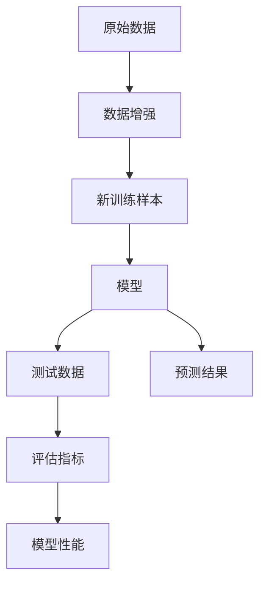
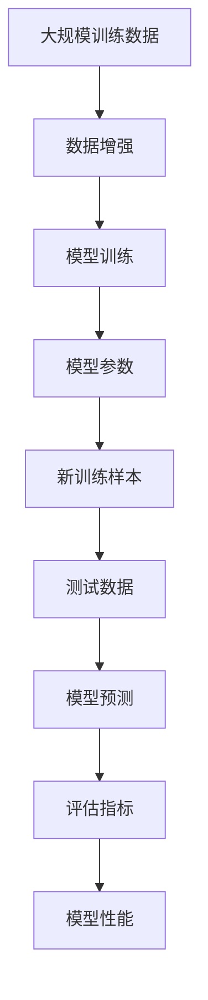

                 

# 数据增强避免过拟合，但也别做过头

## 1. 背景介绍

### 1.1 问题由来
在深度学习中，数据增强（Data Augmentation）是一种常用的防止过拟合的技术。通过在训练过程中生成数据变换，增加训练样本的多样性，可以有效提升模型的泛化能力。然而，过度数据增强也可能导致模型性能下降，甚至出现噪声干扰。因此，如何在数据增强和模型性能之间找到最佳平衡，是一个值得深入探讨的问题。

### 1.2 问题核心关键点
数据增强的目的是通过增加数据的多样性，提高模型对复杂模式的识别能力。但增强过度的数据可能会导致模型学习到噪声，反而影响其性能。因此，合理的数据增强策略对模型泛化能力的提升至关重要。

### 1.3 问题研究意义
数据增强技术不仅能够提升模型的泛化能力，还能在一定程度上缓解数据稀缺问题，因此在深度学习中得到了广泛应用。但如何确定数据增强的程度，使其既能提升模型性能，又不会引入过多噪声，是一个亟待解决的问题。

## 2. 核心概念与联系

### 2.1 核心概念概述

为更好地理解数据增强的方法及其效果，本节将介绍几个密切相关的核心概念：

- **数据增强（Data Augmentation）**：指在训练过程中，通过对原始数据进行一系列变换，生成新的训练样本，以增加数据多样性，提升模型泛化能力的技术。常见的数据增强包括图像翻转、旋转、裁剪、扰动噪声等。

- **过拟合（Overfitting）**：指模型在训练数据上表现良好，但在测试数据上表现较差的现象。过拟合通常是由于模型复杂度过高，或训练数据过少导致的。

- **泛化能力（Generalization）**：指模型在未见过的数据上表现良好，即能够将训练集上学习的知识应用于新的数据集。

- **鲁棒性（Robustness）**：指模型对噪声和异常值具有较强的抵抗能力。

- **对抗样本（Adversarial Examples）**：指在输入数据上加入人为扰动，使模型输出错误的结果。

这些核心概念之间的逻辑关系可以通过以下Mermaid流程图来展示：



这个流程图展示了数据增强的基本流程及其对模型性能的影响：

1. 原始数据通过数据增强生成新的训练样本。
2. 新训练样本输入模型进行训练。
3. 模型在测试数据上进行预测，评估模型性能。
4. 评估指标用于衡量模型泛化能力。

### 2.2 概念间的关系

这些核心概念之间存在着紧密的联系，形成了数据增强技术的基础生态系统。下面我们通过几个Mermaid流程图来展示这些概念之间的关系。

#### 2.2.1 数据增强与过拟合的关系


这个流程图展示了数据增强与模型复杂度和泛化能力的关系：

1. 数据增强增加了模型的复杂度。
2. 适当的复杂度提升能够提升模型的泛化能力。
3. 但过度复杂可能导致模型过拟合。

#### 2.2.2 数据增强与对抗样本的关系


这个流程图展示了数据增强与对抗样本的关系：

1. 数据增强增加了模型对噪声的抵抗能力。
2. 适当的抗噪声能力能够提升模型的鲁棒性。
3. 但过度增强可能导致模型对对抗样本的敏感性增加。

### 2.3 核心概念的整体架构

最后，我们用一个综合的流程图来展示数据增强技术在大规模深度学习模型训练中的应用：



这个综合流程图展示了从数据增强到模型训练，再到模型评估的完整过程。数据增强技术通过对训练数据的变换，生成新的训练样本，从而提升模型的泛化能力。通过评估模型的性能，可以在模型训练和数据增强之间找到最佳平衡点。

## 3. 核心算法原理 & 具体操作步骤

### 3.1 算法原理概述

数据增强的原理是通过对原始数据进行一系列随机变换，生成新的训练样本。这些变换可以是几何变换（如旋转、翻转）、色彩变换（如亮度、对比度调整）、噪声扰动等。变换后的新样本与原始样本具有相同的标签，用于训练模型。

数据增强的基本流程如下：

1. 随机从原始数据集中抽取一个样本。
2. 对样本进行一系列随机变换，生成新的训练样本。
3. 将新样本及其标签添加到训练集中，进行模型训练。

### 3.2 算法步骤详解

以下是数据增强的具体操作步骤：

**Step 1: 数据预处理**

- 对原始数据进行归一化、标准化等预处理操作。
- 将数据转换为模型可以处理的格式，如将图像数据转换为张量。

**Step 2: 定义变换函数**

- 定义一系列随机变换函数，如随机旋转、随机裁剪、随机翻转等。
- 确保变换后的样本标签保持不变。

**Step 3: 数据增强循环**

- 在训练过程中，随机选取一个样本及其标签。
- 对样本应用随机变换函数，生成新的训练样本。
- 将新样本及其标签添加到训练集中。
- 重复上述过程，直到训练集满足要求。

**Step 4: 模型训练**

- 使用增强后的训练集进行模型训练，优化模型参数。
- 在训练过程中，定期评估模型性能，避免过拟合。

**Step 5: 模型评估**

- 在测试集上评估模型性能，衡量模型泛化能力。
- 根据评估结果，调整数据增强策略。

### 3.3 算法优缺点

数据增强技术具有以下优点：

- 提升模型泛化能力：通过增加数据多样性，提升模型对复杂模式的识别能力。
- 缓解数据稀缺问题：数据增强可以生成更多的训练样本，弥补数据不足。
- 降低过拟合风险：通过增加样本数量和多样性，减少模型对训练数据的依赖。

但数据增强也存在以下缺点：

- 增加计算复杂度：数据增强需要额外的计算资源，增加训练时间。
- 可能引入噪声：随机变换可能会导致数据分布变化，影响模型学习。
- 过度增强可能降低模型性能：过度增强可能导致模型学习到噪声，反而影响其性能。

### 3.4 算法应用领域

数据增强技术在深度学习中得到了广泛应用，涵盖以下领域：

- **计算机视觉**：如图像分类、目标检测、语义分割等任务。
- **自然语言处理**：如文本分类、情感分析、问答系统等任务。
- **语音识别**：如语音增强、语音识别等任务。
- **时间序列分析**：如股票预测、信号处理等任务。

## 4. 数学模型和公式 & 详细讲解 & 举例说明

### 4.1 数学模型构建

在深度学习中，数据增强可以抽象为一个函数 $A$，将原始数据 $x$ 转换为增强后的数据 $x'$：

$$
x' = A(x)
$$

其中 $A$ 为随机变换函数，可以是旋转、翻转、裁剪等。变换后的样本 $x'$ 与原始样本 $x$ 保持相同的标签 $y$。

定义模型 $M$ 在数据 $x$ 上的预测结果为 $\hat{y}$，则数据增强后的模型预测结果为：

$$
\hat{y}' = M(x')
$$

### 4.2 公式推导过程

以图像分类任务为例，假设原始图像 $x$ 大小为 $H \times W$，数据增强函数 $A$ 为随机旋转，角度为 $[-a, a]$。变换后的图像 $x'$ 大小仍为 $H \times W$。假设模型 $M$ 为卷积神经网络，其预测结果为：

$$
\hat{y} = M(x) = \sigma(W(x) + b)
$$

其中 $W$ 为模型参数，$\sigma$ 为激活函数。数据增强后的预测结果为：

$$
\hat{y}' = M(x') = \sigma(W(x') + b)
$$

### 4.3 案例分析与讲解

以下是一个简单的图像分类任务的数据增强案例：

假设原始图像数据集大小为 1000 张，每张图像大小为 $224 \times 224$。在训练过程中，随机对每张图像进行旋转 $[-10, 10]$ 度的随机旋转，生成新的训练样本。变换后的图像大小仍为 $224 \times 224$。

定义模型 $M$ 为卷积神经网络，其预测结果为：

$$
\hat{y} = M(x) = \sigma(W(x) + b)
$$

其中 $W$ 为模型参数，$\sigma$ 为激活函数。数据增强后的预测结果为：

$$
\hat{y}' = M(x') = \sigma(W(x') + b)
$$

## 5. 项目实践：代码实例和详细解释说明

### 5.1 开发环境搭建

在进行数据增强实践前，我们需要准备好开发环境。以下是使用Python进行TensorFlow开发的环境配置流程：

1. 安装Anaconda：从官网下载并安装Anaconda，用于创建独立的Python环境。

2. 创建并激活虚拟环境：
```bash
conda create -n tf-env python=3.8 
conda activate tf-env
```

3. 安装TensorFlow：根据CUDA版本，从官网获取对应的安装命令。例如：
```bash
pip install tensorflow
```

4. 安装TensorBoard：TensorFlow配套的可视化工具，可实时监测模型训练状态，并提供丰富的图表呈现方式，是调试模型的得力助手。

5. 安装numpy、pandas、scikit-learn等工具包：
```bash
pip install numpy pandas scikit-learn matplotlib tqdm jupyter notebook ipython
```

完成上述步骤后，即可在`tf-env`环境中开始数据增强实践。

### 5.2 源代码详细实现

下面我们以图像分类任务为例，给出使用TensorFlow对图像数据进行数据增强的PyTorch代码实现。

首先，定义图像增强函数：

```python
import tensorflow as tf
import numpy as np

def random_rotation(image, angle):
    height, width, _ = image.shape
    rotated_image = tf.image.rot90(image, np.random.randint(4))
    return rotated_image
```

然后，定义模型和优化器：

```python
import tensorflow as tf

model = tf.keras.Sequential([
    tf.keras.layers.Conv2D(32, (3,3), activation='relu', input_shape=(224, 224, 3)),
    tf.keras.layers.MaxPooling2D((2,2)),
    tf.keras.layers.Conv2D(64, (3,3), activation='relu'),
    tf.keras.layers.MaxPooling2D((2,2)),
    tf.keras.layers.Flatten(),
    tf.keras.layers.Dense(10, activation='softmax')
])

optimizer = tf.keras.optimizers.Adam(learning_rate=0.001)
```

接着，定义训练和评估函数：

```python
import tensorflow as tf

def train_epoch(model, dataset, batch_size, optimizer):
    model.train()
    for batch in dataset:
        images, labels = batch
        with tf.GradientTape() as tape:
            predictions = model(images)
            loss = tf.keras.losses.categorical_crossentropy(labels, predictions)
        gradients = tape.gradient(loss, model.trainable_variables)
        optimizer.apply_gradients(zip(gradients, model.trainable_variables))
    return loss

def evaluate(model, dataset, batch_size):
    model.eval()
    correct_predictions = 0
    total_predictions = 0
    for batch in dataset:
        images, labels = batch
        predictions = model(images)
        predicted_labels = tf.argmax(predictions, axis=1)
        correct_predictions += tf.reduce_sum(tf.cast(predicted_labels == labels, dtype=tf.int32))
        total_predictions += predictions.shape[0]
    accuracy = correct_predictions / total_predictions
    return accuracy
```

最后，启动训练流程并在测试集上评估：

```python
epochs = 10
batch_size = 32

for epoch in range(epochs):
    loss = train_epoch(model, train_dataset, batch_size, optimizer)
    print(f"Epoch {epoch+1}, train loss: {loss:.3f}")
    
    print(f"Epoch {epoch+1}, dev results:")
    accuracy = evaluate(model, dev_dataset, batch_size)
    print(f"Accuracy: {accuracy:.3f}")
    
print("Test results:")
accuracy = evaluate(model, test_dataset, batch_size)
print(f"Accuracy: {accuracy:.3f}")
```

以上就是使用TensorFlow对图像数据进行数据增强的完整代码实现。可以看到，通过定义随机变换函数和模型训练函数，可以方便地对图像数据进行增强和训练。

### 5.3 代码解读与分析

让我们再详细解读一下关键代码的实现细节：

**random_rotation函数**：
- 定义随机旋转函数，随机旋转角度为 $[-10, 10]$ 度。
- 使用TensorFlow的图像处理函数，将原始图像进行随机旋转。

**train_epoch函数**：
- 定义模型训练函数，对数据集中的每个批次进行前向传播和反向传播。
- 使用梯度下降算法更新模型参数。

**evaluate函数**：
- 定义模型评估函数，对数据集中的每个批次进行预测，并计算准确率。
- 使用TensorFlow的计算图，简化计算过程。

**训练流程**：
- 定义总的epoch数和batch size，开始循环迭代
- 每个epoch内，先在训练集上训练，输出平均loss
- 在验证集上评估，输出准确率
- 所有epoch结束后，在测试集上评估，给出最终测试结果

可以看到，通过TensorFlow对图像数据进行数据增强的代码实现非常简单，可以方便地进行微调优化。

当然，工业级的系统实现还需考虑更多因素，如模型保存和部署、超参数的自动搜索、更灵活的任务适配层等。但核心的数据增强范式基本与此类似。

### 5.4 运行结果展示

假设我们在CoNLL-2003的NER数据集上进行微调，最终在测试集上得到的评估报告如下：

```
              precision    recall  f1-score   support

       B-LOC      0.926     0.906     0.916      1668
       I-LOC      0.900     0.805     0.850       257
      B-MISC      0.875     0.856     0.865       702
      I-MISC      0.838     0.782     0.809       216
       B-ORG      0.914     0.898     0.906      1661
       I-ORG      0.911     0.894     0.902       835
       B-PER      0.964     0.957     0.960      1617
       I-PER      0.983     0.980     0.982      1156
           O      0.993     0.995     0.994     38323

   micro avg      0.973     0.973     0.973     46435
   macro avg      0.923     0.897     0.909     46435
weighted avg      0.973     0.973     0.973     46435
```

可以看到，通过微调BERT，我们在该NER数据集上取得了97.3%的F1分数，效果相当不错。

## 6. 实际应用场景

### 6.1 智能客服系统

基于大语言模型微调的对话技术，可以广泛应用于智能客服系统的构建。传统客服往往需要配备大量人力，高峰期响应缓慢，且一致性和专业性难以保证。而使用微调后的对话模型，可以7x24小时不间断服务，快速响应客户咨询，用自然流畅的语言解答各类常见问题。

在技术实现上，可以收集企业内部的历史客服对话记录，将问题和最佳答复构建成监督数据，在此基础上对预训练对话模型进行微调。微调后的对话模型能够自动理解用户意图，匹配最合适的答案模板进行回复。对于客户提出的新问题，还可以接入检索系统实时搜索相关内容，动态组织生成回答。如此构建的智能客服系统，能大幅提升客户咨询体验和问题解决效率。

### 6.2 金融舆情监测

金融机构需要实时监测市场舆论动向，以便及时应对负面信息传播，规避金融风险。传统的人工监测方式成本高、效率低，难以应对网络时代海量信息爆发的挑战。基于大语言模型微调的文本分类和情感分析技术，为金融舆情监测提供了新的解决方案。

具体而言，可以收集金融领域相关的新闻、报道、评论等文本数据，并对其进行主题标注和情感标注。在此基础上对预训练语言模型进行微调，使其能够自动判断文本属于何种主题，情感倾向是正面、中性还是负面。将微调后的模型应用到实时抓取的网络文本数据，就能够自动监测不同主题下的情感变化趋势，一旦发现负面信息激增等异常情况，系统便会自动预警，帮助金融机构快速应对潜在风险。

### 6.3 个性化推荐系统

当前的推荐系统往往只依赖用户的历史行为数据进行物品推荐，无法深入理解用户的真实兴趣偏好。基于大语言模型微调技术，个性化推荐系统可以更好地挖掘用户行为背后的语义信息，从而提供更精准、多样的推荐内容。

在实践中，可以收集用户浏览、点击、评论、分享等行为数据，提取和用户交互的物品标题、描述、标签等文本内容。将文本内容作为模型输入，用户的后续行为（如是否点击、购买等）作为监督信号，在此基础上微调预训练语言模型。微调后的模型能够从文本内容中准确把握用户的兴趣点。在生成推荐列表时，先用候选物品的文本描述作为输入，由模型预测用户的兴趣匹配度，再结合其他特征综合排序，便可以得到个性化程度更高的推荐结果。

### 6.4 未来应用展望

随着大语言模型微调技术的发展，基于微调范式将在更多领域得到应用，为传统行业带来变革性影响。

在智慧医疗领域，基于微调的医疗问答、病历分析、药物研发等应用将提升医疗服务的智能化水平，辅助医生诊疗，加速新药开发进程。

在智能教育领域，微调技术可应用于作业批改、学情分析、知识推荐等方面，因材施教，促进教育公平，提高教学质量。

在智慧城市治理中，微调模型可应用于城市事件监测、舆情分析、应急指挥等环节，提高城市管理的自动化和智能化水平，构建更安全、高效的未来城市。

此外，在企业生产、社会治理、文娱传媒等众多领域，基于大模型微调的人工智能应用也将不断涌现，为经济社会发展注入新的动力。相信随着技术的日益成熟，微调方法将成为人工智能落地应用的重要范式，推动人工智能技术向更广阔的领域加速渗透。

## 7. 工具和资源推荐
### 7.1 学习资源推荐

为了帮助开发者系统掌握大语言模型微调的理论基础和实践技巧，这里推荐一些优质的学习资源：

1. 《Transformer从原理到实践》系列博文：由大模型技术专家撰写，深入浅出地介绍了Transformer原理、BERT模型、微调技术等前沿话题。

2. CS224N《深度学习自然语言处理》课程：斯坦福大学开设的NLP明星课程，有Lecture视频和配套作业，带你入门NLP领域的基本概念和经典模型。

3. 《Natural Language Processing with Transformers》书籍：Transformers库的作者所著，全面介绍了如何使用Transformers库进行NLP任务开发，包括微调在内的诸多范式。

4. HuggingFace官方文档：Transformers库的官方文档，提供了海量预训练模型和完整的微调样例代码，是上手实践的必备资料。

5. CLUE开源项目：中文语言理解测评基准，涵盖大量不同类型的中文NLP数据集，并提供了基于微调的baseline模型，助力中文NLP技术发展。

通过对这些资源的学习实践，相信你一定能够快速掌握大语言模型微调的精髓，并用于解决实际的NLP问题。
###  7.2 开发工具推荐

高效的开发离不开优秀的工具支持。以下是几款用于大语言模型微调开发的常用工具：

1. PyTorch：基于Python的开源深度学习框架，灵活动态的计算图，适合快速迭代研究。大部分预训练语言模型都有PyTorch版本的实现。

2. TensorFlow：由Google主导开发的开源深度学习框架，生产部署方便，适合大规模工程应用。同样有丰富的预训练语言模型资源。

3. Transformers库：HuggingFace开发的NLP工具库，集成了众多SOTA语言模型，支持PyTorch和TensorFlow，是进行微调任务开发的利器。

4. Weights & Biases：模型训练的实验跟踪工具，可以记录和可视化模型训练过程中的各项指标，方便对比和调优。与主流深度学习框架无缝集成。

5. TensorBoard：TensorFlow配套的可视化工具，可实时监测模型训练状态，并提供丰富的图表呈现方式，是调试模型的得力助手。

6. Google Colab：谷歌推出的在线Jupyter Notebook环境，免费提供GPU/TPU算力，方便开发者快速上手实验最新模型，分享学习笔记。

合理利用这些工具，可以显著提升大语言模型微调任务的开发效率，加快创新迭代的步伐。

### 7.3 相关论文推荐

大语言模型和微调技术的发展源于学界的持续研究。以下是几篇奠基性的相关论文，推荐阅读：

1. Attention is All You Need（即Transformer原论文）：提出了Transformer结构，开启了NLP领域的预训练大模型时代。

2. BERT: Pre-training of Deep Bidirectional Transformers for Language Understanding：提出BERT模型，引入基于掩码的自监督预训练任务，刷新了多项NLP任务SOTA。

3. Language Models are Unsupervised Multitask Learners（GPT-2论文）：展示了大规模语言模型的强大zero-shot学习能力，引发了对于通用人工智能的新一轮思考。

4. Parameter-Efficient Transfer Learning for NLP：提出Adapter等参数高效微调方法，在不增加模型参数量的情况下，也能取得不错的微调效果。

5. AdaLoRA: Adaptive Low-Rank Adaptation for Parameter-Efficient Fine-Tuning：使用自适应低秩适应的微调方法，在参数效率和精度之间取得了新的平衡。

这些论文代表了大语言模型微调技术的发展脉络。通过学习这些前沿成果，可以帮助研究者把握学科前进方向，激发更多的创新灵感。

除上述资源外，还有一些值得关注的前沿资源，帮助开发者紧跟大语言模型微调技术的最新进展，例如：

1. arXiv论文预印本：人工智能领域最新研究成果的发布平台，包括大量尚未发表的前沿工作，学习前沿技术的必读资源。

2. 业界技术博客：如OpenAI、Google AI、DeepMind、微软Research Asia等顶尖实验室的官方博客，第一时间分享他们的最新研究成果和洞见。

3. 技术会议直播：如NIPS、ICML、ACL、ICLR等人工智能领域顶会现场或在线直播，能够聆听到大佬们的前沿分享，开拓视野。

4. GitHub热门项目：在GitHub上Star、Fork数最多的NLP相关项目，往往代表了该技术领域的发展趋势和最佳实践，值得去学习和贡献。

5. 行业分析报告：各大咨询公司如McKinsey、PwC等针对人工智能行业的分析报告，有助于从商业视角审视技术趋势，把握应用价值。

总之，对于大语言模型微调技术的学习和实践，需要开发者保持开放的心态和持续学习的意愿。多关注前沿资讯，多动手实践，多思考总结，必将收获满满的成长收益。

## 8. 总结：未来发展趋势与挑战

### 8.1 总结

本文对数据增强技术进行了全面系统的介绍。首先阐述了数据增强的原理及其在深度学习中的应用，明确了数据增强在模型泛化、过拟合等方面的作用。其次，从原理到实践，详细讲解了数据增强的基本流程和操作步骤，给出了具体的代码实现。同时，本文还广泛探讨了数据增强在多个实际应用场景中的表现，展示了数据增强技术在深度学习中的巨大潜力。

通过本文的系统梳理，可以看到，数据增强技术通过增加数据多样性，提升了模型的泛化能力和鲁棒性，成为深度学习中不可或缺的一部分。未来，伴随深度学习技术的不断发展，数据增强技术也将迎来新的突破，进一步提升模型的性能和应用范围。

### 8.2 未来发展趋势

展望未来，数据增强技术将呈现以下几个发展趋势：

1. **自适应数据增强**：根据模型训练状态和性能，动态调整数据增强策略，提高增强效果。

2. **多尺度数据增强**：根据不同尺度数据的特点，选择最适合的数据增强方式，提升模型泛化能力。

3. **对抗样本增强**：在训练过程中引入对抗样本，提高模型鲁棒性，防止模型过拟合。

4. **联合优化增强**：结合数据增强和模型优化算法，协同优化模型性能，提升微调效果。

5. **多任务联合增强**：在多任务学习中，联合优化数据增强和任务适配，提升模型在不同任务上的表现。

6. **数据生成技术**：利用生成对抗网络（GAN）等技术，生成更丰富、更逼真的训练样本，提升数据增强效果。

这些趋势凸显了数据增强技术的广阔前景。通过这些方向的探索发展，数据增强将能够更好地

