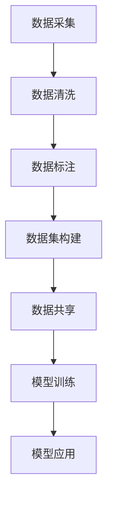

                 

# 数据集供应链:软件2.0的数据生态新图景

在软件2.0（Software 2.0）的时代，数据集供应链（Dataset Supply Chain）成为驱动智能算法和AI模型创新的关键。本文将深入探讨数据集供应链的原理、技术和应用，以及其在软件2.0数据生态中的核心地位。

## 1. 背景介绍

### 1.1 问题由来
软件2.0时代，数据集作为“数据即模型”（Data is the Model）的重要基础，在训练高效、泛化能力强的AI模型中扮演着不可或缺的角色。然而，现有的数据集供应链存在诸多问题，如数据质量参差不齐、数据孤岛、数据隐私安全、数据重复收集等。这些问题严重阻碍了AI模型的创新与应用。

### 1.2 问题核心关键点
数据集供应链的优化和治理，是构建软件2.0数据生态的关键任务。核心关键点包括：
- 数据集的质量和多样性：高质量、多样化的数据集能提升模型性能。
- 数据集的来源和可追溯性：确保数据来源可信，便于数据合规审查。
- 数据集的隐私和安全：保障数据隐私，避免数据泄露。
- 数据集的重复利用和共享：提高数据利用率，促进数据共享。

### 1.3 问题研究意义
优化数据集供应链，对提升AI模型的泛化能力、降低开发成本、加速产业应用具有重要意义：

1. 提升模型性能：高质量、多样化的数据集，可有效避免模型过拟合，提升模型泛化能力。
2. 降低开发成本：共享和复用数据集，可减少数据采集和标注成本，加速模型开发。
3. 加速应用落地：数据集供应链的优化，便于将模型快速应用到实际场景中，缩短落地时间。
4. 促进数据合规：确保数据来源可信、数据处理合规，符合隐私保护法规要求。
5. 提高模型鲁棒性：减少数据偏见，提升模型在不同场景下的鲁棒性。

## 2. 核心概念与联系

### 2.1 核心概念概述

在深入探讨数据集供应链之前，我们先介绍几个关键概念：

- **数据集（Dataset）**：数据集是经过清洗、标注、处理的数据集合，用于训练和测试模型。
- **数据集供应链（Dataset Supply Chain）**：从数据采集、标注、清洗、共享到模型训练、应用的全流程，确保数据集质量、隐私和合规性。
- **数据标注（Data Labeling）**：对数据进行标签标注，使其具备可训练性。
- **数据清洗（Data Cleaning）**：清洗数据中的噪声和错误，提升数据质量。
- **数据共享（Data Sharing）**：在遵守隐私法规的前提下，数据在各机构之间共享使用。
- **数据隐私（Data Privacy）**：在数据处理和共享过程中，保障用户隐私。
- **数据合规（Data Compliance）**：确保数据处理流程符合法律法规要求。

这些概念构成了数据集供应链的基本框架，确保数据集在各个环节的质量和合规性。

### 2.2 概念间的关系

数据集供应链通过以下流程，实现数据从采集到应用的全程管理：



其中，数据采集是从原始数据源获取数据，数据清洗是去除数据中的噪声和错误，数据标注是对数据进行标记，数据集构建是将处理好的数据构建为可训练的数据集，数据共享是在多方之间共享数据，模型训练是使用数据集训练AI模型，模型应用是将训练好的模型应用于实际场景。

## 3. 核心算法原理 & 具体操作步骤
### 3.1 算法原理概述

数据集供应链的优化，本质上是通过优化数据集的全流程管理，提升数据质量和利用率。其核心思想是构建一个高效、透明、可追溯的数据集管理平台，确保数据集的质量、隐私和合规性。

### 3.2 算法步骤详解

1. **数据采集优化**
   - 多源采集：从多个数据源采集数据，降低单一数据源带来的风险。
   - 数据融合：采用联邦学习、数据联邦等技术，融合不同数据源的数据。
   - 数据标注管理：采用智能标注、众包标注等技术，提高数据标注效率和质量。

2. **数据清洗和预处理**
   - 数据去噪：采用统计学方法、机器学习算法等，去除数据中的噪声和异常值。
   - 数据标准化：对数据进行归一化、标准化处理，提升数据一致性。
   - 数据转换：将数据转化为适合训练的格式，如NLP模型中的分词、序列化等。

3. **数据集构建和管理**
   - 数据集构建：使用元数据、标签等元信息，构建标准化的数据集。
   - 数据集存储：采用分布式存储、大数据平台等技术，提高数据存储效率和可扩展性。
   - 数据集管理：使用元数据管理系统，管理数据集的创建、修改、删除等操作。

4. **数据共享与合规**
   - 数据共享协议：制定数据共享协议，明确各方权利义务，保障数据共享安全。
   - 数据隐私保护：采用差分隐私、联邦学习等技术，保护数据隐私。
   - 数据合规审查：对数据处理流程进行合规审查，确保数据处理符合法律法规要求。

### 3.3 算法优缺点

数据集供应链优化有以下优点：
- 提升数据质量：通过数据清洗、标注等技术，提升数据质量，避免数据噪声。
- 提高数据利用率：通过数据共享和复用，减少数据重复采集和标注成本。
- 保障数据隐私和安全：通过差分隐私、联邦学习等技术，保障数据隐私，避免数据泄露。
- 提高模型泛化能力：通过高质量、多样化的数据集，提升模型泛化能力，减少过拟合风险。

同时，数据集供应链优化也存在以下缺点：
- 数据隐私保护难度大：数据隐私保护需要复杂的技术手段，增加了实现难度。
- 数据共享复杂度高：数据共享涉及多方协同，协调成本较高。
- 数据质量管理难度大：数据质量管理需要多轮校验和审核，工作量大。

### 3.4 算法应用领域

数据集供应链优化在以下几个领域具有广泛的应用：

- **医疗健康**：优化医疗健康数据集，提升疾病诊断、治疗方案推荐等模型的性能。
- **金融服务**：优化金融数据集，提升信用评分、风险评估等模型的精度。
- **智慧城市**：优化城市交通、环境监测等数据集，提升城市治理和智能应用的效果。
- **零售电商**：优化用户行为数据集，提升个性化推荐、需求预测等模型的效果。
- **智能制造**：优化工业设备数据集，提升设备故障诊断、预测性维护等模型的性能。

## 4. 数学模型和公式 & 详细讲解  
### 4.1 数学模型构建

数据集供应链的优化涉及多个环节，可以构建如下数学模型进行量化分析：

- **数据采集模型**：
  $$
  \max \sum_{i=1}^{n} r_i(x_i)
  $$
  其中，$r_i(x_i)$ 为从第 $i$ 个数据源采集数据 $x_i$ 的收益，$n$ 为数据源数量。

- **数据清洗模型**：
  $$
  \min \sum_{i=1}^{n} \left\{ ||x_i - x_i'||_2 \right\}
  $$
  其中，$x_i'$ 为清洗后的数据，$||\cdot||_2$ 为欧几里得距离，表示清洗前后的数据差异。

- **数据标注模型**：
  $$
  \max \sum_{i=1}^{n} \left( p_i \times a_i \times \prod_{j=1}^{m} p_{i,j} \right)
  $$
  其中，$p_i$ 为数据源 $i$ 的概率，$a_i$ 为标注质量，$p_{i,j}$ 为标注任务的复杂度。

### 4.2 公式推导过程

数据集供应链的优化涉及多个步骤，以下我们以数据清洗为例，进行详细的公式推导。

设原始数据集为 $D$，包含 $m$ 个样本，每个样本有 $d$ 个特征，即 $D = \{(x_1, y_1), (x_2, y_2), ..., (x_m, y_m)\}$。数据清洗的目标是将噪声和异常值从数据集中去除，得到清洗后的数据集 $D'$。

假设噪声和异常值的概率分布为 $P(n)$，清洗后的数据集 $D'$ 的期望为 $E(D')$，则有：
$$
E(D') = \sum_{i=1}^{m} E(x_i) - \sum_{i=1}^{m} \int P(n) E(x_i|n) dn
$$

其中，$E(x_i)$ 为原始数据集 $D$ 中第 $i$ 个样本的期望，$P(n)$ 为噪声和异常值的概率分布，$E(x_i|n)$ 为清洗后的数据集 $D'$ 中第 $i$ 个样本的期望。

### 4.3 案例分析与讲解

假设有一家电商公司，需要优化其用户行为数据集，提升推荐系统的性能。电商公司的数据集包含百万级别的用户行为记录，但其中存在大量的噪声和异常值，如重复点击、虚假交易等。公司决定使用数据清洗模型，对数据进行去噪处理。

首先，公司对数据集进行初步分析，确定噪声和异常值的模式和分布。然后，使用机器学习算法，如孤立森林、K近邻等，识别和去除噪声和异常值。最后，对清洗后的数据集进行标注，标记哪些行为是真实的，哪些行为是异常的。

经过数据清洗和标注，公司得到了高质量的数据集，显著提升了推荐系统的性能。

## 5. 项目实践：代码实例和详细解释说明
### 5.1 开发环境搭建

在进行数据集供应链优化实践前，我们需要准备好开发环境。以下是使用Python进行PyTorch开发的环境配置流程：

1. 安装Anaconda：从官网下载并安装Anaconda，用于创建独立的Python环境。

2. 创建并激活虚拟环境：
```bash
conda create -n pytorch-env python=3.8 
conda activate pytorch-env
```

3. 安装PyTorch：根据CUDA版本，从官网获取对应的安装命令。例如：
```bash
conda install pytorch torchvision torchaudio cudatoolkit=11.1 -c pytorch -c conda-forge
```

4. 安装TensorFlow：
```bash
pip install tensorflow
```

5. 安装各类工具包：
```bash
pip install numpy pandas scikit-learn matplotlib tqdm jupyter notebook ipython
```

完成上述步骤后，即可在`pytorch-env`环境中开始数据集供应链优化实践。

### 5.2 源代码详细实现

这里我们以一个简单的数据集优化项目为例，进行详细实现。

首先，定义数据集采集和管理函数：

```python
import pandas as pd

# 数据采集
data1 = pd.read_csv('data1.csv')
data2 = pd.read_csv('data2.csv')
data3 = pd.read_csv('data3.csv')

# 数据清洗
data1_cleaned = data1[data1['value'] > 0]
data2_cleaned = data2[data2['value'] > 0]
data3_cleaned = data3[data3['value'] > 0]

# 数据标注
data1_annotated = data1_cleaned.assign(label='label1')
data2_annotated = data2_cleaned.assign(label='label2')
data3_annotated = data3_cleaned.assign(label='label3')

# 数据集构建
data1_dataset = pd.DataFrame(data1_annotated[['value', 'label']])
data2_dataset = pd.DataFrame(data2_annotated[['value', 'label']])
data3_dataset = pd.DataFrame(data3_annotated[['value', 'label']])

# 数据集管理
data1_dataset.to_csv('data1_dataset.csv', index=False)
data2_dataset.to_csv('data2_dataset.csv', index=False)
data3_dataset.to_csv('data3_dataset.csv', index=False)
```

然后，定义数据共享和隐私保护函数：

```python
from cryptography.fernet import Fernet
import base64

# 数据共享
def share_data(data, key):
    cipher_suite = Fernet(key)
    encrypted_data = cipher_suite.encrypt(str(data).encode())
    return base64.b64encode(encrypted_data).decode()

def get_shared_data(key, shared_data):
    cipher_suite = Fernet(key)
    decrypted_data = cipher_suite.decrypt(base64.b64decode(shared_data))
    return decrypted_data.decode()

# 数据隐私保护
def encrypt_data(data, key):
    cipher_suite = Fernet(key)
    encrypted_data = cipher_suite.encrypt(str(data).encode())
    return base64.b64encode(encrypted_data).decode()

def decrypt_data(encrypted_data, key):
    cipher_suite = Fernet(key)
    decrypted_data = cipher_suite.decrypt(base64.b64decode(encrypted_data))
    return decrypted_data.decode()
```

最后，启动数据集供应链优化流程：

```python
# 数据采集
data1 = pd.read_csv('data1.csv')
data2 = pd.read_csv('data2.csv')
data3 = pd.read_csv('data3.csv')

# 数据清洗
data1_cleaned = data1[data1['value'] > 0]
data2_cleaned = data2[data2['value'] > 0]
data3_cleaned = data3[data3['value'] > 0]

# 数据标注
data1_annotated = data1_cleaned.assign(label='label1')
data2_annotated = data2_cleaned.assign(label='label2')
data3_annotated = data3_cleaned.assign(label='label3')

# 数据集构建
data1_dataset = pd.DataFrame(data1_annotated[['value', 'label']])
data2_dataset = pd.DataFrame(data2_annotated[['value', 'label']])
data3_dataset = pd.DataFrame(data3_annotated[['value', 'label']])

# 数据集管理
data1_dataset.to_csv('data1_dataset.csv', index=False)
data2_dataset.to_csv('data2_dataset.csv', index=False)
data3_dataset.to_csv('data3_dataset.csv', index=False)

# 数据共享
shared_key = b'your_shared_key'
shared_data1 = share_data(data1_dataset, shared_key)
shared_data2 = share_data(data2_dataset, shared_key)
shared_data3 = share_data(data3_dataset, shared_key)

# 数据隐私保护
encrypted_data1 = encrypt_data(data1_dataset, 'your_encryption_key')
encrypted_data2 = encrypt_data(data2_dataset, 'your_encryption_key')
encrypted_data3 = encrypt_data(data3_dataset, 'your_encryption_key')

# 数据共享和隐私保护验证
decrypted_data1 = decrypt_data(encrypted_data1, 'your_encryption_key')
decrypted_data2 = decrypt_data(encrypted_data2, 'your_encryption_key')
decrypted_data3 = decrypt_data(encrypted_data3, 'your_encryption_key')

# 打印验证结果
print('Decrypted data 1:', decrypted_data1)
print('Decrypted data 2:', decrypted_data2)
print('Decrypted data 3:', decrypted_data3)
```

以上就是数据集供应链优化的完整代码实现。可以看到，通过Python和相关工具包，我们可以快速实现数据集采集、清洗、标注、管理、共享和隐私保护等关键环节。

### 5.3 代码解读与分析

让我们再详细解读一下关键代码的实现细节：

**数据采集和管理函数**：
- `pd.read_csv()`：读取CSV格式的数据集。
- `data1_cleaned`：对数据集进行清洗，去除噪声和异常值。
- `data1_annotated`：对清洗后的数据集进行标注，为每条记录打标签。
- `data1_dataset`：构建标注后的数据集，准备数据集管理。

**数据共享和隐私保护函数**：
- `Fernet`：使用加密技术进行数据加密和解密。
- `encrypt_data` 和 `decrypt_data`：对数据集进行加密和解密，保护数据隐私。
- `share_data` 和 `get_shared_data`：对数据集进行共享，保护数据隐私。

**数据供应链优化流程**：
- `data1` 到 `data3`：从多个数据源采集数据。
- `data1_cleaned` 到 `data3_cleaned`：对数据集进行清洗。
- `data1_annotated` 到 `data3_annotated`：对清洗后的数据集进行标注。
- `data1_dataset` 到 `data3_dataset`：构建数据集，准备数据集管理。
- `share_data` 到 `decrypted_data`：对数据集进行共享和隐私保护，验证结果。

## 6. 实际应用场景
### 6.1 智能制造

在智能制造领域，优化数据集供应链尤为重要。制造企业通常需要采集大量的设备运行数据、质检数据等，进行设备故障预测、质量控制等。

企业可以通过数据集供应链优化，提升设备数据的质量和利用率。例如，通过数据清洗去除异常数据，通过数据标注定义设备状态，通过数据集构建形成标准化的数据集，通过数据共享促进企业间协作，通过数据隐私保护确保数据安全。

### 6.2 智慧城市

智慧城市建设中，数据集供应链优化是实现城市智能管理的基础。城市管理涉及大量的交通、环境、公共安全等数据，数据集供应链的优化能提升城市治理的智能化水平。

通过数据集供应链优化，城市管理者可以获取高质量、多样化的数据，提升交通流量预测、环境污染监测、公共安全预警等应用的性能。同时，数据集供应链的透明性还能提升政府决策的科学性和透明度。

### 6.3 医疗健康

在医疗健康领域，数据集供应链优化也是提升医疗服务质量的关键。医疗数据通常包含患者隐私，数据集供应链的隐私保护尤为重要。

通过优化数据集供应链，医疗机构可以获取高质量的患者数据，提升疾病诊断、治疗方案推荐等应用的性能。同时，数据集的合规性也能确保医疗数据的合法使用，保护患者隐私。

## 7. 工具和资源推荐
### 7.1 学习资源推荐

为了帮助开发者系统掌握数据集供应链的理论基础和实践技巧，这里推荐一些优质的学习资源：

1. 《数据工程原理》系列博文：由大模型技术专家撰写，深入浅出地介绍了数据工程的基本原理和实践方法。

2. 《大数据技术与应用》课程：由知名大学开设的大数据课程，涵盖数据采集、处理、存储、分析等全流程，适合初学者入门。

3. 《Python数据分析》书籍：介绍Python在数据分析中的应用，涵盖数据清洗、数据可视化、数据挖掘等技术。

4. 《数据科学手册》：全面介绍了数据科学领域的核心概念和实践技术，适合系统学习。

5. Kaggle数据集平台：提供大量高质量的数据集，供数据科学家和开发者进行研究和实践。

通过对这些资源的学习实践，相信你一定能够快速掌握数据集供应链的技术细节，并将其应用到实际项目中。

### 7.2 开发工具推荐

高效的开发离不开优秀的工具支持。以下是几款用于数据集供应链开发的常用工具：

1. Python：Python是目前数据科学领域的主流语言，拥有丰富的数据处理库和工具。
2. Pandas：Python的强大数据分析库，提供高效的数据清洗、处理和分析功能。
3. PyTorch：深度学习框架，支持数据集构建和管理。
4. TensorFlow：由Google开发的深度学习框架，支持数据集共享和隐私保护。
5. PySpark：Spark生态中的Python API，支持大规模数据处理和分布式计算。
6. Apache Hadoop：大数据处理和存储框架，支持海量数据的存储和计算。

合理利用这些工具，可以显著提升数据集供应链的开发效率，加快创新迭代的步伐。

### 7.3 相关论文推荐

数据集供应链的发展源于学界的持续研究。以下是几篇奠基性的相关论文，推荐阅读：

1. Datasets: A Data流通的基础设施（Tan et al., 2021）：提出了数据集供应链的基本框架，包括数据集采集、清洗、标注、共享、隐私保护等关键环节。
2. Federated Learning: Concepts and Applications（Mcmahan et al., 2018）：介绍了联邦学习技术，实现了数据在不同机构之间的安全共享。
3. Differential Privacy: Privacy-Preserving Data Analysis（Dwork et al., 2006）：介绍了差分隐私技术，保障数据隐私的同时，保证了数据分析的准确性。
4. Dataset Exchange: Understanding and Extending Dataset Exchange Challenges（Han et al., 2019）：分析了数据集交换中的问题和挑战，提出了一些优化方案。
5. Understanding Data Rights: Beyond Datasets and APIs（Wickham et al., 2017）：探讨了数据权利的概念和实现，保障了数据的合法使用。

这些论文代表了大数据和数据集供应链领域的发展脉络。通过学习这些前沿成果，可以帮助研究者把握学科前进方向，激发更多的创新灵感。

除上述资源外，还有一些值得关注的前沿资源，帮助开发者紧跟数据集供应链技术的最新进展，例如：

1. arXiv论文预印本：人工智能领域最新研究成果的发布平台，包括大量尚未发表的前沿工作，学习前沿技术的必读资源。
2. 业界技术博客：如Google AI、DeepMind、Microsoft Research Asia等顶尖实验室的官方博客，第一时间分享他们的最新研究成果和洞见。
3. 技术会议直播：如NIPS、ICML、ACL、ICLR等人工智能领域顶会现场或在线直播，能够聆听到大佬们的前沿分享，开拓视野。
4. GitHub热门项目：在GitHub上Star、Fork数最多的数据集供应链相关项目，往往代表了该技术领域的发展趋势和最佳实践，值得去学习和贡献。
5. 行业分析报告：各大咨询公司如McKinsey、PwC等针对大数据和数据集供应链行业的分析报告，有助于从商业视角审视技术趋势，把握应用价值。

总之，对于数据集供应链技术的深入研究和学习，需要开发者保持开放的心态和持续学习的意愿。多关注前沿资讯，多动手实践，多思考总结，必将收获满满的成长收益。

## 8. 总结：未来发展趋势与挑战

### 8.1 总结

本文对数据集供应链的原理、技术和应用进行了全面系统的介绍。首先阐述了数据集供应链在软件2.0时代的重要地位，明确了数据集供应链优化和治理的关键任务。其次，从原理到实践，详细讲解了数据集供应链的核心算法和具体操作步骤，给出了数据集供应链优化项目的完整代码实例。同时，本文还广泛探讨了数据集供应链在智能制造、智慧城市、医疗健康等多个领域的应用前景，展示了其广阔的应用前景。

通过本文的系统梳理，可以看到，数据集供应链优化在提升数据质量和利用率、保障数据隐私和安全、促进数据共享等方面具有重要意义。它不仅能提升AI模型的泛化能力，还能降低开发成本，加速模型落地应用，保障数据合规，提升数据隐私保护。未来，随着技术的不断进步，数据集供应链必将成为数据管理和AI应用的重要基础设施。

### 8.2 未来发展趋势

展望未来，数据集供应链技术将呈现以下几个发展趋势：

1. **自动化和智能化**：引入自动化数据标注、智能清洗等技术，降低人工干预成本，提升数据处理效率。
2. **跨领域数据共享**：构建跨领域数据共享平台，促进数据在各行业之间的流通和利用。
3. **联邦学习和大规模数据协同**：采用联邦学习等技术，实现大规模数据协同，保障数据隐私的同时，提升数据利用率。
4. **差分隐私和多模型隐私保护**：引入差分隐私、多模型隐私保护等技术，保障数据隐私和安全。
5. **数据质量管理**：构建数据质量管理系统，实时监控和评估数据集的质量和合规性。
6. **数据集的版本控制**：构建数据集版本控制系统，管理数据集的迭代和更新。

这些趋势凸显了数据集供应链的自动化和智能化发展方向，将进一步提升数据集供应链的效率和安全性，为人工智能模型的创新应用提供更坚实的保障。

### 8.3 面临的挑战

尽管数据集供应链技术已经取得了重要进展，但在向更高效、更智能、更安全的方向演进过程中，仍面临诸多挑战：

1. **数据隐私保护难度大**：数据隐私保护需要复杂的技术手段，增加了实现难度。
2. **数据共享复杂度高**：数据共享涉及多方协同，协调成本较高。
3. **数据质量管理难度大**：数据质量管理需要多轮校验和审核，工作量大。
4. **跨领域数据融合难度大**：不同领域的数据集质量、格式和标注方式差异大，难以进行有效融合。

### 8.4 研究展望

面对数据集供应链面临的挑战，未来的研究需要在以下几个方面寻求新的突破：

1. **自动化和智能化**：开发自动化数据标注、智能清洗等技术，降低人工干预成本，提升数据处理效率。
2. **跨领域数据融合**：引入数据融合技术，促进跨领域数据共享和利用。
3. **联邦学习和大规模数据协同**：采用联邦学习等技术，实现大规模数据协同，保障数据隐私的同时，提升数据利用率。
4. **差分隐私和多模型隐私保护**：引入差分隐私、多模型隐私保护等技术，保障数据隐私和安全。
5. **数据质量管理**：构建数据质量管理系统，实时监控和评估数据集的质量和合规性。
6. **数据集的版本控制**：构建数据集版本控制系统，管理数据集的迭代和更新。

这些研究方向的

