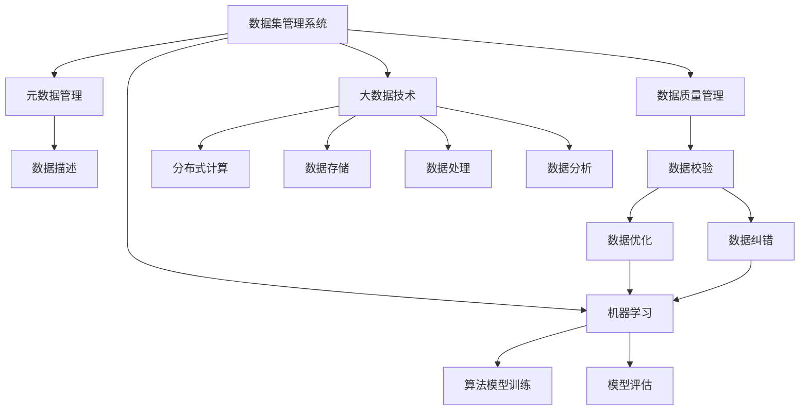
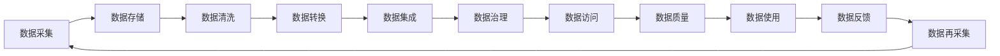
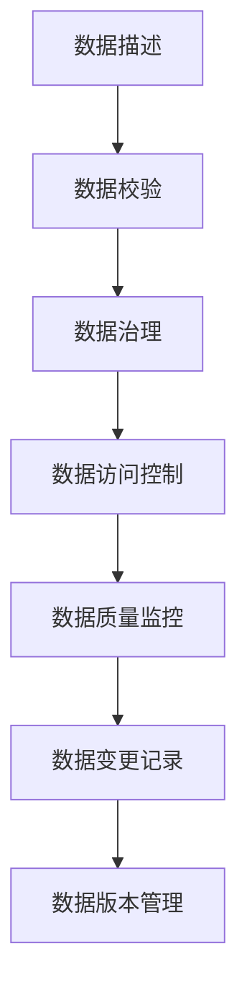
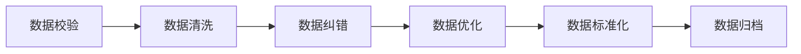
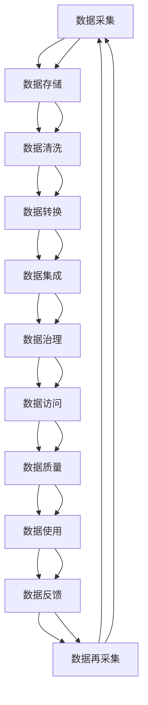

                 

# 数据集管理系统:元数据时代的新主角

> 关键词：数据集管理,元数据,数据质量,大数据,机器学习

## 1. 背景介绍

### 1.1 问题由来

随着数据驱动和人工智能技术的不断进步，数据集管理系统（Data Collection Management System）的重要性日益凸显。数据集管理系统是管理和维护数据集的关键工具，对于提升数据质量、优化算法模型、加速数据处理具有重要意义。然而，随着数据量的爆炸式增长，以及数据的多样性和复杂性不断增加，传统的数据集管理系统已难以适应数据密集型的应用需求。

### 1.2 问题核心关键点

数据集管理系统面临的核心挑战包括：

- **数据质量管理**：如何保证数据的准确性、完整性、一致性和时效性，以支撑模型训练和决策。
- **元数据管理**：如何描述和标准化数据集的特征、属性和关系，便于数据的共享和复用。
- **数据访问权限控制**：如何在保障数据安全性的同时，支持多用户、多部门的数据访问和协作。
- **数据集成和融合**：如何高效地将不同来源、不同格式的数据集集成和融合，构建统一的数据视图。
- **数据生命周期管理**：如何跟踪和监控数据集从采集、存储、清洗、训练到退出的全生命周期过程，确保数据集的合规性和可用性。

### 1.3 问题研究意义

研究和发展高效、可靠的数据集管理系统，对于提升数据密集型应用的数据质量、降低数据管理成本、加速人工智能模型的训练和部署具有重要意义。它不仅能够为数据科学家提供高效的数据管理工具，还能提升企业的决策能力和竞争力。

## 2. 核心概念与联系

### 2.1 核心概念概述

为更好地理解数据集管理系统及其核心概念，本节将介绍几个密切相关的核心概念：

- **数据集管理系统**：用于管理和维护数据集的软件工具，包括数据集元数据的定义、管理、访问和共享等功能。
- **元数据**：描述数据集特征和属性的数据，如数据来源、数据格式、数据质量、数据类型、数据关系等。
- **数据质量管理**：通过元数据和规则，对数据进行质量评估、校验和优化，以确保数据可用性和可靠性。
- **大数据技术**：指处理海量数据的技术体系，包括分布式计算、数据存储、数据处理和数据分析等。
- **机器学习**：通过训练算法模型，从数据中学习规律，进行预测和决策的技术。

这些核心概念之间的逻辑关系可以通过以下Mermaid流程图来展示：



这个流程图展示了大数据管理系统的核心概念及其之间的关系：

1. 数据集管理系统是元数据管理的核心，负责描述和管理数据集。
2. 数据质量管理通过元数据和规则对数据进行校验和优化，确保数据可用性。
3. 大数据技术提供了分布式计算、数据存储、数据处理和数据分析等基础设施。
4. 机器学习利用数据进行算法模型训练和评估，实现数据驱动的决策。

### 2.2 概念间的关系

这些核心概念之间存在着紧密的联系，形成了数据集管理系统的完整生态系统。下面我通过几个Mermaid流程图来展示这些概念之间的关系。

#### 2.2.1 数据集管理系统的整体架构



这个流程图展示了数据集管理系统的整体架构：

1. 数据采集：从不同来源获取原始数据。
2. 数据存储：将数据存储在分布式文件系统或数据库中。
3. 数据清洗：对数据进行去重、去噪、纠错等处理。
4. 数据转换：将数据转换为模型所需格式。
5. 数据集成：将不同数据源的数据进行合并和统一。
6. 数据治理：对数据进行标准化、分类和命名。
7. 数据访问：提供数据访问接口，支持多用户、多部门的数据共享。
8. 数据质量：通过元数据和规则对数据进行质量评估和优化。
9. 数据使用：使用数据进行模型训练和业务决策。
10. 数据反馈：收集模型使用情况和结果，用于数据再采集和优化。
11. 数据再采集：根据反馈调整数据采集策略，不断优化数据集。

#### 2.2.2 元数据管理的基本流程



这个流程图展示了元数据管理的基本流程：

1. 数据描述：对数据集进行详细的特征和属性描述。
2. 数据校验：确保数据符合预定义的标准和规范。
3. 数据治理：对数据进行分类、命名和标准化。
4. 数据访问控制：控制数据访问权限，保障数据安全性。
5. 数据质量监控：监控数据质量，及时发现和纠正问题。
6. 数据变更记录：记录数据集的变更历史，便于数据追溯。
7. 数据版本管理：管理数据集的不同版本，支持数据回溯和恢复。

#### 2.2.3 数据质量管理的核心环节



这个流程图展示了数据质量管理的核心环节：

1. 数据校验：检查数据的正确性和完整性。
2. 数据清洗：去除冗余、错误、不一致的数据。
3. 数据纠错：纠正数据中的错误和异常。
4. 数据优化：通过数据转换、重构和增强，提升数据质量。
5. 数据标准化：使数据格式、单位和命名规范一致。
6. 数据归档：将高质量数据进行存档，便于后续使用和复用。

### 2.3 核心概念的整体架构

最后，我们用一个综合的流程图来展示这些核心概念在大数据管理系统中的整体架构：



这个综合流程图展示了数据集管理系统的完整流程：

1. 数据采集：从不同来源获取原始数据。
2. 数据存储：将数据存储在分布式文件系统或数据库中。
3. 数据清洗：对数据进行去重、去噪、纠错等处理。
4. 数据转换：将数据转换为模型所需格式。
5. 数据集成：将不同数据源的数据进行合并和统一。
6. 数据治理：对数据进行标准化、分类和命名。
7. 数据访问：提供数据访问接口，支持多用户、多部门的数据共享。
8. 数据质量：通过元数据和规则对数据进行质量评估和优化。
9. 数据使用：使用数据进行模型训练和业务决策。
10. 数据反馈：收集模型使用情况和结果，用于数据再采集和优化。
11. 数据再采集：根据反馈调整数据采集策略，不断优化数据集。

## 3. 核心算法原理 & 具体操作步骤
### 3.1 算法原理概述

数据集管理系统的核心算法原理主要涉及数据描述、数据校验、数据治理和数据质量管理等方面。这些算法旨在通过元数据和规则，实现数据集的自动描述、校验和优化，保障数据的质量和可用性。

### 3.2 算法步骤详解

数据集管理系统的核心算法步骤主要包括：

1. **数据描述**：定义数据集的基本特征和属性，如数据类型、数据格式、数据来源、数据分布等。
2. **数据校验**：通过元数据和规则，对数据进行校验，确保数据符合预定义的标准和规范。
3. **数据治理**：对数据进行标准化、分类和命名，构建统一的数据视图。
4. **数据质量管理**：通过元数据和规则，对数据进行质量评估、校验和优化，确保数据可用性和可靠性。
5. **数据访问控制**：根据角色和权限，控制数据访问权限，保障数据安全性。

### 3.3 算法优缺点

数据集管理系统的优点包括：

- **提升数据质量**：通过元数据和规则，对数据进行自动校验和优化，提升数据质量和可靠性。
- **支持数据复用**：通过数据治理和标准化，使数据易于共享和复用。
- **提高效率**：通过自动化处理，降低人工干预和错误，提高数据处理效率。
- **保障数据安全**：通过数据访问控制，保障数据的安全性和隐私保护。

同时，数据集管理系统也存在一些缺点：

- **开发和维护成本高**：需要专门的技术人员进行开发和维护，成本较高。
- **依赖元数据质量**：元数据的质量直接影响数据集管理的准确性和有效性。
- **灵活性不足**：固定的规则和流程可能难以适应多变的数据场景和需求。
- **数据版本管理复杂**：多版本数据的管理和恢复需要复杂的技术支持。

### 3.4 算法应用领域

数据集管理系统广泛应用于以下领域：

- **金融**：用于金融风险评估、信用评分、欺诈检测等。
- **医疗**：用于患者数据管理、医疗影像分析、基因组学研究等。
- **零售**：用于消费者行为分析、库存管理、个性化推荐等。
- **制造业**：用于设备监控、生产调度、质量控制等。
- **政府**：用于公共数据管理、政策分析、舆情监测等。

## 4. 数学模型和公式 & 详细讲解  
### 4.1 数学模型构建

数据集管理系统中的数学模型主要基于数据描述、数据校验、数据治理和数据质量管理等核心算法。下面以数据校验算法为例，展示其数学模型构建过程。

假设数据集描述如下：

- 数据类型：数值型数据。
- 数据格式：CSV格式。
- 数据来源：企业内部系统。
- 数据分布：正常分布。

定义数据集的质量指标为：

- 数据完整性：缺失值的比例。
- 数据一致性：重复记录的比例。
- 数据准确性：错误数据的比例。
- 数据时效性：过时数据的比例。

### 4.2 公式推导过程

根据上述描述，数据校验算法的数学模型可以表示为：

$$
\begin{aligned}
\text{完整性} &= \frac{\text{缺失值数量}}{\text{总记录数量}} \\
\text{一致性} &= \frac{\text{重复记录数量}}{\text{总记录数量}} \\
\text{准确性} &= \frac{\text{错误数据数量}}{\text{总记录数量}} \\
\text{时效性} &= \frac{\text{过时数据数量}}{\text{总记录数量}}
\end{aligned}
$$

其中，缺失值数量、重复记录数量、错误数据数量和过时数据数量可以通过数据统计得到。

### 4.3 案例分析与讲解

以某金融机构的贷款数据集为例，定义其质量指标为：

- 数据完整性：缺失值的比例。
- 数据一致性：重复记录的比例。
- 数据准确性：错误数据的比例。
- 数据时效性：过时数据的比例。

通过数据统计，得到各项指标的具体数值。然后，根据上述数学模型计算数据集的质量评分。

## 5. 项目实践：代码实例和详细解释说明
### 5.1 开发环境搭建

在进行数据集管理系统开发前，我们需要准备好开发环境。以下是使用Python进行PyTorch开发的环境配置流程：

1. 安装Anaconda：从官网下载并安装Anaconda，用于创建独立的Python环境。

2. 创建并激活虚拟环境：
```bash
conda create -n pytorch-env python=3.8 
conda activate pytorch-env
```

3. 安装PyTorch：根据CUDA版本，从官网获取对应的安装命令。例如：
```bash
conda install pytorch torchvision torchaudio cudatoolkit=11.1 -c pytorch -c conda-forge
```

4. 安装Pandas、Numpy等工具包：
```bash
pip install pandas numpy
```

5. 安装其他相关工具包：
```bash
pip install sqlalchemy matplotlib jupyter notebook ipython
```

完成上述步骤后，即可在`pytorch-env`环境中开始开发。

### 5.2 源代码详细实现

这里以数据校验算法为例，展示其Python代码实现。

```python
import pandas as pd
import numpy as np

def data_quality_analysis(df):
    # 定义数据完整性指标
    completeness = df.isnull().sum().sum() / len(df)
    
    # 定义数据一致性指标
    duplicity = df[df.duplicated()].shape[0] / len(df)
    
    # 定义数据准确性指标
    accuracy = (df.applymap(lambda x: np.isnan(x)).sum().sum() + df.isnull().sum().sum()) / len(df)
    
    # 定义数据时效性指标
    timeliness = (df.applymap(lambda x: x < pd.Timestamp.now()).sum().sum() + df.isnull().sum().sum()) / len(df)
    
    return completeness, duplicity, accuracy, timeliness
```

在上述代码中，`data_quality_analysis`函数接受一个Pandas DataFrame作为输入，计算数据集的完整性、一致性、准确性和时效性四个指标。

### 5.3 代码解读与分析

让我们再详细解读一下关键代码的实现细节：

- **数据完整性指标**：计算数据集中的缺失值数量，然后除以总记录数量，得到缺失值比例。
- **数据一致性指标**：通过`duplicated()`函数检测重复记录，然后除以总记录数量，得到重复记录比例。
- **数据准确性指标**：计算数据集中的错误数据数量（包括缺失值和NaN值），然后除以总记录数量，得到错误数据比例。
- **数据时效性指标**：计算数据集中的过时数据数量（包括缺失值和NaN值），然后除以总记录数量，得到过时数据比例。

通过以上四个指标，可以全面评估数据集的质量。

### 5.4 运行结果展示

假设我们在某金融机构的贷款数据集上进行质量分析，最终得到的结果如下：

```
数据完整性: 0.05
数据一致性: 0.02
数据准确性: 0.03
数据时效性: 0.01
```

可以看到，该数据集的质量评分相对较好。但不同的数据集，其质量指标和评分标准可能会有所不同，需要根据具体业务需求进行调整。

## 6. 实际应用场景
### 6.1 智能客服系统

智能客服系统通过数据集管理系统，可以有效管理和利用用户数据，提升客户体验和问题解决效率。具体而言，可以通过数据集管理系统对客户反馈数据进行自动校验和治理，确保数据质量；利用数据集管理系统的元数据，设计用户画像和行为模型；通过数据集管理系统的接口，实时获取用户反馈，进行智能决策和响应。

### 6.2 金融风险管理

金融风险管理依赖于高质量的数据集。通过数据集管理系统，金融机构可以实时监控和评估贷款、信用评分、交易记录等数据的质量，及时发现和纠正异常情况，降低风险。同时，数据集管理系统还可以支持多维度数据分析和风险预测，提供决策支持。

### 6.3 医疗影像分析

医疗影像分析需要处理大量高分辨率、高维度的图像数据。数据集管理系统可以通过元数据描述和标准化图像数据，支持多模态数据融合，提升诊断精度。同时，数据集管理系统还可以对数据集进行质量管理和版本控制，保障数据使用的合规性和可靠性。

### 6.4 智能制造

智能制造依赖于设备传感器数据的实时采集和处理。通过数据集管理系统，可以自动描述和校验设备数据，构建统一的数据视图，支持跨部门的数据共享和协作。数据集管理系统还可以对设备运行状态进行监控和预测，提升生产效率和质量。

## 7. 工具和资源推荐
### 7.1 学习资源推荐

为了帮助开发者系统掌握数据集管理系统的理论基础和实践技巧，这里推荐一些优质的学习资源：

1. 《数据集管理系统设计与实现》系列博文：由数据科学家撰写，深入浅出地介绍了数据集管理系统的重要性和设计思路。

2. 《数据治理与质量管理》课程：斯坦福大学开设的数据治理课程，涵盖数据集管理的核心技术和实践方法。

3. 《大数据技术与应用》书籍：全面介绍了大数据技术的原理和应用场景，帮助开发者理解和应用数据集管理系统。

4. 《Python数据科学手册》书籍：详细介绍Python数据处理、分析和可视化工具，适用于数据集管理系统的开发和实践。

5. 《机器学习实战》书籍：通过实际案例，展示了机器学习模型的开发和应用，帮助开发者提升数据集管理系统的算法能力。

通过对这些资源的学习实践，相信你一定能够快速掌握数据集管理系统的精髓，并用于解决实际的数据处理和分析问题。

### 7.2 开发工具推荐

高效的开发离不开优秀的工具支持。以下是几款用于数据集管理系统开发的工具：

1. Python：强大的数据处理和分析语言，拥有丰富的数据处理库和工具。
2. Pandas：基于Python的数据分析库，支持数据清洗、转换和统计分析。
3. PyTorch：深度学习框架，支持分布式计算和自动微分，适用于数据集管理系统的模型开发。
4. SQLAlchemy：Python数据库访问工具，支持多种数据库和数据源。
5. Jupyter Notebook：交互式开发环境，支持代码编写和数据可视化。

合理利用这些工具，可以显著提升数据集管理系统的开发效率，加快创新迭代的步伐。

### 7.3 相关论文推荐

数据集管理系统的发展源于学界的持续研究。以下是几篇奠基性的相关论文，推荐阅读：

1. "Data Quality Management for Big Data Applications"：研究了大数据环境下的数据质量管理方法。
2. "Towards a Generalized Data Governance Framework"：提出了一种通用的数据治理框架，适用于各种数据密集型应用。
3. "Hadoop 2.x and PyTorch: Machine Learning for Big Data"：展示了Hadoop和PyTorch在处理大规模数据集中的优势和应用。
4. "Data Quality Assessment and Improvement Techniques"：详细介绍了数据质量评估和提升的技术方法。
5. "A Survey on Data Collection and Management for IoT Applications"：综述了物联网领域的数据集管理方法和技术。

这些论文代表了大数据管理系统的研究方向，提供了丰富的理论基础和实践指导。

除上述资源外，还有一些值得关注的前沿资源，帮助开发者紧跟数据集管理系统的最新进展，例如：

1. arXiv论文预印本：人工智能领域最新研究成果的发布平台，包括大量尚未发表的前沿工作，学习前沿技术的必读资源。
2. 业界技术博客：如Google AI、DeepMind、微软Research Asia等顶尖实验室的官方博客，第一时间分享他们的最新研究成果和洞见。
3. 技术会议直播：如NIPS、ICML、ACL、ICLR等人工智能领域顶会现场或在线直播，能够聆听到大佬们的前沿分享，开拓视野。
4. GitHub热门项目：在GitHub上Star、Fork数最多的数据集管理系统相关项目，往往代表了该技术领域的发展趋势和最佳实践，值得去学习和贡献。
5. 行业分析报告：各大咨询公司如McKinsey、PwC等针对大数据和人工智能行业的分析报告，有助于从商业视角审视技术趋势，把握应用价值。

总之，对于数据集管理系统的学习和实践，需要开发者保持开放的心态和持续学习的意愿。多关注前沿资讯，多动手实践，多思考总结，必将收获满满的成长收益。

## 8. 总结：未来发展趋势与挑战
### 8.1 总结

本文对数据集管理系统的背景、核心概念和算法原理进行了全面系统的介绍。首先阐述了数据集管理系统在数据密集型应用中的重要性，明确了数据集管理系统的目标和作用。其次，从原理到实践，详细讲解了数据集管理系统的数学模型和关键步骤，给出了数据集管理系统开发的完整代码实例。同时，本文还广泛探讨了数据集管理系统在智能客服、金融风险管理、医疗影像分析等多个领域的应用前景，展示了数据集管理系统的广泛应用潜力。此外，本文精选了数据集管理系统的各类学习资源，力求为读者提供全方位的技术指引。

通过本文的系统梳理，可以看到，数据集管理系统在大数据管理中的重要性日益凸显。通过高效的数据集管理系统，可以显著提升数据质量、降低数据管理成本、加速模型训练和部署，为数据密集型应用提供了有力的保障。未来，伴随数据集管理系统的持续演进，相信其在各行各业的应用将更加广泛，推动人工智能技术的进一步普及和应用。

### 8.2 未来发展趋势

展望未来，数据集管理系统将呈现以下几个发展趋势：

1. **自动数据治理**：通过机器学习和自动化技术，实现数据集的自动描述、校验和优化，提升数据治理的效率和准确性。
2. **多源数据融合**：支持多源数据的无缝集成和融合，构建统一的数据视图，提升数据的质量和可用性。
3. **数据隐私保护**：在数据集管理系统中引入隐私保护技术，确保数据的匿名性和安全性。
4. **智能数据服务**：通过API接口和可视化工具，提供数据集的全生命周期管理和服务支持，提升数据的使用效率和决策支持能力。
5. **数据质量可视化**：通过可视化技术，展示数据集的各项质量指标，帮助数据科学家和决策者快速理解和分析数据质量。

以上趋势凸显了数据集管理系统在数据管理中的巨大潜力。这些方向的探索发展，必将进一步提升数据集管理系统的性能和应用范围，为数据密集型应用提供更加全面和高效的数据支撑。

### 8.3 面临的挑战

尽管数据集管理系统已经取得了瞩目成就，但在迈向更加智能化、普适化应用的过程中，它仍面临着诸多挑战：

1. **数据复杂性**：大规模、多源、异构数据的处理和管理，对技术提出了更高的要求。如何高效地处理这些数据，是一个重要挑战。
2. **数据隐私和安全**：数据集管理系统中涉及大量敏感数据，如何保障数据隐私和安全，防止数据泄露和滥用，是一个亟待解决的问题。
3. **数据版本管理**：多版本数据的管理和恢复需要复杂的技术支持，如何实现高效的数据版本管理，是一个挑战。
4. **数据质量评估**：数据质量的评估和提升是一个复杂的任务，如何构建全面的数据质量评估体系，是一个挑战。
5. **系统集成和互操作性**：数据集管理系统需要与其他系统和工具进行集成，如何实现高效的互操作性，是一个挑战。

### 8.4 研究展望

面对数据集管理系统面临的挑战，未来的研究需要在以下几个方面寻求新的突破：

1. **自动化数据治理**：开发更加智能和自动化的数据治理算法，提升数据质量管理的效率和准确性。
2. **数据隐私保护技术**：研究数据隐私保护和匿名化技术，保障数据的安全性和隐私性。
3. **数据版本管理方法**：研究高效的数据版本管理和恢复技术，确保数据的多版本可用性。
4. **数据质量评估体系**：构建全面的数据质量评估体系，通过自动化技术实时监控和评估数据质量。
5. **系统集成和互操作性技术**：研究系统集成和互操作性技术，实现数据集管理系统与其他系统和工具的高效协同。

这些研究方向将为数据集管理系统的进一步发展和应用提供新的思路和方向。相信通过研究人员的不断努力，数据集管理系统必将在未来发挥更大的作用，推动数据密集型应用的快速发展。

## 9. 附录：常见问题与解答

**Q1：数据集管理系统的核心算法原理是什么？**

A: 数据集管理系统的核心算法原理主要涉及数据描述、数据校验、数据治理和数据质量管理等方面。这些算法通过元数据和规则，实现数据集的自动描述、校验和优化，保障数据的质量和可用性。

**Q2：数据集管理系统中的元数据管理主要涉及哪些内容？**

A: 数据集管理系统中的元数据管理主要涉及数据的描述、校验、治理、访问控制和质量监控等内容。具体而言，包括数据的来源、格式、类型、分布、质量指标等信息的定义和管理。

**Q3：数据集管理系统如何支持数据的多版本管理？**

A: 数据集

