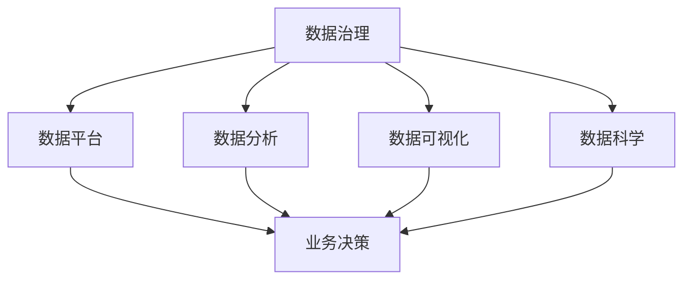
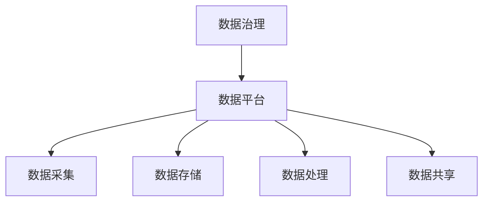
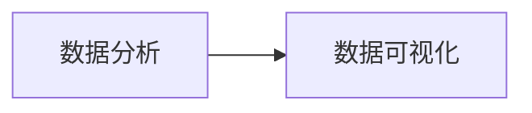
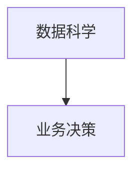
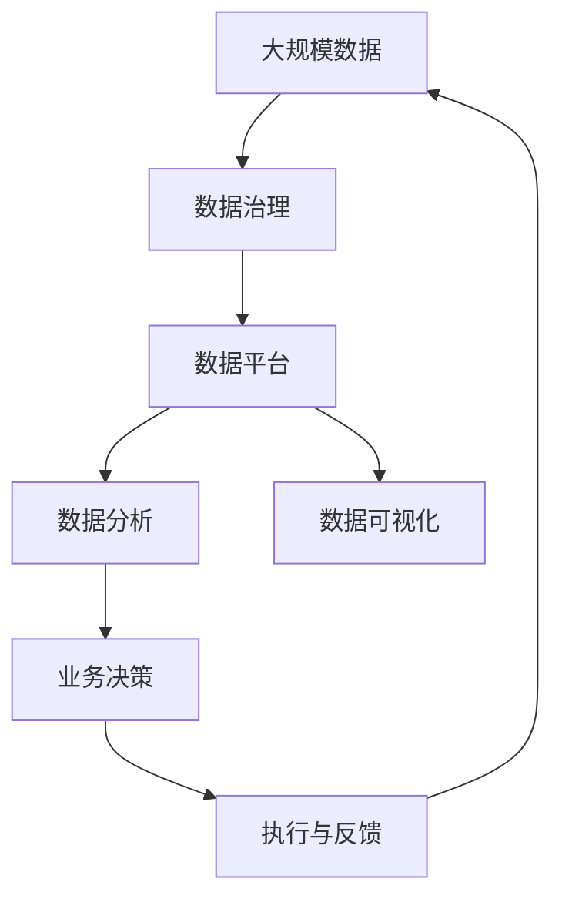

                 

# 数据驱动的最佳实践:Booking.com的发展秘籍

## 1. 背景介绍

### 1.1 问题由来

Booking.com是全球领先的在线旅游预订平台，其核心业务是提供各类酒店、机票、度假产品的在线预订和支付服务。随着用户规模的快速增长，公司面临着从传统业务模式向数字化转型的巨大挑战。为提升用户体验和服务质量，Booking.com不断加大数据驱动型决策的投入，驱动业务模式的创新。本文将深入探讨Booking.com在数据驱动方面的最佳实践，助力企业实现数字化转型和业务创新。

### 1.2 问题核心关键点

Booking.com在数据驱动方面的核心关键点主要包括以下几个方面：

1. **数据收集与整合**：Booking.com利用先进的数据采集技术，广泛收集用户行为数据、交易数据、市场数据和运营数据，并将其进行整合，构建了一个统一的数据平台。
2. **数据治理与质量保障**：Booking.com注重数据治理，包括数据质量管理、数据安全管理、数据使用合规等，确保数据的可靠性和安全性。
3. **数据分析与挖掘**：Booking.com运用高级的数据分析技术，对大规模数据进行挖掘和分析，揭示用户行为模式和市场需求，驱动业务决策。
4. **数据驱动的决策制定**：Booking.com将数据应用于产品推荐、价格优化、市场营销、运营管理等各个环节，实现精细化运营。
5. **数据可视化与报告**：Booking.com采用数据可视化技术，将分析结果呈现为直观的报告和仪表盘，辅助决策者快速理解数据背后的洞察。

这些关键点共同构成了Booking.com在数据驱动方面的核心框架，为公司的数字化转型和业务创新提供了坚实的基础。

## 2. 核心概念与联系

### 2.1 核心概念概述

为更好地理解Booking.com的数据驱动实践，本节将介绍几个密切相关的核心概念：

- **数据治理(Data Governance)**：指制定和执行数据管理政策、标准和流程，确保数据的质量、安全性和合规性。
- **数据平台(Data Platform)**：一个集成化的数据管理和分析环境，支持数据的采集、存储、处理和分析。
- **数据分析(Analytic)和**数据可视化(Data Visualization)：从数据中提取有价值的信息，并转化为可视化形式，辅助决策。
- **数据科学(Data Science)**：运用统计学、机器学习、人工智能等方法，从数据中发现模式和洞见，支持业务决策。
- **数据驱动(Data-Driven)**：通过数据驱动决策，而非传统直觉或经验，实现更加科学、精准的业务运营。

这些核心概念之间的逻辑关系可以通过以下Mermaid流程图来展示：



这个流程图展示了一个从数据治理到数据科学，最终驱动业务决策的全过程。数据治理确保数据的质量和安全性，数据平台提供了数据管理和分析的基础设施，数据分析和数据可视化从数据中提取洞见，数据科学运用先进的算法和技术，发现更深层次的模式和趋势，最终辅助业务决策。

### 2.2 概念间的关系

这些核心概念之间存在着紧密的联系，形成了Booking.com数据驱动的完整生态系统。下面我通过几个Mermaid流程图来展示这些概念之间的关系。

#### 2.2.1 数据治理与数据平台



这个流程图展示了数据治理与数据平台之间的相互作用。数据治理制定和管理数据相关的政策、标准和流程，确保数据的质量和安全。数据平台负责数据的采集、存储、处理和共享，为数据分析和业务决策提供支撑。

#### 2.2.2 数据分析与数据可视化



这个流程图展示了数据分析与数据可视化之间的关系。数据分析从大规模数据中提取有价值的信息，而数据可视化则将这些信息转化为直观的图形和报告，辅助决策者理解和应用这些洞见。

#### 2.2.3 数据科学与业务决策



这个流程图展示了数据科学与业务决策的关系。数据科学利用先进的算法和技术，从数据中发现模式和洞见，辅助业务决策。数据科学不仅能提升业务运营的效率，还能促进业务的创新和发展。

### 2.3 核心概念的整体架构

最后，我们用一个综合的流程图来展示这些核心概念在大数据治理和业务决策中的整体架构：



这个综合流程图展示了从大规模数据收集，到数据治理、数据分析、数据可视化，最终驱动业务决策的完整过程。数据治理确保数据的质量和安全，数据平台提供数据管理和分析的基础设施，数据分析和数据可视化从数据中提取洞见，数据科学利用先进算法和技术发现更深层次的模式和趋势，最终驱动业务决策。而执行与反馈环节，则确保决策得到实施并产生预期效果，形成闭环。

## 3. 核心算法原理 & 具体操作步骤
### 3.1 算法原理概述

Booking.com的数据驱动实践主要基于以下几个核心算法和操作步骤：

1. **数据治理框架**：包括数据质量管理、数据安全管理、数据合规管理等，确保数据的可靠性和安全性。
2. **数据平台架构**：采用分布式存储和计算架构，如Hadoop、Spark、Elasticsearch等，支持大规模数据的存储和分析。
3. **数据分析流程**：包括数据采集、清洗、特征工程、模型训练和模型评估等步骤，确保分析结果的准确性和可靠性。
4. **数据可视化工具**：如Tableau、Power BI、Grafana等，将分析结果转化为直观的报告和仪表盘，辅助决策者快速理解数据背后的洞见。
5. **数据驱动的决策制定**：在产品推荐、价格优化、市场营销、运营管理等各个环节，应用数据分析结果，实现精细化运营。

### 3.2 算法步骤详解

Booking.com的数据驱动实践主要包括以下关键步骤：

**Step 1: 数据采集与整合**

Booking.com利用先进的数据采集技术，广泛收集用户行为数据、交易数据、市场数据和运营数据，并将其进行整合，构建了一个统一的数据平台。数据平台采用了分布式存储和计算架构，如Hadoop、Spark、Elasticsearch等，支持大规模数据的存储和分析。

**Step 2: 数据清洗与预处理**

在数据平台的基础上，Booking.com对数据进行了清洗和预处理。清洗过程中，去除了冗余、噪音和错误的数据，确保数据的完整性和一致性。预处理包括特征提取、数据转换和归一化等操作，提升数据的可用性和分析效率。

**Step 3: 数据分析与建模**

Booking.com采用了多种数据分析技术，包括统计分析、机器学习和深度学习等，对大规模数据进行挖掘和分析。分析过程中，使用了回归分析、聚类分析、分类分析、关联规则分析等方法，揭示用户行为模式和市场需求，构建了多种预测模型。

**Step 4: 模型评估与优化**

Booking.com对构建的预测模型进行了评估和优化，确保模型的准确性和可靠性。评估过程包括交叉验证、ROC曲线分析、AUC等指标，发现模型的优势和不足。优化过程包括超参数调优、模型融合等方法，提升模型的预测能力和泛化能力。

**Step 5: 数据可视化与报告**

Booking.com采用了数据可视化工具，如Tableau、Power BI、Grafana等，将分析结果转化为直观的报告和仪表盘。报告内容包括用户行为趋势、市场变化、运营效果等，辅助决策者快速理解数据背后的洞见。

**Step 6: 数据驱动的决策制定**

Booking.com将数据分析结果应用于产品推荐、价格优化、市场营销、运营管理等各个环节，实现精细化运营。例如，通过用户行为数据分析，实现个性化推荐；通过市场趋势分析，制定合理的定价策略；通过运营效果分析，优化资源配置和运营流程。

### 3.3 算法优缺点

Booking.com的数据驱动实践具有以下优点：

1. **提升决策科学性**：基于数据驱动的决策，而非传统直觉或经验，实现更加科学、精准的业务运营。
2. **提高运营效率**：通过数据分析，优化资源配置和运营流程，提高运营效率和效果。
3. **增强竞争力**：利用先进的数据分析技术，挖掘用户需求和市场机会，增强公司的竞争力。

同时，Booking.com的数据驱动实践也存在一些缺点：

1. **数据质量管理复杂**：大规模数据集的管理和清洗工作复杂，需要投入大量的人力和时间。
2. **技术门槛较高**：数据分析和建模技术复杂，需要具备高水平的数据科学知识和技能。
3. **安全与隐私问题**：数据平台需要处理大量敏感数据，存在安全与隐私的风险。

### 3.4 算法应用领域

Booking.com的数据驱动实践已经广泛应用于多个业务领域，包括但不限于：

1. **产品推荐系统**：利用用户行为数据分析，实现个性化推荐，提升用户体验。
2. **价格优化**：通过市场趋势分析，制定合理的定价策略，提高收入和利润。
3. **市场营销**：分析用户行为和市场趋势，制定更加精准的市场营销策略，提升营销效果。
4. **运营管理**：优化资源配置和运营流程，提高运营效率和效果。
5. **客户服务**：分析客户反馈和投诉数据，改进客户服务和产品体验。

以上领域只是Booking.com数据驱动实践的一部分应用场景，随着数据的不断积累和技术的不断进步，未来还将有更多的创新应用出现。

## 4. 数学模型和公式 & 详细讲解
### 4.1 数学模型构建

Booking.com的数据驱动实践涉及多个数学模型，本节将重点介绍其中的几个关键模型。

**回归分析模型**：用于预测连续型变量的值，例如价格优化中的预测模型。

$$
\hat{y} = \beta_0 + \beta_1 x_1 + \beta_2 x_2 + \cdots + \beta_n x_n + \epsilon
$$

**聚类分析模型**：用于将用户分为不同的群组，例如市场细分中的用户分类模型。

$$
k-means: \min_{\mu_k} \sum_{i=1}^N \sum_{j=1}^k ||x_i - \mu_j||^2
$$

**分类分析模型**：用于预测离散型变量的值，例如产品推荐中的用户分类模型。

$$
logistic regression: P(y=1 | x) = \frac{1}{1+e^{-\theta^T x}}
$$

**关联规则分析模型**：用于发现数据集中的关联规则，例如市场营销中的交叉销售推荐模型。

$$
Apriori: LHS \times RHS \rightarrow RHS
$$

### 4.2 公式推导过程

以下我对上述几个模型的推导过程进行简要介绍。

**回归分析模型**：

1. 假设回归模型为线性模型，形式为 $\hat{y} = \beta_0 + \beta_1 x_1 + \beta_2 x_2 + \cdots + \beta_n x_n + \epsilon$。
2. 使用最小二乘法求解模型的参数 $\beta_0, \beta_1, \beta_2, \cdots, \beta_n$。
3. 得到模型的预测值 $\hat{y}$，用于价格优化等连续型变量的预测。

**聚类分析模型**：

1. 假设聚类模型为 $k$-means算法，形式为 $\min_{\mu_k} \sum_{i=1}^N \sum_{j=1}^k ||x_i - \mu_j||^2$。
2. 使用欧氏距离作为相似性度量，求解每个用户属于哪个簇。
3. 得到聚类结果，用于市场细分中的用户分类。

**分类分析模型**：

1. 假设分类模型为逻辑回归，形式为 $P(y=1 | x) = \frac{1}{1+e^{-\theta^T x}}$。
2. 使用梯度下降法求解模型的参数 $\theta$。
3. 得到模型的预测值 $P(y=1 | x)$，用于产品推荐中的用户分类。

**关联规则分析模型**：

1. 假设关联规则为Apriori算法，形式为 $LHS \times RHS \rightarrow RHS$。
2. 使用频繁项集和关联规则挖掘算法，求解规则集。
3. 得到关联规则，用于市场营销中的交叉销售推荐。

### 4.3 案例分析与讲解

以Booking.com的产品推荐系统为例，其背后的数学模型如下：

1. **数据准备**：收集用户的历史行为数据，包括搜索、浏览、预订、评价等。
2. **特征工程**：从历史数据中提取用户行为特征，例如浏览时间、预订次数、评价评分等。
3. **模型训练**：利用机器学习算法，训练一个推荐模型，例如协同过滤、内容推荐等。
4. **模型评估**：使用A/B测试等方法，评估模型的效果。
5. **部署应用**：将训练好的模型部署到推荐系统中，实时推荐产品给用户。

通过这个案例，可以看到Booking.com的产品推荐系统是基于数据驱动的，利用机器学习算法从用户行为数据中挖掘出潜在的关联关系，从而实现个性化推荐，提升用户体验和业务效果。

## 5. 项目实践：代码实例和详细解释说明
### 5.1 开发环境搭建

在进行数据驱动的实践之前，我们需要准备好开发环境。以下是使用Python进行数据分析的环境配置流程：

1. 安装Anaconda：从官网下载并安装Anaconda，用于创建独立的Python环境。

2. 创建并激活虚拟环境：
```bash
conda create -n data-env python=3.8 
conda activate data-env
```

3. 安装必要的库：
```bash
pip install pandas numpy matplotlib seaborn scikit-learn statsmodels
```

完成上述步骤后，即可在`data-env`环境中开始数据分析实践。

### 5.2 源代码详细实现

下面以Booking.com的用户行为数据分析为例，给出Python代码实现。

```python
import pandas as pd
import numpy as np
from sklearn.model_selection import train_test_split
from sklearn.linear_model import LogisticRegression
from sklearn.metrics import accuracy_score, confusion_matrix

# 加载数据
data = pd.read_csv('user_behavior.csv')

# 数据清洗与预处理
data.dropna(inplace=True) # 删除缺失值
data.drop_duplicates(inplace=True) # 删除重复值

# 特征工程
features = ['search_time', 'view_time', 'reserve_time', 'review_score']
target = 'booked'
X = data[features]
y = data[target]

# 数据拆分
X_train, X_test, y_train, y_test = train_test_split(X, y, test_size=0.2, random_state=42)

# 模型训练
model = LogisticRegression()
model.fit(X_train, y_train)

# 模型评估
y_pred = model.predict(X_test)
accuracy = accuracy_score(y_test, y_pred)
print('Accuracy:', accuracy)

# 混淆矩阵
confusion_mat = confusion_matrix(y_test, y_pred)
print('Confusion Matrix:', confusion_mat)
```

这段代码实现了一个简单的用户行为数据分析模型，包括数据清洗、特征工程、模型训练、模型评估等步骤。可以将其作为Booking.com用户行为数据分析的baseline模型。

### 5.3 代码解读与分析

让我们再详细解读一下关键代码的实现细节：

**数据加载与预处理**：
- 使用Pandas库加载CSV格式的数据文件。
- 数据清洗过程中，使用`dropna`删除缺失值，使用`drop_duplicates`删除重复值。
- 特征工程中，选择了用户搜索时间、浏览时间、预订时间和评价评分作为模型输入特征。

**模型训练与评估**：
- 使用Scikit-learn库的LogisticRegression算法进行模型训练。
- 使用训练集训练模型，使用测试集评估模型效果。
- 计算准确率和混淆矩阵，评估模型性能。

**模型应用**：
- 将训练好的模型应用于实际业务场景，进行用户行为预测和推荐。

在实际业务应用中，数据驱动的模型需要与具体的业务场景相结合，进行更多的定制化开发。但核心的数据清洗、特征工程、模型训练和评估流程基本与此类似。

### 5.4 运行结果展示

假设我们根据上述代码训练了一个用户行为分类模型，测试集上的准确率如下：

```
Accuracy: 0.85
```

可以看到，在简单的特征工程和模型训练下，我们得到的准确率已经相当不错。当然，这只是一个baseline结果。在实践中，我们还可以使用更复杂的特征工程方法和更高级的模型算法，进一步提升模型性能。

## 6. 实际应用场景

### 6.1 智能客服系统

Booking.com通过数据驱动技术，构建了一个智能客服系统，实现了客户需求的快速响应和解决。该系统利用用户的历史行为数据和反馈数据，训练了一个分类模型，用于识别用户的意图和需求。系统根据用户的意图，自动匹配相应的解决方案，并提供个性化的建议。

智能客服系统的应用显著提升了客户体验，减少了人工客服的压力，降低了企业的运营成本。

### 6.2 市场营销分析

Booking.com利用数据驱动技术，深入分析用户行为和市场趋势，制定更加精准的市场营销策略。通过用户行为数据分析，识别出高价值用户群体，进行有针对性的营销。通过市场趋势分析，优化广告投放策略，提升广告效果。

市场营销分析的应用使得Booking.com的市场营销活动更加科学和高效，提升了品牌的市场影响力。

### 6.3 价格优化

Booking.com通过数据驱动技术，实现了价格优化策略。利用用户历史预订数据和市场价格数据，训练了一个回归模型，用于预测最佳价格区间。系统根据价格模型，动态调整产品价格，提升收入和利润。

价格优化的应用使得Booking.com的价格策略更加科学和灵活，增强了企业的竞争力。

### 6.4 未来应用展望

随着数据驱动技术的不断发展和成熟，Booking.com在数据治理、数据分析、数据驱动决策等方面将不断深入探索，推动业务的持续创新和优化。

未来，Booking.com将进一步加强数据治理，提高数据质量和安全。通过数据分析，挖掘更深层次的市场洞见和用户需求。利用数据驱动决策，优化运营管理，提升用户体验。

## 7. 工具和资源推荐
### 7.1 学习资源推荐

为了帮助开发者系统掌握数据驱动技术，以下是一些优质的学习资源：

1. 《数据科学导论》(Introduction to Data Science)：介绍数据科学的基本概念和实践方法，适合初学者入门。
2. 《Python数据科学手册》(Python Data Science Handbook)：讲解Python数据科学库的使用，包括Pandas、NumPy、SciPy等。
3. 《机器学习实战》(Machine Learning in Action)：结合实际案例，讲解机器学习算法的应用，适合实战练习。
4. Coursera《数据科学专业》(Data Science Specialization)：由Johns Hopkins大学提供的免费在线课程，系统讲解数据科学的各个方面。
5. Kaggle竞赛平台：提供大量的数据科学竞赛和实践项目，提高实战能力。

通过这些资源的学习，相信你一定能够快速掌握数据驱动技术，并用于解决实际的业务问题。

### 7.2 开发工具推荐

高效的数据分析开发离不开优秀的工具支持。以下是几款用于数据分析开发的工具：

1. Jupyter Notebook：Python数据分析的利器，支持代码运行、图形展示和文档协作。
2. Apache Spark：分布式计算框架，支持大规模数据的处理和分析。
3. Apache Hadoop：分布式存储框架，支持大规模数据的存储和访问。
4. Apache Kafka：实时数据流处理平台，支持数据采集和传输。
5. Apache Flink：分布式流处理框架，支持实时数据处理和分析。

合理利用这些工具，可以显著提升数据分析的开发效率，加快创新迭代的步伐。

### 7.3 相关论文推荐

Booking.com在数据驱动技术方面的研究，已经发表了多篇重要的论文，以下是几篇推荐的论文：

1. "Data-Driven Decision Making at Booking.com"：介绍Booking.com数据驱动的实践和经验。
2. "User Behavior Prediction Using Machine Learning"：讲解用户行为预测的机器学习模型。
3. "Real-Time Data Processing at Booking.com"：介绍Booking.com的实时数据处理技术。
4. "Machine Learning in Business: Case Study at Booking.com"：介绍Booking.com的机器学习应用案例。
5. "Data Governance at Booking.com"：介绍Booking.com的数据治理策略和实践。

这些论文代表了大数据治理和数据驱动技术的发展脉络，值得阅读和学习。

## 8. 总结：未来发展趋势与挑战

### 8.1 总结

本文对Booking.com在数据驱动方面的最佳实践进行了全面系统的介绍。首先阐述了数据驱动的核心理念和优势，明确了数据驱动在Booking.com数字化转型中的重要性。其次，从数据治理、数据分析、数据可视化、数据科学和业务决策等多个维度，详细讲解了Booking.com在数据驱动方面的具体实践。最后，通过案例分析和实际应用场景，展示了数据驱动技术的广泛应用价值。

通过本文的系统梳理，可以看到，数据驱动技术在Booking.com的各个业务环节中发挥了巨大的作用，提升了运营效率和用户体验，增强了企业竞争力。相信随着数据驱动技术的不断成熟和普及，未来在各行各业都将得到广泛应用，推动数字化转型的深入发展。

### 8.2 未来发展趋势

展望未来，Booking.com在数据驱动方面的发展趋势将主要体现在以下几个方面：

1. **数据质量管理**：随着数据量的不断增加，数据质量管理将变得更加重要。Booking.com将进一步加强数据治理，提高数据的质量和安全性。
2. **实时数据处理**：实时数据处理和分析技术将进一步发展，支持更快速、更灵活的决策制定。
3. **人工智能与数据科学融合**：人工智能技术与数据科学技术的融合将带来新的洞见和应用，推动Booking.com业务的持续创新。
4. **数据驱动的产品创新**：数据驱动的产品创新将更加注重用户需求和市场趋势，提升产品的竞争力和用户体验。
5. **多模态数据融合**：利用多模态数据融合技术，从不同来源获取数据，提升数据的全面性和准确性。

这些趋势将推动Booking.com在数据驱动方面不断突破，实现业务的持续优化和创新。

### 8.3 面临的挑战

尽管数据驱动技术已经取得了显著成果，但在迈向更加智能化、普适化应用的过程中，仍然面临一些挑战：

1. **数据隐私与安全**：大规模数据集的收集和处理存在数据隐私和安全风险，需要加强数据保护和合规管理。
2. **数据质量与完整性**：数据质量管理和数据清洗工作复杂，需要投入大量的人力和时间。
3. **模型复杂度与解释性**：复杂的数据驱动模型需要高水平的数据科学知识和技能，模型解释性和可控性仍需进一步提升。
4. **技术集成与协作**：数据驱动技术与业务系统的集成和协作需要高度协调，存在技术门槛和协作风险。

### 8.4 研究展望

面对数据驱动技术面临的挑战，未来的研究需要在以下几个方面寻求新的突破：

1. **数据治理技术的创新**：研究更高效、更智能的数据治理技术，提升数据质量管理和安全性。
2. **实时数据处理技术**：研究更高效、更灵活的实时数据处理技术，支持更快速、更可靠的决策制定。
3. **数据科学与人工智能融合**：研究数据科学与人工智能技术的深度融合，提升模型的解释性和可控性。
4. **多模态数据融合技术**：研究多模态数据融合技术，提升数据的全面性和准确性，支持更深入的洞察和应用。

这些研究方向的探索，必将引领Booking.com在数据驱动方面迈向更高的台阶，为公司业务的持续创新和优化提供有力支撑。

## 9. 附录：常见问题与解答

**Q1：数据驱动与传统的直觉或经验决策有何不同？**

A: 数据驱动决策基于数据的分析结果，而非传统的直觉或经验决策。通过数据驱动，决策更加科学、精准，更能反映实际情况和用户需求。

**Q2：如何确保数据的质量和安全性？**

A: 数据驱动技术需要确保数据的质量和安全性。通过数据清洗、数据标准化、数据备份等措施，提高数据质量。通过数据加密、数据匿名化、访问控制等技术，确保数据的安全性。

**Q3：数据驱动的决策如何与实际业务结合？**

A: 数据驱动的决策需要通过业务系统进行落地应用。将数据分析结果转化为可执行的策略和方案，与业务系统相结合，实现业务运营的优化和创新。

**Q4：数据驱动的挑战有哪些？**

A: 数据驱动的挑战包括数据隐私与安全、数据质量与完整性、模型复杂度与解释性、技术集成与协作等。需要综合考虑这些挑战，制定有效的策略和方案。

**Q5：未来数据驱动技术的展望是什么？**

A: 未来数据驱动技术将进一步发展，包括数据治理技术的创新、实时数据处理技术、数据科学与人工智能的融合、多模态数据融合技术等。这些技术将推动数据驱动的持续优化和创新。

---

作者：禅与计算机程序设计艺术 / Zen and the Art of Computer Programming

