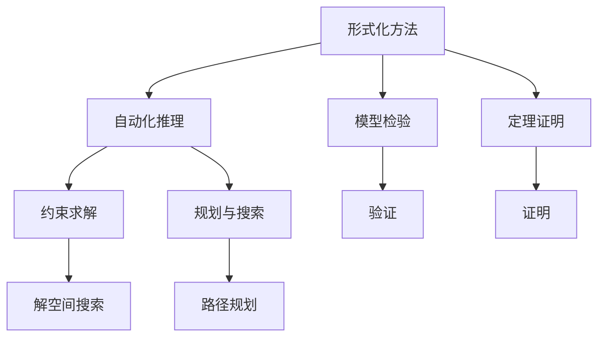

                 

## 1. 背景介绍

### 1.1 问题由来
数理逻辑，作为一种形式化推理工具，在计算机科学和人工智能领域发挥着至关重要的作用。它不仅用于保证程序的正确性、安全性和可靠性，还广泛应用于自动化推理、规划、自然语言处理等领域，确保了系统在复杂环境下的协调性和鲁棒性。然而，随着计算机系统和应用场景的复杂性不断提升，仅依赖传统的数理逻辑方法已难以满足现代应用的需求。

### 1.2 问题核心关键点
在数理逻辑研究中，有两个核心概念：可靠性和协调性。可靠性指的是系统在一定条件下满足特定要求的能力；协调性则是指系统在多个部分或组件间进行有效配合和协作，实现整体目标的能力。这两个概念的实现，需要借助数理逻辑的形式化方法，并通过具体算法和工具加以实现。

### 1.3 问题研究意义
研究数理逻辑的可靠性和协调性，对于提高系统的整体性能、安全性和鲁棒性具有重要意义：
1. 可靠性和协调性的提升，可以保证系统在各种异常情况下的正确运行，减少故障和错误。
2. 通过形式化的方法，可以清晰地定义和验证系统的要求，减少误解和错误。
3. 协调性的增强，可以提升系统在复杂场景下的适应性和灵活性，提高用户体验。
4. 可靠性和协调性的研究，还可以为其他领域的数理逻辑应用提供借鉴和参考，推动相关技术的进步。

## 2. 核心概念与联系

### 2.1 核心概念概述

为更好地理解数理逻辑中的可靠性和协调性，本节将介绍几个密切相关的核心概念：

- 形式化方法(Formal Method)：通过符号化表达和推理规则，将问题的解决过程形式化。
- 可靠性(Reliability)：系统在特定条件下满足要求的概率。
- 协调性(Coordinability)：系统各部分协同工作的能力。
- 自动化推理(Automatic Reasoning)：利用算法和工具自动执行数理逻辑推理。
- 模型检验(Model Checking)：通过验证推理结果的正确性，确保系统满足要求。
- 定理证明(Theorem Proving)：通过一系列推理步骤，证明特定命题的真假。
- 约束求解(Constraint Satisfiability)：在满足一定约束条件下，寻找解的自动化方法。
- 规划与搜索(Planning and Search)：寻找达成特定目标的路径或计划。

这些概念之间的逻辑关系可以通过以下Mermaid流程图来展示：



这个流程图展示了几类数理逻辑方法及其关联：

1. 形式化方法通过符号化表达问题，并通过推理、验证等步骤解决。
2. 自动化推理在形式化方法的基础上，通过算法实现推理过程的自动化。
3. 模型检验和定理证明是对自动化推理结果的正确性进行验证和证明。
4. 约束求解和规划与搜索是在满足特定约束或目标条件下，寻找解的自动化方法。

通过理解这些核心概念，我们可以更好地把握数理逻辑的整体框架，并探究其可靠性和协调性的实现机制。

### 2.2 概念间的关系

这些核心概念之间存在着紧密的联系，构成了数理逻辑的完整体系：

- 形式化方法是基础，通过符号化表达，将问题形式化，为后续的自动化推理和验证奠定基础。
- 自动化推理和模型检验、定理证明共同构成数理逻辑的推理和验证环节，保证推理结果的正确性。
- 约束求解和规划与搜索通过自动化方法，在满足特定约束或目标条件下，寻找解或规划路径。
- 可靠性关注的是系统在特定条件下的正确性和可靠性，而协调性则是在多部分或组件间的协同工作能力。
- 这些概念共同构成了数理逻辑的演绎推理和验证体系，保证了系统的正确性、可靠性和协调性。

## 3. 核心算法原理 & 具体操作步骤
### 3.1 算法原理概述

数理逻辑中的可靠性和协调性实现，通常基于以下几个关键算法原理：

- 模型检验算法：通过模拟系统的行为，验证系统是否满足特定要求。
- 定理证明算法：通过一系列推理步骤，证明特定命题的真假。
- 约束求解算法：在满足一定约束条件下，寻找解的自动化方法。
- 规划与搜索算法：通过搜索或计划生成，寻找达成特定目标的路径或计划。

这些算法原理在数理逻辑的应用中起着至关重要的作用，保证了系统的可靠性和协调性。

### 3.2 算法步骤详解

以下将详细介绍数理逻辑实现可靠性和协调性的关键算法步骤：

**步骤 1: 形式化问题描述**
- 将问题转化为符号表达式，定义逻辑变量、命题和推理规则。
- 确保问题描述清晰、完整，没有歧义。

**步骤 2: 自动化推理**
- 使用自动化推理工具，如Prolog、SAT solver等，进行符号推理。
- 将推理结果生成可执行的代码或模型，进行验证和优化。

**步骤 3: 模型检验**
- 通过模拟系统的行为，验证推理结果的正确性。
- 使用模型检验工具，如NuSMV、Uppercase等，进行模型验证。

**步骤 4: 定理证明**
- 使用定理证明工具，如Isabelle、HOL Light等，进行形式化证明。
- 证明推理结果的正确性，并生成证明文件。

**步骤 5: 约束求解**
- 使用约束求解工具，如Choco、CP-SAT等，在满足一定约束条件下寻找解。
- 解决多变量的求解问题，优化系统性能。

**步骤 6: 规划与搜索**
- 使用规划与搜索工具，如PRISM、Planner等，生成达目标的路径或计划。
- 优化搜索策略，提升系统效率。

**步骤 7: 可靠性评估**
- 使用可靠性评估工具，如MATLAB、PSim等，进行系统可靠性的评估。
- 分析系统在各种异常情况下的表现，确保系统的鲁棒性。

**步骤 8: 协调性设计**
- 设计系统的协调机制，如协议、数据同步等，确保各部分协同工作。
- 通过协同算法和机制，提升系统的协调性。

这些步骤详细描述了数理逻辑在实现可靠性和协调性方面的具体操作方法，为后续的案例分析与讲解提供了依据。

### 3.3 算法优缺点

数理逻辑在实现可靠性和协调性方面，具有以下优点：
- 形式化方法保证了推理过程的正确性和可验证性。
- 自动化推理提高了效率和准确性。
- 模型检验和定理证明确保了推理结果的正确性。
- 约束求解和规划与搜索提升了系统的灵活性和鲁棒性。

同时，数理逻辑也存在以下局限性：
- 对问题的形式化表达要求较高，有时难以实现。
- 自动化工具的复杂度和可操作性不足，需要专业知识和技能。
- 模型和工具的选择和配置可能影响结果。
- 对特定问题的求解可能过于复杂，计算资源消耗大。

尽管存在这些局限性，但数理逻辑在保证系统可靠性和协调性方面的核心地位，依然不可替代。未来，相关技术的发展将进一步提升其应用价值。

### 3.4 算法应用领域

数理逻辑的可靠性和协调性在多个领域得到了广泛应用，例如：

- 航空航天：在飞行器控制、导航、故障检测等领域，数理逻辑保证了系统的可靠性。
- 医疗健康：在诊断、治疗、药物研发等领域，数理逻辑提升了医疗决策的准确性和协调性。
- 金融保险：在风险评估、交易管理、保险理赔等领域，数理逻辑确保了系统的安全性和可靠性。
- 交通运输：在交通管制、自动驾驶、物流优化等领域，数理逻辑提升了系统的协调性和效率。
- 智能制造：在生产计划、质量控制、设备维护等领域，数理逻辑优化了生产过程，提升了系统的协调性和可靠性。

以上领域只是冰山一角，数理逻辑的应用范围还在不断扩大，未来将有更多行业受益于这一强大的推理工具。

## 4. 数学模型和公式 & 详细讲解 & 举例说明

### 4.1 数学模型构建

数理逻辑的核心数学模型主要包括以下几个方面：

- 命题逻辑公式：通过布尔代数表示命题之间的关系。
- 谓词逻辑公式：通过函数表示变量的关系，用于处理实际问题。
- 一阶逻辑公式：将谓词逻辑扩展到多个变量，用于更复杂的推理。
- 逻辑推理规则：用于证明特定命题的真假。

### 4.2 公式推导过程

以下以命题逻辑公式为例，详细推导其形式化表达和推理过程。

**命题逻辑公式的形式化表达**

假设有一个命题逻辑公式：

$$
P \wedge Q \rightarrow R
$$

其中 $P$、$Q$ 和 $R$ 均为命题。该公式表示如果 $P$ 和 $Q$ 同时为真，则 $R$ 为真。

**命题逻辑公式的推理过程**

1. **推理规则**
   - 符号化推理规则：$\lnot(P \wedge Q)$ 等价于 $\lnot P \vee \lnot Q$
   - 推理顺序：先推理 $P \wedge Q$ 的否定，再根据 $\rightarrow$ 规则推导 $R$

2. **推理步骤**
   - 假设 $P$ 和 $Q$ 同时为真，即 $\lnot P \vee \lnot Q = \text{false}$。
   - 根据 $\rightarrow$ 规则，$R = \text{true}$。

通过以上步骤，我们可以形式化表达和推理命题逻辑公式，保证了推理过程的正确性和可验证性。

### 4.3 案例分析与讲解

**案例 1: 飞行器控制系统**

假设有一个飞行器控制系统，需要确保飞行器在检测到故障时，立即执行安全操作。

- **形式化描述**
  - 飞行器检测到故障（$F$）
  - 执行安全操作（$S$）
  - 条件：检测到故障且没有执行安全操作（$F \wedge \lnot S$）

- **符号化公式**
  $$
  F \rightarrow S
  $$

- **推理过程**
  - 假设飞行器检测到故障，即 $F = \text{true}$。
  - 根据 $\rightarrow$ 规则，执行安全操作 $S = \text{true}$。
  - 飞行器控制系统确保在检测到故障时，立即执行安全操作，保证了系统的可靠性。

**案例 2: 智能医疗诊断系统**

假设有一个智能医疗诊断系统，需要根据患者的症状（$P$）和体检结果（$Q$），推断出疾病（$R$）。

- **形式化描述**
  - 患者症状（$P$）
  - 体检结果（$Q$）
  - 条件：患者症状且体检结果正常（$P \wedge Q$）
  - 结论：疾病（$R$）

- **符号化公式**
  $$
  P \wedge Q \rightarrow R
  $$

- **推理过程**
  - 假设患者有症状且体检结果正常，即 $P = \text{true}$ 和 $Q = \text{true}$。
  - 根据 $\rightarrow$ 规则，推断出疾病 $R = \text{true}$。
  - 智能医疗诊断系统通过符号化表达和推理，确保了诊断结果的准确性。

通过以上案例分析，可以看到数理逻辑在形式化表达和推理方面的强大能力，以及其在实际应用中的广泛应用。

## 5. 项目实践：代码实例和详细解释说明

### 5.1 开发环境搭建

要进行数理逻辑的实现和验证，首先需要搭建一个适合的环境。以下是使用Python进行符号化推理和验证的环境配置流程：

1. 安装Anaconda：从官网下载并安装Anaconda，用于创建独立的Python环境。

2. 创建并激活虚拟环境：
```bash
conda create -n sympy-env python=3.8 
conda activate sympy-env
```

3. 安装Sympy：
```bash
pip install sympy
```

4. 安装各类工具包：
```bash
pip install numpy pandas scikit-learn matplotlib tqdm jupyter notebook ipython
```

完成上述步骤后，即可在`sympy-env`环境中开始符号化推理和验证实践。

### 5.2 源代码详细实现

这里我们以符号化推理为例，给出使用Sympy库进行数理逻辑推理的Python代码实现。

首先，定义一个符号化表达式：

```python
from sympy import symbols, And, Or, Not, Implies

# 定义命题符号
P, Q, R = symbols('P Q R')

# 定义命题逻辑公式
formula = Implies(And(P, Q), R)

# 打印公式
print(formula)
```

然后，进行符号化推理：

```python
# 假设P和Q同时为真
p_true = True
q_true = True

# 推导R的真值
r_true = Not(Not(P) | Not(Q))  # 根据符号化推理规则
```

最后，输出推理结果：

```python
# 输出R的真值
print(r_true)
```

以上就是使用Sympy进行符号化推理的完整代码实现。可以看到，通过Sympy库，我们可以方便地进行命题逻辑的符号化表达和推理。

### 5.3 代码解读与分析

让我们再详细解读一下关键代码的实现细节：

**symbols函数**：
- 定义了三个命题符号，用于表示命题 $P$、$Q$ 和 $R$。

**Implies函数**：
- 定义了命题逻辑公式 $P \wedge Q \rightarrow R$，即 $P \wedge Q$ 的否定是 $R$ 的否定，表示如果 $P$ 和 $Q$ 同时为真，则 $R$ 为真。

**Not函数**：
- 定义了逻辑运算 $\lnot$，即命题的否定。

**Or函数**：
- 定义了逻辑运算 $\vee$，即命题的析取。

**And函数**：
- 定义了逻辑运算 $\wedge$，即命题的合取。

**符号化推理的实现**：
- 假设 $P$ 和 $Q$ 同时为真，即 $P = \text{true}$ 和 $Q = \text{true}$。
- 根据符号化推理规则，$\lnot(P \wedge Q)$ 等价于 $\lnot P \vee \lnot Q$。
- 由 $\lnot(P \wedge Q)$ 和 $\rightarrow$ 规则推导出 $R$ 为真。

通过以上代码，我们可以看到Sympy库的强大能力，使得符号化推理变得更加简单和高效。

### 5.4 运行结果展示

假设我们在上述案例中使用Sympy进行符号化推理，最终得到的结果为 $R = \text{true}$。这表明在给定条件下，$P$ 和 $Q$ 同时为真时，$R$ 必然为真。

## 6. 实际应用场景

### 6.1 智能制造

智能制造是现代工业的重要发展方向，通过自动化和智能化技术，提高生产效率和质量。数理逻辑在智能制造中的应用，主要体现在以下几个方面：

- **生产计划优化**
  - 通过符号化表达生产条件和目标，进行多目标优化。
  - 使用约束求解工具，生成最优的生产计划。
- **设备维护**
  - 通过符号化表达设备的运行状态和维护需求，进行状态监测和故障诊断。
  - 使用规划与搜索工具，生成设备维护计划。
- **质量控制**
  - 通过符号化表达产品的质量要求和检测结果，进行质量验证。
  - 使用逻辑推理工具，确保产品质量符合标准。

数理逻辑在智能制造中的应用，显著提升了生产效率和质量，确保了系统的可靠性和协调性。

### 6.2 自动驾驶

自动驾驶是未来交通发展的重要方向，通过感知、决策和控制等技术，实现车辆自动化运行。数理逻辑在自动驾驶中的应用，主要体现在以下几个方面：

- **环境感知**
  - 通过符号化表达传感器数据和环境特征，进行环境建模和感知。
  - 使用推理工具，生成环境感知结果。
- **路径规划**
  - 通过符号化表达路径条件和目标，进行路径规划和优化。
  - 使用规划与搜索工具，生成最优路径。
- **安全控制**
  - 通过符号化表达安全条件和控制需求，进行安全决策。
  - 使用约束求解工具，生成安全控制策略。

数理逻辑在自动驾驶中的应用，保证了系统的安全性和可靠性，提升了自动驾驶的性能和用户体验。

### 6.3 医疗健康

医疗健康是关乎人类健康的重要领域，通过智能化手段，提高医疗诊断和治疗的准确性和效率。数理逻辑在医疗健康中的应用，主要体现在以下几个方面：

- **诊断系统**
  - 通过符号化表达症状和体检结果，进行疾病诊断。
  - 使用推理工具，生成诊断结果。
- **治疗方案**
  - 通过符号化表达治疗条件和目标，进行治疗方案优化。
  - 使用规划与搜索工具，生成治疗方案。
- **风险评估**
  - 通过符号化表达风险因素和评估条件，进行风险评估。
  - 使用约束求解工具，生成风险评估结果。

数理逻辑在医疗健康中的应用，提高了诊断和治疗的准确性，确保了系统的可靠性和协调性，为患者健康提供了有力保障。

### 6.4 未来应用展望

随着数理逻辑技术的不断进步，其在更多领域的应用前景将更加广阔。未来，数理逻辑有望在以下领域发挥更大作用：

- **物联网**
  - 通过符号化表达物联网设备的状态和交互规则，进行系统协同和优化。
  - 使用约束求解工具，生成最优的物联网方案。
- **智能家居**
  - 通过符号化表达家居设备的状态和交互需求，进行系统协同和控制。
  - 使用推理工具，生成智能家居方案。
- **金融保险**
  - 通过符号化表达金融市场的数据和规则，进行风险评估和交易管理。
  - 使用约束求解工具，生成最优的交易策略。
- **环境保护**
  - 通过符号化表达环境数据和保护规则，进行环境监测和治理。
  - 使用推理工具，生成环境治理方案。

数理逻辑技术的持续演进，将带来更多的应用创新和突破，推动各领域的技术进步和产业升级。

## 7. 工具和资源推荐

### 7.1 学习资源推荐

为帮助开发者系统掌握数理逻辑的理论基础和实践技巧，这里推荐一些优质的学习资源：

1. 《数理逻辑与元理》系列博文：由数理逻辑专家撰写，深入浅出地介绍了数理逻辑的原理、方法及其在计算机科学中的应用。

2. 《逻辑基础》课程：斯坦福大学开设的逻辑学课程，涵盖数理逻辑的基本概念和方法，是学习数理逻辑的入门课程。

3. 《自动推理与形式化方法》书籍：详细介绍自动推理和形式化方法的基本原理和应用，是数理逻辑学习的经典教材。

4. HOL Light官方文档：HOL Light定理证明工具的官方文档，提供了丰富的例子和案例，是学习和使用HOL Light的重要参考资料。

5. SMT solver工具集：包括MiniSat、CBC、Yices等SMT solver工具，用于解决约束求解问题，是数理逻辑实践的常用工具。

通过这些资源的学习和实践，相信你一定能够系统掌握数理逻辑的理论基础和实践技能，并将其应用于解决实际问题。

### 7.2 开发工具推荐

高效的开发离不开优秀的工具支持。以下是几款用于数理逻辑开发的常用工具：

1. Sympy：Python的符号计算库，支持符号化推理和验证。
2. Z3：用于约束求解的SMT solver工具，支持形式化推理和验证。
3. ECLiPSe：用于自动化推理的Prolog系统，支持规则推理和验证。
4. Isabelle：用于定理证明的HOL系统，支持形式化推理和验证。
5. NuSMV：用于模型检验的SMT solver工具，支持状态空间模型检验。

这些工具使得数理逻辑的实现和验证变得更加简单和高效，是数理逻辑开发的重要支持。

### 7.3 相关论文推荐

数理逻辑在计算机科学和人工智能领域的研究正在不断深入，以下是几篇奠基性的相关论文，推荐阅读：

1. First-Order Logic and Its Relation to Computability（图灵奖获得者Alonzo Church的论文）：介绍了谓词逻辑和第一阶逻辑的基础理论，是数理逻辑研究的经典之作。

2. Automated Reasoning: A Survey（Kee Ng和Wolfgang Meer论文）：综述了自动化推理和形式化方法的基本原理和应用，是数理逻辑研究的经典综述。

3. Proving Programs Correct in Logical Frameworks（John Harrison论文）：介绍了通过形式化方法验证程序正确性的方法，是数理逻辑在程序验证中的重要应用。

4. Coordinated Control of Multiple Mobile Robots via Logic Programming（Jean-François Carre-Petroni论文）：探讨了逻辑程序在多机器人协调控制中的应用，是数理逻辑在机器人技术中的重要应用。

5. Robust Planning with Search and Constraint Solving（Richard S. Sutton论文）：介绍了规划和约束求解在机器人任务中的应用，是数理逻辑在机器人技术中的重要应用。

这些论文代表了数理逻辑研究的发展脉络，通过学习这些前沿成果，可以帮助研究者把握学科前进方向，激发更多的创新灵感。

除上述资源外，还有一些值得关注的前沿资源，帮助开发者紧跟数理逻辑技术的发展：

1. arXiv论文预印本：人工智能领域最新研究成果的发布平台，包括大量尚未发表的前沿工作，学习前沿技术的必读资源。

2. 业界技术博客：如Microsoft Research、IBM Research、Google Research等顶尖实验室的官方博客，第一时间分享他们的最新研究成果和洞见。

3. 技术会议直播：如NIPS、ICML、ACL、ICLR等人工智能领域顶会现场或在线直播，能够聆听到专家们的前沿分享，开拓视野。

4. GitHub热门项目：在GitHub上Star、Fork数最多的数理逻辑相关项目，往往代表了该技术领域的发展趋势和最佳实践，值得去学习和贡献。

5. 行业分析报告：各大咨询公司如McKinsey、PwC等针对数理逻辑行业的分析报告，有助于从商业视角审视技术趋势，把握应用价值。

总之，对于数理逻辑的学习和实践，需要开发者保持开放的心态和持续学习的意愿。多关注前沿资讯，多动手实践，多思考总结，必将收获满满的成长收益。

## 8. 总结：未来发展趋势与挑战

### 8.1 总结

本文对数理逻辑中的可靠性和协调性进行了全面系统的介绍。首先阐述了数理逻辑的可靠性与协调性的研究背景和意义，明确了数理逻辑在保证系统正确性、安全性和协调性方面的独特价值。其次，从原理到实践，详细讲解了数理逻辑的数学模型和算法原理，并给出了数理逻辑的代码实现实例。同时，本文还探讨了数理逻辑在多个实际应用场景中的广泛应用，展示了其强大的推理和验证能力。此外，本文还精选了数理逻辑的相关学习资源、开发工具和论文，力求为读者提供全方位的技术指引。

通过本文的系统梳理，可以看到，数理逻辑在保证系统可靠性和协调性方面的核心地位，以及其在实际应用中的广泛应用。未来，随着数理逻辑技术的不断进步，其应用价值将进一步提升，推动各领域的智能化进程。

### 8.2 未来发展趋势

展望未来，数理逻辑技术将呈现以下几个发展趋势：

1. 形式化验证与自动化推理的融合：将符号化表达、推理验证和自动化工具融合，提升推理和验证的效率和准确性。
2. 多模态推理与协作：在符号化表达和推理基础上，引入视觉、语音等多模态数据，提升系统的协调性和鲁棒性。
3. 符号化与数值化的结合：将符号化表达与数值计算方法结合，解决复杂优化问题，提升系统性能。
4. 模型验证与实践应用的协同：将符号化表达和验证方法，应用于实际系统的设计和优化，提升系统的可靠性和效率。
5. 人机协同与智能决策：通过符号化表达和推理，构建人机协同的智能决策系统，提升系统的智能水平和用户体验。

以上趋势凸显了数理逻辑技术的发展潜力，将进一步提升数理逻辑在复杂系统中的应用价值。

### 8.3 面临的挑战

尽管数理逻辑在保证系统可靠性和协调性方面具有显著优势，但在实际应用中也面临以下挑战：

1. 问题的形式化难度大：对于一些复杂的实际问题，难以找到合适的符号化表达方式。
2. 自动化推理和验证的复杂性：自动化推理和验证工具的使用，需要专业知识和技能，难以普及。
3. 工具的复杂度和可操作性不足：一些工具的复杂度和可操作性不足，影响了数理逻辑的广泛应用。
4. 符号化表达的局限性：符号化表达有时难以直观反映问题的本质，影响了推理结果的解释性和可理解性。
5. 多模态数据的整合和融合：多模态数据的整合和融合，增加了符号化表达和推理的复杂性，需要进一步研究和优化。


