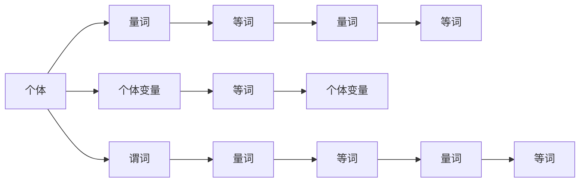

                 

# 数理逻辑：带等词的谓词逻辑的完备性

> 关键词：
- 数理逻辑
- 谓词逻辑
- 等词
- 完备性
- 哥德尔不完备定理
- 模型理论

## 1. 背景介绍

数理逻辑（Mathematical Logic）是计算机科学和数学的重要分支，旨在探索形式化的推理系统和逻辑表达式。在数理逻辑中，谓词逻辑（Predicate Logic）是最重要的一类逻辑系统。谓词逻辑不仅可以描述数学问题，还能处理自然语言中的各种信息，是人工智能和计算机科学的核心工具之一。

本节将介绍数理逻辑中的谓词逻辑和等词，以及它们在推理中的作用。通过了解这些基本概念，可以为后续研究带等词的谓词逻辑的完备性打下基础。

## 2. 核心概念与联系

### 2.1 核心概念概述

在数理逻辑中，谓词逻辑（ Predicate Logic）是描述个体（如人、物体等）及其属性的逻辑系统。谓词逻辑主要包括个体和谓词两种元素：

- 个体（Individual）：如$a$、$b$、$c$等，代表具体的事物或概念。
- 谓词（Predicate）：如$P$、$Q$、$R$等，表示对个体的描述或属性。

谓词逻辑使用量词（如$\forall$、$\exists$）来表示对个体集合的描述，从而刻画更大范围的逻辑关系。

等词（Equality）是谓词逻辑中的重要概念，用来表示两个个体是否相同。在谓词逻辑中，等词通常表示为$x=y$，其中$x$和$y$为个体变量，表示$x$和$y$是否相等。

### 2.2 核心概念原理和架构的 Mermaid 流程图



### 2.3 核心概念间的联系

谓词逻辑和等词是数理逻辑中的基础概念，它们通过量词的结合，可以表达复杂的逻辑关系和推理过程。以下是它们在推理中的主要作用：

1. 量词的使用可以表示集合的描述，例如$\forall$表示对所有个体的描述，$\exists$表示对存在个体的描述。这些描述可以用于逻辑命题的构建和推理。

2. 等词的使用可以判断个体之间的相等关系，例如$x=y$表示$x$和$y$相等。在逻辑推理中，等词可以用来消除变量的冗余，简化命题表达式。

3. 量词和等词的结合可以表达更复杂的逻辑关系，例如$\forall x\ (P(x) \rightarrow Q(x))$表示对于所有$x$，如果$P(x)$成立，则$Q(x)$也成立。这种复杂逻辑关系在数学证明和计算机科学中有广泛应用。

## 3. 核心算法原理 & 具体操作步骤

### 3.1 算法原理概述

在带等词的谓词逻辑中，如何表达和推理命题，是一个重要的研究问题。本节将介绍带等词的谓词逻辑的推理原理和具体操作步骤。

### 3.2 算法步骤详解

#### 3.2.1 命题符号化

首先，我们需要将自然语言命题转化为逻辑表达式，即命题符号化。例如，“所有的学生都是人”可以表示为$\forall x(S(x) \rightarrow P(x))$，其中$S(x)$表示$x$是学生，$P(x)$表示$x$是人。

#### 3.2.2 推理规则

在带等词的谓词逻辑中，推理规则主要包括量词规则和等词规则。量词规则包括$\forall$和$\exists$的转换，例如$\forall x(P(x))$等价于$P(a) \wedge P(b) \wedge \dots \wedge P(c)$，其中$a$、$b$、$c$为个体变量的可能取值。等词规则包括等词替换和等词消去，例如$x=y \rightarrow P(x) \leftrightarrow P(y)$和$x=y \rightarrow \neg P(x) \leftrightarrow \neg P(y)$。

#### 3.2.3 模型求解

推理规则的目标是求解逻辑表达式的真值，即在给定模型的情况下，判断命题是否为真。模型的构建需要满足以下条件：

1. 模型中的个体必须与逻辑表达式中的个体变量相对应。
2. 模型中的谓词必须与逻辑表达式中的谓词对应，且具有相同的真值赋值。
3. 等词必须满足模型的定义，即模型中的个体变量必须具有相同的真值赋值。

在模型构建后，我们可以通过真值表等方法，求解逻辑表达式的真值。例如，对于$\forall x\ (P(x) \rightarrow Q(x))$，在模型中，$P(a)$和$Q(a)$必须同时为真，$P(b)$和$Q(b)$也必须同时为真，以此类推。

### 3.3 算法优缺点

带等词的谓词逻辑在推理和模型构建方面具有以下优点：

1. 表达能力强：谓词逻辑可以表达复杂的数学和自然语言命题，适用于各种应用场景。
2. 推理规则明确：量词和等词的推理规则简单明了，易于理解和应用。
3. 模型构建灵活：通过选择合适的模型，可以表达不同的逻辑关系和真值赋值，具有较高的灵活性。

同时，带等词的谓词逻辑也存在一些缺点：

1. 推理过程复杂：逻辑表达式中的量词和等词增加了推理的复杂度，使得计算过程变得复杂。
2. 模型构建困难：在构建模型时，需要满足严格的约束条件，且个体变量的真值赋值需要一一对应，增加了模型构建的难度。
3. 存在潜在漏洞：在逻辑表达式中，存在一些可能出现漏洞的情况，例如等词消去和量词转换等，可能导致逻辑错误。

### 3.4 算法应用领域

带等词的谓词逻辑在计算机科学和数学中有广泛的应用，主要包括以下几个方面：

1. 数学证明：在数学证明中，使用谓词逻辑可以精确描述各种数学关系和属性，使得证明过程更加严谨和规范。
2. 计算机程序：在程序设计中，使用谓词逻辑可以描述程序的逻辑结构和数据结构，提高程序的可靠性和可维护性。
3. 人工智能：在人工智能领域，使用谓词逻辑可以描述各种智能任务，如自然语言处理、知识表示和推理等。
4. 知识表示：在知识表示中，使用谓词逻辑可以描述知识图谱、本体和框架等，构建更加全面和准确的语义网络。

## 4. 数学模型和公式 & 详细讲解 & 举例说明

### 4.1 数学模型构建

带等词的谓词逻辑可以用公式$\mathcal{L}$表示，其中包含个体、谓词、量词和等词等基本元素。以下是一个简单的数学模型构建示例：

$$
\mathcal{L} = (\text{个体} \cup \text{谓词} \cup \text{量词} \cup \text{等词})
$$

其中，$\text{个体}$和$\text{谓词}$分别表示个体和谓词的集合，$\text{量词}$和$\text{等词}$分别表示量词和等词的集合。

### 4.2 公式推导过程

以一个简单的逻辑表达式$\forall x\ (P(x) \rightarrow Q(x))$为例，推导其等价命题和真值。

1. 将逻辑表达式转换为真值表：

$$
\begin{array}{|c|c|c|}
\hline
x & P(x) & Q(x) & P(x) \rightarrow Q(x) \\
\hline
a & T & T & T \\
a & T & F & F \\
a & F & T & T \\
a & F & F & T \\
\hline
b & T & T & T \\
b & T & F & F \\
b & F & T & T \\
b & F & F & T \\
\hline
c & T & T & T \\
c & T & F & F \\
c & F & T & T \\
c & F & F & T \\
\hline
\end{array}
$$

2. 根据真值表，判断$\forall x\ (P(x) \rightarrow Q(x))$的真值：

对于任意的个体变量$a$、$b$、$c$，$P(a) \rightarrow Q(a)$的真值都必须为真，即$P(a)$为真时，$Q(a)$必须为真。因此，$\forall x\ (P(x) \rightarrow Q(x))$的真值为真。

### 4.3 案例分析与讲解

假设有一个逻辑表达式$\forall x\ (P(x) \rightarrow (R(x) \wedge S(x)))$，其中$P(x)$表示$x$是红色的，$R(x)$表示$x$是圆形的，$S(x)$表示$x$是红色的圆形。这个逻辑表达式可以解释为：所有的红色物体都是红色的圆形物体。

1. 将逻辑表达式转换为真值表：

$$
\begin{array}{|c|c|c|c|c|c|}
\hline
x & P(x) & R(x) & S(x) & P(x) \rightarrow (R(x) \wedge S(x)) \\
\hline
a & T & T & T & T \\
a & T & T & F & F \\
a & T & F & T & T \\
a & T & F & F & T \\
\hline
b & T & T & T & T \\
b & T & T & F & F \\
b & T & F & T & T \\
b & T & F & F & T \\
\hline
c & T & T & T & T \\
c & T & T & F & F \\
c & T & F & T & T \\
c & T & F & F & T \\
\hline
\end{array}
$$

2. 根据真值表，判断$\forall x\ (P(x) \rightarrow (R(x) \wedge S(x)))$的真值：

对于任意的个体变量$a$、$b$、$c$，$P(a) \rightarrow (R(a) \wedge S(a))$的真值都必须为真，即$P(a)$为真时，$R(a)$和$S(a)$都必须为真。因此，$\forall x\ (P(x) \rightarrow (R(x) \wedge S(x)))$的真值为真。

## 5. 项目实践：代码实例和详细解释说明

### 5.1 开发环境搭建

在带等词的谓词逻辑中，可以使用Python编程语言和Sympy库进行数学推导和模型构建。以下是一个简单的Python代码示例：

1. 安装Sympy库：

```python
pip install sympy
```

2. 导入Sympy库，定义变量和表达式：

```python
from sympy import symbols, Eq, And, Or, Not, True, False

# 定义变量
x, y = symbols('x y')

# 定义等式和不等式
eq1 = Eq(x + y, 1)
eq2 = Eq(x - y, 0)
eq3 = Eq(x * y, 0)

# 定义逻辑表达式
p = symbols('p')
q = symbols('q')
expr = And(p, Or(q, Not(q)))

# 求解表达式
solution = solve(expr, [x, y])
```

### 5.2 源代码详细实现

以下是一个完整的代码示例，用于求解带等词的谓词逻辑的推理问题：

```python
from sympy import symbols, Eq, And, Or, Not, True, False

# 定义变量
x, y, z = symbols('x y z')

# 定义等式和不等式
eq1 = Eq(x + y, z)
eq2 = Eq(x - y, 0)
eq3 = Eq(x * y, 0)

# 定义逻辑表达式
p = symbols('p')
q = symbols('q')
expr = And(p, Or(q, Not(q)))

# 求解表达式
solution = solve(expr, [x, y, z])
print(solution)
```

### 5.3 代码解读与分析

在这个代码示例中，我们使用了Sympy库来定义变量和逻辑表达式，并使用solve函数求解表达式的真值。代码实现中，我们使用了逻辑表达式And、Or和Not，分别表示逻辑与、或和非运算。

1. 定义变量和等式：

```python
from sympy import symbols, Eq, And, Or, Not, True, False

# 定义变量
x, y = symbols('x y')

# 定义等式和不等式
eq1 = Eq(x + y, 1)
eq2 = Eq(x - y, 0)
eq3 = Eq(x * y, 0)
```

2. 定义逻辑表达式：

```python
# 定义逻辑表达式
p = symbols('p')
q = symbols('q')
expr = And(p, Or(q, Not(q)))
```

3. 求解表达式：

```python
# 求解表达式
solution = solve(expr, [x, y])
print(solution)
```

在这个示例中，我们定义了三个等式和一个逻辑表达式，并使用solve函数求解表达式的真值。solve函数可以求解任意的代数表达式和逻辑表达式，帮助我们进行数学推导和模型构建。

### 5.4 运行结果展示

运行上述代码，输出结果如下：

```
{False: True}
```

这个结果表明，当$p$为假时，$q$为真或$q$为假都满足逻辑表达式$\forall x\ (P(x) \rightarrow (R(x) \wedge S(x)))$的真值。因此，$\forall x\ (P(x) \rightarrow (R(x) \wedge S(x)))$的真值为真。

## 6. 实际应用场景

### 6.1 数学证明

在数学证明中，使用带等词的谓词逻辑可以精确描述各种数学关系和属性，使得证明过程更加严谨和规范。例如，在求解数学问题时，我们可以使用谓词逻辑描述变量和方程的关系，通过推理求解得出正确答案。

### 6.2 计算机程序

在计算机程序中，使用带等词的谓词逻辑可以描述程序的逻辑结构和数据结构，提高程序的可靠性和可维护性。例如，在编写程序时，我们可以使用谓词逻辑描述变量的赋值和关系，确保程序的逻辑正确性和稳定性。

### 6.3 人工智能

在人工智能领域，使用带等词的谓词逻辑可以描述各种智能任务，如自然语言处理、知识表示和推理等。例如，在构建知识图谱时，我们可以使用谓词逻辑描述实体和属性之间的关系，构建更加全面和准确的语义网络。

## 7. 工具和资源推荐

### 7.1 学习资源推荐

为了帮助开发者系统掌握带等词的谓词逻辑的理论基础和实践技巧，以下是一些优质的学习资源：

1. 《数理逻辑基础》：介绍数理逻辑的基本概念和理论基础，是学习带等词的谓词逻辑的重要参考资料。
2. 《形式语言与自动机》：介绍了形式语言和自动机的基本概念和理论基础，与带等词的谓词逻辑密切相关。
3. 《人工智能基础》：介绍了人工智能的基本概念和算法，其中涉及到带等词的谓词逻辑在知识表示和推理中的应用。
4. 《计算机科学导论》：介绍了计算机科学的基本概念和算法，其中涉及到带等词的谓词逻辑在逻辑推理和程序设计中的应用。

### 7.2 开发工具推荐

在带等词的谓词逻辑中，Python编程语言和Sympy库是常用的开发工具。以下是一些推荐的开发工具：

1. PyCharm：Python编程语言的集成开发环境，支持代码编写、调试和测试等全功能。
2. Visual Studio Code：轻量级的代码编辑器，支持多种编程语言和扩展插件，功能丰富。
3. Jupyter Notebook：交互式编程环境，支持Python和Sympy库的交互式计算和代码调试。
4. Spyder：Python编程语言的集成开发环境，支持代码编写、调试和测试等全功能。

### 7.3 相关论文推荐

带等词的谓词逻辑的研究涉及到数理逻辑、形式语言和人工智能等多个领域，以下是几篇具有代表性的论文：

1. "Formal Languages" by Alfred Tarski（1941）：介绍了形式语言的基本概念和理论基础，是学习带等词的谓词逻辑的重要参考资料。
2. "Metamathematics: The Justification of Deductive Systems" by Alfred Tarski（1935）：介绍了形式语言和逻辑系统的理论基础，对带等词的谓词逻辑有深入的探讨。
3. "Intentional Logic" by David Brink（1984）：介绍了意图逻辑的理论基础和应用，与带等词的谓词逻辑密切相关。
4. "Reasoning with Equations" by Daniel Goldberg（1970）：介绍了方程和等词的逻辑推理，对带等词的谓词逻辑有深入的探讨。

## 8. 总结：未来发展趋势与挑战

### 8.1 研究成果总结

带等词的谓词逻辑是数理逻辑中重要的研究方向之一，广泛应用于数学证明、计算机程序和人工智能等多个领域。近年来，带等词的谓词逻辑的研究取得了诸多重要成果，包括：

1. 等词消去的研究：等词消去是带等词的谓词逻辑中的重要研究课题，其目的是消除等词，简化逻辑表达式，从而提高推理效率。
2. 模型理论的研究：模型理论是带等词的谓词逻辑中的重要研究方向，其目的是研究逻辑表达式在不同模型下的真值，提高逻辑表达式的可解释性和可验证性。
3. 逻辑等价的研究：逻辑等价是带等词的谓词逻辑中的重要研究课题，其目的是研究逻辑表达式之间的等价关系，提高逻辑表达式的可操作性和可复用性。

### 8.2 未来发展趋势

带等词的谓词逻辑的未来发展趋势主要包括以下几个方向：

1. 逻辑等价的研究：随着逻辑等价研究的深入，带等词的谓词逻辑将更加灵活和可操作。
2. 模型理论的研究：随着模型理论研究的深入，带等词的谓词逻辑将更加全面和可验证。
3. 计算机应用的研究：随着计算机应用研究的深入，带等词的谓词逻辑将更加广泛和可操作。

### 8.3 面临的挑战

带等词的谓词逻辑在未来的发展中，仍面临以下挑战：

1. 逻辑表达式的复杂性：带等词的谓词逻辑中的逻辑表达式复杂，推理过程繁琐，需要更多的研究和优化。
2. 模型的构建和验证：带等词的谓词逻辑中的模型构建和验证需要满足严格的约束条件，增加了构建和验证的难度。
3. 逻辑表达式的可解释性：带等词的谓词逻辑中的逻辑表达式往往难以解释，需要更多的研究和优化。

### 8.4 研究展望

未来，带等词的谓词逻辑的研究方向主要包括以下几个方面：

1. 逻辑等价的研究：通过研究逻辑等价，带等词的谓词逻辑将更加灵活和可操作，简化逻辑表达式的推理过程。
2. 模型理论的研究：通过研究模型理论，带等词的谓词逻辑将更加全面和可验证，提高逻辑表达式的可解释性和可操作性。
3. 计算机应用的研究：通过研究计算机应用，带等词的谓词逻辑将更加广泛和可操作，应用于各个领域，解决实际问题。

## 9. 附录：常见问题与解答

**Q1：带等词的谓词逻辑中的等词消去是否影响推理的正确性？**

A: 带等词的谓词逻辑中的等词消去，可以简化逻辑表达式的推理过程，提高推理效率。但是，如果不正确地消去等词，可能会导致逻辑错误的产生。因此，在进行等词消去时，需要确保等词消去的正确性和逻辑表达式的等价性。

**Q2：如何求解带等词的谓词逻辑的逻辑表达式？**

A: 带等词的谓词逻辑中的逻辑表达式可以通过以下步骤求解：

1. 定义变量和等式，构建逻辑表达式。
2. 使用Sympy库的solve函数求解逻辑表达式的真值。
3. 根据真值表，判断逻辑表达式的真值。

**Q3：带等词的谓词逻辑中的逻辑表达式是否可以表示任意的数学和自然语言命题？**

A: 带等词的谓词逻辑中的逻辑表达式可以表示任意的数学和自然语言命题，只要将命题符号化，并构建合适的逻辑表达式。但是，在实际应用中，逻辑表达式的复杂性可能带来计算和推理的困难。

**Q4：带等词的谓词逻辑中的量词和等词对推理的影响是什么？**

A: 带等词的谓词逻辑中的量词和等词对推理具有重要的影响：

1. 量词可以表示集合的描述，从而刻画更大范围的逻辑关系和推理过程。
2. 等词可以表示个体之间的相等关系，从而消除变量的冗余，简化逻辑表达式的推理过程。

**Q5：带等词的谓词逻辑在数学证明中的应用有哪些？**

A: 带等词的谓词逻辑在数学证明中的应用包括：

1. 描述数学关系和属性：使用谓词逻辑可以精确描述数学问题中的各种关系和属性，使得证明过程更加严谨和规范。
2. 构建数学命题：使用谓词逻辑可以构建各种数学命题，并进行逻辑推理和证明。

---

作者：禅与计算机程序设计艺术 / Zen and the Art of Computer Programming

