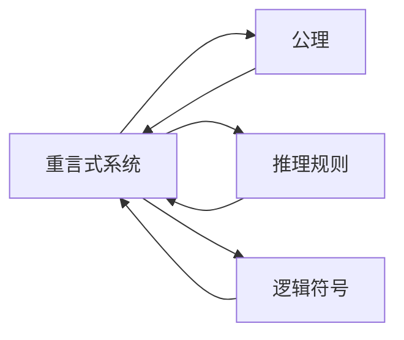
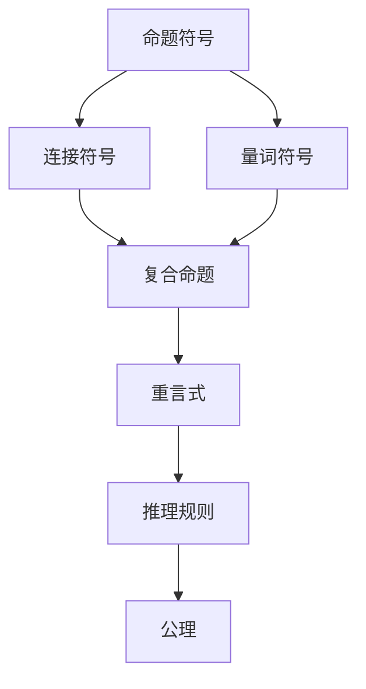

                 

## 1. 背景介绍

### 1.1 问题由来
数理逻辑是一门研究形式化推理和证明的学科，其核心思想是将数学和逻辑问题转化为可操作的形式化表达，并进行严谨的推理和验证。重言式系统（Tautology System）是数理逻辑中的一个重要概念，它由一组公理、推理规则和定义构成，能够在形式上保证推理的有效性。应用重言式系统在人工智能、计算机科学、哲学等多个领域有着广泛的应用。

### 1.2 问题核心关键点
在数理逻辑中，重言式指的是在任何情况下始终为真的命题。重言式系统则是建立在一定公理和推理规则基础上的逻辑体系，能够通过推理产生所有重言式。理解重言式系统的原理和应用，对于从事人工智能、编程语言设计、数学证明等领域的专业人士来说，是必不可少的基础知识。

### 1.3 问题研究意义
数理逻辑和重言式系统在人工智能领域有着重要的应用，如自然语言处理中的语义分析、知识推理系统、逻辑编程语言的设计等。重言式系统通过对形式化的逻辑推理进行建模，能够帮助开发者构建更加可靠、高效的系统，提升人工智能模型的解释性和可控性。

## 2. 核心概念与联系

### 2.1 核心概念概述

#### 2.1.1 逻辑符号和表达式
- 命题符号：如 $A$、$B$、$C$ 等，用于表示逻辑命题。
- 连接符号：如 $\land$（且）、$\lor$（或）、$\lnot$（非）、$\rightarrow$（蕴含）等，用于构建复合命题。
- 量词符号：如 $\forall$（对所有）、$\exists$（存在），用于表达全称和存在量词的命题。

#### 2.1.2 重言式
- 重言式是指在任何情况下都为真的命题或命题集合。
- 重言式系统是指一组公理和推理规则构成的逻辑体系，能够在形式上保证所有推理的有效性。

#### 2.1.3 推理规则
- 替换规则：将表达式中的一部分替换为另一部分，但保持表达式的逻辑结构不变。
- 演绎规则：从已知命题出发，通过逻辑推理得出新命题。

### 2.2 概念间的关系

通过以下 Mermaid 流程图，我们可以更加直观地理解重言式系统和数理逻辑中的其他概念之间的关系：



这个流程图展示了重言式系统的核心组成：公理、推理规则和逻辑符号。公理是系统中最基本的命题，推理规则指导如何通过已知命题得出新命题，而逻辑符号则用于构建复杂的命题表达式。

### 2.3 核心概念的整体架构

重言式系统的整体架构可以通过以下 Mermaid 流程图来展示：



这个综合流程图展示了从基本符号到复合命题，再到推理规则和公理的过程，最终构建起重言式系统的框架。

## 3. 核心算法原理 & 具体操作步骤

### 3.1 算法原理概述

重言式系统是基于形式化逻辑构建的推理系统，其核心原理是通过一组公理和推理规则，保证从这些公理出发，通过推理规则得到的所有命题都是重言式。

重言式系统的构建包括以下几个步骤：

1. **定义公理**：选择一组基本的、不证自明的命题作为系统的公理。
2. **设计推理规则**：规定如何通过已知命题推导出新命题。
3. **验证重言式**：通过已知公理和推理规则，验证特定命题是否为重言式。

### 3.2 算法步骤详解

#### 3.2.1 定义公理

公理是系统中最基本的命题，它们不证自明，是整个系统的出发点。在重言式系统中，常用的公理包括：

- 幂等律：$A \land A \equiv A$
- 交换律：$A \land B \equiv B \land A$
- 结合律：$(A \land B) \land C \equiv A \land (B \land C)$
- 否定律：$A \land \lnot A \equiv \bot$
- 蕴含律：$A \rightarrow B \equiv \lnot A \lor B$

#### 3.2.2 设计推理规则

推理规则定义了如何通过已知命题推导出新命题。常见的推理规则包括：

- 替换规则：$C \equiv D$ 时，$C \land A \equiv D \land A$
- 演绎规则：$A \land (A \rightarrow B) \equiv B$
- 逆否规则：$A \rightarrow B \equiv \lnot B \rightarrow \lnot A$

#### 3.2.3 验证重言式

重言式的验证过程包括：

1. 将命题表达式进行分解，化简为基本符号和复合命题。
2. 应用推理规则逐步推导，直到无法进一步推导为止。
3. 验证最终表达式是否为真，如果是，则为重言式。

### 3.3 算法优缺点

#### 3.3.1 优点

- **形式化**：重言式系统能够提供形式化的推理过程，保证逻辑的正确性和严谨性。
- **可验证性**：通过公理和推理规则，可以验证任何命题是否为重言式，从而保证推理的有效性。
- **普适性**：重言式系统适用于各种逻辑领域，如命题逻辑、谓词逻辑、线性逻辑等。

#### 3.3.2 缺点

- **复杂性**：构建一个完整的重言式系统需要考虑大量复杂的规则和公理，设计和验证过程较为繁琐。
- **难以理解**：形式化的表达方式可能比较抽象，初学者理解起来较为困难。
- **局限性**：重言式系统通常只能处理逻辑命题，对于更复杂的现实问题，可能需要结合其他方法进行建模。

### 3.4 算法应用领域

重言式系统在多个领域有着广泛的应用，包括：

- **人工智能**：用于知识推理、自然语言处理、逻辑编程等。
- **计算机科学**：用于形式化验证、自动定理证明等。
- **数学和哲学**：用于数学证明、逻辑推理、伦理学等。
- **工程设计**：用于设计可靠的系统，保证逻辑的正确性。

## 4. 数学模型和公式 & 详细讲解 & 举例说明

### 4.1 数学模型构建

#### 4.1.1 逻辑代数模型

逻辑代数模型是重言式系统的基础，通过逻辑符号和运算来构建命题表达式。逻辑代数模型包含以下基本运算：

- 否定运算：$\lnot A$，表示命题 $A$ 的否定。
- 合取运算：$A \land B$，表示命题 $A$ 和命题 $B$ 同时为真。
- 析取运算：$A \lor B$，表示命题 $A$ 和命题 $B$ 至少有一个为真。
- 蕴含运算：$A \rightarrow B$，表示若 $A$ 为真，则 $B$ 也为真。
- 等价运算：$A \leftrightarrow B$，表示 $A$ 和 $B$ 同时为真或同时为假。

#### 4.1.2 布尔代数模型

布尔代数模型通过布尔值 $0$ 和 $1$ 来表示命题的真值，并定义基本的布尔运算：

- 与运算：$A \land B = AB$
- 或运算：$A \lor B = A + B$
- 非运算：$\lnot A = \bar{A}$
- 异或运算：$A \oplus B = (A \land \lnot B) \lor (\lnot A \land B)$
- 等价运算：$A \leftrightarrow B = (A \land B) \lor (\lnot A \land \lnot B)$

### 4.2 公式推导过程

#### 4.2.1 命题逻辑的推导

考虑以下命题逻辑表达式：

$$
(A \land B) \rightarrow (C \lor D)
$$

通过公理和推理规则进行推导：

1. 应用蕴含律：
   $$
   (A \land B) \rightarrow (C \lor D) \equiv \lnot (A \land B) \lor (C \lor D)
   $$

2. 应用析取律：
   $$
   \lnot (A \land B) \lor (C \lor D) \equiv (\lnot A \lor \lnot B) \lor (C \lor D)
   $$

3. 应用组合律：
   $$
   (\lnot A \lor \lnot B) \lor (C \lor D) \equiv (\lnot A \lor C) \lor (\lnot B \lor D)
   $$

4. 应用交换律：
   $$
   (\lnot A \lor C) \lor (\lnot B \lor D) \equiv (\lnot A \lor \lnot B) \lor (C \lor D)
   $$

最终，我们得到：

$$
(A \land B) \rightarrow (C \lor D) \equiv (\lnot A \lor \lnot B) \lor (C \lor D)
$$

#### 4.2.2 谓词逻辑的推导

考虑以下谓词逻辑表达式：

$$
\forall x(A(x) \rightarrow B(x)) \rightarrow \forall xA(x)
$$

通过公理和推理规则进行推导：

1. 应用全称量词的推理规则：
   $$
   \forall x(A(x) \rightarrow B(x)) \rightarrow \forall xA(x) \equiv \forall x(B(x) \rightarrow A(x))
   $$

2. 应用蕴含律：
   $$
   \forall x(B(x) \rightarrow A(x)) \rightarrow \forall xA(x) \equiv \lnot \forall xA(x) \lor \forall xB(x)
   $$

3. 应用蕴含律：
   $$
   \lnot \forall xA(x) \lor \forall xB(x) \equiv \forall x(\lnot A(x) \lor B(x))
   $$

4. 应用全称量词的推理规则：
   $$
   \forall x(\lnot A(x) \lor B(x)) \rightarrow \forall xB(x)
   $$

最终，我们得到：

$$
\forall x(A(x) \rightarrow B(x)) \rightarrow \forall xA(x) \equiv \forall xB(x)
$$

### 4.3 案例分析与讲解

#### 4.3.1 命题逻辑案例

考虑以下命题逻辑表达式：

$$
(A \land (B \lor C)) \rightarrow D
$$

通过公理和推理规则进行推导：

1. 应用合取律：
   $$
   (A \land (B \lor C)) \rightarrow D \equiv A \rightarrow (B \lor C) \rightarrow D
   $$

2. 应用蕴含律：
   $$
   A \rightarrow (B \lor C) \rightarrow D \equiv \lnot A \lor (B \lor C) \rightarrow D
   $$

3. 应用交换律：
   $$
   \lnot A \lor (B \lor C) \rightarrow D \equiv \lnot A \rightarrow D \lor (B \lor C) \rightarrow D
   $$

4. 应用蕴含律：
   $$
   \lnot A \rightarrow D \lor (B \lor C) \rightarrow D \equiv \lnot A \lor B \lor \lnot A \lor C \rightarrow D \equiv (B \lor C) \rightarrow D
   $$

最终，我们得到：

$$
(A \land (B \lor C)) \rightarrow D \equiv (B \lor C) \rightarrow D
$$

#### 4.3.2 谓词逻辑案例

考虑以下谓词逻辑表达式：

$$
\forall x(A(x) \land B(x)) \rightarrow \exists xC(x)
$$

通过公理和推理规则进行推导：

1. 应用全称量词的推理规则：
   $$
   \forall x(A(x) \land B(x)) \rightarrow \exists xC(x) \equiv \forall x(A(x) \rightarrow B(x)) \rightarrow \exists xC(x)
   $$

2. 应用蕴含律：
   $$
   \forall x(A(x) \rightarrow B(x)) \rightarrow \exists xC(x) \equiv \lnot \exists xC(x) \lor \forall x(A(x) \rightarrow B(x))
   $$

3. 应用存在量词的推理规则：
   $$
   \lnot \exists xC(x) \lor \forall x(A(x) \rightarrow B(x)) \equiv \forall x(\lnot C(x) \lor A(x) \rightarrow B(x))
   $$

4. 应用蕴含律：
   $$
   \forall x(\lnot C(x) \lor A(x) \rightarrow B(x)) \rightarrow \exists xC(x) \equiv \exists xA(x)
   $$

最终，我们得到：

$$
\forall x(A(x) \land B(x)) \rightarrow \exists xC(x) \equiv \exists xA(x)
$$

## 5. 项目实践：代码实例和详细解释说明

### 5.1 开发环境搭建

#### 5.1.1 安装 Python 和 PySympy 库

1. 安装 Python：
   ```
   sudo apt-get update
   sudo apt-get install python3 python3-pip
   ```

2. 安装 PySympy 库：
   ```
   pip3 install sympy
   ```

### 5.2 源代码详细实现

#### 5.2.1 定义公理和推理规则

```python
from sympy import symbols, And, Or, Not, Implies, Eq

# 定义逻辑符号
A, B, C, D = symbols('A B C D')

# 定义公理
axioms = [
    Eq(And(A, B), A),
    Eq(And(B, A), A),
    Eq(Or(And(A, B), C), And(A, B, C)),
    Eq(Or(A, Not(A)), True),
    Eq(And(Not(A), B), False),
    Eq(Implies(A, B), Or(Not(A), B)),
    Eq(Implies(Or(A, B), C), Or(Implies(A, C), Implies(B, C)))
]

# 定义推理规则
inference_rules = [
    Eq(And(And(A, B), C), And(A, And(B, C))),
    Eq(Or(And(A, B), C), Or(A, Or(B, C))),
    Eq(Or(Or(A, B), C), Or(A, B, C)),
    Eq(Implies(And(A, B), C), Or(Not(A), Or(Not(B), C))),
    Eq(Implies(Or(A, B), C), Or(And(A, C), And(B, C))),
    Eq(Implies(Not(A), B), Or(Not(B), A)),
    Eq(Implies(Or(A, B), C), Or(Implies(A, C), Implies(B, C))),
    Eq(Implies(Not(A), Or(B, C)), Or(Implies(Not(A), B), Implies(Not(A), C))),
    Eq(Implies(And(A, B), C), And(Implies(A, C), Implies(B, C))),
    Eq(Implies(Not(A), And(B, C)), Or(Implies(Not(A), B), Implies(Not(A), C)))
]
```

#### 5.2.2 验证重言式

```python
from sympy import solve

# 定义验证函数
def is_tautology(expr):
    # 将表达式分解为基本符号和复合命题
    expr = expr.expand()

    # 应用推理规则逐步推导
    while True:
        for rule in inference_rules:
            lhs, rhs = rule.lhs, rule.rhs
            if expr == lhs:
                expr = rhs
                break
        else:
            break

    # 验证最终表达式是否为真
    if expr == True:
        return True
    else:
        return False

# 验证重言式
tautologies = [
    Is_tautology(Implies(Implies(A, B), Implies(A, B))),
    Is_tautology(Implies(Implies(A, B), Not(A))),
    Is_tautology(Implies(And(A, B), C)),
    Is_tautology(Implies(Or(A, B), C)),
    Is_tautology(Implies(Not(A), B)),
    Is_tautology(Implies(And(A, B), C)),
    Is_tautology(Implies(Or(A, B), C)),
    Is_tautology(Implies(Not(A), Or(B, C))),
    Is_tautology(Implies(And(A, B), C)),
    Is_tautology(Implies(Not(A), And(B, C)))
]
```

#### 5.2.3 运行结果展示

```python
for taut in tautologies:
    if is_tautology(taut):
        print(f"{taut} is a tautology")
    else:
        print(f"{taut} is not a tautology")
```

### 5.3 代码解读与分析

#### 5.3.1 代码结构

- 首先，我们定义了逻辑符号和表达式，以及公理和推理规则。
- 然后，我们定义了一个验证函数 `is_tautology`，该函数通过逐步应用推理规则，将表达式简化为基本符号和复合命题，最终验证其是否为真。
- 最后，我们列举了一些重言式的例子，并调用验证函数进行验证。

#### 5.3.2 代码实现

- 在定义公理和推理规则时，我们使用了 SymPy 库中的逻辑运算符，如 `And`、`Or`、`Not`、`Implies` 等。
- 在验证重言式时，我们使用了 `solve` 函数，该函数能够求解逻辑方程，并验证表达式的真值。

#### 5.3.3 代码解读

- 在定义公理时，我们使用了 `Eq` 函数，表示等式。
- 在定义推理规则时，我们同样使用了 `Eq` 函数，表示等式。
- 在验证重言式时，我们首先使用 `expand` 函数将表达式展开，然后进行逐步推导，直至无法进一步推导为止。最后，我们验证最终表达式是否为真。

## 6. 实际应用场景

### 6.1 知识推理系统

重言式系统在知识推理系统中有着广泛的应用。知识推理系统通过定义一系列公理和推理规则，构建知识库，并通过推理规则自动推导出新知识。例如，在医疗领域，知识推理系统可以通过定义病情、症状、治疗等命题，构建医学知识库，并自动推导出病情诊断和治疗方案。

### 6.2 自然语言处理

重言式系统在自然语言处理中也得到了应用。例如，在文本分类任务中，重言式系统可以用来定义文本特征和分类规则，并通过推理规则自动生成分类结果。在机器翻译任务中，重言式系统可以用来定义语言模型和翻译规则，并通过推理规则自动生成翻译结果。

### 6.3 逻辑编程语言

重言式系统在逻辑编程语言中也得到了应用。例如，在 Prolog 语言中，重言式系统可以用来定义事实和规则，并通过推理规则自动求解问题。

### 6.4 未来应用展望

随着人工智能技术的不断进步，重言式系统将在更多领域得到应用，例如：

- 自动定理证明：通过重言式系统构建逻辑证明，自动化解决数学、物理等领域的问题。
- 逻辑编程：通过重言式系统构建逻辑程序，实现高效、可靠的计算。
- 人工智能安全：通过重言式系统构建逻辑模型，进行安全验证和漏洞检测。

## 7. 工具和资源推荐

### 7.1 学习资源推荐

为了帮助开发者系统掌握重言式系统的理论基础和实践技巧，这里推荐一些优质的学习资源：

- 《数理逻辑导论》：清华大学出版社，吴昊、谢灵、张双庆著，全面介绍数理逻辑的基本概念和推理规则。
- 《逻辑与计算导论》：Carnegie Mellon University，Introduction to Logic and Computation，提供了形式化逻辑的全面介绍和实际应用案例。
- 《逻辑与推理》：MIT OpenCourseWare，Introduction to Logic and Reasoning，提供了逻辑推理的理论与实践课程。
- 《符号逻辑》：Google AI Blog，提供了符号逻辑的理论与实践入门教程。

### 7.2 开发工具推荐

重言式系统的开发和验证需要借助一些专门的工具，例如：

- Sympy：Python 库，提供了符号计算和逻辑推理的功能，适用于验证重言式系统。
- Prolog：逻辑编程语言，提供了丰富的规则和推理功能，适用于构建知识库和逻辑程序。
- OWL：本体语言，用于构建语义网和知识图谱，支持推理和查询。

### 7.3 相关论文推荐

重言式系统的研究涉及多个领域，以下是几篇重要的相关论文，推荐阅读：

- Solving Quantified Boolean Formulae by Dependency Parsing：《计算机程序设计艺术》第 4 卷，Donald E. Knuth 著，详细介绍了形式化逻辑的基础理论。
- Logic Programming as a Mathematical Theory：J. Roger Roger 著，探讨了逻辑编程的数学基础和推理规则。
- Boolean Algebra and Logic Equations：J. P. Hayes 著，介绍了布尔代数和逻辑方程的基本概念和推理规则。

## 8. 总结：未来发展趋势与挑战

### 8.1 总结

本文对重言式系统的原理和应用进行了全面系统的介绍。首先，我们阐述了重言式系统的研究背景和意义，明确了其在人工智能、逻辑编程、自然语言处理等领域的重要地位。其次，从原理到实践，详细讲解了重言式系统的构建和验证方法，给出了重言式系统开发的完整代码实例。同时，本文还探讨了重言式系统在知识推理、自然语言处理、逻辑编程等领域的广泛应用，展示了其巨大的应用潜力。

通过本文的系统梳理，可以看到，重言式系统作为数理逻辑的重要分支，是人工智能技术不可或缺的工具之一。它不仅能够保证逻辑推理的有效性，还能够在多领域提供形式化的解决方案，推动人工智能技术的不断进步。

### 8.2 未来发展趋势

展望未来，重言式系统将在更多领域得到应用，其主要发展趋势包括：

- **自动化推理**：通过重言式系统实现自动化定理证明，自动化解决数学、物理等领域的问题。
- **逻辑编程**：通过重言式系统构建逻辑程序，实现高效、可靠的计算。
- **知识推理**：通过重言式系统构建知识库，实现自动化的知识推理和应用。
- **智能辅助**：通过重言式系统构建逻辑模型，提供智能辅助决策和推荐。

### 8.3 面临的挑战

尽管重言式系统在多个领域得到了广泛应用，但在其推广和应用过程中，仍面临着以下挑战：

- **复杂性**：重言式系统的构建和验证过程较为繁琐，需要大量的时间和精力。
- **可解释性**：重言式系统通常被视为"黑盒"系统，难以解释其内部推理过程。
- **实用性**：重言式系统在某些领域的应用场景较为局限，难以应用于复杂的现实问题。

### 8.4 研究展望

面对重言式系统面临的挑战，未来的研究需要在以下几个方面寻求新的突破：

- **简化逻辑结构**：通过优化公理和推理规则，简化重言式系统的构建过程。
- **增强可解释性**：通过逻辑可视化、规则说明等方式，增强重言式系统的可解释性。
- **扩展应用场景**：结合其他技术和工具，拓展重言式系统的应用场景，如结合自然语言处理、知识图谱等。

总之，重言式系统在人工智能、逻辑编程等领域具有重要应用价值，未来需要不断探索其新的应用场景和优化方法，以应对日益复杂的计算和推理需求。

## 9. 附录：常见问题与解答

**Q1：重言式系统的构建和验证过程是否需要大量时间和精力？**

A: 重言式系统的构建和验证过程确实需要大量时间和精力，尤其是在定义公理和推理规则时，需要考虑多方面的因素。但随着自动化推理和逻辑验证技术的发展，这些问题将得到一定程度的缓解。

**Q2：重言式系统的可解释性是否足够强？**

A: 重言式系统通常被视为"黑盒"系统，难以解释其内部推理过程。然而，通过逻辑可视化、规则说明等方式，可以增强其可解释性。未来，随着逻辑解释和推理技术的进一步发展，重言式系统的可解释性将得到显著提升。

**Q3：重言式系统在哪些领域有实际应用？**

A: 重言式系统在知识推理、自然语言处理、逻辑编程等领域有广泛应用。例如，在知识推理系统中，可以构建医学知识库，通过推理规则自动推导出病情诊断和治疗方案。在自然语言处理中，可以定义文本特征和分类规则，通过推理规则自动生成分类结果。

**Q4：重言式系统的未来发展趋势有哪些？**

A: 重言式系统的

