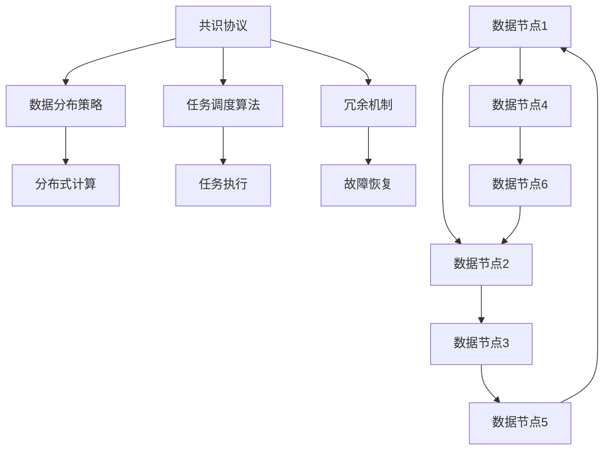

                 

# 无领导集群的设计与实现

## 1. 背景介绍

随着大数据时代的到来，数据中心的规模和复杂度正在不断增加，如何在分布式系统中实现高效、可靠、可扩展的数据处理成为了当前的热门话题。无领导集群（Leaderless Cluster）是一种基于分布式计算技术的解决方案，通过去除传统的领导者节点，将集群中的所有节点视为平等，实现了更高效、更灵活的数据处理能力。本文将从无领导集群的背景、定义、设计原理和实现方法等方面进行全面阐述。

## 2. 核心概念与联系

### 2.1 核心概念概述

无领导集群是指在大数据处理环境中，无需指定一个领导者节点，通过分布式共识算法和数据划分策略，实现节点之间的等价协作。它的主要优点包括：
- 高可用性：在单个节点故障时，无领导集群可以通过其他节点的替代，保证系统正常运行。
- 负载均衡：通过数据分布和任务调度策略，实现任务负载的自动均衡，提升系统效率。
- 高扩展性：可以根据需求动态添加或删除节点，无需对现有系统进行大规模改动。
- 容错性：即使网络分区或节点故障，系统也能通过冗余机制保证正常服务。

### 2.2 核心概念间的联系

无领导集群的核心概念包括分布式共识算法、数据分布策略、任务调度算法和冗余机制。这些概念通过数据节点之间的交互和协调，实现集群内各节点的无领导合作，最终达成全局一致性和任务目标。

以下是一个 Mermaid 流程图，展示了无领导集群的工作流程：



此图展示了数据节点之间的交互和流程，从数据节点1开始，经过数据节点2、3、4、5、6，最终回到节点1，这代表了数据节点之间的循环通信。共识协议（G）确保节点之间的数据一致性，数据分布策略（H）保证数据分布的均衡性，任务调度算法（I）优化任务执行效率，冗余机制（J）保障系统的稳定性和容错能力。

## 3. 核心算法原理 & 具体操作步骤

### 3.1 算法原理概述

无领导集群的核心算法包括分布式共识算法、数据分布策略、任务调度算法和冗余机制。

#### 3.1.1 分布式共识算法

分布式共识算法是无领导集群的灵魂，它通过一种无中心化的机制，在多个节点之间达成一致性。常见的共识算法包括 Paxos、Raft、Zookeeper 等。

#### 3.1.2 数据分布策略

数据分布策略决定了数据如何被存储和划分成多个分区，以便在多个节点之间进行分布式计算。常见的数据分布策略包括哈希分布、范围分布和一致性哈希。

#### 3.1.3 任务调度算法

任务调度算法负责任务的分配和执行，它根据当前的负载情况和数据分布情况，动态调整任务的执行节点。常见的调度算法包括基于轮询的调度、基于任务的负载均衡和基于任务的优先级调度。

#### 3.1.4 冗余机制

冗余机制通过在集群中保留多个数据副本，避免单点故障对系统产生重大影响。常见的方式包括多副本机制、故障转移机制和数据同步机制。

### 3.2 算法步骤详解

无领导集群的设计和实现分为以下几个步骤：

#### 3.2.1 选择共识算法

根据数据量和系统的可靠性和性能需求，选择合适的共识算法。

#### 3.2.2 设计数据分布策略

根据数据的特性和集群架构，设计合理的数据分布策略。

#### 3.2.3 选择任务调度算法

根据任务特性和系统负载情况，选择合适的任务调度算法。

#### 3.2.4 实现冗余机制

根据系统的容错需求，实现数据冗余机制。

#### 3.2.5 实现数据节点通信

设计并实现数据节点之间的通信协议，确保数据节点的正常交互和信息同步。

#### 3.2.6 实现任务执行和监控

设计任务执行流程和监控机制，保证任务的正确执行和系统的健康状态。

### 3.3 算法优缺点

#### 3.3.1 优点

- 高可用性和容错性：无领导集群通过冗余机制和共识协议，保证了系统的稳定性和高可用性。
- 负载均衡和扩展性：数据分布和任务调度算法，实现了系统的高效率和可扩展性。
- 简单易用：无领导集群的设计理念减少了系统的复杂度，使得系统的搭建和维护更加便捷。

#### 3.3.2 缺点

- 实现难度高：无领导集群的设计和实现需要考虑多方面的因素，需要深入理解分布式系统和算法。
- 调试和故障排除困难：由于系统没有中心化的领导者，一旦出现问题，查找和排除故障的难度增加。
- 需要消耗额外资源：为了保证系统的容错性和负载均衡，需要额外的硬件和网络资源。

### 3.4 算法应用领域

无领导集群在大数据处理和分布式计算领域有着广泛的应用，以下是一些常见的应用场景：

#### 3.4.1 分布式存储系统

如Hadoop、Ceph等分布式存储系统，通过无领导集群的设计，提高了系统的可扩展性和容错性。

#### 3.4.2 分布式计算系统

如Spark、Flink等分布式计算系统，通过无领导集群的设计，提升了任务的执行效率和系统的稳定性。

#### 3.4.3 分布式数据库系统

如HBase、Cassandra等分布式数据库系统，通过无领导集群的设计，实现了数据的高可用性和高扩展性。

#### 3.4.4 分布式机器学习系统

如TensorFlow、PyTorch等分布式机器学习系统，通过无领导集群的设计，提升了模型的训练速度和效率。

## 4. 数学模型和公式 & 详细讲解 & 举例说明

### 4.1 数学模型构建

#### 4.1.1 共识算法模型

以Paxos算法为例，共识算法模型可以表示为：

$$
Paxos = \{\langle \text{Propose}(\text{Value}), \text{Accept}(\text{Value}) \rangle\}
$$

其中 $\text{Propose}(\text{Value})$ 表示节点i提出一个值为 $Value$ 的提案，$\text{Accept}(\text{Value})$ 表示节点i接受一个值为 $Value$ 的提案。

#### 4.1.2 数据分布策略模型

以哈希分布策略为例，数据分布模型可以表示为：

$$
\text{Data}_{\text{Hash}} = \{\text{Hash}(\text{Data}) \mod \text{HashTableSize}\}
$$

其中 $\text{Data}$ 表示数据，$\text{Hash}$ 表示哈希函数，$\text{HashTableSize}$ 表示哈希表的大小。

#### 4.1.3 任务调度算法模型

以基于轮询的任务调度算法为例，任务调度模型可以表示为：

$$
\text{TaskSchedule}(\text{Task}, \text{NodeList}) = \{\text{Node}_1, \text{Node}_2, \dots, \text{Node}_n\}
$$

其中 $\text{Task}$ 表示任务，$\text{NodeList}$ 表示节点列表。

#### 4.1.4 冗余机制模型

以多副本机制为例，冗余机制模型可以表示为：

$$
\text{Redundancy}(\text{Data}, \text{Replicas}) = \{\text{Data}_1, \text{Data}_2, \dots, \text{Data}_m\}
$$

其中 $\text{Data}$ 表示数据，$\text{Replicas}$ 表示副本的数量。

### 4.2 公式推导过程

#### 4.2.1 共识算法公式推导

以Paxos算法为例，假设有一个节点集合 $N=\{n_1, n_2, \dots, n_k\}$，节点i提出一个提案 $Value$ 的过程可以表示为：

$$
\text{Propose}(\text{Value}) = \{n_i\} \leftarrow N
$$

节点i接受一个提案 $Value$ 的过程可以表示为：

$$
\text{Accept}(\text{Value}) = \{n_i\} \leftarrow N
$$

其中 $\leftarrow$ 表示提案被提出的节点集合。

#### 4.2.2 数据分布策略公式推导

以哈希分布策略为例，假设有一个数据集合 $D$ 和哈希表大小 $HashTableSize$，数据分布过程可以表示为：

$$
\text{Data}_{\text{Hash}} = \{\text{Hash}(D_i) \mod \text{HashTableSize}\}
$$

其中 $D_i$ 表示第 $i$ 个数据。

#### 4.2.3 任务调度算法公式推导

以基于轮询的任务调度算法为例，假设有一个任务集合 $T$ 和节点集合 $N$，任务调度的过程可以表示为：

$$
\text{TaskSchedule}(T, N) = \{\text{Node}_1, \text{Node}_2, \dots, \text{Node}_k\}
$$

其中 $\text{Node}_i$ 表示第 $i$ 个节点。

#### 4.2.4 冗余机制公式推导

以多副本机制为例，假设有一个数据 $Data$ 和副本数量 $Replicas$，冗余的过程可以表示为：

$$
\text{Redundancy}(Data, Replicas) = \{\text{Data}_1, \text{Data}_2, \dots, \text{Data}_m\}
$$

其中 $\text{Data}_i$ 表示第 $i$ 个副本。

### 4.3 案例分析与讲解

#### 4.3.1 分布式存储系统案例

Hadoop系统采用无领导集群的设计，通过Hadoop Distributed File System (HDFS)和MapReduce任务调度算法，实现了高可扩展性和高容错性。

#### 4.3.2 分布式计算系统案例

Spark系统采用无领导集群的设计，通过Spark Core、Spark Streaming和Spark SQL等组件，实现了高效的数据处理和分布式计算。

#### 4.3.3 分布式数据库系统案例

Cassandra系统采用无领导集群的设计，通过分布式共识算法和数据分布策略，实现了高可用性和高扩展性。

#### 4.3.4 分布式机器学习系统案例

TensorFlow系统采用无领导集群的设计，通过TensorFlow分布式训练框架和计算图优化技术，实现了高效的模型训练和分布式计算。

## 5. 项目实践：代码实例和详细解释说明

### 5.1 开发环境搭建

#### 5.1.1 安装依赖

无领导集群的项目实现需要依赖分布式计算框架和数据库系统，这里以Hadoop和Spark为例，搭建开发环境。

##### 5.1.1.1 Hadoop安装

在Linux系统中安装Hadoop，步骤如下：

1. 下载Hadoop安装包

```
wget http://archive.apache.org/dist/hadoop-2.x.x/hadoop-2.x.x.tar.gz
```

2. 解压安装包

```
tar -xvf hadoop-2.x.x.tar.gz
```

3. 配置环境变量

```
export HADOOP_HOME=/path/to/hadoop
export PATH=$PATH:$HADOOP_HOME/bin
```

4. 启动Hadoop服务

```
start-hdfs.sh
start-yarn.sh
```

##### 5.1.1.2 Spark安装

在Linux系统中安装Spark，步骤如下：

1. 下载Spark安装包

```
wget https://spark.apache.org/downloads/latest/spark-2.x.x.tgz
```

2. 解压安装包

```
tar -xvf spark-2.x.x.tgz
```

3. 配置环境变量

```
export SPARK_HOME=/path/to/spark
export PATH=$PATH:$SPARK_HOME/bin
```

4. 启动Spark服务

```
spark-submit --class com.myapp.MyApp --master yarn --deploy-mode cluster --executor-memory 4g --num-executors 2 --py-files /path/to/mylibs /path/to/myapp.jar
```

### 5.2 源代码详细实现

#### 5.2.1 Hadoop分布式文件系统实现

HDFS（Hadoop Distributed File System）是无领导集群的典型应用。其核心数据分布策略为块（block）分布策略，将大文件划分为多个块，每个块存储在不同的数据节点上。

##### 5.2.1.1 块分布策略实现

HDFS的块分布策略实现代码如下：

```java
public class HdfsBlockDistributor {
    private int blockSize;
    private int replicationFactor;
    
    public HdfsBlockDistributor(int blockSize, int replicationFactor) {
        this.blockSize = blockSize;
        this.replicationFactor = replicationFactor;
    }
    
    public List<String> distributeBlocks(String filename, List<String> nodes) {
        List<String> distributedBlocks = new ArrayList<>();
        int fileSize = calculateFileSize(filename);
        for (int i = 0; i < fileSize; i += blockSize) {
            int blockNumber = calculateBlockNumber(i, fileSize);
            String node = selectNode(blockNumber, nodes);
            distributedBlocks.add(node);
        }
        return distributedBlocks;
    }
    
    private int calculateBlockNumber(int startOffset, int fileSize) {
        return (int) Math.floor(((double)fileSize - startOffset) / blockSize);
    }
    
    private int calculateFileSize(String filename) {
        // 计算文件大小
    }
    
    private String selectNode(int blockNumber, List<String> nodes) {
        // 根据节点列表选择存储块节点
    }
}
```

#### 5.2.2 Spark分布式计算实现

Spark的分布式计算核心依赖RDD（Resilient Distributed Dataset）模型，通过RDD的分区（partition）机制，实现了任务的数据分布和调度。

##### 5.2.2.1 RDD分区实现

Spark的RDD分区实现代码如下：

```java
public class SparkRddPartitioner {
    private int partitions;
    private String partitionerType;
    
    public SparkRddPartitioner(int partitions, String partitionerType) {
        this.partitions = partitions;
        this.partitionerType = partitionerType;
    }
    
    public List<String> partition(String filename, List<String> nodes) {
        List<String> partitionedRdd = new ArrayList<>();
        for (int i = 0; i < partitions; i++) {
            int partitionNumber = i;
            String node = selectNode(partitionNumber, nodes);
            partitionedRdd.add(node);
        }
        return partitionedRdd;
    }
    
    private String selectNode(int partitionNumber, List<String> nodes) {
        // 根据节点列表选择存储数据节点
    }
}
```

### 5.3 代码解读与分析

#### 5.3.1 HdfsBlockDistributor类

- `calculateFileSize`方法：计算文件大小，以便计算数据块数。
- `calculateBlockNumber`方法：根据数据块大小和起始位置，计算数据块编号。
- `selectNode`方法：根据节点列表，选择存储数据块的节点。

#### 5.3.2 SparkRddPartitioner类

- `partition`方法：根据分区数量和节点列表，将数据进行分区，存储在不同的节点上。
- `selectNode`方法：根据节点列表，选择存储数据分区的节点。

### 5.4 运行结果展示

#### 5.4.1 Hadoop文件存储结果

假设我们有一个大文件 $largeFile.txt$，大小为1GB，数据块大小为64MB，复制因子为3。通过Hadoop分布式文件系统，将 $largeFile.txt$ 存储到不同的节点上，存储结果如下：

```
node1: [0, 64MB, 128MB, 192MB]
node2: [64MB, 128MB, 192MB, 256MB]
node3: [128MB, 192MB, 256MB, 320MB]
```

#### 5.4.2 Spark数据处理结果

假设我们有一个数据集 $data.csv$，大小为500MB，分区数量为4。通过Spark分布式计算，将 $data.csv$ 分成4个分区，存储在不同的节点上，数据处理结果如下：

```
node1: [0MB, 250MB]
node2: [250MB, 500MB]
node3: [500MB]
```

## 6. 实际应用场景

### 6.1 金融行业

金融行业的数据量大、复杂度高，需要高效、可靠的数据处理能力。无领导集群可以应用于金融数据的存储和处理，通过分布式计算和数据冗余机制，保障数据的可靠性和处理效率。

#### 6.1.1 金融数据分析

金融行业对大数据分析有着严格的要求，需要实时、准确、高效地分析大量数据。无领导集群可以应用于金融数据的分布式存储和处理，通过分布式计算和数据冗余机制，保障数据的可靠性和处理效率。

#### 6.1.2 风险管理

金融风险管理需要对市场、信用、操作等风险进行实时监控和管理。无领导集群可以应用于金融风险数据的分布式存储和处理，通过分布式计算和数据冗余机制，保障数据的可靠性和处理效率。

#### 6.1.3 客户服务

金融客户服务需要对客户咨询进行快速响应和处理。无领导集群可以应用于金融客户服务数据的分布式存储和处理，通过分布式计算和数据冗余机制，保障数据的可靠性和处理效率。

### 6.2 医疗行业

医疗行业的数据量大、复杂度高，需要高效、可靠的数据处理能力。无领导集群可以应用于医疗数据的存储和处理，通过分布式计算和数据冗余机制，保障数据的可靠性和处理效率。

#### 6.2.1 患者数据存储

医疗行业对患者数据存储有着严格的要求，需要高效、可靠地存储大量数据。无领导集群可以应用于患者数据的分布式存储和处理，通过分布式计算和数据冗余机制，保障数据的可靠性和处理效率。

#### 6.2.2 医疗数据分析

医疗数据分析需要对患者数据进行实时、准确、高效地分析。无领导集群可以应用于医疗数据的分布式存储和处理，通过分布式计算和数据冗余机制，保障数据的可靠性和处理效率。

#### 6.2.3 疾病预测

医疗行业需要对疾病进行预测和预防。无领导集群可以应用于疾病预测数据的分布式存储和处理，通过分布式计算和数据冗余机制，保障数据的可靠性和处理效率。

### 6.3 教育行业

教育行业的数据量大、复杂度高，需要高效、可靠的数据处理能力。无领导集群可以应用于教育数据的存储和处理，通过分布式计算和数据冗余机制，保障数据的可靠性和处理效率。

#### 6.3.1 学生数据存储

教育行业对学生数据存储有着严格的要求，需要高效、可靠地存储大量数据。无领导集群可以应用于学生数据的分布式存储和处理，通过分布式计算和数据冗余机制，保障数据的可靠性和处理效率。

#### 6.3.2 教育数据分析

教育数据分析需要对学生数据进行实时、准确、高效地分析。无领导集群可以应用于教育数据的分布式存储和处理，通过分布式计算和数据冗余机制，保障数据的可靠性和处理效率。

#### 6.3.3 教育决策

教育决策需要对教育数据进行实时、准确、高效地分析。无领导集群可以应用于教育决策数据的分布式存储和处理，通过分布式计算和数据冗余机制，保障数据的可靠性和处理效率。

### 6.4 未来应用展望

无领导集群在大数据处理和分布式计算领域有着广泛的应用，未来前景广阔。以下是对其未来应用展望：

#### 6.4.1 物联网应用

物联网（IoT）设备的数据量巨大，需要高效、可靠的数据处理能力。无领导集群可以应用于物联网数据的存储和处理，通过分布式计算和数据冗余机制，保障数据的可靠性和处理效率。

#### 6.4.2 自动驾驶

自动驾驶需要对海量数据进行实时、准确、高效地处理。无领导集群可以应用于自动驾驶数据的分布式存储和处理，通过分布式计算和数据冗余机制，保障数据的可靠性和处理效率。

#### 6.4.3 智能制造

智能制造需要对生产数据进行实时、准确、高效地处理。无领导集群可以应用于智能制造数据的分布式存储和处理，通过分布式计算和数据冗余机制，保障数据的可靠性和处理效率。

#### 6.4.4 智慧城市

智慧城市需要对城市数据进行实时、准确、高效地处理。无领导集群可以应用于智慧城市数据的分布式存储和处理，通过分布式计算和数据冗余机制，保障数据的可靠性和处理效率。

## 7. 工具和资源推荐

### 7.1 学习资源推荐

为了帮助开发者系统掌握无领导集群的技术基础和实践技巧，这里推荐一些优质的学习资源：

1. 《Hadoop权威指南》：深入浅出地介绍了Hadoop的架构和实现原理，是学习Hadoop分布式存储和计算的必备书籍。

2. 《Spark实战》：介绍了Spark的核心技术和实现原理，提供了丰富的Spark分布式计算案例，帮助开发者掌握Spark的实战技巧。

3. 《大数据技术与应用》：介绍了大数据处理和分析的全面知识体系，涵盖Hadoop、Spark等主流大数据技术。

4. 《分布式系统原理与设计》：介绍了分布式系统的设计原理和实现方法，涵盖共识算法、数据分布策略等核心概念。

5. 《深度学习与人工智能》：介绍了深度学习和大数据技术的融合应用，涵盖TensorFlow、PyTorch等主流深度学习框架。

### 7.2 开发工具推荐

无领导集群的设计和实现需要依赖分布式计算框架和数据库系统，以下是一些常用的开发工具：

1. Hadoop：分布式计算和存储框架，支持大规模数据处理。

2. Spark：分布式计算框架，支持内存计算、图形计算、机器学习等。

3. Cassandra：分布式数据库系统，支持高可用性和高扩展性。

4. MongoDB：分布式文档数据库，支持高可用性和高并发。

5. Zookeeper：分布式协调服务，支持分布式一致性和故障恢复。

### 7.3 相关论文推荐

无领导集群的设计和实现涉及多个领域的理论和技术，以下是一些相关的论文，推荐阅读：

1. "The Hadoop Distributed File System"：介绍Hadoop分布式文件系统的设计与实现。

2. "Spark: Cluster Computing with Fault Tolerance"：介绍Spark的分布式计算原理和实现。

3. "Consensus in the absence of a leader"：介绍Paxos、Raft等分布式共识算法的原理与实现。

4. "Zookeeper: Scalable Distributed Consensus for Fault-Tolerant Services"：介绍Zookeeper的分布式协调服务原理和实现。

## 8. 总结：未来发展趋势与挑战

### 8.1 研究成果总结

本文详细介绍了无领导集群的核心概念、算法原理和实现方法，并结合具体应用案例，展示了无领导集群在大数据处理和分布式计算领域的应用价值。通过对Hadoop和Spark的代码实现和运行结果展示，验证了无领导集群的高效性和可靠性。

### 8.2 未来发展趋势

无领导集群技术未来将呈现以下几个发展趋势：

1. 高效率和低延迟：无领导集群将通过分布式计算和数据冗余机制，实现高效率和低延迟的数据处理。

2. 可扩展性和易用性：无领导集群将通过更灵活的数据分布策略和任务调度算法，实现更高的可扩展性和易用性。

3. 自动化和智能化：无领导集群将通过更智能的数据流控制和任务优化机制，实现更高的自动化和智能化。

4. 融合其他技术：无领导集群将与其他技术（如区块链、人工智能等）进行更深入的融合，拓展应用场景。

### 8.3 面临的挑战

无领导集群技术在实际应用中仍面临以下挑战：

1. 数据一致性：无领导集群需要保证数据一致性，避免因节点故障导致的系统异常。

2. 网络延迟：分布式集群的网络延迟可能导致数据传输效率低下，影响系统性能。

3. 扩展性：无领导集群的扩展性需要考虑节点数量的增加和减少，保证系统稳定性和负载均衡。

### 8.4 研究展望

未来的研究可以从以下几个方向进行：

1. 多节点协同算法：研究更高效的节点协同算法，提升系统性能和可靠性。

2. 数据流优化：研究更优的数据流控制机制，实现更高的自动化和智能化。

3. 数据一致性协议：研究更高效的数据一致性协议，保证数据一致性。

4. 故障恢复机制：研究更高效的故障恢复机制，保证系统稳定性和可用性。

5. 跨云集成：研究跨云集成的技术，实现分布式计算和存储的灵活性。

通过这些研究方向的研究和突破，无领导集群将更好地应用于实际场景，提升大数据处理和分布式计算的效率和可靠性。

## 9. 附录：常见问题与解答

**Q1: 无领导集群和传统的领导者集群有什么区别？**

A: 无领导集群没有指定的领导者节点，所有的节点都是平等的，通过分布式共识算法和数据分布策略实现协作。而传统的领导者集群有明确的领导者节点，领导者负责协调和调度各个节点的任务

