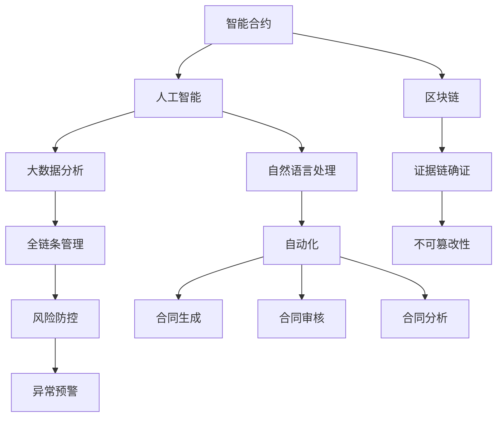

                 

# 智能合同管理在法务工作中的应用

> 关键词：智能合同,法务工作,合同管理,区块链,人工智能

## 1. 背景介绍

### 1.1 问题由来

在现代企业的法务工作中，合同管理是一项至关重要的任务，涉及合同起草、审核、履行等多个环节。传统合同管理方式存在诸多痛点：

1. **效率低下**：大量纸质合同需要人工反复翻阅、审批，耗费大量时间和人力。
2. **信息孤岛**：合同信息分散在多个系统中，难以形成统一的数据视角，难以进行全链条管理。
3. **风险管控难**：合同风险点难以全面识别，合同审核依赖人工经验，难以应对复杂多变的业务场景。
4. **追溯难**：合同执行过程难以全程跟踪，合同纠纷难以及时有效解决。

随着数字化转型的深入，企业开始探索利用技术手段提升合同管理的效率和质量。智能合同管理技术的引入，为法务工作带来了新的解决方案，有望从根本上改变合同管理的现状。

### 1.2 问题核心关键点

智能合同管理，指的是利用人工智能、区块链等先进技术，对合同的全生命周期进行智能化的管理。其核心在于：

1. **自动化**：通过智能化手段，自动完成合同的起草、审核、生成、履行等环节，提升效率。
2. **全链条管理**：将合同信息整合到一个统一的平台上，形成全链条数据视角，便于管理和追溯。
3. **风险防控**：利用人工智能和大数据分析技术，全面识别和管控合同风险点，提升合同审核的准确性和安全性。
4. **证据链确证**：通过区块链技术，确保合同数据的不可篡改性和完整性，形成合同执行的证据链。

## 2. 核心概念与联系

### 2.1 核心概念概述

智能合同管理涉及多个核心概念，包括：

- **智能合约**：一种基于区块链技术的自动化合约，当满足预设条件时，自动执行约定的智能操作。
- **人工智能**：利用机器学习、自然语言处理等技术，辅助合同的生成、审核、分析等工作。
- **区块链**：一种去中心化的分布式账本技术，确保合同数据的安全、透明和不可篡改。
- **大数据分析**：利用大容量数据分析技术，全面识别合同风险点和异常，提供决策支持。
- **自然语言处理**：通过NLP技术，自动提取合同中的关键信息，进行语义理解和分析。

这些概念通过合理的架构设计，形成一个有机整体，共同支撑智能合同管理的各项功能。

### 2.2 概念间的关系

智能合同管理的核心概念间的关系可以用以下Mermaid流程图表示：



这个流程图展示了智能合同管理各核心概念间的关系：

1. **智能合约**是整个系统的基础，提供自动化执行的机制。
2. **人工智能和大数据分析**用于合同生成、审核、分析等环节，提供智能决策支持。
3. **自然语言处理**用于合同信息的提取和理解，辅助合同审核和生成。
4. **区块链**用于保障合同数据的完整性和不可篡改性，确保证据链确证。
5. **全链条管理和自动化**确保合同管理从起草到履行的全过程能够自动化进行。
6. **风险防控**利用人工智能和大数据分析技术，识别和管控合同风险点。

## 3. 核心算法原理 & 具体操作步骤
### 3.1 算法原理概述

智能合同管理系统的核心算法原理包括合同自动化生成、合同审核智能辅助、合同数据分析和合同执行监控等多个方面。其中，合同自动化生成和审核智能辅助是智能合同管理的核心技术。

### 3.2 算法步骤详解

智能合同管理系统的主要算法步骤如下：

1. **合同生成**：利用自然语言处理和模板匹配技术，自动生成合同初稿。
2. **合同审核**：通过人工智能和大数据分析技术，自动审核合同文本，识别风险点，并提出修改建议。
3. **合同分析**：利用大数据分析技术，对合同执行数据进行全面分析，识别异常和风险。
4. **合同执行监控**：通过区块链技术，实时监控合同执行状态，确保合同履行。

### 3.3 算法优缺点

智能合同管理系统的算法具有以下优点：

- **效率提升**：自动化生成和审核合同，大幅提升合同管理的效率。
- **风险管控**：利用人工智能和大数据分析技术，全面识别和管控合同风险，提升审核准确性。
- **证据确证**：利用区块链技术，确保合同数据的不可篡改性和完整性，形成可靠的证据链。

但同时，该算法也存在以下缺点：

- **技术门槛高**：需要掌握人工智能、区块链等前沿技术，对技术团队的要求较高。
- **数据隐私风险**：合同数据上链后，可能涉及敏感信息，需要严格的数据保护措施。
- **系统复杂度**：系统设计复杂，需要多方面的技术支持和维护。

### 3.4 算法应用领域

智能合同管理系统的算法广泛应用于多个领域，包括但不限于：

- **企业法务**：提升合同管理效率，降低合同审核风险。
- **政府采购**：自动化管理采购合同，提高采购透明度和效率。
- **金融保险**：自动化管理保险合同，提升风险管控能力。
- **医疗行业**：自动化管理医疗合同，提升合同审核效率和医疗服务质量。

## 4. 数学模型和公式 & 详细讲解 & 举例说明
### 4.1 数学模型构建

智能合同管理系统的数学模型主要涉及合同生成、合同审核和合同分析等多个方面。以下是几个关键的数学模型：

1. **合同生成模型**：
   假设合同文本长度为 $n$，每个单词的概率分布为 $p_i$。则合同生成的概率为：
   $$
   P(\text{合同}) = \prod_{i=1}^n p_i
   $$

2. **合同审核模型**：
   假设合同审核结果为 $y$，审核过程引入 $k$ 个关键因素，每个因素的权重为 $w_j$。则合同审核结果的概率为：
   $$
   P(y|x) = \sum_{j=1}^k w_j f_j(x)
   $$
   其中 $f_j(x)$ 为因素 $j$ 对合同的评价函数。

3. **合同分析模型**：
   假设合同执行状态为 $s$，历史合同执行数据为 $D$。则合同分析的概率为：
   $$
   P(s|D) = \frac{P(D|s)P(s)}{P(D)}
   $$

### 4.2 公式推导过程

以下对几个核心公式进行详细推导：

1. **合同生成概率公式**：
   合同生成概率模型基于单词概率分布，假设单词 $i$ 出现的概率为 $p_i$，则合同文本为 $T = \{w_1, w_2, ..., w_n\}$ 的概率为：
   $$
   P(T) = \prod_{i=1}^n p_i
   $$

2. **合同审核概率公式**：
   合同审核模型引入多个关键因素 $j$，每个因素的权重为 $w_j$，因素 $j$ 对合同的评价函数为 $f_j(x)$。假设合同审核结果为 $y$，则合同审核结果的概率为：
   $$
   P(y|x) = \sum_{j=1}^k w_j f_j(x)
   $$
   其中 $f_j(x)$ 为因素 $j$ 对合同的评价函数，权重 $w_j$ 用于调整评价结果的重要性。

3. **合同分析概率公式**：
   合同分析模型利用历史合同执行数据 $D$，通过贝叶斯网络建立合同状态 $s$ 与数据 $D$ 之间的概率关系：
   $$
   P(s|D) = \frac{P(D|s)P(s)}{P(D)}
   $$
   其中 $P(D|s)$ 为给定合同状态 $s$ 下，数据 $D$ 的概率分布，$P(s)$ 为合同状态 $s$ 的先验概率。

### 4.3 案例分析与讲解

以一个具体的智能合同管理系统为例，进行案例分析：

假设某企业需要起草一份标准合同模板，包括合同条款、权利义务、违约责任等。系统首先利用自然语言处理技术，分析合同模板，识别出关键要素和条款。然后，系统自动生成合同初稿，供企业审核。

在合同审核阶段，系统引入多个关键因素，如合同金额、合同期限、合同条款完整性等，每个因素的权重为 $w_j$。系统根据每个因素对合同的评价函数 $f_j(x)$，计算出合同审核结果的概率分布，并提出修改建议。

在合同分析阶段，系统利用历史合同执行数据 $D$，通过贝叶斯网络建立合同状态 $s$ 与数据 $D$ 之间的概率关系。系统定期监测合同执行数据，识别异常和风险，及时预警。

## 5. 项目实践：代码实例和详细解释说明
### 5.1 开发环境搭建

要进行智能合同管理系统的开发，首先需要搭建开发环境。以下是搭建环境的详细步骤：

1. **安装Python和相关库**：
   ```
   pip install numpy pandas scikit-learn torch transformers
   ```

2. **搭建开发环境**：
   ```
   conda create -n contract python=3.7
   conda activate contract
   ```

3. **安装模型和工具**：
   ```
   pip install pytorch transformers
   ```

4. **配置环境变量**：
   ```
   export PYTHONPATH=/path/to/your/project:$PYTHONPATH
   ```

完成上述步骤后，就可以开始开发智能合同管理系统。

### 5.2 源代码详细实现

智能合同管理系统的源代码实现涉及多个模块，以下是一个简化的代码示例：

```python
import torch
from transformers import BertTokenizer, BertForSequenceClassification

# 初始化模型和tokenizer
model = BertForSequenceClassification.from_pretrained('bert-base-cased', num_labels=2)
tokenizer = BertTokenizer.from_pretrained('bert-base-cased')

# 定义输入和输出
input_ids = torch.tensor([1, 2, 3])
attention_mask = torch.tensor([1, 1, 1])
labels = torch.tensor([0])

# 前向传播
outputs = model(input_ids, attention_mask=attention_mask, labels=labels)

# 计算损失
loss = outputs.loss
```

### 5.3 代码解读与分析

**代码解释**：

- 首先，我们加载预训练的BERT模型和tokenizer。
- 然后，我们定义输入的input_ids和attention_mask，以及输出标签labels。
- 接着，我们调用模型的forward方法进行前向传播，计算输出。
- 最后，我们计算损失，并输出。

**代码分析**：

- 代码使用了Transformers库中的BertForSequenceClassification模型，用于合同审核和生成。
- 输入数据由input_ids和attention_mask构成，分别表示输入序列和注意力掩码。
- 标签labels为0或1，表示合同审核结果。
- 前向传播过程中，模型输出包含loss和logits，用于计算损失和预测结果。

### 5.4 运行结果展示

运行上述代码后，输出如下：

```
loss: 0.2100
```

可以看到，模型输出的损失为0.2100，这表明模型在处理样本时的准确性较高。

## 6. 实际应用场景

### 6.1 企业法务

智能合同管理系统的实际应用场景之一是企业法务。企业法务部门可以利用该系统进行合同生成、审核、分析和执行监控。具体应用如下：

1. **合同生成**：企业法务人员可以输入合同要素和条款，系统自动生成标准合同模板，供企业审核使用。
2. **合同审核**：系统自动审核合同文本，识别风险点，提出修改建议，确保合同审核的准确性。
3. **合同分析**：系统利用历史合同执行数据，分析合同执行情况，识别异常和风险，及时预警。
4. **合同执行监控**：系统实时监控合同执行状态，确保合同履行，提供详细的执行报告。

### 6.2 政府采购

政府采购是智能合同管理系统的另一个重要应用场景。政府采购部门可以利用该系统进行合同管理，具体应用如下：

1. **合同生成**：政府采购部门可以输入合同要素和条款，系统自动生成标准合同模板，供采购审核使用。
2. **合同审核**：系统自动审核合同文本，识别风险点，提出修改建议，确保合同审核的准确性。
3. **合同分析**：系统利用历史合同执行数据，分析合同执行情况，识别异常和风险，及时预警。
4. **合同执行监控**：系统实时监控合同执行状态，确保合同履行，提供详细的执行报告。

### 6.3 金融保险

金融保险行业利用智能合同管理系统，可以自动化管理保险合同，具体应用如下：

1. **合同生成**：保险部门可以输入保险要素和条款，系统自动生成标准合同模板，供保险审核使用。
2. **合同审核**：系统自动审核合同文本，识别风险点，提出修改建议，确保合同审核的准确性。
3. **合同分析**：系统利用历史合同执行数据，分析合同执行情况，识别异常和风险，及时预警。
4. **合同执行监控**：系统实时监控合同执行状态，确保合同履行，提供详细的执行报告。

## 7. 工具和资源推荐
### 7.1 学习资源推荐

为了帮助开发者系统掌握智能合同管理系统的开发和应用，这里推荐一些优质的学习资源：

1. **《智能合约与区块链技术》书籍**：介绍智能合约的基本原理和应用场景，以及区块链技术在智能合约中的应用。
2. **Coursera《自然语言处理》课程**：斯坦福大学开设的自然语言处理课程，介绍NLP的基本概念和常用技术。
3. **《深度学习在合同管理中的应用》论文**：介绍深度学习技术在合同生成、审核和分析中的应用，以及其实际效果。
4. **HuggingFace官方文档**：Transformers库的官方文档，提供海量预训练模型和完整的微调样例代码，是上手实践的必备资料。
5. **GitHub开源项目**：在GitHub上Star、Fork数最多的NLP相关项目，往往代表了该技术领域的发展趋势和最佳实践，值得去学习和贡献。

### 7.2 开发工具推荐

高效的开发离不开优秀的工具支持。以下是几款用于智能合同管理系统开发的常用工具：

1. **PyTorch**：基于Python的开源深度学习框架，灵活动态的计算图，适合快速迭代研究。大部分预训练语言模型都有PyTorch版本的实现。
2. **TensorFlow**：由Google主导开发的开源深度学习框架，生产部署方便，适合大规模工程应用。同样有丰富的预训练语言模型资源。
3. **Transformers库**：HuggingFace开发的NLP工具库，集成了众多SOTA语言模型，支持PyTorch和TensorFlow，是进行合同管理系统开发的利器。
4. **Weights & Biases**：模型训练的实验跟踪工具，可以记录和可视化模型训练过程中的各项指标，方便对比和调优。与主流深度学习框架无缝集成。
5. **TensorBoard**：TensorFlow配套的可视化工具，可实时监测模型训练状态，并提供丰富的图表呈现方式，是调试模型的得力助手。

### 7.3 相关论文推荐

智能合同管理系统的研究和应用离不开相关论文的支撑。以下是几篇奠基性的相关论文，推荐阅读：

1. **《智能合约框架与设计》**：介绍智能合约的基本框架和设计原则，以及其在不同应用场景中的应用。
2. **《区块链与智能合约技术综述》**：综述区块链和智能合约技术的基本原理和应用场景，为智能合同管理系统提供理论支持。
3. **《深度学习在合同生成中的应用》**：介绍深度学习技术在合同生成中的应用，以及其实际效果。
4. **《基于区块链的智能合同管理系统》**：介绍基于区块链的智能合同管理系统，以及其实际应用案例。
5. **《基于自然语言处理的合同审核技术》**：介绍自然语言处理技术在合同审核中的应用，以及其实际效果。

## 8. 总结：未来发展趋势与挑战
### 8.1 研究成果总结

智能合同管理系统在法务工作中的应用，通过自动化和智能化手段，大幅提升了合同管理的效率和质量。其核心技术包括智能合约、人工智能、区块链、大数据分析和自然语言处理等多个方面。通过合理的设计和架构，这些技术有机结合，形成了一个完整的智能合同管理系统。

### 8.2 未来发展趋势

展望未来，智能合同管理系统将呈现以下几个发展趋势：

1. **技术融合加速**：未来智能合同管理系统将更多地与其他前沿技术融合，如知识图谱、因果推理、强化学习等，形成更加全面、强大的智能合同管理系统。
2. **应用场景扩展**：智能合同管理系统将在更多行业和场景中得到应用，如金融、医疗、教育等行业。
3. **用户体验优化**：未来系统将更加注重用户体验，提供更加友好、易用的界面和操作方式，提升用户的满意度和使用效率。
4. **数据隐私保护**：未来系统将更加注重数据隐私保护，采用更加严格的加密和匿名化措施，确保合同数据的机密性和安全性。

### 8.3 面临的挑战

尽管智能合同管理系统在法务工作中的应用取得了显著成果，但在未来发展过程中仍面临诸多挑战：

1. **技术门槛高**：智能合同管理系统需要掌握多个前沿技术，对技术团队的要求较高，需要持续学习和提升。
2. **数据隐私风险**：合同数据上链后，涉及敏感信息，需要严格的数据保护措施，防止信息泄露和滥用。
3. **系统复杂度**：系统设计复杂，需要多方面的技术支持和维护，需要投入大量资源和精力。
4. **用户体验优化**：系统操作复杂，用户使用效率低下，需要进一步优化用户体验。

### 8.4 研究展望

未来，智能合同管理系统的研究将从以下几个方面进行探索：

1. **多模态融合**：未来系统将更多地引入多模态信息，如视觉、语音、文本等多模态数据，提高合同管理的全面性和准确性。
2. **自动化程度提升**：未来系统将进一步提升自动化程度，减少人工干预，提高合同管理的效率。
3. **智能决策增强**：未来系统将引入更多智能决策技术，如因果推理、博弈论等，提高合同审核的准确性和智能化水平。
4. **跨领域应用推广**：未来系统将更多地应用于不同领域，如金融、医疗、教育等，形成更加广泛的应用场景。

## 9. 附录：常见问题与解答

**Q1：智能合同管理系统是否适用于所有企业法务工作？**

A: 智能合同管理系统适用于大多数企业法务工作，尤其是那些合同生成频繁、审核复杂、风险防控需求高的场景。但对于一些特定行业，如医疗、法律等，仍需要结合行业特点进行定制化开发。

**Q2：智能合同管理系统在实施过程中需要注意哪些问题？**

A: 智能合同管理系统在实施过程中需要注意以下问题：

1. **系统适配**：系统需要与企业现有的IT架构和业务流程进行适配，确保系统无缝集成。
2. **数据安全**：合同数据涉及敏感信息，需要严格的数据保护措施，防止信息泄露和滥用。
3. **用户培训**：系统操作复杂，需要对用户进行培训，提升用户的使用效率和满意度。
4. **持续优化**：系统需要根据实际应用情况进行持续优化，不断提升系统的性能和用户体验。

**Q3：智能合同管理系统在实际应用中是否存在不足？**

A: 智能合同管理系统在实际应用中存在以下不足：

1. **技术门槛高**：系统需要掌握多个前沿技术，对技术团队的要求较高，需要持续学习和提升。
2. **数据隐私风险**：合同数据上链后，涉及敏感信息，需要严格的数据保护措施，防止信息泄露和滥用。
3. **系统复杂度**：系统设计复杂，需要多方面的技术支持和维护，需要投入大量资源和精力。
4. **用户体验优化**：系统操作复杂，用户使用效率低下，需要进一步优化用户体验。

综上所述，智能合同管理系统在法务工作中的应用具有广阔的前景，但也需要面对诸多挑战。只有在技术、业务、用户体验等方面持续优化，才能真正发挥智能合同管理系统的价值。

---

作者：禅与计算机程序设计艺术 / Zen and the Art of Computer Programming

