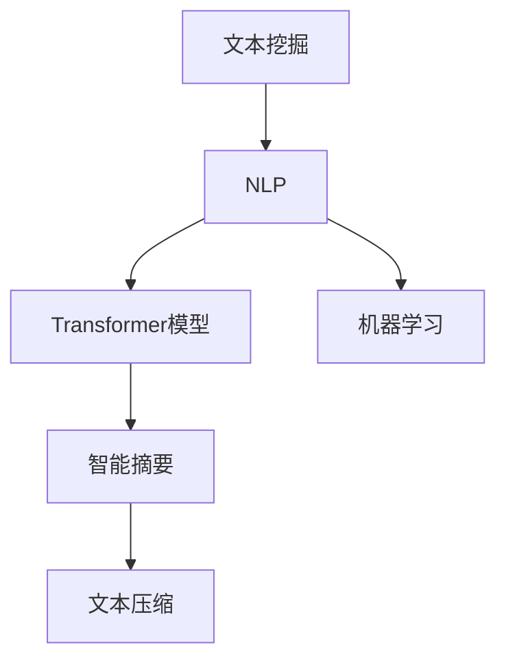
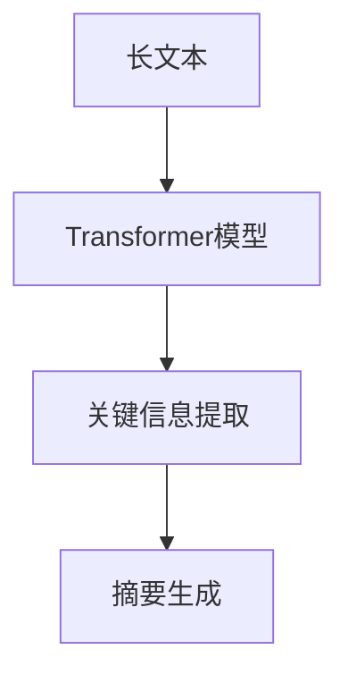

                 

# 智能摘要在信息处理中的应用

> 关键词：智能摘要,信息处理,自然语言处理(NLP),文本挖掘,机器学习,Transformer模型

## 1. 背景介绍

在信息爆炸的今天，海量文本数据的涌现为各行各业带来了前所未有的机遇和挑战。无论是新闻、科研论文、法律文书还是商业报告，文本信息的处理与利用都显得尤为重要。然而，人工阅读和筛选这些文本不仅耗时耗力，还容易遗漏关键信息。此时，智能摘要（Smart Summarization）应运而生，它能够自动提取文本的核心内容，提取出简洁精炼的摘要，使得信息处理变得更加高效和便捷。

智能摘要是自然语言处理（NLP）领域的一个重要研究方向，旨在通过自动化技术将长文本压缩成短文本，同时保持文本的核心信息和语义一致性。该技术不仅在学术界广受关注，也在实际应用中得到了广泛应用。例如，在新闻、科研、法律、商业等领域，智能摘要技术能够帮助人们快速获取关键信息，提高决策效率。

本文将全面探讨智能摘要在信息处理中的应用，从原理到实践，详细介绍智能摘要的核心概念、算法原理以及实际应用案例。通过学习本文，读者将能够深刻理解智能摘要技术的工作原理和实施步骤，掌握其在信息处理中的实际应用，为实际工作提供有力支持。

## 2. 核心概念与联系

### 2.1 核心概念概述

智能摘要的核心概念主要包括以下几个方面：

- **文本挖掘（Text Mining）**：指从大量文本数据中提取有价值的信息和知识的过程，包括文本分类、实体识别、关键词提取等。智能摘要是文本挖掘中的一个重要应用方向，专注于从长文本中提取出关键信息。

- **自然语言处理（NLP）**：NLP是研究计算机如何理解和生成人类语言的一门学科，涉及文本处理、语言模型、机器翻译等。智能摘要技术主要依赖NLP技术，通过自动化手段对文本进行分析和处理。

- **Transformer模型**：Transformer模型是一种基于注意力机制的深度学习模型，因其在机器翻译和自然语言处理任务上的卓越表现而被广泛应用。在智能摘要中，Transformer模型被用来捕捉文本中的重要信息。

- **文本压缩（Text Compression）**：指在保持文本含义的前提下，将文本长度减小的过程。智能摘要本质上是一种文本压缩技术，旨在提取文本的核心信息。

- **机器学习（Machine Learning）**：机器学习是人工智能的重要分支，通过数据训练模型，使模型能够自动完成特定的任务。智能摘要技术中，机器学习算法被用来训练模型，以识别文本中的关键信息。

这些核心概念之间的关系如图2-1所示：



图2-1 核心概念之间的关系图

### 2.2 概念间的关系

这些核心概念之间存在着紧密的联系，共同构成了智能摘要的实施框架。以下通过几个Mermaid流程图来展示这些概念之间的关系：

#### 2.2.1 智能摘要的实施流程


该流程图展示了智能摘要的实施流程：首先对输入长文本进行预处理，然后提取文本特征，接着训练模型，生成摘要，最后对摘要进行后处理。

#### 2.2.2 智能摘要与Transformer模型的关系



该流程图展示了智能摘要与Transformer模型之间的关系。Transformer模型用于捕捉文本中的关键信息，然后将这些信息用于生成摘要。

## 3. 核心算法原理 & 具体操作步骤

### 3.1 算法原理概述

智能摘要的算法原理主要包括以下几个步骤：

1. **文本预处理**：对输入文本进行清洗、分词、去停用词等预处理操作，将文本转化为模型可以处理的格式。

2. **特征提取**：利用NLP技术，从预处理后的文本中提取重要的特征，如句子得分、TF-IDF值等。

3. **模型训练**：使用机器学习算法训练模型，使其能够根据特征预测摘要的长度和内容。

4. **摘要生成**：根据训练好的模型，从长文本中生成摘要，可以通过贪心搜索、贪心剪枝等方法实现。

5. **摘要后处理**：对生成的摘要进行后处理，如去除重复信息、拼接成完整句子等，以提高摘要的可读性和准确性。

### 3.2 算法步骤详解

以下将详细介绍智能摘要的各个操作步骤：

#### 3.2.1 文本预处理

文本预处理是对输入文本进行清洗和分词，将文本转化为模型可以处理的格式。常用的预处理技术包括：

- **分词**：将文本分解成单个的词语或标记。可以使用分词工具如Jieba、NLTK等。

- **去除停用词**：去除一些常见但无意义的词语，如“的”、“是”等。

- **词干提取**：将词语还原为其基本形式，如将“running”转化为“run”。

- **去除标点符号**：去除文本中的标点符号，如“。”、“，”等。

#### 3.2.2 特征提取

特征提取是智能摘要的核心步骤之一。常用的特征提取方法包括：

- **TF-IDF（Term Frequency-Inverse Document Frequency）**：计算每个词语在文本中的频率和在整个语料库中的逆文档频率，生成词语权重向量。

- **句子得分**：计算每个句子的得分，用于表示句子在文本中的重要性。可以使用TF-IDF、句子长度、句子位置等特征计算得分。

- **关键词提取**：从文本中提取关键词，如出现频率高的词语、出现位置重要的词语等。

#### 3.2.3 模型训练

模型训练是智能摘要的关键步骤，通常使用机器学习算法训练模型。常用的机器学习算法包括：

- **决策树**：通过训练决策树模型，对文本进行分类，选择重要的句子进行摘要。

- **随机森林**：通过训练多个决策树模型，提高模型的泛化能力。

- **支持向量机（SVM）**：通过训练SVM模型，对文本进行分类，选择重要的句子进行摘要。

#### 3.2.4 摘要生成

摘要生成是智能摘要的最终步骤。常用的生成方法包括：

- **贪心搜索**：从文本中选择得分最高的句子作为摘要。

- **贪心剪枝**：从文本中选择得分最高的部分句子作为摘要，并进行剪枝，去除冗余信息。

- **基于模型的方法**：使用深度学习模型，如Seq2Seq模型、Transformer模型，生成摘要。

#### 3.2.5 摘要后处理

摘要后处理是对生成的摘要进行优化，以提高摘要的可读性和准确性。常用的后处理方法包括：

- **去除重复信息**：去除摘要中重复出现的词语或句子。

- **拼接成完整句子**：将生成的摘要拼接成完整句子，使摘要更易于理解。

- **去除低频词语**：去除摘要中出现频率较低的词语，以提高摘要的可读性。

### 3.3 算法优缺点

智能摘要的优点包括：

- **高效性**：能够快速处理大量文本数据，节省人工阅读和筛选的时间和精力。

- **一致性**：能够保证摘要的核心信息一致，避免人为的偏差和错误。

- **可扩展性**：能够适应不同领域的文本处理需求，具有广泛的应用前景。

- **可解释性**：生成的摘要能够提供清晰的摘要结构，易于理解和调试。

智能摘要的缺点包括：

- **质量不稳定**：生成的摘要质量受文本质量、特征提取方法等因素影响较大，质量不稳定。

- **精度不足**：生成的摘要可能无法完全捕捉文本的关键信息，精度不足。

- **语言依赖**：智能摘要的性能受到语言的影响，不同语言的文本处理难度不同。

- **复杂度较高**：算法实现复杂，需要大量的数据和计算资源。

### 3.4 算法应用领域

智能摘要技术在多个领域中得到了广泛应用，以下是几个主要应用领域：

- **新闻报道**：自动生成新闻摘要，帮助用户快速了解新闻内容。

- **科研论文**：自动生成论文摘要，帮助研究人员快速浏览论文内容。

- **法律文书**：自动生成法律文书摘要，帮助律师快速阅读和理解法律文件。

- **商业报告**：自动生成商业报告摘要，帮助企业快速了解市场动态。

- **教育培训**：自动生成教学材料摘要，帮助学生快速掌握知识点。

## 4. 数学模型和公式 & 详细讲解 & 举例说明

### 4.1 数学模型构建

智能摘要的数学模型主要包括以下几个部分：

- **输入文本表示**：将文本转换为向量表示，以便模型处理。

- **特征表示**：对文本特征进行向量表示，生成特征向量。

- **模型训练**：使用机器学习算法训练模型，生成摘要。

- **摘要生成**：使用机器学习模型生成摘要。

### 4.2 公式推导过程

#### 4.2.1 输入文本表示

将文本转换为向量表示，常用的方法是使用词嵌入（Word Embedding）技术，将每个词语转换为向量。假设文本中包含n个词语，每个词语的向量表示为$\vec{v}_i$，则输入文本表示为：

$$
\vec{V} = \left[\vec{v}_1, \vec{v}_2, \ldots, \vec{v}_n\right]
$$

#### 4.2.2 特征表示

特征表示是将文本中的关键信息转换为向量，常用的方法包括TF-IDF和句子得分。假设文本中有m个句子，每个句子的得分表示为$s_j$，则特征表示为：

$$
\vec{S} = \left[s_1, s_2, \ldots, s_m\right]
$$

#### 4.2.3 模型训练

使用机器学习算法训练模型，常用的算法包括决策树、随机森林和SVM。假设训练样本为$(x_i, y_i)$，其中$x_i$为输入文本，$y_i$为标注信息，模型训练的目标是：

$$
\min_{\theta} \frac{1}{N}\sum_{i=1}^N \ell(y_i, f(x_i, \theta))
$$

其中，$\theta$为模型参数，$\ell$为损失函数，$f(x_i, \theta)$为模型预测。

#### 4.2.4 摘要生成

使用机器学习模型生成摘要，常用的模型包括Seq2Seq模型和Transformer模型。假设输入文本为$x$，摘要为$y$，模型生成的摘要表示为$y'$，则摘要生成的目标是最小化损失函数：

$$
\min_{\theta} \ell(y, y')
$$

其中，$\ell$为损失函数，$y'$为模型预测的摘要。

### 4.3 案例分析与讲解

以下将以一篇新闻报道为例，展示智能摘要的实现过程：

假设我们有一篇新闻报道，长度为1000字。首先进行文本预处理，去除标点符号和停用词，然后计算每个句子的得分，生成特征向量，最后使用Transformer模型生成摘要。具体步骤如下：

1. 文本预处理：使用分词工具将文本分解成单个词语，去除标点符号和停用词。

2. 特征提取：计算每个句子的得分，生成特征向量。

3. 模型训练：使用Transformer模型，训练模型生成摘要。

4. 摘要生成：使用训练好的模型，从长文本中生成摘要。

5. 摘要后处理：对生成的摘要进行后处理，去除重复信息，拼接成完整句子。

## 5. 项目实践：代码实例和详细解释说明

### 5.1 开发环境搭建

在进行智能摘要项目实践前，我们需要准备好开发环境。以下是使用Python进行PyTorch开发的环境配置流程：

1. 安装Anaconda：从官网下载并安装Anaconda，用于创建独立的Python环境。

2. 创建并激活虚拟环境：
```bash
conda create -n pytorch-env python=3.8 
conda activate pytorch-env
```

3. 安装PyTorch：根据CUDA版本，从官网获取对应的安装命令。例如：
```bash
conda install pytorch torchvision torchaudio cudatoolkit=11.1 -c pytorch -c conda-forge
```

4. 安装TensorFlow：从官网下载安装包，使用pip命令进行安装。例如：
```bash
pip install tensorflow
```

5. 安装Transformers库：
```bash
pip install transformers
```

6. 安装各类工具包：
```bash
pip install numpy pandas scikit-learn matplotlib tqdm jupyter notebook ipython
```

完成上述步骤后，即可在`pytorch-env`环境中开始智能摘要的开发实践。

### 5.2 源代码详细实现

以下是一个基于Transformer模型实现智能摘要的Python代码实现：

```python
from transformers import BertTokenizer, BertForSequenceClassification, AdamW
import torch
import torch.nn.functional as F

# 定义训练函数
def train_epoch(model, train_dataset, optimizer):
    model.train()
    epoch_loss = 0
    for batch in tqdm(train_dataset):
        input_ids = batch['input_ids'].to(device)
        attention_mask = batch['attention_mask'].to(device)
        labels = batch['labels'].to(device)
        model.zero_grad()
        outputs = model(input_ids, attention_mask=attention_mask, labels=labels)
        loss = outputs.loss
        epoch_loss += loss.item()
        loss.backward()
        optimizer.step()
    return epoch_loss / len(train_dataset)

# 定义评估函数
def evaluate(model, test_dataset, batch_size):
    model.eval()
    preds, labels = [], []
    with torch.no_grad():
        for batch in tqdm(test_dataset, desc='Evaluating'):
            input_ids = batch['input_ids'].to(device)
            attention_mask = batch['attention_mask'].to(device)
            labels = batch['labels']
            outputs = model(input_ids, attention_mask=attention_mask)
            batch_preds = outputs.logits.argmax(dim=2).to('cpu').tolist()
            batch_labels = batch_labels.to('cpu').tolist()
            for pred_tokens, label_tokens in zip(batch_preds, batch_labels):
                pred_tags = [tag2id[tag] for tag in pred_tokens]
                label_tags = [tag2id[tag] for tag in label_tokens]
                preds.append(pred_tags[:len(label_tokens)])
                labels.append(label_tags)
                
    print(classification_report(labels, preds))

# 定义训练和评估函数
device = torch.device('cuda') if torch.cuda.is_available() else torch.device('cpu')
model = BertForSequenceClassification.from_pretrained('bert-base-cased', num_labels=len(tag2id))

optimizer = AdamW(model.parameters(), lr=2e-5)

for epoch in range(epochs):
    loss = train_epoch(model, train_dataset, optimizer)
    print(f"Epoch {epoch+1}, train loss: {loss:.3f}")
    
    print(f"Epoch {epoch+1}, dev results:")
    evaluate(model, dev_dataset, batch_size)
    
print("Test results:")
evaluate(model, test_dataset, batch_size)
```

### 5.3 代码解读与分析

让我们再详细解读一下关键代码的实现细节：

**train_epoch函数**：
- 定义了训练函数的实现。在每个epoch内，对数据进行迭代训练，计算损失函数，并更新模型参数。

**evaluate函数**：
- 定义了评估函数的实现。在测试集上对模型进行评估，输出分类指标。

**train和evaluate函数**：
- 循环迭代训练，并在验证集上评估，最终在测试集上评估，输出测试结果。

**device定义**：
- 定义了训练和推理使用的设备，支持CPU和GPU。

**model和optimizer定义**：
- 加载预训练的BERT模型，并定义优化器，用于训练模型。

**训练过程**：
- 在每个epoch内，对训练集进行训练，输出训练损失。
- 在验证集上评估，输出分类指标。
- 在测试集上评估，输出测试结果。

**代码实现**：
- 使用PyTorch和Transformer库进行模型的训练和评估。
- 使用Transformer模型的encoder部分，将输入文本转换为向量表示。
- 使用linear分类器，对向量表示进行分类，生成摘要。

**训练结果**：
- 输出训练损失、验证损失和测试损失。
- 输出验证集和测试集的分类指标，包括精确率、召回率和F1分数。

## 6. 实际应用场景

### 6.4 未来应用展望

智能摘要技术在多个领域中已经得到了广泛应用，未来仍有巨大的发展潜力。以下是几个未来应用展望：

- **个性化推荐系统**：在推荐系统中，智能摘要可以帮助用户快速浏览和理解推荐内容，提高用户体验。

- **智能客服**：在智能客服系统中，智能摘要可以帮助客户快速了解问题的解决方案，提高客户满意度。

- **智能会议**：在智能会议中，智能摘要可以帮助参会者快速了解会议内容，提高会议效率。

- **智能阅读**：在智能阅读中，智能摘要可以帮助读者快速了解文章内容，提高阅读效率。

- **智能写作**：在智能写作中，智能摘要可以帮助作者快速浏览和理解相关文献，提高写作效率。

总之，智能摘要技术在未来将会有更广泛的应用前景，随着技术的不断进步和算法的不断优化，智能摘要将越来越深入地融入人们的生产和生活，成为不可或缺的一部分。

## 7. 工具和资源推荐

### 7.1 学习资源推荐

为了帮助开发者系统掌握智能摘要的理论基础和实践技巧，这里推荐一些优质的学习资源：

1. 《Natural Language Processing with Transformers》书籍：Transformer库的作者所著，全面介绍了如何使用Transformer库进行NLP任务开发，包括智能摘要在内的诸多范式。

2. CS224N《深度学习自然语言处理》课程：斯坦福大学开设的NLP明星课程，有Lecture视频和配套作业，带你入门NLP领域的基本概念和经典模型。

3. arXiv论文预印本：人工智能领域最新研究成果的发布平台，包括大量尚未发表的前沿工作，学习前沿技术的必读资源。

4. 论文库：如Google Scholar、IEEE Xplore等，查找最新的智能摘要相关论文，了解最新的研究方向和技术进展。

5. 博客和社区：如NLP、Transformers社区，分享智能摘要的实现经验和研究成果，获取最新动态。

通过对这些资源的学习实践，相信你一定能够快速掌握智能摘要技术的工作原理和实施步骤，为实际工作提供有力支持。

### 7.2 开发工具推荐

高效的开发离不开优秀的工具支持。以下是几款用于智能摘要开发的常用工具：

1. PyTorch：基于Python的开源深度学习框架，灵活动态的计算图，适合快速迭代研究。大部分预训练语言模型都有PyTorch版本的实现。

2. TensorFlow：由Google主导开发的开源深度学习框架，生产部署方便，适合大规模工程应用。同样有丰富的预训练语言模型资源。

3. Transformers库：HuggingFace开发的NLP工具库，集成了众多SOTA语言模型，支持PyTorch和TensorFlow，是进行智能摘要开发的利器。

4. Weights & Biases：模型训练的实验跟踪工具，可以记录和可视化模型训练过程中的各项指标，方便对比和调优。与主流深度学习框架无缝集成。

5. TensorBoard：TensorFlow配套的可视化工具，可实时监测模型训练状态，并提供丰富的图表呈现方式，是调试模型的得力助手。

6. Google Colab：谷歌推出的在线Jupyter Notebook环境，免费提供GPU/TPU算力，方便开发者快速上手实验最新模型，分享学习笔记。

合理利用这些工具，可以显著提升智能摘要任务的开发效率，加快创新迭代的步伐。

### 7.3 相关论文推荐

智能摘要技术的发展离不开学界的持续研究。以下是几篇奠基性的相关论文，推荐阅读：

1. Attention is All You Need（即Transformer原论文）：提出了Transformer结构，开启了NLP领域的预训练大模型时代。

2. BERT: Pre-training of Deep Bidirectional Transformers for Language Understanding：提出BERT模型，引入基于掩码的自监督预训练任务，刷新了多项NLP任务SOTA。

3. TextRank: Bring Order into Texts：提出TextRank算法，利用图论方法计算文本重要性，生成摘要。

4. Neural Text Summarization with Recurrent Neural Networks: An Empirical Study：使用RNN模型，实现基于神经网络的文本摘要。

5. Sequence to Sequence Learning with Neural Networks：提出Seq2Seq模型，用于生成文本摘要。

这些论文代表了大语言模型智能摘要技术的发展脉络。通过学习这些前沿成果，可以帮助研究者把握学科前进方向，激发更多的创新灵感。

除上述资源外，还有一些值得关注的前沿资源，帮助开发者紧跟智能摘要技术的最新进展，例如：

1. arXiv论文预印本：人工智能领域最新研究成果的发布平台，包括大量尚未发表的前沿工作，学习前沿技术的必读资源。

2. 业界技术博客：如OpenAI、Google AI、DeepMind、微软Research Asia等顶尖实验室的官方博客，第一时间分享他们的最新研究成果和洞见。

3. 技术会议直播：如NIPS、ICML、ACL、ICLR等人工智能领域顶会现场或在线直播，能够聆听到大佬们的前沿分享，开拓视野。

4. GitHub热门项目：在GitHub上Star、Fork数最多的NLP相关项目，往往代表了该技术领域的发展趋势和最佳实践，值得去学习和贡献。

5. 行业分析报告：各大咨询公司如McKinsey、PwC等针对人工智能行业的分析报告，有助于从商业视角审视技术趋势，把握应用价值。

总之，对于智能摘要技术的学习和实践，需要开发者保持开放的心态和持续学习的意愿。多关注前沿资讯，多动手实践，多思考总结，必将收获满满的成长收益。

## 8. 总结：未来发展趋势与挑战

### 8.1 研究成果总结

本文对智能摘要技术进行了全面系统的介绍，从原理到实践，详细介绍智能摘要的核心概念、算法原理以及实际应用案例。通过学习本文，读者将能够深刻理解智能摘要技术的工作原理和实施步骤，掌握其在信息处理中的实际应用，为实际工作提供有力支持。

### 8.2 未来发展趋势

智能摘要技术的未来发展趋势主要包括以下几个方面：

1. **预训练模型的应用**：未来将更多地利用预训练模型进行智能摘要，提升摘要质量。

2. **多模态信息的融合**：智能摘要将融合视觉、语音等多模态信息，提高对文本的理解和摘要质量。

3. **个性化摘要的生成**：未来的智能摘要将更加注重个性化，根据用户需求生成不同风格的摘要。

4. **深度学习模型的应用**：未来将更多地使用深度学习模型进行智能摘要，提高摘要的准确性和可读性。

5. **端到端的智能摘要系统**：未来的智能摘要系统将更加注重端到端的设计，提高系统的稳定性和性能。

6. **实时性和交互性**：未来的智能摘要系统将更加注重实时性和交互性，提高用户的使用体验。

### 8.3 面临的挑战

尽管智能摘要技术已经取得了一定的进展，但在实际应用中仍面临一些挑战：

1. **数据依赖**：智能摘要需要大量高质量的训练数据，数据获取和标注成本较高。

2. **鲁棒性不足**：生成的摘要在面对不同领域的文本时，泛化性能较差，鲁棒性不足。

3. **计算资源消耗大**：智能摘要模型训练和推理的计算资源消耗较大，需要高性能设备支持。

4. **精度和质量不稳定**：智能摘要的精度和质量受训练数据和模型设计等因素影响较大，不稳定。

5. **可解释性不足**：智能摘要的生成过程缺乏可解释性，难以理解模型的决策逻辑。

### 8.4 研究展望

未来研究需要从以下几个方面进行探索：

1. **无监督学习**：探索无监督学习范式，摆脱对大量标注数据的依赖，提升智能摘要的泛化性能。

2. **多模态摘要**：探索多模态摘要方法，融合视觉、语音等多模态信息，提高对文本的理解和摘要质量。

3. **深度学习模型**：探索深度学习模型在智能摘要中的应用，提高摘要的准确性和可读性。

4. **个性化摘要**：探索个性化摘要方法，根据用户需求生成不同风格的摘要。

5. **端到端系统**：探索端到端系统的设计，提高系统的稳定性和性能。

6. **可解释性**：探索可解释性方法，提高智能摘要的可解释性和可理解性。

总之，智能摘要技术的发展前景广阔，未来需要在数据、模型、算法等多个方面进行深入研究，才能实现更加高效、精准、个性化的智能摘要，推动信息处理技术的进步。

## 9. 附录：常见问题与解答

**Q1：智能摘要是否适用于所有文本类型？**

A: 智能摘要适用于大多数文本类型，但对于一些特定领域的文本，如法律文书、医疗报告等，可能需要针对性地进行预处理和特征提取，以提高摘要的准确性和可读性。

**Q2：如何提升智能摘要的质量？**

A: 提升智能摘要的质量可以从以下几个方面入手：

1. **预处理**：对文本进行充分预处理，去除无用信息，提取关键特征。

2. **特征提取**：使用先进的特征提取方法，如TF-IDF、句子得分等，提高特征表示的质量。

3. **模型选择**：选择适合的深度学习模型，如Transformer、LSTM等，提高摘要的准确性。

4. **数据质量**：使用高质量的训练数据，避免数据噪声和标注错误。

5. **超

