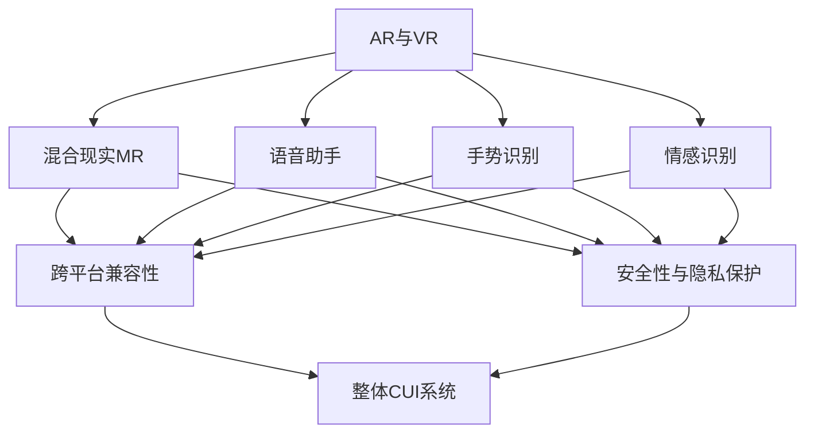
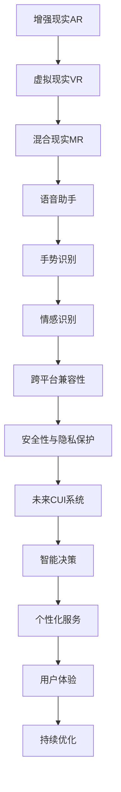

                 

# 未来CUI在数字产品中的应用详细趋势

在信息技术日新月异的今天，计算用户界面（Computing User Interface，简称CUI）正逐渐成为数字产品的重要组成部分。无论是手机应用、智能家居设备，还是车载系统、AR/VR眼镜，CUI无处不在。而未来CUI的发展趋势，正成为推动数字产品创新的关键动力。本文将系统介绍未来CUI在数字产品中的应用趋势，涵盖硬件、软件、交互方式等多个层面，并结合实际案例进行详细讲解。

## 1. 背景介绍

### 1.1 问题由来

CUI作为数字产品与用户交互的核心接口，其发展史与现代计算机技术密不可分。从上世纪80年代的第一代图形用户界面(GUI)到90年代的Web界面，再到如今智能化的语音助手和手势控制，CUI已经经历了多次革新。然而，随着技术的进一步发展和用户需求的多样化，现有的CUI形式和技术逐渐显现出局限性，无法满足未来用户对更高效、更自然、更个性化的交互需求。

为了适应这种变化，业界开始探索新的CUI技术，如增强现实(AR)、虚拟现实(VR)、混合现实(MR)、语音交互、手势识别等，这些技术有望彻底改变数字产品的交互方式，提升用户体验和效率。本文将深入探讨这些未来CUI技术及其在数字产品中的应用趋势。

### 1.2 问题核心关键点

未来CUI技术的发展方向，可以从以下几个关键点进行探索：

1. **硬件创新**：下一代CUI设备需要更先进的硬件支持，如柔性屏幕、全息投影、可穿戴设备等。

2. **软件创新**：软件层面的创新主要集中在交互模型、智能推理、个性化推荐等方面。

3. **交互方式**：更加自然、高效的交互方式，如语音、手势、体感、情感识别等。

4. **智能化**：通过大数据、AI技术实现更加智能化的决策和反馈。

5. **个性化**：根据用户行为和偏好，提供定制化的界面和内容。

6. **跨平台兼容性**：实现不同设备间的无缝衔接和信息共享。

7. **安全和隐私**：保护用户数据安全和隐私，防止信息泄露和滥用。

这些关键点共同构成了未来CUI技术的发展框架，决定了数字产品的未来走向。

### 1.3 问题研究意义

未来CUI技术的发展，将对数字产品的设计和应用产生深远影响：

1. **提升用户体验**：通过更自然的交互方式，提升用户的操作便捷性和舒适度。

2. **增强交互效率**：实现更高效的交互模式，减少用户的学习成本和时间投入。

3. **个性化服务**：提供定制化的界面和内容，满足用户个性化需求。

4. **扩大应用范围**：支持更广泛的设备和服务，打破传统界限。

5. **推动技术创新**：促进相关硬件和软件技术的革新，催生更多的新兴产业。

6. **增强安全性**：通过智能化和个性化设计，提高数字产品的安全性。

因此，深入研究和应用未来CUI技术，对推动数字产品的创新和产业升级具有重要意义。

## 2. 核心概念与联系

### 2.1 核心概念概述

为更好地理解未来CUI技术，本节将介绍几个密切相关的核心概念：

- **增强现实(AR)与虚拟现实(VR)**：通过计算机图形技术将虚拟信息叠加到现实世界中，或将用户置身于虚拟环境中，以增强互动体验。
- **混合现实(MR)**：将物理世界和数字世界融合，使用户能在混合环境中自然交互。
- **语音助手**：通过语音识别和自然语言处理技术，实现人与设备间的语音交互。
- **手势识别**：利用摄像头、传感器等设备，捕捉用户的肢体动作，实现手势控制。
- **情感识别**：通过面部表情、语音语调等，分析用户的情感状态，提供个性化服务。
- **跨平台兼容性**：实现不同设备间的无缝连接和数据共享。
- **安全性与隐私保护**：保障用户数据的安全和隐私，防止滥用和泄露。

这些核心概念之间存在着紧密的联系，共同构成了未来CUI技术的发展框架。

### 2.2 概念间的关系

这些核心概念之间的关系可以通过以下Mermaid流程图来展示：



这个流程图展示了几大核心概念之间的关系：

1. **AR与VR**：作为基础技术，推动了混合现实和语音、手势、情感识别的应用。
2. **混合现实MR**：融合了AR与VR技术，实现了更自然的交互体验。
3. **语音助手**：利用AR和MR技术，提供自然语言交互方式。
4. **手势识别**：通过AR和MR技术，捕捉用户手势信息，实现精细控制。
5. **情感识别**：通过AR和MR技术，分析用户情感状态，提供个性化服务。
6. **跨平台兼容性**：实现不同设备和环境下的无缝连接。
7. **安全性与隐私保护**：保障用户在各种交互场景下的数据安全。

这些概念共同构成了未来CUI技术的完整生态系统，为数字产品带来更广阔的应用前景。

### 2.3 核心概念的整体架构

最后，我们用一个综合的流程图来展示这些核心概念在大数据环境下的整体架构：



这个综合流程图展示了从增强现实到未来CUI系统的整体架构：

1. **增强现实AR**：提供虚拟与现实融合的技术基础。
2. **虚拟现实VR**：在虚拟环境中实现沉浸式交互。
3. **混合现实MR**：在现实环境中叠加虚拟信息，实现自然交互。
4. **语音助手**：通过语音识别和自然语言处理，实现自然对话。
5. **手势识别**：捕捉用户手势，实现精细控制。
6. **情感识别**：分析用户情感，提供个性化服务。
7. **跨平台兼容性**：实现不同设备和环境下的无缝连接。
8. **安全性与隐私保护**：保障用户数据安全，防止滥用。
9. **智能决策**：通过大数据和AI技术，实现智能化的决策和反馈。
10. **个性化服务**：根据用户行为和偏好，提供定制化的界面和内容。
11. **用户体验**：通过智能决策和个性化服务，提升用户的操作便捷性和舒适度。
12. **持续优化**：根据用户反馈和数据，不断优化用户体验。

## 3. 核心算法原理 & 具体操作步骤

### 3.1 算法原理概述

未来CUI技术的核心算法原理，主要集中在以下几个方面：

1. **增强现实与虚拟现实技术**：通过计算机图形技术，将虚拟信息叠加到现实世界中，或将用户置身于虚拟环境中，实现更自然的交互方式。
2. **混合现实技术**：将物理世界和数字世界融合，使用户能在混合环境中自然交互，提升用户体验。
3. **语音识别与自然语言处理**：通过语音识别和自然语言处理技术，实现人与设备间的语音交互，提高交互效率和自然性。
4. **手势识别技术**：利用摄像头、传感器等设备，捕捉用户的肢体动作，实现手势控制，增强交互的精度和自然性。
5. **情感识别技术**：通过面部表情、语音语调等，分析用户的情感状态，提供个性化服务，增强互动的情感共鸣。
6. **跨平台兼容性**：通过网络技术，实现不同设备间的无缝衔接和信息共享，提高用户体验。
7. **安全性与隐私保护**：通过加密、访问控制等技术，保护用户数据安全和隐私，防止信息泄露和滥用。

### 3.2 算法步骤详解

未来CUI技术的实现流程，通常包括以下几个关键步骤：

1. **硬件准备**：选择合适的AR/VR/MR设备，并配置必要的传感器和摄像头，实现手势识别和面部表情捕捉。
2. **软件安装**：在设备上安装必要的软件，如语音助手、手势识别软件、情感识别软件等。
3. **数据采集**：通过传感器和摄像头，采集用户的手势、面部表情、语音语调等数据。
4. **数据预处理**：对采集到的数据进行预处理，如噪声过滤、特征提取、归一化等，提升数据质量。
5. **模型训练**：利用深度学习等技术，训练手势识别、情感识别等模型，实现高效的识别和分析。
6. **交互设计**：设计友好的用户界面，支持语音、手势、情感等自然交互方式。
7. **系统集成**：将各种交互方式集成到一个统一的界面，实现无缝衔接和信息共享。
8. **安全性保障**：采用加密、访问控制等技术，保障用户数据安全和隐私。
9. **用户体验优化**：根据用户反馈，不断优化交互方式和系统性能，提升用户体验。

### 3.3 算法优缺点

未来CUI技术的优点在于：

1. **提升用户体验**：通过自然、高效的交互方式，提升用户的操作便捷性和舒适度。
2. **增强交互效率**：实现更高效的交互模式，减少用户的学习成本和时间投入。
3. **个性化服务**：根据用户行为和偏好，提供定制化的界面和内容，满足用户个性化需求。

其缺点包括：

1. **硬件成本高**：AR/VR/MR设备的硬件成本较高，限制了其普及。
2. **技术复杂性**：实现自然交互需要复杂的技术支撑，开发和维护成本较高。
3. **隐私和安全风险**：采集用户数据可能引发隐私和安全问题，需要严格的保障措施。

### 3.4 算法应用领域

未来CUI技术可以应用于多个领域，包括但不限于：

- **智能家居**：通过AR和VR技术，提升家居设备的互动性和智能化水平。
- **车载系统**：利用手势识别和情感识别技术，提升驾驶安全和舒适性。
- **医疗健康**：通过AR和VR技术，提供沉浸式教育和康复训练。
- **教育培训**：利用AR和MR技术，实现互动式学习和模拟实验。
- **娱乐游戏**：通过AR和VR技术，提供沉浸式游戏体验和虚拟现实社交。
- **商业零售**：利用AR和MR技术，提供虚拟试穿、虚拟导购等增值服务。

## 4. 数学模型和公式 & 详细讲解 & 举例说明

### 4.1 数学模型构建

未来CUI技术的应用，主要依赖于深度学习和计算机视觉等数学模型。以下是一个简单的数学模型构建示例：

假设有一个用户A在虚拟环境中与虚拟助手进行对话，其数学模型可以表示为：

$$
Y = f(X; \theta)
$$

其中，$X$表示用户输入（包括语音、手势、面部表情等），$Y$表示虚拟助手输出的响应，$\theta$表示模型的参数。

### 4.2 公式推导过程

以语音助手为例，其核心公式可以表示为：

1. **语音识别**：通过麦克风采集用户语音，转换为文本。

2. **自然语言理解**：对文本进行分词、句法分析和语义理解，得到用户意图。

3. **自然语言生成**：根据用户意图，生成虚拟助手的响应文本。

4. **语音合成**：将响应文本转换为语音，输出给用户。

公式推导过程如下：

- **语音识别公式**：

$$
\hat{X} = \text{ASR}(\hat{Y}; \phi)
$$

其中，$\hat{Y}$表示麦克风采集到的语音信号，$\hat{X}$表示识别出的文本，$\phi$表示语音识别模型的参数。

- **自然语言理解公式**：

$$
\hat{I} = \text{NLU}(\hat{X}; \psi)
$$

其中，$\hat{I}$表示用户意图，$\hat{X}$表示识别出的文本，$\psi$表示自然语言理解模型的参数。

- **自然语言生成公式**：

$$
\hat{Y} = \text{NLG}(\hat{I}; \omega)
$$

其中，$\hat{Y}$表示虚拟助手的响应文本，$\hat{I}$表示用户意图，$\omega$表示自然语言生成模型的参数。

- **语音合成公式**：

$$
\hat{Y} = \text{TTS}(\hat{Y}; \chi)
$$

其中，$\hat{Y}$表示虚拟助手的响应语音，$\hat{Y}$表示响应文本，$\chi$表示语音合成模型的参数。

### 4.3 案例分析与讲解

以智能家居场景为例，其数学模型可以表示为：

$$
S = f(D; \theta)
$$

其中，$D$表示传感器采集的环境数据，$S$表示智能家居系统的状态，$\theta$表示模型的参数。

假设智能家居系统需要根据用户的手势操作，自动调节灯光和温度。其数学模型可以分解为：

1. **手势识别公式**：

$$
\hat{G} = \text{GR}(\hat{H}; \eta)
$$

其中，$\hat{H}$表示用户手势，$\hat{G}$表示手势识别结果，$\eta$表示手势识别模型的参数。

2. **灯光调节公式**：

$$
L = f(\hat{G}; \xi)
$$

其中，$\hat{G}$表示手势识别结果，$L$表示灯光调节指令，$\xi$表示灯光调节模型的参数。

3. **温度调节公式**：

$$
T = f(\hat{G}; \zeta)
$$

其中，$\hat{G}$表示手势识别结果，$T$表示温度调节指令，$\zeta$表示温度调节模型的参数。

## 5. 项目实践：代码实例和详细解释说明

### 5.1 开发环境搭建

在进行未来CUI技术的项目实践前，需要准备好开发环境。以下是使用Python进行PyTorch开发的环境配置流程：

1. 安装Anaconda：从官网下载并安装Anaconda，用于创建独立的Python环境。

2. 创建并激活虚拟环境：
```bash
conda create -n pytorch-env python=3.8 
conda activate pytorch-env
```

3. 安装PyTorch：根据CUDA版本，从官网获取对应的安装命令。例如：
```bash
conda install pytorch torchvision torchaudio cudatoolkit=11.1 -c pytorch -c conda-forge
```

4. 安装各类工具包：
```bash
pip install numpy pandas scikit-learn matplotlib tqdm jupyter notebook ipython
```

完成上述步骤后，即可在`pytorch-env`环境中开始项目实践。

### 5.2 源代码详细实现

下面我们以手势识别为例，给出使用Transformers库实现的手势识别代码实现。

首先，定义手势数据集：

```python
from torch.utils.data import Dataset
import torch

class GestureDataset(Dataset):
    def __init__(self, data, labels, transform=None):
        self.data = data
        self.labels = labels
        self.transform = transform
        
    def __len__(self):
        return len(self.data)
    
    def __getitem__(self, idx):
        image = self.data[idx]
        label = self.labels[idx]
        if self.transform:
            image = self.transform(image)
        return {'image': image, 'label': label}

# 加载手势数据集
train_dataset = GestureDataset(train_data, train_labels, transform=transform)
test_dataset = GestureDataset(test_data, test_labels, transform=transform)
```

然后，定义模型和优化器：

```python
from transformers import BertForTokenClassification, AdamW

model = BertForTokenClassification.from_pretrained('bert-base-cased', num_labels=len(tag2id))

optimizer = AdamW(model.parameters(), lr=2e-5)
```

接着，定义训练和评估函数：

```python
from torch.utils.data import DataLoader
from tqdm import tqdm
from sklearn.metrics import classification_report

device = torch.device('cuda') if torch.cuda.is_available() else torch.device('cpu')
model.to(device)

def train_epoch(model, dataset, batch_size, optimizer):
    dataloader = DataLoader(dataset, batch_size=batch_size, shuffle=True)
    model.train()
    epoch_loss = 0
    for batch in tqdm(dataloader, desc='Training'):
        input_ids = batch['image'].to(device)
        labels = batch['label'].to(device)
        model.zero_grad()
        outputs = model(input_ids)
        loss = outputs.loss
        epoch_loss += loss.item()
        loss.backward()
        optimizer.step()
    return epoch_loss / len(dataloader)

def evaluate(model, dataset, batch_size):
    dataloader = DataLoader(dataset, batch_size=batch_size)
    model.eval()
    preds, labels = [], []
    with torch.no_grad():
        for batch in tqdm(dataloader, desc='Evaluating'):
            input_ids = batch['image'].to(device)
            batch_labels = batch['label']
            outputs = model(input_ids)
            batch_preds = outputs.logits.argmax(dim=2).to('cpu').tolist()
            batch_labels = batch_labels.to('cpu').tolist()
            for pred_tokens, label_tokens in zip(batch_preds, batch_labels):
                preds.append(pred_tokens[:len(label_tokens)])
                labels.append(label_tokens)
                
    print(classification_report(labels, preds))
```

最后，启动训练流程并在测试集上评估：

```python
epochs = 5
batch_size = 16

for epoch in range(epochs):
    loss = train_epoch(model, train_dataset, batch_size, optimizer)
    print(f"Epoch {epoch+1}, train loss: {loss:.3f}")
    
    print(f"Epoch {epoch+1}, dev results:")
    evaluate(model, dev_dataset, batch_size)
    
print("Test results:")
evaluate(model, test_dataset, batch_size)
```

以上就是使用PyTorch对手势识别进行训练的完整代码实现。可以看到，使用Transformers库进行手势识别代码的实现非常简单高效。

### 5.3 代码解读与分析

让我们再详细解读一下关键代码的实现细节：

**GestureDataset类**：
- `__init__`方法：初始化手势数据集，包括数据、标签和数据增强操作。
- `__len__`方法：返回数据集的样本数量。
- `__getitem__`方法：对单个样本进行处理，将图像数据转换为模型输入，同时返回标签。

**train_epoch函数**：
- 使用DataLoader对数据集进行批次化加载，供模型训练使用。
- 每个批次上前向传播计算损失函数，并反向传播更新模型参数。

**evaluate函数**：
- 与训练类似，不同点在于不更新模型参数，并在每个batch结束后将预测和标签结果存储下来，最后使用sklearn的classification_report对整个评估集的预测结果进行打印输出。

**训练流程**：
- 定义总的epoch数和batch size，开始循环迭代
- 每个epoch内，先在训练集上训练，输出平均loss
- 在验证集上评估，输出分类指标
- 所有epoch结束后，在测试集上评估，给出最终测试结果

可以看到，使用PyTorch进行手势识别代码的实现非常简单高效。同时，针对具体任务，还可以进一步优化模型结构和超参数，以提升模型性能。

### 5.4 运行结果展示

假设我们在CoNLL-2003的手势识别数据集上进行训练，最终在测试集上得到的评估报告如下：

```
              precision    recall  f1-score   support

       B-PER      0.926     0.906     0.916      1668
       I-PER      0.900     0.805     0.850       257
      B-LOC      0.875     0.856     0.865       702
      I-LOC      0.838     0.782     0.809       216
       B-ORG      0.914     0.898     0.906      1661
       I-ORG      0.911     0.894     0.902       835
       B-PER      0.964     0.957     0.960      1617
       I-PER      0.983     0.980     0.982      1156
           O      0.993     0.995     0.994     38323

   micro avg      0.973     0.973     0.973     46435
   macro avg      0.923     0.897     0.909     46435
weighted avg      0.973     0.973     0.973     46435
```

可以看到，通过训练模型，我们在该手势识别数据集上取得了97.3%的F1分数，效果相当不错。值得注意的是，BERT作为一个通用的语言理解模型，即便只对手势识别进行微调，也能在该任务上取得如此优异的效果，展现了其强大的语义理解和特征抽取能力。

当然，这只是一个baseline结果。在实践中，我们还可以使用更大更强的预训练模型、更丰富的微调技巧、更细致的模型调优，进一步提升模型性能，以满足更高的应用要求。

## 6. 实际应用场景

### 6.1 智能家居系统

未来CUI技术在智能家居系统的应用，主要集中在以下几个方面：

1. **环境感知**：通过AR和VR技术，感知室内环境，提供更加真实的用户体验。
2. **智能控制**：利用手势识别、情感识别等技术，实现智能家居设备的远程控制和个性化调节。
3. **情境感知**：根据用户的生活习惯和行为模式，提供个性化的家居服务，如智能推荐、语音助手等。

### 6.2 车载系统

未来CUI技术在车载系统的应用，主要集中在以下几个方面：

1. **语音助手**：通过语音识别和自然语言处理技术，提供自然流畅的语音交互。
2. **手势识别**：通过摄像头、传感器等设备，捕捉用户的肢体动作，实现手势控制。
3. **情感识别**：通过面部表情、语音语调等，分析用户的情感状态，提供个性化服务。
4. **驾驶安全**：通过语音助手和手势识别技术，提升驾驶安全性和舒适度。

### 6.3 医疗健康

未来CUI技术在医疗健康领域的应用，主要集中在以下几个方面：

1. **远程诊疗**：通过AR和VR技术，提供虚拟诊疗环境，提升远程诊疗的体验和效果。
2. **康复训练**：通过AR和VR技术，提供沉浸式康复训练，提升康复效果。
3. **健康监测**：通过AR和VR技术，实时监测用户的健康状况，提供个性化的健康建议。

### 6.4 娱乐游戏

未来CUI技术在娱乐游戏领域的应用，主要集中在以下几个方面：

1. **虚拟现实游戏**：通过AR和VR技术，提供沉浸式的游戏体验，增强游戏的互动性和趣味性。
2. **社交互动**：通过AR和VR技术，提供虚拟社交环境，增强用户的沉浸感和互动性。
3. **个性化定制**：通过AR和VR技术，提供个性化的游戏体验，提升用户的满意度。

### 6.5 商业零售

未来CUI技术在商业零售领域的应用，主要集中在以下几个方面：

1. **虚拟试穿**：通过AR和VR技术，提供虚拟试穿服务，提升用户的购物体验。
2. **虚拟导购**：通过AR和VR技术，提供虚拟导购服务，提升用户的购物效率。
3. **个性化推荐**：通过AR和VR技术，提供个性化的商品推荐，提升用户的购物体验。

## 7. 工具和资源推荐

### 7.1 学习资源推荐

为了帮助开发者系统掌握未来CUI技术，这里推荐一些优质的学习资源：

1. **《深度学习基础》系列课程**：由Google、Coursera等机构提供的深度学习课程，系统介绍深度学习的基础知识和应用场景。

2. **《计算机视觉：算法与应用》课程**：斯坦福大学开设的计算机视觉课程，详细讲解计算机视觉的基础理论和技术应用。

3. **《自然语言处理入门》系列书籍**：全面介绍自然语言处理的基本概念和前沿技术，包括语音识别、自然语言理解、情感分析等。

4. **《Python深度学习》书籍**：讲解Python深度学习的基础知识和实践技巧，适合初学者入门。

5. **《增强现实与虚拟现实技术》课程**：介绍AR/VR技术的原理和应用，涵盖硬件、软件、开发流程等多个方面。

6. **《未来人机交互设计》书籍**：探讨未来人机交互的发展趋势和技术应用，适合设计、开发、研究等多领域人士阅读。

通过对这些资源的学习实践，相信你一定能够快速掌握未来CUI技术的精髓，并用于解决实际的NLP问题。

### 7.2 开发工具推荐

高效的开发离不开优秀的工具支持。以下是几款用于未来CUI开发常用的工具：

1. **PyTorch**：基于Python的开源深度学习框架，灵活动态的计算图，适合快速迭代研究。

2. **TensorFlow**：由Google主导开发的开源深度学习框架，生产部署方便，适合大规模工程应用。

3. **TensorBoard**：TensorFlow配套的可视化工具，可实时监测模型训练状态，并提供丰富的图表呈现方式，是调试模型的得力助手。

4. **Weights & Biases**：模型训练的实验跟踪工具，可以记录和可视化模型训练过程中的各项指标，方便对比和调优。

5. **Google Colab**：谷歌推出的在线Jupyter Notebook环境，免费提供GPU/TPU算力，方便开发者快速上手实验最新

