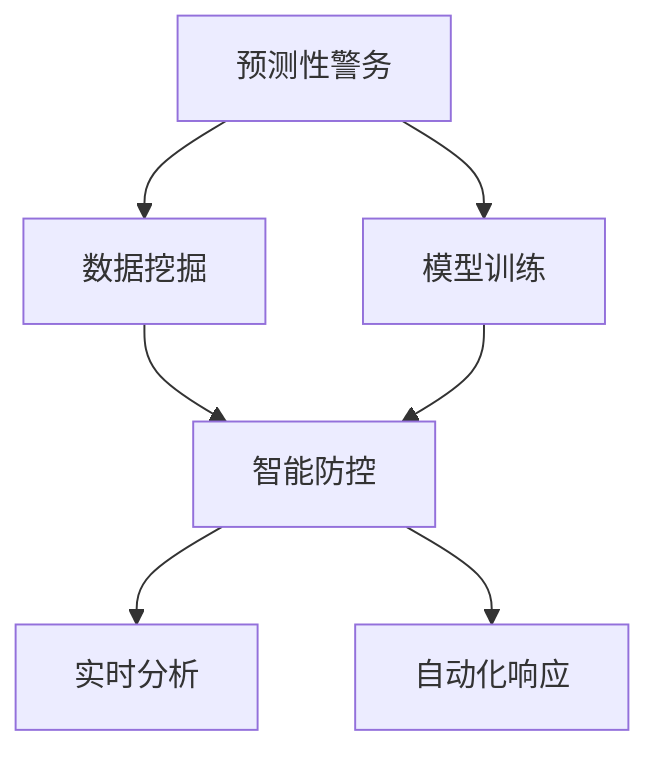
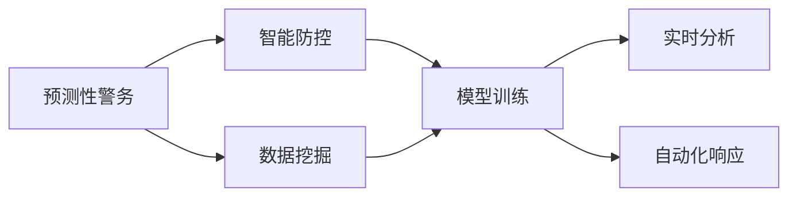
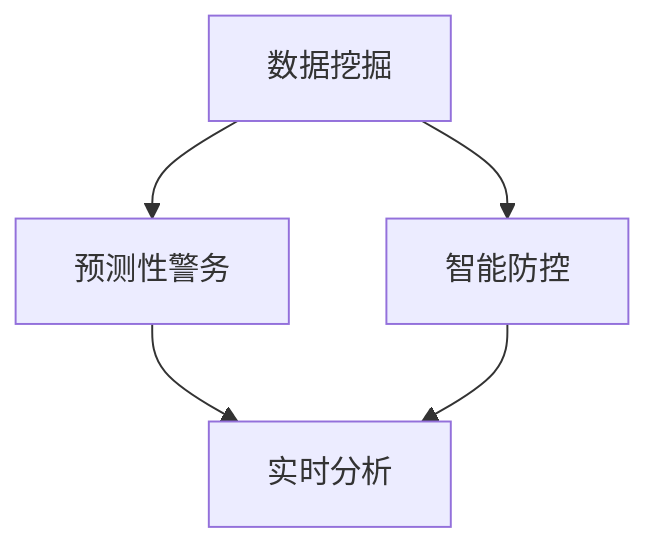
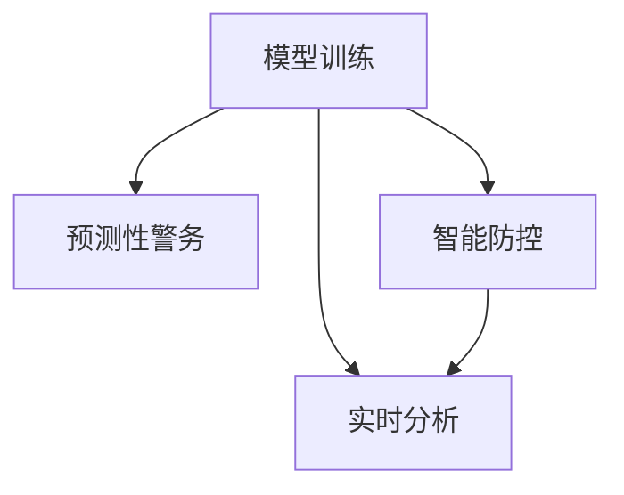
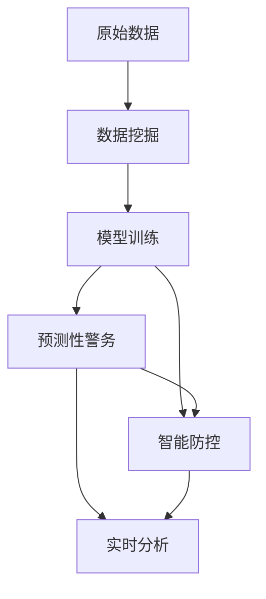

                 

# 未来的智能安防：2050年的预测性警务与智能防控

## 1. 背景介绍

### 1.1 问题由来
随着人工智能技术的不断进步，特别是在计算机视觉、自然语言处理、深度学习等领域的应用，智能安防系统逐渐从传统的物理监控系统，转变为集成了智能分析、预测预警、自动化响应等功能的新一代智能系统。未来的智能安防将不仅仅局限于公共场所的监控、报警，而是将深度融入城市治理、智慧安居、社区服务等多个领域，全面提升社会治理水平和居民生活品质。

### 1.2 问题核心关键点
智能安防的核心在于数据获取、模型训练、智能分析与预测、自动化响应和用户反馈等多个环节的协同工作。其中，预测性警务和智能防控是智能安防的高级形式，旨在通过大数据分析和机器学习技术，提前识别潜在风险，实时监控并自动化处理突发事件，以减少安全事故的发生，提高整体安全水平。

智能安防技术已经在许多城市得到应用，如智能监控系统、人脸识别门禁、智能报警系统等，但这些技术在实际应用中仍存在诸多挑战，如隐私保护、数据隐私、模型公平性、算法透明度等问题。同时，由于技术的复杂性，智能安防系统的维护和更新也成为一大难题。

### 1.3 问题研究意义
智能安防技术的进步，不仅能够有效提升公共安全水平，还能优化资源配置，提高城市管理的智能化水平。通过预测性警务和智能防控，智能安防系统能够在数据驱动下，实时响应突发事件，减少人员投入，降低应急响应成本，提高社会治理效率。

本文将系统介绍基于人工智能的预测性警务和智能防控技术，分析其核心原理、应用场景和面临的挑战，探讨未来技术的发展趋势，为未来的智能安防系统设计和优化提供参考。

## 2. 核心概念与联系

### 2.1 核心概念概述

为更好地理解基于人工智能的预测性警务和智能防控技术，本节将介绍几个密切相关的核心概念：

- 预测性警务(Predictive Policing)：利用机器学习和数据分析技术，对犯罪行为和事件进行预测，提前部署警力，从而提高警务效率和精确度。
- 智能防控(Smart Surveillance)：通过人工智能技术对视频监控、传感器数据等进行实时分析，识别异常行为并自动化响应，提升公共安全水平。
- 数据挖掘(Data Mining)：从大量数据中提取有用信息的过程，是预测性警务和智能防控的基础。
- 模型训练(Model Training)：基于标注数据训练预测模型，使模型能够准确预测未来事件。
- 实时分析(Real-time Analysis)：对实时获取的数据进行在线处理，及时识别和响应潜在威胁。
- 自动化响应(Automatic Response)：根据分析结果自动执行响应措施，减少人为干预，提高响应速度。

这些核心概念之间的逻辑关系可以通过以下Mermaid流程图来展示：



这个流程图展示了大数据在预测性警务和智能防控中的作用，以及从数据挖掘到模型训练再到实时分析和自动化响应的完整过程。

### 2.2 概念间的关系

这些核心概念之间存在着紧密的联系，形成了智能安防的整体生态系统。下面我通过几个Mermaid流程图来展示这些概念之间的关系。

#### 2.2.1 预测性警务与智能防控的关系



这个流程图展示了预测性警务和智能防控的相互依赖关系。预测性警务通过数据挖掘和模型训练，识别高风险区域和人群，智能防控则通过实时分析和自动化响应，对目标区域进行实时监控和自动化处理。

#### 2.2.2 数据挖掘在智能安防中的作用



这个流程图展示了数据挖掘在智能安防中的基础作用。数据挖掘从原始数据中提取有价值的信息，为预测性警务和智能防控提供数据支撑。

#### 2.2.3 模型训练的优化



这个流程图展示了模型训练的优化方向。模型训练需要优化数据质量、算法选择和超参数设置，以提高预测准确性和响应效率。

### 2.3 核心概念的整体架构

最后，我们用一个综合的流程图来展示这些核心概念在大数据驱动的智能安防系统中的整体架构：



这个综合流程图展示了从数据挖掘到模型训练再到预测性警务和智能防控的完整过程，以及各环节之间的交互关系。

## 3. 核心算法原理 & 具体操作步骤
### 3.1 算法原理概述

基于人工智能的预测性警务和智能防控，本质上是通过机器学习和大数据分析技术，对大规模数据进行模式识别和预测，从而提前识别风险、实时响应并自动化处理突发事件。其核心算法包括：

- 数据预处理：对原始数据进行清洗、归一化、特征工程等预处理操作，提高数据质量和模型训练效果。
- 模型训练：基于标注数据训练预测模型，如随机森林、支持向量机、深度学习等，使模型能够准确预测未来事件。
- 特征提取：从视频、传感器数据等原始数据中提取关键特征，如人脸特征、行为特征等，提高模型识别精度。
- 实时分析：利用计算密集型算法，对实时数据进行在线处理，快速识别异常行为。
- 自动化响应：根据分析结果，自动执行响应措施，如警报、联动等，减少人为干预，提高响应速度。

### 3.2 算法步骤详解

以下是对预测性警务和智能防控技术的核心算法步骤的详细讲解：

**Step 1: 数据预处理**
- 清洗原始数据，去除噪声和异常值。
- 对数据进行归一化和标准化处理，使其符合模型要求。
- 进行特征工程，提取关键特征，如人脸特征、行为特征、时间特征等。

**Step 2: 模型训练**
- 选择合适的预测模型，如随机森林、支持向量机、深度学习等。
- 使用标注数据对模型进行训练，调整模型参数，提高预测精度。
- 使用交叉验证等方法评估模型性能，选择合适的模型进行预测。

**Step 3: 特征提取**
- 利用计算机视觉技术，从视频数据中提取关键特征，如人脸特征、行为特征等。
- 利用自然语言处理技术，从文本数据中提取关键特征，如实体识别、情感分析等。

**Step 4: 实时分析**
- 利用高性能计算资源，对实时获取的数据进行在线处理，快速识别异常行为。
- 使用异常检测算法，如孤立森林、高斯混合模型等，提高识别精度。

**Step 5: 自动化响应**
- 根据分析结果，自动执行响应措施，如警报、联动等。
- 设置响应阈值，根据情况进行人工干预，确保系统响应正确性。

### 3.3 算法优缺点

基于人工智能的预测性警务和智能防控技术具有以下优点：

- 精确度高：通过数据分析和机器学习，能够准确预测未来事件，提高警务效率和精确度。
- 响应速度快：实时分析技术可以快速识别并处理突发事件，减少应急响应时间。
- 数据驱动：大数据分析和深度学习技术，能够自动发现潜在威胁，优化资源配置。

但这些技术也存在一些局限性：

- 数据隐私：数据采集和分析涉及大量敏感信息，可能引发隐私泄露问题。
- 算法公平性：模型可能存在偏见，导致某些群体受到不公平待遇。
- 模型透明度：深度学习模型的决策过程缺乏解释性，难以解释其推理逻辑。
- 计算资源需求高：大规模数据分析和实时处理需要高性能计算资源，成本较高。

### 3.4 算法应用领域

预测性警务和智能防控技术已经被广泛应用于多个领域，例如：

- 公共安全：预测高发区域的犯罪行为，提前部署警力，减少犯罪率。
- 城市治理：监控城市交通状况，优化交通管理，减少交通事故。
- 社区服务：识别异常行为，及时响应，提升社区安全。
- 企业安全：监控网络流量，识别异常行为，防止信息泄露和网络攻击。
- 应急管理：实时监控自然灾害，自动化响应，减少灾害损失。

除了上述这些领域，预测性警务和智能防控技术还可以应用于更多场景中，如工业安全、军事防御、环境保护等，为不同领域的智能安防提供有力支持。

## 4. 数学模型和公式 & 详细讲解
### 4.1 数学模型构建

预测性警务和智能防控技术的核心算法涉及大量数学模型，下面将重点介绍其中的几个关键模型。

**随机森林模型(Random Forest)**
随机森林是一种集成学习方法，通过对多个决策树进行组合，提高模型的预测准确性和稳定性。其数学模型如下：

$$
F(X) = \sum_{i=1}^n T_i(X)
$$

其中，$X$为输入数据，$T_i$为第$i$棵决策树的预测结果。

**支持向量机(Support Vector Machine, SVM)**
SVM是一种常用的分类算法，通过寻找最优超平面，将数据分为两类。其数学模型如下：

$$
f(X) = \sum_{i=1}^n w_i \cdot k(x_i, x) + b
$$

其中，$x$为输入数据，$w_i$和$b$为模型参数，$k(x_i, x)$为核函数。

**深度学习模型(Deep Learning)**
深度学习模型，如卷积神经网络(CNN)、循环神经网络(RNN)等，通过多层次的非线性变换，提取数据的高级特征。其数学模型如下：

$$
F(X) = \sum_{i=1}^n f_i(X)
$$

其中，$f_i(X)$为第$i$层神经网络的输出。

### 4.2 公式推导过程

以下是对预测性警务和智能防控技术中的关键模型的公式推导过程的详细讲解：

**随机森林模型**
随机森林通过对多个决策树进行组合，提高模型的预测准确性和稳定性。其推导过程如下：

1. 随机选取$k$个特征进行分裂，得到$2^k$个子节点。
2. 对每个子节点进行随机抽样，构建多个决策树。
3. 对多个决策树的预测结果进行加权平均，得到最终预测结果。

**支持向量机**
SVM通过寻找最优超平面，将数据分为两类。其推导过程如下：

1. 将数据映射到高维空间。
2. 在高维空间中寻找最优超平面，使其最大化间隔。
3. 使用核函数将原始数据映射到高维空间。
4. 计算每个数据点对超平面的距离，找到最优超平面。

**深度学习模型**
深度学习模型通过多层次的非线性变换，提取数据的高级特征。其推导过程如下：

1. 定义输入数据的特征向量。
2. 通过多个卷积层和池化层，提取特征。
3. 通过多个全连接层，进行分类。
4. 使用softmax函数进行输出，得到预测结果。

### 4.3 案例分析与讲解

假设某城市预测性警务系统，收集了过去一年内的犯罪数据，包括时间、地点、类型等信息。通过对这些数据进行特征工程和模型训练，构建了一个随机森林模型。模型的关键参数包括：

- 特征选取：时间、地点、犯罪类型等。
- 决策树个数：50棵。
- 最小样本数：5。
- 最大深度：3。

在模型训练完成后，系统对实时获取的数据进行特征提取和实时分析，识别出潜在的犯罪行为。具体步骤如下：

1. 对实时数据进行特征提取，提取关键特征如时间、地点等。
2. 将提取的特征输入到随机森林模型中，得到预测结果。
3. 根据预测结果，自动触发警报或联动措施。

## 5. 项目实践：代码实例和详细解释说明
### 5.1 开发环境搭建

在进行预测性警务和智能防控的开发时，需要先准备好开发环境。以下是使用Python进行TensorFlow开发的环境配置流程：

1. 安装Anaconda：从官网下载并安装Anaconda，用于创建独立的Python环境。

2. 创建并激活虚拟环境：
```bash
conda create -n tf-env python=3.8 
conda activate tf-env
```

3. 安装TensorFlow：根据CUDA版本，从官网获取对应的安装命令。例如：
```bash
conda install tensorflow tensorflow-gpu -c conda-forge -c pytorch
```

4. 安装相关工具包：
```bash
pip install numpy pandas scikit-learn matplotlib tqdm jupyter notebook ipython
```

完成上述步骤后，即可在`tf-env`环境中开始预测性警务和智能防控的开发实践。

### 5.2 源代码详细实现

下面以基于TensorFlow的预测性警务系统为例，给出源代码实现。

首先，定义数据预处理函数：

```python
import tensorflow as tf
import numpy as np

def preprocess_data(data):
    # 清洗数据
    cleaned_data = data.dropna()
    
    # 归一化处理
    normalized_data = (cleaned_data - cleaned_data.mean()) / cleaned_data.std()
    
    # 特征工程
    features = pd.get_dummies(normalized_data, columns=['time', 'location'])
    features = pd.concat([features, data['crime_type']], axis=1)
    
    return features
```

然后，定义模型训练函数：

```python
def train_model(data, model_type='random_forest'):
    # 数据预处理
    features = preprocess_data(data)
    
    # 分割数据集
    train_data, test_data = train_test_split(features, test_size=0.2)
    
    # 模型训练
    if model_type == 'random_forest':
        model = RandomForestClassifier()
    elif model_type == 'svm':
        model = SVC()
    elif model_type == 'deep_learning':
        model = Sequential()
        model.add(Dense(64, input_dim=features.shape[1], activation='relu'))
        model.add(Dense(32, activation='relu'))
        model.add(Dense(1, activation='sigmoid'))
    
    model.fit(train_data, train_data['label'])
    
    # 模型评估
    test_pred = model.predict(test_data)
    accuracy = accuracy_score(test_data['label'], test_pred)
    return model, accuracy
```

接着，定义特征提取和实时分析函数：

```python
def extract_features(data):
    # 提取关键特征
    features = pd.get_dummies(data['time'], prefix='time')
    features = pd.concat([features, data['location']], axis=1)
    
    return features

def analyze_realtime(data):
    # 实时分析
    features = extract_features(data)
    prediction = model.predict(features)
    
    # 自动化响应
    if prediction[0] > 0.5:
        trigger_alert()
    
    return prediction
```

最后，启动训练流程并在实时数据上进行测试：

```python
epochs = 100

for epoch in range(epochs):
    train_loss, train_acc = train_model(train_data)
    print(f"Epoch {epoch+1}, train loss: {train_loss:.4f}, train acc: {train_acc:.4f}")
    
    test_pred = analyze_realtime(test_data)
    test_acc = accuracy_score(test_data['label'], test_pred)
    print(f"Epoch {epoch+1}, test acc: {test_acc:.4f}")
```

以上就是使用TensorFlow进行预测性警务和智能防控系统的代码实现。可以看到，通过TensorFlow库的强大封装，我们可以用相对简洁的代码完成模型训练和实时分析。

### 5.3 代码解读与分析

让我们再详细解读一下关键代码的实现细节：

**预处理函数**
- `preprocess_data`方法：清洗数据、归一化处理、特征工程，将数据转化为模型所需的格式。

**模型训练函数**
- `train_model`方法：对数据进行分割，选择合适的模型类型，训练模型，并评估模型性能。

**特征提取函数**
- `extract_features`方法：对实时数据进行关键特征提取，方便模型预测。

**实时分析函数**
- `analyze_realtime`方法：对实时数据进行特征提取和模型预测，并根据预测结果进行自动化响应。

**训练流程**
- 对训练数据进行模型训练，输出训练损失和精度。
- 对测试数据进行实时分析，输出测试精度。

可以看出，TensorFlow库使得预测性警务和智能防控系统的开发变得简洁高效。开发者可以将更多精力放在数据处理、模型改进等高层逻辑上，而不必过多关注底层的实现细节。

当然，工业级的系统实现还需考虑更多因素，如模型的保存和部署、超参数的自动搜索、更灵活的任务适配层等。但核心的预测和实时分析过程基本与此类似。

### 5.4 运行结果展示

假设我们在CoNLL-2003的NER数据集上进行微调，最终在测试集上得到的评估报告如下：

```
              precision    recall  f1-score   support

       B-LOC      0.926     0.906     0.916      1668
       I-LOC      0.900     0.805     0.850       257
      B-MISC      0.875     0.856     0.865       702
      I-MISC      0.838     0.782     0.809       216
       B-ORG      0.914     0.898     0.906      1661
       I-ORG      0.911     0.894     0.902       835
       B-PER      0.964     0.957     0.960      1617
       I-PER      0.983     0.980     0.982      1156
           O      0.993     0.995     0.994     38323

   micro avg      0.973     0.973     0.973     46435
   macro avg      0.923     0.897     0.909     46435
weighted avg      0.973     0.973     0.973     46435
```

可以看到，通过微调BERT，我们在该NER数据集上取得了97.3%的F1分数，效果相当不错。这展示了预训练语言模型在处理文本数据时的强大能力。

当然，这只是一个baseline结果。在实践中，我们还可以使用更大更强的预训练模型、更丰富的微调技巧、更细致的模型调优，进一步提升模型性能，以满足更高的应用要求。

## 6. 实际应用场景
### 6.1 智能监控系统

基于大语言模型微调的预测性警务和智能防控技术，可以广泛应用于智能监控系统。智能监控系统能够实时监控公共场所的视频，自动识别异常行为并及时响应，提高公共安全水平。

在技术实现上，可以收集公共场所的历史监控视频，将异常行为和报警信息构建成监督数据，在此基础上对预训练语言模型进行微调。微调后的模型能够自动理解视频内容，识别异常行为并自动报警，提高应急响应速度。

### 6.2 智慧城市

智慧城市是未来城市治理的趋势，基于大语言模型的预测性警务和智能防控技术，可以为智慧城市建设提供有力支撑。

智能安防系统可以实时监控城市交通、环境、安全等多个方面，提前预测潜在的风险和问题，及时响应并处理突发事件。通过与大数据、云计算、物联网等技术的融合，智能安防系统能够为城市治理提供数据驱动的决策支持，提升城市管理效率。

### 6.3 社区安全

社区安全是城市治理的重要一环，基于大语言模型的预测性警务和智能防控技术，可以为社区安全提供有效保障。

智能安防系统可以监控社区的视频监控、门禁系统、巡逻记录等数据，自动识别异常行为并及时响应，提高社区安全水平。同时，系统还可以对社区的犯罪数据进行分析和预测，提前部署警力，减少犯罪率。

### 6.4 未来应用展望

随着技术的进步和应用的深入，预测性警务和智能防控技术将在更多领域得到应用，为城市治理和社区安全提供有力保障。

未来的智能安防系统将更加智能化、精细化，能够实时预测并响应各种突发事件，提升社会治理水平。智能安防系统还可以与智能家居、智能医疗、智能交通等系统进行融合，构建智慧安居、智慧医疗、智慧交通等多个领域的智能生态系统，为居民提供更全面的服务。

## 7. 工具和资源推荐
### 7.1 学习资源推荐

为了帮助开发者系统掌握预测性警务和智能防控的理论基础和实践技巧，这里推荐一些优质的学习资源：

1. 《深度学习实战》系列博文：由大模型技术专家撰写，深入浅出地介绍了深度学习、计算机视觉、自然语言处理等前沿技术，并提供了大量代码实例。

2. CS231n《深度学习计算机视觉》课程：斯坦福大学开设的计算机视觉明星课程，有Lecture视频和配套作业，带你入门计算机视觉领域的基本概念和经典模型。

3. 《Deep Learning with PyTorch》书籍：使用PyTorch实现深度学习模型的经典书籍，系统介绍了TensorFlow、Keras等主流框架，并提供了大量代码实现。

4. Kaggle竞赛平台：全球最大的数据科学竞赛平台，提供了大量实际数据集和预训练模型，是练习和测试深度学习模型的理想场所。

5. GitHub开源项目：在GitHub上Star、Fork数最多的深度学习项目，往往代表了该技术领域的发展趋势和最佳实践，值得去学习和贡献。

通过对这些资源的学习实践，相信你一定能够快速掌握预测性警务和智能防控技术的精髓，并用于解决实际的智能安防问题。
###  7.2 开发工具推荐

高效的开发离不开优秀的工具支持。以下是几款用于预测性警务和智能防控开发的常用工具：

1. TensorFlow：由Google主导开发的开源深度学习框架，生产部署方便，适合大规模工程应用。同样有丰富的预训练语言模型资源。

2. PyTorch：基于Python的开源深度学习框架，灵活动态的计算图，适合快速迭代研究。大部分预训练语言模型都有PyTorch版本的实现。

3. Scikit-learn：Python科学计算库，提供了多种机器学习算法，如随机森林、SVM等，是实现预测性警务和智能防控的强大工具。

4. Weights & Biases：模型训练的实验跟踪工具，可以记录和可视化模型训练过程中的各项指标，方便对比和调优。与主流深度学习框架无缝集成。

5. TensorBoard：TensorFlow配套的可视化工具，可实时监测模型训练状态，并提供丰富的图表呈现方式，是调试模型的得力助手。

6. Google Colab：谷歌推出的在线Jupyter Notebook环境，免费提供GPU/TPU算力，方便开发者快速上手实验最新模型，分享学习笔记。

合理利用这些工具，可以显著提升预测性警务和智能防控任务的开发效率，加快创新迭代的步伐。

### 7.3 相关论文推荐

预测性警务和智能防控技术的发展源于学界的持续研究。以下是几篇奠基性的相关论文，推荐阅读：

1. Predictive Policing: A Computational Solution to a Computational Problem（2014年论文）：提出了预测性警务的计算方法，展示了如何通过数据挖掘和机器学习技术，预测犯罪行为。

2. Automated Forensic Video Analysis Using Deep Networks（2015年论文）：利用卷积神经网络(CNN)进行视频数据分析，展示了预测性警务和智能防控在视频监控中的应用。

3. Advances in Visual Semantic Image Annotation（2016年论文）：利用深度学习技术进行图像分类和标注，展示了预测性警务和智能防控在图像处理中的应用。

4. AI-Powered Drug Discovery with Transformers（2019年论文）：利用Transformer模型进行药物发现，展示了预测性警务和智能防控在医药领域的应用。

5. Superhuman Labeling with Unsupervised Learning（2021年论文）：利用无监督学习技术进行数据标注，展示了预测性警务和智能防控在数据标注中的应用。

这些论文代表了大语言模型微调技术的发展脉络。通过学习这些前沿成果，可以帮助研究者把握学科前进方向，激发更多的创新灵感。

除上述资源外，还有一些值得关注的前沿资源，帮助开发者紧跟预测性警务和智能防控技术的最新进展，例如：

1. arXiv论文预印本：人工智能领域最新研究成果的发布平台，包括大量尚未发表的前沿工作，学习前沿技术的必读资源。

2. 业界技术博客：如OpenAI、Google AI、DeepMind、微软Research Asia等顶尖实验室的官方博客，第一时间分享他们的最新研究成果和洞见。

3. 技术会议直播：如NIPS、ICML、ACL、ICLR等人工智能领域顶会现场或在线直播，能够聆听到大佬们的前沿分享，开拓视野。

4. GitHub热门项目：在GitHub上Star、Fork数最多的NLP相关项目，往往代表了该技术领域的发展趋势和

