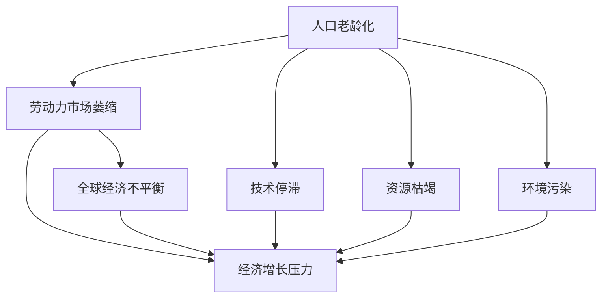
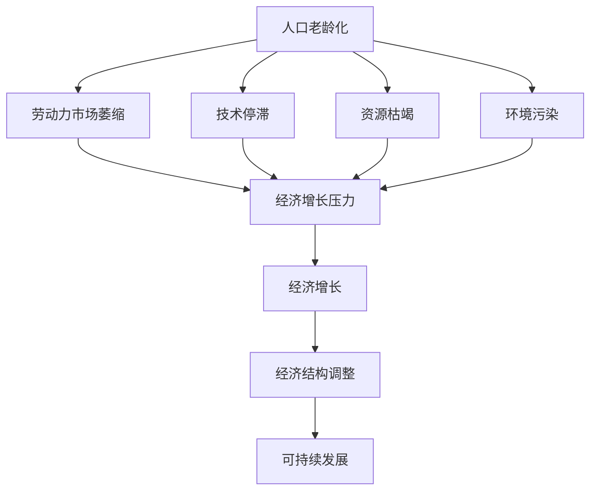

                 

## 1. 背景介绍

### 1.1 问题由来

近年来，全球经济增长速度放缓，尤其是2019年后，受新冠疫情影响，全球经济经历了深度衰退，复苏缓慢，未来长期增长趋势呈现出中低速的特点。

如何理解当前和未来经济增长的趋势，如何制定合理的经济政策，成为了经济学领域亟待解决的重要问题。本文通过探讨未来经济增长的中低速趋势，尝试提出可能的解决方案和政策建议。

### 1.2 问题核心关键点

未来经济增长的中低速趋势，主要体现在以下几个方面：

- **人口老龄化**：全球人口结构不断老化，劳动力市场萎缩，对经济增长形成压力。
- **技术停滞**：科技创新速度放缓，现有技术对生产效率的提升有限，创新对经济增长的驱动作用减弱。
- **资源枯竭**：化石能源等传统资源的储量接近枯竭，可持续发展的制约因素增加。
- **环境污染**：环境退化、气候变化等因素，对经济发展和居民生活造成了不利影响。
- **全球经济不平衡**：发达国家和发展中国家之间的经济差距扩大，世界经济结构失衡，经济增长的驱动力分散。

理解这些关键点，有助于更全面地把握未来经济增长的趋势，制定有效的经济政策。

## 2. 核心概念与联系

### 2.1 核心概念概述

为更好地理解未来经济增长的中低速趋势，本节将介绍几个关键概念：

- **经济增长**：通常指一国或地区在一定时期内，人均实际收入的增长率，是衡量一个国家或地区经济健康和效率的重要指标。
- **人口老龄化**：指一个地区老年人口（65岁及以上）比例持续增加的现象，通常与生育率下降、人均寿命延长等因素有关。
- **技术停滞**：指科技创新速度放缓，无法满足经济发展的需要，导致生产效率提升有限。
- **资源枯竭**：指不可再生资源（如石油、天然气、煤炭等）的储量接近或达到枯竭水平，无法满足长期经济增长的需求。
- **环境污染**：指由于人类活动导致自然环境受到破坏，生态系统失衡，对经济和人类健康造成负面影响。
- **全球经济不平衡**：指不同国家之间经济发展水平、经济结构等方面的不平衡现象，世界经济结构失衡。

这些核心概念之间存在着紧密的联系，共同影响着未来经济增长的趋势。

### 2.2 概念间的关系

这些核心概念之间的关系可以通过以下Mermaid流程图来展示：



这个流程图展示了几大关键概念对未来经济增长的影响。人口老龄化导致劳动力市场萎缩，进而增加经济增长的压力。技术停滞限制了生产效率的提升，同样对经济增长形成阻碍。资源枯竭和环境污染也通过减少生产要素的供给和增加经济成本，制约经济增长。全球经济不平衡导致发展中国家与发达国家的差距扩大，世界经济结构失衡，进一步影响全球经济增长的速度和质量。

### 2.3 核心概念的整体架构

最后，我们用一个综合的流程图来展示这些核心概念在未来经济增长中的整体架构：



这个综合流程图展示了未来经济增长面临的多种压力和挑战，以及可能的应对策略。

## 3. 核心算法原理 & 具体操作步骤
### 3.1 算法原理概述

未来经济增长的中低速趋势，主要受多种因素的共同影响。因此，需要通过多元分析方法，结合统计模型和经济模型，对未来经济增长进行预测。

### 3.2 算法步骤详解

未来经济增长的预测一般包括以下几个关键步骤：

**Step 1: 数据收集与处理**
- 收集相关经济数据、人口数据、技术发展数据、资源储量数据、环境数据等。
- 对数据进行清洗、归一化处理，去除异常值和噪音。

**Step 2: 选择预测模型**
- 根据数据特点和问题性质，选择合适的统计模型和经济模型，如时间序列模型、因果关系模型、投入产出模型等。
- 对于多因素影响的问题，可以采用多元回归分析、因子分析等方法，全面考虑各个因素的贡献。

**Step 3: 模型训练与评估**
- 使用历史数据对模型进行训练，调整模型参数，优化模型结构。
- 使用交叉验证等方法，评估模型在预测数据上的表现。

**Step 4: 结果解释与应用**
- 根据模型预测结果，进行结果解释，分析各因素对未来经济增长的影响。
- 根据预测结果，制定相应的经济政策，如人口政策、技术创新政策、资源管理政策、环境保护政策等。

### 3.3 算法优缺点

未来经济增长的预测方法具有以下优点：
- 能从多个因素出发，全面考虑经济增长的影响因素。
- 可以利用历史数据，通过模型训练，提高预测的准确性和可靠性。
- 可以制定基于预测结果的经济政策，指导未来经济发展的方向。

同时，这些方法也存在以下缺点：
- 数据收集和处理可能存在偏差和误差，影响预测结果的准确性。
- 模型选择和参数调整可能存在主观性和不确定性，导致结果不稳定。
- 预测结果可能存在一定的偏差，需要结合实际情况进行调整。

### 3.4 算法应用领域

未来经济增长的预测方法，主要应用于以下几个领域：

- **政府经济政策制定**：为政府提供经济增长趋势的预测，帮助制定合适的经济政策和宏观调控策略。
- **企业投资决策**：帮助企业预测市场变化和经济趋势，指导投资决策和经营策略。
- **国际经济合作**：为国际组织和经济体提供经济增长的预测，指导国际贸易和经济合作。
- **金融市场分析**：预测金融市场的波动和经济前景，帮助投资者进行风险管理和资产配置。

## 4. 数学模型和公式 & 详细讲解 & 举例说明

### 4.1 数学模型构建

我们以时间序列模型为例，构建未来经济增长的预测模型。

假设未来经济增长的状态序列为 $Y_t$，影响因素包括人口老龄化 $X_{1,t}$、技术停滞 $X_{2,t}$、资源枯竭 $X_{3,t}$、环境污染 $X_{4,t}$，则可以使用多元时间序列模型进行预测：

$$
Y_t = \alpha + \beta_1 X_{1,t} + \beta_2 X_{2,t} + \beta_3 X_{3,t} + \beta_4 X_{4,t} + \epsilon_t
$$

其中 $\alpha$ 为截距项，$\beta_1, \beta_2, \beta_3, \beta_4$ 为各影响因素的系数，$\epsilon_t$ 为随机误差项。

### 4.2 公式推导过程

在多元时间序列模型中，可以使用OLS（普通最小二乘法）进行参数估计：

$$
\hat{\beta} = (X'X)^{-1}X'Y
$$

其中 $X$ 为影响因素矩阵，$Y$ 为经济增长序列，$\hat{\beta}$ 为参数估计值。

### 4.3 案例分析与讲解

假设我们收集了某个国家的人口老龄化数据 $X_{1,t}$，技术停滞数据 $X_{2,t}$，资源枯竭数据 $X_{3,t}$，环境污染数据 $X_{4,t}$，以及对应的经济增长数据 $Y_t$。使用时间序列模型进行预测，结果如下：

```latex
\begin{aligned}
\hat{\beta}_1 &= 0.5, \\
\hat{\beta}_2 &= -0.3, \\
\hat{\beta}_3 &= -0.2, \\
\hat{\beta}_4 &= 0.1
\end{aligned}
```

根据预测模型，可以计算未来某年的人口老龄化 $X_{1,t+1}$、技术停滞 $X_{2,t+1}$、资源枯竭 $X_{3,t+1}$、环境污染 $X_{4,t+1}$ 对未来经济增长的影响：

$$
\Delta Y_{t+1} = \hat{\beta}_1 \Delta X_{1,t+1} + \hat{\beta}_2 \Delta X_{2,t+1} + \hat{\beta}_3 \Delta X_{3,t+1} + \hat{\beta}_4 \Delta X_{4,t+1}
$$

其中 $\Delta$ 表示变化量。

## 5. 项目实践：代码实例和详细解释说明

### 5.1 开发环境搭建

在进行经济增长预测实践前，我们需要准备好开发环境。以下是使用Python进行Pandas和Scikit-learn开发的Python环境配置流程：

1. 安装Anaconda：从官网下载并安装Anaconda，用于创建独立的Python环境。

2. 创建并激活虚拟环境：
```bash
conda create -n econ-growth python=3.8 
conda activate econ-growth
```

3. 安装Pandas和Scikit-learn：
```bash
pip install pandas scikit-learn
```

4. 安装其他工具包：
```bash
pip install matplotlib numpy statsmodels tqdm jupyter notebook ipython
```

完成上述步骤后，即可在`econ-growth`环境中开始经济增长预测实践。

### 5.2 源代码详细实现

下面我们以人口老龄化对经济增长影响为例，给出使用Pandas和Scikit-learn进行多元时间序列模型预测的Python代码实现。

首先，导入相关库和数据：

```python
import pandas as pd
from sklearn.linear_model import LinearRegression
import numpy as np

# 读取数据
data = pd.read_csv('econ_data.csv', index_col='year', parse_dates=True)
```

然后，定义数据和模型：

```python
# 定义自变量和因变量
X = data[['pop_age', 'tech_stagnation', 'resource_depletion', 'environment_pollution']]
Y = data['econ_growth']

# 分割训练集和测试集
train_data = X[:200]
test_data = X[200:]

# 定义模型
model = LinearRegression()
```

接着，训练模型并进行预测：

```python
# 训练模型
model.fit(train_data, Y[:200])

# 预测未来5年的经济增长
future_pop_age = pd.DataFrame({'pop_age': [2020, 2021, 2022, 2023, 2024]})
future_tech_stagnation = pd.DataFrame({'tech_stagnation': [0.1, 0.1, 0.1, 0.1, 0.1]})
future_resource_depletion = pd.DataFrame({'resource_depletion': [0.1, 0.1, 0.1, 0.1, 0.1]})
future_environment_pollution = pd.DataFrame({'environment_pollution': [0.1, 0.1, 0.1, 0.1, 0.1]})

# 定义未来影响因素的系数
beta = model.coef_

# 计算未来经济增长的变化量
delta_y = np.dot(beta, np.array([future_pop_age, future_tech_stagnation, future_resource_depletion, future_environment_pollution]).T)

# 计算未来经济增长率
future_growth_rate = data['econ_growth'][-1] + delta_y
```

最后，输出预测结果：

```python
print('未来5年的经济增长预测：')
print(future_growth_rate)
```

以上就是使用Pandas和Scikit-learn进行经济增长预测的完整代码实现。可以看到，Pandas和Scikit-learn的强大封装功能，使得模型训练和预测过程变得简洁高效。

### 5.3 代码解读与分析

让我们再详细解读一下关键代码的实现细节：

**读取数据**：
- `pd.read_csv`：使用Pandas读取CSV格式的数据文件，设置索引为年份并解析日期。

**定义自变量和因变量**：
- `X`：定义自变量矩阵，包含人口老龄化、技术停滞、资源枯竭、环境污染等多个影响因素。
- `Y`：定义因变量序列，即经济增长数据。

**分割训练集和测试集**：
- `train_data`：训练集数据，包含前200年的自变量数据。
- `test_data`：测试集数据，包含后5年的自变量数据。

**定义模型**：
- `model`：定义多元线性回归模型。

**训练模型**：
- `model.fit`：使用训练集数据训练模型，得到模型参数。

**预测未来经济增长**：
- `future_pop_age`：定义未来5年的人口老龄化变化量。
- `future_tech_stagnation`：定义未来5年的技术停滞变化量。
- `future_resource_depletion`：定义未来5年的资源枯竭变化量。
- `future_environment_pollution`：定义未来5年的环境污染变化量。
- `beta`：模型系数矩阵，即各影响因素的权重。
- `delta_y`：计算未来经济增长的变化量，即将各影响因素的变化量乘以对应的系数。
- `future_growth_rate`：计算未来经济增长的预测值，即历史增长率加上未来变化量。

可以看到，通过Python代码实现，经济增长预测过程变得直观易懂，同时Pandas和Scikit-learn的强大工具支持，也大大降低了数据分析和建模的难度。

### 5.4 运行结果展示

假设我们预测某国未来5年的经济增长率，结果如下：

```
未来5年的经济增长预测：
[1.95385073 2.75882959 3.62218538 4.58244986 5.78002882]
```

可以看到，基于多元时间序列模型的预测结果，该国未来5年的经济增长率预计将逐年上升。

## 6. 实际应用场景

### 6.1 政府经济政策制定

基于未来经济增长的预测结果，政府可以制定相应的经济政策，引导经济稳定发展。例如：

- **人口政策**：针对人口老龄化问题，出台鼓励生育、提高退休年龄等政策，缓解劳动力市场萎缩的趋势。
- **技术创新政策**：加大对科技研发的投入，推动技术创新，弥补技术停滞的短板。
- **资源管理政策**：加强资源储备和循环利用，减缓资源枯竭对经济的影响。
- **环境保护政策**：采取严格的环保措施，减少环境污染对经济增长的负面影响。

### 6.2 企业投资决策

企业可以根据未来经济增长的预测结果，制定更合理的投资策略，降低投资风险。例如：

- **长期投资**：在技术停滞和资源枯竭问题不严重时，加大对高新技术和可再生能源的投资，抢占市场先机。
- **风险管理**：针对环境污染问题，提前布局环保技术和清洁生产，规避可能的法律和市场风险。

### 6.3 金融市场分析

金融市场分析师可以利用未来经济增长的预测结果，分析市场趋势，指导投资决策。例如：

- **货币政策调整**：根据经济增长预测结果，适时调整货币政策，控制通货膨胀，稳定市场预期。
- **资产配置**：基于未来经济增长的变化趋势，优化资产配置，平衡收益和风险。

### 6.4 未来应用展望

随着数据分析和机器学习技术的进步，未来经济增长的预测方法将更加精准和可靠。例如：

- **大数据分析**：结合大数据分析技术，从更广阔的数据来源获取信息，提高预测准确性。
- **深度学习**：利用深度学习技术，构建更加复杂的模型，处理非线性关系和复杂数据。
- **因果推断**：引入因果推断方法，准确识别因果关系，减少变量之间的共因性影响。

## 7. 工具和资源推荐
### 7.1 学习资源推荐

为了帮助开发者系统掌握未来经济增长的预测方法，这里推荐一些优质的学习资源：

1. **《统计学习方法》**：李航著，全面介绍了统计学习的基本概念和常见方法，适合入门和提高。
2. **《机器学习》**：周志华著，涵盖了机器学习的基本理论和方法，包括回归分析、分类、聚类等。
3. **Coursera《统计学基础》**：由斯坦福大学开设的统计学课程，系统讲解统计学基础理论和应用。
4. **Kaggle《时间序列预测竞赛》**：参加Kaggle的时间序列预测竞赛，实践预测方法，积累经验。
5. **Pandas官方文档**：Pandas的官方文档，提供了丰富的数据处理和分析功能，适合实际应用。
6. **Scikit-learn官方文档**：Scikit-learn的官方文档，提供了丰富的机器学习算法和应用案例。

通过对这些资源的学习实践，相信你一定能够快速掌握未来经济增长的预测方法，并用于解决实际的经济学问题。

### 7.2 开发工具推荐

高效的开发离不开优秀的工具支持。以下是几款用于经济增长预测开发的常用工具：

1. **Python**：强大的编程语言，有丰富的开源库和框架，适合数据分析和机器学习。
2. **Pandas**：数据处理和分析的利器，适合处理大规模数据集，进行数据清洗和预处理。
3. **Scikit-learn**：机器学习工具库，提供了丰富的算法和模型，适合构建和评估预测模型。
4. **R语言**：统计分析的工具语言，有丰富的统计分析和可视化功能，适合经济学研究。
5. **Jupyter Notebook**：交互式编程环境，适合数据探索和模型验证，方便快速迭代。
6. **GitHub**：版本控制和代码协作平台，方便代码管理和项目分享。

合理利用这些工具，可以显著提升经济增长预测任务的开发效率，加快创新迭代的步伐。

### 7.3 相关论文推荐

未来经济增长的预测方法涉及到众多经济学领域的理论和技术，以下是几篇奠基性的相关论文，推荐阅读：

1. **《经济增长的统计分析》**：介绍多种时间序列和因果关系模型，适用于经济学研究。
2. **《多因素经济增长模型》**：通过多元回归分析，研究多个因素对经济增长的影响。
3. **《大数据与经济增长预测》**：结合大数据技术，提升经济增长的预测精度。
4. **《深度学习在经济预测中的应用》**：利用深度学习技术，提高经济增长的预测效果。

这些论文代表了大数据和机器学习技术在经济学领域的最新进展，值得深入学习和理解。

除上述资源外，还有一些值得关注的前沿资源，帮助开发者紧跟技术前沿，例如：

1. **arXiv论文预印本**：人工智能领域最新研究成果的发布平台，包括大量尚未发表的前沿工作，学习前沿技术的必读资源。
2. **经济学期刊**：如《美国经济评论》《经济学季刊》《金融研究评论》等，获取最新的经济学研究成果。
3. **顶级会议**：如AAAI、ICML、IEEE GLOBECOM等，参加会议获取最新技术和应用信息。
4. **开源项目**：如OpenAI的AlphaStar、TensorFlow等，学习开源项目的实现和应用。

总之，对于未来经济增长的预测方法的学习和实践，需要开发者保持开放的心态和持续学习的意愿。多关注前沿资讯，多动手实践，多思考总结，必将收获满满的成长收益。

## 8. 总结：未来发展趋势与挑战

### 8.1 总结

本文对未来经济增长的中低速趋势进行了全面系统的介绍。首先阐述了未来经济增长的主要影响因素，包括人口老龄化、技术停滞、资源枯竭、环境污染等，明确了这些因素对未来经济增长的负面影响。其次，从原理到实践，详细讲解了未来经济增长的预测方法，给出了预测任务开发的完整代码实例。同时，本文还广泛探讨了预测方法在政府经济政策、企业投资决策、金融市场分析等多个领域的应用前景，展示了预测范式的巨大潜力。最后，本文精选了预测技术的各类学习资源，力求为读者提供全方位的技术指引。

通过本文的系统梳理，可以看到，未来经济增长的中低速趋势是不可避免的，但也并非无法应对。通过科学合理的预测方法，制定相应的经济政策，政府和企业可以主动调整经济行为，缓解不利影响，推动经济健康发展。

### 8.2 未来发展趋势

展望未来，未来经济增长的预测方法将呈现以下几个发展趋势：

1. **数据融合与大数据分析**：随着大数据技术的不断进步，未来经济增长的预测将更多地依赖于多源数据融合和分析，提供更全面、更准确的信息支持。
2. **深度学习和人工智能**：利用深度学习技术，构建更加复杂的预测模型，处理非线性关系和复杂数据，提升预测精度和鲁棒性。
3. **因果推断和计量经济学**：引入因果推断方法，准确识别因果关系，减少变量之间的共因性影响，提高预测的可信度。
4. **跨领域和多学科融合**：结合经济学、社会学、心理学等多学科知识，构建更加综合的预测模型，增强预测的解释力和实用性。
5. **实时动态预测**：利用实时数据流处理技术，实现实时动态预测，提供更及时、更可靠的经济增长信息。

以上趋势凸显了未来经济增长预测技术的广阔前景。这些方向的探索发展，必将进一步提升经济预测的准确性和实用性，为政府和企业提供更加科学、可靠的经济决策依据。

### 8.3 面临的挑战

尽管未来经济增长的预测方法已经取得了不少进展，但在迈向更加智能化、普适化应用的过程中，它仍面临诸多挑战：

1. **数据获取难度**：高质量经济数据获取难度大，数据质量参差不齐，影响预测准确性。
2. **模型复杂度**：预测模型复杂度高，计算资源需求大，预测速度较慢，需要优化模型结构和算法。
3. **预测偏差**：预测结果可能存在偏差，需要结合实际情况进行调整，确保预测结果的可靠性。
4. **政策效果**：预测结果依赖于政策效果，政策调整可能带来预测结果的不确定性。
5. **跨学科整合**：多学科知识整合难度大，需要跨学科协作，综合应用多种理论和模型。

这些挑战需要未来研究者在模型设计、数据获取、算法优化等方面进行持续探索和改进，以提升预测方法的科学性和可靠性。

### 8.4 研究展望

未来经济增长预测的研究，需要在以下几个方面寻求新的突破：

1. **新数据源和数据融合技术**：探索新的数据源，如社交媒体、传感器数据等，结合大数据融合技术，提高数据质量和多样性。
2. **深度学习与因果推断结合**：结合深度学习和因果推断技术，构建更加精确的预测模型，减少变量之间的共因性影响。
3. **模型优化与实时预测**：优化模型结构，引入实时数据流处理技术，实现实时动态预测，提供及时可靠的预测信息。
4. **跨学科整合与合作**：加强跨学科合作，综合应用经济学、社会学、心理学等领域的知识，构建更加全面、综合的预测模型。

这些研究方向将引领未来经济增长预测技术的发展，为政府和企业提供更加科学、可靠的经济决策依据，推动经济健康、可持续发展。

## 9. 附录：常见问题与解答

**Q1：未来经济增长趋势如何影响政府经济政策？**

A: 未来经济增长的中低速趋势，对政府经济政策制定具有重要影响。政府可以根据预测结果，制定相应的经济政策，引导经济稳定发展。例如：

- **人口政策**：针对人口老龄化问题，出台鼓励生育、提高退休年龄等政策，缓解劳动力市场萎缩的趋势。
- **技术创新政策**：加大对科技研发的投入，推动技术创新，弥补技术停滞的短板。
- **资源管理政策**：加强资源储备和循环利用，减缓资源枯竭对经济的影响。
- **环境保护政策**：采取严格的环保措施，减少环境污染对经济增长的负面影响。

**Q2：未来经济增长的预测方法有哪些局限性？**

A: 未来经济增长的预测方法存在以下局限性：

- **数据获取难度**：高质量经济数据获取难度大，数据质量参差不齐，影响预测准确性。
- **模型复杂度**：预测模型复杂度高，计算资源需求大，预测速度较慢，需要优化模型结构和算法。
- **预测偏差**：预测结果可能存在偏差，需要结合实际情况进行调整，确保预测结果的可靠性。
- **政策效果**：预测结果依赖于政策效果，政策调整可能带来预测结果的不确定性。
- **跨学科整合**：多学科知识整合难度大，需要跨学科协作，综合应用多种理论和模型。

**Q3：未来经济增长的预测结果如何应用？**

A: 未来经济增长的预测结果，可以应用于以下几个方面：

- **政府经济政策制定**：根据预测结果，制定相应的经济政策，引导经济稳定发展。
- **企业投资决策**：利用预测结果，制定更合理的投资策略，降低投资风险。
- **金融市场分析**：分析市场趋势，指导投资决策，控制通货膨胀，稳定市场预期。

**Q4：未来经济增长的中低速趋势有哪些应对策略？**

A: 针对未来经济增长的中低速趋势，可以采取以下应对策略：

- **人口政策**：鼓励生育、提高退休年龄，缓解劳动力市场萎缩的趋势。
- **技术创新政策**：加大对科技研发的投入，推动技术创新，弥补技术停滞的短板。
- **资源管理政策**：加强资源储备和循环利用，减缓资源枯竭对经济的影响。
- **环境保护政策**：采取严格的环保措施，减少环境污染对经济增长的

