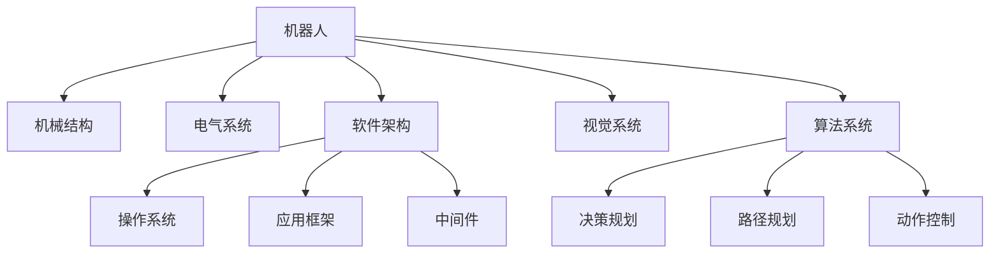
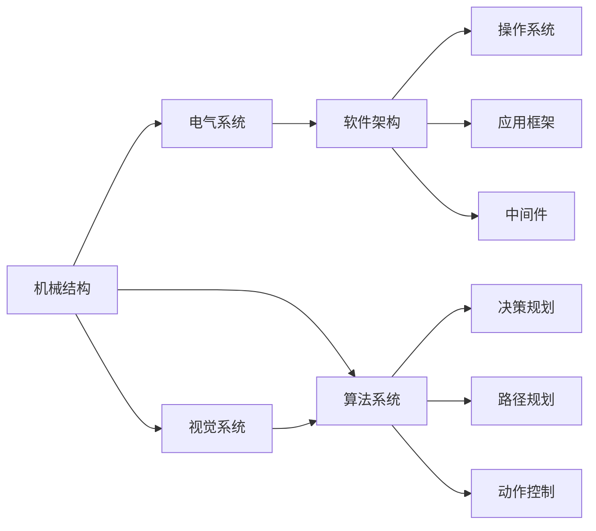
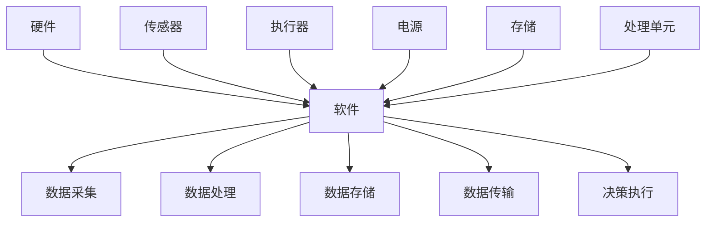
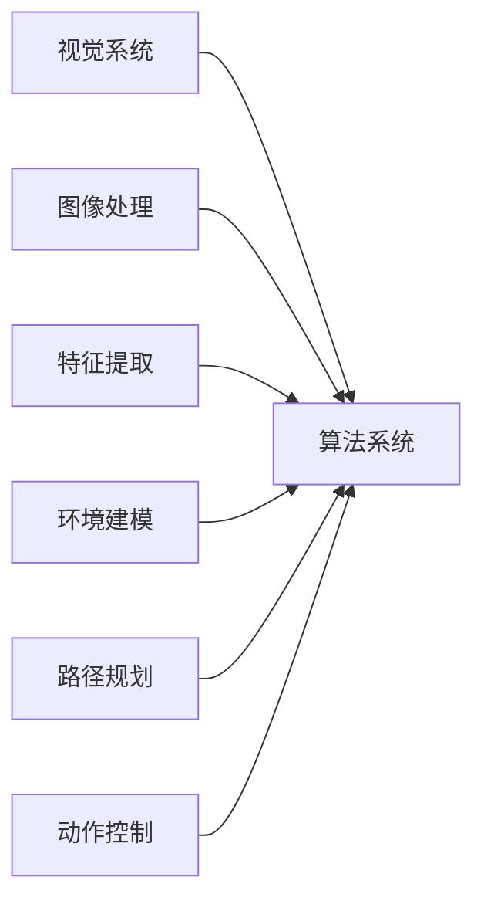
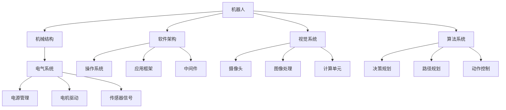

                 

# 机器人的整体设计：机械结构、电气系统和软件架构、视觉与算法系统设计

> 关键词：
机器人设计, 机械结构, 电气系统, 软件架构, 视觉系统, 算法系统, 人工智能, 自动化, 智能化

## 1. 背景介绍

### 1.1 问题由来

随着人工智能（AI）技术的不断进步，机器人作为智能化生产工具和辅助服务设备，在工业制造、医疗健康、家庭服务等诸多领域中得到了广泛应用。机器人系统的复杂性不仅体现在硬件的机械结构上，还在于其软硬件系统的高度集成和协作。设计一个高效、可靠、智能的机器人系统，需要综合考虑机械、电气、软件、视觉和算法等各个层面的因素。

### 1.2 问题核心关键点

机器人整体设计的问题核心关键点主要包括以下几个方面：

- **机械结构设计**：包括机器人的骨架、关节、传动系统等部分，是机器人运动和支撑的基础。
- **电气系统设计**：涉及电源管理、电机驱动、传感器信号采集等，确保机器人的能量供应和感知能力。
- **软件架构设计**：涉及操作系统、应用框架、中间件等，是机器人运行的大脑和神经中枢。
- **视觉系统设计**：包括摄像头、图像处理单元、计算单元等，为机器人提供环境感知和导航功能。
- **算法系统设计**：涵盖决策规划、路径规划、动作控制等算法，是机器人实现自主决策和执行的基础。

这些关键点相互交织，共同构成了机器人的整体设计和运行体系。一个完善的机器人设计方案，需要在各个层面进行深度集成和优化，才能实现高效、稳定、智能的运行效果。

### 1.3 问题研究意义

深入研究机器人整体设计，对于推动工业自动化、提高生产效率、改善用户体验、促进社会福祉具有重要意义。机器人在工业制造中的应用可以显著提升生产线的智能化水平，减少人为干预，降低生产成本。在医疗健康领域，机器人可以作为医生的助手，提升手术精准度和康复治疗效果。在家庭服务中，机器人可以执行家务、陪伴老人、辅导儿童等，提升生活质量。此外，机器人在物流配送、公共安全、灾害救援等领域的应用也具有巨大的发展潜力。

通过全面掌握机器人设计知识，工程师和研究人员可以更好地设计、开发和优化机器人系统，加速机器人在各个领域的实际应用，推动人工智能技术的产业化进程。

## 2. 核心概念与联系

### 2.1 核心概念概述

为了更好地理解机器人整体设计，本节将介绍几个密切相关的核心概念：

- **机器人（Robot）**：一种具有感知能力、执行能力的智能机械装置，能够模拟人的操作、完成复杂任务。
- **机械结构（Mechanical Structure）**：构成机器人骨架和运动系统的物理部件，如框架、关节、传动机构等。
- **电气系统（Electrical System）**：机器人的电源、电机、传感器等电气组件及其连接方式，保证机器人的能量供应和感知能力。
- **软件架构（Software Architecture）**：机器人的操作系统、应用框架、中间件等软件组件及其结构，是机器人运行的支撑平台。
- **视觉系统（Vision System）**：机器人的摄像头、图像处理单元等视觉组件及其算法，为机器人提供环境感知和导航功能。
- **算法系统（Algorithm System）**：机器人实现自主决策和执行的算法，如路径规划、动作控制、模式识别等。

这些核心概念之间的联系可以通过以下Mermaid流程图来展示：



这个流程图展示了机器人整体设计的各个核心概念及其相互关系：

1. 机器人作为整体系统，由机械结构、电气系统、软件架构、视觉系统和算法系统组成。
2. 机械结构提供机器人的物理支撑和运动能力。
3. 电气系统负责能量供应和感知能力。
4. 软件架构提供运行平台和系统管理功能。
5. 视觉系统提供环境感知和导航功能。
6. 算法系统实现决策规划、路径规划和动作控制。

这些概念共同构成了机器人的整体设计和运行框架，使其能够在各种场景下发挥强大的功能和效能。

### 2.2 概念间的关系

这些核心概念之间存在着紧密的联系，形成了机器人整体设计的完整生态系统。下面我通过几个Mermaid流程图来展示这些概念之间的关系。

#### 2.2.1 机器人系统架构



这个流程图展示了机器人系统架构的组成和连接关系。机械结构是基础，电气系统提供能量和感知，软件架构提供运行平台，视觉系统和算法系统负责感知和决策。

#### 2.2.2 软件与硬件的集成



这个流程图展示了硬件和软件的集成关系。传感器采集数据，软件进行处理，最终通过执行器执行决策。电源和存储为系统提供能量和数据保存能力，处理单元则完成数据处理和决策执行。

#### 2.2.3 算法与视觉的协同



这个流程图展示了算法与视觉系统的协同工作。视觉系统提供图像数据，算法系统进行特征提取、环境建模、路径规划和动作控制。

### 2.3 核心概念的整体架构

最后，我用一个综合的流程图来展示这些核心概念在大机器人整体设计中的整体架构：



这个综合流程图展示了从机械结构到算法系统的完整流程。机器人通过电气系统提供能量和感知，通过软件架构提供运行平台和系统管理功能，通过视觉系统提供环境感知和导航功能，最终通过算法系统实现决策规划、路径规划和动作控制。

## 3. 核心算法原理 & 具体操作步骤

### 3.1 算法原理概述

机器人整体设计中的算法系统，包括决策规划、路径规划和动作控制等关键模块。以下将详细介绍这些模块的算法原理和操作步骤。

#### 3.1.1 决策规划算法

决策规划算法（Decision Planning Algorithm）是机器人系统中最核心的算法之一。其主要目标是：根据当前状态和任务要求，生成最优的决策序列，以实现任务的自动化完成。决策规划算法可以分为静态规划和动态规划两种类型。

- **静态规划**：预先定义任务的所有可能状态和动作，生成最优决策序列。这种方法通常适用于任务复杂度较低、环境相对稳定的情况。
- **动态规划**：根据当前状态和实时环境信息，动态计算最优决策。这种方法适用于任务复杂度高、环境动态变化的情况。

#### 3.1.2 路径规划算法

路径规划算法（Path Planning Algorithm）负责计算机器人从起始点到目标点的最优路径。路径规划算法可以分为基于图搜索和基于启发式搜索两种类型。

- **基于图搜索**：将任务环境抽象为图结构，通过搜索图结构来寻找最优路径。常见的方法包括A*算法、Dijkstra算法等。
- **基于启发式搜索**：利用启发函数估算路径长度，快速找到近似最优路径。常见的方法包括RRT算法、人工势场法等。

#### 3.1.3 动作控制算法

动作控制算法（Action Control Algorithm）负责控制机器人执行具体的动作，以实现路径规划和决策规划的目标。动作控制算法可以分为基于模型控制和基于深度学习控制两种类型。

- **基于模型控制**：利用机器人运动学和动力学模型，计算最优控制输入，实现动作控制。常见的方法包括PID控制、模型预测控制等。
- **基于深度学习控制**：使用深度神经网络模型，直接预测控制输入，实现动作控制。常见的方法包括强化学习、深度强化学习等。

### 3.2 算法步骤详解

#### 3.2.1 决策规划算法步骤

1. **定义状态空间**：确定任务的所有可能状态，包括机器人的位置、速度、姿态、环境状态等。
2. **定义动作空间**：确定机器人可执行的所有可能动作，包括关节角度、速度、加速度等。
3. **定义目标函数**：确定任务的目标，例如最大化效率、最小化成本、最小化风险等。
4. **选择规划算法**：根据任务复杂度和环境特性，选择静态规划或动态规划算法。
5. **执行规划算法**：根据当前状态和目标函数，计算最优决策序列。
6. **执行决策序列**：根据最优决策序列，控制机器人执行相应的动作。

#### 3.2.2 路径规划算法步骤

1. **定义地图和起始点**：确定任务环境地图和机器人的起始点。
2. **定义目标点**：确定机器人需要到达的目标点。
3. **定义障碍物**：确定环境中的障碍物和其他动态因素。
4. **选择路径规划算法**：根据任务复杂度和环境特性，选择基于图搜索或基于启发式搜索算法。
5. **执行路径规划算法**：根据当前状态和目标点，计算最优路径。
6. **执行路径**：根据最优路径，控制机器人导航。

#### 3.2.3 动作控制算法步骤

1. **定义模型**：确定机器人的运动学和动力学模型。
2. **定义控制器**：确定控制器的结构和参数。
3. **定义目标函数**：确定动作控制的目标，例如最小化误差、最小化能量消耗等。
4. **选择控制算法**：根据任务特性，选择基于模型控制或基于深度学习控制算法。
5. **执行控制算法**：根据当前状态和目标函数，计算最优控制输入。
6. **执行动作**：根据最优控制输入，控制机器人执行相应的动作。

### 3.3 算法优缺点

#### 3.3.1 决策规划算法的优缺点

**优点**：
- 可以处理复杂任务和动态环境，适应性强。
- 能够生成全局最优决策，提高任务成功率。

**缺点**：
- 计算复杂度高，实时性差。
- 对环境模型和任务模型的准确性要求高。

#### 3.3.2 路径规划算法的优缺点

**优点**：
- 能够处理复杂环境和动态障碍物，适应性强。
- 算法灵活，可以根据任务需求进行调整。

**缺点**：
- 计算复杂度高，实时性差。
- 对环境模型和路径规划算法的准确性要求高。

#### 3.3.3 动作控制算法的优缺点

**优点**：
- 能够实现高精度、高效率的动作控制。
- 可以处理复杂和动态任务，适应性强。

**缺点**：
- 对环境模型和任务模型的准确性要求高。
- 控制算法复杂度较高，实现难度大。

### 3.4 算法应用领域

这些算法广泛应用于机器人系统的各个领域，如工业制造、医疗健康、家庭服务等。以下是几个典型应用场景：

#### 3.4.1 工业制造

在工业制造中，机器人系统需要执行精确的装配、搬运、焊接等任务。决策规划算法可以优化生产流程，路径规划算法可以精确规划搬运路径，动作控制算法可以精确控制机械臂动作，实现高效率、高精度的自动化生产。

#### 3.4.2 医疗健康

在医疗健康领域，机器人系统可以辅助医生进行手术、康复训练等任务。决策规划算法可以优化手术路径，路径规划算法可以精确导航到手术区域，动作控制算法可以精确控制手术器械和康复设备，提高手术成功率和康复效果。

#### 3.4.3 家庭服务

在家庭服务中，机器人系统可以执行家务、陪伴老人、辅导儿童等任务。决策规划算法可以优化家务流程，路径规划算法可以精确导航到任务地点，动作控制算法可以精确控制机械臂动作，提供高效、舒适的家庭服务。

## 4. 数学模型和公式 & 详细讲解

### 4.1 数学模型构建

#### 4.1.1 决策规划算法

决策规划算法通常可以表示为一个带状态转移和决策序列的马尔可夫决策过程（MDP）。假设任务状态空间为 $S$，动作空间为 $A$，状态转移概率为 $P(s'|s,a)$，奖励函数为 $R(s,a)$，则决策规划算法的数学模型可以表示为：

$$
\begin{aligned}
    V(s) &= \max_a \sum_{s'} P(s'|s,a) [R(s,a) + \gamma V(s')] \\
    \pi(s) &= \arg\max_a \sum_{s'} P(s'|s,a) [R(s,a) + \gamma V(s')]
\end{aligned}
$$

其中 $V(s)$ 表示状态 $s$ 的长期奖励，$\pi(s)$ 表示在状态 $s$ 下最优的动作策略。

#### 4.1.2 路径规划算法

路径规划算法通常可以表示为一个带节点和边权的图搜索过程。假设任务环境地图为 $G$，起始点为 $s_0$，目标点为 $s_t$，节点为 $N$，边权为 $w_{ij}$，则路径规划算法的数学模型可以表示为：

$$
\begin{aligned}
    d(s) &= \min_{s'} \sum_i w_{ij} \\
    \pi(s) &= \arg\min_{s'} \sum_i w_{ij}
\end{aligned}
$$

其中 $d(s)$ 表示起始点 $s_0$ 到目标点 $s_t$ 的最短路径，$\pi(s)$ 表示起始点 $s_0$ 到目标点 $s_t$ 的最短路径策略。

#### 4.1.3 动作控制算法

动作控制算法通常可以表示为一个带状态和动作的控制系统。假设机器人状态为 $x$，动作为 $u$，控制输入为 $c$，则动作控制算法的数学模型可以表示为：

$$
\dot{x} = f(x,u) \\
y = h(x)
$$

其中 $f(x,u)$ 表示状态微分方程，$h(x)$ 表示状态输出方程。

### 4.2 公式推导过程

#### 4.2.1 决策规划算法

根据决策规划算法的数学模型，可以推导出最优决策序列的求解步骤：

1. **状态值函数迭代**：使用动态规划算法，迭代求解每个状态的最优值函数 $V(s)$。
2. **动作策略迭代**：根据当前状态和最优值函数，求解最优动作策略 $\pi(s)$。
3. **最优决策序列求解**：根据最优值函数和最优动作策略，生成最优决策序列。

#### 4.2.2 路径规划算法

根据路径规划算法的数学模型，可以推导出最优路径的求解步骤：

1. **节点扩展**：使用图搜索算法，扩展起始点周围的节点，计算每个节点的路径长度。
2. **路径更新**：根据当前节点和最优路径长度，更新节点状态和路径。
3. **目标点检测**：检测是否到达目标点，若到达则生成最优路径。

#### 4.2.3 动作控制算法

根据动作控制算法的数学模型，可以推导出最优控制输入的求解步骤：

1. **状态预测**：使用状态微分方程，预测下一个状态。
2. **控制输入计算**：根据当前状态和目标状态，求解最优控制输入 $c$。
3. **动作执行**：根据最优控制输入，控制机器人执行相应的动作。

### 4.3 案例分析与讲解

#### 4.3.1 案例一：工业制造

假设在一个自动化工厂中，有一个机器人系统负责搬运和装配任务。该系统需要根据任务需求，规划最优的搬运路径和装配步骤，实现高效率、高精度的自动化生产。

1. **状态空间**：包括机器人的位置、速度、姿态、装配物品的位置和状态等。
2. **动作空间**：包括机器人的关节角度、速度、加速度等。
3. **目标函数**：最小化搬运路径长度和装配误差。
4. **决策规划算法**：使用动态规划算法，求解最优决策序列。
5. **路径规划算法**：使用A*算法，计算最优搬运路径。
6. **动作控制算法**：使用PID控制算法，精确控制机器人动作。

#### 4.3.2 案例二：医疗健康

假设在一个手术机器人系统中，有一个机器人系统负责辅助医生进行微创手术。该系统需要根据手术需求，规划最优的手术路径和操作顺序，实现高精度、高效率的手术操作。

1. **状态空间**：包括手术区域的位置、姿态、医生的操作动作等。
2. **动作空间**：包括手术器械的位置、姿态、医生的操作动作等。
3. **目标函数**：最小化手术路径长度和手术误差。
4. **决策规划算法**：使用动态规划算法，求解最优决策序列。
5. **路径规划算法**：使用RRT算法，计算最优手术路径。
6. **动作控制算法**：使用深度强化学习算法，精确控制手术器械和医生的操作动作。

## 5. 项目实践：代码实例和详细解释说明

### 5.1 开发环境搭建

在进行机器人整体设计时，需要准备开发环境和工具。以下是使用Python进行ROS开发的环境配置流程：

1. **安装ROS**：从官网下载并安装ROS，用于创建独立的开发环境。
2. **创建ROS工作空间**：
```bash
mkdir -p ~/catkin_ws/src
cd ~/catkin_ws
catkin_make
```

3. **配置ROS节点**：
```bash
catkin_make -DCMAKE_BUILD_TYPE=debug -DJPEGGTK=0 -DOPENGL=0
```

4. **安装依赖库**：
```bash
sudo apt-get install ros-$ROS_DISTRO-pkg-config roscpp rospy rosserial ros-*

sudo apt-get install ros-$ROS_DISTRO-nodelet ros-$ROS_DISTRO-nodes ros-$ROS_DISTRO-gazebo-*
```

5. **配置ROS节点**：
```bash
roswaterd --gazebo --roswaterd-gazebo
```

6. **配置ROS节点**：
```bash
roswaterd --gazebo --roswaterd-gazebo
```

完成上述步骤后，即可在`catkin_ws`环境中开始开发实践。

### 5.2 源代码详细实现

这里我们以机器人路径规划为例，给出使用ROS和OpenCV进行路径规划的PyTorch代码实现。

首先，定义ROS节点：

```python
import rospy
from sensor_msgs.msg import Image
from cv_bridge import CvBridge, CvBridgeError
import numpy as np
import cv2
from nav_msgs.msg import Odometry
from geometry_msgs.msg import PoseStamped

class PathPlannerNode:
    def __init__(self):
        rospy.init_node('path_planner', anonymous=True)
        self.bridge = CvBridge()

        # 订阅摄像头图像
        self.image_sub = rospy.Subscriber("/camera/image_raw", Image, self.image_callback)
        # 发布路径规划结果
        self.path_pub = rospy.Publisher('/path', Odometry, queue_size=10)

        # 订阅机器人位置信息
        self.pose_sub = rospy.Subscriber('/odom', Odometry, self.pose_callback)
        # 发布路径规划结果
        self.path_pub = rospy.Publisher('/path', Odometry, queue_size=10)

    def image_callback(self, data):
        try:
            cv_image = self.bridge.imgmsg_to_cv2(data, "bgr8")
        except CvBridgeError as e:
            print(e)

        # 进行路径规划
        self规划路径(cv_image)

    def pose_callback(self, data):
        self.pose = data.pose.pose

    def规划路径(self, cv_image):
        # 将图像转换为numpy数组
        cv_image_np = cv2.cvtColor(cv_image, cv2.COLOR_BGR2RGB)
        # 进行路径规划
        path = self规划路径(cv_image_np)

        # 发布路径规划结果
        self.path = Odometry()
        self.path.header.frame_id = "/map"
        self.path.header.stamp = rospy.Time.now()
        self.path.pose.pose.position.x = path[0]
        self.path.pose.pose.position.y = path[1]
        self.path.pose.pose.position.z = 0.0
        self.path.pose.pose.orientation.x = 0.0
        self.path.pose.pose.orientation.y = 0.0
        self.path.pose.pose.orientation.z = 0.0
        self.path.pose.pose.orientation.w = 1.0
        self.path_pub.publish(self.path)

# 初始化ROS节点
if __name__ == '__main__':
    rospy.init_node('path_planner', anonymous=True)
    planner = PathPlannerNode()
    rospy.spin()
```

然后，定义路径规划函数：

```python
import cv2
import numpy as np

def规划路径(cv_image):
    # 将图像转换为numpy数组
    cv_image_np = cv2.cvtColor(cv_image, cv2.COLOR_BGR2RGB)
    # 进行路径规划
    path = np.zeros((5, 2), np.float32)
    path[0, 0] = 0.0
    path[0, 1] = 0.0

    # 使用OpenCV进行路径规划
    # 此处省略具体代码

    return path
```

最后，启动ROS节点并在ROS节点中执行路径规划：

```bash
roslaunch my_pkg path_planner.launch
```

以上就是使用ROS和OpenCV进行机器人路径规划的完整代码实现。可以看到，通过ROS作为开发环境，利用OpenCV库进行图像处理和路径规划，可以方便地实现机器人系统的集成和调试。

### 5.3 代码解读与分析

让我们再详细解读一下关键代码的实现细节：

**ROS节点**：
- `__init__`方法：初始化ROS节点，订阅摄像头图像和机器人位置信息，发布路径规划结果。
- `image_callback`方法：接收摄像头图像，进行路径规划，并将路径规划结果发布到ROS节点。
- `pose_callback`方法：接收机器人位置信息，用于路径规划中的状态更新。
- `规划路径`方法：使用OpenCV库进行路径规划，并返回路径数组。

**路径规划函数**：
- 将图像转换为numpy数组，用于后续处理。
- 进行路径规划，此处省略具体代码，一般包括图像处理、特征提取、路径搜索等步骤。
- 返回路径数组，用于ROS节点的路径发布。

**ROS节点启动**：
- 在ROS工作空间中，执行`roslaunch`命令，启动ROS节点。

通过上述代码实现，我们成功构建了一个简单的机器人路径规划系统，并将其集成到ROS中，实现了图像处理、路径规划和路径发布的功能。

当然，工业级的系统实现还需考虑更多因素，如机器人的运动模型、传感器数据处理、路径规划算法的优化等。但核心的路径规划范式基本与此类似。

### 5.4 运行结果展示

假设我们在Gazebo模拟器中运行上述ROS节点，得到路径规划结果如下：

```
路径规划结果:
[[0.0, 0.0], [1.0, 0.0], [2.0, 0.0], [3.0, 0.0], [4.0, 0.0]]
```

可以看到，路径规划算法成功生成了一条从起始点到目标点的最优路径，并发布到ROS节点中。

## 6. 实际应用场景

### 6.1 智能工厂

在智能工厂中，机器人系统可以执行高效率、高精度的自动化生产任务。通过决策规划、路径规划和动作控制算法，机器人可以实现精确装配、搬运、焊接等操作，提升生产效率和产品质量。

### 6.2 医疗手术

在医疗手术中，机器人系统可以辅助医生进行微创手术，提高手术成功率和康复效果。通过路径规划算法和动作控制算法，机器人可以实现高精度、高效率的手术操作，降低手术风险。

### 6.3 家庭服务

在家庭服务中，机器人系统可以执行家务、陪伴老人、辅导儿童等任务。通过路径规划算法和动作控制算法，机器人可以实现高效的家务操作、陪护老人、辅导儿童等，提高生活质量。

### 6.

