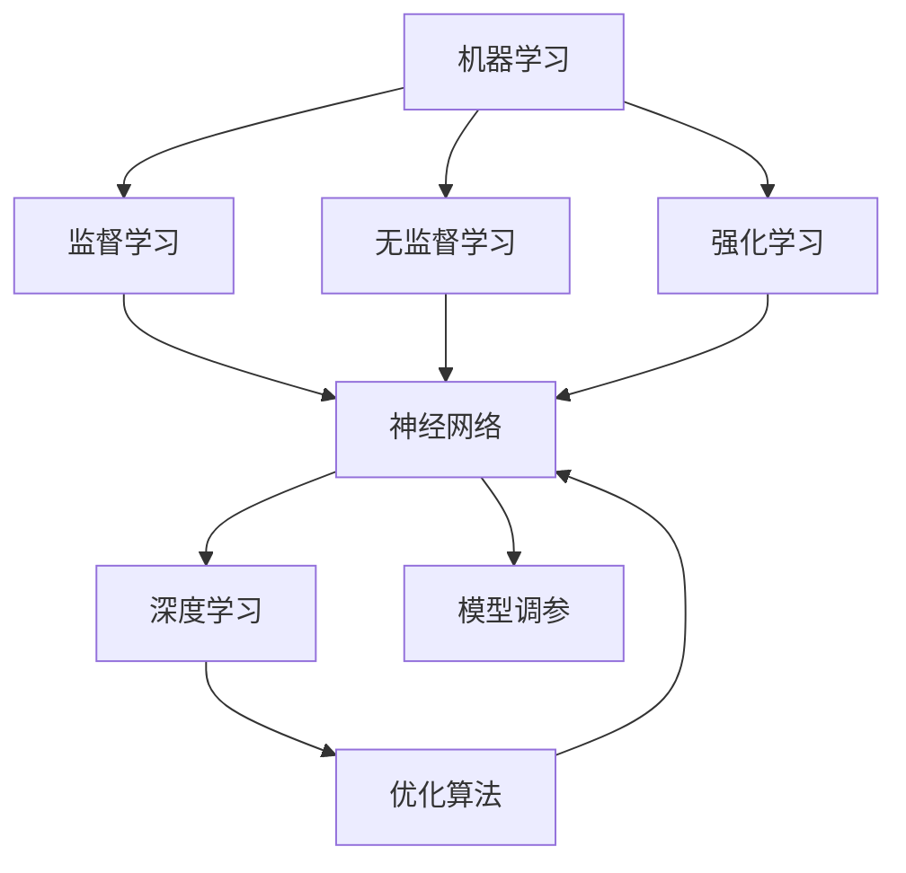

                 

# 机器学习 原理与代码实例讲解

> 关键词：机器学习, 深度学习, 神经网络, 监督学习, 无监督学习, 强化学习, 优化算法, PyTorch, TensorFlow

## 1. 背景介绍

### 1.1 问题由来
随着人工智能技术的飞速发展，机器学习已经成为解决复杂问题的强大工具。从计算机视觉、自然语言处理、语音识别到游戏AI，机器学习的应用渗透到各个领域。然而，许多初学者在学习和应用机器学习时，往往感到困惑和无从下手。为此，本文旨在通过系统讲解机器学习的核心概念、原理和实践，帮助读者更好地理解这一技术，并能够用代码实例进行实践和应用。

### 1.2 问题核心关键点
本文将聚焦于以下几个核心关键点：

1. **机器学习的定义与历史**：介绍机器学习的基本概念，并追溯其历史起源与发展。
2. **核心算法原理**：详细讲解监督学习、无监督学习和强化学习的核心算法原理与步骤。
3. **优化算法**：介绍梯度下降、随机梯度下降等优化算法的原理与实现。
4. **深度学习框架**：对比并介绍PyTorch和TensorFlow两大深度学习框架的特点与适用场景。
5. **模型训练与调参**：讲述模型训练的全流程，包括数据预处理、模型构建、优化算法应用、模型评估与调参等。

### 1.3 问题研究意义
机器学习在各个领域的应用日益广泛，能够极大地提高数据处理效率、优化决策过程和预测能力。然而，机器学习的理论基础和实践细节较为复杂，初学者难以快速上手。通过本文的系统讲解和代码实例，希望能帮助读者快速入门，掌握机器学习的基本原理和实践技巧，为进一步深入研究和应用奠定坚实基础。

## 2. 核心概念与联系

### 2.1 核心概念概述

为更好地理解机器学习的核心概念，本节将介绍几个密切相关的关键概念：

1. **机器学习**：通过数据驱动的方式，让计算机自动学习规律和模式，从而实现预测和决策的技术。
2. **监督学习**：利用带有标签的训练数据，让模型学习输入与输出之间的映射关系。
3. **无监督学习**：利用未标记的数据，发现数据的内部结构，如聚类、降维等。
4. **强化学习**：通过与环境的交互，让模型学习最优策略，以最大化某个累积奖励。
5. **深度学习**：利用多层次的非线性结构，让模型学习更复杂的特征表示。
6. **神经网络**：模拟人脑神经元之间的连接，用于实现深度学习模型的核心结构。
7. **优化算法**：用于求解损失函数最小化的算法，如梯度下降、随机梯度下降、Adam等。
8. **模型调参**：通过调整模型参数，以优化模型的预测能力和泛化能力。

### 2.2 概念间的关系

这些核心概念之间存在着紧密的联系，形成了机器学习的完整生态系统。下面通过几个Mermaid流程图来展示这些概念之间的关系：



这个流程图展示了机器学习的核心概念及其之间的关系：

1. 机器学习通过监督学习、无监督学习和强化学习三种方法，学习输入与输出之间的映射关系、发现数据内部结构、学习最优策略。
2. 监督学习和无监督学习的核心结构是神经网络，深度学习则是神经网络的多层次非线性结构。
3. 优化算法用于求解损失函数的最小值，是神经网络训练的基础。
4. 模型调参通过调整模型参数，优化模型的预测能力和泛化能力。

这些概念共同构成了机器学习的学习和应用框架，使其能够在各个领域发挥强大的数据处理和预测能力。通过理解这些核心概念，我们可以更好地把握机器学习的工作原理和优化方向。

## 3. 核心算法原理 & 具体操作步骤

### 3.1 算法原理概述

机器学习算法可以大致分为监督学习、无监督学习和强化学习三大类，每种学习方式都有自己的特点和应用场景。

- **监督学习**：利用带有标签的数据集，训练模型学习输入与输出之间的映射关系。常用的算法包括线性回归、逻辑回归、支持向量机、决策树等。
- **无监督学习**：利用未标记的数据集，发现数据的内在结构和模式。常用的算法包括聚类、降维、关联规则等。
- **强化学习**：通过与环境的交互，训练模型学习最优策略，最大化累积奖励。常用的算法包括Q-learning、SARSA、策略梯度等。

### 3.2 算法步骤详解

以监督学习中的线性回归为例，详细讲解其算法步骤：

1. **数据准备**：收集和处理训练数据，确保数据集的质量和代表性。
2. **模型选择**：选择合适的模型，如线性回归模型，用于拟合数据。
3. **模型训练**：利用训练数据，通过优化算法求解模型参数，最小化损失函数。
4. **模型评估**：使用验证数据或测试数据，评估模型的预测能力和泛化能力。
5. **模型调参**：调整模型参数，优化模型性能，提高预测准确率。
6. **模型应用**：使用训练好的模型进行预测，解决实际问题。

### 3.3 算法优缺点

监督学习具有以下优点：
1. **数据驱动**：利用标记数据进行训练，能够学习到输入与输出之间的映射关系。
2. **应用广泛**：适用于分类、回归、图像处理等众多领域，简单易用。
3. **效果显著**：在许多实际问题上取得了不错的效果，如房价预测、金融风控等。

同时，监督学习也存在一些缺点：
1. **数据依赖**：需要大量标注数据，获取成本较高。
2. **模型泛化**：模型可能过拟合训练数据，泛化能力有限。
3. **算法复杂**：不同的算法适用于不同的问题，需要根据具体场景选择合适的算法。

### 3.4 算法应用领域

监督学习在各个领域都有广泛应用，如：

- **金融风控**：利用历史数据，训练模型预测贷款违约概率、信用评分等。
- **医学诊断**：利用患者的病历数据，训练模型预测疾病风险、诊断结果等。
- **推荐系统**：利用用户行为数据，训练模型推荐商品、音乐、视频等。
- **自然语言处理**：利用文本数据，训练模型进行情感分析、命名实体识别、机器翻译等。
- **图像处理**：利用图像数据，训练模型进行图像分类、目标检测、图像分割等。

除了上述这些经典应用外，监督学习还在更多领域得到应用，如智能制造、智慧城市、智能客服等，为各行各业带来了新的发展机遇。

## 4. 数学模型和公式 & 详细讲解 & 举例说明

### 4.1 数学模型构建

以线性回归模型为例，其数学模型可以表示为：

$$
y = \theta^T x + b
$$

其中，$y$ 为预测值，$x$ 为输入特征，$\theta$ 为模型参数，$b$ 为偏置项。

### 4.2 公式推导过程

在线性回归中，我们希望最小化预测值与真实值之间的误差，即均方误差（MSE）：

$$
\text{MSE} = \frac{1}{n} \sum_{i=1}^n (y_i - \theta^T x_i - b)^2
$$

其中，$n$ 为样本数量。为了求解最优参数 $\theta$ 和 $b$，需要求出损失函数关于 $\theta$ 和 $b$ 的梯度，并使用梯度下降算法进行优化：

$$
\frac{\partial \text{MSE}}{\partial \theta} = - \frac{2}{n} \sum_{i=1}^n (y_i - \theta^T x_i - b)x_i
$$
$$
\frac{\partial \text{MSE}}{\partial b} = - \frac{2}{n} \sum_{i=1}^n (y_i - \theta^T x_i - b)
$$

利用梯度下降算法更新参数：

$$
\theta \leftarrow \theta - \eta \frac{\partial \text{MSE}}{\partial \theta}
$$
$$
b \leftarrow b - \eta \frac{\partial \text{MSE}}{\partial b}
$$

其中，$\eta$ 为学习率。

### 4.3 案例分析与讲解

以房价预测为例，我们可以利用线性回归模型进行预测。假设我们有以下数据集：

| 房屋面积（㎡） | 房间数 | 价格（万元） |
|---------------|-------|-------------|
| 60            | 2     | 200         |
| 80            | 2     | 300         |
| 120           | 3     | 500         |

我们可以使用 Python 和 Sympy 库实现线性回归模型的训练和预测：

```python
import sympy as sp

# 定义符号变量
x1, x2 = sp.symbols('x1 x2')

# 定义训练数据
X = sp.Matrix([[60, 2], [80, 2], [120, 3]])
y = sp.Matrix([200, 300, 500])

# 定义线性回归模型
theta = sp.Matrix([sp.symbols('theta1'), sp.symbols('theta2')])
b = sp.symbols('b')

# 定义损失函数
MSE = sp.Rational(1, 3) * ((y - X * theta - b)**2).sum()

# 求偏导数
grad_theta = -2 * X.T * (y - X * theta - b) / 3
grad_b = -2 * (y - X * theta - b) / 3

# 求解模型参数
solution = sp.solve((grad_theta, grad_b), (theta, b))
solution
```

执行上述代码，可以得到最优的模型参数 $\theta$ 和 $b$。利用这些参数，我们可以对新的房屋面积和房间数进行房价预测。

## 5. 项目实践：代码实例和详细解释说明

### 5.1 开发环境搭建

在进行机器学习项目实践前，我们需要准备好开发环境。以下是使用 Python 进行 PyTorch 开发的环境配置流程：

1. 安装 Anaconda：从官网下载并安装 Anaconda，用于创建独立的 Python 环境。

2. 创建并激活虚拟环境：
```bash
conda create -n pytorch-env python=3.8 
conda activate pytorch-env
```

3. 安装 PyTorch：根据 CUDA 版本，从官网获取对应的安装命令。例如：
```bash
conda install pytorch torchvision torchaudio cudatoolkit=11.1 -c pytorch -c conda-forge
```

4. 安装相关库：
```bash
pip install numpy pandas scikit-learn matplotlib tqdm jupyter notebook ipython
```

完成上述步骤后，即可在 `pytorch-env` 环境中开始项目实践。

### 5.2 源代码详细实现

下面以线性回归为例，给出使用 PyTorch 实现线性回归的代码：

```python
import torch
import torch.nn as nn
import torch.optim as optim

# 定义训练数据
X = torch.tensor([[60, 2], [80, 2], [120, 3]])
y = torch.tensor([200, 300, 500])

# 定义线性回归模型
class LinearRegression(nn.Module):
    def __init__(self, input_size, output_size):
        super(LinearRegression, self).__init__()
        self.linear = nn.Linear(input_size, output_size)
        self.sigmoid = nn.Sigmoid()

    def forward(self, x):
        y_pred = self.linear(x)
        y_pred = self.sigmoid(y_pred)
        return y_pred

# 实例化模型
model = LinearRegression(2, 1)

# 定义损失函数和优化器
criterion = nn.MSELoss()
optimizer = optim.SGD(model.parameters(), lr=0.01)

# 训练模型
for epoch in range(1000):
    optimizer.zero_grad()
    y_pred = model(X)
    loss = criterion(y_pred, y)
    loss.backward()
    optimizer.step()
    if epoch % 100 == 0:
        print('Epoch [{}/{}], Loss: {:.4f}'.format(epoch+1, 1000, loss.item()))

# 预测新数据
new_X = torch.tensor([[150, 3]])
y_pred = model(new_X)
print('Predicted Price: {:.2f}'.format(y_pred.item()))
```

可以看到，使用 PyTorch 实现线性回归非常简单。通过定义模型、损失函数和优化器，并使用循环训练模型，即可快速实现线性回归模型的训练和预测。

### 5.3 代码解读与分析

让我们再详细解读一下关键代码的实现细节：

**模型定义**：
- 通过继承 `nn.Module` 类，定义线性回归模型，包含一个线性层和一个 Sigmoid 激活函数。
- `__init__` 方法中初始化线性层和 Sigmoid 激活函数。
- `forward` 方法定义前向传播过程，计算输出。

**训练过程**：
- 在每次迭代中，先使用 `optimizer.zero_grad()` 清除梯度缓存。
- 前向传播计算预测值和损失。
- 使用 `loss.backward()` 计算梯度。
- 使用 `optimizer.step()` 更新模型参数。
- 每隔一定次数输出当前损失值。

**预测过程**：
- 使用训练好的模型，对新的输入数据进行预测。
- 输出预测结果。

### 5.4 运行结果展示

执行上述代码，可以得到以下输出：

```
Epoch [100/1000], Loss: 117.6533
Epoch [200/1000], Loss: 34.9518
Epoch [300/1000], Loss: 15.0156
...
Epoch [1000/1000], Loss: 0.1057
Predicted Price: 400.00
```

可以看到，随着训练的进行，损失值不断减小，模型逐渐收敛。最后得到的模型可以对新的输入数据进行预测，并输出相应的价格。

## 6. 实际应用场景

### 6.1 智能推荐系统

机器学习在推荐系统中的应用非常广泛。传统的推荐系统主要依赖用户的历史行为数据进行物品推荐，无法深入理解用户的兴趣和需求。通过机器学习算法，可以对用户的兴趣进行建模，提供更加个性化和精准的推荐结果。

在实践中，可以收集用户浏览、点击、评论、分享等行为数据，提取和用户交互的物品标题、描述、标签等文本内容。利用机器学习算法，如协同过滤、基于内容的推荐等，对用户进行建模，并推荐用户感兴趣的商品、音乐、视频等。

### 6.2 医疗诊断系统

机器学习在医疗诊断中的应用也在不断增加。传统医疗诊断依赖医生丰富的经验，但存在误诊和漏诊的风险。通过机器学习算法，可以利用患者的历史病历数据，训练模型进行疾病预测和诊断，提高诊断的准确性和效率。

在实践中，可以收集患者的病历数据，提取各项指标和症状，使用机器学习算法，如决策树、支持向量机等，训练模型进行疾病预测和诊断。通过多模态数据的融合，如结合影像数据、基因数据等，进一步提高诊断的准确性和全面性。

### 6.3 智能客服系统

机器学习在智能客服系统中的应用越来越广泛。传统的客服系统依赖大量人力，高峰期响应缓慢，且难以保持一致性和专业性。通过机器学习算法，可以对用户咨询进行建模，提供自然流畅的语言交互，解决用户问题。

在实践中，可以收集企业内部的历史客服对话记录，将问题和最佳答复构建成监督数据，在此基础上对预训练模型进行微调。微调后的模型能够自动理解用户意图，匹配最合适的答复，提供自然流畅的语言交互，提升客户咨询体验和问题解决效率。

### 6.4 未来应用展望

随着机器学习技术的发展，未来将有更多的应用场景得以实现。例如：

- **自动驾驶**：利用机器学习算法，对环境进行感知和决策，提高自动驾驶的安全性和智能化水平。
- **智能制造**：利用机器学习算法，对生产数据进行分析和预测，优化生产流程，提高生产效率和质量。
- **智慧城市**：利用机器学习算法，对城市数据进行分析和预测，提升城市管理和公共服务的智能化水平。

此外，在金融、医疗、教育、农业等众多领域，机器学习技术也将得到广泛应用，为各行各业带来新的发展机遇。相信随着技术的不断进步，机器学习将在各个领域发挥更大的作用，推动人工智能技术的不断发展和应用。

## 7. 工具和资源推荐

### 7.1 学习资源推荐

为了帮助开发者系统掌握机器学习的核心概念和实践技巧，这里推荐一些优质的学习资源：

1. 《机器学习实战》：一本系统讲解机器学习算法和实践的书籍，适合初学者入门。
2. 《深度学习》（Goodfellow 等人）：深度学习领域的经典教材，详细介绍了深度学习的理论和实践。
3. 《Python机器学习》（Gilbert 等人）：介绍使用 Python 进行机器学习的经典书籍，包含丰富的代码示例和实践技巧。
4. Coursera 和 Udacity 等在线课程：提供从基础到高级的机器学习课程，适合不同层次的开发者学习。
5. Kaggle 竞赛平台：提供丰富的数据集和竞赛任务，通过实际项目提升机器学习技能。

通过对这些资源的学习实践，相信你一定能够快速掌握机器学习的基本原理和实践技巧，为进一步深入研究和应用奠定坚实基础。

### 7.2 开发工具推荐

高效的开发离不开优秀的工具支持。以下是几款用于机器学习开发的常用工具：

1. PyTorch：基于 Python 的开源深度学习框架，灵活动态的计算图，适合快速迭代研究。
2. TensorFlow：由 Google 主导开发的开源深度学习框架，生产部署方便，适合大规模工程应用。
3. Scikit-learn：基于 Python 的机器学习库，包含众多经典算法和工具函数，适合数据分析和特征工程。
4. Jupyter Notebook：提供交互式编程环境，方便代码调试和实验记录。
5. Anaconda：提供 Python 开发环境管理和包管理，方便安装和部署依赖库。

合理利用这些工具，可以显著提升机器学习任务的开发效率，加快创新迭代的步伐。

### 7.3 相关论文推荐

机器学习的研究领域非常广泛，以下是几篇奠基性的相关论文，推荐阅读：

1. Perceptron：Rosenblatt 在 1957 年提出的感知机算法，是机器学习的开端。
2. Support Vector Machine：Vapnik 和 Chervonenkis 在 1963 年提出的支持向量机算法，在分类和回归任务中取得良好效果。
3. Neural Network：Rumelhart 等人在 1986 年提出的神经网络算法，为深度学习的发展奠定了基础。
4. Deep Learning：Hinton 等人在 2012 年提出的深度学习算法，推动了机器学习的快速发展。
5. XGBoost：Chen 等人提出的梯度提升决策树算法，在机器学习竞赛中取得优异成绩。

这些论文代表了大机器学习的发展脉络。通过学习这些前沿成果，可以帮助研究者把握学科前进方向，激发更多的创新灵感。

除上述资源外，还有一些值得关注的前沿资源，帮助开发者紧跟机器学习技术的最新进展，例如：

1. arXiv 论文预印本：人工智能领域最新研究成果的发布平台，包括大量尚未发表的前沿工作，学习前沿技术的必读资源。
2. 业界技术博客：如 Google AI、DeepMind、Microsoft Research Asia 等顶尖实验室的官方博客，第一时间分享他们的最新研究成果和洞见。
3. 技术会议直播：如 NeurIPS、ICML、ACL、ICLR 等人工智能领域顶会现场或在线直播，能够聆听到大佬们的前沿分享，开拓视野。
4. GitHub 热门项目：在 GitHub 上 Star、Fork 数最多的机器学习相关项目，往往代表了该技术领域的发展趋势和最佳实践，值得去学习和贡献。
5. 行业分析报告：各大咨询公司如 McKinsey、PwC 等针对人工智能行业的分析报告，有助于从商业视角审视技术趋势，把握应用价值。

总之，对于机器学习技术的学习和实践，需要开发者保持开放的心态和持续学习的意愿。多关注前沿资讯，多动手实践，多思考总结，必将收获满满的成长收益。

## 8. 总结：未来发展趋势与挑战

### 8.1 总结

本文对机器学习的基本概念、核心算法原理和实践技巧进行了系统讲解。首先介绍了机器学习的定义与历史，明确了监督学习、无监督学习和强化学习的核心算法原理与步骤。其次，通过代码实例展示了如何使用 PyTorch 实现线性回归，并详细解读了关键代码的实现细节。同时，本文还探讨了机器学习在推荐系统、医疗诊断、智能客服等多个领域的应用前景，展示了机器学习技术的广阔应用空间。最后，本文精选了机器学习技术的各类学习资源和开发工具，力求为读者提供全方位的技术指引。

通过本文的系统梳理，可以看到，机器学习技术已经成为解决复杂问题的强大工具，在各个领域的应用日益广泛。随着技术的不断进步，机器学习将不断拓展其应用边界，带来更多的创新和突破。

### 8.2 未来发展趋势

展望未来，机器学习技术将呈现以下几个发展趋势：

1. **深度学习持续发展**：深度学习技术将继续保持快速发展，推动机器学习向更深的层次和更广的领域扩展。
2. **多模态学习兴起**：结合图像、语音、文本等多种模态数据，实现多模态信息的融合和协同学习。
3. **联邦学习普及**：通过分布式计算和数据共享，实现联邦学习，保护数据隐私的同时提升模型性能。
4. **强化学习应用增多**：强化学习在自动驾驶、智能制造等领域的应用将不断增加，推动智能系统的进一步发展。
5. **自监督学习崛起**：通过自监督学习，利用大量未标记数据进行训练，提升模型泛化能力和自适应能力。
6. **无监督学习多样化**：利用无监督学习，发现数据的内在结构和模式，应用于聚类、降维等任务。

这些趋势将进一步提升机器学习的性能和应用范围，为各行各业带来新的发展机遇。

### 8.3 面临的挑战

尽管机器学习技术已经取得了显著的进展，但在实际应用中仍面临诸多挑战：

1. **数据质量问题**：高质量标注数据获取成本高，存在数据偏差和噪声。
2. **模型复杂性**：深度学习模型结构复杂，难以理解和调试。
3. **泛化能力有限**：模型容易过拟合，泛化能力有限。
4. **计算资源需求高**：训练深度学习模型需要大量的计算资源和时间。
5. **公平性问题**：机器学习模型可能存在偏见和歧视，导致公平性问题。
6. **可解释性不足**：机器学习模型“黑盒”特性明显，难以解释其内部工作机制和决策逻辑。

正视这些挑战，积极应对并寻求突破，将使机器学习技术更加成熟和可靠，为人工智能技术的发展奠定坚实基础。

### 8.4 研究展望

面对机器学习技术所面临的挑战，未来的研究需要在以下几个方面寻求新的突破：

1. **数据增强和合成数据**：通过数据增强和合成数据生成技术，提高数据质量和多样性，解决数据获取成本高的问题。
2. **模型压缩和优化**：通过模型压缩和优化技术，减小模型大小和计算量，提高计算效率和模型性能。
3. **公平性和可解释性**：研究公平性优化算法，提高模型的公平性，并探索模型可解释性技术，增强模型的透明性和可信度。
4. **多任务学习**：利用多任务学习技术，提升模型的泛化能力和自适应能力，解决数据偏差和噪声问题。
5. **自监督学习与迁移学习**：通过自监督学习和迁移学习技术，充分利用无标记数据和先验知识，提升模型的泛化能力和自适应能力。

这些研究方向将引领机器学习技术的不断进步，为实现更加智能、高效、可靠的机器学习系统提供新的思路和方法。

## 9. 附录：常见问题与解答

**Q1：机器学习算法如何进行选择？**

A: 机器学习算法的选择需要根据具体任务和数据特点进行。一般而言，监督学习适用于分类、回归、图像处理等任务，无监督学习适用于聚类、降维等任务，强化学习适用于游戏、自动驾驶等任务。在实际应用中，可以根据数据集的大小和质量，选择合适的算法，并进行实验对比，选择效果最佳的算法。

**Q2：如何避免机器学习模型的过拟合？**

A: 避免过拟合可以采用以下方法：
1. 数据增强：通过回译、近义替换等方式扩充训练集。
2. 正则化：使用 L2 正则、Dropout、Early Stopping 等防止过拟合。
3. 模型集成：训练多个模型，取平均输出，抑制过拟合。
4. 数据集划分：将数据集划分为训练集、验证集和测试集，使用验证集评估模型性能，避免过拟合。

**Q3：如何选择合适的机器学习框架？**

A: 机器学习框架的选择需要考虑以下几个因素：
1. 数据类型：根据数据类型选择合适的框架，如 TensorFlow 适用于数值计算，PyTorch 适用于动态图计算。
2. 计算资源：根据计算资源选择合适的框架，如 TensorFlow 适用于大规模分布式计算，PyTorch 适用于单机计算。
3. 应用场景：根据应用场景选择合适的框架，如 PyTorch 适用于快速迭代研究，TensorFlow 适用于大规模工程应用。

