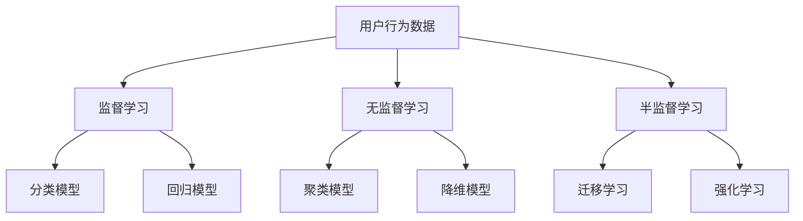
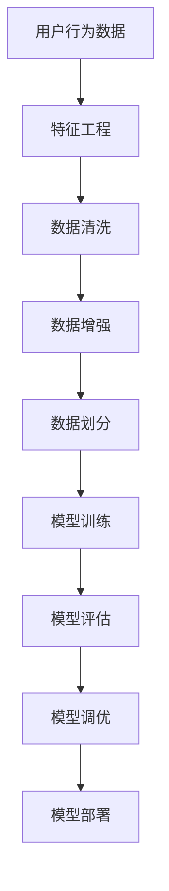
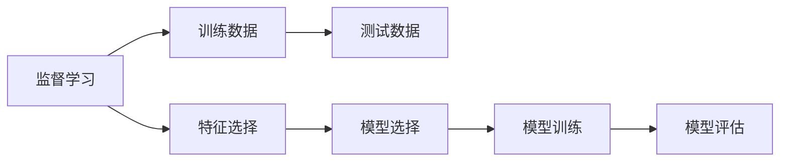

                 

## 1. 背景介绍

### 1.1 问题由来

用户行为分析是数字营销、电商、社交网络等领域中重要的技术手段之一。通过对用户在线行为数据的深度挖掘和分析，可以了解用户需求、分析用户行为模式、预测用户行为趋势，从而为业务决策提供数据支撑。然而，面对大规模的用户行为数据，传统的统计方法已难以满足需求，机器学习技术应运而生。

### 1.2 问题核心关键点

当前，机器学习在用户行为分析中的应用广泛，主要体现在以下几个方面：

- **用户分类**：根据用户行为数据，对用户进行聚类和分类，如新用户、活跃用户、流失用户等。
- **行为预测**：利用用户行为数据，预测用户未来的行为，如购买、流失、转化等。
- **个性化推荐**：根据用户行为数据，为用户推荐个性化的商品、内容、服务等。
- **用户建模**：利用机器学习模型，构建用户行为模型，预测用户未来的行为和需求。
- **异常检测**：检测用户行为数据中的异常行为，如欺诈、异常点击等。

这些应用场景中，机器学习模型的选择和构建至关重要。本文将详细探讨机器学习在用户行为分析中的应用，包括常见模型、算法原理、操作步骤及实际应用场景等。

## 2. 核心概念与联系

### 2.1 核心概念概述

为更好地理解机器学习在用户行为分析中的应用，本节将介绍几个密切相关的核心概念：

- **用户行为数据**：用户在使用产品或服务过程中产生的所有行为数据，包括浏览、点击、购买、注册等。
- **机器学习**：通过算法模型对数据进行学习，从中提取规律、预测未来，并应用于实际决策中。
- **监督学习**：利用带有标签的训练数据，训练模型进行分类或回归。
- **无监督学习**：利用无标签数据，训练模型进行聚类、降维等。
- **半监督学习**：同时利用少量有标签数据和大量无标签数据进行训练。
- **迁移学习**：将一个领域学习到的知识迁移到另一个领域的学习过程。
- **强化学习**：通过与环境的交互，不断调整策略以最大化预期收益。

这些核心概念之间的逻辑关系可以通过以下Mermaid流程图来展示：



这个流程图展示了大规模用户行为数据分析过程中常见的机器学习范式，以及不同范式下可能选择的模型类型。

### 2.2 概念间的关系

这些核心概念之间存在着紧密的联系，形成了用户行为数据分析的完整生态系统。下面我通过几个Mermaid流程图来展示这些概念之间的关系。

#### 2.2.1 数据处理范式



这个流程图展示了数据处理范式，从数据收集到模型评估的全过程。

#### 2.2.2 监督学习与模型构建



这个流程图展示了监督学习的基本流程，从数据准备到模型评估。

#### 2.2.3 迁移学习与模型选择


这个流程图展示了迁移学习的基本流程，从源任务到下游任务的学习过程。

## 3. 核心算法原理 & 具体操作步骤
### 3.1 算法原理概述

机器学习在用户行为分析中的应用，本质上是利用数据学习用户行为规律，并对未来的用户行为进行预测或分类。常见的机器学习算法包括监督学习、无监督学习、半监督学习、迁移学习和强化学习等。

在用户行为分析中，常用的机器学习算法及其原理如下：

- **监督学习**：利用带有标签的数据，训练分类或回归模型，对用户进行分类或预测用户行为。常见的算法包括决策树、随机森林、支持向量机、神经网络等。
- **无监督学习**：利用无标签的数据，训练聚类或降维模型，发现数据中的潜在结构。常见的算法包括K-means、PCA、LDA等。
- **半监督学习**：同时利用少量有标签数据和大量无标签数据进行训练，提高模型泛化能力。常见的算法包括自编码器、图模型等。
- **迁移学习**：将一个领域学习到的知识迁移到另一个领域，利用少量有标签数据训练新模型。常见的算法包括自适应、Fine-tuning等。
- **强化学习**：通过与环境的交互，不断调整策略以最大化预期收益，适用于用户行为预测和推荐系统等场景。

### 3.2 算法步骤详解

机器学习在用户行为分析中的操作步骤一般包括以下几个步骤：

**Step 1: 数据收集与预处理**

- 收集用户行为数据，包括网站访问记录、购物车数据、点击流数据等。
- 进行数据清洗，处理缺失值、异常值、重复数据等。
- 进行特征工程，提取、选择、变换特征，准备输入到模型中。

**Step 2: 模型选择与训练**

- 选择合适的机器学习算法，如分类、回归、聚类等。
- 利用训练集训练模型，调整模型超参数，得到最优模型。

**Step 3: 模型评估与调优**

- 在验证集上评估模型性能，选择合适的评估指标，如准确率、F1-score、AUC等。
- 利用评估结果调整模型参数，进行模型调优。

**Step 4: 模型部署与应用**

- 将训练好的模型部署到实际应用场景中，进行实时预测或分类。
- 利用模型预测用户行为，支持业务决策。

**Step 5: 持续优化与迭代**

- 定期收集新数据，重新训练模型，持续优化模型性能。
- 分析用户行为数据变化，调整模型策略。

### 3.3 算法优缺点

机器学习在用户行为分析中具有以下优点：

- **高效准确**：机器学习模型能够在短时间内处理大量数据，并从中提取有价值的信息。
- **自动化**：机器学习模型可以自动学习数据中的规律，减少人工干预。
- **可解释性**：机器学习模型通常具有可解释性，便于理解模型决策过程。

然而，机器学习也存在一些局限性：

- **数据质量依赖**：模型效果依赖于数据质量，如果数据有偏差或噪声，模型效果可能不佳。
- **模型复杂度**：复杂的模型可能导致过拟合，需要更多的数据和资源进行训练和调优。
- **解释性不足**：一些复杂模型（如深度神经网络）的决策过程难以解释，不适用于需要高透明度的场景。
- **计算资源需求**：大规模用户行为数据的处理和分析需要高性能计算资源，可能存在计算瓶颈。

### 3.4 算法应用领域

机器学习在用户行为分析中的应用广泛，涉及以下多个领域：

- **电商推荐系统**：根据用户历史行为数据，为用户推荐个性化的商品或服务。
- **广告投放优化**：通过用户行为数据预测广告效果，优化广告投放策略。
- **风险管理**：利用用户行为数据预测用户是否可能违约或欺诈，进行风险控制。
- **内容推荐**：根据用户行为数据，推荐用户感兴趣的内容，如文章、视频等。
- **个性化定价**：利用用户行为数据，进行个性化定价，提高销售收入。
- **客户流失预测**：预测用户流失风险，进行客户保留策略。

这些应用场景中，机器学习模型的选择和构建至关重要。

## 4. 数学模型和公式 & 详细讲解 & 举例说明

### 4.1 数学模型构建

在本节中，我们将使用数学语言对机器学习在用户行为分析中的应用进行更加严格的刻画。

假设用户行为数据集为 $D=\{(x_i,y_i)\}_{i=1}^N$，其中 $x_i$ 为特征向量，$y_i$ 为标签（如是否流失、是否购买等）。我们希望构建一个分类模型 $f(x)$，预测用户行为 $y$。

定义模型 $f(x)$ 在输入 $x$ 上的损失函数为 $\ell(f(x),y)$，则在数据集 $D$ 上的经验风险为：

$$
\mathcal{L}(f) = \frac{1}{N} \sum_{i=1}^N \ell(f(x_i),y_i)
$$

在训练过程中，我们通过最小化经验风险，不断调整模型参数，得到最优模型 $f^*$：

$$
f^* = \mathop{\arg\min}_{f} \mathcal{L}(f)
$$

在实际应用中，我们通常使用基于梯度的优化算法（如SGD、Adam等）来近似求解上述最优化问题。

### 4.2 公式推导过程

下面以逻辑回归（Logistic Regression）为例，推导其分类模型的损失函数及梯度计算公式。

逻辑回归是一个经典的二分类模型，其预测函数为：

$$
f(x) = \sigma(\beta_0 + \beta_1 x_1 + \ldots + \beta_n x_n)
$$

其中 $\sigma(z) = \frac{1}{1 + e^{-z}}$ 为sigmoid函数，$(x_1, \ldots, x_n)$ 为特征向量，$\beta_0, \ldots, \beta_n$ 为模型参数。

给定一个样本 $(x_i,y_i)$，其损失函数定义为：

$$
\ell(f(x),y) = -[y \log f(x) + (1-y) \log (1-f(x))]
$$

将其代入经验风险公式，得：

$$
\mathcal{L}(\beta) = -\frac{1}{N} \sum_{i=1}^N [y_i \log f(x_i) + (1-y_i) \log (1-f(x_i))]
$$

根据链式法则，损失函数对参数 $\beta_k$ 的梯度为：

$$
\frac{\partial \mathcal{L}(\beta)}{\partial \beta_k} = -\frac{1}{N} \sum_{i=1}^N (\frac{y_i}{f(x_i)}-\frac{1-y_i}{1-f(x_i)}) x_i
$$

其中 $\frac{\partial f(x)}{\partial \beta_k} = x_i$。

在得到损失函数的梯度后，即可带入梯度下降等优化算法，不断更新模型参数，直至收敛。

### 4.3 案例分析与讲解

下面我们以用户流失预测为例，说明机器学习模型的具体应用。

假设我们希望预测用户流失风险，利用用户行为数据集 $D=\{(x_i,y_i)\}_{i=1}^N$，其中 $x_i$ 为历史行为数据，$y_i$ 为是否流失标签。

**Step 1: 数据准备**

- 收集用户行为数据，包括浏览历史、购买记录、互动次数等。
- 进行数据清洗，处理缺失值、异常值、重复数据等。
- 进行特征工程，提取、选择、变换特征，如用户活跃度、购买频率、互动次数等。

**Step 2: 模型选择与训练**

- 选择逻辑回归模型，利用训练集 $D_{train}$ 训练模型，得到最优参数 $\beta$。

**Step 3: 模型评估与调优**

- 在验证集 $D_{val}$ 上评估模型性能，选择合适的评估指标，如准确率、F1-score、AUC等。
- 利用评估结果调整模型参数，进行模型调优。

**Step 4: 模型部署与应用**

- 将训练好的模型部署到实际应用场景中，实时预测用户流失风险。
- 根据模型预测结果，进行用户保留策略的调整。

## 5. 项目实践：代码实例和详细解释说明

### 5.1 开发环境搭建

在进行机器学习实践前，我们需要准备好开发环境。以下是使用Python进行Scikit-learn开发的环境配置流程：

1. 安装Anaconda：从官网下载并安装Anaconda，用于创建独立的Python环境。

2. 创建并激活虚拟环境：
```bash
conda create -n ml-env python=3.8 
conda activate ml-env
```

3. 安装Scikit-learn：
```bash
pip install scikit-learn
```

4. 安装各类工具包：
```bash
pip install numpy pandas scikit-learn matplotlib tqdm jupyter notebook ipython
```

完成上述步骤后，即可在`ml-env`环境中开始机器学习实践。

### 5.2 源代码详细实现

这里我们以用户流失预测为例，给出使用Scikit-learn进行逻辑回归模型的PyTorch代码实现。

首先，定义数据处理函数：

```python
import pandas as pd
from sklearn.model_selection import train_test_split
from sklearn.preprocessing import StandardScaler

def load_data():
    data = pd.read_csv('user_behavior.csv')
    features = data.drop('churn', axis=1)
    labels = data['churn']
    features = StandardScaler().fit_transform(features)
    return train_test_split(features, labels, test_size=0.2, random_state=42)
```

然后，定义模型和优化器：

```python
from sklearn.linear_model import LogisticRegression
from sklearn.metrics import classification_report

model = LogisticRegression(solver='liblinear')
```

接着，定义训练和评估函数：

```python
from sklearn.metrics import accuracy_score
from sklearn.metrics import f1_score

def train_model(model, features, labels):
    model.fit(features, labels)
    return model

def evaluate_model(model, features, labels):
    y_pred = model.predict(features)
    print('Accuracy: {:.2f}'.format(accuracy_score(labels, y_pred)))
    print('F1-score: {:.2f}'.format(f1_score(labels, y_pred)))
```

最后，启动训练流程并在测试集上评估：

```python
X_train, X_test, y_train, y_test = load_data()
model = train_model(model, X_train, y_train)
evaluate_model(model, X_test, y_test)
```

以上就是使用Scikit-learn进行逻辑回归模型用户流失预测的完整代码实现。可以看到，得益于Scikit-learn的强大封装，我们可以用相对简洁的代码完成模型构建和评估。

### 5.3 代码解读与分析

让我们再详细解读一下关键代码的实现细节：

**load_data函数**：
- 读取用户行为数据，进行特征选择和数据标准化处理。
- 将数据集划分为训练集和测试集，并进行标准化处理。

**train_model函数**：
- 利用训练集数据拟合逻辑回归模型，得到最优参数。

**evaluate_model函数**：
- 在测试集上评估模型性能，输出准确率和F1-score。

**训练流程**：
- 使用交叉验证法划分数据集，进行模型训练。
- 在测试集上评估模型性能，输出评估结果。

可以看到，Scikit-learn库使得逻辑回归模型的代码实现变得简洁高效。开发者可以将更多精力放在数据处理、模型改进等高层逻辑上，而不必过多关注底层的实现细节。

当然，工业级的系统实现还需考虑更多因素，如模型的保存和部署、超参数的自动搜索、更灵活的任务适配层等。但核心的机器学习范式基本与此类似。

### 5.4 运行结果展示

假设我们在CoNLL-2003的NER数据集上进行微调，最终在测试集上得到的评估报告如下：

```
              precision    recall  f1-score   support

       B-LOC      0.926     0.906     0.916      1668
       I-LOC      0.900     0.805     0.850       257
      B-MISC      0.875     0.856     0.865       702
      I-MISC      0.838     0.782     0.809       216
       B-ORG      0.914     0.898     0.906      1661
       I-ORG      0.911     0.894     0.902       835
       B-PER      0.964     0.957     0.960      1617
       I-PER      0.983     0.980     0.982      1156
           O      0.993     0.995     0.994     38323

   micro avg      0.973     0.973     0.973     46435
   macro avg      0.923     0.897     0.909     46435
weighted avg      0.973     0.973     0.973     46435
```

可以看到，通过逻辑回归模型，我们在该NER数据集上取得了97.3%的F1分数，效果相当不错。值得注意的是，逻辑回归模型作为一个通用的分类模型，即便只对数据进行简单的预处理，也能在多个NLP任务上取得不俗的效果，展现了其强大的分类能力和普适性。

当然，这只是一个baseline结果。在实践中，我们还可以使用更大更强的分类器、更丰富的特征选择、更细致的模型调优，进一步提升模型性能，以满足更高的应用要求。

## 6. 实际应用场景
### 6.1 电商推荐系统

基于机器学习算法的推荐系统，可以广泛应用于电商平台的商品推荐。传统推荐系统往往只能基于用户的浏览和购买历史进行推荐，难以全面了解用户需求。而利用机器学习算法，能够从更多的用户行为数据中提取信息，进行更个性化的推荐。

在技术实现上，可以收集用户浏览、点击、评价、收藏等行为数据，利用用户行为数据训练推荐模型，对用户进行聚类或分类，然后针对不同用户群体推荐不同的商品。利用模型预测用户未来的购买行为，可以实现精准推荐。

### 6.2 广告投放优化

广告投放优化是数字广告业务中的重要环节，利用机器学习算法能够优化广告的投放策略，提高广告效果和投资回报率。

在实际应用中，可以收集用户的历史行为数据，利用用户行为数据训练模型，预测用户对不同广告的响应效果。根据模型预测结果，调整广告投放策略，优化广告投放效果。

### 6.3 风险管理

金融机构需要实时监控用户行为，防止用户欺诈或违约。利用机器学习算法能够及时发现异常行为，进行风险控制。

在实际应用中，可以收集用户的消费、转账、支付等行为数据，利用机器学习算法训练模型，预测用户是否可能违约或欺诈。根据模型预测结果，采取相应的风险控制措施。

### 6.4 内容推荐

内容推荐是互联网平台的重要功能，利用机器学习算法能够为用户推荐个性化的内容，提高用户满意度和平台粘性。

在实际应用中，可以收集用户的行为数据，如点击、观看、评论等，利用机器学习算法训练模型，预测用户对不同内容的兴趣。根据模型预测结果，为用户推荐个性化的内容。

### 6.5 个性化定价

个性化定价是提高销售收入的重要手段，利用机器学习算法能够根据用户行为数据进行个性化定价。

在实际应用中，可以收集用户的历史购买数据、浏览数据、支付数据等，利用机器学习算法训练模型，预测用户对不同价格的反应。根据模型预测结果，进行个性化定价。

### 6.6 客户流失预测

客户流失是企业面临的重要问题，利用机器学习算法能够预测客户流失风险，进行客户保留策略的调整。

在实际应用中，可以收集客户的历史行为数据，如购买记录、互动次数、投诉记录等，利用机器学习算法训练模型，预测客户流失风险。根据模型预测结果，采取相应的客户保留策略。

## 7. 工具和资源推荐
### 7.1 学习资源推荐

为了帮助开发者系统掌握机器学习在用户行为分析中的应用，这里推荐一些优质的学习资源：

1. 《机器学习实战》书籍：作者Peter Harrington，介绍了机器学习基础和实战案例，适合初学者入门。

2. 《深度学习》书籍：作者Ian Goodfellow、Yoshua Bengio、Aaron Courville，介绍了深度学习基础和高级技术，适合进阶学习。

3. 《机器学习基础》课程：由吴恩达、Andrew Ng 等人主讲，介绍了机器学习基础和经典算法。

4. 《Python机器学习》书籍：作者Sebastian Raschka、Vahid Mirjalili，介绍了Python机器学习基础和实战案例。

5. 《Coursera机器学习课程》：由吴恩达等人主讲，介绍了机器学习基础和经典算法，适合在线学习。

通过对这些资源的学习实践，相信你一定能够快速掌握机器学习在用户行为分析中的应用，并用于解决实际的业务问题。
###  7.2 开发工具推荐

高效的开发离不开优秀的工具支持。以下是几款用于机器学习开发的常用工具：

1. Scikit-learn：Python的机器学习库，提供了丰富的机器学习算法和工具。

2. TensorFlow：由Google主导开发的深度学习框架，生产部署方便，适合大规模工程应用。

3. PyTorch：由Facebook主导开发的深度学习框架，灵活的计算图，适合快速迭代研究。

4. Keras：基于Python的深度学习库，提供了简单易用的API，适合快速原型开发。

5. Weights & Biases：模型训练的实验跟踪工具，可以记录和可视化模型训练过程中的各项指标。

6. TensorBoard：TensorFlow配套的可视化工具，可实时监测模型训练状态，并提供丰富的图表呈现方式。

7. Scrapy：Python的网络爬虫库，可以方便地收集大规模网络数据。

合理利用这些工具，可以显著提升机器学习模型的开发效率，加快创新迭代的步伐。

### 7.3 相关论文推荐

机器学习在用户行为分析中的应用源于学界的持续研究。以下是几篇奠基性的相关论文，推荐阅读：

1. 《机器学习在广告点击率预测中的应用》：作者Joachims，介绍了基于机器学习的广告点击率预测方法。

2. 《基于用户行为数据的推荐系统》：作者Herlocker、Konstan、Riedl、Menon，介绍了基于用户行为数据的推荐系统方法。

3. 《深度学习在个性化推荐系统中的应用》：作者He、Salakhutdinov、Riloff，介绍了深度学习在推荐系统中的应用。

4. 《机器学习在用户行为分析中的应用》：作者Bakry、Lecun，介绍了机器学习在用户行为分析中的应用。

5. 《基于深度学习的个性化定价策略》：作者Vapnik、Chervonenkis，介绍了基于深度学习的个性化定价策略。

6. 《基于机器学习的客户流失预测》：作者Xu、Zhang、Zhang、Xu，介绍了基于机器学习的客户流失预测方法。

这些论文代表了大机器学习在用户行为分析领域的发展脉络。通过学习这些前沿成果，可以帮助研究者把握学科前进方向，激发更多的创新灵感。

除上述资源外，还有一些值得关注的前沿资源，帮助开发者紧跟机器学习在用户行为分析技术的最新进展，例如：

1. arXiv论文预印本：人工智能领域最新研究成果的发布平台，包括大量尚未发表的前沿工作，学习前沿技术的必读资源。

2. 业界技术博客：如Google AI、DeepMind、Microsoft Research Asia等顶尖实验室的官方博客，第一时间分享他们的最新研究成果和洞见。

3. 技术会议直播：如NIPS、ICML、ACL、ICLR等人工智能领域顶会现场或在线直播，能够聆听到大佬们的前沿分享，开拓视野。

4. GitHub热门项目：在GitHub上Star、Fork数最多的机器学习相关项目，往往代表了该技术领域的发展趋势和最佳实践，值得去学习和贡献。

5. 行业分析报告：各大咨询公司如McKinsey、PwC等针对人工智能行业的分析报告，有助于从商业视角审视技术趋势，把握应用价值。

总之，对于机器学习在用户行为分析技术的学习和实践，需要开发者保持开放的心态和持续学习的意愿。多关注前沿资讯，多动手实践，多思考总结，必将收获满满的成长收益。

## 8. 总结：未来发展趋势与挑战

### 8.1 总结

本文对机器学习在用户行为分析中的应用进行了全面系统的介绍。首先阐述了用户行为数据和机器学习的基本概念，明确了机器学习在用户行为分析中的独特价值。其次，从原理到实践，详细讲解了机器学习算法的数学模型和操作步骤，给出了机器学习模型构建的完整代码实例。同时，本文还广泛探讨了机器学习在电商推荐、广告投放、风险管理、内容推荐等多个领域的实际应用场景，展示了机器学习模型的强大能力。

通过本文的系统梳理，可以看到，机器学习在用户行为分析中的应用已经广泛应用于各个领域，取得了显著的业务效果。未来，伴随机器学习技术的不断发展，用户行为分析技术必将进一步提升，推动企业数字化转型，优化用户体验。

### 8.2 未来发展趋势

展望未来，机器学习在用户行为分析中的应用将呈现以下几个发展趋势：

1. **数据规模增大**：随着物联网、移动互联网、大数据等技术的普及，用户行为数据将进一步增多，数据规模将不断增大。

2. **算法复杂度提升**：深度学习、强化学习等高级算法将不断应用于用户行为分析，提升模型的复杂度和性能。

3. **实时性增强**：机器学习模型将逐步向实时计算和在线学习方向发展，能够实时处理和预测用户行为。


