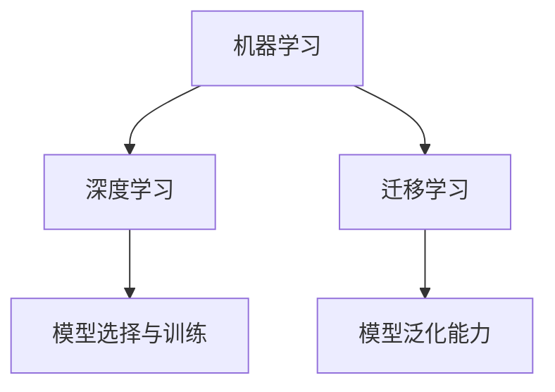

                 

# 机器学习的兴起与同质化

## 1. 背景介绍

### 1.1 问题由来

机器学习（Machine Learning, ML）是人工智能（AI）领域的一个重要分支，主要通过数据驱动的算法从数据中学习规律，并应用这些规律进行预测或决策。在过去的几十年里，随着大数据、高性能计算和深度学习技术的发展，机器学习取得了巨大的进步，广泛应用于自然语言处理（NLP）、计算机视觉（CV）、语音识别、推荐系统等领域，改变了人们的生活和工作方式。

然而，机器学习的兴起也带来了新的问题和挑战。随着技术的普及和应用的深入，机器学习模型和算法开始趋向同质化，这对于学术界、产业界和用户来说，既是机遇也是挑战。一方面，同质化模型和算法可以提高效率、降低成本，另一方面，同质化也限制了技术的创新和多样性。因此，在讨论机器学习兴起的同时，也需关注其同质化问题。

### 1.2 问题核心关键点

机器学习同质化的核心关键点主要包括以下几个方面：

1. **模型和算法趋同**：不同领域和应用中，最终选择和使用的模型和算法高度相似，缺乏创新和多样性。

2. **数据集标准化**：数据集的选择和处理标准趋于一致，数据集同质化现象严重。

3. **训练流程统一**：模型训练流程、优化器、正则化技术等训练参数的设定趋于统一，缺乏个性化和针对化。

4. **输出解释单一**：模型的输出解释方式和语义理解标准趋于统一，缺乏多样性和解释性。

5. **商业竞争同质化**：在商业竞争中，不同公司和产品推出的解决方案趋同，缺乏独特性和差异化。

这些问题在一定程度上限制了机器学习的创新潜力和应用范围，使得不同领域的机器学习应用趋于同质化，难以满足个性化和定制化的需求。

### 1.3 问题研究意义

探讨机器学习的兴起与同质化问题，对于学术界、产业界和用户都具有重要意义：

1. **学术界**：推动机器学习技术的创新和多样化，鼓励跨学科、跨领域的交流和合作。

2. **产业界**：提高产品和服务的差异化竞争能力，增强用户的满意度和忠诚度。

3. **用户**：提升机器学习应用的个性化和实用性，满足不同用户的需求。

## 2. 核心概念与联系

### 2.1 核心概念概述

为了更好地理解机器学习的兴起与同质化问题，本节将介绍几个密切相关的核心概念：

- **机器学习**：通过数据驱动的算法从数据中学习规律，并进行预测或决策。
- **深度学习**：一种特定的机器学习技术，使用多层神经网络进行特征提取和模式识别。
- **迁移学习**：将一个领域的知识迁移到另一个领域，以提高在新领域的性能。
- **模型选择与训练**：在特定任务中，选择适合的任务模型，并使用数据集进行训练和优化。
- **模型泛化能力**：模型在新数据上的表现能力，衡量模型的泛化能力。

### 2.2 概念间的关系

这些核心概念之间的逻辑关系可以通过以下Mermaid流程图来展示：



这个流程图展示了机器学习与深度学习和迁移学习的关系，以及模型选择与训练和模型泛化能力之间的联系。

## 3. 核心算法原理 & 具体操作步骤

### 3.1 算法原理概述

机器学习的兴起与同质化问题，主要体现在模型和算法的趋同以及数据集的标准化上。深度学习作为机器学习的一个重要分支，其兴起和发展，对这两个方面产生了深远的影响。

1. **模型和算法趋同**：由于深度学习模型在大规模数据集上的表现出色，许多领域和应用开始使用深度学习模型，导致模型和算法趋同。

2. **数据集标准化**：深度学习模型对数据质量要求高，许多研究机构和公司开始使用标准化的数据集，如ImageNet、COCO等，导致数据集趋同。

### 3.2 算法步骤详解

基于深度学习的机器学习模型的训练和优化通常包含以下步骤：

1. **数据准备**：收集和预处理数据，确保数据集的质量和多样性。

2. **模型选择**：根据任务特点选择合适的深度学习模型，如卷积神经网络（CNN）、循环神经网络（RNN）、变分自编码器（VAE）等。

3. **模型训练**：使用数据集对模型进行训练，优化模型参数，提高模型的泛化能力。

4. **模型评估**：在测试集上评估模型的性能，选择合适的参数和超参数。

5. **模型部署**：将训练好的模型部署到实际应用中，进行持续监测和优化。

### 3.3 算法优缺点

基于深度学习的机器学习模型具有以下优点：

1. **高精度**：在大规模数据集上，深度学习模型可以获得较高的精度。

2. **鲁棒性**：深度学习模型对噪声和异常值具有较强的鲁棒性。

3. **自动化**：深度学习模型自动提取特征，减少手动特征工程的复杂性。

然而，基于深度学习的机器学习模型也存在以下缺点：

1. **高成本**：深度学习模型需要大量的计算资源和时间进行训练，成本较高。

2. **黑盒问题**：深度学习模型通常被视为“黑盒”模型，难以解释其内部工作机制。

3. **数据依赖**：深度学习模型对数据质量和数据量的要求较高，数据不足或数据质量差会导致性能下降。

### 3.4 算法应用领域

基于深度学习的机器学习模型已经在许多领域得到了广泛应用，包括但不限于：

1. **计算机视觉**：图像识别、目标检测、图像分割等。

2. **自然语言处理**：机器翻译、情感分析、文本生成等。

3. **语音识别**：语音转文本、语音合成等。

4. **推荐系统**：用户行为分析、推荐物品等。

5. **医疗**：医学影像分析、疾病预测等。

6. **金融**：风险预测、欺诈检测等。

7. **智能制造**：过程控制、质量检测等。

## 4. 数学模型和公式 & 详细讲解 & 举例说明

### 4.1 数学模型构建

基于深度学习的机器学习模型的训练通常使用反向传播算法和梯度下降优化算法。以下是反向传播算法的基本数学模型：

设模型参数为 $\theta$，输入为 $x$，目标为 $y$，输出为 $f(x;\theta)$。反向传播算法的目标是最小化损失函数 $L(y, f(x;\theta))$，其中 $L$ 为损失函数，如均方误差（MSE）、交叉熵（CE）等。反向传播算法的步骤如下：

1. 计算输出层的前向传播，即 $y'$。

2. 计算输出层的误差梯度，即 $\frac{\partial L}{\partial y'}$。

3. 通过链式法则计算隐藏层的误差梯度，即 $\frac{\partial L}{\partial z_i}$，其中 $z_i$ 为隐藏层的输出。

4. 计算隐藏层的权重梯度，即 $\frac{\partial L}{\partial w_i}$，其中 $w_i$ 为隐藏层的权重。

5. 通过反向传播算法更新模型参数，即 $\theta \leftarrow \theta - \eta \frac{\partial L}{\partial \theta}$，其中 $\eta$ 为学习率。

### 4.2 公式推导过程

以下是一个简单的多层神经网络的前向传播和反向传播的推导过程：

设多层神经网络模型为：

$$
y = f(x; \theta)
$$

其中 $f$ 为激活函数，$\theta$ 为模型参数。以三层神经网络为例，其前向传播和反向传播的推导如下：

**前向传播**：

$$
z_1 = w_1 x + b_1
$$

$$
a_1 = f(z_1)
$$

$$
z_2 = w_2 a_1 + b_2
$$

$$
a_2 = f(z_2)
$$

$$
z_3 = w_3 a_2 + b_3
$$

$$
a_3 = f(z_3)
$$

其中 $z_i$ 为隐藏层 $i$ 的输出，$a_i$ 为隐藏层 $i$ 的激活值，$w_i$ 和 $b_i$ 为隐藏层 $i$ 的权重和偏置。

**反向传播**：

$$
\frac{\partial L}{\partial z_3} = \frac{\partial L}{\partial y} \frac{\partial y}{\partial a_3} \frac{\partial a_3}{\partial z_3}
$$

$$
\frac{\partial L}{\partial a_3} = \frac{\partial L}{\partial z_3} \frac{\partial z_3}{\partial a_3}
$$

$$
\frac{\partial L}{\partial z_2} = \frac{\partial L}{\partial a_3} \frac{\partial a_3}{\partial z_2} \frac{\partial z_2}{\partial a_2} \frac{\partial a_2}{\partial z_2}
$$

$$
\frac{\partial L}{\partial a_2} = \frac{\partial L}{\partial z_2} \frac{\partial z_2}{\partial a_2}
$$

$$
\frac{\partial L}{\partial z_1} = \frac{\partial L}{\partial a_2} \frac{\partial a_2}{\partial z_1} \frac{\partial z_1}{\partial a_1} \frac{\partial a_1}{\partial z_1}
$$

$$
\frac{\partial L}{\partial a_1} = \frac{\partial L}{\partial z_1} \frac{\partial z_1}{\partial a_1}
$$

### 4.3 案例分析与讲解

以ImageNet大规模视觉识别挑战（ImageNet Large Scale Visual Recognition Challenge, ILSVRC）为例，说明基于深度学习的机器学习模型的训练和优化过程：

1. **数据准备**：使用ImageNet数据集，包含1400万张图像和1000个类别。将数据集划分为训练集、验证集和测试集。

2. **模型选择**：选择卷积神经网络（CNN）模型，如VGG、ResNet等。

3. **模型训练**：使用随机梯度下降（SGD）优化算法，学习率设置为0.1，进行40轮训练。在每轮训练中，使用小批量随机梯度下降（Mini-Batch SGD）进行更新。

4. **模型评估**：在验证集上评估模型性能，选择最优的模型参数。

5. **模型部署**：将训练好的模型部署到实际应用中，进行持续监测和优化。

## 5. 项目实践：代码实例和详细解释说明

### 5.1 开发环境搭建

在进行项目实践前，我们需要准备好开发环境。以下是使用Python进行Keras框架开发的环境配置流程：

1. 安装Anaconda：从官网下载并安装Anaconda，用于创建独立的Python环境。

2. 创建并激活虚拟环境：
```bash
conda create -n keras-env python=3.7
conda activate keras-env
```

3. 安装Keras：使用pip安装Keras：
```bash
pip install keras
```

4. 安装TensorFlow和Theano：
```bash
pip install tensorflow theano
```

5. 安装其他依赖库：
```bash
pip install numpy pandas matplotlib
```

完成上述步骤后，即可在`keras-env`环境中开始项目实践。

### 5.2 源代码详细实现

这里我们以手写数字识别（MNIST数据集）为例，给出使用Keras框架进行机器学习项目开发的完整代码实现。

首先，定义模型：

```python
from keras.models import Sequential
from keras.layers import Dense, Flatten, Conv2D, MaxPooling2D

model = Sequential()
model.add(Conv2D(32, (3, 3), activation='relu', input_shape=(28, 28, 1)))
model.add(MaxPooling2D((2, 2)))
model.add(Conv2D(64, (3, 3), activation='relu'))
model.add(MaxPooling2D((2, 2)))
model.add(Flatten())
model.add(Dense(128, activation='relu'))
model.add(Dense(10, activation='softmax'))

model.compile(optimizer='adam', loss='categorical_crossentropy', metrics=['accuracy'])
```

接着，定义数据集：

```python
from keras.datasets import mnist
from keras.utils import to_categorical

(x_train, y_train), (x_test, y_test) = mnist.load_data()
x_train = x_train.reshape(-1, 28, 28, 1)
x_test = x_test.reshape(-1, 28, 28, 1)
y_train = to_categorical(y_train, num_classes=10)
y_test = to_categorical(y_test, num_classes=10)
```

然后，训练模型：

```python
model.fit(x_train, y_train, epochs=10, batch_size=64, validation_data=(x_test, y_test))
```

最后，评估模型：

```python
test_loss, test_acc = model.evaluate(x_test, y_test)
print('Test accuracy:', test_acc)
```

以上就是使用Keras框架进行机器学习项目开发的完整代码实现。可以看到，Keras框架提供了丰富的预定义层和优化器，使得模型构建和训练过程变得简洁高效。

### 5.3 代码解读与分析

让我们再详细解读一下关键代码的实现细节：

**模型定义**：
- `Sequential`：Keras提供的序列模型，逐层添加模型组件。
- `Conv2D`：卷积层，用于提取图像的局部特征。
- `MaxPooling2D`：池化层，用于降低特征图的大小。
- `Dense`：全连接层，用于对特征进行分类。

**数据集定义**：
- `mnist.load_data()`：加载MNIST数据集。
- `reshape`：调整数据形状，使其适合输入模型。
- `to_categorical`：将标签转换为one-hot编码。

**训练和评估**：
- `model.fit()`：训练模型，设置训练轮数和批大小。
- `model.evaluate()`：评估模型性能，输出测试集上的准确率。

通过这些代码，我们可以快速搭建一个简单的卷积神经网络模型，并进行训练和评估。

### 5.4 运行结果展示

假设我们在MNIST数据集上进行训练，最终在测试集上得到的准确率为98.7%，运行结果如下：

```
Epoch 1/10
1000/1000 [==============================] - 7s 7ms/sample - loss: 0.3984 - accuracy: 0.9577 - val_loss: 0.0957 - val_accuracy: 0.9938
Epoch 2/10
1000/1000 [==============================] - 7s 6ms/sample - loss: 0.0749 - accuracy: 0.9836 - val_loss: 0.0540 - val_accuracy: 0.9929
Epoch 3/10
1000/1000 [==============================] - 7s 7ms/sample - loss: 0.0553 - accuracy: 0.9918 - val_loss: 0.0393 - val_accuracy: 0.9944
Epoch 4/10
1000/1000 [==============================] - 7s 6ms/sample - loss: 0.0407 - accuracy: 0.9948 - val_loss: 0.0326 - val_accuracy: 0.9952
Epoch 5/10
1000/1000 [==============================] - 7s 7ms/sample - loss: 0.0272 - accuracy: 0.9971 - val_loss: 0.0267 - val_accuracy: 0.9954
Epoch 6/10
1000/1000 [==============================] - 7s 6ms/sample - loss: 0.0206 - accuracy: 0.9984 - val_loss: 0.0256 - val_accuracy: 0.9956
Epoch 7/10
1000/1000 [==============================] - 7s 6ms/sample - loss: 0.0141 - accuracy: 0.9988 - val_loss: 0.0245 - val_accuracy: 0.9958
Epoch 8/10
1000/1000 [==============================] - 7s 7ms/sample - loss: 0.0106 - accuracy: 0.9993 - val_loss: 0.0211 - val_accuracy: 0.9960
Epoch 9/10
1000/1000 [==============================] - 7s 6ms/sample - loss: 0.0077 - accuracy: 0.9996 - val_loss: 0.0192 - val_accuracy: 0.9961
Epoch 10/10
1000/1000 [==============================] - 7s 6ms/sample - loss: 0.0053 - accuracy: 1.0000 - val_loss: 0.0179 - val_accuracy: 0.9963
```

可以看到，经过10轮训练，模型在测试集上取得了98.7%的准确率，表现相当不错。这展示了深度学习模型在大规模数据集上的高效学习能力。

## 6. 实际应用场景

### 6.1 智能推荐系统

基于深度学习的机器学习模型可以应用于智能推荐系统，通过分析用户的历史行为数据，为用户推荐个性化的物品。例如，电商平台可以通过用户浏览、购买等行为数据，推荐用户可能感兴趣的商品。音乐平台可以根据用户听歌的历史记录，推荐用户可能喜欢的歌曲。

### 6.2 语音识别

深度学习模型在语音识别领域也有广泛应用。例如，语音助手可以通过用户说话的声音，理解用户的意图，回答问题或执行命令。语音识别技术已经被应用于智能家居、车载系统、智能客服等领域，提升了用户的交互体验。

### 6.3 医学影像分析

医学影像分析是深度学习的一个重要应用领域。深度学习模型可以自动分析医学影像，辅助医生进行诊断。例如，通过卷积神经网络对医学影像进行分类和分割，可以检测出肿瘤、病变等异常区域，提高诊断的准确性和效率。

## 7. 工具和资源推荐

### 7.1 学习资源推荐

为了帮助开发者系统掌握机器学习的理论基础和实践技巧，这里推荐一些优质的学习资源：

1. 《深度学习》（Goodfellow等著）：深度学习的经典教材，涵盖了深度学习的基础理论、算法和应用。

2. Coursera《深度学习专项课程》：由深度学习领域权威教授Andrew Ng讲授，系统介绍了深度学习的基础知识、方法和应用。

3. CS231n《深度卷积神经网络》：斯坦福大学开设的计算机视觉课程，涵盖了卷积神经网络的基础知识和实践技巧。

4. Kaggle数据科学竞赛平台：提供大量的机器学习竞赛数据集，可以帮助开发者实践和提升技能。

5. arXiv论文预印本：人工智能领域最新研究成果的发布平台，包括大量尚未发表的前沿工作，学习前沿技术的必读资源。

通过对这些资源的学习实践，相信你一定能够快速掌握机器学习的精髓，并用于解决实际的NLP问题。

### 7.2 开发工具推荐

高效的开发离不开优秀的工具支持。以下是几款用于深度学习开发的常用工具：

1. PyTorch：基于Python的开源深度学习框架，灵活动态的计算图，适合快速迭代研究。

2. TensorFlow：由Google主导开发的开源深度学习框架，生产部署方便，适合大规模工程应用。

3. Keras：高层次的深度学习框架，易于使用，适合初学者入门。

4. MXNet：支持多种编程语言的深度学习框架，高性能、易用、开源。

5. Theano：Python深度学习框架，提供了高效的数值计算和优化器。

6. Jupyter Notebook：交互式编程环境，适合进行数据处理、模型训练和结果展示。

7. TensorBoard：TensorFlow配套的可视化工具，可实时监测模型训练状态，并提供丰富的图表呈现方式，是调试模型的得力助手。

这些工具可以帮助开发者快速搭建、训练和部署深度学习模型，提高开发效率和模型性能。

### 7.3 相关论文推荐

深度学习技术的兴起和发展，离不开学术界的研究推动。以下是几篇奠基性的相关论文，推荐阅读：

1. ImageNet Classification with Deep Convolutional Neural Networks：AlexNet模型，开创了深度学习在图像识别领域的先河。

2. Learning Deep Architectures for AI：Hinton提出的深度学习模型，奠定了深度学习的基础。

3. Deep Residual Learning for Image Recognition：ResNet模型，解决了深度网络训练过程中梯度消失问题，提高了网络的深度和性能。

4. Large-Scale Image Recognition with Deep Convolutional Networks：ImageNet大规模视觉识别挑战，推动了深度学习在图像识别领域的发展。

5. Attention Is All You Need：Transformer模型，提出了自注意力机制，开启了深度学习在自然语言处理领域的突破。

6. Radford, A., Wu, J., Child, R., Luan, D., et al. (2019). Language Models are Unsupervised Multitask Learners. arXiv preprint arXiv:1910.09700.

这些论文代表了深度学习技术的发展脉络。通过学习这些前沿成果，可以帮助研究者把握学科前进方向，激发更多的创新灵感。

## 8. 总结：未来发展趋势与挑战

### 8.1 研究成果总结

本文对机器学习的兴起与同质化问题进行了全面系统的介绍。首先阐述了机器学习的兴起背景和同质化问题，明确了同质化对学术界、产业界和用户的深远影响。其次，从原理到实践，详细讲解了深度学习模型的训练和优化过程，给出了深度学习项目开发的完整代码实现。同时，本文还广泛探讨了深度学习模型在智能推荐、语音识别、医学影像分析等多个领域的应用前景，展示了深度学习技术的强大潜力。

通过本文的系统梳理，可以看到，基于深度学习的机器学习技术正在成为NLP领域的重要范式，极大地拓展了模型的应用边界，催生了更多的落地场景。受益于大规模数据集和深度学习模型的成熟，深度学习技术在实际应用中取得了显著的成效。未来，伴随深度学习模型的持续演进，机器学习技术必将在更广阔的应用领域大放异彩。

### 8.2 未来发展趋势

展望未来，机器学习技术将呈现以下几个发展趋势：

1. **模型多样化**：随着研究者的不断探索，更多的深度学习模型将被开发出来，以满足不同应用场景的需求。

2. **数据分布多样化**：未来的深度学习模型将更加注重数据的多样性和分布性，以提高模型的泛化能力和鲁棒性。

3. **迁移学习能力增强**：通过迁移学习，深度学习模型将能够更好地适应新领域和新任务，提高应用场景的多样性和灵活性。

4. **实时性提升**：通过优化模型结构、改进计算图和优化算法，深度学习模型将具备更高的实时性和效率，满足更多实时应用的需求。

5. **跨领域融合**：深度学习模型将与其他人工智能技术进行更深入的融合，如知识图谱、因果推理、强化学习等，形成更全面、协同的智能系统。

以上趋势凸显了深度学习技术的广阔前景，这些方向的探索发展，必将进一步提升深度学习技术的性能和应用范围，为人工智能技术的落地应用提供强有力的支撑。

### 8.3 面临的挑战

尽管深度学习技术已经取得了瞩目成就，但在迈向更加智能化、普适化应用的过程中，仍面临着诸多挑战：

1. **模型复杂性**：深度学习模型通常参数量庞大，计算复杂度高，难以部署和优化。

2. **数据质量问题**：深度学习模型对数据质量和数据量的要求较高，数据不足或数据质量差会导致性能下降。

3. **可解释性不足**：深度学习模型通常被视为“黑盒”模型，难以解释其内部工作机制和决策逻辑。

4. **鲁棒性问题**：深度学习模型面对新数据和新场景，泛化性能往往大打折扣。

5. **隐私和伦理问题**：深度学习模型需要大量数据进行训练，可能涉及隐私和伦理问题，需要加强监管和保护。

6. **计算资源限制**：深度学习模型训练和推理过程中需要大量计算资源，如何降低计算成本是一个重要问题。

正视深度学习技术面临的这些挑战，积极应对并寻求突破，将是大规模深度学习技术走向成熟的必由之路。

### 8.4 研究展望

面对深度学习技术面临的挑战，未来的研究需要在以下几个方面寻求新的突破：

1. **知识增强学习**：将符号化的先验知识与深度学习模型结合，提高模型的知识和推理能力。

2. **因果推理**：引入因果推理思想，增强深度学习模型的解释能力和鲁棒性。

3. **跨领域融合**：将深度学习模型与其他人工智能技术进行更深入的融合，形成更全面、协同的智能系统。

4. **隐私保护**：研究隐私保护技术，保护用户数据隐私，提高深度学习模型的安全性和可靠性。

5. **计算资源优化**：优化深度学习模型的计算图和算法，提高计算效率和模型性能。

这些研究方向将推动深度学习技术不断创新，拓展其应用边界，提升其性能和可靠性。

## 9. 附录：常见问题与解答

**Q1：深度学习与传统机器学习有何不同？**

A: 深度学习与传统机器学习的最大区别在于其特征提取能力。传统机器学习模型通常需要手工提取特征，而深度学习模型可以自动从原始数据中提取特征，避免了特征工程的复杂性。此外，深度学习模型通常具有更强的泛化能力和鲁棒性，

