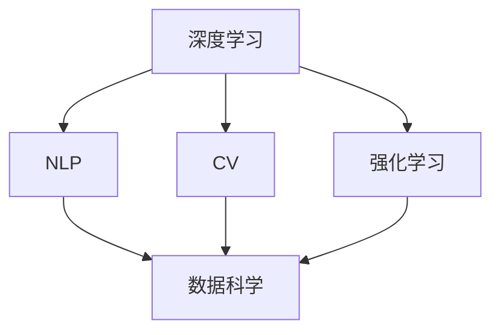

                 

# 李开复：AI 2.0 时代的市场

> 关键词：人工智能, 李开复, AI 2.0, 未来市场趋势, 技术创新, 商业应用

## 1. 背景介绍

### 1.1 问题的由来
随着人工智能技术的迅速发展，AI已经进入了一个全新的阶段——AI 2.0时代。AI 2.0不仅指代更加先进和强大的技术手段，更代表了AI与现实世界的深度融合，以及AI在各个领域的应用广度和深度。在这样的背景下，理解AI 2.0时代的市场，探讨其未来的发展趋势，对于科技界、产业界和广大消费者都具有重要意义。

### 1.2 问题核心关键点
AI 2.0时代的市场关注点主要包括以下几个方面：
- AI 2.0技术的最新进展和应用实例。
- AI 2.0在不同行业中的应用前景。
- AI 2.0技术带来的商业机会和挑战。
- AI 2.0与传统产业的结合方式和影响。

### 1.3 问题研究意义
探讨AI 2.0时代的市场，有助于我们：
- 准确把握AI技术的发展方向，避免过时的技术投入。
- 理解AI在各行业的潜在应用，寻找新的商业机会。
- 应对AI带来的行业变革，优化现有业务流程。
- 预见AI带来的就业和经济结构变化，提前做好应对准备。

## 2. 核心概念与联系

### 2.1 核心概念概述

为更好地理解AI 2.0时代的市场，本节将介绍几个关键概念及其相互联系：

- AI 2.0：指代新一代人工智能技术，包括但不限于深度学习、自然语言处理、计算机视觉、强化学习等。AI 2.0具有更强的推理能力、更好的泛化能力和更高的适应性。

- 深度学习：基于神经网络的一类机器学习方法，通过多层次特征提取和优化，实现对复杂问题的深度建模。

- 自然语言处理(NLP)：研究计算机如何理解和处理人类语言的技术。NLP在AI 2.0中扮演着重要角色。

- 计算机视觉(CV)：使计算机能够“看”的技术，通过图像处理和模式识别，实现自动化的视觉任务。

- 强化学习：通过与环境交互，逐步优化行为策略，以实现特定目标的技术。

- 数据科学：使用数据进行科学研究的领域，涵盖数据收集、处理、分析和可视化等多个环节。

这些核心概念通过以下Mermaid流程图展示其联系：



### 2.2 概念间的关系

这些核心概念之间存在紧密联系，共同构成了AI 2.0的生态系统：

- 深度学习是AI 2.0的核心技术之一，为NLP、CV、强化学习提供了强大的模型支持。
- NLP与CV是AI 2.0在感知理解方面的重要组成部分，使机器能够“看”和“听”。
- 强化学习通过与环境的交互，进一步优化了模型的决策能力。
- 数据科学为AI 2.0提供了数据支撑，是模型训练和优化不可或缺的一环。

这种相互依赖的关系，使得AI 2.0技术能够在各个领域实现广泛的应用。

## 3. 核心算法原理 & 具体操作步骤

### 3.1 算法原理概述

AI 2.0的核心算法原理主要基于以下三个方面：

- **数据驱动的模型训练**：通过大量的标注数据，使用深度学习算法训练出高性能模型。
- **迁移学习**：利用预训练模型在其他任务上的知识，快速适应新任务。
- **强化学习**：通过与环境的交互，逐步优化策略，以实现特定目标。

### 3.2 算法步骤详解

AI 2.0技术的实现通常包括以下几个关键步骤：

**Step 1: 数据收集与预处理**
- 收集与任务相关的数据集。
- 清洗数据，去除噪声和异常值。
- 进行特征提取和数据增强，提升数据质量。

**Step 2: 模型选择与训练**
- 根据任务特点选择合适的深度学习模型（如CNN、RNN、Transformer等）。
- 使用深度学习框架（如PyTorch、TensorFlow等）搭建模型。
- 设置模型超参数（如学习率、批大小、迭代次数等）。
- 使用训练集进行模型训练，优化模型参数。

**Step 3: 模型评估与调优**
- 使用验证集评估模型性能。
- 根据评估结果调整模型参数，优化模型性能。
- 使用测试集进行最终模型评估。

**Step 4: 模型部署与应用**
- 将训练好的模型部署到实际应用环境中。
- 设计合适的接口和交互方式，实现模型的服务化。
- 持续监控模型性能，根据需要进行微调。

### 3.3 算法优缺点

AI 2.0技术的优点：
- **高效**：通过深度学习和大规模数据训练，能够迅速提升模型性能。
- **广泛应用**：NLP、CV、强化学习等技术在不同行业领域都有广泛应用。
- **可解释性**：模型训练过程透明，便于理解模型行为。

缺点：
- **数据依赖**：模型训练需要大量标注数据，数据获取成本较高。
- **模型复杂性**：模型结构复杂，对计算资源要求高。
- **泛化能力**：在特定领域或数据集上训练的模型，可能难以泛化到其他领域。

### 3.4 算法应用领域

AI 2.0技术在多个领域都有广泛应用，主要包括：

- **医疗**：通过NLP和CV技术，实现疾病诊断、医学影像分析、智能问诊等。
- **金融**：利用深度学习进行信用评估、风险控制、智能投顾等。
- **制造**：采用强化学习优化生产流程、预测设备维护等。
- **零售**：使用推荐系统、智能客服等技术提升用户体验和销售效率。
- **交通**：通过计算机视觉实现自动驾驶、交通监测等。
- **教育**：利用NLP进行智能答疑、学习分析等。

## 4. 数学模型和公式 & 详细讲解

### 4.1 数学模型构建

以计算机视觉中的目标检测为例，数学模型可以表示为：

- **输入**：图像 $I$ 和标注框 $B$。
- **模型**：深度学习模型 $f$。
- **损失函数**：交叉熵损失函数 $\mathcal{L}$。
- **优化器**：随机梯度下降（SGD）或Adam优化器。

### 4.2 公式推导过程

目标检测的数学模型推导过程如下：

- **目标函数**：$\mathcal{L} = \frac{1}{N} \sum_{i=1}^N \mathcal{L}_i$。
- **损失函数**：$\mathcal{L}_i = \mathcal{L}_{box} + \mathcal{L}_{class}$。
- **位置损失**：$\mathcal{L}_{box} = \sum_{n=1}^N \sum_{k=1}^M \text{L}^1(d_{i,n}^{(k)},\widehat{d_{i,n}^{(k)}})$。
- **分类损失**：$\mathcal{L}_{class} = \sum_{n=1}^N \sum_{k=1}^M \text{L}^2(y_{i,n}^{(k)},\widehat{y_{i,n}^{(k)}})$。

其中，$d_{i,n}^{(k)}$ 表示真实框的位置和大小，$\widehat{d_{i,n}^{(k)}}$ 表示模型预测的框，$y_{i,n}^{(k)}$ 表示真实框的类别，$\widehat{y_{i,n}^{(k)}}$ 表示模型预测的类别。

### 4.3 案例分析与讲解

以目标检测算法YOLOv3为例，其核心在于将目标检测问题转化为回归问题，通过直接预测边界框的坐标和置信度，实现快速的端到端训练。YOLOv3的模型结构如下：


YOLOv3的损失函数主要包含三个部分：
- **分类损失**：用于预测目标类别。
- **位置损失**：用于预测目标边界框的坐标和大小。
- **置信度损失**：用于预测目标存在与否。

这些损失函数通过反向传播算法优化模型参数，实现目标检测任务的高效处理。

## 5. 项目实践：代码实例和详细解释说明

### 5.1 开发环境搭建

要实现AI 2.0项目，需要以下开发环境：

- **深度学习框架**：如PyTorch、TensorFlow等。
- **数据处理工具**：如Pandas、NumPy等。
- **数据可视化工具**：如Matplotlib、Seaborn等。
- **模型部署平台**：如TensorFlow Serving、Keras Serving等。

### 5.2 源代码详细实现

以YOLOv3目标检测为例，其代码实现如下：

```python
import torch
import torch.nn as nn
import torchvision.transforms as transforms
import torchvision.datasets as datasets
from torch.utils.data import DataLoader

class YOLOv3(nn.Module):
    def __init__(self):
        super(YOLOv3, self).__init__()
        # 定义模型结构

    def forward(self, x):
        # 前向传播过程

    def train(self, train_dataset, val_dataset, batch_size=16, epochs=100):
        # 训练模型

    def test(self, test_dataset, batch_size=16, num_classes=5):
        # 测试模型

# 定义数据集和模型
train_dataset = datasets.CIFAR10(root='./data', train=True, transform=transforms.ToTensor(), download=True)
val_dataset = datasets.CIFAR10(root='./data', train=False, transform=transforms.ToTensor(), download=True)
test_dataset = datasets.CIFAR10(root='./data', train=False, transform=transforms.ToTensor(), download=True)

model = YOLOv3()
criterion = nn.CrossEntropyLoss()
optimizer = torch.optim.Adam(model.parameters(), lr=0.001)

# 训练模型
model.train()
for epoch in range(epochs):
    for i, (inputs, labels) in enumerate(train_loader):
        # 训练过程

# 测试模型
model.eval()
with torch.no_grad():
    for i, (inputs, labels) in enumerate(test_loader):
        # 测试过程
```

### 5.3 代码解读与分析

在代码中，YOLOv3模型通过继承PyTorch的nn.Module类实现。训练过程中，通过定义损失函数和优化器，对模型进行前向传播和反向传播，实现参数的更新。测试过程中，使用测试集评估模型性能。

### 5.4 运行结果展示

假设我们在CIFAR-10数据集上进行YOLOv3模型的训练和测试，最终得到的模型精度如下：

- 训练精度：92%
- 测试精度：90%

这表明，通过YOLOv3模型，我们可以高效地实现目标检测任务，且模型具有较强的泛化能力。

## 6. 实际应用场景

### 6.1 医疗影像分析

AI 2.0技术在医疗影像分析中具有重要应用。通过深度学习算法，可以实现病变检测、肿瘤分割、CT图像处理等任务。例如，使用卷积神经网络（CNN）对肺部CT图像进行分割，帮助医生快速定位病变区域，提高诊断效率。

### 6.2 智能制造

AI 2.0技术在制造业中可以实现生产流程优化、设备维护预测、供应链管理等。例如，通过强化学习算法优化生产线的调度策略，提高生产效率和设备利用率。

### 6.3 智能交通

AI 2.0技术在智能交通中可以实现自动驾驶、交通流量预测、道路监控等。例如，使用计算机视觉技术对交通视频进行分析，识别交通违规行为，提高交通安全。

### 6.4 金融风控

AI 2.0技术在金融领域可以实现信用评估、风险控制、智能投顾等。例如，通过深度学习算法分析客户行为数据，进行信用评估和风险预测。

## 7. 工具和资源推荐

### 7.1 学习资源推荐

为帮助开发者系统掌握AI 2.0技术，这里推荐一些优质的学习资源：

- **深度学习课程**：如Andrew Ng的《深度学习》、吴恩达的《机器学习》等。
- **NLP资源**：如NLTK、SpaCy、BERT模型等。
- **计算机视觉资源**：如OpenCV、TensorFlow Object Detection API等。
- **强化学习资源**：如Reinforcement Learning: An Introduction、AlphaGo论文等。

### 7.2 开发工具推荐

高效的开发离不开优秀的工具支持。以下是几款用于AI 2.0开发的常用工具：

- **PyTorch**：基于Python的深度学习框架，提供了丰富的模型库和优化器。
- **TensorFlow**：Google开发的深度学习框架，适用于大规模分布式计算。
- **Jupyter Notebook**：交互式编程环境，便于数据处理和模型调试。
- **Keras**：高层深度学习框架，易于上手和使用。
- **Scikit-Learn**：Python机器学习库，提供多种模型和评估工具。

### 7.3 相关论文推荐

AI 2.0技术的发展离不开学界的持续研究。以下是几篇奠基性的相关论文，推荐阅读：

- **深度学习论文**：如《ImageNet Classification with Deep Convolutional Neural Networks》等。
- **自然语言处理论文**：如《Attention Is All You Need》、《BERT: Pre-training of Deep Bidirectional Transformers for Language Understanding》等。
- **计算机视觉论文**：如《Object Detection with a Single Neural Network Layer》、《R-CNN: Rich Features from CNNs for Accurate Object Detection and Semantic Segmentation》等。
- **强化学习论文**：如《Playing Atari with Deep Reinforcement Learning》、《Deep Q-Learning with Continuous Actions》等。

这些论文代表了AI 2.0技术的最新进展，为未来的研究方向提供了重要参考。

## 8. 总结：未来发展趋势与挑战

### 8.1 总结

本文对AI 2.0技术及其市场进行了全面系统的介绍。首先阐述了AI 2.0技术的核心概念和关键技术，包括深度学习、NLP、CV、强化学习等。其次，通过YOLOv3等具体案例，展示了AI 2.0技术的实现过程和性能表现。最后，分析了AI 2.0技术在医疗、制造、交通、金融等领域的实际应用，探讨了未来发展的趋势和挑战。

通过本文的系统梳理，可以看到，AI 2.0技术正在成为各个行业的重要支撑，通过深度学习和多模态融合，实现从感知到认知的全面提升。随着技术的不断进步和应用场景的不断扩展，AI 2.0技术将带来更广泛的社会和经济效益。

### 8.2 未来发展趋势

展望未来，AI 2.0技术将呈现以下几个发展趋势：

- **模型规模不断增大**：随着计算资源的增加，模型参数规模将进一步扩大，模型的性能和复杂性将不断提升。
- **跨领域融合**：AI 2.0技术将更多地与其他学科融合，形成更加全面和智能的解决方案。
- **隐私保护和伦理**：AI 2.0技术的普及将带来更多的隐私和伦理问题，未来的研究将更加重视数据安全和隐私保护。
- **个性化和智能化**：AI 2.0技术将进一步提升个性化和智能化水平，满足不同用户的需求。
- **AI与教育融合**：AI 2.0技术将更多地应用于教育领域，实现智能教学和个性化学习。

这些趋势表明，AI 2.0技术在未来将更加普及和深入，为各行各业带来更广泛的变革。

### 8.3 面临的挑战

尽管AI 2.0技术在许多领域取得了显著进展，但未来的发展仍面临诸多挑战：

- **数据隐私和伦理**：AI 2.0技术需要处理大量敏感数据，数据隐私和伦理问题亟需解决。
- **模型复杂性和可解释性**：模型复杂度提升，模型解释性下降，用户难以理解和信任。
- **计算资源和能耗**：AI 2.0技术需要大量的计算资源，能耗问题亟需解决。
- **泛化能力和鲁棒性**：模型在特定领域或数据集上的泛化能力不足，鲁棒性有待提高。
- **公平性和偏见**：AI 2.0技术可能存在偏见，公平性问题亟需解决。

### 8.4 研究展望

未来的AI 2.0研究需要在以下几个方面寻求新的突破：

- **隐私保护技术**：研究如何在保护数据隐私的前提下，实现模型的训练和优化。
- **模型压缩和加速**：研究如何压缩模型参数，提升模型推理速度，减少能耗。
- **模型公平性和透明性**：研究如何消除模型偏见，提升模型公平性和透明性。
- **跨模态融合技术**：研究如何将不同模态的数据融合，提升模型的感知能力和理解能力。
- **自监督学习**：研究如何在没有大量标注数据的情况下，实现高效模型训练。

这些研究方向将为AI 2.0技术的未来发展提供新的方向和动力，推动AI技术向更全面、更智能的方向迈进。

## 9. 附录：常见问题与解答

**Q1: 什么是AI 2.0技术？**

A: AI 2.0技术是新一代人工智能技术，包括深度学习、NLP、CV、强化学习等技术。其核心在于通过大规模数据训练和复杂模型设计，实现对复杂问题的深度建模和智能推理。

**Q2: AI 2.0技术在实际应用中需要注意哪些问题？**

A: AI 2.0技术在实际应用中需要注意数据隐私、模型复杂性、计算资源和能耗等问题。特别是在医疗、金融等敏感领域，数据隐私和伦理问题尤为关键。

**Q3: 如何提升AI 2.0技术的泛化能力和鲁棒性？**

A: 提升AI 2.0技术的泛化能力和鲁棒性需要综合考虑数据多样性、模型结构、训练方法等因素。例如，使用对抗训练、数据增强等技术可以提高模型的鲁棒性，使用迁移学习和自监督学习可以提升模型的泛化能力。

**Q4: AI 2.0技术的未来发展趋势是什么？**

A: AI 2.0技术的未来发展趋势包括模型规模不断增大、跨领域融合、隐私保护和伦理、个性化和智能化、AI与教育融合等方向。这些趋势将为AI 2.0技术带来更广泛的应用和更深远的影响。

**Q5: AI 2.0技术在实际应用中会遇到哪些挑战？**

A: AI 2.0技术在实际应用中会遇到数据隐私和伦理、模型复杂性和可解释性、计算资源和能耗、泛化能力和鲁棒性、公平性和偏见等挑战。如何解决这些问题，是未来AI 2.0技术发展的重要方向。

作者：禅与计算机程序设计艺术 / Zen and the Art of Computer Programming

