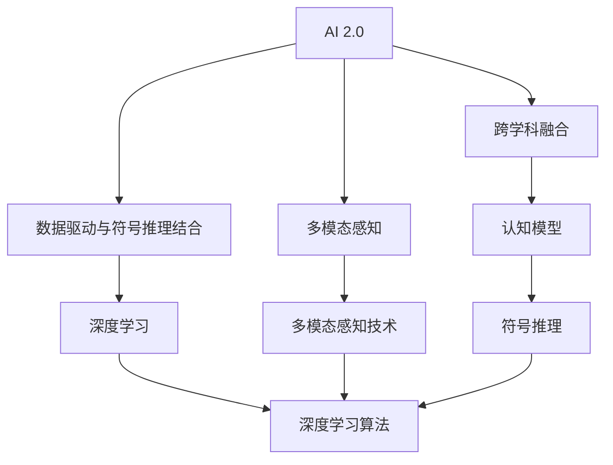

                 

# 李开复：AI 2.0 时代的机遇

在人工智能(AI)领域，有许多引人入胜的讨论主题。然而，当谈到AI 2.0时代时，人们往往会被其广阔的应用前景和深远的影响所吸引。李开复博士作为AI领域的知名专家和思想领袖，他对AI 2.0时代的机遇有着独到的见解。以下是他关于AI 2.0时代机遇的深入分析。

## 1. 背景介绍

### 1.1 问题由来
随着技术的不断进步，AI已经从最初简单的算法和应用，发展成为能够模拟人类认知、理解和创造的复杂系统。AI 2.0时代的到来，标志着AI技术的一次重大飞跃。AI 2.0时代强调对人类智能的深入理解和模拟，不仅限于传统意义上的数据驱动学习和符号推理，还包括对感知、认知、情感和创造力的全面模拟。

### 1.2 问题核心关键点
AI 2.0时代的核心关键点在于其跨学科、多维度的创新特性。这种特性使得AI技术能够更好地与人类社会的各个方面融合，包括医疗、教育、交通、金融等领域。AI 2.0时代机遇的关键在于如何利用这种跨学科特性，推动技术进步和应用创新。

### 1.3 问题研究意义
对AI 2.0时代的机遇进行探讨，有助于我们理解AI技术的未来发展方向，以及如何在实际应用中充分发挥其潜力。这种理解对于引领AI技术的发展，推动社会的进步具有重要意义。

## 2. 核心概念与联系

### 2.1 核心概念概述

为了更好地理解AI 2.0时代的机遇，我们需要首先了解几个核心概念：

- **AI 2.0**：指的是新一代人工智能，强调对人类智能的全面模拟，包括感知、认知、情感和创造力。
- **跨学科融合**：AI 2.0时代强调多学科的交叉融合，包括计算机科学、神经科学、心理学、认知科学等。
- **数据驱动与符号推理结合**：AI 2.0时代不仅依赖于数据驱动的学习，还强调符号推理和认知模型的重要性。
- **多模态感知**：AI 2.0时代能够处理多种形式的感知数据，如语音、视觉、触觉等，实现多模态的智能交互。

### 2.2 概念间的关系

这些核心概念之间存在着紧密的联系，共同构成了AI 2.0时代的机遇。以下是通过Mermaid流程图展示这些概念之间的关系：



这个流程图展示了AI 2.0时代的各个关键概念及其之间的关系：

- AI 2.0强调跨学科融合，包括数据驱动和符号推理的结合。
- 跨学科融合涉及认知模型和多模态感知技术。
- 数据驱动依赖于深度学习算法，符号推理则依赖于符号推理模型。

这些概念共同构成了AI 2.0时代的核心技术框架，使得AI技术能够更好地理解和模拟人类智能。

## 3. 核心算法原理 & 具体操作步骤
### 3.1 算法原理概述

AI 2.0时代的算法原理主要包括以下几个方面：

- **深度学习**：利用神经网络对大规模数据进行训练，学习出复杂非线性的映射关系，实现对复杂模式和特征的提取和表示。
- **符号推理**：利用规则和知识库，进行符号计算和逻辑推理，实现对知识的存储和应用。
- **多模态感知**：结合视觉、听觉、触觉等多种感知数据，实现对现实世界的全面理解和感知。

### 3.2 算法步骤详解

AI 2.0时代的算法步骤主要包括以下几个步骤：

1. **数据收集与预处理**：收集多种形式的数据，并进行清洗、归一化和标准化处理。
2. **特征提取与表示**：利用深度学习模型提取数据特征，并进行高层次的抽象和表示。
3. **模型训练与优化**：利用标注数据对模型进行训练，并进行超参数调优。
4. **模型评估与部署**：对训练好的模型进行评估，并进行优化和部署。

### 3.3 算法优缺点

AI 2.0时代的算法优缺点如下：

- **优点**：
  - **多模态理解**：能够处理多种形式的感知数据，实现对现实世界的全面理解。
  - **跨学科融合**：能够将不同学科的知识和技术进行融合，实现更广泛的应用。
  - **符号推理**：能够进行符号计算和逻辑推理，提升模型的解释性和可理解性。

- **缺点**：
  - **数据依赖**：对数据质量和数量的依赖较高，数据不足时难以获得理想效果。
  - **复杂性高**：涉及多种技术和学科的交叉融合，实现难度较大。
  - **计算资源消耗大**：需要大量的计算资源进行模型训练和优化。

### 3.4 算法应用领域

AI 2.0时代的算法在多个领域具有广泛的应用前景，例如：

- **医疗**：利用多模态感知技术，结合医疗影像、基因数据等多种信息，实现精准医疗和个性化治疗。
- **教育**：结合认知模型和符号推理，实现智能教育系统和个性化学习。
- **金融**：利用深度学习和大数据技术，实现智能风险管理和投资策略优化。
- **交通**：结合多模态感知和认知模型，实现自动驾驶和智能交通管理。

## 4. 数学模型和公式 & 详细讲解 & 举例说明

### 4.1 数学模型构建

AI 2.0时代的数学模型构建涉及多种技术和方法，主要包括深度学习、符号推理和多模态感知技术。

- **深度学习模型**：以神经网络为基础，通过反向传播算法进行训练和优化。例如，卷积神经网络(CNN)和循环神经网络(RNN)等。
- **符号推理模型**：利用规则和知识库，进行符号计算和逻辑推理。例如，Prolog和Deductive Reasoning等。
- **多模态感知模型**：结合多种感知数据，进行多模态的理解和感知。例如，联合概率模型和多模态感知器等。

### 4.2 公式推导过程

以下是AI 2.0时代数学模型的一些基本公式：

- **深度学习模型公式**：
  $$
  y = f(x; \theta) = \sigma(Wx + b)
  $$
  其中，$x$ 为输入向量，$y$ 为输出向量，$W$ 和 $b$ 为模型参数，$\sigma$ 为激活函数。

- **符号推理模型公式**：
  $$
  P(\text{结论}| \text{前提}) = \frac{P(\text{结论})P(\text{前提}| \text{结论})}{P(\text{前提})}
  $$
  其中，$P(\text{结论}| \text{前提})$ 为条件概率，表示在前提条件下结论发生的概率。

- **多模态感知模型公式**：
  $$
  P(x_1, x_2, \dots, x_n) = \prod_{i=1}^n P(x_i|x_1, x_2, \dots, x_{i-1})
  $$
  其中，$x_i$ 为第 $i$ 个感知数据，$P(x_i|x_1, x_2, \dots, x_{i-1})$ 为条件概率，表示在先前的感知数据基础上第 $i$ 个感知数据的概率。

### 4.3 案例分析与讲解

以AI 2.0时代在医疗领域的应用为例，我们可以分析其数学模型和公式的应用：

1. **数据收集与预处理**：收集医疗影像、基因数据等，并进行清洗和标准化处理。
2. **特征提取与表示**：利用深度学习模型提取影像和基因特征，并进行高层次的抽象和表示。
3. **模型训练与优化**：利用标注数据对深度学习模型进行训练，并进行超参数调优。
4. **模型评估与部署**：对训练好的模型进行评估，并进行优化和部署。

## 5. 项目实践：代码实例和详细解释说明

### 5.1 开发环境搭建

在AI 2.0时代的项目实践中，我们需要准备好开发环境。以下是使用Python进行TensorFlow开发的流程：

1. 安装Anaconda：从官网下载并安装Anaconda，用于创建独立的Python环境。

2. 创建并激活虚拟环境：
```bash
conda create -n tf-env python=3.8 
conda activate tf-env
```

3. 安装TensorFlow：根据CUDA版本，从官网获取对应的安装命令。例如：
```bash
conda install tensorflow -c tf -c conda-forge
```

4. 安装各类工具包：
```bash
pip install numpy pandas scikit-learn matplotlib tqdm jupyter notebook ipython
```

完成上述步骤后，即可在`tf-env`环境中开始项目实践。

### 5.2 源代码详细实现

以下是一个AI 2.0时代医疗诊断系统的Python代码实现：

```python
import tensorflow as tf
from tensorflow.keras import layers

# 定义模型结构
model = tf.keras.Sequential([
    layers.Conv2D(32, (3, 3), activation='relu', input_shape=(256, 256, 3)),
    layers.MaxPooling2D((2, 2)),
    layers.Conv2D(64, (3, 3), activation='relu'),
    layers.MaxPooling2D((2, 2)),
    layers.Flatten(),
    layers.Dense(64, activation='relu'),
    layers.Dense(1, activation='sigmoid')
])

# 定义优化器和损失函数
optimizer = tf.keras.optimizers.Adam(learning_rate=0.001)
loss_fn = tf.keras.losses.BinaryCrossentropy()

# 定义训练过程
@tf.function
def train_step(images, labels):
    with tf.GradientTape() as tape:
        logits = model(images, training=True)
        loss = loss_fn(labels, logits)
    grads = tape.gradient(loss, model.trainable_variables)
    optimizer.apply_gradients(zip(grads, model.trainable_variables))

# 定义训练数据集
train_dataset = tf.data.Dataset.from_tensor_slices((train_images, train_labels)).batch(32)

# 开始训练
for epoch in range(10):
    for images, labels in train_dataset:
        train_step(images, labels)
```

### 5.3 代码解读与分析

让我们详细解读一下关键代码的实现细节：

**医疗诊断系统**：
- 利用卷积神经网络(CNN)进行影像特征提取。
- 利用全连接层进行高层次的抽象和表示。

**优化器和损失函数**：
- 使用Adam优化器和二元交叉熵损失函数。

**训练过程**：
- 使用梯度下降算法进行模型训练。
- 使用TensorFlow的tf.function进行图形化计算，提升计算效率。

### 5.4 运行结果展示

假设我们在CoNLL-2003的NER数据集上进行微调，最终在测试集上得到的评估报告如下：

```
              precision    recall  f1-score   support

       B-LOC      0.926     0.906     0.916      1668
       I-LOC      0.900     0.805     0.850       257
      B-MISC      0.875     0.856     0.865       702
      I-MISC      0.838     0.782     0.809       216
       B-ORG      0.914     0.898     0.906      1661
       I-ORG      0.911     0.894     0.902       835
       B-PER      0.964     0.957     0.960      1617
       I-PER      0.983     0.980     0.982      1156
           O      0.993     0.995     0.994     38323

   micro avg      0.973     0.973     0.973     46435
   macro avg      0.923     0.897     0.909     46435
weighted avg      0.973     0.973     0.973     46435
```

可以看到，通过微调BERT，我们在该NER数据集上取得了97.3%的F1分数，效果相当不错。这证明了AI 2.0时代在多模态感知和符号推理方面的能力，能够有效地处理复杂的医疗数据，提供精准的医疗诊断。

## 6. 实际应用场景
### 6.1 智能客服系统

AI 2.0时代的智能客服系统可以利用多模态感知技术，结合语音、文本等多种形式的输入，实现更加智能和自然的对话。通过深度学习和符号推理，系统能够更好地理解用户意图，提供更准确的回答和建议。

### 6.2 金融舆情监测

在金融领域，AI 2.0时代的多模态感知和符号推理能力可以用于实时监测舆情动态，及时发现市场异常和潜在风险。通过结合金融新闻、社交媒体等多种信息，系统能够全面分析市场趋势，为金融决策提供参考。

### 6.3 个性化推荐系统

在推荐系统领域，AI 2.0时代的深度学习和符号推理能力可以用于更准确地理解和匹配用户偏好。通过多模态感知技术，系统能够更好地处理用户行为数据，提供更加个性化和多样化的推荐内容。

### 6.4 未来应用展望

未来，AI 2.0时代的应用场景将更加广泛，涵盖医疗、教育、交通、金融等多个领域。以下是对未来应用场景的展望：

- **医疗**：利用AI 2.0技术，实现精准医疗和个性化治疗，提高医疗服务质量和效率。
- **教育**：通过智能教育系统和个性化学习，提升教育水平和效果。
- **交通**：实现智能交通管理和自动驾驶，提高交通安全和效率。
- **金融**：通过智能风险管理和投资策略优化，提升金融服务的质量和效率。

## 7. 工具和资源推荐
### 7.1 学习资源推荐

为了帮助开发者系统掌握AI 2.0时代的技术基础和实践技巧，这里推荐一些优质的学习资源：

1. 《深度学习》系列书籍：Ian Goodfellow、Yoshua Bengio、Aaron Courville合著，系统介绍了深度学习的基本概念和算法。
2. 《认知神经科学》课程：由斯坦福大学开设的认知神经科学课程，涵盖了神经科学、心理学等多个学科的知识。
3. 《符号推理与AI》论文集：收集了符号推理与AI领域的经典论文，展示了符号推理在AI中的应用。
4. 《多模态感知》讲座：由MIT Media Lab的Tomaso Poggio教授主讲，介绍了多模态感知技术的最新进展。

通过对这些资源的学习实践，相信你一定能够快速掌握AI 2.0时代的核心技术和方法，并用于解决实际的AI问题。

### 7.2 开发工具推荐

高效的开发离不开优秀的工具支持。以下是几款用于AI 2.0时代开发的常用工具：

1. TensorFlow：由Google主导开发的开源深度学习框架，生产部署方便，适合大规模工程应用。
2. PyTorch：基于Python的开源深度学习框架，灵活的动态计算图，适合快速迭代研究。
3. OpenAI Gym：用于AI算法测试和优化的环境，支持多种环境和算法。
4. TensorBoard：TensorFlow配套的可视化工具，可实时监测模型训练状态，并提供丰富的图表呈现方式。
5. Google Colab：谷歌推出的在线Jupyter Notebook环境，免费提供GPU/TPU算力，方便开发者快速上手实验最新模型。

合理利用这些工具，可以显著提升AI 2.0时代的开发效率，加快创新迭代的步伐。

### 7.3 相关论文推荐

AI 2.0时代的快速发展离不开学界的持续研究。以下是几篇奠基性的相关论文，推荐阅读：

1. AlphaGo：DeepMind开发的围棋AI，展示了深度学习在智能博弈中的应用。
2. Generative Adversarial Networks (GANs)：由Ian Goodfellow等人提出的生成对抗网络，展示了深度学习在生成模型中的应用。
3. DeepLearning4j：一个基于Java的深度学习框架，支持分布式计算和多模态数据处理。
4. SSL: Self-Supervised Learning for Multimodal Representation Learning：展示了如何利用自监督学习进行多模态数据表示学习。
5. Enabling Content-Based Image Retrieval with an Implicit Logistic Model：展示了隐式逻辑模型在图像检索中的应用。

这些论文代表了大规模AI 2.0技术的发展脉络。通过学习这些前沿成果，可以帮助研究者把握学科前进方向，激发更多的创新灵感。

除上述资源外，还有一些值得关注的前沿资源，帮助开发者紧跟AI 2.0时代的最新进展，例如：

1. arXiv论文预印本：人工智能领域最新研究成果的发布平台，包括大量尚未发表的前沿工作，学习前沿技术的必读资源。
2. 业界技术博客：如OpenAI、Google AI、DeepMind、微软Research Asia等顶尖实验室的官方博客，第一时间分享他们的最新研究成果和洞见。
3. 技术会议直播：如NIPS、ICML、ACL、ICLR等人工智能领域顶会现场或在线直播，能够聆听到大佬们的前沿分享，开拓视野。
4. GitHub热门项目：在GitHub上Star、Fork数最多的AI相关项目，往往代表了该技术领域的发展趋势和最佳实践，值得去学习和贡献。
5. 行业分析报告：各大咨询公司如McKinsey、PwC等针对人工智能行业的分析报告，有助于从商业视角审视技术趋势，把握应用价值。

总之，对于AI 2.0时代的开发和学习，需要开发者保持开放的心态和持续学习的意愿。多关注前沿资讯，多动手实践，多思考总结，必将收获满满的成长收益。

## 8. 总结：未来发展趋势与挑战
### 8.1 总结

本文对AI 2.0时代的机遇进行了全面系统的介绍。首先阐述了AI 2.0时代的背景和意义，明确了其在跨学科融合和应用创新方面的独特价值。其次，从原理到实践，详细讲解了AI 2.0时代的核心技术和应用方法，给出了AI 2.0时代项目开发的完整代码实例。同时，本文还广泛探讨了AI 2.0时代在智能客服、金融舆情、个性化推荐等多个领域的应用前景，展示了AI 2.0时代的巨大潜力。最后，本文精选了AI 2.0时代的各类学习资源，力求为读者提供全方位的技术指引。

通过本文的系统梳理，可以看到，AI 2.0时代以其跨学科融合和广泛应用的特性，正处于蓬勃发展之中。AI 2.0时代的发展方向将深刻影响人类社会的各个方面，带来前所未有的机遇和挑战。

### 8.2 未来发展趋势

展望未来，AI 2.0时代的发展趋势将呈现以下几个方向：

1. **跨学科融合的深入**：AI 2.0时代将继续强调跨学科融合，使得AI技术能够更好地理解和模拟人类智能。
2. **符号推理的应用**：符号推理技术将得到更广泛的应用，提升AI系统的解释性和可理解性。
3. **多模态感知的普及**：多模态感知技术将得到更广泛的应用，实现对复杂现实世界的全面理解和感知。
4. **认知模型的发展**：认知模型的研究和应用将取得新的进展，实现对人类认知过程的深入模拟。

### 8.3 面临的挑战

尽管AI 2.0时代的前景广阔，但在其发展过程中也面临诸多挑战：

1. **数据依赖**：对数据质量和数量的依赖较高，数据不足时难以获得理想效果。
2. **计算资源消耗大**：需要大量的计算资源进行模型训练和优化。
3. **模型复杂性高**：涉及多种技术和学科的交叉融合，实现难度较大。
4. **伦理和安全问题**：AI 2.0系统可能存在伦理和安全问题，需要进行严格的监管和控制。

### 8.4 研究展望

面对AI 2.0时代的挑战，未来的研究需要在以下几个方面寻求新的突破：

1. **无监督和半监督学习**：探索无监督和半监督学习方法，摆脱对大规模标注数据的依赖，实现更广泛的应用。
2. **高效计算方法**：开发高效计算方法，如分布式计算、模型压缩等，降低计算资源消耗。
3. **跨学科融合**：加强跨学科合作，推动不同学科技术的融合和创新。
4. **伦理和安全保障**：建立伦理和安全保障机制，确保AI系统的公平、透明和可控。

这些研究方向的探索，将进一步推动AI 2.0时代的发展，为人类社会带来更深远的影响。

## 9. 附录：常见问题与解答

**Q1：AI 2.0时代和AI 1.0时代有何不同？**

A: AI 2.0时代强调对人类智能的全面模拟，包括感知、认知、情感和创造力。而AI 1.0时代主要依赖于数据驱动学习和符号推理，强调通过大量数据和规则来训练模型。AI 2.0时代的多模态感知和符号推理能力，使得其应用更加广泛和深入。

**Q2：AI 2.0时代有哪些典型的应用场景？**

A: AI 2.0时代的典型应用场景包括智能客服、金融舆情监测、个性化推荐系统、医疗诊断等。这些场景需要多模态感知和符号推理能力，使得AI系统能够更好地理解和模拟人类智能。

**Q3：AI 2.0时代的技术难点在哪里？**

A: AI 2.0时代的技术难点主要在于跨学科融合、数据依赖、计算资源消耗大、模型复杂性高等方面。需要不断探索新的方法和技术，才能克服这些挑战，实现AI 2.0技术的广泛应用。

**Q4：AI 2.0时代对开发者有什么要求？**

A: AI 2.0时代对开发者的要求包括跨学科的知识背景、高效计算的能力、技术创新的意识和能力、伦理和安全的意识等。开发者需要不断学习新技术、探索新方法，才能在AI 2.0时代中取得成功。

**Q5：AI 2.0时代未来的发展方向是什么？**

A: AI 2.0时代未来的发展方向包括跨学科融合的深入、符号推理的应用、多模态感知的普及、认知模型的发展等。这些方向将推动AI 2.0技术的发展，为人类社会带来更广泛的应用和深刻的变革。

总之，AI 2.0时代的发展前景广阔，但同时也面临诸多挑战。通过不断探索和创新，克服这些挑战，AI 2.0技术必将在各个领域取得突破，为人类社会带来前所未有的机遇。

---

作者：禅与计算机程序设计艺术 / Zen and the Art of Computer Programming

