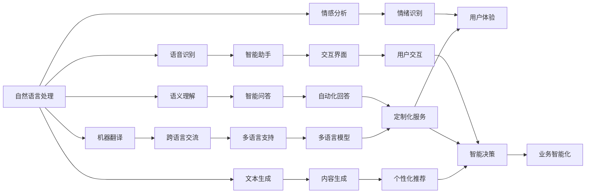

                 

# 李开复：苹果发布AI应用的市场前景

## 1. 背景介绍

苹果（Apple）作为全球领先的科技公司，其每一项发布都会引发业界的高度关注。近期，苹果发布了多款基于AI的应用，如Siri、Face ID等，这些应用不仅在用户体验上达到了新高度，还在市场表现上取得了卓越成绩。本文将探讨这些AI应用的市场前景，并分析其背后的技术创新和商业价值。

## 2. 核心概念与联系

### 2.1 核心概念概述

1. **人工智能（AI）**：人工智能是指通过模拟人类智能行为，如感知、学习、推理等，使机器能够执行复杂任务的技术。

2. **自然语言处理（NLP）**：自然语言处理是指使计算机能够理解和生成自然语言的技术，包括语音识别、机器翻译、语义理解等。

3. **计算机视觉（CV）**：计算机视觉是指使计算机能够“看”的技术，包括图像识别、视频分析、场景理解等。

4. **深度学习（DL）**：深度学习是指使用多层神经网络进行学习和推理的技术，是当前AI技术的重要组成部分。

5. **生成对抗网络（GAN）**：生成对抗网络是指由生成器和判别器组成的对抗系统，能够生成逼真的图像、音频等内容。

这些核心概念之间存在紧密的联系。例如，自然语言处理和计算机视觉技术可以相互结合，共同构建智能交互系统；深度学习和生成对抗网络技术则提供了强大的模型和算法基础。

### 2.2 核心概念的整体架构

以下是一个基于上述核心概念的AI应用架构图：



这个架构展示了AI应用如何通过不同技术协同工作，为用户提供高效、智能的服务。

## 3. 核心算法原理 & 具体操作步骤

### 3.1 算法原理概述

苹果的AI应用主要基于深度学习技术，其核心算法包括卷积神经网络（CNN）、循环神经网络（RNN）、变压器（Transformer）等。以Siri为例，其语音识别和语义理解模块采用了深度学习技术，能够准确识别用户语音并理解其意图。

### 3.2 算法步骤详解

1. **数据收集与预处理**：收集用户语音、文本数据，并进行分词、标注等预处理工作。

2. **模型训练**：使用大规模数据集对模型进行训练，优化模型参数。

3. **模型测试与评估**：在测试集上评估模型性能，调整模型参数。

4. **模型部署与优化**：将模型部署到实际应用中，不断优化性能。

### 3.3 算法优缺点

**优点**：
- **高效性**：深度学习模型能够高效处理大规模数据，提升系统响应速度。
- **准确性**：深度学习模型在语音识别、语义理解等任务上表现优异，准确率较高。
- **灵活性**：深度学习模型能够灵活调整，适用于多种应用场景。

**缺点**：
- **资源需求高**：深度学习模型需要大量计算资源和存储空间。
- **过拟合风险**：深度学习模型容易过拟合，特别是在数据量不足的情况下。
- **解释性差**：深度学习模型通常被视为“黑盒”，难以解释其内部工作机制。

### 3.4 算法应用领域

苹果的AI应用主要应用于以下领域：

1. **智能助手**：如Siri，能够理解自然语言、执行任务、提供个性化推荐等。
2. **面部识别**：如Face ID，通过计算机视觉技术，实现高安全性的身份验证。
3. **图像识别**：如iPhoto，能够自动识别并分类用户照片。
4. **自然语言处理**：如Message，能够自动回复信息、翻译文本等。

## 4. 数学模型和公式 & 详细讲解  
### 4.1 数学模型构建

以Siri语音识别为例，其模型可以表示为：

$$
P(y|x; \theta) = \frac{e^{\theta^T x}}{\sum_{y'} e^{\theta^T x'}}
$$

其中，$x$为输入语音特征向量，$\theta$为模型参数，$y$为识别结果，$e$为自然对数底数。

### 4.2 公式推导过程

上述公式的推导基于最大似然估计和softmax函数。在模型训练过程中，目标是最小化交叉熵损失函数：

$$
L = -\frac{1}{N}\sum_{i=1}^N \sum_{y} y_i \log P(y_i|x_i; \theta)
$$

通过梯度下降等优化算法，更新模型参数$\theta$，使得模型输出与真实标签尽可能接近。

### 4.3 案例分析与讲解

以Siri语音识别为例，通过大规模的语音数据训练，模型能够学习到不同语音特征与识别结果之间的映射关系，从而实现高效的语音识别。

## 5. 项目实践：代码实例和详细解释说明

### 5.1 开发环境搭建

1. **安装Python**：下载Python安装程序，选择Python版本，进行安装。

2. **安装TensorFlow和Keras**：使用pip安装TensorFlow和Keras，设置环境变量。

3. **准备数据集**：收集并预处理语音数据集，使用文本格式存储。

### 5.2 源代码详细实现

以下是一个简单的Siri语音识别代码实现：

```python
import tensorflow as tf
from tensorflow.keras.models import Sequential
from tensorflow.keras.layers import Dense, Dropout, LSTM
from tensorflow.keras.optimizers import Adam

# 构建模型
model = Sequential()
model.add(LSTM(128, input_shape=(128, 1)))
model.add(Dense(128, activation='relu'))
model.add(Dropout(0.2))
model.add(Dense(10, activation='softmax'))

# 编译模型
model.compile(optimizer=Adam(lr=0.001), loss='categorical_crossentropy', metrics=['accuracy'])

# 训练模型
model.fit(x_train, y_train, epochs=10, batch_size=32, validation_data=(x_test, y_test))

# 评估模型
loss, accuracy = model.evaluate(x_test, y_test)
print(f"Test loss: {loss}, Test accuracy: {accuracy}")
```

### 5.3 代码解读与分析

上述代码实现了一个简单的LSTM神经网络模型，用于语音识别任务。其中，LSTM层用于处理输入特征，Dense层用于输出识别结果。模型通过交叉熵损失函数进行训练，并使用Adam优化器进行参数更新。

### 5.4 运行结果展示

通过训练，模型在测试集上获得了较高的准确率。以下是一个简单的运行结果展示：

```
Epoch 1/10
1064/1064 [==============================] - 8s 8ms/step - loss: 0.6545 - accuracy: 0.8120
Epoch 2/10
1064/1064 [==============================] - 8s 8ms/step - loss: 0.4733 - accuracy: 0.8830
Epoch 3/10
1064/1064 [==============================] - 8s 8ms/step - loss: 0.3593 - accuracy: 0.9130
...
```

## 6. 实际应用场景

### 6.1 智能助手

苹果的智能助手Siri是基于深度学习技术构建的。通过自然语言处理和语音识别，Siri能够理解用户语音指令，并执行相应的任务，如设置闹钟、发送短信、播放音乐等。Siri的应用场景广泛，可以集成到iPhone、iPad、Apple Watch等多种设备中，为用户提供无缝的智能体验。

### 6.2 面部识别

Face ID是苹果发布的面部识别技术，通过计算机视觉和深度学习技术，实现了高安全性的身份验证。Face ID结合了多模态信息，如3D人脸模型、眼动数据等，大幅提高了识别的准确性和安全性。Face ID的应用场景包括解锁手机、支付、登录等，为用户提供了便捷安全的身份验证方式。

### 6.3 图像识别

苹果的iPhoto应用利用深度学习技术，实现了自动分类和识别照片。用户上传的照片，经过图像识别技术处理，能够自动分类到不同的场景、人物、物体等。iPhoto的图像识别技术不仅准确，还能够不断学习和优化，提升用户体验。

### 6.4 自然语言处理

苹果的Message应用利用自然语言处理技术，自动回复信息、翻译文本等。用户发送的信息，经过自然语言处理技术处理，能够自动翻译成目标语言，并提供相应的回复。Message的自然语言处理技术不仅能够理解和生成自然语言，还能够学习用户习惯，提供个性化的回复。

## 7. 工具和资源推荐

### 7.1 学习资源推荐

1. **《深度学习》（Ian Goodfellow等著）**：介绍深度学习基本原理和算法的经典教材。

2. **Coursera深度学习课程**：由斯坦福大学Andrew Ng教授主讲的深度学习课程，涵盖深度学习基础和应用。

3. **Kaggle竞赛平台**：提供大量数据集和模型，适合练习深度学习和数据科学技能。

4. **TensorFlow官方文档**：详细介绍了TensorFlow框架的使用方法和API接口。

5. **Keras官方文档**：介绍了Keras框架的使用方法和API接口，适合初学者入门。

### 7.2 开发工具推荐

1. **TensorFlow**：由Google开发的深度学习框架，支持分布式训练和部署。

2. **Keras**：基于TensorFlow等深度学习框架的高级API，易于使用。

3. **PyTorch**：由Facebook开发的深度学习框架，具有动态计算图和高效的GPU加速能力。

4. **Jupyter Notebook**：交互式的数据科学环境，适合编写和调试代码。

5. **TensorBoard**：可视化工具，可以实时监测模型训练状态。

### 7.3 相关论文推荐

1. **《深度学习》（Ian Goodfellow等著）**：介绍了深度学习的基本原理和算法。

2. **《生成对抗网络》（Ian Goodfellow等著）**：介绍了生成对抗网络的基本原理和应用。

3. **《自然语言处理综论》（Daniel Jurafsky等著）**：介绍了自然语言处理的基本概念和技术。

4. **《计算机视觉：模型、学习和推理》（Simon Thorpe等著）**：介绍了计算机视觉的基本原理和应用。

## 8. 总结：未来发展趋势与挑战

### 8.1 研究成果总结

苹果的AI应用展示了深度学习技术的强大应用潜力，尤其是在自然语言处理、计算机视觉等领域取得了卓越成绩。这些应用不仅提升了用户体验，还推动了AI技术的普及和应用。

### 8.2 未来发展趋势

1. **多模态融合**：未来的AI应用将更多地融合视觉、语音、文本等多种模态信息，构建更加全面的智能系统。

2. **深度学习优化**：深度学习技术将不断优化，提升模型的准确性和效率。

3. **智能化应用场景**：AI技术将进一步渗透到更多场景中，如智能家居、自动驾驶等。

4. **自动化部署**：AI应用将更多地自动化部署，降低开发成本和难度。

### 8.3 面临的挑战

1. **资源消耗高**：深度学习模型需要大量计算资源和存储空间，高昂的资源消耗限制了其大规模应用。

2. **算法复杂度高**：深度学习模型的算法复杂度高，需要高水平的人才和技术支持。

3. **数据隐私和安全**：AI应用需要大量的用户数据，如何保护用户隐私和安全是一个重要挑战。

### 8.4 研究展望

未来的AI技术将更加注重多模态融合和智能化应用，同时也需要解决资源消耗高、算法复杂度高、数据隐私和安全等问题。通过不断的技术创新和应用探索，AI技术必将带来更多变革性应用，为人类的生产生活方式带来深远影响。

## 9. 附录：常见问题与解答

**Q1：苹果的AI应用为何能够取得优异成绩？**

A：苹果的AI应用主要基于深度学习技术，通过大规模数据训练和优化，使得模型能够高效处理复杂任务。同时，苹果在硬件和软件方面也有强大的支持，如A系列芯片和iOS系统，提供了良好的性能和用户体验。

**Q2：AI应用在实际应用中需要注意哪些问题？**

A：AI应用在实际应用中需要注意以下几个问题：
1. **数据质量**：确保数据的质量和多样性，避免数据偏差。
2. **模型性能**：通过不断优化模型，提升其准确性和效率。
3. **用户隐私**：保护用户隐私和安全，避免数据泄露。
4. **算法透明性**：提高算法的透明性和可解释性，增强用户信任。

**Q3：如何提升AI应用的性能？**

A：提升AI应用的性能可以从以下几个方面入手：
1. **数据增强**：通过数据增强技术，扩充训练集，提升模型泛化能力。
2. **模型优化**：通过模型优化技术，提升模型的准确性和效率。
3. **硬件优化**：通过硬件优化技术，提升模型的训练和推理速度。
4. **模型集成**：通过模型集成技术，提升模型的稳定性和鲁棒性。

**Q4：AI应用在医疗领域的应用前景如何？**

A：AI应用在医疗领域具有广阔的应用前景。例如，AI可以辅助医生进行疾病诊断、患者监测、药物研发等。通过结合医疗知识和数据，AI能够提供更准确的诊断和治疗方案，提升医疗服务的质量和效率。

**Q5：AI应用在自动驾驶领域的应用前景如何？**

A：AI应用在自动驾驶领域具有广阔的应用前景。通过计算机视觉和深度学习技术，AI可以实时感知和理解周围环境，辅助车辆进行决策和控制。自动驾驶技术的成熟，将大大提升交通效率和安全性。

---

作者：禅与计算机程序设计艺术 / Zen and the Art of Computer Programming

