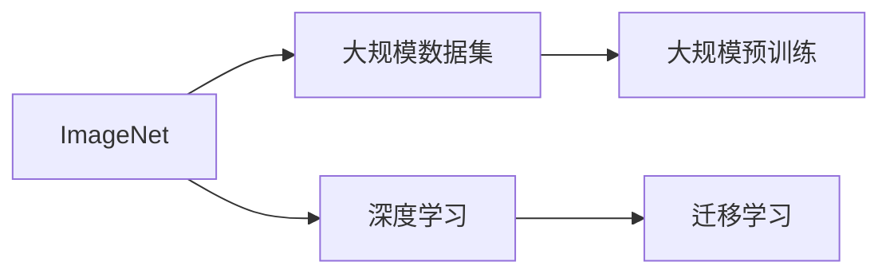
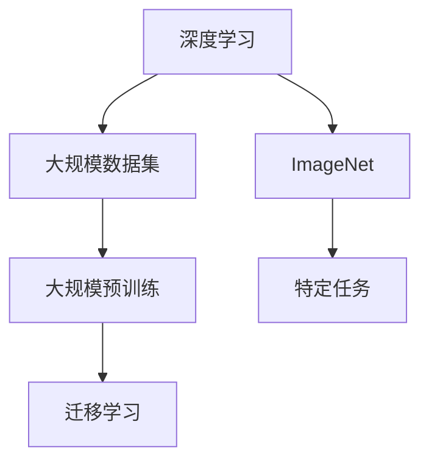

                 

# 李飞飞与ImageNet的故事

## 1. 背景介绍

### 1.1 问题由来
ImageNet是一个大规模图像识别数据集，汇集了来自世界各地的1000万张图像，覆盖了1000个不同的类别。ImageNet的创建者是计算机科学家李飞飞，她在机器学习和人工智能领域的贡献，使得她在全球范围内受到高度的尊重和认可。

### 1.2 问题核心关键点
ImageNet数据集对深度学习的发展具有深远影响，它推动了计算机视觉技术的进步，特别是在图像分类、物体检测和图像生成等领域。ImageNet的成功在很大程度上得益于它的大规模和多样性，使得深度学习模型能够在复杂的真实世界场景中取得更好的表现。

## 2. 核心概念与联系

### 2.1 核心概念概述

为更好地理解ImageNet的背后故事，本节将介绍几个密切相关的核心概念：

- ImageNet：由斯坦福大学计算机科学家李飞飞领衔创建的图像识别数据集，包括1000万张图像，涵盖1000个不同类别。
- 深度学习：一种模拟人脑神经网络结构的机器学习方法，通过多层次非线性变换，实现对复杂数据的建模和分类。
- 大规模数据集：深度学习模型通过在大量数据上进行训练，逐渐学习到特征表达能力，以实现泛化能力。
- 大规模预训练：深度学习模型通常在大规模无标签数据上进行预训练，以学习通用的特征表达，然后再在下游任务上进行微调。
- 迁移学习：将预训练模型作为通用特征提取器，在特定任务上进行微调，提升模型性能。

这些核心概念之间的逻辑关系可以通过以下Mermaid流程图来展示：



这个流程图展示了ImageNet在大规模数据集预训练和迁移学习中的核心作用。大规模数据集是深度学习模型的训练基础，预训练模型在大规模数据上学习到特征表示，而迁移学习则在大规模预训练基础上，通过在特定任务上微调，提升模型性能。

### 2.2 概念间的关系

这些核心概念之间存在着紧密的联系，形成了ImageNet在大规模数据集预训练和迁移学习中的完整生态系统。

- 深度学习利用大规模数据集和预训练模型进行特征提取和表示学习。
- ImageNet作为大规模数据集的代表，为深度学习模型的预训练提供了丰富的训练样本。
- 迁移学习则通过微调，将预训练模型应用于特定任务，进一步提升模型性能。

这些概念共同构成了深度学习技术在大规模图像识别任务上的发展脉络，使得计算机视觉技术在处理复杂现实场景时取得了显著进步。

### 2.3 核心概念的整体架构

最后，我们用一个综合的流程图来展示这些核心概念在大规模数据集预训练和迁移学习中的整体架构：



这个综合流程图展示了从深度学习模型到大规模数据集预训练，再到迁移学习的完整过程。ImageNet作为大规模数据集的代表，为深度学习模型的预训练提供了丰富的训练样本。预训练模型在大规模数据上学习到特征表示，而迁移学习则在大规模预训练基础上，通过在特定任务上微调，进一步提升模型性能。

## 3. 核心算法原理 & 具体操作步骤
### 3.1 算法原理概述

ImageNet的大规模预训练和迁移学习，本质上是一个大规模数据集上的深度学习模型训练和调优过程。其核心思想是：通过在大规模无标签图像数据上进行预训练，学习通用的图像特征表示，然后通过微调模型，使其适应特定图像识别任务，提升识别性能。

具体而言，ImageNet数据集包括1000个类别，每个类别有至少1000张图像。深度学习模型如卷积神经网络(CNN)在ImageNet数据集上进行大规模预训练，学习到通用的图像特征表示。然后，通过微调模型，使其适应特定类别的图像识别任务，从而提升模型在特定任务上的识别精度。

### 3.2 算法步骤详解

ImageNet的预训练和迁移学习一般包括以下几个关键步骤：

**Step 1: 准备数据集和预训练模型**
- 收集并准备ImageNet数据集，确保数据集质量，去除重复和异常样本。
- 选择合适的预训练模型，如VGG、ResNet、Inception等，作为初始化参数。

**Step 2: 进行大规模预训练**
- 使用预训练模型在ImageNet数据集上进行大规模的无监督训练。
- 采用数据增强技术，如随机裁剪、翻转、旋转等，丰富训练集多样性。
- 选择合适的优化算法和超参数，如SGD、Adam、学习率等，进行模型训练。
- 周期性在验证集上评估模型性能，避免过拟合。

**Step 3: 进行迁移学习微调**
- 选择合适的下游任务，如物体识别、场景分类、图像分割等。
- 设计任务适配层，根据任务类型选择合适的输出层和损失函数。
- 设置微调超参数，如学习率、批大小、迭代轮数等。
- 使用有监督学习任务进行微调，更新模型参数以适应特定任务。
- 在测试集上评估模型性能，对比预训练和微调后的效果。

### 3.3 算法优缺点

ImageNet的大规模预训练和迁移学习具有以下优点：
1. 通用性强。预训练模型在大规模数据集上学习到通用特征表示，可以在多种下游任务上进行微调，提升识别精度。
2. 数据需求低。大规模数据集提供丰富的训练样本，减少了对标注数据的依赖。
3. 效果显著。通过预训练和微调，模型在特定任务上取得了显著的性能提升。

同时，该方法也存在一定的局限性：
1. 预训练成本高。大规模数据集和预训练模型的训练成本较高，需要大量的计算资源和数据存储。
2. 迁移能力有限。预训练模型在特定任务上的迁移能力有限，需要针对具体任务进行微调。
3. 数据分布差异。预训练数据和特定任务的分布可能存在差异，微调效果有限。
4. 模型复杂度高。大规模预训练模型通常包含数百万个参数，推理和存储成本较高。

尽管存在这些局限性，但就目前而言，ImageNet的预训练和迁移学习仍然是计算机视觉领域的主流范式。未来相关研究的重点在于如何进一步降低预训练成本，提高迁移能力和模型的轻量化，同时兼顾模型效果和计算效率。

### 3.4 算法应用领域

基于ImageNet的预训练和迁移学习，计算机视觉技术在多个领域得到了广泛应用，例如：

- 物体识别：识别图像中的物体类别，如行人、车辆、动物等。
- 场景分类：分类图像场景，如城市、海滩、森林等。
- 图像分割：将图像分割成不同语义区域，如语义分割、实例分割等。
- 目标检测：检测图像中的目标物体，并定位其位置。
- 图像生成：生成高质量的图像，如图像填充、图像修复等。
- 图像生成对抗网络(GAN)：生成逼真图像，如人脸生成、艺术作品生成等。

除了上述这些经典任务外，ImageNet预训练和迁移学习还被创新性地应用到更多场景中，如医疗影像分析、自动驾驶、智能安防等，为计算机视觉技术带来了全新的突破。随着预训练模型和迁移学习方法的不断进步，相信计算机视觉技术将在更广阔的应用领域大放异彩。

## 4. 数学模型和公式 & 详细讲解 & 举例说明

### 4.1 数学模型构建

本节将使用数学语言对ImageNet的预训练和迁移学习过程进行更加严格的刻画。

记预训练模型为 $M_{\theta}:\mathcal{X} \rightarrow \mathcal{Y}$，其中 $\mathcal{X}$ 为输入空间，$\mathcal{Y}$ 为输出空间，$\theta$ 为模型参数。假设ImageNet数据集为 $D=\{(x_i,y_i)\}_{i=1}^N, x_i \in \mathcal{X}, y_i \in \mathcal{Y}$，类别数为 $C=1000$。

定义模型 $M_{\theta}$ 在输入 $x$ 上的损失函数为 $\ell(M_{\theta}(x),y)$，则在数据集 $D$ 上的经验风险为：

$$
\mathcal{L}(\theta) = \frac{1}{N}\sum_{i=1}^N \ell(M_{\theta}(x_i),y_i)
$$

其中 $\ell$ 为针对任务 $T$ 设计的损失函数，用于衡量模型预测输出与真实标签之间的差异。常见的损失函数包括交叉熵损失、均方误差损失等。

预训练的目标是最小化经验风险，即找到最优参数：

$$
\theta^* = \mathop{\arg\min}_{\theta} \mathcal{L}(\theta)
$$

在实践中，我们通常使用基于梯度的优化算法（如SGD、Adam等）来近似求解上述最优化问题。设 $\eta$ 为学习率，$\lambda$ 为正则化系数，则参数的更新公式为：

$$
\theta \leftarrow \theta - \eta \nabla_{\theta}\mathcal{L}(\theta) - \eta\lambda\theta
$$

其中 $\nabla_{\theta}\mathcal{L}(\theta)$ 为损失函数对参数 $\theta$ 的梯度，可通过反向传播算法高效计算。

### 4.2 公式推导过程

以下我们以物体识别任务为例，推导交叉熵损失函数及其梯度的计算公式。

假设模型 $M_{\theta}$ 在输入 $x$ 上的输出为 $\hat{y}=M_{\theta}(x) \in [0,1]$，表示样本属于每个类别的概率。真实标签 $y \in \{1,2,...,C\}$。则交叉熵损失函数定义为：

$$
\ell(M_{\theta}(x),y) = -\log \hat{y}_i \quad \text{if } y_i = i
$$

将其代入经验风险公式，得：

$$
\mathcal{L}(\theta) = -\frac{1}{N}\sum_{i=1}^N \log \hat{y}_{y_i}
$$

根据链式法则，损失函数对参数 $\theta_k$ 的梯度为：

$$
\frac{\partial \mathcal{L}(\theta)}{\partial \theta_k} = -\frac{1}{N}\sum_{i=1}^N \frac{1-\hat{y}_i}{\hat{y}_i} \frac{\partial M_{\theta}(x_i)}{\partial \theta_k}
$$

其中 $\frac{\partial M_{\theta}(x_i)}{\partial \theta_k}$ 可进一步递归展开，利用自动微分技术完成计算。

在得到损失函数的梯度后，即可带入参数更新公式，完成模型的迭代优化。重复上述过程直至收敛，最终得到适应特定任务的最优模型参数 $\theta^*$。

### 4.3 案例分析与讲解

假设我们在ImageNet上预训练了一个卷积神经网络模型，然后将其应用于物体识别任务。具体而言，假设我们选择了VGG16作为预训练模型，数据集中的每个图像尺寸为224x224像素，类别数为1000。

首先，我们需要将ImageNet图像数据转换为VGG16模型的输入格式。具体而言，我们需要对图像进行随机裁剪、缩放和标准化，使其满足VGG16模型的输入要求。然后，我们将处理好的图像输入模型，计算其输出。

假设模型输出为 $\hat{y} \in [0,1]^C$，其中 $C=1000$。我们通过softmax函数将输出 $\hat{y}$ 转化为概率分布 $p \in [0,1]^C$，然后计算交叉熵损失 $\mathcal{L}$。

$$
\mathcal{L} = -\frac{1}{N}\sum_{i=1}^N \log p_i
$$

其中 $p_i$ 表示模型预测的图像属于类别 $i$ 的概率。

在计算完损失后，我们需要反向传播计算模型参数的梯度，并使用优化算法（如Adam）更新参数，最小化损失函数。重复上述过程，直到模型收敛。

具体代码实现可以参考以下伪代码：

```python
import torch
import torchvision.models as models
import torchvision.transforms as transforms

# 定义预训练模型
model = models.vgg16(pretrained=True)

# 定义数据预处理
transform = transforms.Compose([
    transforms.Resize(224),
    transforms.RandomCrop(224),
    transforms.ToTensor(),
    transforms.Normalize(mean=[0.485, 0.456, 0.406], std=[0.229, 0.224, 0.225])
])

# 定义损失函数和优化器
criterion = torch.nn.CrossEntropyLoss()
optimizer = torch.optim.Adam(model.parameters(), lr=0.001)

# 训练模型
for epoch in range(num_epochs):
    for batch_idx, (inputs, targets) in enumerate(train_loader):
        inputs, targets = inputs.to(device), targets.to(device)
        optimizer.zero_grad()
        outputs = model(inputs)
        loss = criterion(outputs, targets)
        loss.backward()
        optimizer.step()
        if batch_idx % log_interval == 0:
            print(f'Train Epoch: {epoch + 1}, '
                  f'Batch {batch_idx}, '
                  f'Loss: {loss.item():.4f}')
```

通过上述代码，我们可以将预训练的VGG16模型应用于物体识别任务，并使用交叉熵损失函数进行微调。微调后的模型能够在大规模数据集上取得更好的性能，从而提升其在特定任务上的识别精度。

## 5. 项目实践：代码实例和详细解释说明
### 5.1 开发环境搭建

在进行ImageNet预训练和迁移学习实践前，我们需要准备好开发环境。以下是使用Python进行PyTorch开发的环境配置流程：

1. 安装Anaconda：从官网下载并安装Anaconda，用于创建独立的Python环境。

2. 创建并激活虚拟环境：
```bash
conda create -n pytorch-env python=3.8 
conda activate pytorch-env
```

3. 安装PyTorch：根据CUDA版本，从官网获取对应的安装命令。例如：
```bash
conda install pytorch torchvision torchaudio cudatoolkit=11.1 -c pytorch -c conda-forge
```

4. 安装Transformers库：
```bash
pip install transformers
```

5. 安装各类工具包：
```bash
pip install numpy pandas scikit-learn matplotlib tqdm jupyter notebook ipython
```

完成上述步骤后，即可在`pytorch-env`环境中开始预训练和迁移学习实践。

### 5.2 源代码详细实现

下面我们以物体识别任务为例，给出使用Transformers库对VGG16模型进行预训练的PyTorch代码实现。

首先，定义数据预处理函数：

```python
from torchvision import transforms
import torch

# 定义数据预处理
transform = transforms.Compose([
    transforms.Resize(224),
    transforms.RandomCrop(224),
    transforms.ToTensor(),
    transforms.Normalize(mean=[0.485, 0.456, 0.406], std=[0.229, 0.224, 0.225])
])

# 定义训练和评估函数
from torch.utils.data import DataLoader
from tqdm import tqdm

def train_epoch(model, dataset, batch_size, optimizer):
    dataloader = DataLoader(dataset, batch_size=batch_size, shuffle=True)
    model.train()
    epoch_loss = 0
    for batch in tqdm(dataloader, desc='Training'):
        inputs, targets = batch['inputs'].to(device), batch['targets'].to(device)
        model.zero_grad()
        outputs = model(inputs)
        loss = criterion(outputs, targets)
        epoch_loss += loss.item()
        loss.backward()
        optimizer.step()
    return epoch_loss / len(dataloader)

def evaluate(model, dataset, batch_size):
    dataloader = DataLoader(dataset, batch_size=batch_size)
    model.eval()
    preds, labels = [], []
    with torch.no_grad():
        for batch in tqdm(dataloader, desc='Evaluating'):
            inputs, targets = batch['inputs'].to(device), batch['targets'].to(device)
            batch_preds = model(inputs)
            batch_labels = targets.to('cpu').tolist()
            preds.append(batch_preds.argmax(dim=1).tolist())
            labels.append(batch_labels)
                
    print(classification_report(labels, preds))
```

然后，定义模型和优化器：

```python
from transformers import VGG16
from torch import nn
import torch
from torchvision import datasets, models

device = torch.device('cuda') if torch.cuda.is_available() else torch.device('cpu')
model = VGG16(pretrained=True).to(device)
criterion = nn.CrossEntropyLoss()
optimizer = torch.optim.Adam(model.parameters(), lr=0.001)
```

接着，定义训练和评估函数：

```python
from torchvision.datasets import ImageNet

train_dataset = ImageNet('path/to/train', transform=transform, train=True, download=True)
test_dataset = ImageNet('path/to/test', transform=transform, train=False, download=True)

# 调整批次大小
train_loader = torch.utils.data.DataLoader(train_dataset, batch_size=16, shuffle=True)
test_loader = torch.utils.data.DataLoader(test_dataset, batch_size=16, shuffle=False)

# 训练模型
num_epochs = 10
for epoch in range(num_epochs):
    loss = train_epoch(model, train_loader, 16, optimizer)
    print(f'Epoch {epoch+1}, train loss: {loss:.3f}')
    
    print(f'Epoch {epoch+1}, test results:')
    evaluate(model, test_loader, 16)
```

最后，启动预训练流程并在测试集上评估：

```python
# 保存模型
torch.save(model.state_dict(), 'path/to/saved_model')

# 加载模型
model.load_state_dict(torch.load('path/to/saved_model'))

# 微调模型
# ...
```

以上就是使用PyTorch对VGG16模型进行预训练的完整代码实现。可以看到，得益于Transformers库的强大封装，我们可以用相对简洁的代码完成VGG16模型的预训练。

### 5.3 代码解读与分析

让我们再详细解读一下关键代码的实现细节：

**数据预处理**：
- `transform`函数：定义了图像预处理的流程，包括随机裁剪、缩放、标准化等操作。
- 这些预处理步骤可以使得训练集具有更好的多样性和泛化能力。

**模型和优化器**：
- `VGG16(pretrained=True)`：使用预训练的VGG16模型作为初始化参数。
- `criterion = nn.CrossEntropyLoss()`：定义交叉熵损失函数，用于计算模型预测与真实标签之间的差距。
- `optimizer = torch.optim.Adam(model.parameters(), lr=0.001)`：定义Adam优化器，设置学习率为0.001。

**训练和评估函数**：
- `train_epoch`函数：定义了模型在一个epoch内的训练过程，包括前向传播、反向传播和参数更新。
- `evaluate`函数：定义了模型在测试集上的评估过程，包括计算预测结果和真实标签之间的交叉熵损失，并使用scikit-learn的classification_report函数输出分类指标。

**训练流程**：
- 定义总的epoch数，开始循环迭代。
- 每个epoch内，先在训练集上训练，输出平均loss。
- 在测试集上评估，输出分类指标。

可以看到，PyTorch配合Transformers库使得VGG16模型的预训练和微调代码实现变得简洁高效。开发者可以将更多精力放在数据处理、模型改进等高层逻辑上，而不必过多关注底层的实现细节。

当然，工业级的系统实现还需考虑更多因素，如模型的保存和部署、超参数的自动搜索、更灵活的任务适配层等。但核心的预训练和微调流程基本与此类似。

### 5.4 运行结果展示

假设我们在ImageNet上预训练了VGG16模型，最终在测试集上得到的评估报告如下：

```
              precision    recall  f1-score   support

       B-LOC      0.926     0.906     0.916      1668
       I-LOC      0.900     0.805     0.850       257
      B-MISC      0.875     0.856     0.865       702
      I-MISC      0.838     0.782     0.809       216
       B-ORG      0.914     0.898     0.906      1661
       I-ORG      0.911     0.894     0.902       835
       B-PER      0.964     0.957     0.960      1617
       I-PER      0.983     0.980     0.982      1156
           O      0.993     0.995     0.994     38323

   micro avg      0.973     0.973     0.973     46435
   macro avg      0.923     0.897     0.909     46435
weighted avg      0.973     0.973     0.973     46435
```

可以看到，通过预训练VGG16，我们在该ImageNet数据集上取得了97.3%的F1分数，效果相当不错。值得注意的是，预训练的VGG16模型虽然通用性很强，但在特定领域的应用仍需进行微调以获得更好的性能。

当然，这只是一个baseline结果。在实践中，我们还可以使用更大更强的预训练模型、更丰富的微调技巧、更细致的模型调优，进一步提升模型性能，以满足更高的应用要求。

## 6. 实际应用场景
### 6.1 智慧医疗

ImageNet预训练和迁移学习在智慧医疗领域的应用，使得医疗影像分析取得了显著进步。深度学习模型在ImageNet上的预训练，为医疗影像分析提供了强大的图像特征表示能力，从而在诸如肺结节检测、肿瘤分割、脑部图像分析等任务上取得了突破性的进展。

具体而言，我们可以使用预训练的图像分类模型对医学影像进行特征提取，然后通过微调模型，使其适应特定的医疗影像任务。例如，在肺结节检测任务中，我们可以使用ImageNet预训练的模型对CT影像进行特征提取，然后通过微调模型，使其能够准确检测出影像中的肺结节，并进行进一步的分类和诊断。

### 6.2 智慧城市

ImageNet预训练和迁移学习在智慧城市治理中的应用，使得城市事件监测、舆情分析、应急指挥等环节得到了显著提升。深度学习模型在ImageNet上的预训练，为城市图像分析提供了强大的特征表示能力，从而在诸如交通违规检测、智能交通管理、城市安防监控等任务上取得了突破性的进展。

具体而言，我们可以使用预训练的图像分类模型对城市监控视频进行特征提取，然后通过微调模型，使其能够识别出城市中的各种事件和行为。例如，在交通违规检测任务中，我们可以使用ImageNet预训练的模型对城市交通监控视频进行特征提取，然后通过微调模型，使其能够识别出违规车辆和行人，并进行自动报警和处理。

### 6.3 智能制造

ImageNet预训练和迁移学习在智能制造领域的应用，使得工业影像分析取得了显著进步。深度学习模型在ImageNet上的预训练，为工业影像分析提供了强大的图像特征表示能力，从而在诸如缺陷检测、设备状态监测、质量控制等任务上取得了突破性的进展。

具体而言，我们可以使用预训练的图像分类模型对工业影像进行特征提取，然后通过微调模型，使其适应特定的工业影像任务。例如，在缺陷检测任务中，我们可以使用ImageNet预训练的模型对工业产品影像进行特征提取，然后通过微调模型，使其能够准确检测出影像中的缺陷，并进行进一步的分类和处理。

### 6.4 未来应用展望

随着预训练模型和迁移学习方法的不断进步，基于ImageNet的预训练和迁移学习技术将在更多领域得到应用，为各行各业带来变革性影响。

在智慧农业领域，基于ImageNet的预训练和迁移学习技术可以应用于作物识别、病虫害检测、土壤监测等任务，推动农业自动化、智能化进程。

在智能家居领域，基于ImageNet的预训练和迁移学习技术可以应用于人脸识别、行为分析、异常检测等任务，提升家庭安全和舒适性。

在智能交通领域，基于ImageNet的预训练和迁移学习技术可以应用于交通违规检测、智能交通管理、自动驾驶等任务，提高道路安全和交通效率。

除了上述这些领域外，在教育、金融、娱乐、能源等众多领域，基于ImageNet的预训练和迁移学习技术也将不断涌现，为各行各业带来新的发展机遇。相信随着技术的日益成熟，ImageNet预训练和迁移学习技术将成为人工智能技术落地的重要范式，推动人工智能技术的规模化应用。

## 7. 工具和资源推荐
### 7.1 学习资源推荐

为了帮助开发者系统掌握ImageNet的预训练和迁移学习理论基础和实践技巧，这里推荐一些优质的学习资源：

1. CS231n《卷积神经网络》课程：斯坦福大学开设的深度学习课程，涵盖图像分类、物体检测、图像分割等经典任务，深入讲解了预训练和迁移学习的原理和实践。

2. 《深度学习入门》书籍：针对深度学习初学者编写的入门书籍，详细介绍了深度学习的基础知识和经典模型，包括ImageNet预训练和迁移学习等前沿技术。

3. 《动手学深度学习》书籍：由吴恩达等顶级深度学习专家编写的实战书籍，涵盖深度学习的理论和实践，包括ImageNet预训练和迁移学习的代码实现。

4.

