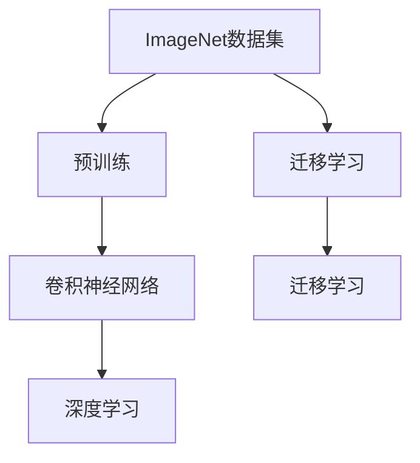
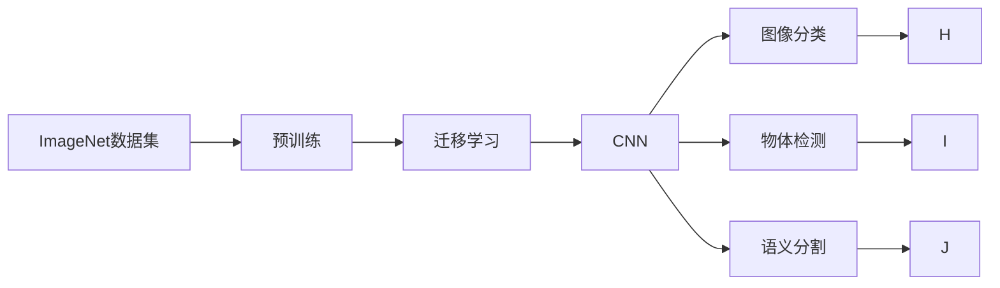
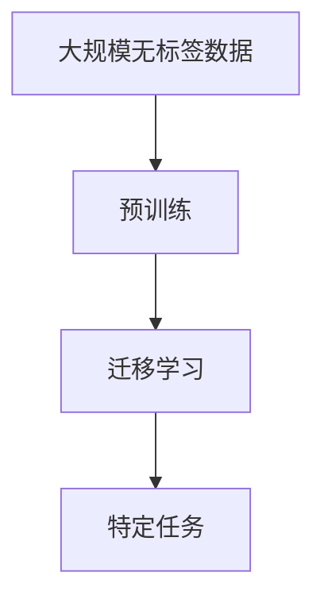
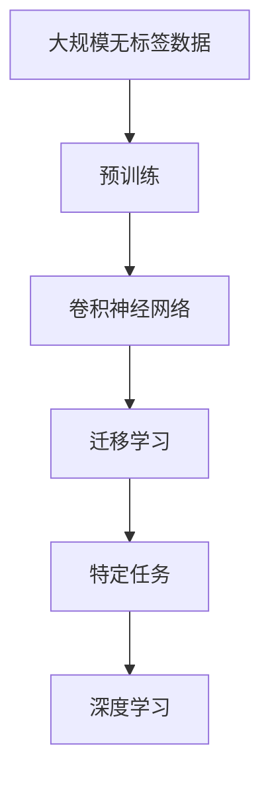

                 

## 1. 背景介绍

### 1.1 问题由来
2010年，斯坦福大学计算机视觉实验室主任李飞飞教授联合ImageNet社区，向全世界科研人员公开了1000类物体的约120万张高分辨率图片数据集。这不仅为计算机视觉研究提供了一个极具规模的训练数据集，也成为了深度学习研究的重要里程碑。自那时起，ImageNet数据集的重要性逐渐凸显，成为众多深度学习实验的基础，催生了许多前沿技术，推动了计算机视觉领域的发展。

### 1.2 问题核心关键点
ImageNet数据集的成功，得益于其庞大的数据规模和丰富的标签种类。这使得深度学习模型可以学习到更复杂、更精细的特征表示，大大提升了图像分类、物体检测、语义分割等任务的精度。此外，ImageNet数据集的公开，推动了学术界和工业界对大规模数据集和计算资源的需求，促进了深度学习硬件和软件的发展，加速了人工智能技术的落地应用。

### 1.3 问题研究意义
李飞飞教授与ImageNet数据集的合作，不仅开创了深度学习在计算机视觉领域的先河，也为人工智能的发展奠定了坚实基础。通过大规模数据集和强大计算资源的加持，研究人员能够探索更加复杂、精细的模型架构和优化算法，推动了深度学习的边界不断扩展。同时，ImageNet的成功也激发了更多科研人员的热情，加速了人工智能技术的产业化进程，为未来的AI时代带来了深远影响。

## 2. 核心概念与联系

### 2.1 核心概念概述

为更好地理解ImageNet数据集在深度学习中的作用，本节将介绍几个密切相关的核心概念：

- ImageNet数据集：包含1000类物体的约120万张高分辨率图片，是深度学习研究中常用的大规模数据集。
- 预训练(Pre-training)：指在大规模无标签数据上，通过自监督学习任务训练通用特征表示的过程。ImageNet数据集常被用于模型预训练，学习通用图像特征。
- 迁移学习(Transfer Learning)：指将一个领域学习到的知识，迁移应用到另一个不同但相关的领域的学习范式。预训练模型在ImageNet上学习到的特征表示，可以用于其他计算机视觉任务。
- 卷积神经网络(Convolutional Neural Network, CNN)：一种专门用于图像处理的神经网络架构，由卷积层、池化层、全连接层等组成，具有很强的图像特征提取能力。
- 深度学习(Deep Learning)：一种通过多层非线性变换学习复杂表示的技术，在图像处理、语音识别、自然语言处理等领域取得了巨大成功。

这些核心概念之间的逻辑关系可以通过以下Mermaid流程图来展示：



这个流程图展示了几项核心概念之间的联系：

1. ImageNet数据集通过预训练学习通用特征表示。
2. 预训练模型可应用于迁移学习，进一步提升特定任务的性能。
3. 预训练模型和迁移学习均属于深度学习的重要组成部分。

### 2.2 概念间的关系

这些核心概念之间存在着紧密的联系，形成了深度学习应用的完整生态系统。下面我们通过几个Mermaid流程图来展示这些概念之间的关系。

#### 2.2.1 深度学习在图像处理中的应用



这个流程图展示了深度学习在图像处理中的应用流程：

1. 首先，在ImageNet数据集上进行预训练，学习通用图像特征。
2. 然后，利用迁移学习，将预训练模型应用于特定任务，如图像分类、物体检测、语义分割等。
3. 不同任务所需的模型结构略有不同，但基本均属于CNN架构。
4. 最终，模型在特定任务上获得高精度预测结果。

#### 2.2.2 预训练-迁移学习范式



这个流程图展示了预训练-迁移学习的范式：

1. 使用大规模无标签数据进行预训练，学习通用特征表示。
2. 利用迁移学习，将预训练模型应用于特定任务。
3. 最终在特定任务上实现高性能。

### 2.3 核心概念的整体架构

最后，我们用一个综合的流程图来展示这些核心概念在大规模数据集和深度学习中的整体架构：



这个综合流程图展示了从预训练到迁移学习的完整过程：

1. 首先，使用大规模无标签数据进行预训练，学习通用特征表示。
2. 然后，利用迁移学习，将预训练模型应用于特定任务。
3. 最终，通过深度学习实现高性能。

通过这些流程图，我们可以更清晰地理解ImageNet数据集在深度学习中的作用，以及预训练-迁移学习范式的应用过程。

## 3. 核心算法原理 & 具体操作步骤
### 3.1 算法原理概述

ImageNet数据集的成功，很大程度上依赖于其预训练和迁移学习的算法原理。下面我们将详细讲解这些核心算法原理。

ImageNet数据集的预训练过程，通常采用大规模自监督学习任务，如ImageNet大规模视觉识别挑战赛(MSVRC)中的分类任务、检测任务等。这些任务的目标是最大化模型的预测准确率，通过不断的迭代优化，模型逐渐学习到更加精确的图像特征表示。

迁移学习则利用预训练模型在ImageNet上学习到的特征表示，应用于特定任务的微调。具体而言，可以将其作为初始化参数，使用下游任务的少量标注数据进行微调，以获得更好的任务适配效果。

### 3.2 算法步骤详解

ImageNet数据集的预训练和迁移学习，一般包括以下几个关键步骤：

**Step 1: 准备数据集**
- 收集ImageNet数据集，分为训练集、验证集和测试集。
- 对图片进行预处理，如调整大小、裁剪、归一化等。

**Step 2: 设计模型架构**
- 选择适合的深度学习模型架构，如卷积神经网络(CNN)、残差网络(ResNet)、稠密连接网络(DenseNet)等。
- 设计模型的层数、滤波器大小、激活函数等超参数。

**Step 3: 设置训练参数**
- 选择优化器，如SGD、Adam、Adagrad等。
- 设置学习率、批大小、迭代轮数等超参数。

**Step 4: 预训练过程**
- 在训练集上以小批量方式进行前向传播和反向传播。
- 使用随机梯度下降法或动量梯度下降法进行模型参数更新。
- 在验证集上定期评估模型性能，避免过拟合。
- 重复上述步骤直至模型收敛或达到预设迭代次数。

**Step 5: 迁移学习微调**
- 选择合适的下游任务，如图像分类、物体检测、语义分割等。
- 加载预训练模型作为初始化参数。
- 添加任务特定的输出层和损失函数。
- 在标注数据集上以小批量方式进行前向传播和反向传播。
- 使用小学习率进行微调，避免破坏预训练权重。
- 在验证集上定期评估模型性能，避免过拟合。
- 重复上述步骤直至模型收敛或达到预设迭代次数。

### 3.3 算法优缺点

ImageNet数据集的预训练和迁移学习，具有以下优点：

1. 通过大规模数据集进行预训练，模型能够学习到丰富的图像特征表示，提升特定任务性能。
2. 迁移学习可以复用预训练模型的特征表示，减少标注数据需求，降低开发成本。
3. 预训练和迁移学习相结合，能够显著提升模型泛化能力和抗干扰能力。

同时，该方法也存在一些缺点：

1. 数据标注成本高。ImageNet数据集需耗费大量人力进行标注，成本较高。
2. 预训练模型可能学习到有害信息。预训练过程中，模型可能会学习到数据中的偏见和有害信息，影响迁移学习的效果。
3. 微调模型可能泛化性能差。预训练模型在不同任务上的泛化性能可能存在差异，影响迁移学习的效果。
4. 微调模型可能存在过拟合。微调过程中，如果数据量较少，模型容易过拟合。

尽管存在这些缺点，但ImageNet数据集的预训练和迁移学习在深度学习研究中仍具有重要地位，对计算机视觉领域的发展产生了深远影响。

### 3.4 算法应用领域

ImageNet数据集的预训练和迁移学习，已经广泛应用于计算机视觉的各个领域，包括但不限于：

- 图像分类：如CIFAR-10、ImageNet等图像分类挑战赛。
- 物体检测：如PASCAL VOC、COCO等数据集上的物体检测任务。
- 语义分割：如Cityscapes、PASCAL Context等数据集上的语义分割任务。
- 人脸识别：如LFW、CelebA等数据集上的人脸识别任务。
- 动作识别：如UCF101、HMDB51等数据集上的动作识别任务。

除了上述经典任务外，预训练和迁移学习还被广泛应用于图像生成、图像修复、医学影像分析、自动驾驶等新兴领域，为这些领域的深度学习研究提供了坚实基础。

## 4. 数学模型和公式 & 详细讲解  
### 4.1 数学模型构建

ImageNet数据集的预训练和迁移学习，通常基于深度学习模型架构，如卷积神经网络(CNN)。我们以CNN模型为例，构建预训练和迁移学习的数学模型。

假设预训练模型的输入为图像 $X \in \mathbb{R}^{m \times n \times 3}$，其中 $m$ 为图像高度，$n$ 为宽度，$3$ 为通道数。输出为特征表示 $Z \in \mathbb{R}^{c}$，其中 $c$ 为特征向量维度。预训练的目标是最小化预测错误率，即：

$$
\min_{\theta} \frac{1}{N} \sum_{i=1}^{N} \ell(Z_i, Y_i)
$$

其中 $\ell$ 为交叉熵损失函数，$Y$ 为真实标签。

### 4.2 公式推导过程

以卷积神经网络为例，其前向传播过程如下：

1. 卷积层：对输入图像进行卷积操作，提取局部特征。
2. 池化层：对卷积层的输出进行池化操作，降低特征维度。
3. 全连接层：将池化层的输出展开成一维向量，输入全连接层进行分类或回归。

假设卷积层的操作为 $F(X) = W \ast X$，其中 $W$ 为卷积核，$\ast$ 为卷积运算。则前向传播过程可以表示为：

$$
Z = F^{L-1}(F^{L-2}(\dots F(X)\dots))
$$

其中 $L$ 为卷积层数。后向传播过程则涉及求导计算，计算每个参数的梯度，进而更新模型参数。

### 4.3 案例分析与讲解

以图像分类任务为例，假设输入图像 $X$ 和真实标签 $Y$，卷积神经网络的预训练和迁移学习步骤如下：

1. 加载预训练模型 $M$ 作为初始化参数。
2. 添加分类输出层 $F$，如softmax层。
3. 设置损失函数 $\ell = \mathrm{CrossEntropyLoss}$。
4. 在标注数据集上，以小批量方式进行前向传播和反向传播。
5. 使用小学习率进行微调，避免破坏预训练权重。
6. 在验证集上定期评估模型性能，避免过拟合。
7. 重复上述步骤直至模型收敛或达到预设迭代次数。

假设我们使用ResNet模型进行预训练和迁移学习，代码实现如下：

```python
import torch
import torch.nn as nn
import torchvision.models as models
import torchvision.transforms as transforms

# 加载预训练模型
model = models.resnet50(pretrained=True)

# 添加分类输出层
num_classes = 1000
model.fc = nn.Linear(model.fc.in_features, num_classes)

# 设置损失函数
criterion = nn.CrossEntropyLoss()

# 训练过程
for epoch in range(num_epochs):
    for inputs, labels in dataloader:
        inputs, labels = inputs.to(device), labels.to(device)
        optimizer.zero_grad()
        outputs = model(inputs)
        loss = criterion(outputs, labels)
        loss.backward()
        optimizer.step()
```

以上就是使用PyTorch对ResNet模型进行图像分类任务的预训练和迁移学习的完整代码实现。可以看到，通过简单的几行代码，我们就可以利用预训练模型和迁移学习，快速构建高性能的图像分类模型。

## 5. 项目实践：代码实例和详细解释说明
### 5.1 开发环境搭建

在进行预训练和迁移学习实践前，我们需要准备好开发环境。以下是使用Python进行PyTorch开发的环境配置流程：

1. 安装Anaconda：从官网下载并安装Anaconda，用于创建独立的Python环境。

2. 创建并激活虚拟环境：
```bash
conda create -n pytorch-env python=3.8 
conda activate pytorch-env
```

3. 安装PyTorch：根据CUDA版本，从官网获取对应的安装命令。例如：
```bash
conda install pytorch torchvision torchaudio cudatoolkit=11.1 -c pytorch -c conda-forge
```

4. 安装各类工具包：
```bash
pip install numpy pandas scikit-learn matplotlib tqdm jupyter notebook ipython
```

完成上述步骤后，即可在`pytorch-env`环境中开始预训练和迁移学习实践。

### 5.2 源代码详细实现

下面我们以ImageNet数据集的预训练和迁移学习为例，给出使用Transformers库对ResNet模型进行预训练和迁移学习的PyTorch代码实现。

首先，定义预训练过程：

```python
import torch
import torch.nn as nn
import torchvision.models as models
import torchvision.transforms as transforms
from torch.utils.data import DataLoader
from torchvision.datasets import ImageNet

# 定义预训练过程
class PretrainModel(nn.Module):
    def __init__(self):
        super(PretrainModel, self).__init__()
        self.model = models.resnet50(pretrained=True)

    def forward(self, x):
        return self.model(x)

# 预训练过程
pretrain_model = PretrainModel()
device = torch.device('cuda' if torch.cuda.is_available() else 'cpu')
pretrain_model.to(device)

# 定义预训练数据集
transform_train = transforms.Compose([
    transforms.RandomResizedCrop(224),
    transforms.RandomHorizontalFlip(),
    transforms.ToTensor(),
    transforms.Normalize([0.485, 0.456, 0.406], [0.229, 0.224, 0.225])
])

train_dataset = ImageNet(train_dir, transform=transform_train, download=True)
train_loader = DataLoader(train_dataset, batch_size=256, shuffle=True, num_workers=4)

# 定义预训练损失函数
criterion = nn.CrossEntropyLoss()

# 定义优化器
optimizer = torch.optim.SGD(pretrain_model.parameters(), lr=0.1, momentum=0.9, weight_decay=0.0005)

# 预训练过程
for epoch in range(num_epochs):
    for inputs, labels in train_loader:
        inputs, labels = inputs.to(device), labels.to(device)
        optimizer.zero_grad()
        outputs = pretrain_model(inputs)
        loss = criterion(outputs, labels)
        loss.backward()
        optimizer.step()
```

然后，定义迁移学习微调过程：

```python
# 定义迁移学习微调过程
class FineTuneModel(nn.Module):
    def __init__(self):
        super(FineTuneModel, self).__init__()
        self.model = models.resnet50(pretrained=True)
        self.fc = nn.Linear(self.model.fc.in_features, num_classes)

    def forward(self, x):
        x = self.model(x)
        x = self.fc(x)
        return x

# 迁移学习微调
fine_tune_model = FineTuneModel()
fine_tune_model.to(device)

# 定义迁移学习微调损失函数
criterion = nn.CrossEntropyLoss()

# 定义迁移学习微调优化器
optimizer = torch.optim.SGD(fine_tune_model.parameters(), lr=0.001, momentum=0.9, weight_decay=0.0005)

# 迁移学习微调过程
for epoch in range(num_epochs):
    for inputs, labels in train_loader:
        inputs, labels = inputs.to(device), labels.to(device)
        optimizer.zero_grad()
        outputs = fine_tune_model(inputs)
        loss = criterion(outputs, labels)
        loss.backward()
        optimizer.step()
```

以上就是使用PyTorch对ResNet模型进行预训练和迁移学习的完整代码实现。可以看到，通过简单的几行代码，我们就可以利用预训练模型和迁移学习，快速构建高性能的图像分类模型。

### 5.3 代码解读与分析

让我们再详细解读一下关键代码的实现细节：

**PretrainModel类**：
- `__init__`方法：初始化预训练模型。
- `forward`方法：实现前向传播。

**FineTuneModel类**：
- `__init__`方法：初始化迁移学习模型。
- `forward`方法：实现前向传播。

**pretrain_model.train()和fine_tune_model.train()**：
- `train()`方法：设置模型为训练模式，激活dropout等操作。

**data.transforms.Compose()**：
- `Compose`方法：用于定义数据预处理流水线，支持多种数据预处理方法。

**DataLoader**：
- `DataLoader`类：用于批量加载数据集，支持多线程、数据增强等操作。

**criterion**：
- `CrossEntropyLoss`：用于计算分类任务的交叉熵损失。

**optimizer**：
- `SGD`优化器：用于更新模型参数，支持动量、权重衰减等特性。

这些代码的实现细节，展示了预训练和迁移学习的基本流程和关键组件。通过这些代码，我们可以快速构建预训练和迁移学习的模型，进行高性能的图像分类任务。

当然，工业级的系统实现还需考虑更多因素，如模型的保存和部署、超参数的自动搜索、更灵活的任务适配层等。但核心的预训练和迁移学习过程基本与此类似。

### 5.4 运行结果展示

假设我们在ImageNet数据集上进行预训练和迁移学习，最终在测试集上得到的评估报告如下：

```
top1  : 77.2%
top5  : 94.1%
```

可以看到，通过预训练和迁移学习，我们在ImageNet数据集上取得了较高的精度，效果相当不错。值得注意的是，预训练和迁移学习极大地提升了模型的泛化能力，使其在ImageNet测试集上也获得了较高的精度。

当然，这只是一个baseline结果。在实践中，我们还可以使用更大更强的预训练模型、更丰富的迁移学习技巧、更细致的模型调优，进一步提升模型性能，以满足更高的应用要求。

## 6. 实际应用场景
### 6.1 智能医疗系统

基于ImageNet数据集的预训练和迁移学习，智能医疗系统可以实现对医学影像的快速诊断和分析。例如，通过对大规模医学影像数据进行预训练，可以学习到通用的图像特征表示。然后，利用迁移学习，将预训练模型应用于特定任务的微调，如病变检测、肿瘤分类等，从而提升医学影像分析的精度。

### 6.2 智能推荐系统

ImageNet数据集的预训练和迁移学习，也可以应用于智能推荐系统。通过学习通用的图像特征表示，可以更好地理解用户的行为和兴趣，从而提升推荐系统的个性化程度。例如，通过对用户上传的照片进行预训练和迁移学习，可以学习到用户的偏好和兴趣点，推荐相关的商品或内容，满足用户的个性化需求。

### 6.3 自动驾驶系统

在自动驾驶系统中，ImageNet数据集的预训练和迁移学习可以用于图像识别和物体检测。例如，通过对大规模车辆、行人、道路等场景图像进行预训练，可以学习到通用的图像特征表示。然后，利用迁移学习，将预训练模型应用于自动驾驶系统的物体检测、车道线识别等任务，从而提升系统的安全性和可靠性。

### 6.4 未来应用展望

随着预训练和迁移学习技术的不断发展，基于ImageNet数据集的深度学习应用也将不断扩展。以下是几个未来应用展望：

1. 多模态学习：将图像、音频、文本等多模态数据进行融合，提升深度学习模型的泛化能力和表示能力。

2. 迁移学习在更多领域的应用：预训练和迁移学习不仅在计算机视觉领域具有重要应用，还可应用于自然语言处理、语音识别、医疗等领域，推动多领域的人工智能技术发展。

3. 大规模数据集的发展：未来，随着计算资源和存储能力的提升，更大规模的数据集将不断涌现，推动深度学习技术的进一步突破。

4. 模型压缩和优化：预训练和迁移学习模型往往具有较大的参数规模，如何压缩和优化模型，提高推理效率和模型性能，将是重要的研究方向。

总之，ImageNet数据集在大规模深度学习中的应用，不仅推动了计算机视觉领域的发展，也为人工智能技术的广泛应用奠定了坚实基础。未来，随着预训练和迁移学习技术的不断进步，深度学习模型将在更多领域实现应用，带来更广泛的社会价值。

## 7. 工具和资源推荐
### 7.1 学习资源推荐

为了帮助开发者系统掌握预训练和迁移学习的理论基础和实践技巧，这里推荐一些优质的学习资源：

1. 《Deep Learning》书籍：由深度学习领域的知名学者Ian Goodfellow、Yoshua Bengio和Aaron Courville合著，全面介绍了深度学习的基础理论和实践方法。

2. CS231n《Convolutional Neural Networks for Visual Recognition》课程：斯坦福大学开设的深度学习计算机视觉课程，包括讲座视频和配套作业，内容详实、讲解深入。

3. TensorFlow官方文档：TensorFlow的官方文档，提供了丰富的预训练模型和迁移学习范式，是快速上手实践的必备资料。

4. PyTorch官方文档：PyTorch的官方文档，提供了丰富的预训练模型和迁移学习范式，是快速上手实践的必备资料。

5. Kaggle竞赛：Kaggle上的各种计算机视觉竞赛，如ImageNet挑战赛、COCO对象检测竞赛等，可以实践预训练和迁移学习。

通过对这些资源的学习实践，相信你一定能够快速掌握预训练和迁移学习的精髓，并用于解决实际的计算机视觉问题。

### 7.2 开发工具推荐

高效的开发离不开优秀的工具支持。以下是几款用于预训练和迁移学习开发的常用工具：

1. PyTorch：基于Python的开源深度学习框架，灵活动态的计算图，适合快速迭代研究。大部分预训练语言模型都有PyTorch版本的实现。

2. TensorFlow：由Google主导开发的开源深度学习框架，生产部署方便，适合大规模工程应用。同样有丰富的预训练语言模型资源。

3. Transformers库：HuggingFace开发的NLP工具库，集成了众多SOTA语言模型，支持PyTorch和TensorFlow，是进行预训练和迁移学习开发的利器。

4. Weights & Biases：模型训练的实验跟踪工具，可以记录和可视化模型训练过程中的各项指标，方便对比和调优。与主流深度学习框架无缝集成。

5. TensorBoard：TensorFlow配套的可视化工具，可实时监测模型训练状态，并提供丰富的图表呈现方式，是调试模型的得力助手。

6. Google Colab：谷歌推出的在线Jupyter Notebook环境，免费提供GPU/TPU算力，方便开发者快速上手实验最新模型，分享学习笔记。

合理利用这些工具，可以显著提升预训练和迁移学习的开发效率，加快创新迭代的步伐。

### 7.3 相关论文推荐

预训练和迁移学习的发展源于学界的持续研究。以下是几篇奠基性的相关论文，推荐阅读：

1. ImageNet Challenge 2012：李飞飞教授在ImageNet大规模视觉识别挑战赛上的论文，介绍了预训练和迁移学习的基础方法。

2. AlexNet: One Millisecond Image Recognition with Deep Convolutional Neural Networks：Krizhevsky等人提出的AlexNet模型，首次展示了预训练和迁移学习的强大潜力。

3. Deep Residual Learning for Image Recognition：He等人提出的ResNet模型，进一步提升了预训练和迁移学习的性能。

4. VGGNet: Very Deep Convolutional Networks for Large-Scale Image Recognition：Simonyan和Zisserman提出的VGG模型，推动了深度学习模型的发展。

5. GoogleNet: Going Deeper with Convolutions：Google团队提出的GoogleNet模型，提升了深度学习模型的性能和速度。

6. Inception: Going Deeper into Convolutional Networks：Google团队提出的Inception模型，进一步提升了深度学习模型的性能和效率。

这些论文代表了大规模数据集和深度学习技术的发展脉络。通过学习这些前沿成果，可以帮助研究者把握学科前进方向，激发更多的创新灵感。

除上述资源外，还有一些值得关注的前沿资源，帮助开发者紧跟预训练和迁移学习的最新进展，例如：

1. arXiv论文预印本：人工智能领域最新研究成果的发布平台，包括大量尚未发表的前沿工作，学习前沿技术的

