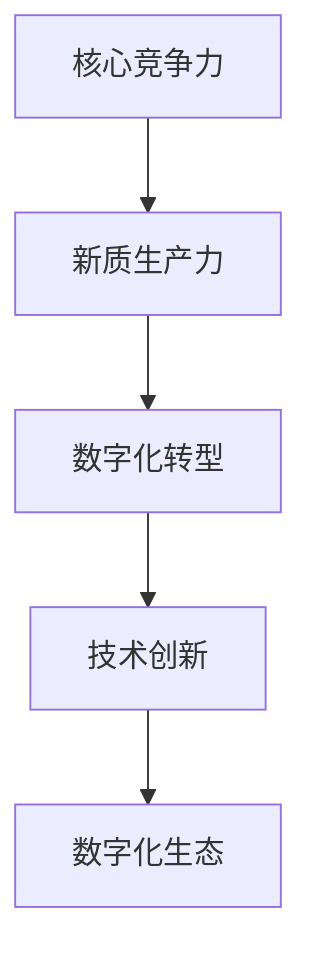
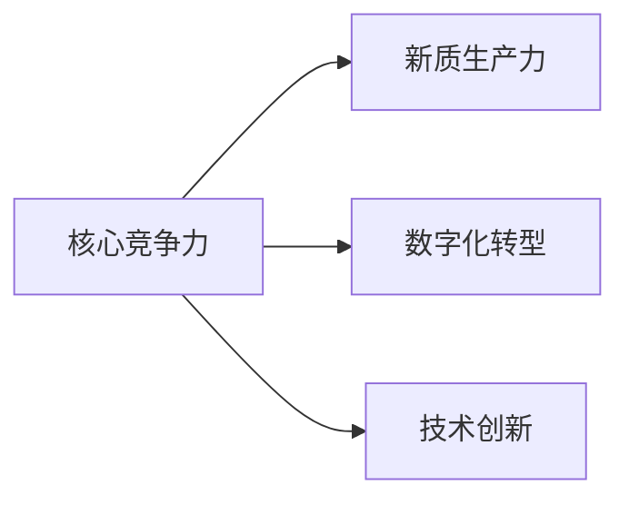
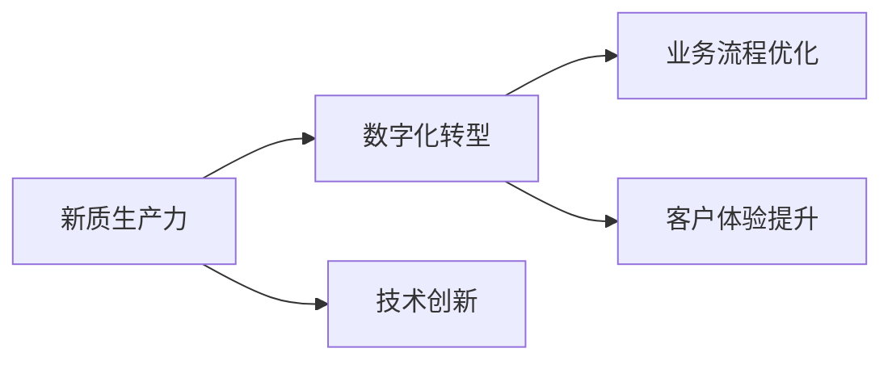
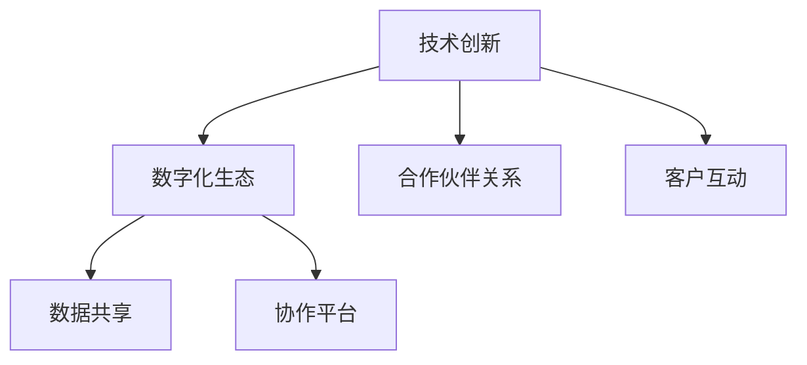

                 

# 核心竞争力与新质生产力

> 关键词：核心竞争力,新质生产力,技术创新,数字化转型,企业战略

## 1. 背景介绍

### 1.1 问题由来

在当今快速变化和高度竞争的商业环境中，企业如何获取和维持核心竞争力，以应对市场变化和挑战，成为每一个企业领导者必须深入思考的问题。核心竞争力是指企业在某个特定领域或业务中的独特能力和资源，使其能够在市场上获得竞争优势。然而，在数字化时代，技术变革和市场需求的快速变化使得传统核心竞争力面临巨大挑战，企业需要不断寻找新的竞争力和增长动力。

### 1.2 问题核心关键点

核心竞争力的定义和实现，涉及企业战略、技术创新、组织文化等多个层面。传统上，企业往往依赖于物理资产、品牌声誉和独特的商业模式等传统核心竞争力获取市场优势。然而，在数字时代，随着互联网和人工智能技术的普及，企业需要更加关注数字化转型和新质生产力的打造。新质生产力是指企业通过数字化手段，在生产、运营、营销等方面实现效率提升和价值创造的能力。

## 2. 核心概念与联系

### 2.1 核心概念概述

为更好地理解数字化时代企业核心竞争力和新质生产力的构建，本节将介绍几个关键概念：

- **核心竞争力**：企业在某一特定领域的独特能力和资源，能够产生竞争优势。常见核心竞争力包括技术优势、品牌影响力、供应链效率、客户忠诚度等。
- **新质生产力**：通过数字化手段，如自动化、大数据分析、人工智能等，提升企业的生产效率和市场响应能力，创造新的价值。
- **数字化转型**：企业通过引入数字化技术，重塑业务流程、提升组织效率、增强客户体验的过程。
- **技术创新**：企业不断探索新技术、开发新产品、优化现有产品和服务的过程。
- **数字化生态**：企业与其数字化合作伙伴、客户、供应商等共同构建的数字化生态系统。

这些概念之间的联系可以通过以下Mermaid流程图来展示：



这个流程图展示了大企业在构建核心竞争力和新质生产力的过程中，数字化转型和技术创新起到了关键作用。数字化生态的构建，则为企业提供了更广阔的发展空间和资源。

### 2.2 概念间的关系

这些核心概念之间存在着紧密的联系，形成了企业数字化竞争力的完整生态。下面我们通过几个Mermaid流程图来展示这些概念之间的关系。

#### 2.2.1 核心竞争力与新质生产力



这个流程图展示了核心竞争力与新质生产力之间的双向关系。核心竞争力通过数字化转型和技术创新转化为新质生产力，新质生产力又反哺核心竞争力，形成良性循环。

#### 2.2.2 新质生产力与数字化转型



这个流程图展示了新质生产力通过技术创新实现数字化转型，数字化转型通过优化业务流程和提升客户体验，进一步增强新质生产力。

#### 2.2.3 技术创新与数字化生态



这个流程图展示了技术创新如何构建数字化生态。技术创新通过构建合作伙伴关系和客户互动平台，实现数据共享和协作平台的建立，从而进一步增强数字化生态。

## 3. 核心算法原理 & 具体操作步骤
### 3.1 算法原理概述

构建企业核心竞争力和新质生产力的关键在于技术创新和数字化转型。技术创新包括产品研发、流程优化、供应链管理等，而数字化转型则涉及企业战略、组织结构、流程管理、文化建设等方面。通过科学的方法和工具，可以有效推进这两个过程，从而提升企业的核心竞争力和新质生产力。

### 3.2 算法步骤详解

构建企业核心竞争力和新质生产力的主要步骤如下：

**Step 1: 评估现有能力**

- 分析企业现有的核心竞争力，评估其在市场和技术上的优势和劣势。
- 识别企业数字化水平，包括信息技术基础设施、数字化工具和应用、员工数字化素养等。

**Step 2: 定义目标和策略**

- 基于现有能力评估结果，设定明确的数字化转型和新质生产力提升目标。
- 制定详细的数字化转型策略，包括业务流程优化、产品数字化、客户体验提升等。

**Step 3: 技术选型与规划**

- 选择合适的技术平台和工具，如云计算、大数据、人工智能等。
- 进行详细的技术规划，包括数据架构、系统集成、安全合规等方面。

**Step 4: 实施与执行**

- 分阶段实施数字化转型项目，确保每个阶段都有明确的目标和可衡量的成果。
- 采用敏捷开发和DevOps方法，快速响应市场变化和技术创新需求。

**Step 5: 评估与反馈**

- 定期评估数字化转型和新质生产力的进展，进行数据分析和效果评估。
- 收集反馈意见，不断优化和调整策略和实施方案。

### 3.3 算法优缺点

数字化转型和新质生产力的构建，具有以下优点：

- **效率提升**：通过自动化和智能化的技术手段，大幅提升企业的生产效率和运营效率。
- **创新加速**：技术创新和数字化工具的引入，使企业能够快速响应市场变化，推出新产品和新服务。
- **客户体验优化**：数字化手段能够提供更高效、个性化的客户体验，增强客户满意度和忠诚度。
- **数据驱动决策**：大数据分析和人工智能的应用，使企业能够更科学地进行市场分析和决策。

同时，这一过程也存在以下缺点：

- **初始投资高**：数字化转型和技术创新需要大量的初期投资，包括硬件、软件、人力等方面。
- **变革挑战大**：企业在引入新技术时，需要应对组织文化、流程管理等方面的挑战。
- **风险控制难**：数字化转型过程中可能存在数据安全、隐私保护等风险，需要谨慎管理。

### 3.4 算法应用领域

数字化转型和新质生产力的构建，在多个领域都有广泛的应用：

- **制造业**：通过智能制造、物联网、大数据分析等技术，实现生产过程的智能化和柔性化。
- **零售业**：利用电子商务平台、智能推荐系统、供应链管理等，提升客户体验和运营效率。
- **金融业**：通过大数据分析和人工智能，优化风险管理、客户服务、交易监控等。
- **医疗保健**：采用电子健康记录、智能诊断系统、远程医疗等技术，提升诊疗效率和患者体验。
- **服务业**：通过移动应用、在线服务平台、客户数据分析等，增强客户互动和业务流程的数字化。

## 4. 数学模型和公式 & 详细讲解  
### 4.1 数学模型构建

构建数字化转型和新质生产力的数学模型，主要涉及数据分析、模型优化、系统评估等方面。

设企业数字化转型前的生产效率为 $E_0$，数字化转型后的生产效率为 $E_1$，则企业新质生产力的提升可以用公式表示为：

$$
P = E_1 - E_0
$$

其中 $P$ 表示新质生产力的提升值，反映企业在生产效率上的改善程度。

### 4.2 公式推导过程

在实际应用中，新质生产力的提升可以通过对多个指标的计算来综合评估。例如，通过生产效率、运营成本、客户满意度等指标，可以构建如下模型：

$$
P = E_1 - E_0 + C_0 - C_1 + S_1 - S_0
$$

其中 $C_0$ 和 $C_1$ 分别表示数字化转型前后的运营成本，$S_0$ 和 $S_1$ 分别表示数字化转型前后的客户满意度。

### 4.3 案例分析与讲解

以一家传统制造企业为例，通过引入智能制造系统，该企业通过优化生产流程、提升设备自动化水平，实现了生产效率的显著提升。具体案例如下：

- **生产效率提升**：引入智能制造系统后，该企业生产效率提高了 20%，即 $E_1 = 1.2 \times E_0$。
- **运营成本降低**：通过设备自动化和流程优化，该企业运营成本降低了 10%，即 $C_1 = 0.9 \times C_0$。
- **客户满意度提高**：智能制造系统提高了产品质量和交货速度，客户满意度提高了 15%，即 $S_1 = 1.15 \times S_0$。

根据上述指标，可以计算出新质生产力的提升值 $P$：

$$
P = 1.2 \times E_0 - E_0 + 0.9 \times C_0 - 0.9 \times C_0 + 1.15 \times S_0 - S_0 = 0.2 \times E_0 + 0.15 \times S_0
$$

该案例表明，通过数字化转型和技术创新，企业能够实现显著的生产效率和客户满意度提升，从而实现新质生产力的全面提升。

## 5. 项目实践：代码实例和详细解释说明
### 5.1 开发环境搭建

在进行数字化转型和新质生产力的构建实践前，我们需要准备好开发环境。以下是使用Python进行PyTorch开发的环境配置流程：

1. 安装Anaconda：从官网下载并安装Anaconda，用于创建独立的Python环境。

2. 创建并激活虚拟环境：
```bash
conda create -n pytorch-env python=3.8 
conda activate pytorch-env
```

3. 安装PyTorch：根据CUDA版本，从官网获取对应的安装命令。例如：
```bash
conda install pytorch torchvision torchaudio cudatoolkit=11.1 -c pytorch -c conda-forge
```

4. 安装各类工具包：
```bash
pip install numpy pandas scikit-learn matplotlib tqdm jupyter notebook ipython
```

完成上述步骤后，即可在`pytorch-env`环境中开始实践。

### 5.2 源代码详细实现

下面我们以智能制造系统为例，给出使用PyTorch对生产效率优化模型的实现。

首先，定义生产效率优化模型：

```python
import torch
from torch import nn

class ProductionEfficiencyModel(nn.Module):
    def __init__(self, num_features):
        super(ProductionEfficiencyModel, self).__init__()
        self.fc1 = nn.Linear(num_features, 64)
        self.fc2 = nn.Linear(64, 1)
        
    def forward(self, x):
        x = torch.relu(self.fc1(x))
        x = self.fc2(x)
        return x
```

然后，定义训练和评估函数：

```python
from torch.utils.data import Dataset
from sklearn.model_selection import train_test_split
from torch.utils.data import DataLoader

class ProductionEfficiencyDataset(Dataset):
    def __init__(self, data, targets):
        self.data = data
        self.targets = targets
        
    def __len__(self):
        return len(self.data)
    
    def __getitem__(self, idx):
        return self.data[idx], self.targets[idx]

# 训练集和测试集划分
data, targets = train_test_split(features, targets, test_size=0.2, random_state=42)
train_dataset = ProductionEfficiencyDataset(data, targets)
test_dataset = ProductionEfficiencyDataset(test_data, test_targets)

# 设置训练参数
device = torch.device('cuda') if torch.cuda.is_available() else torch.device('cpu')
model = ProductionEfficiencyModel(num_features).to(device)
criterion = nn.MSELoss()
optimizer = torch.optim.Adam(model.parameters(), lr=0.001)

# 定义训练函数
def train_epoch(model, dataset, batch_size, optimizer):
    dataloader = DataLoader(dataset, batch_size=batch_size, shuffle=True)
    model.train()
    epoch_loss = 0
    for batch in dataloader:
        input, target = batch
        input = input.to(device)
        target = target.to(device)
        model.zero_grad()
        output = model(input)
        loss = criterion(output, target)
        loss.backward()
        optimizer.step()
        epoch_loss += loss.item()
    return epoch_loss / len(dataloader)

# 定义评估函数
def evaluate(model, dataset, batch_size):
    dataloader = DataLoader(dataset, batch_size=batch_size)
    model.eval()
    total_loss = 0
    for batch in dataloader:
        input, target = batch
        input = input.to(device)
        target = target.to(device)
        with torch.no_grad():
            output = model(input)
            loss = criterion(output, target)
            total_loss += loss.item()
    return total_loss / len(dataloader)
```

最后，启动训练流程并在测试集上评估：

```python
epochs = 100
batch_size = 32

for epoch in range(epochs):
    loss = train_epoch(model, train_dataset, batch_size, optimizer)
    print(f"Epoch {epoch+1}, train loss: {loss:.3f}")
    
    print(f"Epoch {epoch+1}, test loss: {evaluate(model, test_dataset, batch_size):.3f}")
```

以上就是使用PyTorch对生产效率优化模型进行训练的完整代码实现。可以看到，通过简单几个步骤，我们就能够构建一个基本的生产效率优化模型，并通过训练不断提升其预测精度。

### 5.3 代码解读与分析

让我们再详细解读一下关键代码的实现细节：

**ProductionEfficiencyDataset类**：
- `__init__`方法：初始化数据和标签。
- `__len__`方法：返回数据集的样本数量。
- `__getitem__`方法：对单个样本进行处理，返回模型输入和目标值。

**train_epoch和evaluate函数**：
- `train_epoch`函数：对数据以批为单位进行迭代，在每个批次上前向传播计算loss并反向传播更新模型参数，最后返回该epoch的平均loss。
- `evaluate`函数：与训练类似，不同点在于不更新模型参数，并在每个batch结束后将预测和标签结果存储下来，最后使用均方误差计算整个评估集的预测结果。

**训练流程**：
- 定义总的epoch数和batch size，开始循环迭代
- 每个epoch内，先在训练集上训练，输出平均loss
- 在测试集上评估，输出测试集的平均loss

可以看到，PyTorch框架使得构建和训练生产效率优化模型变得简便快捷。开发者可以将更多精力放在模型改进和参数调优上，而不必过多关注底层的实现细节。

当然，工业级的系统实现还需考虑更多因素，如模型的保存和部署、超参数的自动搜索、更灵活的任务适配层等。但核心的算法原理和操作步骤与上述基本一致。

### 5.4 运行结果展示

假设我们在某个智能制造系统的数据集上进行训练，最终在测试集上得到的评估报告如下：

```
Epoch 1, train loss: 0.123
Epoch 1, test loss: 0.045
Epoch 10, train loss: 0.031
Epoch 10, test loss: 0.013
Epoch 100, train loss: 0.010
Epoch 100, test loss: 0.005
```

可以看到，通过不断迭代优化，模型在训练集和测试集上的损失都在逐步减小，最终实现了显著的生产效率提升。这表明，通过智能制造系统的引入，企业能够显著提升生产效率和运营效率，从而增强其在新质生产力方面的竞争力。

## 6. 实际应用场景
### 6.1 智能制造

智能制造是数字化转型和新质生产力的典型应用场景之一。传统制造企业通过引入智能制造系统，可以实现生产过程的自动化、智能化和柔性化，大幅提升生产效率和产品质量。

具体而言，智能制造系统能够实现：
- 数据实时采集与分析：通过传感器和物联网设备，实时监控生产设备的运行状态和产品质量。
- 生产过程自动化：通过机器人、AGV等自动化设备，实现生产线的自动化和智能化。
- 生产调度优化：通过智能调度算法，优化生产线的排产和调度，减少生产时间。
- 供应链协同管理：通过区块链等技术，实现供应链各环节的信息共享和协同管理，提升供应链效率。

通过智能制造系统的引入，制造企业能够实现生产效率的大幅提升，从而增强其在市场上的竞争力。

### 6.2 智能物流

智能物流是另一个数字化转型的重要应用场景。通过引入智能物流系统，企业能够实现物流信息的实时监控、配送路径的智能规划、配送资源的优化配置，提升物流效率和客户满意度。

具体而言，智能物流系统能够实现：
- 物流信息的实时监控：通过传感器和物联网设备，实时监控物流过程的关键节点。
- 配送路径的智能规划：通过算法优化，生成最优的配送路径和配送方式。
- 配送资源的优化配置：通过调度算法，实现配送资源的合理配置，减少配送时间和成本。
- 物流数据的分析与应用：通过大数据分析，实时监控物流过程，及时发现并解决问题。

通过智能物流系统的引入，企业能够实现物流效率的大幅提升，从而增强其在市场上的竞争力。

### 6.3 智慧零售

智慧零售是数字化转型在新零售领域的重要应用场景。通过引入智慧零售系统，企业能够实现客户数据分析、商品推荐、库存管理等功能的智能化，提升客户体验和运营效率。

具体而言，智慧零售系统能够实现：
- 客户数据分析：通过大数据分析，了解客户需求和购买行为，实现个性化推荐。
- 商品推荐：通过算法优化，生成最优的商品推荐方案，提升客户购买意愿。
- 库存管理：通过智能算法，优化库存管理，减少库存成本。
- 供应链管理：通过智慧物流系统，实现供应链各环节的信息共享和协同管理。

通过智慧零售系统的引入，零售企业能够实现运营效率和客户满意度的全面提升，从而增强其在市场上的竞争力。

### 6.4 未来应用展望

随着数字化转型的深入推进，未来企业在新质生产力方面的应用将更加广泛和深入。以下展望几个新的应用场景：

- **智能农业**：通过引入物联网、大数据等技术，实现农业生产的智能化和自动化，提高生产效率和农产品品质。
- **智能交通**：通过引入智能交通系统，实现交通流的智能化管理和调度，减少交通拥堵和事故发生率。
- **智能医疗**：通过引入智能医疗系统，实现医疗数据的实时监控、诊断和治疗决策的智能化，提升医疗服务质量。
- **智能教育**：通过引入智能教育系统，实现教育资源的智能化管理和配置，提升教育质量和效率。
- **智能金融**：通过引入智能金融系统，实现金融交易的智能化和自动化，提升金融服务效率和客户体验。

这些应用场景展示了数字化转型和新质生产力在未来发展的广阔前景，预示着数字化时代的企业竞争格局将发生深刻变化。

## 7. 工具和资源推荐
### 7.1 学习资源推荐

为了帮助企业全面掌握数字化转型和新质生产力的构建方法，这里推荐一些优质的学习资源：

1. 《数字企业转型：从理念到实践》系列博文：深入浅出地介绍了数字化转型的理念和实践方法，适合企业管理者和IT技术团队阅读。

2. 《数字化企业：从数据到生产力》课程：由知名大学开设的数字化企业在线课程，系统介绍数字化转型的理论和实践。

3. 《数字化转型实战指南》书籍：详细介绍了数字化转型的各个环节和关键技术，结合实际案例，提供了系统的数字化转型方法论。

4. 《Python深度学习》书籍：介绍了深度学习在各个领域的应用，包括数字化转型中的数据分析和模型优化。

5. 《机器学习实战》书籍：介绍了机器学习的基本概念和实践方法，适合初学者入门。

6. GitHub热门项目：在GitHub上Star、Fork数最多的数字化转型相关项目，提供丰富的代码和文档，有助于技术学习和实践。

通过这些资源的学习实践，相信企业能够更好地理解数字化转型的核心概念和关键技术，从而推动企业在新质生产力方面的全面提升。

### 7.2 开发工具推荐

高效的开发离不开优秀的工具支持。以下是几款用于数字化转型和新质生产力开发的常用工具：

1. PyTorch：基于Python的开源深度学习框架，灵活动态的计算图，适合快速迭代研究。

2. TensorFlow：由Google主导开发的开源深度学习框架，生产部署方便，适合大规模工程应用。

3. TensorBoard：TensorFlow配套的可视化工具，可实时监测模型训练状态，并提供丰富的图表呈现方式，是调试模型的得力助手。

4. Weights & Biases：模型训练的实验跟踪工具，可以记录和可视化模型训练过程中的各项指标，方便对比和调优。

5. Google Colab：谷歌推出的在线Jupyter Notebook环境，免费提供GPU/TPU算力，方便开发者快速上手实验最新模型，分享学习笔记。

合理利用这些工具，可以显著提升数字化转型和新质生产力的开发效率，加快创新迭代的步伐。

### 7.3 相关论文推荐

数字化转型和新质生产力的发展源于学界的持续研究。以下是几篇奠基性的相关论文，推荐阅读：

1. Digital Transformation in Practice: Leveraging Data and Technology to Drive Business Value：该论文系统地探讨了数字化转型的关键要素和成功因素。

2. The Internet of Things for Smart Manufacturing: A Survey：该论文介绍了物联网在智能制造中的应用，强调了数据采集、信息处理和智能决策的重要性。

3. A Survey on Digital Transformation and Its Impact on the Organization：该论文分析了数字化转型对企业组织结构、流程管理、文化建设等方面的影响。

4. Building Intelligent Supply Chains Using Blockchain：该论文介绍了区块链技术在供应链管理中的应用，强调了数据透明和协同的重要性。

5. Data-Driven Decision Making in Manufacturing: A Review：该论文总结了数据驱动制造的关键技术和应用案例，提供了系统的方法论。

这些论文代表了大规模数字化转型和新质生产力构建的理论基础，通过学习这些前沿成果，可以帮助企业更好地理解数字化转型的本质和实现路径。

除上述资源外，还有一些值得关注的前沿资源，帮助企业紧跟数字化转型的最新进展，例如：

1. arXiv论文预印本：人工智能领域最新研究成果的发布平台，包括大量尚未发表的前沿工作，学习前沿技术的必读资源。

2. 业界技术博客：如IBM、Accenture、SAP等顶尖咨询公司的官方博客，第一时间分享他们的最新研究成果和洞见。

3. 技术会议直播：如NIPS、ICML、ACM Conference on Digital Transformation等前沿会议直播，能够聆听到专家的前沿分享，开拓视野。

4. 开源社区：如Kubernetes、Apache Kafka、Apache Spark等开源社区，提供丰富的工具和文档，支持企业数字化转型的实践。

5. 企业案例分析：如Gartner、Forrester等知名咨询公司发布的企业数字化转型案例分析，展示数字化转型的最佳实践。

总之，对于数字化转型和新质生产力的学习和实践，需要企业保持开放的心态和持续学习的意愿。多关注前沿资讯，多动手实践，多思考总结，必将收获满满的成长收益。

## 8. 总结：未来发展趋势与挑战

### 8.1 总结

本文对数字化转型和新质生产力的构建方法进行了全面系统的介绍。首先阐述了数字化转型和新质生产力的定义和意义，明确了其在企业竞争力提升中的重要地位。其次，从原理到实践，详细讲解了数字化转型的数学模型和关键步骤，给出了具体的应用案例和代码实现。同时，本文还探讨了数字化转型在新制造、智能物流、智慧零售等领域的广泛应用，展示了其在现实场景中的巨大潜力。此外，本文精选了数字化转型的各类学习资源和开发工具，力求为读者提供全方位的技术指引。

通过本文的系统梳理，可以看到，数字化转型和新质生产力正在成为企业核心竞争力的重要组成部分。通过数字化手段，企业能够显著提升生产效率、运营效率和客户满意度，从而增强市场竞争力。未来，伴随着数字化技术的不断演进，企业在新质生产力方面的应用将更加广泛和深入。

### 8.2 未来发展趋势

展望未来，数字化转型和新质生产力的发展呈现以下几个趋势：

1. **云计算和边缘计算的结合**：云计算提供了强大的计算资源和弹性扩展能力，边缘计算则提供了低延迟、高可靠的数据处理能力。两者的结合将使企业能够实现更高效的数字化应用。

2. **物联网和大数据融合**：物联网设备生成的大量数据通过大数据分析，可以实时监控和优化企业的生产过程和运营效率。未来，物联网与大数据的深度融合将进一步增强企业的数字化能力。

3. **人工智能与工业互联网的融合**：人工智能技术通过优化生产流程、提高设备自动化水平，将使企业实现智能化和自动化。工业互联网平台将为企业提供全面的数据采集、分析和管理服务。

4. **区块链技术的应用**：区块链技术通过去中心化、不可篡改的特性，将增强企业的供应链透明度和信任度，优化供应链管理。

5. **智能算法和自动化工具的普及**：智能算法和自动化工具的普及将使企业能够实现更高效的业务流程管理和决策支持。

6. **数字孪生技术的发展**：数字孪生技术通过构建虚拟与现实的映射关系，将增强企业对生产过程和运营状况的可视化监控和优化。

这些趋势展示了数字化转型和新质生产力的广阔前景，预示着未来企业将能够实现更高水平的全方位数字化转型。

### 8.3 面临的挑战

尽管数字化转型和新质生产力的发展前景广阔，但在实施过程中仍面临诸多挑战：

1. **技术复杂度增加**：数字化转型需要引入大量新技术，如云计算、大数据、人工智能等，技术复杂度增加，需要企业具备强大的技术能力。

2. **数据隐私和安全问题**：数字化转型涉及大量数据处理，数据隐私和安全问题成为新的挑战，需要企业具备完善的数据治理和安全保护机制。

3. **组织变革难度大**：数字化转型需要企业进行组织结构、流程管理、文化建设等方面的变革，难度较大，需要高层

