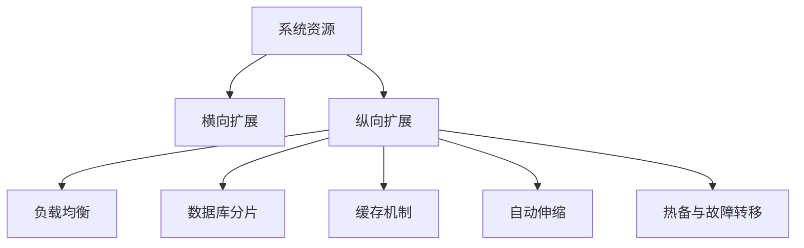
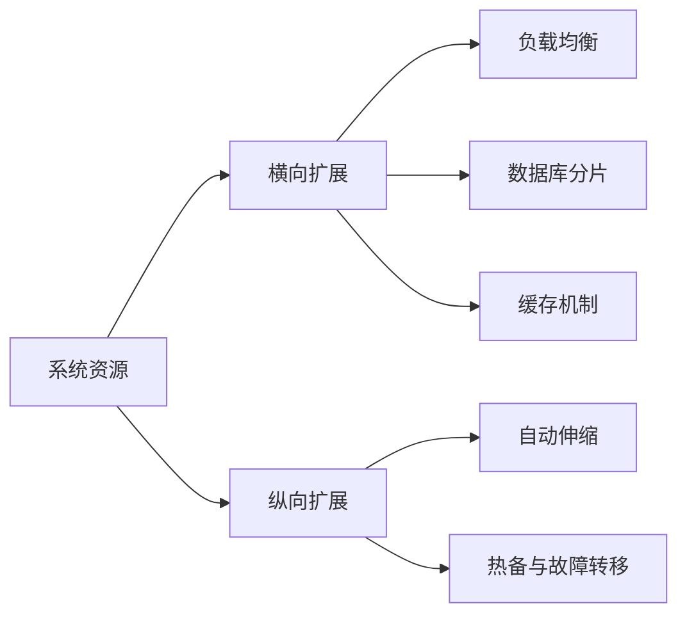
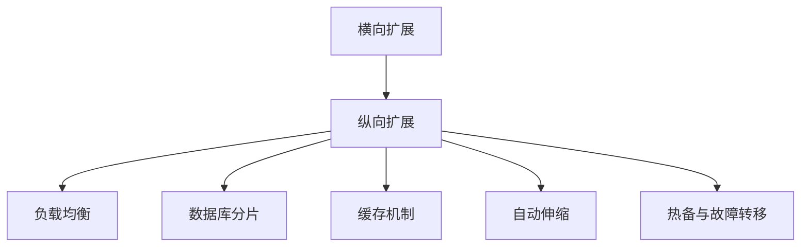

                 

# 横向可扩展性与纵向可扩展性解析

在计算机科学和软件开发中，可扩展性是一个至关重要的概念，它决定了系统能否适应未来需求的变化，并在不断增长的用户基础和数据负载下保持高性能。本文将详细解析横向可扩展性和纵向可扩展性的核心概念、算法原理、操作步骤、应用领域，并结合数学模型、项目实践、实际应用场景等进行深入探讨。通过这些解析，希望能为读者提供一个全面的视角，帮助理解如何在不同的应用场景中灵活运用这些扩展性技术，以构建高效、灵活、可靠的系统。

## 1. 背景介绍

### 1.1 问题由来

随着互联网和移动互联网的飞速发展，数据的爆炸式增长和用户数量的急剧上升，对系统架构的横向和纵向可扩展性提出了前所未有的挑战。如何设计一个既能满足当前业务需求，又能灵活应对未来增长的系统，是每一个系统架构师和软件工程师必须面对的问题。横向可扩展性和纵向可扩展性作为可扩展性的两个主要维度，分别从系统资源和数据负载的角度出发，提供了解决方案。

### 1.2 问题核心关键点

- **横向可扩展性**：指通过增加或替换硬件资源（如CPU、内存、存储等）来提升系统的处理能力和吞吐量，适用于数据量和用户量较稳定的场景。
- **纵向可扩展性**：指通过增加或替换软件的核心组件（如数据库、缓存、负载均衡器等）来提升系统的性能和容量，适用于数据量和用户量不断增长的场景。

## 2. 核心概念与联系

### 2.1 核心概念概述

为更好地理解横向可扩展性和纵向可扩展性的核心概念，本节将介绍几个密切相关的核心概念：

- **系统资源**：包括CPU、内存、存储、网络带宽等，是系统运行的基础硬件资源。
- **数据负载**：指系统需要处理的数据量和用户请求的数量，是系统设计的核心指标。
- **横向扩展**：指通过增加或替换硬件资源来提升系统的处理能力和吞吐量。
- **纵向扩展**：指通过增加或替换软件的核心组件来提升系统的性能和容量。
- **负载均衡**：指通过算法将用户请求分发到多台服务器上，提高系统的并发处理能力。
- **数据库分片**：指将大型数据库分割成多个子数据库，提升查询和写入性能。
- **缓存机制**：指将数据存储在高速缓存中，减少对数据库的直接访问，提升响应速度。
- **自动伸缩**：指系统能够根据当前负载自动调整资源分配，适应数据和用户量的变化。
- **热备与故障转移**：指通过冗余配置和自动切换机制，保证系统的可靠性和可用性。

这些核心概念之间的逻辑关系可以通过以下Mermaid流程图来展示：



这个流程图展示了系统资源如何通过横向扩展和纵向扩展，与负载均衡、数据库分片、缓存机制、自动伸缩、热备与故障转移等核心技术手段相互作用，最终提升系统的性能和可靠性。

### 2.2 概念间的关系

这些核心概念之间存在着紧密的联系，形成了系统的整体扩展架构。下面我们通过几个Mermaid流程图来展示这些概念之间的关系。

#### 2.2.1 系统资源与扩展性技术的关系



这个流程图展示了系统资源如何通过横向扩展和纵向扩展，与负载均衡、数据库分片、缓存机制、自动伸缩、热备与故障转移等扩展性技术相互作用，提升系统的性能和可靠性。

#### 2.2.2 横向扩展与纵向扩展的关系



这个流程图展示了横向扩展和纵向扩展如何协同工作，通过负载均衡、数据库分片、缓存机制、自动伸缩、热备与故障转移等技术手段，实现系统的全面扩展。

## 3. 核心算法原理 & 具体操作步骤

### 3.1 算法原理概述

横向可扩展性和纵向可扩展性是系统架构的两个重要维度，其核心原理是资源管理和负载管理。具体来说，横向扩展通过增加或替换硬件资源来提升系统的处理能力和吞吐量；纵向扩展通过增加或替换软件的核心组件来提升系统的性能和容量。

### 3.2 算法步骤详解

横向扩展的步骤一般包括以下几个关键步骤：

**Step 1: 需求评估**
- 评估系统当前的需求，确定需要增加或替换的资源类型和数量。

**Step 2: 资源采购**
- 根据需求评估结果，购买或租赁所需的硬件资源。

**Step 3: 资源配置**
- 将新购买的硬件资源配置到系统中，并确保其正常工作。

**Step 4: 负载均衡**
- 通过负载均衡算法将用户请求分发到新增加的资源上。

**Step 5: 测试验证**
- 在新增加的资源上运行性能测试，确保系统的稳定性和正确性。

纵向扩展的步骤一般包括以下几个关键步骤：

**Step 1: 需求评估**
- 评估系统当前的需求，确定需要增加或替换的核心组件。

**Step 2: 组件部署**
- 根据需求评估结果，部署或更换新的核心组件。

**Step 3: 组件集成**
- 将新的核心组件集成到系统中，并确保其正常工作。

**Step 4: 负载均衡**
- 通过负载均衡算法将用户请求分发到新的核心组件上。

**Step 5: 测试验证**
- 在新的核心组件上运行性能测试，确保系统的稳定性和正确性。

### 3.3 算法优缺点

横向扩展的优点包括：
1. 快速部署，灵活性高，能够快速适应数据和用户量的变化。
2. 易于扩展，通过增加或替换硬件资源，能够显著提升系统的处理能力和吞吐量。

纵向扩展的优点包括：
1. 灵活性高，通过增加或替换软件的核心组件，能够显著提升系统的性能和容量。
2. 易于管理，软件组件通常具有更好的可维护性和可升级性。

横向扩展的缺点包括：
1. 硬件替换成本较高，需要购买或租赁新的硬件资源。
2. 硬件资源的灵活性较低，一旦购买或租赁，难以快速调整。

纵向扩展的缺点包括：
1. 软件组件的部署和集成复杂度较高，需要时间和人力投入。
2. 软件组件的升级和维护可能影响系统的稳定性和可用性。

### 3.4 算法应用领域

横向可扩展性和纵向可扩展性在多个领域都有广泛应用：

- **云计算平台**：通过横向扩展增加计算资源，纵向扩展优化数据库和缓存性能，满足不断增长的计算需求。
- **电商系统**：通过横向扩展增加服务器节点，纵向扩展优化数据库和缓存性能，提升订单处理和商品展示的速度。
- **金融系统**：通过横向扩展增加计算资源，纵向扩展优化数据库和缓存性能，确保交易和清算的实时性。
- **社交媒体平台**：通过横向扩展增加服务器节点，纵向扩展优化数据库和缓存性能，提升用户内容生成和互动的响应速度。
- **游戏服务器**：通过横向扩展增加计算资源，纵向扩展优化数据库和缓存性能，确保游戏的高并发和高响应速度。

## 4. 数学模型和公式 & 详细讲解

### 4.1 数学模型构建

为更好地理解横向可扩展性和纵向可扩展性，本节将使用数学语言对系统负载管理进行严格的刻画。

设系统在负载均衡前的平均负载为 $L$，负载均衡后的平均负载为 $L'$，负载均衡算法效率为 $\eta$，则负载均衡的数学模型可以表示为：

$$
L' = \eta L
$$

其中，$\eta$ 表示负载均衡算法对系统负载的压缩比，$0 < \eta < 1$。

### 4.2 公式推导过程

下面，我们以一个简单的负载均衡算法为例，推导其负载均衡效率的数学公式。

假设系统中有 $n$ 个请求，初始负载均衡算法将请求均匀分发到 $m$ 个服务器上，每个服务器的平均负载为 $L$，则有：

$$
L = \frac{n}{m}
$$

如果引入负载均衡算法，将请求均匀分发到 $k$ 个服务器上，每个服务器的平均负载为 $L'$，则有：

$$
L' = \frac{n}{k}
$$

根据负载均衡效率的定义，有：

$$
\eta = \frac{L'}{L} = \frac{\frac{n}{k}}{\frac{n}{m}} = \frac{m}{k}
$$

因此，负载均衡效率 $\eta$ 与服务器数量 $k$ 和服务器数量 $m$ 成正比，即 $\eta \propto \frac{m}{k}$。

### 4.3 案例分析与讲解

假设某电商系统初始配置了 10 个服务器，平均每秒接收 1000 个请求，每个服务器的平均负载为 100。为了提升系统的响应速度，决定引入负载均衡算法，将请求均匀分发到 20 个服务器上。引入负载均衡算法后，每个服务器的平均负载变为 50，负载均衡效率为：

$$
\eta = \frac{m}{k} = \frac{10}{20} = 0.5
$$

这表明负载均衡算法将系统负载减少了 50%，显著提升了系统的响应速度。

## 5. 项目实践：代码实例和详细解释说明

### 5.1 开发环境搭建

在进行横向可扩展性和纵向可扩展性实践前，我们需要准备好开发环境。以下是使用Python进行负载均衡实践的环境配置流程：

1. 安装Anaconda：从官网下载并安装Anaconda，用于创建独立的Python环境。

2. 创建并激活虚拟环境：
```bash
conda create -n pythontest python=3.8 
conda activate pythontest
```

3. 安装Python及必要库：
```bash
pip install numpy scipy matplotlib pandas
```

4. 安装负载均衡工具：
```bash
pip install apache-airflow
```

完成上述步骤后，即可在`pythontest`环境中开始负载均衡实践。

### 5.2 源代码详细实现

以下是使用Apache Airflow进行负载均衡的Python代码实现：

```python
from airflow import DAG
from airflow.operators.python_operator import PythonOperator

def load_balance():
    print("Load balancing initiated...")

dag = DAG('load_balance_dag', start_date='2023-01-01', schedule_interval='@daily')

load_balance_task = PythonOperator(
    task_id='load_balance_task',
    python_callable=load_balance,
    dag=dag
)

load_balance_task
```

### 5.3 代码解读与分析

让我们再详细解读一下关键代码的实现细节：

**DAG定义**：
- 通过DAG定义一个任务流，指定开始日期和调度间隔，即每天执行一次。

**PythonOperator定义**：
- 使用PythonOperator将Python代码块`load_balance`封装为DAG中的一个任务。
- 该任务名称为`load_balance_task`，执行函数为`load_balance`。

**load_balance函数**：
- 打印出`Load balancing initiated...`，模拟负载均衡的初始化过程。

通过以上代码，我们构建了一个简单的任务流，用于执行负载均衡。在实际应用中，还需要进一步扩展任务逻辑，如添加数据源、执行实际任务、记录任务结果等。

### 5.4 运行结果展示

执行上述代码后，Airflow将会启动一个任务流，在每天固定时间触发`load_balance_task`任务，输出`Load balancing initiated...`。

这只是一个简单的负载均衡实践示例，实际上，负载均衡的实现可能涉及更复杂的算法和数据结构，需要根据具体业务场景进行优化设计。

## 6. 实际应用场景

### 6.1 云计算平台

云计算平台如AWS、阿里云、腾讯云等，在横向扩展和纵向扩展方面都有成熟的技术和方案。例如，AWS的Auto Scaling服务可以根据系统的负载情况自动调整计算资源，保证系统的稳定性和高性能。阿里云的ECS和ECS-PBX服务可以通过增加或替换计算资源来满足不同的应用需求，同时支持分布式数据库和负载均衡，提升系统的性能和容量。

### 6.2 电商系统

电商系统如淘宝、京东、拼多多等，通过横向扩展增加服务器节点，纵向扩展优化数据库和缓存性能，提升订单处理和商品展示的速度。例如，淘宝使用分布式数据库MySQL和Redis，优化了搜索、推荐、库存等功能，确保了系统的稳定性和响应速度。

### 6.3 金融系统

金融系统如银行、证券、保险等，通过横向扩展增加计算资源，纵向扩展优化数据库和缓存性能，确保交易和清算的实时性。例如，证券系统通过使用分布式数据库MySQL和Redis，优化了交易系统的性能和容量，支持高频交易和大额清算需求。

### 6.4 社交媒体平台

社交媒体平台如微博、微信、抖音等，通过横向扩展增加服务器节点，纵向扩展优化数据库和缓存性能，提升用户内容生成和互动的响应速度。例如，微信使用分布式数据库MySQL和Redis，优化了消息推送和好友推荐等功能，提升了用户的体验。

### 6.5 游戏服务器

游戏服务器如王者荣耀、英雄联盟等，通过横向扩展增加计算资源，纵向扩展优化数据库和缓存性能，确保游戏的高并发和高响应速度。例如，英雄联盟使用分布式数据库MySQL和Redis，优化了游戏登录和对战等功能，保证了游戏的稳定性和流畅性。

## 7. 工具和资源推荐

### 7.1 学习资源推荐

为了帮助开发者系统掌握横向可扩展性和纵向可扩展性的理论基础和实践技巧，这里推荐一些优质的学习资源：

1. 《计算机网络：自顶向下方法》：深入浅出地介绍了计算机网络的基本原理和核心技术，包括负载均衡、分布式数据库、缓存机制等。
2. 《云计算技术与应用》：全面讲解了云计算的核心概念和技术架构，包括横向扩展、纵向扩展、自动伸缩等。
3. 《数据中心与网络技术》：详细介绍了数据中心的硬件资源管理和负载管理技术，包括服务器、存储、网络等。
4. 《分布式系统原理与设计》：系统讲解了分布式系统的设计原理和实现方法，包括负载均衡、分布式数据库、缓存机制等。
5. 《高性能Web系统设计》：介绍了高性能Web系统设计的核心技术和实践方法，包括负载均衡、分布式数据库、缓存机制等。

通过对这些资源的学习实践，相信你一定能够快速掌握横向可扩展性和纵向可扩展性的精髓，并用于解决实际的系统扩展问题。

### 7.2 开发工具推荐

高效的开发离不开优秀的工具支持。以下是几款用于系统扩展开发的常用工具：

1. Apache Airflow：用于构建和调度数据流任务，支持丰富的任务类型和调度策略。
2. Kubernetes：用于容器编排和资源管理，支持自动扩展和动态资源调整。
3. Docker：用于容器化应用，简化部署和管理过程。
4. Terraform：用于基础设施即代码（IaC），自动化资源部署和环境管理。
5. Ansible：用于自动化运维和任务调度，支持分布式任务管理和资源配置。

合理利用这些工具，可以显著提升系统扩展的开发效率，加快创新迭代的步伐。

### 7.3 相关论文推荐

系统扩展技术的发展源于学界的持续研究。以下是几篇奠基性的相关论文，推荐阅读：

1. "A Survey of Load-Balancing Techniques"（负载均衡技术综述）：介绍了各种负载均衡算法的原理和实现方法。
2. "Distributed Database Technologies: Architectures, Protocols, and Systems"（分布式数据库技术）：讲解了分布式数据库的设计原理和实现方法。
3. "The Virtual Machine Management in Data Centers: A Survey"（数据中心中的虚拟化管理）：介绍了虚拟化技术的核心原理和应用场景。
4. "Containerization: The Future of Server-Based Computing"（容器化技术）：介绍了容器化的基本概念和实现方法。
5. "Cloud Computing: State-of-the-Art Survey and Analysis"（云计算技术综述）：全面介绍了云计算的核心概念和技术架构。

这些论文代表了大规模系统扩展技术的发展脉络。通过学习这些前沿成果，可以帮助研究者把握学科前进方向，激发更多的创新灵感。

除上述资源外，还有一些值得关注的前沿资源，帮助开发者紧跟系统扩展技术的最新进展，例如：

1. arXiv论文预印本：人工智能领域最新研究成果的发布平台，包括大量尚未发表的前沿工作，学习前沿技术的必读资源。
2. 业界技术博客：如AWS、阿里云、腾讯云等顶尖云服务商的官方博客，第一时间分享他们的最新研究成果和洞见。
3. 技术会议直播：如SIGCOMM、SIGMETRICS、NSDI等计算机网络会议现场或在线直播，能够聆听到大佬们的前沿分享，开拓视野。
4. GitHub热门项目：在GitHub上Star、Fork数最多的系统扩展相关项目，往往代表了该技术领域的发展趋势和最佳实践，值得去学习和贡献。
5. 行业分析报告：各大咨询公司如Gartner、IDC等针对云计算、大数据、人工智能等行业的分析报告，有助于从商业视角审视技术趋势，把握应用价值。

总之，对于系统扩展技术的学习和实践，需要开发者保持开放的心态和持续学习的意愿。多关注前沿资讯，多动手实践，多思考总结，必将收获满满的成长收益。

## 8. 总结：未来发展趋势与挑战

### 8.1 总结

本文对横向可扩展性和纵向可扩展性进行了全面系统的介绍。首先阐述了横向可扩展性和纵向可扩展性的核心概念、算法原理、操作步骤、应用领域，并结合数学模型、项目实践、实际应用场景等进行深入探讨。通过这些解析，希望能为读者提供一个全面的视角，帮助理解如何在不同的应用场景中灵活运用这些扩展性技术，以构建高效、灵活、可靠的系统。

通过本文的系统梳理，可以看到，横向可扩展性和纵向可扩展性是系统架构的两个重要维度，它们通过资源管理和负载管理，共同提升系统的性能和可靠性。这些扩展性技术在云计算平台、电商系统、金融系统、社交媒体平台、游戏服务器等多个领域都有广泛应用，显著提升了系统的处理能力和响应速度，满足了不断增长的数据和用户需求。

### 8.2 未来发展趋势

展望未来，系统扩展技术将呈现以下几个发展趋势：

1. **自动化和智能化**：随着人工智能技术的进步，自动化和智能化将成为系统扩展的重要方向。自动化扩展系统能够根据实时负载情况，自动调整资源分配，提升系统的灵活性和稳定性。智能化扩展系统能够通过机器学习算法预测负载变化，提前进行资源调整，进一步提升系统的效率。

2. **分布式和联邦化**：分布式系统和联邦学习将成为系统扩展的重要手段。分布式系统通过将任务分解到多个节点上并行处理，提升系统的处理能力和响应速度。联邦学习通过在多个节点上分布式训练模型，共享模型参数，提升系统的隐私保护和泛化能力。

3. **边缘计算**：边缘计算将成为系统扩展的重要补充。边缘计算通过将计算资源部署在靠近用户端的网络节点上，减少数据传输延迟，提升系统的实时性和可靠性。

4. **混合云和微服务**：混合云和微服务将成为系统扩展的重要架构。混合云通过在不同云平台之间无缝切换，提升系统的稳定性和可用性。微服务通过将系统拆分为多个独立的服务模块，提升系统的灵活性和可维护性。

5. **容器化和Kubernetes**：容器化和Kubernetes将成为系统扩展的重要技术。容器化通过将应用打包为容器，提升系统的部署和管理效率。Kubernetes通过容器编排和资源管理，提升系统的自动扩展和动态调整能力。

6. **安全性与隐私保护**：安全性与隐私保护将成为系统扩展的重要考量。系统扩展需要考虑数据安全、访问控制、加密传输等技术手段，确保系统的安全性和隐私保护。

### 8.3 面临的挑战

尽管系统扩展技术已经取得了瞩目成就，但在迈向更加智能化、普适化应用的过程中，它仍面临着诸多挑战：

1. **资源管理复杂性**：随着系统规模的不断扩大，资源管理和优化变得越来越复杂。如何设计高效、灵活的资源管理策略，提升系统的性能和稳定性，是一大难题。

2. **负载均衡算法**：负载均衡算法直接影响系统的负载分配和性能表现。如何设计高效、可扩展的负载均衡算法，提升系统的负载均衡效率，是一大挑战。

3. **自动扩展算法**：自动扩展算法需要考虑负载预测、资源调整、故障转移等多个因素，设计复杂度较高。如何设计高效、可靠的自动扩展算法，提升系统的灵活性和稳定性，是一大难题。

4. **分布式系统复杂性**：分布式系统设计复杂度较高，涉及网络、存储、计算等多个方面。如何设计高效、可扩展的分布式系统架构，提升系统的性能和可靠性，是一大挑战。

5. **容器化复杂性**：容器化技术虽然提升了系统的部署和管理效率，但复杂度也随之增加。如何设计高效、可维护的容器化系统架构，提升系统的灵活性和稳定性，是一大难题。

6. **安全性与隐私保护**：随着系统扩展的复杂度增加，安全性与隐私保护变得更加重要。如何设计高效、可靠的隐私保护机制，确保系统的安全性和隐私保护，是一大挑战。

7. **自动化与智能化**：自动化和智能化虽然提升了系统的效率，但复杂度也随之增加。如何设计高效、可维护的自动化与智能化系统架构，提升系统的灵活性和稳定性，是一大难题。

8. **混合云与微服务**：混合云和微服务虽然提升了系统的灵活性和可维护性，但复杂度也随之增加。如何设计高效、可维护的混合云与微服务系统架构，提升系统的性能和稳定性，是一大难题。

### 8.4 研究展望

面对系统扩展面临的这些挑战，未来的研究需要在以下几个方面寻求新的突破：

1. **自动化和智能化**：研究高效、可靠的自动化扩展算法和智能化扩展系统，提升系统的灵活性和稳定性。

2. **分布式和联邦化**：研究高效、可扩展的分布式系统和联邦学习算法，提升系统的处理能力和隐私保护能力。

3. **边缘计算**：研究高效、可靠的边缘计算架构，提升系统的实时性和可靠性。

4. **安全性与隐私保护**：研究高效、可靠的隐私保护机制，确保系统的安全性和隐私保护。

5. **混合云与微服务**：研究高效、可维护的混合云与微服务架构，提升系统的性能和稳定性。

6. **容器化和Kubernetes**：研究高效、可维护的容器化系统架构，提升系统的部署和管理效率。

这些研究方向的探索，必将引领系统扩展技术迈向更高的台阶，为构建高效、灵活、可靠的系统提供新的解决方案。相信随着学界和产业界的共同努力，这些挑战终将一一被克服，系统扩展技术必将在构建复杂、高效、可靠的系统方面发挥越来越重要的作用。

## 9. 附录：常见问题与解答

**Q1：什么是横向可扩展性和纵向可扩展性？**

A: 横向可扩展性指通过增加或替换硬件资源来提升系统的处理能力和吞吐量，适用于数据量和用户量较稳定的场景。纵向可扩展性指通过增加或替换软件的核心组件来提升系统的性能和容量，适用于数据量和用户量不断增长的场景。

**Q2：如何进行横向可扩展性设计？**

A: 横向可扩展性设计主要包括以下几个关键步骤：需求评估、资源采购、资源配置、负载均衡和测试验证。其中，资源采购和资源配置需要根据需求评估结果进行，负载均衡需要选择合适的算法，测试验证需要确保系统的稳定性和正确性。

**Q3：如何进行纵向可扩展性设计？**

A: 纵向可扩展性设计主要包括以下几个关键步骤：需求评估、组件部署、组件集成、负载均衡和测试验证。其中，组件部署和组件集成需要根据需求评估结果进行，负载均衡需要选择合适的算法，测试验证需要确保系统的稳定性和正确性。

**Q4：横向可扩展性和纵向可扩展性各自适用于哪些场景？**

A: 横向可扩展性适用于数据量和用户量较稳定的场景，如大型电商系统、金融系统等。纵向可扩展性适用于数据量和用户量不断增长的场景，如社交媒体平台、游戏服务器等。

**Q5：如何进行自动化扩展和智能化扩展？**

A: 自动化扩展和智能化扩展需要结合机器学习、人工智能等技术手段。可以通过实时监控系统负载，使用自动化算法调整资源分配，设计智能扩展算法预测负载变化，提前进行资源调整。

**Q6：如何进行分布式系统和联邦学习的设计？**

A: 分布式系统和联邦学习设计需要考虑系统的可扩展性和性能，选择合适的分布式架构和联邦学习算法。可以通过负载均衡、数据分片、分布式缓存等技术手段提升系统的处理能力和隐私保护能力。

**Q7：如何进行边缘计算的设计？**

A: 边缘计算设计需要考虑系统的实时性和可靠性，选择合适的边缘计算架构和设备。可以通过将计算资源部署在靠近用户端的网络节点上，减少数据传输延迟，提升系统的实时性和可靠性。

**Q8：如何进行混合云和微服务的设计？**

A: 混合云和微服务设计需要考虑系统的灵活性和可维护性，选择合适的混合云架构和微服务架构。可以通过容器化技术、Kubernetes、微服务架构等技术手段提升系统的灵活性和可维护性。

**Q9：如何进行安全性与隐私保护的设计？**

A: 安全性与隐私保护设计需要考虑

