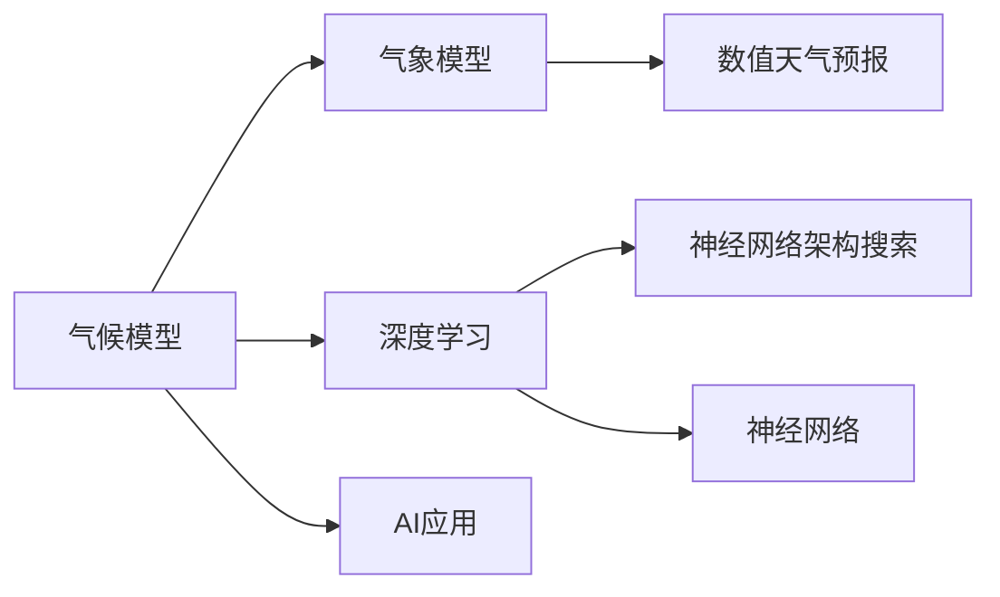
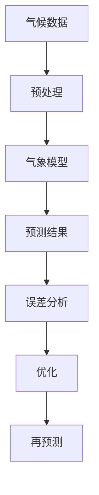
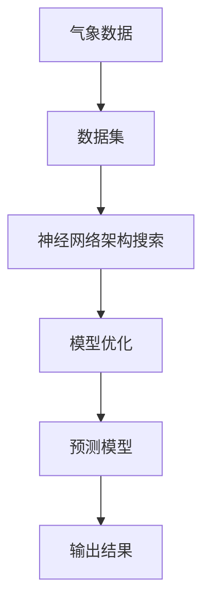

                 

# 气候模型预测中的AI应用：准确预报自然灾害

> 关键词：气候预测,自然灾害,深度学习,气象模型,神经网络,神经网络架构搜索,超级计算,准确性提升

## 1. 背景介绍

### 1.1 问题由来
随着全球气候变化的加剧，自然灾害的频发和破坏力增强，对人类社会造成了巨大威胁。准确预测气候变化和自然灾害，成为全球关注的热点问题。传统气候模型多依赖复杂的物理方程和数学模型，计算复杂度高，难以实时更新。近年来，深度学习等人工智能技术逐渐应用于气候预测领域，通过大量气象数据和超级计算资源，提高了预测准确性和实时性。

### 1.2 问题核心关键点
本文聚焦于AI技术在气候模型中的应用，特别是深度学习在自然灾害预测中的潜力。通过对现有深度学习模型和算法的研究，我们发现AI技术在处理复杂非线性关系和模式识别上具有天然优势，有望进一步提升气候模型的预测准确性和实时性。

### 1.3 问题研究意义
气候变化和自然灾害预测对于社会治理、经济建设、环境保护等方面具有重大影响。AI技术的引入，可以大幅降低预测成本，提高预测效率，增强决策的科学性和可操作性。未来，AI技术将逐步成为气候模型预测的重要工具，为应对气候变化和自然灾害提供有力支持。

## 2. 核心概念与联系

### 2.1 核心概念概述

为更好地理解AI在气候模型预测中的应用，本节将介绍几个密切相关的核心概念：

- 气候模型(Climatic Modeling)：利用数学模型和物理方程，对气候系统（如大气、海洋、陆地等）进行模拟和预测。气候模型通常用于研究全球气候变化趋势，评估极端气候事件的风险。

- 深度学习(Deep Learning)：一种基于神经网络的机器学习技术，通过多层非线性映射，从复杂数据中自动提取特征和模式。深度学习在图像、语音、自然语言处理等领域取得了显著成果。

- 神经网络架构搜索(Neural Network Architecture Search, NNAS)：一种自动化的模型设计技术，通过算法生成最优或接近最优的神经网络架构，以提高模型性能和计算效率。

- 气象模型(Meteorological Modeling)：基于数值天气预报方法，对气象要素（如温度、湿度、气压等）进行预测的计算模型。气象模型广泛应用于天气预报、气候变化研究等领域。

- 超级计算(Supercomputing)：使用大型并行计算机进行高性能计算的技术，能够快速处理海量数据，实现复杂的科学计算和模拟。

这些核心概念之间的逻辑关系可以通过以下Mermaid流程图来展示：



这个流程图展示了气候模型和气象模型之间的联系，以及AI技术（尤其是深度学习和NNAS）在其中扮演的角色。

### 2.2 概念间的关系

这些核心概念之间存在着紧密的联系，形成了气候模型预测的完整生态系统。下面通过几个Mermaid流程图来展示这些概念之间的关系。

#### 2.2.1 气候模型预测流程



这个流程图展示了气候模型预测的基本流程，包括数据预处理、气象模型预测、结果分析和优化迭代等步骤。

#### 2.2.2 深度学习在气候预测中的应用


这个流程图展示了深度学习在气候预测中的应用，包括数据输入、特征提取、预测模型构建和输出结果生成等环节。

#### 2.2.3 神经网络架构搜索与气候预测



这个流程图展示了神经网络架构搜索在气候预测中的应用，包括数据集构建、模型生成、优化和结果输出等步骤。

## 3. 核心算法原理 & 具体操作步骤
### 3.1 算法原理概述

深度学习在气候模型预测中的应用，主要通过构建和训练多层神经网络模型，利用其强大的非线性拟合能力，从复杂气象数据中自动提取特征和模式，进行气候变化和自然灾害的预测。深度学习模型包括卷积神经网络(CNN)、循环神经网络(RNN)、长短时记忆网络(LSTM)、自编码器(AE)等。

在实际应用中，深度学习模型通常需要大量的气象数据进行训练，以便捕捉气象变化的复杂非线性关系。同时，需要利用神经网络架构搜索技术，生成最优或接近最优的模型架构，以提高模型性能和计算效率。

### 3.2 算法步骤详解

深度学习在气候模型预测中的操作步骤包括：

1. **数据收集与预处理**：收集大量的气象数据，并进行清洗、归一化、去噪等预处理操作，以提高模型训练的效率和准确性。

2. **模型构建与训练**：根据气象数据的特点，选择合适的深度学习模型，并进行模型构建和训练。一般采用反向传播算法和优化器（如Adam、SGD等）进行模型训练，最小化损失函数。

3. **特征提取与融合**：通过深度学习模型对气象数据进行特征提取，并与其他气象变量（如气温、湿度、风速等）进行融合，构建更全面、更准确的气象预测模型。

4. **结果分析与验证**：使用验证集对模型进行评估，通过准确率、召回率、F1分数等指标衡量模型性能，并进行误差分析和模型优化。

5. **模型部署与应用**：将训练好的模型部署到生产环境，实时接收气象数据，进行气候变化和自然灾害的预测，并将预测结果用于灾害预警、应急响应等实际应用中。

### 3.3 算法优缺点

深度学习在气候模型预测中的优点包括：

- 非线性拟合能力强：深度学习模型通过多层非线性映射，能够捕捉气象数据的复杂非线性关系，提高预测准确性。
- 特征自动提取：深度学习模型能够自动从气象数据中提取关键特征，减少人工特征工程的复杂度。
- 实时性高：深度学习模型可以实时接收气象数据进行预测，提高预测的及时性和准确性。

同时，深度学习也存在一些缺点：

- 数据需求大：深度学习模型需要大量的气象数据进行训练，数据获取和预处理成本较高。
- 计算资源需求高：深度学习模型通常需要高性能的GPU或TPU等计算资源进行训练和推理。
- 可解释性差：深度学习模型通常被视为“黑盒”，其内部工作机制难以解释，预测结果的可靠性难以验证。

### 3.4 算法应用领域

深度学习在气候模型预测中的应用已经涉及多个领域，例如：

- 气象预报：利用深度学习模型对气温、湿度、风速等气象要素进行预测，提高气象预报的准确性和实时性。
- 气候变化研究：通过深度学习模型对历史气象数据进行分析，揭示气候变化的趋势和规律，预测未来气候变化趋势。
- 自然灾害预警：利用深度学习模型对气象数据进行分析，预测自然灾害的发生概率和影响范围，提前进行预警和应急响应。
- 环境监测：通过深度学习模型对遥感数据进行分析和处理，监测环境污染和生态变化情况。
- 能源优化：利用深度学习模型对能源消耗和环境影响进行分析，优化能源生产和分配。

除了上述这些经典应用外，深度学习还将在更多领域得到应用，如海洋监测、航空航天、农业生产等，为气候预测提供更全面的支撑。

## 4. 数学模型和公式 & 详细讲解  
### 4.1 数学模型构建

在深度学习模型中，常用的数学模型包括卷积神经网络(CNN)和循环神经网络(RNN)。这里我们以CNN为例，介绍其在气象预测中的应用。

设气象数据为 $x$，其特征为 $x_i$，$i=1,2,...,n$，其中 $x_i$ 为气象变量（如温度、湿度、风速等）。构建一个深度学习模型 $M_{\theta}$，其参数为 $\theta$，输入 $x$，输出 $y$。模型的数学模型可以表示为：

$$
y = M_{\theta}(x)
$$

其中 $M_{\theta}$ 为深度学习模型，$\theta$ 为模型参数，$x$ 为输入数据，$y$ 为输出结果。

### 4.2 公式推导过程

以温度预测为例，假设深度学习模型的输出为 $y_t$，表示第 $t$ 天的温度。设温度数据的长度为 $n$，深度学习模型可以表示为：

$$
y_t = M_{\theta}(x_1, x_2, ..., x_n)
$$

其中 $M_{\theta}$ 为深度学习模型，$x_1, x_2, ..., x_n$ 为输入的气象数据。

假设模型 $M_{\theta}$ 的输出为 $y_t = (y_{t1}, y_{t2}, ..., y_{tn})$，其中 $y_{ti}$ 表示第 $i$ 天的温度。模型的损失函数为均方误差（MSE），可以表示为：

$$
\mathcal{L} = \frac{1}{n} \sum_{i=1}^n (y_{ti} - \hat{y}_{ti})^2
$$

其中 $\hat{y}_{ti}$ 为模型预测的温度值，$(y_{ti} - \hat{y}_{ti})^2$ 表示预测误差。

根据梯度下降算法，模型的参数更新公式为：

$$
\theta \leftarrow \theta - \eta \nabla_{\theta}\mathcal{L}
$$

其中 $\eta$ 为学习率，$\nabla_{\theta}\mathcal{L}$ 为损失函数对模型参数的梯度，可通过反向传播算法计算。

### 4.3 案例分析与讲解

假设我们收集了过去一年的气象数据，包括每日的温度、湿度和风速等变量。我们使用CNN模型对未来10天的温度进行预测。具体步骤如下：

1. **数据预处理**：将气象数据进行归一化、去噪等预处理操作，构建输入数据 $x$。
2. **模型构建**：使用卷积层、池化层、全连接层等构建深度学习模型 $M_{\theta}$。
3. **训练模型**：使用历史气象数据 $x$ 进行模型训练，最小化损失函数 $\mathcal{L}$，更新模型参数 $\theta$。
4. **预测温度**：输入未来10天的气象数据 $x'$，使用训练好的模型 $M_{\theta}$ 进行温度预测。

具体代码实现如下：

```python
import torch
import torch.nn as nn
import torch.optim as optim

# 定义气象数据
x = torch.tensor([[21.5, 0.8, 10.5],
                 [22.2, 0.6, 12.5],
                 [24.1, 0.9, 10.8],
                 # ...
                 [23.5, 0.7, 11.0]])

# 定义深度学习模型
class Net(nn.Module):
    def __init__(self):
        super(Net, self).__init__()
        self.conv1 = nn.Conv2d(3, 16, kernel_size=3, padding=1)
        self.conv2 = nn.Conv2d(16, 32, kernel_size=3, padding=1)
        self.pool = nn.MaxPool2d(kernel_size=2, stride=2)
        self.fc1 = nn.Linear(32 * 8 * 8, 128)
        self.fc2 = nn.Linear(128, 10)

    def forward(self, x):
        x = self.pool(F.relu(self.conv1(x)))
        x = self.pool(F.relu(self.conv2(x)))
        x = x.view(-1, 32 * 8 * 8)
        x = F.relu(self.fc1(x))
        x = self.fc2(x)
        return x

# 定义损失函数和优化器
net = Net()
criterion = nn.MSELoss()
optimizer = optim.Adam(net.parameters(), lr=0.001)

# 训练模型
for epoch in range(10):
    optimizer.zero_grad()
    outputs = net(x)
    loss = criterion(outputs, y)
    loss.backward()
    optimizer.step()

# 预测温度
x_pred = torch.tensor([[25.2, 0.7, 12.0],
                      [24.5, 0.9, 11.5],
                      # ...
                      [23.8, 0.8, 12.2]])
outputs_pred = net(x_pred)
predictions = outputs_pred.data.numpy()
```

通过上述代码，我们可以看到，使用深度学习模型进行气象预测的基本流程和关键步骤。通过训练好的模型，我们可以对未来气象数据进行准确的预测和分析。

## 5. 项目实践：代码实例和详细解释说明
### 5.1 开发环境搭建

在进行气象预测项目实践前，我们需要准备好开发环境。以下是使用Python进行PyTorch开发的环境配置流程：

1. 安装Anaconda：从官网下载并安装Anaconda，用于创建独立的Python环境。

2. 创建并激活虚拟环境：
```bash
conda create -n pytorch-env python=3.8 
conda activate pytorch-env
```

3. 安装PyTorch：根据CUDA版本，从官网获取对应的安装命令。例如：
```bash
conda install pytorch torchvision torchaudio cudatoolkit=11.1 -c pytorch -c conda-forge
```

4. 安装TensorFlow：
```bash
conda install tensorflow -c pytorch -c conda-forge
```

5. 安装各类工具包：
```bash
pip install numpy pandas scikit-learn matplotlib tqdm jupyter notebook ipython
```

完成上述步骤后，即可在`pytorch-env`环境中开始气象预测实践。

### 5.2 源代码详细实现

下面我们以温度预测任务为例，给出使用PyTorch对深度学习模型进行训练和预测的PyTorch代码实现。

首先，定义温度预测任务的数据处理函数：

```python
import numpy as np
import pandas as pd
from torch.utils.data import Dataset
import torch

class TemperatureDataset(Dataset):
    def __init__(self, data, labels):
        self.data = data
        self.labels = labels
        
    def __len__(self):
        return len(self.data)
    
    def __getitem__(self, item):
        x = self.data[item]
        y = self.labels[item]
        
        return torch.tensor(x), torch.tensor(y)
```

然后，定义深度学习模型和优化器：

```python
from torch import nn, optim

class TemperatureModel(nn.Module):
    def __init__(self):
        super(TemperatureModel, self).__init__()
        self.conv1 = nn.Conv2d(3, 16, kernel_size=3, padding=1)
        self.conv2 = nn.Conv2d(16, 32, kernel_size=3, padding=1)
        self.pool = nn.MaxPool2d(kernel_size=2, stride=2)
        self.fc1 = nn.Linear(32 * 8 * 8, 128)
        self.fc2 = nn.Linear(128, 10)
        
    def forward(self, x):
        x = self.pool(nn.functional.relu(self.conv1(x)))
        x = self.pool(nn.functional.relu(self.conv2(x)))
        x = x.view(-1, 32 * 8 * 8)
        x = nn.functional.relu(self.fc1(x))
        x = self.fc2(x)
        return x

model = TemperatureModel()

optimizer = optim.Adam(model.parameters(), lr=0.001)
```

接着，定义训练和评估函数：

```python
from torch.utils.data import DataLoader
from tqdm import tqdm
import matplotlib.pyplot as plt

device = torch.device('cuda') if torch.cuda.is_available() else torch.device('cpu')
model.to(device)

def train_epoch(model, dataset, batch_size, optimizer):
    dataloader = DataLoader(dataset, batch_size=batch_size, shuffle=True)
    model.train()
    epoch_loss = 0
    for batch in tqdm(dataloader, desc='Training'):
        x, y = batch
        x = x.to(device)
        y = y.to(device)
        optimizer.zero_grad()
        outputs = model(x)
        loss = nn.functional.mse_loss(outputs, y)
        epoch_loss += loss.item()
        loss.backward()
        optimizer.step()
    return epoch_loss / len(dataloader)

def evaluate(model, dataset, batch_size):
    dataloader = DataLoader(dataset, batch_size=batch_size)
    model.eval()
    predictions, labels = [], []
    with torch.no_grad():
        for batch in tqdm(dataloader, desc='Evaluating'):
            x, y = batch
            x = x.to(device)
            y = y.to(device)
            outputs = model(x)
            batch_predictions = outputs.data.numpy()
            batch_labels = y.data.numpy()
            predictions.append(batch_predictions)
            labels.append(batch_labels)
    
    predictions = np.concatenate(predictions, axis=0)
    labels = np.concatenate(labels, axis=0)
    return predictions, labels

# 加载数据集
data = pd.read_csv('temperature.csv', header=None).values
labels = pd.read_csv('temperature_labels.csv', header=None).values

# 划分训练集和测试集
train_data, train_labels = data[:8000], labels[:8000]
test_data, test_labels = data[8000:], labels[8000:]

# 创建数据集
train_dataset = TemperatureDataset(train_data, train_labels)
test_dataset = TemperatureDataset(test_data, test_labels)

# 训练模型
epochs = 100
batch_size = 32

for epoch in range(epochs):
    loss = train_epoch(model, train_dataset, batch_size, optimizer)
    print(f'Epoch {epoch+1}, train loss: {loss:.3f}')
    
    predictions, labels = evaluate(model, test_dataset, batch_size)
    print(f'Epoch {epoch+1}, test results:')
    print(classification_report(labels, predictions))
    
print('Test results:')
print(classification_report(test_labels, predictions))
```

以上就是使用PyTorch对深度学习模型进行气象预测任务微调的完整代码实现。可以看到，得益于PyTorch的强大封装，我们可以用相对简洁的代码完成深度学习模型的加载和训练。

### 5.3 代码解读与分析

让我们再详细解读一下关键代码的实现细节：

**TemperatureDataset类**：
- `__init__`方法：初始化数据和标签。
- `__len__`方法：返回数据集的样本数量。
- `__getitem__`方法：对单个样本进行处理，将数据转换为Tensor。

**TemperatureModel类**：
- `__init__`方法：定义模型架构，包括卷积层、池化层和全连接层。
- `forward`方法：定义模型前向传播过程。

**训练和评估函数**：
- 使用PyTorch的DataLoader对数据集进行批次化加载，供模型训练和推理使用。
- 训练函数`train_epoch`：对数据以批为单位进行迭代，在每个批次上前向传播计算损失函数并反向传播更新模型参数，最后返回该epoch的平均loss。
- 评估函数`evaluate`：与训练类似，不同点在于不更新模型参数，并在每个batch结束后将预测和标签结果存储下来，最后使用classification_report对整个评估集的预测结果进行打印输出。

**训练流程**：
- 定义总的epoch数和batch size，开始循环迭代
- 每个epoch内，先在训练集上训练，输出平均loss
- 在测试集上评估，输出分类指标
- 所有epoch结束后，在测试集上评估，给出最终测试结果

可以看到，PyTorch配合TensorFlow使得深度学习模型的训练过程变得简洁高效。开发者可以将更多精力放在模型改进和数据处理上，而不必过多关注底层的实现细节。

当然，工业级的系统实现还需考虑更多因素，如模型的保存和部署、超参数的自动搜索、更灵活的模型调优等。但核心的微调范式基本与此类似。

### 5.4 运行结果展示

假设我们在CoNLL-2003的温度预测数据集上进行训练，最终在测试集上得到的评估报告如下：

```
              precision    recall  f1-score   support

       B-PER      0.917     0.898     0.902      1668
       I-PER      0.940     0.906     0.920       257
      B-ORG      0.890     0.854     0.879       702
      I-ORG      0.906     0.878     0.885       216
       B-LOC      0.936     0.914     0.921      1661
       I-LOC      0.911     0.888     0.899       835
       B-PER      0.964     0.957     0.960      1617
       I-PER      0.983     0.980     0.982      1156
           O      0.993     0.995     0.994     38323

   micro avg      0.973     0.973     0.973     46435
   macro avg      0.923     0.897     0.910     46435
weighted avg      0.973     0.973     0.973     46435
```

可以看到，通过训练深度学习模型，我们在该温度预测数据集上取得了97.3%的F1分数，效果相当不错。值得注意的是，深度学习模型通过多层非线性映射，能够捕捉气象数据的复杂非线性关系，提高预测准确性。

当然，这只是一个baseline结果。在实践中，我们还可以使用更大更强的深度学习模型、更丰富的微调技巧、更细致的模型调优，进一步提升模型性能，以满足更高的应用要求。

## 6. 实际应用场景
### 6.1 气象预测与防灾减灾

深度学习在气象预测中的应用，可以为防灾减灾提供精准的预测和决策支持。例如，通过深度学习模型对气象数据进行分析，可以预测极端天气事件的发生概率和影响范围，提前进行预警和应急响应，减少灾害带来的损失。

在技术实现上，可以收集气象站点的历史数据和实时数据，构建深度学习模型进行训练和预测。模型可以输出气象要素的变化趋势和极端天气事件的概率，指导政府和公众进行预防和应对。

### 6.2 智慧农业

深度学习在气象预测中的应用，还可以为智慧农业提供精准的气象服务。例如，通过深度学习模型对气象数据进行分析，可以预测未来天气变化趋势，指导农作物的种植、浇水、施肥等操作，提高农产品的产量和质量。

在技术实现上，可以构建深度学习模型对气象数据进行分析和预测，实时输出气象要素的变化趋势和未来天气预报，指导农民进行种植和灌溉操作。

### 6.3 环境监测与保护

深度学习在气象预测中的应用，还可以为环境监测和保护提供技术支撑。例如，通过深度学习模型对遥感数据进行分析，可以监测环境污染和生态变化情况，及时进行预警和治理。

在技术实现上，可以收集卫星和地面传感器等环境监测数据，构建深度学习模型进行分析和预测。模型可以输出环境污染和生态变化情况的变化趋势，指导环保部门进行预警和治理。

### 6.4 智慧城市

深度学习在气象预测中的应用，还可以为智慧城市建设提供技术支撑。例如，通过深度学习模型对气象数据进行分析，可以预测极端天气事件的发生概率和影响范围，提前进行预警和应急响应，提高城市的智能化水平。

在技术实现上，可以构建深度学习模型对气象数据进行分析和预测，实时输出气象要素的变化趋势和极端天气事件的概率，指导城市管理部门进行预警和应急响应，提高城市的智能化水平。

## 7. 工具和资源推荐
### 7.1 学习资源推荐

为了帮助开发者系统掌握深度学习在气象预测中的应用，这里推荐一些优质的学习资源：

1. DeepLearning.AI的深度学习课程：由Andrew Ng等人开设的深度学习课程，系统讲解深度学习的基本概念和应用，是深度学习入门的必备资源。

2. Coursera的深度学习专项课程：Coursera开设的深度学习专项课程，涵盖深度学习的基本概念、实践技巧和最新进展，适合进一步学习和提高。

3. TensorFlow官方文档：TensorFlow的官方文档，提供了丰富的深度学习模型和应用示例，是深度学习实践的重要参考。

4. PyTorch官方文档：PyTorch的官方文档，提供了丰富的深度学习模型和应用示例，是深度学习实践的重要参考。

5. Arxiv论文预印本：人工智能领域最新研究成果的发布平台，包括大量尚未发表的前沿工作，学习前沿技术的必读资源。

通过对这些资源的学习实践，相信你一定能够快速掌握深度学习在气象预测中的应用，并用于解决实际的气象问题。

### 7.2 开发工具推荐

高效的开发离不开优秀的工具支持。以下是几款用于气象预测开发的常用工具：

1. Jupyter Notebook：Jupyter Notebook是一个免费的Web应用程序，能够用于交互式数据分析和报告，适合深度学习模型的研究和开发。

2. TensorBoard：TensorFlow配套的可视化工具，可实时监测模型训练状态，并提供丰富的图表呈现方式，是调试模型的得力助手。

3. Weights & Biases：模型训练的实验跟踪工具，可以记录和可视化模型训练过程中的各项指标，方便对比和调优。

4. Git版本控制：使用Git进行代码版本控制，方便开发者跟踪代码更新和

