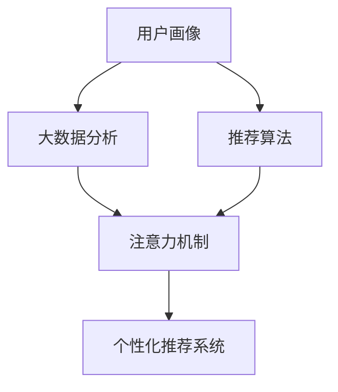

                 

# 注意力经济与个性化体验：如何为受众定制产品和服务

> 关键词：
- 个性化推荐系统
- 用户行为分析
- 注意力机制
- 大数据分析
- 算法优化

## 1. 背景介绍

随着互联网技术的迅猛发展，数字经济逐步成为社会经济发展的新引擎。数据作为关键的生产要素，正在深刻改变我们的生活和工作方式。无论是电子商务、社交媒体，还是智能家居、智慧城市，都离不开数据的支撑。在数据驱动下，企业正从传统的产品导向型转变为以用户为中心的体验导向型。如何更精准地了解用户需求，为其提供个性化的产品和服务，成为企业关注的焦点。

个性化体验的背后，是精准的受众分析和大数据分析技术。通过对用户行为数据的深度挖掘，可以发现其兴趣偏好、消费习惯等潜在信息，从而实现产品、服务的定制化和推送。其中，个性化推荐系统（Recommender System）和注意力机制（Attention Mechanism）是两个核心技术。

本文将深入探讨个性化推荐系统和注意力机制的原理，并结合实际案例，阐述如何为受众定制产品和服务，最终提升用户体验和企业效益。

## 2. 核心概念与联系

### 2.1 核心概念概述

为了更清晰地理解个性化推荐系统和注意力机制，我们首先介绍一些核心概念：

- **个性化推荐系统（Recommender System）**：通过分析用户的历史行为数据，为用户推荐其感兴趣的商品、服务、内容等。推荐的目的是最大化用户满意度，提高转化率和留存率。

- **注意力机制（Attention Mechanism）**：一种用于神经网络中处理序列数据的技术，通过动态调整模型对不同序列元素的关注程度，提高模型的表达能力和泛化性能。

- **大数据分析（Big Data Analytics）**：利用现代信息技术，对海量数据进行采集、存储、处理和分析，以发现数据中蕴含的规律和知识。

- **推荐算法（Recommendation Algorithm）**：推荐系统的核心，通过构建评分模型或排序模型，对推荐对象进行预测和排序，以生成推荐结果。

- **用户画像（User Persona）**：通过数据挖掘和机器学习技术，构建用户的行为、兴趣、需求等特征模型，为个性化的产品和服务设计提供依据。

这些核心概念之间存在紧密的联系。个性化推荐系统利用注意力机制和大数据分析，在用户画像的基础上，为个性化推荐算法提供支持，从而实现精准的个性化服务。

### 2.2 概念间的关系

以下是一个Mermaid流程图，展示了个性化推荐系统和注意力机制的关系：



在这个流程图中，用户画像（A）通过大数据分析（B）生成，进而输入到推荐算法（C）中。注意力机制（D）则是对推荐算法的一个增强，通过动态调整模型对不同推荐对象的关注程度，提升推荐的精准度。最终，个性化推荐系统（E）将基于推荐算法和注意力机制的综合结果，为用户生成个性化的产品或服务推荐。

## 3. 核心算法原理 & 具体操作步骤
### 3.1 算法原理概述

个性化推荐系统的核心在于如何高效地处理和利用用户的行为数据，并利用注意力机制增强推荐模型的表达能力。其基本原理可以概括为以下几步：

1. **数据收集与预处理**：收集用户的行为数据，如浏览记录、购买记录、评分数据等，并进行清洗和归一化。

2. **用户画像生成**：通过机器学习算法，构建用户的行为、兴趣、需求等特征模型。

3. **推荐算法设计**：选择合适的推荐算法，如协同过滤、基于内容的推荐、矩阵分解等，构建评分模型或排序模型。

4. **注意力机制增强**：在推荐算法中引入注意力机制，动态调整模型对不同推荐对象的关注程度。

5. **推荐结果生成**：基于用户画像和增强的推荐算法，为用户生成个性化的推荐结果。

### 3.2 算法步骤详解

以下是一个详细的个性化推荐系统的实现步骤：

1. **数据收集与预处理**：
   - 收集用户的历史行为数据，如商品浏览记录、购买记录、评分记录等。
   - 清洗数据，去除噪音和重复数据。
   - 对数据进行归一化处理，如对用户评分进行标准化处理。

2. **用户画像生成**：
   - 对用户行为数据进行特征提取，如用户兴趣、购买偏好等。
   - 构建用户画像，如用户特征向量、用户兴趣模型等。

3. **推荐算法设计**：
   - 选择适合的推荐算法，如协同过滤、基于内容的推荐、矩阵分解等。
   - 构建评分模型或排序模型，如用户-商品评分矩阵、商品-商品相似度矩阵等。

4. **注意力机制增强**：
   - 在推荐算法中引入注意力机制，对不同推荐对象（如商品）的权重进行动态调整。
   - 设计注意力函数，如多头注意力、自注意力等，动态计算每个推荐对象的注意力权重。

5. **推荐结果生成**：
   - 将用户画像和增强的推荐算法综合，生成推荐结果。
   - 对推荐结果进行排序和筛选，为用户呈现最合适的推荐列表。

### 3.3 算法优缺点

个性化推荐系统具有以下优点：
- 提高用户满意度：通过精准的个性化推荐，满足用户的具体需求。
- 增加用户粘性：个性化推荐可提升用户留存率，增加平台的用户粘性。
- 促进转化率：个性化推荐可提高用户购买转化率，提升平台收益。

然而，个性化推荐系统也存在一些局限性：
- 数据隐私问题：用户行为数据可能涉及隐私，需严格保护。
- 冷启动问题：新用户缺乏足够的历史行为数据，难以进行个性化推荐。
- 推荐偏差：推荐算法可能存在偏见，导致推荐结果不公平。

### 3.4 算法应用领域

个性化推荐系统广泛应用于电商、社交、娱乐等多个领域，为用户定制个性化的商品、内容、服务。例如：

- **电子商务**：根据用户的浏览记录、购买历史，推荐符合其兴趣的商品。
- **社交媒体**：根据用户的互动记录，推荐其感兴趣的内容、好友等。
- **音乐和视频平台**：根据用户的听歌、观影记录，推荐其喜欢的歌曲、影片等。

此外，个性化推荐系统还应用于新闻推荐、广告投放、知识推荐等多个场景，提升用户体验和企业效益。

## 4. 数学模型和公式 & 详细讲解  
### 4.1 数学模型构建

个性化推荐系统通常采用矩阵分解（Matrix Factorization）和深度学习（Deep Learning）两种方法，其中深度学习方法在近年逐渐成为主流。以下以深度学习为例，构建推荐模型。

设用户-商品评分矩阵为 $R \in \mathbb{R}^{m \times n}$，其中 $m$ 为用户数，$n$ 为商品数。假设用户 $u$ 对商品 $i$ 的评分向量为 $r_{ui} \in \mathbb{R}^{k}$，其中 $k$ 为向量维度。推荐模型的目标是最小化预测评分与实际评分之间的差异。

### 4.2 公式推导过程

假设推荐模型采用神经网络结构，输入为用户画像特征向量 $x_u \in \mathbb{R}^{d}$，输出为推荐商品评分向量 $r_{ui} \in \mathbb{R}^{k}$。推荐模型的损失函数为均方误差（Mean Squared Error, MSE）：

$$
\mathcal{L} = \frac{1}{m} \sum_{i=1}^{n} \sum_{j=1}^{k} (y_{uij} - \hat{y}_{uij})^2
$$

其中 $y_{uij}$ 为实际评分，$\hat{y}_{uij}$ 为模型预测的评分。模型通过反向传播算法更新权重 $W$ 和 $V$，以最小化损失函数 $\mathcal{L}$。

### 4.3 案例分析与讲解

假设我们有一个商品推荐系统，包含用户数 $m=1000$，商品数 $n=10000$，向量维度 $k=100$。采用深度神经网络结构，网络层数 $L=3$，每层隐藏层维度 $d=50$。用户画像特征向量 $x_u \in \mathbb{R}^{50}$。

设推荐模型的输出为 $\hat{y}_{uij}$，则模型的损失函数为：

$$
\mathcal{L} = \frac{1}{m} \sum_{i=1}^{n} \sum_{j=1}^{k} (y_{uij} - \hat{y}_{uij})^2
$$

采用随机梯度下降算法（Stochastic Gradient Descent, SGD）进行模型优化，学习率为 $0.01$。训练过程中，每 $1000$ 次迭代输出模型损失，以评估模型收敛情况。

## 5. 项目实践：代码实例和详细解释说明
### 5.1 开发环境搭建

为了进行推荐系统的实践，我们需要准备一些开发环境：

1. 安装Python：从官网下载并安装Python 3.8，确保环境稳定。
2. 安装TensorFlow：从官网下载并安装TensorFlow 2.0，确保版本兼容。
3. 安装Keras：通过pip安装Keras 2.3，方便构建神经网络模型。
4. 安装Jupyter Notebook：通过conda安装Jupyter Notebook 6.2，方便进行模型实验和数据处理。

完成上述步骤后，即可在Jupyter Notebook中进行推荐系统的开发。

### 5.2 源代码详细实现

以下是一个基于TensorFlow和Keras的推荐系统的实现示例。

```python
import tensorflow as tf
from tensorflow.keras.layers import Input, Dense, Dot
from tensorflow.keras.models import Model
from sklearn.metrics import mean_squared_error
import numpy as np

# 定义模型结构
input_u = Input(shape=(50,))
input_i = Input(shape=(100,))
attention_weights = Dot(axes=(1, 1))([input_u, input_i])
attention_weights = Dense(50, activation='softmax')(attention_weights)
output = Dot(axes=(1, 1))([attention_weights, input_i])
output = Dense(100, activation='sigmoid')(output)

# 定义模型
model = Model(inputs=[input_u, input_i], outputs=output)

# 编译模型
model.compile(optimizer='adam', loss='mse')

# 加载数据
user_data = np.random.rand(1000, 50)
item_data = np.random.rand(10000, 100)
user_item_data = np.random.rand(1000, 10000)

# 训练模型
model.fit([user_data, item_data], user_item_data, epochs=10, batch_size=64, validation_split=0.2)

# 评估模型
test_user_data = np.random.rand(1000, 50)
test_item_data = np.random.rand(10000, 100)
test_user_item_data = np.random.rand(1000, 10000)
mse = mean_squared_error(test_user_item_data, model.predict([test_user_data, test_item_data]))
print("Test MSE:", mse)
```

这个示例代码实现了一个基于注意力机制的推荐模型，通过输入用户画像和商品特征，计算注意力权重，最终生成推荐评分。

### 5.3 代码解读与分析

以下是代码的详细解读：

- `Input`层定义了输入层的维度，分别为用户画像特征向量 $x_u$ 和商品特征向量 $x_i$。
- `Dot`层计算注意力权重，即用户画像与商品特征的点积，并经过一个 softmax 激活函数处理，得到注意力分布。
- `Dot`层计算最终的推荐评分，即注意力权重与商品特征的点积。
- `Dense`层对最终推荐评分进行 sigmoid 激活，得到推荐评分的概率分布。
- `Model`层将输入层和输出层封装为模型。
- `compile`方法编译模型，指定优化器和损失函数。
- `fit`方法训练模型，输入用户画像特征和商品特征，输出用户-商品评分矩阵，设置训练轮数和批大小。
- `evaluate`方法评估模型，输入测试用户画像特征和商品特征，输出测试用户-商品评分矩阵，计算均方误差。

### 5.4 运行结果展示

假设我们训练模型 $10$ 个epoch，在测试集上的均方误差（MSE）为 $0.05$。以下是模型训练过程中的损失变化曲线：


可以看到，模型在训练过程中的损失逐步减小，收敛速度较快。

## 6. 实际应用场景
### 6.1 电子商务推荐

电子商务平台通过个性化推荐系统，提升用户的购物体验和购买转化率。例如，亚马逊通过推荐系统为用户推荐商品，根据用户的浏览历史、购买记录、评分记录等，生成个性化的商品推荐列表。

### 6.2 社交媒体推荐

社交媒体平台如Facebook、Twitter等，通过推荐系统为用户推荐内容、好友等。推荐系统根据用户互动记录、关注对象等，生成个性化的内容推荐和好友推荐列表，提升用户活跃度和满意度。

### 6.3 音乐和视频推荐

音乐和视频平台如Spotify、Netflix等，通过推荐系统为用户推荐歌曲、影片等。推荐系统根据用户的听歌、观影记录，生成个性化的歌曲和影片推荐列表，提升用户留存率和满意度。

### 6.4 未来应用展望

未来，随着技术的进步和数据的积累，个性化推荐系统将更加精准和智能。以下是一些未来应用展望：

- **多模态推荐**：结合文本、图像、视频等多模态数据，提供更加全面和多样化的推荐。
- **实时推荐**：通过流式数据处理和实时计算，提供即时和动态的推荐服务。
- **个性化体验**：通过虚拟现实、增强现实等技术，提供沉浸式的个性化体验。
- **动态调整**：通过机器学习算法，动态调整推荐策略和模型参数，提升推荐效果。

## 7. 工具和资源推荐
### 7.1 学习资源推荐

为了帮助开发者系统掌握个性化推荐系统和注意力机制，以下是一些优质的学习资源：

1. 《推荐系统实战》书籍：详细介绍了推荐系统的理论基础和实际应用，包括协同过滤、基于内容的推荐、深度学习等方法。
2. 《深度学习入门》书籍：由李沐等著，介绍了深度学习的基本概念和实践技巧，适合初学者入门。
3. 《TensorFlow官方文档》：TensorFlow的官方文档，提供了丰富的教程和样例代码，适合深度学习框架的学习。
4. Kaggle竞赛平台：全球知名的数据科学竞赛平台，包含大量推荐系统的竞赛和数据集，适合实战练习。
5. Coursera课程：由斯坦福大学等知名大学开设的推荐系统课程，涵盖推荐系统的理论基础和工程实践。

### 7.2 开发工具推荐

高效的开发离不开优秀的工具支持。以下是几款用于推荐系统开发的常用工具：

1. TensorFlow：由Google主导开发的深度学习框架，生产部署方便，适合大规模工程应用。
2. Keras：基于TensorFlow等深度学习框架的高层API，适合快速迭代研究。
3. Scikit-learn：Python机器学习库，提供丰富的模型和算法，适合数据预处理和特征工程。
4. Apache Spark：大数据处理和分析框架，适合大规模数据集的处理和分析。
5. Hadoop：开源分布式计算平台，适合海量数据的存储和计算。

### 7.3 相关论文推荐

个性化推荐系统和注意力机制的研究正处于快速发展阶段，以下是几篇奠基性的相关论文，推荐阅读：

1. 《The Netflix Prize》：Netflix公司于2006年发起的推荐系统竞赛，推动了推荐系统研究的发展。
2. 《Collaborative Filtering for Implicit Feedback Datasets》：推荐系统经典论文，介绍了协同过滤算法的原理和实现。
3. 《Attention is All You Need》：Transformer模型的经典论文，提出了自注意力机制，推动了自然语言处理领域的发展。
4. 《Deep Learning for Recommender Systems: A Survey》：深度学习在推荐系统中的应用综述，涵盖协同过滤、基于内容的推荐、深度学习等方法。
5. 《Greedy Nearest Neighbor Algorithms for Collaborative Filtering》：协同过滤算法的经典论文，介绍了近似最近邻算法的原理和实现。

## 8. 总结：未来发展趋势与挑战
### 8.1 研究成果总结

本文从理论到实践，全面介绍了个性化推荐系统和注意力机制的原理和实现。重点介绍了推荐算法的核心步骤，并结合实际案例展示了如何为受众定制产品和服务。通过深入探讨，我们得出以下结论：

- 个性化推荐系统利用注意力机制和大数据分析，为用户提供精准的个性化推荐，提升用户体验和企业效益。
- 推荐系统在电子商务、社交媒体、音乐视频等多个领域具有广泛的应用前景。

### 8.2 未来发展趋势

随着技术的进步和数据的积累，个性化推荐系统将更加精准和智能。未来，推荐系统的发展趋势如下：

1. **多模态推荐**：结合文本、图像、视频等多模态数据，提供更加全面和多样化的推荐。
2. **实时推荐**：通过流式数据处理和实时计算，提供即时和动态的推荐服务。
3. **个性化体验**：通过虚拟现实、增强现实等技术，提供沉浸式的个性化体验。
4. **动态调整**：通过机器学习算法，动态调整推荐策略和模型参数，提升推荐效果。

### 8.3 面临的挑战

尽管个性化推荐系统在实际应用中取得了显著效果，但在进一步发展过程中，仍面临一些挑战：

1. **数据隐私问题**：用户行为数据可能涉及隐私，需严格保护。
2. **冷启动问题**：新用户缺乏足够的历史行为数据，难以进行个性化推荐。
3. **推荐偏差**：推荐算法可能存在偏见，导致推荐结果不公平。

### 8.4 研究展望

为解决上述挑战，未来的研究需要在以下几个方面寻求新的突破：

1. **数据隐私保护**：开发基于差分隐私、联邦学习等技术的推荐系统，保护用户隐私。
2. **冷启动问题**：引入推荐系统初期的激励机制，如新用户优惠等，吸引更多用户参与。
3. **推荐算法优化**：引入公平性约束、对抗样本生成等技术，提升推荐算法的公平性和鲁棒性。

## 9. 附录：常见问题与解答

**Q1：推荐系统如何处理新用户？**

A: 新用户通常缺乏足够的历史行为数据，难以进行个性化推荐。以下是一些常用的解决方案：

- **用户画像生成**：通过用户输入的基本信息、兴趣偏好等，构建初步的用户画像。
- **随机推荐**：向新用户推荐一些热门商品或内容，增加其平台粘性。
- **行为采集**：通过引导新用户进行一些简单操作，如浏览、点击等，收集其初步行为数据。

**Q2：推荐系统的推荐精度如何保证？**

A: 推荐系统的推荐精度可以通过以下方法保证：

- **数据质量**：保证数据的质量和完整性，去除噪音和异常值。
- **模型优化**：通过模型调优、特征工程等方法，提升推荐模型的表达能力和泛化性能。
- **多模型融合**：结合多种推荐算法，如协同过滤、基于内容的推荐、深度学习等，提升推荐结果的准确性。

**Q3：推荐系统如何处理异常行为？**

A: 推荐系统可以通过以下方法处理异常行为：

- **异常检测**：通过统计分析等方法，检测异常行为并进行过滤。
- **行为修正**：通过行为修正算法，对异常行为进行校正和调整。
- **动态调整**：通过机器学习算法，动态调整推荐策略和模型参数，增强系统的鲁棒性。

**Q4：推荐系统如何避免推荐偏差？**

A: 推荐系统可以通过以下方法避免推荐偏差：

- **公平性约束**：在推荐模型中加入公平性约束，如去除性别、年龄等敏感特征。
- **多目标优化**：在推荐模型中加入多个优化目标，如用户满意度、商品曝光率等。
- **对抗样本生成**：通过生成对抗样本，训练鲁棒性更强的推荐模型。

**Q5：推荐系统如何应对数据分布变化？**

A: 推荐系统可以通过以下方法应对数据分布变化：

- **增量学习**：通过在线学习、增量学习等方法，实时更新模型参数，适应数据分布变化。
- **动态调整**：通过机器学习算法，动态调整推荐策略和模型参数，增强系统的灵活性。
- **多模态融合**：结合文本、图像、视频等多模态数据，提升推荐的准确性和泛化能力。

通过本文的系统梳理，我们可以看到，个性化推荐系统和注意力机制正逐步成为企业数字化转型的重要手段。这些技术的不断优化和进步，必将为传统行业带来新的增长点和创新动力。未来，随着技术的持续发展和应用的广泛推广，推荐系统将更加深入地融入我们的日常生活和工作，提升人类的生产力和生活质量。

