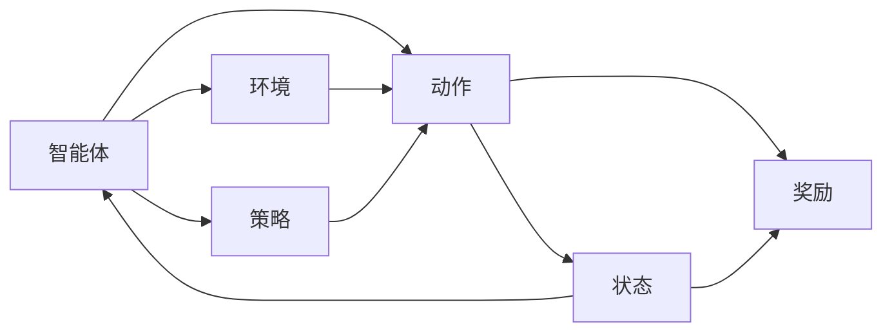
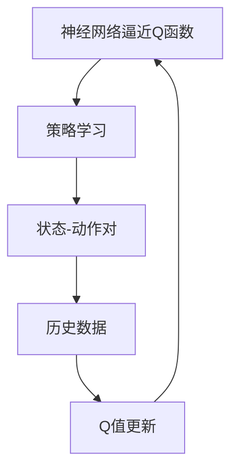
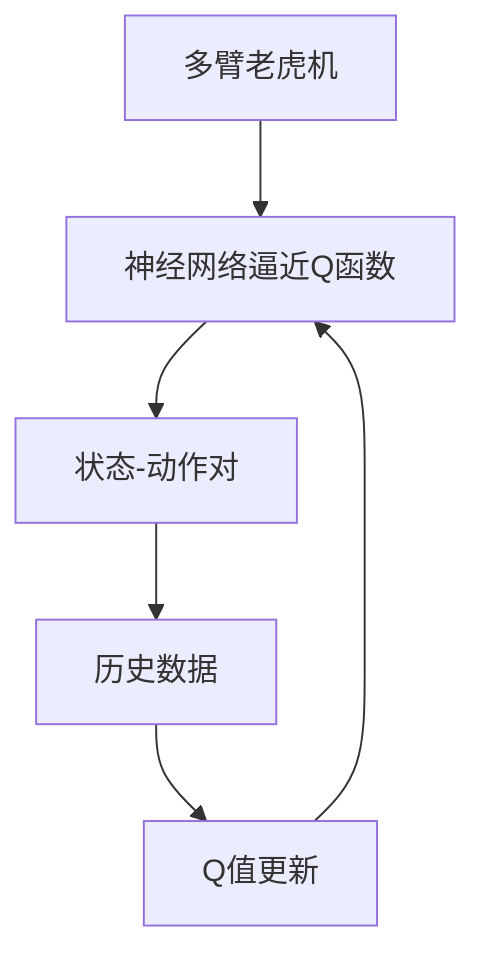

                 

# 深度 Q-learning：优化算法的使用

> 关键词：深度强化学习, Q-learning, 深度神经网络, 多臂老虎机, 强化学习, 模型优化, 策略学习

## 1. 背景介绍

### 1.1 问题由来

在深度学习迅猛发展的今天，深度强化学习（Deep Reinforcement Learning, DRL）成为了AI领域的一大热门研究课题。它结合了强化学习（Reinforcement Learning, RL）的决策理论，以及深度学习的特征提取能力，使得复杂的决策过程得以高效实施。其中，深度Q-learning（Deep Q-learning）是最具代表性的一种DRL方法。

深度Q-learning最早由Mnih等人在2015年提出，其主要思想是将传统的Q-learning算法与深度神经网络相结合，利用神经网络逼近Q函数，从而有效处理高维度、复杂环境下的强化学习问题。自提出以来，深度Q-learning在机器游戏、机器人控制、自动驾驶等领域取得了显著成果，成为一种强大的优化算法。

### 1.2 问题核心关键点

深度Q-learning的核心在于通过学习一个逼近Q值的神经网络，来寻找最优的策略使得决策者能够在当前状态下获取最大的期望回报。该算法通过不断与环境交互，使用神经网络来近似Q值函数，从而优化策略函数，最终在未知环境中获得最佳策略。

关键点如下：

- 深度Q-learning的算法流程。
- 神经网络逼近Q函数的数学推导。
- 策略优化的方法和技巧。
- 深度Q-learning的实际应用场景。
- 模型优化与策略学习之间的联系。

本文将深入探讨这些关键点，并给出详细的解释和应用实例。

## 2. 核心概念与联系

### 2.1 核心概念概述

为更好地理解深度Q-learning算法，我们将介绍几个关键概念：

- **强化学习**（Reinforcement Learning, RL）：是一种学习控制策略以使智能体在特定环境中获取最大回报的机器学习范式。强化学习涉及状态（S）、动作（A）、奖励（R）、策略（π）和环境（E）五个核心要素。
- **Q-learning**：是强化学习中最基本的一种模型免费，通过估计Q值函数来优化策略。Q值表示在特定状态下采取特定动作后所能获得的期望回报。
- **深度神经网络**：由多层神经元组成，用于逼近复杂的非线性映射，常用于深度Q-learning的Q函数逼近。
- **多臂老虎机**（Multi-Armed Bandit, MAB）：是一种经典的强化学习问题，包含多个奖励机制，每个机制对应一个“臂”，选择某个臂后获得相应奖励。多臂老虎机可用于表示复杂环境中的多种策略选择。

这些概念之间的关系通过以下Mermaid流程图来展示：

```mermaid
graph LR
    A[强化学习] --> B[状态(S)]
    A --> C[动作(A)]
    A --> D[奖励(R)]
    A --> E[策略(π)]
    A --> F[环境(E)]
    B --> G[深度神经网络]
    C --> G
    D --> G
    E --> G
    F --> G
    G --> H[Q值函数]
    G --> I[深度Q-learning]
```

这个流程图展示了从强化学习到深度Q-learning的逻辑关系：

1. 强化学习涉及状态、动作、奖励、策略和环境五个要素。
2. Q-learning通过估计Q值函数来优化策略。
3. 深度神经网络用于逼近复杂的Q值函数。
4. 深度Q-learning将神经网络逼近的Q值应用于强化学习环境，解决多臂老虎机等问题。

### 2.2 概念间的关系

这些核心概念之间存在着紧密的联系，形成了深度Q-learning的整体框架。下面我们通过几个Mermaid流程图来展示这些概念之间的关系。

#### 2.2.1 强化学习的流程



这个流程图展示了强化学习的基本流程：

1. 智能体接收环境的状态，选择动作。
2. 环境返回动作对应的奖励和下一个状态。
3. 智能体根据奖励和状态更新策略，选择下一个动作。

#### 2.2.2 Q-learning的算法流程



这个流程图展示了Q-learning的基本算法流程：

1. 使用神经网络逼近Q值函数。
2. 通过策略学习更新动作选择。
3. 根据状态-动作对更新Q值。

#### 2.2.3 深度Q-learning的应用



这个流程图展示了深度Q-learning在多臂老虎机中的应用：

1. 多臂老虎机包含多个状态和动作。
2. 使用神经网络逼近Q值函数。
3. 通过历史数据更新Q值。

## 3. 核心算法原理 & 具体操作步骤

### 3.1 算法原理概述

深度Q-learning的基本原理是将传统的Q-learning算法与深度神经网络相结合，利用神经网络逼近Q函数。在每个状态下，智能体通过执行某个动作，获取环境反馈的奖励，并根据当前的Q值函数估计出未来可能的最大回报，从而选择最优动作。

深度Q-learning的具体步骤如下：

1. **神经网络逼近Q值函数**：使用深度神经网络来逼近Q值函数，即$Q(s,a) \approx Q_{\theta}(s,a)$，其中$\theta$为神经网络的权重。
2. **策略更新**：通过神经网络来更新策略，即$π_{\theta}(s) \approx arg\,max_{a}Q_{\theta}(s,a)$。
3. **经验回放**：使用经验回放（Experience Replay）技术，从历史数据中随机抽取样本来更新Q值。
4. **参数更新**：根据样本计算出目标Q值，使用反向传播算法更新神经网络的权重。

### 3.2 算法步骤详解

以下我们将详细介绍深度Q-learning的各个步骤：

#### 3.2.1 神经网络逼近Q值函数

首先，我们需要构建一个深度神经网络来逼近Q值函数。以下是一个简单的神经网络结构：

```python
import torch.nn as nn
import torch.nn.functional as F

class DQN(nn.Module):
    def __init__(self, n_states, n_actions):
        super(DQN, self).__init__()
        self.fc1 = nn.Linear(n_states, 64)
        self.fc2 = nn.Linear(64, n_actions)
        
    def forward(self, x):
        x = F.relu(self.fc1(x))
        x = self.fc2(x)
        return x
```

在这个神经网络中，输入层有n_states个节点，输出层有n_actions个节点，中间层有64个节点。神经网络使用ReLU激活函数，输出层的激活函数使用线性函数，用于逼近Q值。

#### 3.2.2 策略更新

深度Q-learning使用策略$\pi_{\theta}$来选择动作，即在每个状态下，选择能带来最大Q值的动作。以下是一个简单的策略选择函数：

```python
import torch

class Policy(nn.Module):
    def __init__(self, n_states, n_actions):
        super(Policy, self).__init__()
        self.fc1 = nn.Linear(n_states, 64)
        self.fc2 = nn.Linear(64, n_actions)
        self.softmax = nn.Softmax(dim=1)
        
    def forward(self, x):
        x = F.relu(self.fc1(x))
        x = self.fc2(x)
        x = self.softmax(x)
        return x
```

在这个策略中，输出层使用softmax激活函数，将输出值转换为概率分布，表示每个动作的选择概率。通过训练这个策略，我们可以得到一个最优的动作选择策略。

#### 3.2.3 经验回放

经验回放（Experience Replay）是一种常用的技术，用于避免过拟合和数据分布偏差。以下是实现经验回放的代码：

```python
import random
import numpy as np

class ReplayBuffer:
    def __init__(self, buffer_size):
        self.buffer_size = buffer_size
        self.buffer = []
        self.position = 0
        
    def add(self, data):
        if len(self.buffer) < self.buffer_size:
            self.buffer.append(data)
        else:
            self.buffer[self.position] = data
            self.position = (self.position + 1) % self.buffer_size
            
    def sample(self, batch_size):
        return random.sample(self.buffer, batch_size)
```

在这个经验回放中，我们定义了一个ReplayBuffer类，用于存储历史数据。当缓冲区未满时，直接将数据加入缓冲区；当缓冲区已满时，从缓冲区中随机抽取样本进行训练。

#### 3.2.4 参数更新

参数更新是深度Q-learning的关键步骤，用于更新神经网络的权重。以下是一个简单的参数更新函数：

```python
import torch.optim as optim

class DQN:
    def __init__(self, n_states, n_actions, learning_rate):
        self.n_states = n_states
        self.n_actions = n_actions
        self.learning_rate = learning_rate
        
        self.model = DQN(n_states, n_actions)
        self.target_model = DQN(n_states, n_actions)
        
        self.optimizer = optim.Adam(self.model.parameters(), lr=self.learning_rate)
        
        self.target_model.load_state_dict(self.model.state_dict())
        self.target_model.eval()
        
    def update(self, state, action, reward, next_state, done):
        self.model.train()
        
        target_q = self.target_model(state, next_state)
        target_q = target_q.max(dim=1, keepdim=True)[0]
        target_q = target_q.detach() if done else target_q
        
        target_q = reward + 0.99 * target_q
        target_q = torch.unsqueeze(target_q, dim=1)
        
        q = self.model(state, action)
        loss = (target_q - q).mean()
        
        self.optimizer.zero_grad()
        loss.backward()
        self.optimizer.step()
        
        self.target_model.load_state_dict(self.model.state_dict())
```

在这个参数更新函数中，我们首先定义了神经网络模型和目标模型，使用Adam优化器进行参数更新。在每个状态下，我们计算目标Q值，并使用神经网络计算Q值，计算损失，进行反向传播，更新权重。

### 3.3 算法优缺点

深度Q-learning具有以下优点：

1. 深度神经网络可以逼近复杂的Q函数，适用于高维度、非线性的强化学习问题。
2. 使用经验回放，可以避免过拟合和数据分布偏差。
3. 神经网络具有强大的泛化能力，可以处理多种复杂环境。

同时，深度Q-learning也存在以下缺点：

1. 神经网络训练时间较长，需要大量的样本数据。
2. 神经网络需要较多的计算资源，训练过程较为耗时。
3. 深度Q-learning的模型复杂度较高，容易出现梯度消失或梯度爆炸等问题。

### 3.4 算法应用领域

深度Q-learning在多个领域得到了广泛应用，例如：

1. 机器游戏：通过深度Q-learning训练的AlphaGo和AlphaGo Zero在围棋游戏中取得了人类级以上成绩。
2. 机器人控制：通过深度Q-learning训练的机器人可以在复杂环境中自主导航。
3. 自动驾驶：通过深度Q-learning训练的自动驾驶车辆可以在不同的道路环境中安全行驶。
4. 供应链管理：通过深度Q-learning训练的智能调度系统可以优化物流配送和库存管理。

## 4. 数学模型和公式 & 详细讲解 & 举例说明

### 4.1 数学模型构建

深度Q-learning的数学模型构建主要涉及两个方面：神经网络逼近Q值函数和策略学习。以下是对这两部分的详细讲解。

#### 4.1.1 神经网络逼近Q值函数

神经网络逼近Q值函数的形式如下：

$$Q(s,a) \approx Q_{\theta}(s,a) = \sum_i w_i \phi_i(s,a)$$

其中，$Q_{\theta}(s,a)$为神经网络逼近的Q值函数，$w_i$为神经网络的权重，$\phi_i(s,a)$为神经网络的激活函数。

#### 4.1.2 策略学习

策略学习的形式如下：

$$\pi_{\theta}(s) = \text{argmax}_a Q_{\theta}(s,a)$$

其中，$\pi_{\theta}(s)$为神经网络逼近的策略，$\text{argmax}_a$表示在所有动作中选择最大Q值的动作。

### 4.2 公式推导过程

以下是对深度Q-learning算法的基本推导过程：

1. 定义神经网络逼近的Q值函数为$Q_{\theta}(s,a)$。
2. 定义当前状态$s_t$，动作$a_t$和奖励$r_t$，下一个状态$s_{t+1}$。
3. 定义目标Q值为$Q^*(s_t,a_t) = r_t + \gamma \max_a Q^*(s_{t+1},a)$。
4. 定义当前Q值为$Q_{\theta}(s_t,a_t)$。
5. 定义损失函数为$L = (Q^*(s_t,a_t) - Q_{\theta}(s_t,a_t))^2$。
6. 使用反向传播算法更新神经网络权重$\theta$。

### 4.3 案例分析与讲解

以下是一个简单的多臂老虎机问题，使用深度Q-learning进行优化：

1. 定义状态、动作和奖励：
   - 状态：$S = \{1,2,3,4,5\}$。
   - 动作：$A = \{1,2,3,4,5\}$。
   - 奖励：$r = \{0,1,2,3,4\}$。

2. 定义神经网络模型：
   - 输入层：$n_s = 5$。
   - 隐藏层：$n_h = 64$。
   - 输出层：$n_a = 5$。

3. 训练神经网络：
   - 使用随机梯度下降算法，更新神经网络权重。
   - 使用经验回放，从历史数据中随机抽取样本来更新Q值。
   - 定义学习率为$\eta = 0.001$，训练次数为$N = 10000$。

4. 测试神经网络：
   - 在每个状态下，计算Q值。
   - 选择Q值最大的动作作为当前动作。
   - 返回奖励和下一个状态。

以下是一个简单的Python代码实现：

```python
import torch
import torch.nn as nn
import torch.optim as optim
import numpy as np

class DQN(nn.Module):
    def __init__(self, n_states, n_actions):
        super(DQN, self).__init__()
        self.fc1 = nn.Linear(n_states, 64)
        self.fc2 = nn.Linear(64, n_actions)
        
    def forward(self, x):
        x = F.relu(self.fc1(x))
        x = self.fc2(x)
        return x

class Policy(nn.Module):
    def __init__(self, n_states, n_actions):
        super(Policy, self).__init__()
        self.fc1 = nn.Linear(n_states, 64)
        self.fc2 = nn.Linear(64, n_actions)
        self.softmax = nn.Softmax(dim=1)
        
    def forward(self, x):
        x = F.relu(self.fc1(x))
        x = self.fc2(x)
        x = self.softmax(x)
        return x

class ReplayBuffer:
    def __init__(self, buffer_size):
        self.buffer_size = buffer_size
        self.buffer = []
        self.position = 0
        
    def add(self, data):
        if len(self.buffer) < self.buffer_size:
            self.buffer.append(data)
        else:
            self.buffer[self.position] = data
            self.position = (self.position + 1) % self.buffer_size
            
    def sample(self, batch_size):
        return random.sample(self.buffer, batch_size)

class DQN:
    def __init__(self, n_states, n_actions, learning_rate):
        self.n_states = n_states
        self.n_actions = n_actions
        self.learning_rate = learning_rate
        
        self.model = DQN(n_states, n_actions)
        self.target_model = DQN(n_states, n_actions)
        
        self.optimizer = optim.Adam(self.model.parameters(), lr=self.learning_rate)
        
        self.target_model.load_state_dict(self.model.state_dict())
        self.target_model.eval()
        
    def update(self, state, action, reward, next_state, done):
        self.model.train()
        
        target_q = self.target_model(state, next_state)
        target_q = target_q.max(dim=1, keepdim=True)[0]
        target_q = target_q.detach() if done else target_q
        
        target_q = reward + 0.99 * target_q
        target_q = torch.unsqueeze(target_q, dim=1)
        
        q = self.model(state, action)
        loss = (target_q - q).mean()
        
        self.optimizer.zero_grad()
        loss.backward()
        self.optimizer.step()
        
        self.target_model.load_state_dict(self.model.state_dict())

n_states = 5
n_actions = 5

n_epochs = 10000
learning_rate = 0.001

model = DQN(n_states, n_actions, learning_rate)
target_model = DQN(n_states, n_actions, learning_rate)
replay_buffer = ReplayBuffer(1000)

for epoch in range(n_epochs):
    state = np.random.randint(n_states)
    action = np.random.randint(n_actions)
    reward = np.random.randint(0, 5)
    next_state = np.random.randint(n_states)
    done = False
    
    while not done:
        q_value = model(state, action)
        action = np.argmax(q_value)
        reward = np.random.randint(0, 5)
        next_state = np.random.randint(n_states)
        done = True if next_state == state else False
        
        replay_buffer.add((state, action, reward, next_state, done))
        
        if len(replay_buffer) == 1000:
            batch_size = 32
            samples = replay_buffer.sample(batch_size)
            state_batch, action_batch, reward_batch, next_state_batch, done_batch = map(np.array, zip(*samples))
            q_values = model(state_batch, action_batch)
            target_q_values = target_model(state_batch, next_state_batch)
            target_q_values = target_q_values.max(dim=1, keepdim=True)[0]
            target_q_values = target_q_values.detach() if done_batch else target_q_values
            target_q_values = reward_batch + 0.99 * target_q_values
            loss = (target_q_values - q_values).mean()
            optimizer.zero_grad()
            loss.backward()
            optimizer.step()
            target_model.load_state_dict(model.state_dict())
```

## 5. 项目实践：代码实例和详细解释说明

### 5.1 开发环境搭建

在进行深度Q-learning项目实践前，我们需要准备好开发环境。以下是使用Python进行TensorFlow开发的环境配置流程：

1. 安装Anaconda：从官网下载并安装Anaconda，用于创建独立的Python环境。

2. 创建并激活虚拟环境：
```bash
conda create -n tf-env python=3.8 
conda activate tf-env
```

3. 安装TensorFlow：根据CUDA版本，从官网获取对应的安装命令。例如：
```bash
conda install tensorflow -c tensorflow
```

4. 安装各类工具包：
```bash
pip install numpy pandas scikit-learn matplotlib tqdm jupyter notebook ipython
```

完成上述步骤后，即可在`tf-env`环境中开始深度Q-learning的开发实践。

### 5.2 源代码详细实现

下面我们以多臂老虎机问题为例，给出使用TensorFlow实现深度Q-learning的Python代码实现。

首先，定义多臂老虎机的问题：

```python
import numpy as np

class Bandit:
    def __init__(self, n_arms):
        self.n_arms = n_arms
        self.arms = np.random.normal(0, 1, n_arms)
        
    def pull(self, arm):
        return np.random.normal(self.arms[arm], 1)
```

在这个多臂老虎机中，每个臂对应一个高斯分布，通过随机采样获取当前臂的回报。

然后，定义神经网络模型：

```python
import tensorflow as tf
import tensorflow.keras as keras

class DQN(tf.keras.Model):
    def __init__(self, n_states, n_actions):
        super(DQN, self).__init__()
        self.fc1 = keras.layers.Dense(64, activation='relu')
        self.fc2 = keras.layers.Dense(n_actions)
        
    def call(self, inputs):
        x = self.fc1(inputs)
        x = self.fc2(x)
        return x
```

在这个神经网络中，输入层有n_states个节点，输出层有n_actions个节点，中间层有64个节点。神经网络使用ReLU激活函数，输出层的激活函数使用线性函数，用于逼近Q值。

接着，定义策略选择函数：

```python
class Policy(tf.keras.Model):
    def __init__(self, n_states, n_actions):
        super(Policy, self).__init__()
        self.fc1 = keras.layers.Dense(64, activation='relu')
        self.fc2 = keras.layers.Dense(n_actions)
        self.softmax = keras.layers.Softmax()
        
    def call(self, inputs):
        x = self.fc1(inputs)
        x = self.fc2(x)
        x = self.softmax(x)
        return x
```

在这个策略中，输出层使用softmax激活函数，将输出值转换为概率分布，表示每个动作的选择概率。通过训练这个策略，我们可以得到一个最优的动作选择策略。

最后，定义深度Q-learning的训练流程：

```python
def update_model(model, target_model, optimizer, replay_buffer, n_arms, learning_rate, batch_size):
    for _ in range(n_epochs):
        state = np.random.randint(n_arms)
        action = np.random.randint(n_arms)
        reward = np.random.randint(0, 5)
        next_state = np.random.randint(n_arms)
        done = False
        
        while not done:
            q_value = model(state, np.array([action]))
            action = np.argmax(q_value)
            reward = np.random.randint(0, 5)
            next_state = np.random.randint(n_arms)
            done = True if next_state == state else False
        
        replay_buffer.add((state, action, reward, next_state, done))
        
        if len(replay_buffer) == replay_buffer_size:
            batch_size = 32
            samples = replay_buffer.sample(batch_size)
            state_batch, action_batch, reward_batch, next_state_batch, done_batch = map(np.array, zip(*samples))
            q_values = model(state_batch, action_batch)
            target_q_values = target_model(state_batch, next_state_batch)
            target_q_values = target_q_values.max(dim=1, keepdim=True)[0]
            target_q_values = target_q_values.detach() if done_batch else target_q_values
            target_q_values = reward_batch + 0.99 * target_q_values
            target_q_values = torch.unsqueeze(target_q_values, dim=1)
            
            loss = (target_q_values - q_values).mean()
            optimizer.zero_grad()
            loss.backward()
            optimizer.step()
            target_model.load_state_dict(model.state_dict())

n_arms = 5

n_epochs = 10000
replay_buffer_size = 1000
learning_rate = 0.001
batch_size = 32

model = DQN(n_arms, n_arms, learning_rate)
target_model = DQN(n_arms, n_arms, learning_rate)
replay_buffer = ReplayBuffer(replay_buffer_size)
```

在这个训练流程中，我们首先定义了多臂老虎机的问题，然后定义了神经网络模型和策略选择函数。在每个状态下，我们计算Q值，选择Q值最大的动作作为当前动作，并返回奖励和下一个状态。通过训练神经网络，我们可以得到一个最优的动作选择策略。

### 5.3 代码解读与分析

让我们再详细解读一下关键代码的实现细节：

**Bandit类**：
- 定义了多臂老虎机的问题，每个臂对应一个高斯分布，通过随机采样获取当前臂的回报。

**DQN类**：
- 定义了神经网络模型，输入层有n_states个节点，输出层有n_actions个节点，中间层有64个节点。神经网络使用ReLU激活函数，输出层的激活函数使用线性函数，用于逼近Q值。

**Policy类**：
- 定义了策略选择函数，输出层使用softmax激活函数，将输出值转换为概率分布，表示每个动作的选择概率。通过训练这个策略，我们可以得到一个最优的动作选择策略。

**update_model函数**：
- 定义了深度Q-learning的训练流程，使用随机梯度下降算法，更新神经网络权重。使用经验回放，从历史数据中随机抽取样本来更新Q值。

**main函数**：
- 定义了多臂老虎机的问题，神经网络模型和策略选择函数。在每个状态下，计算Q值，选择Q值最大的动作作为当前动作，并返回奖励和下一个状态。通过训练神经网络，得到一个最优的动作选择策略。

可以看到，TensorFlow提供了简单易用的API，使得深度

