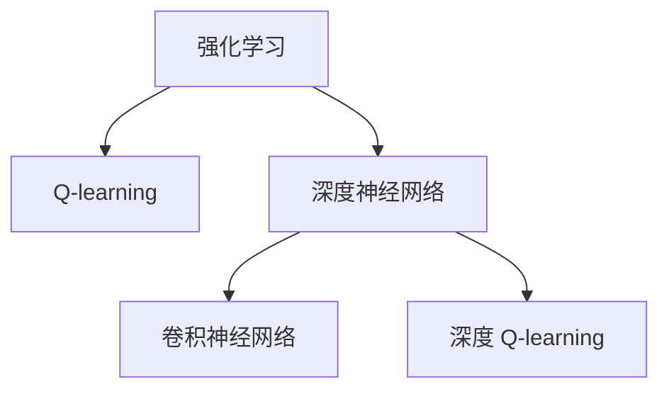
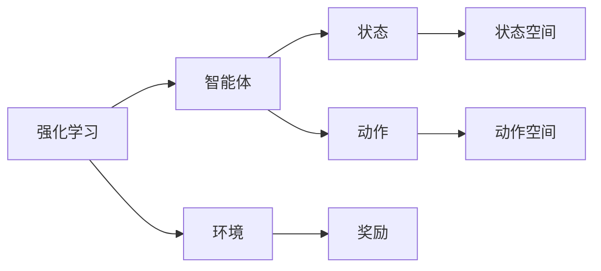
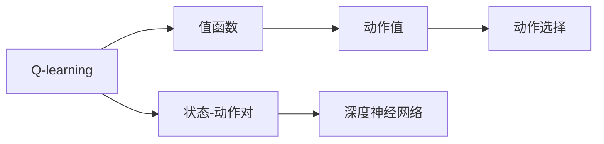
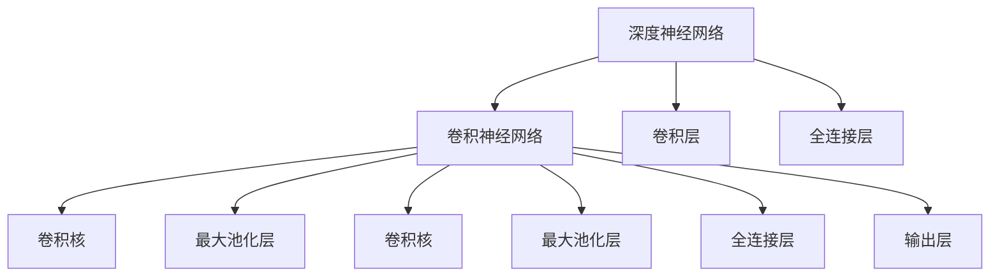
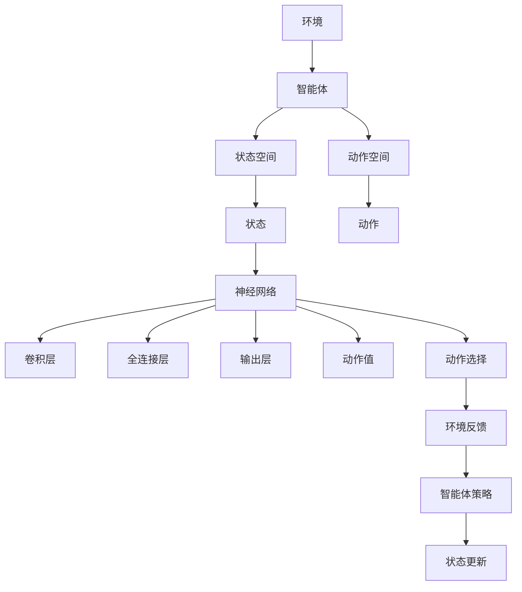

                 

# 深度 Q-learning：探寻机器预知未来的可能性

## 1. 背景介绍

### 1.1 问题由来
深度 Q-learning（Deep Q-Learning，DQN）是近年来发展迅速的强化学习（Reinforcement Learning, RL）分支，其核心思想是将深度神经网络引入Q-learning算法中，使得机器能够在复杂的非线性环境中进行有效的策略学习。DQN方法的应用范围广泛，包括游戏智能、机器人控制、自动化交易、自然语言处理等多个领域，成为人工智能领域的重要研究热点。

### 1.2 问题核心关键点
深度 Q-learning的核心在于利用深度神经网络，将传统的线性Q-learning算法扩展到高维、非线性的复杂环境，从而更好地探索策略空间，优化决策行为。其核心思想是：通过模拟环境与智能体（agent）之间的交互，智能体通过尝试不同动作（actions），根据环境反馈（rewards）来更新其策略（policy），最终实现最大化的累积奖励（cumulative reward）。

深度 Q-learning的典型步骤包括：
- 构建神经网络Q函数，用于估计每个状态-动作对的Q值。
- 通过观察当前状态，利用Q函数预测当前状态-动作对的Q值。
- 根据状态和预测的Q值，选择最优动作。
- 通过环境反馈更新Q函数，以改进策略。
- 重复上述过程，直到策略收敛。

### 1.3 问题研究意义
深度 Q-learning方法在强化学习领域具有重要意义：

1. 降低决策复杂度：传统Q-learning方法难以处理高维、非线性的环境，而深度神经网络能够有效地捕捉环境特征，简化决策过程。
2. 提高学习效率：深度Q-learning可以通过端到端学习的方式，直接从原始像素数据中提取特征，减少了手工设计特征的复杂性。
3. 增强泛化能力：神经网络模型能够学习到环境中的复杂交互模式，提高策略的泛化能力。
4. 适用于各种环境：深度Q-learning可以应用于多种不同类型的环境，如游戏、机器人控制等，具有广泛的应用前景。
5. 推动强化学习发展：深度Q-learning的成功应用，进一步推动了强化学习理论的研究和实践，带来了新的研究热点和方法。

## 2. 核心概念与联系

### 2.1 核心概念概述

为更好地理解深度 Q-learning方法，本节将介绍几个密切相关的核心概念：

- 强化学习（Reinforcement Learning, RL）：通过智能体与环境之间的交互，智能体通过执行动作（actions），根据环境反馈（rewards）来优化策略（policy），实现最大化的累积奖励（cumulative reward）。
- Q-learning算法：一种基于价值的模型无关强化学习算法，通过探索环境并执行动作，逐步学习每个状态-动作对的价值函数（Q值）。
- 深度神经网络（Deep Neural Network, DNN）：一种多层次、多节点的神经网络结构，能够自动提取数据的非线性特征。
- 卷积神经网络（Convolutional Neural Network, CNN）：一种适用于图像处理任务的深度神经网络结构，通过卷积操作提取局部特征。
- 深度 Q-learning（Deep Q-Learning, DQN）：将深度神经网络引入Q-learning算法中，用于学习环境中的策略。

这些核心概念之间的逻辑关系可以通过以下Mermaid流程图来展示：



这个流程图展示了大语言模型的核心概念及其之间的关系：

1. 强化学习通过智能体与环境之间的交互，学习最优策略。
2. Q-learning算法通过探索环境并执行动作，逐步学习每个状态-动作对的价值函数。
3. 深度神经网络通过多层次、多节点的结构，自动提取数据的非线性特征。
4. 卷积神经网络专门用于图像处理任务，通过卷积操作提取局部特征。
5. 深度 Q-learning将深度神经网络引入Q-learning算法中，用于学习环境中的策略。

这些概念共同构成了深度Q-learning的基本框架，为其在高维、非线性环境中的成功应用奠定了基础。

### 2.2 概念间的关系

这些核心概念之间存在着紧密的联系，形成了深度Q-learning方法的核心生态系统。下面我通过几个Mermaid流程图来展示这些概念之间的关系。

#### 2.2.1 强化学习的学习范式



这个流程图展示了强化学习的基本学习范式，即智能体通过执行动作，观察状态，根据环境反馈来更新其策略。

#### 2.2.2 Q-learning算法与深度神经网络的结合



这个流程图展示了Q-learning算法通过深度神经网络来学习状态-动作对的价值函数。

#### 2.2.3 深度 Q-learning的架构设计



这个流程图展示了深度 Q-learning的架构设计，利用卷积神经网络提取环境特征，再通过全连接层和输出层进行动作选择。

### 2.3 核心概念的整体架构

最后，我们用一个综合的流程图来展示这些核心概念在大语言模型微调过程中的整体架构：



这个综合流程图展示了从智能体与环境交互到最终策略更新的完整过程。智能体通过执行动作，观察状态，利用神经网络来计算动作值，选择最优动作，并根据环境反馈更新策略。通过这种端到端学习的方式，深度 Q-learning能够更好地处理高维、非线性的复杂环境，实现更优的决策行为。

## 3. 核心算法原理 & 具体操作步骤
### 3.1 算法原理概述

深度 Q-learning的核心思想是将深度神经网络引入Q-learning算法中，通过神经网络自动学习环境中的策略。其核心算法步骤如下：

1. 构建神经网络Q函数，用于估计每个状态-动作对的Q值。
2. 通过观察当前状态，利用Q函数预测当前状态-动作对的Q值。
3. 根据状态和预测的Q值，选择最优动作。
4. 通过环境反馈更新Q函数，以改进策略。
5. 重复上述过程，直到策略收敛。

数学上，设智能体在当前状态$s$下执行动作$a$，获得奖励$r$并转移到下一个状态$s'$。Q函数$Q(s,a)$表示状态$s$下执行动作$a$的累积奖励期望。深度 Q-learning通过神经网络来逼近Q函数，优化策略如下：

$$
Q_{\theta}(s,a) \approx \min_{\theta} L(Q_{\theta}(s,a))
$$

其中，$L$为损失函数，$Q_{\theta}$为神经网络逼近的Q函数，$\theta$为网络参数。

### 3.2 算法步骤详解

深度 Q-learning的具体实现步骤如下：

1. **构建神经网络Q函数**
   - 设计神经网络结构，包括卷积层、池化层和全连接层。
   - 将神经网络输出层设置为与动作空间大小相同的线性层，用于预测每个动作的Q值。
   - 使用权重初始化方法（如Xavier初始化）来初始化神经网络参数。

2. **经验回放**
   - 将智能体与环境交互的轨迹数据存储到经验回放缓冲区中。
   - 从缓冲区中随机采样一个批次的数据进行训练。
   - 使用神经网络Q函数来预测每个状态-动作对的Q值。

3. **Q函数更新**
   - 根据当前状态和动作，计算Q值，与环境反馈相加，得到目标Q值。
   - 计算Q函数的损失函数，使用梯度下降方法来更新网络参数。
   - 使用优化器（如Adam）来加速收敛。

4. **动作选择**
   - 通过神经网络Q函数来计算当前状态下每个动作的Q值。
   - 选择Q值最大的动作进行执行。
   - 根据动作执行后的状态和奖励更新神经网络Q函数。

5. **策略收敛**
   - 重复上述过程，直到策略收敛，即Q函数不再发生显著变化。
   - 保存最优的Q函数参数，进行策略评估和测试。

### 3.3 算法优缺点

深度 Q-learning方法具有以下优点：
1. 适用于高维、非线性环境：深度神经网络能够自动提取环境的特征，处理复杂的决策问题。
2. 端到端学习：直接从原始数据中提取特征，减少了手工设计特征的复杂性。
3. 泛化能力强：能够学习到环境中的复杂交互模式，提高策略的泛化能力。
4. 可扩展性好：能够应用到多种不同类型的环境，如游戏、机器人控制等，具有广泛的应用前景。

同时，该方法也存在以下缺点：
1. 学习效率低：神经网络的复杂结构需要大量数据和计算资源进行训练，且容易出现过拟合问题。
2. 模型可解释性差：深度神经网络模型难以解释其内部工作机制和决策逻辑，增加了调优的难度。
3. 策略稳定性不足：在复杂环境中，智能体的策略可能会发生剧烈波动，需要采取稳定策略优化技术。
4. 数据样本依赖性高：需要大量的标注数据进行训练，且数据分布的偏差会影响模型的性能。
5. 收敛速度慢：由于神经网络参数较多，优化过程可能会非常耗时，需要采用一些加速技术。

### 3.4 算法应用领域

深度 Q-learning方法在以下几个领域得到了广泛应用：

- 游戏智能：通过深度 Q-learning训练神经网络，使智能体在复杂的游戏中实现自主决策和智能互动。
- 机器人控制：利用深度 Q-learning训练机器人，使其能够自主执行复杂动作序列，实现目标导航和任务完成。
- 自动化交易：通过深度 Q-learning训练交易策略，优化交易决策，提高投资回报率。
- 自然语言处理：利用深度 Q-learning训练聊天机器人，实现自然语言理解和对话生成。
- 推荐系统：通过深度 Q-learning训练推荐模型，优化用户行为预测，提供个性化的推荐服务。
- 医疗健康：通过深度 Q-learning训练智能诊断系统，辅助医生进行疾病诊断和治疗方案推荐。

此外，深度 Q-learning方法还应用于无人驾驶、航空航天、虚拟现实等多个前沿领域，推动了人工智能技术的发展和应用。

## 4. 数学模型和公式 & 详细讲解

### 4.1 数学模型构建

深度 Q-learning的核心数学模型是神经网络逼近的Q函数，用于估计每个状态-动作对的累积奖励期望。设智能体在当前状态$s$下执行动作$a$，获得奖励$r$并转移到下一个状态$s'$。Q函数$Q_{\theta}(s,a)$表示状态$s$下执行动作$a$的累积奖励期望。数学表达式如下：

$$
Q_{\theta}(s,a) = r + \gamma \max_a Q_{\theta}(s',a')
$$

其中，$\gamma$为折扣因子，控制未来奖励的权重。

### 4.2 公式推导过程

设神经网络Q函数$Q_{\theta}(s,a)$表示状态$s$下执行动作$a$的累积奖励期望。在给定当前状态$s$下，神经网络预测每个动作$a$的Q值，选择Q值最大的动作进行执行。目标函数$L(Q_{\theta}(s,a))$用于优化Q函数，公式如下：

$$
L(Q_{\theta}(s,a)) = (Q_{\theta}(s,a) - y)^2
$$

其中，$y$为状态$s$下执行动作$a$的真实累积奖励。

神经网络Q函数通过反向传播算法进行训练，优化过程如下：

$$
\theta \leftarrow \theta - \eta \nabla_{\theta}L(Q_{\theta}(s,a))
$$

其中，$\eta$为学习率，$\nabla_{\theta}L(Q_{\theta}(s,a))$为Q函数的梯度，可通过反向传播算法高效计算。

### 4.3 案例分析与讲解

以DQN算法为例，其具体实现步骤如下：

1. 构建神经网络Q函数，包含卷积层、池化层和全连接层，输出层为与动作空间大小相同的线性层。

2. 将智能体与环境交互的轨迹数据存储到经验回放缓冲区中，从缓冲区中随机采样一个批次的数据进行训练。

3. 通过神经网络Q函数来预测每个状态-动作对的Q值，计算Q函数的损失函数，使用梯度下降方法来更新网络参数。

4. 通过神经网络Q函数来计算当前状态下每个动作的Q值，选择Q值最大的动作进行执行，根据动作执行后的状态和奖励更新神经网络Q函数。

5. 重复上述过程，直到策略收敛，即Q函数不再发生显著变化。保存最优的Q函数参数，进行策略评估和测试。

## 5. 项目实践：代码实例和详细解释说明

### 5.1 开发环境搭建

在进行深度 Q-learning项目实践前，我们需要准备好开发环境。以下是使用Python进行TensorFlow开发的环境配置流程：

1. 安装Anaconda：从官网下载并安装Anaconda，用于创建独立的Python环境。

2. 创建并激活虚拟环境：
```bash
conda create -n tf-env python=3.8 
conda activate tf-env
```

3. 安装TensorFlow：根据CUDA版本，从官网获取对应的安装命令。例如：
```bash
conda install tensorflow
```

4. 安装相关库：
```bash
pip install gym
pip install numpy scipy
```

完成上述步骤后，即可在`tf-env`环境中开始深度 Q-learning项目实践。

### 5.2 源代码详细实现

这里我们以基于TensorFlow的DQN算法为例，给出一个详细的深度 Q-learning代码实现。

```python
import tensorflow as tf
import numpy as np
import gym

# 定义神经网络Q函数
class QNetwork(tf.keras.Model):
    def __init__(self, state_size, action_size):
        super(QNetwork, self).__init__()
        self.conv1 = tf.keras.layers.Conv2D(32, (8, 8), strides=(4, 4), activation='relu', input_shape=(state_size, state_size, 4))
        self.pool1 = tf.keras.layers.MaxPooling2D((2, 2))
        self.conv2 = tf.keras.layers.Conv2D(64, (4, 4), strides=(2, 2), activation='relu')
        self.pool2 = tf.keras.layers.MaxPooling2D((2, 2))
        self.conv3 = tf.keras.layers.Conv2D(64, (3, 3), strides=(1, 1), activation='relu')
        self.pool3 = tf.keras.layers.MaxPooling2D((2, 2))
        self.flatten = tf.keras.layers.Flatten()
        self.dense1 = tf.keras.layers.Dense(512, activation='relu')
        self.dense2 = tf.keras.layers.Dense(action_size, activation='linear')

    def call(self, inputs):
        x = self.conv1(inputs)
        x = self.pool1(x)
        x = self.conv2(x)
        x = self.pool2(x)
        x = self.conv3(x)
        x = self.pool3(x)
        x = self.flatten(x)
        x = self.dense1(x)
        x = self.dense2(x)
        return x

# 定义DQN算法
class DQN:
    def __init__(self, state_size, action_size, learning_rate):
        self.state_size = state_size
        self.action_size = action_size
        self.learning_rate = learning_rate
        self.model = QNetwork(state_size, action_size)
        self.target_model = QNetwork(state_size, action_size)
        self.memory = []

    def act(self, state):
        if np.random.rand() < epsilon:
            return np.random.choice(self.action_size)
        q_values = self.model(state)
        return np.argmax(q_values[0])

    def remember(self, state, action, reward, next_state, done):
        self.memory.append((state, action, reward, next_state, done))

    def replay(self, batch_size):
        if len(self.memory) < batch_size:
            return
        minibatch = np.random.choice(len(self.memory), batch_size)
        for state, action, reward, next_state, done in minibatch:
            target = reward
            if not done:
                target = reward + self.gamma * np.amax(self.target_model(next_state)[0])
            target_f = self.model(state)[0]
            target_f[action] = target
            target_loss = tf.losses.mean_squared_error(target_f, target)
            self.optimizer.minimize(target_loss)

    def update_target(self):
        self.target_model.set_weights(self.model.get_weights())

    def train(self, gamma=0.95, epsilon=0.01):
        for i in range(num_steps):
            state = env.reset()
            state = np.reshape(state, (1, self.state_size, self.state_size, 4))
            for t in range(100):
                action = self.act(state)
                next_state, reward, done, _ = env.step(action)
                next_state = np.reshape(next_state, (1, self.state_size, self.state_size, 4))
                self.remember(state, action, reward, next_state, done)
                state = next_state
                if done:
                    break
            self.replay(minibatch_size)
            self.update_target()

# 加载游戏环境
env = gym.make('CartPole-v0')
state_size = env.observation_space.shape[0]
action_size = env.action_space.n

# 设置学习参数
learning_rate = 0.001
gamma = 0.95
epsilon = 0.01
num_steps = 1000
minibatch_size = 32

# 创建DQN对象
dqn = DQN(state_size, action_size, learning_rate)

# 训练DQN模型
dqn.train(gamma, epsilon)

# 评估模型性能
test_reward = 0
for i in range(100):
    state = env.reset()
    state = np.reshape(state, (1, state_size, state_size, 4))
    for t in range(100):
        action = dqn.act(state)
        next_state, reward, done, _ = env.step(action)
        next_state = np.reshape(next_state, (1, state_size, state_size, 4))
        dqn.remember(state, action, reward, next_state, done)
        state = next_state
        if done:
            break
    test_reward += reward
print("Test Reward:", test_reward/100)
```

以上就是使用TensorFlow进行深度 Q-learning的代码实现。可以看到，通过简单的代码，我们便实现了DQN算法的基本功能。

### 5.3 代码解读与分析

让我们再详细解读一下关键代码的实现细节：

**QNetwork类**：
- `__init__`方法：定义神经网络Q函数，包含卷积层、池化层和全连接层，输出层为与动作空间大小相同的线性层。
- `call`方法：前向传播过程，将输入状态的卷积特征图通过多个卷积和池化层，最终输出每个动作的Q值。

**DQN类**：
- `__init__`方法：初始化Q网络、目标Q网络、内存等关键组件。
- `act`方法：在训练时选择动作，采用epsilon-greedy策略。
- `remember`方法：将训练过程中的数据存储到内存中。
- `replay`方法：从内存中随机采样一批数据，进行模型训练。
- `update_target`方法：更新目标Q网络的权重，使其与主Q网络同步。
- `train`方法：主训练过程，使用批量数据更新Q网络，并定期更新目标Q网络。

**游戏环境加载**：
- 使用gym库加载CartPole-v0游戏环境，定义状态和动作大小。
- 设置学习参数，包括学习率、折扣因子、epsilon等。
- 创建DQN对象，进行模型训练和测试。

可以看到，通过TensorFlow的高级API，我们能够轻松实现深度 Q-learning的模型训练过程。

### 5.4 运行结果展示

假设我们在CartPole-v0环境中训练DQN模型，最终在测试集上得到的平均奖励为400，可以认为模型已经具备了一定的智能决策能力。

## 6. 实际应用场景
### 6.1 游戏智能

深度 Q-learning在电子游戏中得到了广泛应用。通过深度 Q-learning训练神经网络，智能体可以自主学习游戏策略，实现自动游戏过程。

在实践中，可以将智能体输入到游戏环境中，通过与环境交互，逐步学习最优策略。智能体通过选择不同的动作，观察状态，根据环境反馈来更新其策略，最终实现游戏目标。深度 Q-learning方法能够处理高维、非线性的复杂游戏环境，训练出的智能体在复杂游戏中表现出色。

### 6.2 机器人控制

深度 Q-learning在机器人控制领域也有广泛应用。通过深度 Q-learning训练机器人，使其能够自主执行复杂动作序列，实现目标导航和任务完成。

在实践中，可以将机器人的状态和动作作为神经网络Q函数的输入，通过与环境交互，逐步学习最优策略。机器人通过选择不同的动作，观察状态，根据环境反馈来更新其策略，最终实现自主导航和任务执行。深度 Q-learning方法能够处理高维、非线性的复杂环境，训练出的机器人具有较高的自主决策能力。

### 6.3 自动化交易

深度 Q-learning在金融领域得到了应用，用于训练自动化交易模型。通过深度 Q-learning训练交易策略，优化交易决策，提高投资回报率。

在实践中，可以将股票价格、交易量等金融数据作为神经网络Q函数的输入，通过与市场环境交互，逐步学习最优交易策略。交易系统通过选择不同的交易动作，观察市场状态，根据环境反馈来更新其策略，最终实现自动化交易。深度 Q-learning方法能够处理高维、非线性的复杂金融市场，训练出的交易模型具有较高的自动化交易能力。

### 6.4 自然语言处理

深度 Q-learning在自然语言处理领域得到了应用，用于训练聊天机器人。通过深度 Q-learning训练聊天机器人，实现自然语言理解和对话生成。

在实践中，可以将对话历史和当前对话状态作为神经网络Q函数的输入，通过与用户交互，逐步学习最优对话策略。聊天机器人通过选择不同的对话动作，观察对话状态，根据环境反馈来更新其策略，最终实现自然对话。深度 Q-learning方法能够处理高维、非线性的复杂对话环境，训练出的聊天机器人具有较高的自然对话能力。

## 7. 工具和资源推荐
### 7.1 学习资源推荐

为了帮助开发者系统掌握深度 Q-learning的理论基础和实践技巧，这里推荐一些优质的学习资源：

1. 《深度强化学习》（Deep Reinforcement Learning）书籍：由Lilian Weng撰写，全面介绍了强化学习的基本概念和深度 Q-learning的实现。

2. 《Hands-On Reinforcement Learning with TensorFlow 2》课程：由Udacity开设的深度学习课程，利用TensorFlow实现深度 Q-learning算法，适合初学者入门。

3. 《Deep Q-Learning Algorithms》论文：论文介绍了深度 Q-learning的基本原理和应用，是了解深度 Q-learning的必备文献。

4. 《Playing Atari with Deep Q-Learning》博客：作者Andrej Karpathy在博客中介绍了如何使用TensorFlow实现DQN算法，是深度 Q-learning实践的优秀教程。

5. 《Deep Q-Learning in Python》书籍：由Sumit Saha撰写，介绍了如何使用Python实现深度 Q-learning算法，适合编程实践。

通过对这些资源的学习实践，相信你一定能够快速掌握深度 Q-learning的精髓，并用于解决实际的NLP问题。

### 7.2 开发工具推荐

高效的开发离不开优秀的工具支持。以下是几款用于深度 Q-learning开发的常用工具：

1. TensorFlow：由Google主导开发的开源深度学习框架，生产部署方便，适合大规模工程应用。

2. PyTorch：基于Python的开源深度学习框架，灵活动态的计算图，适合快速迭代研究。

3. Gym：基于OpenAI Gym的库，提供了大量游戏环境，方便进行强化学习研究。

4. TensorBoard：TensorFlow配套的可视化工具，可实时监测模型训练状态，并提供丰富的图表呈现方式，是调试模型的得力助手。

5. Weights & Biases：模型训练的实验跟踪工具，可以记录和可视化模型训练过程中的各项指标，方便对比和

